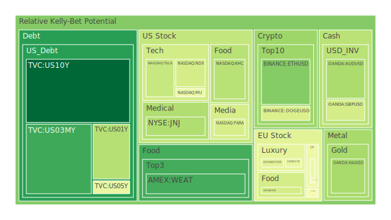
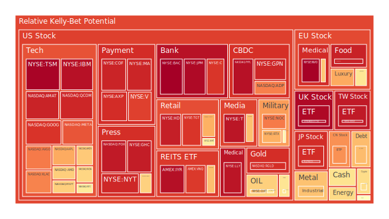
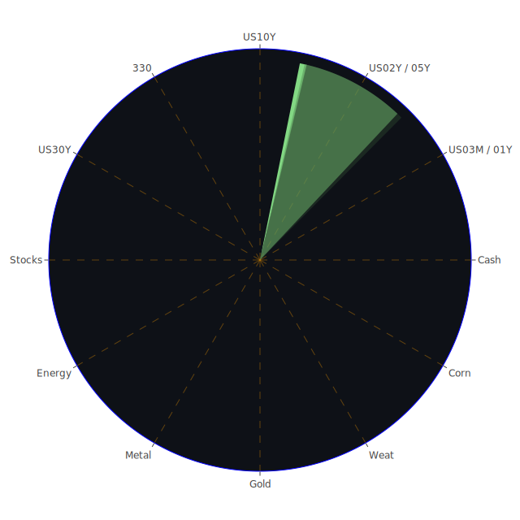

# （一）投資商品泡沫分析

下列針對各主要資產類別，綜合近期市場消息、歷史類似場景、心理預期、博弈論下的角色行為、與所示泡沫指數 (D1、D7、D14、D30) 的走勢作評估。特別留意「泡沫分數」較高區段可能暗示市場對某些標的已有過度槓桿或過度樂觀的傾向，也會根據新聞事件帶來的正面或負面情緒，評斷是否對該標的的價格產生顯著衝擊。此外，會同時考慮到資產與資產間的相關係數，以及可能的對沖機會。

## 1. 美國國債
以整體美國國債來看，10年期 (US10Y) 與2年期 (US02Y) 乃至3個月期 (US03MY) 的殖利率都顯示近月有微幅上升或動盪；根據最近數據，10年期殖利率約4.49%，2年期約4.29%，3個月期約4.34%。相較一年前的收益率曲線，目前已呈現某種程度的趨平或小幅轉正，顯示市場對未來通膨預期開始趨於分歧：短期仍有美聯儲政策的壓力，但長端債券市場也隱含景氣或通膨壓力的緩和可能。新聞層面來看，沒有明顯提振美國國債需求的重大事件，但整體金融環境對「相對安全資產」的需求仍在。歷史相似場景可參考2008年後期或是2019年當市場面臨經濟下行風險時，長債被視為避險區塊。短債部分(例如1年期 US01Y、2年期 US02Y) 的D1分數曾一度偏高，意味市場一度擔憂短期波動；然而，中長期來看，市場亦關注美國財政壓力在長端殖利率的影響。  
整體而言，美國國債仍被視為較具穩定度的投資標的，但泡沫風險並不高。然而，若政治風險或政府債務問題在未來升溫 (例如舉債上限協商遇阻)，也可能引起殖利率劇烈波動，需審慎留意。

## 2. 美國零售股
美國零售股 (如WMT、TGT) 在近幾個交易日面臨業績預期與經濟環境的雙重考驗。新聞面提及，有些零售商因消費力道尚不穩定而承壓，亦有報導指出通路或物流成本端出現不確定因素。從泡沫分數觀察，Target (TGT) 一度達到0.94以上，顯示市場對此標的抱持相對高度風險認知。歷史上，零售股在經濟景氣轉折之際常出現超漲或超跌的情形，典型案例如2008年底金融危機期間與2020年初疫情期間的零售業股價大幅波動。近期多項新聞對零售前景多數持負面觀點(如關於電動車、通膨、關稅政策的綜合衝擊)，市場也因消費者可能縮減支出而持保守態度。  
若從博弈論角度看，美國零售股在「價格戰」或「折扣策略」上面臨同業間的激烈競爭，亦受到宏觀環境 (包含預算赤字、貨幣緊縮) 的影響。建議投資人留意下行風險及潛在的估值修正。

## 3. 美國科技股
美國科技類股，包含龍頭如AAPL、MSFT、GOOG、META、NVDA、AMZN，以及半導體如AMD、INTC、KLAC、QCOM等，近來泡沫指數大多居於相對高位。例如AAPL一度接近0.79-0.80以上，更出現0.99的警示值區間；NVDA、AMD雖有些回落，但前段時間的漲幅仍顯得迅猛。新聞層面顯示AI需求仍被多家企業視為成長動能，但也有一些報導指出資金對於技術密集度高的部門開始產生質疑，尤其是「DeepSeek」這個中國AI新創的動向與美國AI供應鏈之間的競爭或制裁變數，讓市場不確定情緒升溫。此外，蘋果(AAPL) 近年來對供應鏈外移的掌控，與微軟(MSFT) 在雲端及AI領域的大舉佈局，都在短線上拉升了投資者對科技股的期待。歷史相似場景包含2000年科網泡沫與2021年疫情後「宅經濟」帶動的網路股飆漲。  
然而，科技股對消息面極其敏感，一旦美國或各國政府擴大對AI、半導體與高階製程科技進行管制，或企業財報不及市場預期，便可能引發另一波回調風險。因此，雖然該領域仍具長期成長潛力，但投資者不可輕忽目前已處在高估或泡沫風險區的可能性。

## 4. 美國房地產指數
美國整體房地產指數 (如RWO、VNQ、IYR) 近期泡沫分數有些偏高，特別是VNQ、IYR曾在0.90上下徘徊。歷史參照2006-2008年美國房地產泡沫，當時REITs及相關不動產證券化產品經歷了顯著的高估後大幅修正。近期新聞顯示，房貸利率正處在相對高點 (30年固定房貸利率已達到6.89%)，對房市將產生抑制效應。此外，美國商業地產面臨重新定價，亦有一些商業房地產抵押貸款即將到期。根據FED提供的「Commercial Real Estate Delinquent」數據相當高，增加了潛在風險。當全球資金流開始從房地產撤離時，市場上會出現大量拋售壓力，且在利率尚未轉趨寬鬆的背景下，美國房地產後續走勢不容樂觀。  
在博弈論下，若租金仍堅挺，或城市化帶來的長期住房需求維持，部分地區房價可能企穩或微漲。然而，整體經濟若進入放緩期，失業率上升與消費力下降通常也對房地產估值構成逆風。短期來看，房地產資產易受整體市場風險情緒衝擊，存在評價下修的空間。

## 5. 加密貨幣
以BTC與ETH等加密資產觀察，根據所提供的價格與D1、D7、D14、D30泡沫分數，ETH曾在0.40上下，BTC在0.61左右，DOGE在0.55上下，顯示市場對主要加密資產風險偏好明顯高企，但也不算泡沫最嚴重的區域。新聞面提及BTC在遇到某些宏觀利空時仍能短期反彈(例如2025-02-08指出比特幣單日上漲2%)，這種走勢可能與投資者視加密貨幣為另類避險或投機資產有關。歷史場景顯示，加密貨幣多次上演大幅漲跌，如2017年底到2018年初的狂熱與崩跌、2021年的Defi熱潮與之後的修正，都提醒投資者需警惕高波動與監管風險。  
目前全球對加密資產的監管問題仍未定案，有些國家加強管制，有些國家加速推動合法化。博弈論角度下，加密資產的心理預期甚大程度依賴投資者「共識」與「對未來金融體系的想像」。雖然市場流動性環境相對寬鬆時，投機狂潮容易再起，但也易受總體資金面、政府政策收縮等因素干擾，建議對此類標的須嚴格控管風險。

## 6. 金/銀/銅
金(XAUUSD)的泡沫指數在0.30-0.40區間，銀(XAGUSD)在0.70-0.80區間，銅(COPPER)約在0.42-0.60間，顯示近期金較為溫和、銀和銅則處在相對高的波動與泡沫風險跡象。歷史上，黃金通常作為通膨或地緣政治的避險資產，但從近期新聞可見通膨雖未完全結束，但已失去爆炸性增長的態勢，一定程度上壓抑金價上行動能。銀同時受工業需求及貴金屬屬性的雙重影響，易隨全球景氣的變動而有較大幅度波動。銅作為工業金屬，其價格往往代表市場對未來基建與製造業需求的預期，若全球景氣轉弱，銅的消費將受影響。但部分國家如中國可能進行基建刺激，這類政策又會拉抬銅需求。  
值得留意的是，近日新聞亦顯示投資人對經濟前景不確定性增長，而GOLD OIL RATIO上升至約40.32，GOLD COPPER RATIO也大約在623以上，與去年相比有明顯變化，暗示黃金相對於石油和銅的價格定位出現一些偏離。投資者應密切注意全球地緣政治與央行購金行為對金銀走勢的影響。

## 7. 黃豆 / 小麥 / 玉米
觀察到WEAT、SOYB、CORN等農產品ETF，泡沫指數雖在中低檔，但依舊有超過0.50以上的區域，顯示需求端和天候、地緣政治都會帶來波動。新聞顯示亞洲地區多處氣候異常、歐洲部分農地在保護法規影響下產量有所下滑，美國農業機構則報告客戶端的庫存狀況不穩。歷史上，農產品常出現於戰亂或經濟制裁期間的極端漲勢與缺貨風險；反之，若國際貿易平順供給充足，也可能有明顯回跌。  
就博弈論而言，農業大宗商品容易受到產地天災、貿易政策、糧食安全策略的影響，出口國與進口國之間對關稅或補貼的施加也將改變全球農糧價格走勢。投資農產品具有對衝通膨的功能，但流動性通常較資本市場為低，且易受非經濟性因素劇烈干擾。

## 8. 石油 / 鈾期貨
石油(USOIL)的泡沫指數約在0.55-0.62區間，顯示出市場對原油需求的矛盾：一方面，全球需求可能因地緣與經濟疑慮而放緩；另一方面，OPEC+減產或局部衝突亦可能推升油價。近期新聞提及特朗普新關稅的風聲再起，市場擔心全球貿易遇到阻力，可能打擊石油需求，造成油價下跌。歷史上，石油價格曾在2008年達到高峰，之後於金融危機中大幅下滑。2020年初疫情時期，油價甚至一度出現負值期貨。現在雖難到負值，但波動仍劇。  
鈾期貨(UX)泡沫分數約在0.40-0.55左右，雖不算高，但近期核能話題被再度拿出來討論，尤其地緣動盪與全球綠能轉型的同時，各國對核能是否採取積極立場尚未明朗。歷史上一旦各國政府決定提高核電占比，鈾需求可能快速升溫；相反地，若發生嚴重核事故或政治壓力，需求又會受到衝擊。

## 9. 各國外匯市場
常見貨幣對如EURUSD、GBPUSD、AUDUSD、USDJPY等在D1泡沫分數多處中高範圍(如AUDUSD在0.33上下，GBPUSD在0.40以上，USDJPY則在0.53-0.75之間)，顯示各主要國家利率政策、經常帳、通膨差異，都牽動著匯率走勢。新聞面方面，關於「可能的關稅措施」、「地緣衝突」都對美元需求或歐元區經濟帶來不確定性。回顧歷史，每當美國啟動強化利率週期、美元通常走強，非美貨幣易受衝擊，造成資金回流美元、國際市場震盪。  
鑑於全球各央行政策分歧度高，匯市的博弈也愈加複雜。對於大型跨國企業或需要外匯對沖的投資人，建議密切關注各國宏觀基本面及政治消息的交互影響。

## 10. 各國大盤指數
包含NASDAQ指數(NDX)、FTSE、GDAXI、FCHI、日經225(JPN225)、中國大盤(000300)等，近期泡沫分數整體偏高，尤其是FTSE一度達到0.98以上，GDAXI也飆升至約0.87，JPN225則約在0.90上下。歷史證明，當全球主要股市同時處於高估值階段，往往隨著資金輪動與政策壓力出現同步下修的風險。新聞面也暗示全球經濟雖然尚未衰退，但大型區域間的關稅爭端及供應鏈分散正在進行，市場對前景樂觀與悲觀情緒的差距拉大。  
日本股市（JPN225）在海外投資者的追捧下，於前陣子創下階段性高點。然而，在美元指數高企、以及日本央行政策立場不夠明朗的情況下，熱錢若撤出，回調壓力也不容小覷。歐洲股市方面(如GDAXI、FCHI、FTSE)，近來也面臨地緣政治、歐洲內部經濟結構性問題的考驗。一旦風險情緒攀升，歐洲市場將首當其衝。

## 11. 美國半導體股
AMD、INTC、NVDA、KLAC、QCOM、AMAT等標的普遍處於中高區間泡沫分數，有些甚至超過0.90。新聞面經常提到AI、電動車、智慧裝置等需求，拉高了對晶片與製造設備的預期，但近期又有報導指出產能過剩、庫存調整、地緣限制等議題。博弈論觀點下，美中科技競爭的制裁與反制裁，反映在企業對先進製程的佈局謹慎度大增，一旦貿易管制更加嚴格，可能使供應鏈受限，進而影響營收。歷史上，半導體股曾在2000年網路泡沫、2008年金融海嘯、2020年疫情爆發時都出現劇烈漲跌，在景氣與技術革命的拉扯下，波動度通常遠高於大盤。

## 12. 美國銀行股
美國銀行股(BAC、C、JPM、WFC等) 整體泡沫指數也大多偏高，JPM曾接近0.98，BAC也高達0.99上下，暗示市場對銀行業似乎抱有高度樂觀預期。但FED貨幣收緊循環尚未畫下句點，銀行雖能享受利差擴大的好處，但同時也面臨潛在貸款違約風險升溫，包含信用卡、商業地產等違約率上升，都可能壓低未來獲利。新聞面中提到，貸款充提比上升、銀行信用風險指標上揚，若違約開始顯現，市場情緒可能迅速翻轉。歷史經驗如2007-2008年，銀行股在泡沫化階段一度榮景無比，但危機爆發時股價跌幅驚人。建議對此板塊提高警惕。

## 13. 美國軍工股
NOC、RTX、LMT等泡沫分數由前期約0.65-0.80之間，目前雖稍微回落但仍處於偏高區域。以新聞消息觀之，全球地緣衝突的頻率並未減少，美國及北約對武器需求仍高，若爆發更多地區衝突，此板塊短期或具抗跌性。但需留意的是，軍工股對預算案與國防政策依賴度高，如果政治風向轉變，經費削減，亦可能衝擊獲利前景。歷史上軍工股常有高估現象，市場對「戰爭風險溢價」往往過度敏感，一旦消息冷卻股價也會明顯走弱。

## 14. 美國電子支付股
V、MA、PYPL、GPN等多家電子支付公司泡沫分數普遍在0.87-0.96，足見市場對消費復甦以及線上支付、跨境電商需求的期望。有報導指出部分地區網購增長放緩，但也有數據說明美國信用卡消費仍在攀升。然而，若經濟趨緩或信用卡違約率攀升，對這些支付系統的交易額恐構成負面衝擊。從博弈論觀點來看，支付產業各家龍頭在手續費與商戶拓展方面不斷角力，是否出現更多金融科技競爭者(例如區塊鏈支付平台) 也是一大變數。歷史上，電子支付概念在2010年後迅速竄起，但其估值已多次被市場檢驗，一旦成長預期下調，修正通常劇烈。

## 15. 美國藥商股
MRK、JNJ、LLY、NVO等，泡沫分數從0.34-0.99不等，差異巨大。JNJ似乎處於中等風險區，LLY與NVO則偏高值。新聞觀點指出，人口老化與慢性病仍是需求支柱，但長期利率攀升會拉高研發資金成本。近年又有政策壓力對藥價設限，可能壓抑藥企毛利空間。歷史上，藥商股在大盤震盪時常被視為防禦標的，但若本身估值過高，也會被資金面連動回調。投資人宜觀察各家藥廠在研發管線的進展，以及與保險制度、政府政策的交互影響。

## 16. 美國影視股
DIS、CMCSA、PARA、NFLX、FOX等，泡沫分數大多是中高檔區。DIS雖一度報告流媒體用戶增長放緩，但公司自身在實體娛樂(主題樂園等) 依舊有營收貢獻。NFLX則在前期大漲後面臨成長乏力質疑。短期新聞顯示，電視、電影行業依舊受到罷工、版權爭議、付費訂閱疲軟等多重壓力。歷史來看，影視股在消費者信心穩定時表現通常不錯，但在競爭激烈與創新商業模式衝擊下，部分公司市佔可能萎縮。

## 17. 美國媒體股
NYT、GHC等媒體新聞集團，泡沫指數也不低，約在0.75-0.94。近來傳統媒體廣告收入面臨社群與串流平台強力競爭，另有政治與社會議題衝擊媒體信用度。歷史經驗指出，若用戶付費模式未能成功轉型，或廣告市場整體萎縮，媒體股將出現持續性下行；反之，若特定媒體品牌成功拓展訂閱市場或國際營收，也可能一枝獨秀。

## 18. 石油防禦股
XOM、OXY等油氣類公司，泡沫指數曾高達0.77以上。近期石油需求雖有雜音，油價也出現周線連跌，但市場對國防、戰略儲備及政治角力的預期，使得石油防禦概念股仍有支撐。石油供應鏈風險 (如管線破壞、禁運) 也往往使這些公司股價易於受炒作。歷史如1970年代的石油危機、1991年海灣戰爭、2022年俄烏衝突，都讓市場重新評估石油股的戰略地位。

## 19. 金礦防禦股
RGLD、NEM等金礦公司通常跟著金價波動，但因包含生產成本、人力管理、環境規範等因素，投資風險更大。RGLD的泡沫指數也到0.90上下，在市場避險情緒高漲時往往吸金，但利率飆升周期會提高企業融資成本，且金價不一定足以抵消成本提高。以歷史來看，金礦股常在金融市場震盪時獲得關注，但當動能消退時，亦容易大幅回吐漲幅。

## 20. 歐洲奢侈品股
MC、KER、RMS等，泡沫分數在0.44-0.83之間，波動幅度較大。奢侈品在疫情緩和後迎來報復性消費，但現階段全球經濟前景稍有雲霧，特別是中國經濟成長速度放緩，對奢侈品需求可能產生壓力。新聞面提及，歐洲境內亦面臨地緣政治與能源價格的干擾，觀光熱度若下降，也會拖累奢侈品銷售。歷史參考2012年歐債危機、2015年中國打貪腐時期，奢侈品銷售都曾急劇放緩。

## 21. 歐洲汽車股
BMW、MBG等德系汽車品牌，曾在0.50-0.69區間。新聞面談到關於電動化轉型的費用與供應鏈課題，加上整體經濟成長速度放緩，讓歐洲車廠未必能穩定擴利。歷史示範如2008年金融海嘯與2020年疫情衝擊，車企常因消費端緊縮而收益驟降。即使歐洲政策推電動車，但若消費者預算有限，價格戰就更激烈。

## 22. 歐美食品股
NESN、KO、POST、ULVR等，部分在中高區間。KO達到0.59上下，ULVR則更高。歷史顯示，食品類作為防禦性行業，通常在股市下行時相對抗跌，但若估值被過度追捧，一樣會存在泡沫化可能。新聞報導出現勞動力成本上升、原物料價格波動、關稅與國際貿易協議等因素，都對食品巨頭的成本結構形成挑戰。如果未能有效轉嫁成本，獲利空間就會縮水。

---

# （二）宏觀經濟傳導路徑分析

在**空間(Spatial)** 層面，各大經濟體之間仍高度互相依賴，歐美與中國之間的供應鏈、東南亞作為製造替代地，以及俄烏事件造成的原料短缺風險，使得國際貿易與需求結構產生不可逆的重組。一國或一區域的貿易政策(如關稅、制裁) 皆可能透過原物料價格、運輸鏈、外匯需求快速波及到其他區域。  
在**時間(Temporal)** 層面，美國聯準會的利率政策時間軸、地緣政治事件的發酵周期，以及各國政府財政預算的制定與執行，皆會成為市場情緒起伏的節點。FED數據顯示EFFR Volume仍在抬升，但RRP下降，TGA再度上揚，暗示貨幣市場流動性格局發生動態變化，潛在會在未來幾個月內牽動資金面。  
在**概念(Conceptional)** 層面，投資人對未來科技(尤其是AI與綠能)的想像、對地緣風險長期化的擔憂、以及對去全球化與本土化生產浪潮的再評估，統統影響資產定價。依照既有理論，如有效市場假說、利率平價理論、通貨再膨脹理論，以及超越傳統理論的非理性繁榮、市場群眾行為，皆在當下的超速資訊傳遞時代被放大或加速。

---

# （三）微觀經濟傳導路徑分析

企業盈餘預期、庫存週期、庫存管理策略，透過供應鏈上下游的談判能力，影響最終的報表與市場評價。以科技業為例，上游供應商若庫存去化速度不如預期，將削減設備投資，半導體設備製造商(如AMAT、KLAC) 隨之受衝擊；而終端品牌(如AAPL、TSLA) 也可能在庫存積壓與需求不振下調整訂單。零售業同理，買氣不振就反映在倉儲與物流，繼而回饋到商品定價。銀行若面臨消費者與企業貸款違約率上升，內部資金成本就得提高，甚至縮緊放貸，再擴散到房地產及其他產業。這些傳導路徑最終決定個股財報亮眼與否，影響投資者信心。

---

# （四）資產類別間傳導路徑分析

1. **股、債市場傳導**  
   債券收益率上升，造成股市估值面被壓抑；若10年期國債(US10Y)與2年期國債(US02Y)之間利差持續低或倒掛，市場對經濟衰退憂慮將加深，使股市承壓。  
  
2. **大宗商品與通膨傳導**  
   原油、農產品價格的上漲會推動通膨，中央銀行若為壓抑通膨而採緊縮政策，將拉高整體借貸成本，對房地產、成長型股票構成利空。反之，若油價下行，可能帶來通膨趨緩的短暫樂觀，但也可能暗示總需求下滑，拖累全球經濟。

3. **匯率與跨國收益**  
   若美元走強，新興市場資金外流會加劇，大盤指數受到資金撤離而下跌，國際企業的出口競爭力也被削弱。歐元、日圓等貨幣相對疲弱，可望刺激當地出口業，但也可能面臨進口成本升高的壓力。

4. **避險資產的輪動效應**  
   當股債齊跌或地緣衝突升溫，黃金、日圓等傳統避險資產以及部分加密貨幣的避險屬性可能在短期內被市場炒作。然而，若流動性收緊，風險資產與避險資產亦可能同步下滑。

---

# （五）投資建議

根據上述三位一體(空間、時間、概念)分析，並考慮負面新聞占比較大、美國與歐洲地區同時面臨總體與政治不確定性，市場情緒相對保守。本報告將給出「穩健」、「成長」、「高風險」三類資產配置，盡可能使彼此之間的相位分散約120度、相關係數約-0.5，藉此達到風險對沖與增值並重。以下配置比例與建議標的僅供參考，合計為100%：

1. **穩健組合 (40%)**  
   - (1) 美國中長期國債 (例如US10Y)：15%  
     由於目前殖利率仍有一定誘因，且面對潛在衰退風險時，可能維持相對保值效果。  
   - (2) 投資級公司債 (例如蘋果、微軟等AAA或AA級公司債)：15%  
     雖然企業債的評價存在波動，但高評級公司債仍能在衰退壓力下提供利率收益與較穩定的價格。  
   - (3) 黃金 (XAUUSD)：10%  
     作為通膨對沖與地緣政治風險對沖手段，且目前金價雖無大漲，但長期風險分散功能仍具吸引力。

2. **成長組合 (35%)**  
   - (1) 大型科技股 (例如GOOG、MSFT、AMZN)：15%  
     雖然此區塊泡沫分數偏高，但長期研發與創新潛力堅強，若選擇財務體質穩健、擁有多元事業布局的企業，仍有擴張空間。  
   - (2) 半導體領域 (例如NVDA、QCOM)：10%  
     在AI與高速運算趨勢下，中長期需求存在，但需嚴防波動。當前估值不算便宜，應控制倉位。  
   - (3) 歐洲奢侈品股 (例如MC、KER)：10%  
     雖受中國需求放緩陰影，但若全球旅遊仍逐漸回溫，奢侈品在品牌力與高端消費需求支撐下，或有中期回升機遇。

3. **高風險組合 (25%)**  
   - (1) 加密貨幣 (BTC 或 ETH)：10%  
     加密市場行情波動劇烈，若能嚴控部位，於投機或分散風險角度可嘗試布局，仍建議長期持有與短線交易混合。  
   - (2) 新興市場股票 (如印度、東協市場ETF)：10%  
     在供應鏈重新洗牌下，東南亞等國家可能承接部分生產轉移，中長期潛力不可小覷，但也須留意政治風險與資金流動衝擊。  
   - (3) 原物料/能源股 (如銅礦或油氣公司)：5%  
     大宗商品價格可能受地緣局勢變化或景氣復甦推動，若佈局具競爭優勢的企業，可享受景氣循環帶來的高彈性。

---

# （六）風險提示

1. **泡沫風險**  
   近期泡沫分數顯示多種資產(尤其是大型科技股、銀行股、歐洲股市) 有可能已處在估值偏高區域。投資者須提防市場情緒逆轉，導致流動性下降、集中拋售的情況。  
2. **宏觀不確定性**  
   聯準會政策、地緣政治、國際關稅等皆可能帶來劇烈市場波動。若政府財政狀況惡化或通膨重新抬頭，也將衝擊金融市場多層面。  
3. **信用及違約風險**  
   不少數據顯示信用卡違約率、商業地產違約均處於較高水準。一旦失業率攀升或經濟衰退，銀行股與房地產類股恐面臨重大風險。  
4. **金融監管與政策風險**  
   特定產業(如加密、AI、半導體) 若遭遇政策打壓或出口管制，估值可能高幅度修正。對於在政治、法律層面欠缺保護的市場或標的，投資者宜更加謹慎。  
5. **地緣衝突與黑天鵝事件**  
   包含俄烏情勢、中東衝突、國際恐怖活動等，都有機會對能源與糧食價格造成衝擊，並牽動全球市場情緒與資金流。任何黑天鵝事件都可能瞬間改變市場走勢。

---

## 投資有風險，市場總是充滿不確定性。我們的建議僅供參考，投資者應根據自身的風險承受能力和投資目標，做出獨立的投資決策。

綜合而言，面對當前環境下多空交織的局勢，我們從空間(各區域之間的產業鏈重組與地緣關係)、時間(FED與各國央行的政策時點、企業財報周期)、概念(投資人對未來技術與地緣形勢的想像) 進行了三位一體的觀察。再者，透過對上述各資產的泡沫分析與新聞事件印證，發現許多市場標的已步入相對高估區域，或存在潛在高違約率、政策干擾等風險。藉由兩兩相互驗證與假設檢定，建立更分散且相關性較低的投資組合，能為投資人帶來更佳風險控制。  
歷史已多次示範：當資金過度集中於少數熱潮領域時，一旦趨勢反轉，修正往往非常猛烈。目前不論歐美股市、科技與半導體股票、甚至部分房地產投資信託(REITs)，都進入高估值時期，泡沫指數屢屢上攀。而銀行業雖然帳面利差擴大，但潛藏的信用風險、違約率與商業房地產隱憂也同時增加。國際關稅與政治議題則讓供應鏈移轉加速，局部受益區塊如印度、東協市場短期看似有潛力，但長期能否承接產業以及避免地緣衝突牽連仍存疑。  
因此，在風險對沖的思維下，除了保有部分防禦性資產(如美國中長債、黃金)，也建議持有一部分成長型科技或半導體龍頭(就算有波動，長期創新潛力仍大)，再適度分散到高風險高波動的加密與新興市場，以求在震盪市中取得平衡。同時，警惕任何泡沫跡象與高風險訊號，一旦市場顯現明顯下行壓力或流動性緊縮徵兆，需要迅速調整倉位、採取必要的風險管理措施。  
縱使目前情勢多變，本報告所呈現之觀點及配比組合，意在提醒投資人：泡沫與風險並不定義未來必然崩盤，它更像是一種高懸的警訊，告訴人們當前市場或存在脆弱性。一如歷史所示，投資人若對基本面及整體宏觀環境保持冷靜與充分瞭解，或能在不確定年代尋求更穩健的生存之道與成長機遇。切記在面對具泡沫徵兆的標的時，不宜盲目加碼或全然拋售，應以多空平衡與長期規劃思維，隨時保持靈活與警覺。

 
Daily Buy Map:

 
Daily Sell Map:

 
Daily Radar Chart:

 
