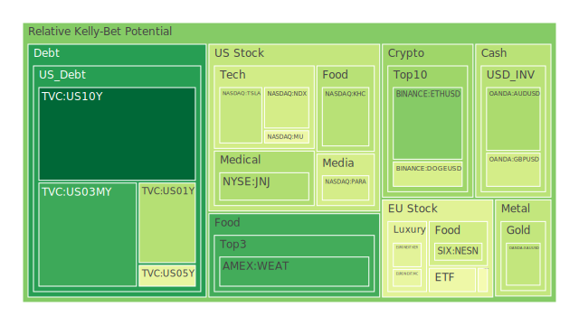
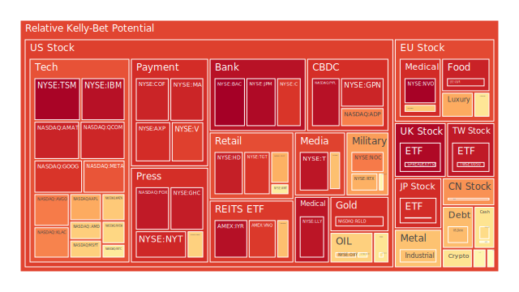
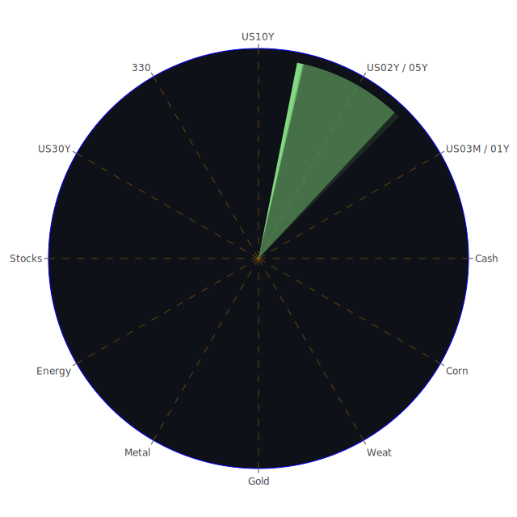

以下報告以繁體中文撰寫，聚焦於從空間（Spatial）、時間（Temporal）、以及概念（Conceptional）三位一體的觀點，探討市場與新聞之間的交織影響，並以正反合思維建構對各種資產的泡沫風險分析、風險對沖機會以及可能的資金傳導路徑。全篇以闡述方式為主，不包含任何表格式呈現；同時也會引用相關新聞及過往歷史觀點，以供投資人多角度思考。本文字數較多，旨在達到完整性與深度分析之目的，讀者如有耐心通讀，或可發現此乃一份嘗試納入宏觀、微觀、資產間關聯與三位一體論述的報告，最後亦提供資產配置建議與風險提示，務必謹慎參考。

在正式進入詳盡內容前，先將「三位一體」的思路簡要闡述：

1. **空間（Spatial）層面**：指不同地域或市場範疇間的交互關係，包括美國、本土、歐洲、亞洲等市場可能的相互影響。亦包含全球政治因素、跨國企業併購、供應鏈布局等空間分布上的考量，配合新聞事件之區域性連動（如歐洲對新能源車普及的支持度、美國對科技股氛圍的調整、中國在供應鏈中的角色等）。

2. **時間（Temporal）層面**：指市場在不同時間週期的表現與新聞所帶來的週期衝擊，可能著眼於短期利率（如3個月或1年期國債殖利率）、中期利率（2年、5年期國債殖利率）、長期利率（10年、20年、30年期國債殖利率）之波動，也包括企業財報季度發佈時引起的股價漣漪效應，以及在歷史事件中觀察到的資產泡沫或市場峰谷週期。時間軸的交織有助於捕捉投資時機，或對特定產業淡旺季的理解。

3. **概念（Conceptional）層面**：指在經濟學、社會學、心理學、博弈論等理論領域中，對市場情緒、群眾行為、投資者預期與政策博弈的觀察。從投資人恐慌指數到泡沫風險、從新聞對投資者情緒的潛移默化，到企業間或國家間的戰略博奕，都是此層面試圖納入的要素。也包括對於技術創新如AI、大數據、區塊鏈等對市場的影響分析。

而「正反合」則應用於綜合各面向的結論：先正面列舉機會（正），再探討可能的風險或矛盾（反），最後嘗試提出如何在兩者間取得平衡或深化（合），以期對市場有較為完整的理解。以下報告也會呼應這樣的思路。

---

# 一、投資商品泡沫分析

本節將參考最新顯示的各項資產泡沫機率數據以及近期新聞動向，嘗試歸納其風險指標與投資者需注意之處。

## （1）美國國債
美國國債一直被視為全球資金避險的關鍵標的。近期數據顯示，1年期、2年期、3個月期、5年期、10年期、20年期、30年期的殖利率均有所波動。其中3個月期與1年期的收益率從前一年度（高點約5.50%或5.46%）逐步下滑到約4.34%或4.24%，10年期則維持在4.49%～4.50%附近，30年期約在4.69%。整體來看，雖然平坦化的現象不若前幾年曲線那般明顯，但目前高利率環境下，美國國債依舊吸引大規模避險資金。此外，新聞中提及的美國政治不確定性，如對藥品關稅的討論、對大型科技公司或能源企業的監管可能，以及前總統有關的爭議性政策，都可能使資金進出國債市場更為頻繁。由於國債相對安全性高，泡沫風險在美國國債上通常較低，但若美國聯準會（FED）在未來採取更為激進或鴿派的貨幣立場，皆可能引發殖利率的大幅波動。然而就最新泡沫數據看，美國國債D1、D7、D14、D30風險分數大多維持在相對較低區間（多數在0.0X～0.5X的範圍），說明市場對美債的泡沫疑慮並不算高。

## （2）美國零售股
美國零售股如Walmart、Target等，近來受到新聞消息的雙重衝擊：一方面，通膨減緩的訊號有助於終端消費者支出能力，但另一方面，就業市場增速放緩的現象開始浮現，且美國房地產價格下跌也影響消費者信心。新聞顯示，「Jobseekers ‘face 10 rounds of interviews’ as bosses’ confidence plummets」，此類負面聲音意味著人力成本與人力需求的變化或令企業管理階層更加保守。此外，零售股常在利率變化或消費動能改變時出現較大波動。近期Target的風險分數高於0.89，顯示市場對其股價可能過熱或基本面疑慮較深。歷史上看，零售股經常在經濟景氣轉折前後劇烈波動，需留意利率與總體需求的雙重因素。

## （3）美國科技股
科技股方面，包含多家龍頭企業如Amazon、Meta、Google、Microsoft、Apple、Tesla等，以及半導體產業相關之NVIDIA、AMD、Intel、Micron等公司，近來新聞中提及「Traders See Profits Evaporate in Minutes as Trump Convulses Bets」，或「These 8 stocks could be the biggest losers as DeepSeek clouds the outlook for tech」等負面報導。市場對AI熱潮延燒下的大型科技公司需求也存在矛盾：有新聞顯示「Amazon, Echoing Microsoft, Says It Can’t Keep Up With AI Demand」，暗示雲端運算或AI服務需求龐大，但同時也有關於成本與資本支出快速增加的隱憂。  
就最新泡沫數據來看，許多美國大型科技股（例如Apple、Microsoft、Google、Meta、Amazon等）的風險分數高於0.85甚至接近0.95以上，顯示市場對科技股存有一定的泡沫疑慮。這種高估值、高本益比的結構在歷史上常見於2018年底與2020年的科技熱潮末端階段，亦曾出現在網際網路泡沫（2000年）中；若未來企業獲利趨緩，股價可能面臨修正壓力。不過，在景氣循環趨勢轉好或者有強勁創新突破時（例如GPU在AI運算中的需求飆漲），往往也能支撐科技股的高評價。

## （4）美國房地產指數
房地產指數近來受到利率上行與消費者購買力下降等利空因素干擾，再加上新聞報導「11 US cities where home prices are falling the most」也暗示部分城市的房價走軟。最新數據中，一些房地產ETF或房地產投資信託(REIT)的泡沫分數普遍在0.65～0.96之間，可見市場已經對此資產類別保持審慎態度。儘管如此，固定30年期房貸利率已到6.8%～6.9%的區間，高利率將遏制買房需求，更可能壓抑指數走勢。歷史上，在2007-2008年金融海嘯期間，房地產指數的高估值最終導致金融體系風險加劇。雖然今日銀行體系資本充足率可能較當年更穩健，但依舊不能輕忽當前需求減弱和就業市場可能惡化的風險。

## （5）加密貨幣
近來比特幣、以太幣等數位資產波動再度加劇。新聞報導顯示「Experts warn MicroStrategy’s high-flying valuation has ‘no rational explanation’—and investors face a double whammy of risk」，而過去數日比特幣價格雖有小幅上漲，但市場情緒依舊混亂。據資料顯示，BTC在最新泡沫風險指數方面約在0.59～0.65，ETH約在0.27～0.38的日/周/月均值附近，DOGE的泡沫風險亦偏高（0.41～0.55不等）。參考歷史，2017年末及2021年初加密市場先後出現過狂熱和大幅回調，顯示其波動受市場投機情緒與全球金融環境流動性變化大幅影響。在美國貨幣政策緊縮的情況下，若資金面無法支撐，加密貨幣仍有大幅震盪可能。

## （6）金/銀/銅
貴金屬及工業金屬近來走勢錯綜。黃金價格於2850美元以上附近震盪，而白銀在31～32美元附近、銅在4.5～4.6美元區間。根據泡沫風險分數，金與銀的數值在0.70上下，銅在0.60上下，顯示金銀相對仍有較高的投資追捧度。新聞中，地緣政治不確定性、通膨率雖微幅下降但仍在升溫疑慮等，都帶動市場對避險金屬的需求。歷史上常見股市修正期或地緣衝突加劇時，黃金、白銀等往往扮演短期避險資產。然而銅因其工業屬性，需求更受到經濟週期的影響，若未來全球製造業活動趨緩，銅價仍可能面臨壓力。報導中的「GOLD OIL RATIO」與「GOLD COPPER RATIO」數據上升，也暗示黃金在工業金屬及原油中的相對價值有所提升。

## （7）黃豆 / 小麥 / 玉米
根據期貨ETF相關數據顯示，小麥（Weat）價格持續在5美元上下，泡沫風險指數約0.16～0.18之間，玉米則約在0.51～0.57區間，黃豆約在0.51上下。農產品價格波動經常受天候、地緣政治（如出口禁令或戰爭封鎖）及全球供需失衡影響。新聞資訊顯示俄羅斯與烏克蘭的情勢尚未緩和，雖然談判局勢偶有變化，但糧食供應鏈仍具風險；同時，某些地方的乾旱或極端天氣也影響莊稼收成。歷史上每當有大型地緣衝突或氣候異常，農產品期貨的波動都可能放大。但目前看起來，小麥相對泡沫風險並不算高，意味著市場對其定價相對合理；玉米及黃豆雖稍高但仍在可接受區間，投資人可留意後續天氣或貿易政策的影響。

## （8）石油 / 鈾期貨UX
近期原油價格約在70～71美元區間，新聞裡「Chevron Says Fading US Crude Growth Casts Pall on Port Projects」強調未來美國原油產量增長減緩可能衝擊相關基礎建設。OPEC相關政策與地緣政治也是石油價格的重要變數。最新泡沫指數顯示，石油約在0.54～0.62區間，屬於中等風險水平。鈾期貨UX的報價約69～70美元，泡沫風險約0.38～0.55不等，市場對於核能發電的需求關注度有升溫態勢。歷史經驗表明，在能源轉型的浪潮中，若油價長期低迷，則會影響頁岩油或海上鑽井的投資；倘若核能被更多國家視為過渡性或替代性能源，鈾資源需求或增。但就目前整體需求面尚不明朗，且俄烏衝突尚未解決，對能源市場仍有不確定衝擊。

## （9）各國外匯市場
外匯方面，美元指數有走強跡象，新聞可見「King dollar emerges as fresh threat for Big Tech earnings views」，若美元再度走堅，對多數非美貨幣會形成貶值壓力。英鎊、歐元、澳幣、日圓等主要貨幣相對美元最近的走勢較疲弱。例如英鎊在1.24附近、歐元在1.03左右，澳幣僅在0.63上下，美元兌日圓則在151以上。從泡沫風險指數來看，一些非美貨幣介於0.30～0.60之間，說明並未過度泡沫，但也須留意匯率急貶引發的通膨與資本外流。歷史上強勢美元與高利率往往導致新興市場債務壓力升高，也可能造成國際貿易結構變動。新聞上「Dollar Caps Volatile Week on High Note as Tariff Deadlines Loom」也表示市場對美國關稅政策與美元強勢的擔憂。

## （10）各國大盤指數
歐洲方面，德國DAX指數與法國CAC指數的泡沫風險約在0.49～0.67之間，英國FTSE約在0.97上下，顯示英國市場可能相對過熱或投資人信心高漲但也隱藏著回檔風險。新聞中多次提及德國建築業困境以及政治領域的動盪（如先前「Campaign volunteers attacked in Berlin」等負面消息）都可能打擊投資者情緒。亞洲方面，中國大陸滬深300在3900點附近，風險指數約0.74，顯示對其前景評估較為謹慎；日本股市日經225則在38500點以上，泡沫風險在0.90上下，可能反映市場對日本企業利潤與資金動能仍保持熱度。台灣代表性的ETF則在198元左右，風險達到0.94以上，投資者需當心電子業對全球景氣的連動。

## （11）美國半導體股
半導體板塊包含NVIDIA、AMD、Intel、Micron、以及其他晶片製造或設備廠如KLA、AMAT等。新聞中「Microchip forecasts dour quarterly results as customers reduce excess inventory」屬於負面消息，一定程度顯示通路去化庫存尚未結束。另一方面，AI需求可能支撐GPU與部分記憶體廠商之獲利，但也引起市場對估值過高的疑慮。例如NVIDIA、AMD的泡沫風險依舊偏高（0.63～0.70之間），Intel雖估值相對較低，但需求端不振亦是一大問題。歷史上，半導體週期常在景氣回落與升溫間交替，投資者應密切留意庫存週期何時落底。新聞裡「Tesla Shares Post Worst Week Since October as Sales Plunge」也暗示電動車需求若放緩，對相關半導體零組件的需求可能下降。

## （12）美國銀行股
美國大型銀行如JPMorgan、Bank of America、Citigroup等，在最新泡沫風險數據上，多數接近或超過0.90，有些甚至逼近0.995的高水準，顯示市場對銀行股的熱度已達相對高檔。然而，新聞上提到「The list of major companies laying off staff in the new year」以及「Trump wants to put tariffs on prescription drugs」等政策波動，都可能在企業融資與利率走勢上引發波動。回顧2008年金融海嘯，銀行股曾有嚴重超買與爆炸性回檔的歷史案例；雖然今天銀行體系資本充足度較以往提升，但也不能忽視若經濟陷入衰退，銀行業不良貸款與獲利壓力可能浮現的風險。

## （13）美國軍工股
軍工股如Lockheed Martin、Northrop Grumman、Raytheon等，公司業務與地緣政治衝突、政府軍事預算息息相關。近期俄烏局勢仍緊張，且新聞有關於歐洲某些防務預算以及德國建軍議題頻傳。從泡沫風險來看，軍工股大約在0.54～0.78之間。歷史上，在地緣情勢升溫時，軍工股往往獲得資金關注，不過一旦衝突結束或預算削減，股價也會面臨獲利了結或回調。

## （14）美國電子支付股
Visa、Mastercard、PayPal、Global Payments等為主力。報載「PayPal業績成長卻面臨AI服務成本高漲」，顯示出線上支付雖受電商發展帶動，但對於技術與安全性投資仍需龐大資本。最新風險分數有些已超過0.90或0.95，意味著市場對電子支付板塊已有相當期待。回顧歷史，過去數年電子支付市場高速成長，但同時面臨加密貨幣或其他新興支付模式的挑戰。若未來有激烈競爭或政策監管（如對跨境手續費的限制），可能導致估值修正。

## （15）美國藥商股
包括強生（JNJ）、Merck等大型藥廠，最新風險數據顯示，有些風險指標在0.34～0.66之間不等，相對於科技股或銀行股不算高。新聞中提及可能對處方藥徵收新關稅，或美國政府可能改革醫療保險制度，這些都會影響藥商的利潤空間。藥商具備一定防禦屬性，尤其在經濟景氣放緩時，醫藥消費通常較具韌性。但若遇到新的藥物研發風險或法規挑戰，股價波動也可能劇烈。

## （16）美國影視股
含迪士尼、Netflix等。近期新聞見「Skechers Posts Q4 Sales In Line With Estimates But Stock Drops」、「Quiksilver... operator files for bankruptcy」，儘管這些並非純粹影視娛樂業，但可看出消費及娛樂市場的不穩定性。迪士尼報導中顯示其風險指數約在0.58～0.67間。若串流媒體市場競爭持續加劇，迪士尼、Netflix或其他影視公司之營收成長壓力會更高。歷史上，影視業的波動常隨著消費者可支配所得變化而起伏，也與新技術（例如TikTok或短影音平台的衝擊）有關。

## （17）美國媒體股
包含一些大型傳媒集團或有線電視運營商，如Comcast、Paramount、Fox、New York Times等。新聞中提及「Paramount股價波動」、「Fox面臨政治與市場輿論爭議」。最新泡沫風險數據顯示有些媒體股約在0.47～0.94之間，分化頗大。例如Fox接近0.94，Comcast在0.63附近。此差異背後可能反映出不同媒體對廣告營收、串流佈局的市場預期。歷史上，媒體股常受政治事件、世代消費行為改變而劇烈震盪。

## （18）石油防禦股
此處指像是ExxonMobil、Chevron等整合型石油公司，一方面可從油價波動中直接獲利，另一方面也能藉由多元化業務提供防禦性。數據上顯示這些石油股的風險指數有些在0.58～0.77之間，整體並非極端泡沫。但新聞提到「Chevron Says Fading US Crude Growth Casts Pall on Port Projects」，暗示長期產量與基礎設施投資或有風險。此外，若全球經濟放緩、需求減弱，該類股亦將面臨獲利下修。

## （19）金礦防禦股
與黃金期貨相關性高，當市場避險情緒上升時往往受到追捧。但若金價回跌，金礦股可能因槓桿效應而承受更大股價波動。最新數據顯示金礦防禦股之泡沫風險約在0.64～0.80區間，也不算特別低。留意到近期黃金價格雖然在相對高檔，但若全球利率繼續維持高位，金價的機會成本也會上升，進而對金礦類股造成壓力。

## （20）歐洲奢侈品股
包含一些法國、義大利等歐洲奢侈品牌集團，諸如LVMH、Kering、Hermes等。新聞提到「Porsche Warns Pullback From EVs Will Drag on Profit」，而同時也有「German Constitutional Court declares extradition to Hungary illegal」等歐洲政經紛擾。從風險角度看，歐洲奢侈品股多半在0.44～0.83之間。它們與中國消費者需求及全球旅遊市場復甦關係密切。若亞洲需求放緩或全球經濟衰退，奢侈品消費可能首當其衝。

## （21）歐洲汽車股
如BMW、Mercedes-Benz等，新聞中曾提及德國汽車產業景氣欠佳。同時歐洲對電動車、氫能車等政策推行也正逐步加速，傳統車廠正面臨轉型壓力。數據顯示該區塊之泡沫風險在0.48～0.69間，並不特別高。但若全球貿易紛爭升溫或中國市場銷售無法回升，歐洲汽車股也會遭遇挑戰。歷史上一旦歐洲經濟進入衰退，汽車產業往往首當其衝。

## （22）歐美食品股
包括一些在美國、歐洲具有龐大市場佔有率的食品、飲料品牌（例如Nestle、Coca-Cola、Kraft Heinz等）。從新聞可以看到Kraft Heinz最新報告，股價風險指數約在0.35～0.68之間。若消費者因經濟壓力而轉向更便宜的替代品，可能衝擊其利潤。不過，食品飲料業通常屬於防禦性產業，在衰退時期或市場動盪時也能維持一定銷售量。回顧歷史，疫情期間食品需求相對穩定，但競爭激烈與通路成本攀升也是風險。

---

# 二、宏觀經濟傳導路徑分析

基於上述資產觀察，再結合「Spatial、Temporal、Conceptional」三位一體，我們可以歸納如下的宏觀傳導脈絡：

1. **Spatial面**：美國聯準會貨幣政策若持續緊縮，美元就可能保持強勢，壓抑歐洲、亞洲貨幣及資產價格。歐洲地區內部的通脹及政治不穩定、德國工業景氣轉弱、俄烏衝突久拖不決，都會加劇歐元區內部動能不足，形成區域擔憂。另一方面，若新興市場因強勢美元與外資撤離而造成金融市場動盪，也會進一步回饋到全球避險資金流向美國國債或黃金。

2. **Temporal面**：短期內（3～6個月），市場正面臨利率高檔、通膨稍降但未回到舒適區域，加上勞動市場數據顯示就業增速或許趨緩，預示企業獲利可能下修。中期（1～2年），若FED立場轉向鴿派或全球景氣複甦，則股票市場有機會進一步反彈。長期（3～5年）則需留意技術創新與國際政治格局帶來的結構性改變，例如綠能轉型、供應鏈重組等。

3. **Conceptional面**：投資者心理方面，在近期新聞充斥著「negative, 95% 或以上」的報導，例如「新一輪關稅、AI泡沫、地緣政治衝突等」，使得市場情緒或傾向謹慎觀望。同時也有部分企業財報仍舊強勁（如個別支付、網路服務公司），產生投資人對「泡沫」與「成長」兼具的複雜心態。博弈論觀點下，各國央行的貨幣政策選擇，企業之間對AI市場版圖的爭奪，都充滿利益與風險衡量。這些會在市場價格或利率走勢上產生漣漪式傳導。

---

# 三、微觀經濟傳導路徑分析

1. **企業財報層面**：資訊、零售、軍工、醫藥等行業有不同季節性；一旦企業公告財報不及預期，股價往往瞬間大幅波動。新聞曾提到「Microchip forecasts dour quarterly results」「Fortune Brands Reports Sales Below Analyst Estimates」，也有「Pinterest jumps 18% after reporting its first-ever $1 billion quarter」。可見財報在短期內對投資情緒的拉動或抑制效應相當明顯。

2. **產業鏈上下游關係**：半導體—電子消費—雲端運算—電動車，這條供應鏈環環相扣。任何一端需求放緩都將逐步傳導到上游零組件廠，或因原物料跌價而改變利潤結構。另方面，農產品—食品製造—零售超市，同樣存在聯動，若農產品價格大漲，可能壓縮食品商利潤，並導致零售商品價格上調，引發通膨壓力。

3. **勞動市場與成本**：高通膨、高利率環境下，企業對人力成本更為壓抑。新聞如「Jobseekers ‘face 10 rounds of interviews’」顯示僱主愈加謹慎，一旦失業率攀升，又將影響消費端需求，形成企業營收的負反饋。

---

# 四、資產類別間傳導路徑分析

1. **股票與債券的替代效應**：當債券殖利率走高時，股票吸引力相對下降，資金將從股市流向債市；反之亦然。  
2. **商品（貴金屬、能源）與匯率**：原油價格若回升，可能推升通膨，進而讓利率維持高檔，進一步強化美元。當美元偏強時，金銀價格則在全球其他貨幣計價下呈現更為昂貴，因此需求可能被抑制，但若地緣政治惡化又會反向推升金價避險需求。  
3. **科技股與加密貨幣**：部分投資科技股的資金性質偏風險投機，倘若大型科技股持續修正，風險偏好下降，也可能連帶壓抑加密貨幣的投機熱度，兩者之間呈現一定程度的同向聯動。  
4. **防禦型資產（黃金、債券、房地產ETF）之間的此消彼長**：當市場恐慌情緒高漲時，有些資金偏向長天期美債避險，有些資金偏好黃金，或在更大動盪時湧入現金。房地產ETF雖常被視為防禦性標的，但在高利率時期其表現相對不佳，需要分辨住宅與商業地產的差異。

---

# 五、風險對沖的投資組合機會

根據三位一體分析和市場泡沫風險監控，若試圖在不同資產之間將相關係數盡量壓至-0.5附近，且彼此相位能維持約120度的分散度，則可考慮以下概念性的對沖組合：

1. **股、債、黃金的基礎分散**：長期經驗顯示，股票市場與債券市場多半呈負相關，而黃金在金融危機或地緣衝突下常與股票呈負相關或弱相關。但需留意今年以來債券與股票有時也同向下跌。

2. **半導體成長股 vs. 傳統防禦型**：半導體或雲端計算類股評價極高，波動也大；相對地，必需消費品或公用事業股（或黃金）常在股市波動時提供一定對沖。若在投資組合中將高增長股和防禦型資產各分配一部分，可在中長期取得更好的風險報酬比。

3. **能源 vs. 加密貨幣**：能源股或原油期貨與加密貨幣之相關度過往並不顯著，一旦加密貨幣資金鏈發生崩盤，能源並不一定跟隨；反之，在油價波動劇烈時，BTC或ETH的走勢可能有獨立表現。但投資加密資產風險極高，資金部位必須謹慎。

4. **地區分散：美國、歐洲、亞洲**：地域性分散也可能降低單一國家貨幣或政策風險。尤其歐洲正面臨建築與政治動盪、亞洲製造產能有一定韌性、美國高通膨但又具備全球避險市場的吸引力。多空交錯下，適度分散可減少單邊衝擊。

---

# 六、三位一體、兩兩驗證之篩選假設分析與資產之間可能的漣漪效應

將前述的空間、時間、概念分析結合，兩兩相互驗證並進行篩選，我們可得到多層次漣漪傳導關係：

1. **空間—概念之交互**：歐洲奢侈品若在中國市場銷售不振，則帶動整體獲利下滑，市場情緒轉負面。高端消費削弱同時，也可能使歐美股票市場情緒同步受挫。該情緒會傳導到美國的高估值科技股（因全球投資者風險偏好下降）。

2. **時間—概念之交互**：若FED於下季（短期）放緩升息腳步，市場也許短暫樂觀拉抬股市，但中期若企業獲利無法跟上，則股市泡沫化更快浮現。心理上先樂觀、後反轉的過程可能在半年內迅速完成。

3. **空間—時間—概念整合**：加密貨幣如BTC、ETH不僅受全球資金流向與各國監管（空間因素）影響，也受到市場流動性週期（時間因素）和投機風潮（概念層面）影響。一旦美國升息或緊縮未能緩和，就可能抑制該市場的資金動能。反之，若某些國家對加密貨幣採取更寬鬆政策，短期內又能帶動一波漲勢。

4. **漣漪式傳導路徑**：假設美國公布通膨數據高於預期，市場預計FED維持或加速升息——>美元走強及債券殖利率升高——>美股高估值板塊回檔——>各國匯率承壓，新興市場債務風險升溫——>大宗商品價格壓力上升——>投資人重新配置資產到黃金或短期美債避險；如此一來，縱使某些公司財報優良，也難阻擋整體市場的資金流向轉變。

---

# 七、投資建議

此處依照穩健、成長、高風險三大類，並假設整體加總為100%的投資部位，配合前文風險觀察，提出一種假想的配置概念（比重僅供參考）：

1. **穩健型（約50%）**  
   - **短天期美國國債或貨幣型基金**：著眼於目前約4%上下的收益率，波動相對較小。  
   - **黃金**：在地緣政治及通膨疑慮下，金價或可提供一定對沖。建議佔穩健部位的10%～15%。  
   - **高評級公司債**：在利率高檔下，投資等級債券的收益率頗具吸引力，可減緩股市下跌風險。

2. **成長型（約30%）**  
   - **大型科技或網路龍頭**：如Microsoft、Apple、Google等，但需警惕目前泡沫風險較高，建議此類股的佔比不要過度集中；大約10%～15%配置即可。  
   - **醫藥防禦與軍工股**：考慮地緣政治與人口老化需求，挑選研發管線或軍事訂單穩定的公司。約10%配置。  
   - **歐洲汽車或奢侈品**：若認為中國或全球經濟有機會在未來1～2年復甦，可少量佈局歐洲品牌，但建議僅5%左右。

3. **高風險型（約20%）**  
   - **半導體與AI概念股**：如NVIDIA、AMD、相關設備供應商。但此區塊估值頗高，震盪劇烈，投入部位須謹慎。  
   - **加密貨幣（比特幣、以太幣）**：建議更小比例（例如5%），避免過度波動損及總投資。  
   - **油價或鈾期貨**：若看好能源緊張局勢或核能復甦，可考慮少量佈局，但需對價格大幅波動有足夠承受度。

以上只是示意分配，實際操作仍需依照個人風險承受能力與資金規模調整。穩健、成長、高風險三部分的百分比亦可視市場變動而重新加權。

---

# 八、風險提示

1. **泡沫風險不可忽視**：特別是美國科技股與部分銀行股，最新泡沫數據顯示它們的風險指數相當高，投資人應注意估值修正的可能性。  
2. **地緣政治突發事件**：俄烏衝突、歐洲地區的政治變動、中東局勢以及東亞各國緊張情勢，都可能在瞬間引發市場大規模避險行為或產業供應鏈衝擊。  
3. **經濟衰退或就業市場轉壞**：若未來數月公布的就業與通膨數據皆不理想，企業獲利就有可能全面下修，引發金融市場同步回跌。  
4. **央行政策轉向**：歷史上政策轉折時常出現意外的行情波動。例如FED若再次鷹派升息，或突如其來地轉為寬鬆，都可能令市場大幅震盪。  
5. **流動性風險與市場恐慌**：一旦市場恐慌迅速擴散，資金短期內從高估值板塊撤離，衍生品與槓桿部位也可能被強制平倉，導致股、債、加密資產出現聯動性拋售。

---

整體而言，本報告從空間、時間、概念三位一體角度，並透過正反合的邏輯將新聞事件與各類資產的泡沫風險加以串聯，試圖提供一幅較為宏觀的分析圖景。在資產配置上，務必留意本報告中提及的高泡沫分數標的，那些一旦市場情緒反轉，往往會迅速回跌。同時，任何地緣政治或政策面突發變化，也可能在資產間引發漣漪式傳導。穩健的分散佈局、對於市場情緒保持理性評估、對於財報數據與宏觀指標的嚴謹解讀，都是在當前環境下不可或缺的準備。

## 風險提示
投資有風險，市場總是充滿不確定性。本報告僅供參考，投資者應根據自身的風險承受能力與投資目標，做出獨立決策。在全球經濟多重變動之際，保留足夠的安全邊際、嚴謹評估各資產真實價值，並持續關注最新新聞與政策動向，是在紛雜市況中保障自身資本的關鍵。請勿忽視任何泡沫風險高的資產所帶來的潛在衝擊，亦需謹防過度集中於單一題材或地區。願各位投資人能在三位一體的分析框架下，更靈活地因應市場起伏。祝投資順利。

 
Daily Buy Map:

 
Daily Sell Map:

 
Daily Radar Chart:

 
