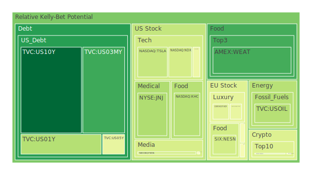
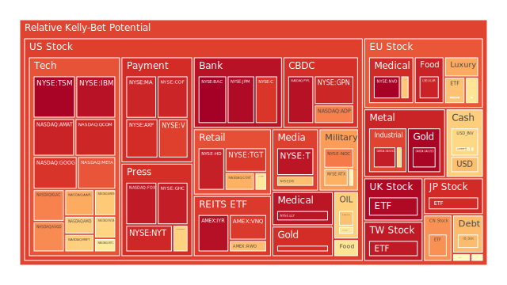
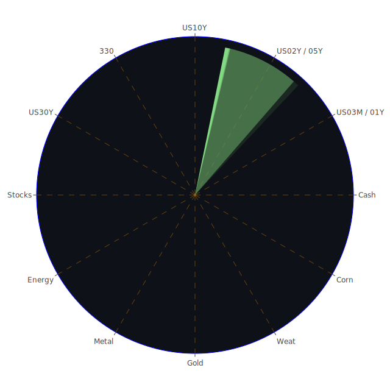

以下為一份結合經濟學、社會學、心理學、博弈論等多領域觀點所撰寫之綜合報告，旨在從三位一體（Spatial、Temporal、Conceptional）的角度，歸納各類市場與新聞的動態，並從中研判可能的風險對沖投資機會，最終給予一套穩健、成長與高風險的三大類投資建議配置。全篇將嚴守客觀分析原則，不對任何社會、政治、或經濟議題做價值評斷，而僅從數據、歷史、新聞脈絡等面向探索可能的漣漪傳導路徑。本文亦特別注意到泡沫風險高的資產，並在各處提出風險警告或提示。

在開始前，先行概述「三位一體」在此報告中的應用方式：

1. **Spatial（三位一體之空間面）**：側重不同市場與產業、不同地區乃至全球的分布，探討各種商品、新聞與經濟變數之「空間配置」對價格波動與風險的影響。這層面可見到跨國企業、商品（石油、金屬、農產品等）、以及匯率、債券、股市指數的互動。

2. **Temporal（三位一體之時間面）**：著重於市場在短期、中期、長期的發展趨勢，評估當前消息與歷史事件如何塑造投資者心理，並影響資金流向與價格走勢。短線的市場恐慌或情緒，加上中長期的結構性趨勢，往往構成了行為金融與資產配置的關鍵。

3. **Conceptional（三位一體之概念面）**：結合經濟學、社會學、心理學、博弈論中的抽象概念，包含對交易者心理（如羊群效應、錨定效應）、制度結構（如各國中央銀行政策、地緣衝突的博弈思考）及市場理論（如有效市場假說、行為金融學反例）進行闡釋。從概念層面提出大膽假設，進而再回歸實務層面佐證或修正。

在此基礎上，我們先就各類投資商品的泡沫指數、新聞事件、與其他可觀測到的變數進行大致分析，並以最精簡的文字為主軸，盡量反映最多層面的意義。由於指令要求，報告過程中不會以表格形式呈現數據，但會輔以敘述將關鍵數字與風險分數穿插其間，並且忽略任何券商前綴，只以簡短的代號（如US10Y、TSLA、ETHUSD等）指稱資產。

---

# 投資商品泡沫分析

## 美國國債
就觀察到的美國國債收益率來看，1年期、2年期、10年期、30年期等均處於4%左右至4.7%左右的範圍。根據最新數據顯示，1Y（US01Y）報4.24上下，2Y（US02Y）約4.29，10Y（US10Y）約4.49，30Y（US30Y）約4.69，這些指標反映一個比較「曲線趨平但仍帶有一定斜度」的美債收益曲線。和過去一年相比，整體利率水準稍微低於去年5%左右的區段，但仍維持在歷史相對高位。

從泡沫風險分數來看，US10Y在最新一天D1顯示約0.0343，這表示此資產的風險評分頗低；對照2Y（US02Y）約0.6984，5Y（US05Y）約0.4573，30Y（US30Y）約0.5241，也可觀察到長天期的風險評分相對中等，而1Y（US01Y）有0.3514左右。這些分數顯示較短天期的國債泡沫風險偏中，高天期則並非特別高，但也非極低。

從新聞與宏觀層面來看，負面因子主要是關於特朗普政府的各種關稅和政策不確定性，市場對通膨與聯準會（FED）政策前景的擔憂也會導致殖利率上下波動。根據最新FED數據，EFFR Volume持續上升，而RRP走低，代表資金在短端市場仍相對活躍；同時TGA走高也暗示政府支出或發行債券的動能較強。OIS FED Fund Rate大幅由5.33降至4.33的差異則可能有統計或一時性擾動的成分，需要再觀察之後數週的走勢。觀察歷史類似場景，2006～2007年間因為聯準會預期升息循環到頂，短端利率曾與長端接近倒掛；而目前雖出現部份曲線倒掛，卻並未導致國債價格大幅波動，市場似乎在等待更明確的經濟衰退或通膨變化信號。

總體而言，美國國債是市場普遍視為相對穩健的資產，但因為未來若有更多政策性不確定或市場資金再度流向股票，可能出現收益率上下震盪，不過泡沫風險目前看起來並不嚴峻，尤其是10Y與30Y評分低到中等之間。

## 美國零售股
美國零售股由於近期香港關稅以及全球經濟環境放緩的新聞，使得零售支出前景並不算樂觀。新聞可見多家零售商削減展店計畫，失業率、就業增長指標也顯示出雖然就業依舊擴張，但薪資增速或購買力有放緩跡象。根據新聞觀測，部分負面新聞顯示大型公司（如某些耐用品零售商）已開始裁員或保守預測。WMT近期風險分數在最新數據約0.5826上下，屬於中高的泡沫風險。TGT則逼近0.8896左右，更顯示其在本輪消費疑慮下恐有更大振幅的股價波動風險。

歷史上，零售股常見於景氣不明時受到需求面衝擊，也常見到幾次因消費信心衰退的獲利下修（例如2008年金融海嘯期間零售股普遍重挫）。就心理學而言，消費股易受到市場氣氛影響，一旦有裁員、景氣趨緩等新聞，即使財報表現尚可，也可能被投資者放大疑慮。在社會學層面，通脹與失業因素往往引發社會對消費支出減少的集體恐慌。博弈論層面上，大多零售商會在促銷、庫存管理上進行相互競爭，可能在利潤率與市佔率之間兩難，因而增添股價風險。

## 美國科技股
美國科技股可說是近年來的市場焦點。根據新聞，多家科技巨頭面臨通膨、關稅與監管的多重挑戰，然則也常出現「即使大環境不佳，科技股仍獲部分投資人追捧」的結構性現象。自心理學觀點，市場對創新與高成長抱有極高期待。但博弈論提示，若關稅或政府對大數據、AI等監管力度加強，科技公司內部與外部的競爭成本都可能提高。

就泡沫指數，TSLA（汽車與科技混合）D1在0.384961左右，但週期與月期評分相對更高（D14已達到0.673615、D30約0.809984），顯示隨時間累積，對其股價的風險疑慮更大。AMZN也在D1約0.6539，週期及月期則已高達0.851以上；MSFT約0.6425，AAPL約0.7105，GOOG約0.8929，NVDA約0.6291，META約0.8410，QCOM約0.9187。尤其QCOM、GOOG等接近0.9以上的領域，顯示短期可能存在相對脆弱的泡沫風險。如同2000年網路泡沫前期，大型龍頭企業仍可繼續吸金，但一旦總體資金面或市場心態反轉，高估值公司將大幅回調。

新聞面上可注意到，多條負面消息如「特斯拉銷售下滑、中國需求疲弱」、「部分AI概念股估值極高但獲利模式不明」等，令市場對科技板塊的實際盈利能否支撐高股價產生擔憂。社會學觀點下，人們對創新科技往往一面充滿期待，一面又擔心監管與不可知風險（如AI倫理、環保問題）。同時，心理層面經常出現「FOMO」（害怕錯過）的情緒，這使不少投資人湧入高風險科技股。在過往例子如「Dotcom泡沫」，中後段常見此狀況。

## 美國房地產指數
美國房地產指數（可觀察RWO或VNQ這類房地產ETF），在最新D1顯示，RWO約0.6752上下、VNQ則高達0.8843。雖然房地產常被視為防禦型資產，但觀察到利率高企、抵押貸款利率（30年期6.89上下）與高通膨壓力，使得購房與投資型需求可能放緩。新聞中有提到「德國、法國等地建築景氣低迷」，儘管這是歐洲市場，但全球資本的流動性使得跨區傳導不容忽視。高房貸利率導致購買力承壓，也可能使包括商辦、住宅或多戶型投資需求出現下降風險。

歷史相似情境是2006～2008年房市轉冷的開端，當時就是由於持續升息、房貸壓力上升，最終導致次貸風暴。然而現今金融市場監管比2008年稍嚴，貸款結構也有所調整，因此重演次貸的機率或許不高。但從社會與心理層面看，房地產作為許多人主要資產，一旦價格開始鬆動，往往會讓消費信心受挫，進而在博弈論中形成「賣房->需求萎縮->價格進一步下跌」的負向循環。RWO與VNQ的泡沫風險分數高企，值得投資者關注。

## 加密貨幣
加密貨幣以BTCUSD、ETHUSD、DOGEUSD等較具代表性。根據資料，BTCUSD最新D1約0.5194，雖非極端高，但過去一週與兩週及一個月範圍（如D14約0.6367，D30約0.5898）呈現上下波動。ETHUSD在2月9日之前顯示約D1=0.274002，但在2月10日的資料中，該代碼已被簡化成「-1.0000 2636.0600」，風險分數則呈現短線約0.48～0.49上下，顯示程式計算或市場資料更新的差異。DOGEUSD則介於0.41～0.42左右的D1，週月期略有上升趨勢。

新聞上，同步可見一則「Bitcoin jumps 2% on weaker-than-expected jobs report」的正面消息，與其他負面因素相互拉扯。加密貨幣的價格波動一向劇烈，社會心態常在對傳統金融體系不信任時轉而追捧區塊鏈資產，但也常在監管或黑天鵝事件（如交易所倒閉）時快速逃離。博弈論觀點或可說明，市場上對加密資產的共識仍不穩固，短期行情更像是參與者之間零和博弈，心理層面充斥投機與熱錢。加上歷史上的2017年與2021年兩輪大漲大跌，顯示一旦價格上升過快，泡沫風險會迅速攀升。

## 金/銀/銅
金（XAUUSD）、銀（XAGUSD）及銅（COPPER）在通脹期或地緣風險升溫時，往往受到投資者青睞。從風險分數來看，最新XAUUSD報價約2867.81，D1達0.9842上下，代表短期看似有巨大波動或泡沫風險；XAGUSD約0.9374，顯示也處於相對高檔風險。COPPER約0.6197，雖然評分也不低，但相較金銀仍稍低。觀察新聞可看到「Commodity Currencies Slide on Trump Tariff Plans」，這表示若關稅再起，工業金屬銅的需求面憂慮會打擊價格；黃金則在多項不確定性下被推升，導致價格與風險雙高。

歷史上1980年、2011年都出現過黃金價格大漲後的快速回調；當投資人對於地緣局勢和通膨走向做出過度悲觀的預期時，金價也會有大幅波動。博弈論層面則顯示，金銀等避險工具在對抗金融資本市場波動時會吸引一部分防禦性資金，但若風險突然下降或利率升高，金價又可能流失資金。心理學角度，人們對貴金屬常有一種「終極保值」的偏好，這種情感層面因素也會放大價格漲跌。

## 黃豆 / 小麥 / 玉米
可參考WEAT（小麥）、SOYB（黃豆）、CORN（玉米）等。在新聞上，可見到部分國家糧食政策和大宗商品需求放緩。WEAT風險分數D1約0.1828，顯示並不算高；黃豆ETF（SOYB）約0.5103，CORN則約0.5176。這些數值大多處於中等附近，似乎農產品市場暫無太大投機氛圍。歷史上農產品較易受天氣、政治衝突與貿易政策影響。社會與經濟學視角，可看到全球人口結構變化對糧食需求長期仍穩定增長，但階段性衝擊（如關稅、戰爭、疫情）都會大大干擾價格。

心理學上，人們對於糧食安全的憂慮，往往在突發事件如極端天氣、地緣政治緊張時被放大。當前新聞中沒有明顯的糧食危機，但亦不可掉以輕心。博弈論則聚焦於各國對農產品進出口配額的談判與制裁行動可能產生的連鎖效果。

## 石油 / 鈾期貨 (UX!)
石油（USOIL）最新價格約71.02，泡沫風險D1報約0.3543，並非高位，表示市場對原油短期或許看法趨於中性。然而中長期（D14、D30）也介於0.505～0.475附近。新聞中指出「Oil Posts Third Weekly Drop as Trump Tariffs Hit Demand Outlook」，某些跡象顯示可能的關稅政策削弱了經濟活動預期，壓抑石油需求。鈾期貨（UX1!）D1約0.4971、週期0.39～0.41區間，數據並不算極端。長期而言，核能需求仍在地緣政治與各國能源政策之間搖擺。

歷史場景可回想1970年代石油危機後，多次出現因產油國協議或地緣衝突，導致油價短期飆漲，但也在需求端或替代能源興起時下滑。博弈觀點，OPEC+和美國頁岩油商常在產量控制及價格博弈中影響油市。社會層面看，對環保與能源轉型的呼聲仍令化石燃料有一定的長期壓力。

## 各國外匯市場
可觀察GBPUSD、EURUSD、AUDUSD、USDJPY等。GBPUSD與EURUSD在最新分數都在0.55～0.67之間，表明其波動風險中等偏高。AUDUSD（0.5748）數值也不低。新聞報導指出「Commodity Currencies Slide on Trump Tariff Plans」，澳幣因此受貿易不確定性打擊。USDJPY約0.6761，處於中等偏高區間。全球外匯市場短線最主要依賴各國利率政策與地緣風險評價，一旦FED釋出鷹派訊號或美國國內物價繼續攀升，美元可能走強；反之若市場預期升息趨緩，美元將面臨壓力。

過去例子如2016～2017年曾經美元強勢，導致商品與新興市場貨幣受壓。社會與心理角度，外匯交易者常被市場氣氛、央行政策聲明牽引；博弈論則可將各國央行視為參與者，在匯率上有「競相貶值」或「輸出通膨」之嫌。

## 各國大盤指數
如FTSE、FCHI、GDAXI、JPN225、000300（中國300）等。綜合資料顯示，FTSE約0.9765，FCHI約0.6682，GDAXI約0.4928～0.6361之間，JPN225約0.9111，中國000300則約0.7495。這些指標大多處於中高泡沫區間，尤其FTSE逼近0.9765，非常需要留意。新聞面顯示，英國與歐洲多地政治與經濟結構仍有潛在風險，如德國的製造業表現、法國對AI產業大舉投資等，都會牽動股市表現。亞洲方面，中國經濟開放後有復甦跡象，但地產風險與產業結構調整仍讓投資人保持觀望。

歷史上歐洲股市受英國脫歐時期、以及歐債危機時期衝擊較大，後續反彈時也伴隨風險評估變動。心理學看來，歐洲大盤指數會跟隨環球資金流動，投資者對政治局勢穩定度非常敏感。博弈論視角，也可關注歐盟內部國家在財政政策與產業補貼上的競爭。

## 美國半導體股
以NVDA、AMD、MU、KLAC、AMAT、INTC、TSM等為代表：  
- NVDA D1約0.6291，D14約0.5351，D30約0.6160  
- AMD D1約0.6445，D14約0.5900，D30約0.5491  
- MU D1約0.4689  
- KLAC約0.7712  
- AMAT約0.9251  
- INTC約0.5805  
- TSM約0.9874（非常高）  

TSM風險指數接近1，值得特別警惕。新聞提到AI、資料中心、車用半導體需求升溫，不過也有關稅增列、地緣政治風險等負面。社會心理層面也可以看到，美中競爭下半導體地位升格，各國擔憂關鍵技術外流而限制出口。博弈論觀點下，供應鏈策略、產能與技術領先性皆會引導投資人預期。歷史可參考2000年或2007年時期半導體產業景氣循環，往往是需求熱絡時吸引大量投資，後續一旦需求減緩則庫存暴增、價格衰退。

## 美國銀行股
如JPM、BAC、C等。JPM最新D1約0.9757，極高；BAC接近0.9950，更是幾近1；C也高達0.8907以上。如此高風險評分可解釋為：銀行業在面對利差收斂、貸款預設增加，商業房地產違約率攀升等不利條件下，可能出現金融領域的系統性隱憂。社會學層面，銀行與信用卡的違約率在近期升高，意味著家庭與企業端可能開始面臨資金壓力。心理學上，一旦某家大型銀行爆出財務疑慮，市場容易產生恐慌，形成負面消息螺旋。歷史上2008年金融危機就曾由房貸與銀行資產負債問題迅速蔓延。

## 美國軍工股
如LMT、NOC、RTX等。LMT最新D1約0.5451，NOC約0.7837，RTX約0.7005。軍工股雖與地緣衝突正相關，然而市場在地緣政治暫無大範圍升溫的情況下，股價是否持續上揚需觀察政府預算與各國軍備支出。博弈論中，軍工通常掌握國防訂單，高壁壘和少數玩家特性，盈利相對穩定，但短期漲幅也有限。歷史上在局部衝突（例如中東或東歐）的爆發初期，軍工常吸引資金，但長期走勢還要看總體財政支出與政治風向。

## 美國電子支付股
如V、MA、PYPL、GPN等。V約0.8739，MA約0.9213，PYPL約0.9606，GPN約0.9196，均顯示高風險。美國消費債務攀升、利率高漲，可能衝擊交易量與信用卡違約率。若消費者償債能力下滑，信用卡與支付公司會先感受到衝擊。從心理學層面來看，消費者若預期經濟轉弱，会減少刷卡消費。社會層面也包括監管單位對支付費率、金融科技競爭的態度。過往例子可見2015～2016年時，一旦出現金融市場動盪，這些支付巨頭股價也經常同步震盪。

## 美國藥商股
如JNJ、MRK、LLY等。JNJ D1約0.3415，MRK約0.6574，LLY高達0.9519上下。泡沫風險在LLY已非常高。藥廠常因研發與專利獲利模式而有防禦性，但也會遭逢政策面衝擊，如美國考慮對部分處方藥施加關稅或價格管制。新聞亦曾提及「Trump wants to put tariffs on prescription drugs. Experts warn it could backfire.」，若加徵關稅或價格限制，藥廠利潤或在某些地區銳減。心理學層面，醫療領域常被視作「再不景氣也要用藥」，但遇到法規或政治博弈，股價也能劇烈震盪。

## 美國影視股
如NFLX、DIS、FOX、PARA等。NFLX最新D1約0.4942，雖然不算特別高，但週期有超過0.81的數據顯示中長期風險大；DIS約0.6722，FOX約0.9423，PARA則在0.4109左右。新聞提及「TikTok可能被禁」及「流媒體市場進入飽和」等，或造成此行業股價波動。心理學上，觀眾對內容服務的黏性高，但競爭者也多，並且容易受外在事件衝擊（如封鎖法規），使博弈論中的內容授權競爭加劇。歷史上2019～2020年流媒體蓬勃發展，但之後競爭與成本壓力也讓整體估值出現震盪。

## 美國媒體股
如NYT、CMCSA等。NYT D1約0.9163，CMCSA約0.6386，屬中高風險。新聞方面可見「新聞受政治與社群媒體衝擊」，而且數位廣告市場競爭激烈。社會學觀點指出，媒體對公眾意見影響力大，但同時面臨線上平台的廣告分潤擠壓，財務模式不一定穩定。博弈角度則是大型媒體與新興自媒體之間對讀者注意力與廣告收益的爭奪。

## 石油防禦股
如XOM、OXY等。XOM約0.5864，OXY約0.6692，屬中高風險。這些傳統能源巨頭隨油價波動起伏，也受地緣政治和碳排放政策影響。歷史上多次證實，當油價過於低迷時，石油股獲利下滑；當油價暴漲時雖利潤擴大，但若負面輿論（如環境破壞、監管）升高，也會導致股價承壓。

## 金礦防禦股
如RGLD約0.9048，表示風險高。金礦股與金價高度正相關，但槓桿效應更大，即金價上漲時其股價漲幅可能放大，下跌時虧損幅度也可能放大。社會學視角可看出，金礦開採常面臨環保與社區對立問題。博弈論上，金礦公司主要受金價左右，若全球通膨與地緣衝突維持高水準，金礦股可維持強勢；反之若市場預期通膨受控，金價就可能回落。

## 歐洲奢侈品股
如KER、MC、RMS等。KER約0.4442～0.5504區間，MC約0.4586～0.4700，RMS約0.7125～0.8338。近年歐洲奢侈品需求依賴中國、美國等地消費者。若關稅或地緣政策使跨境購買受阻，或全球富裕客層支出保守，奢侈品股就會回調。歷史上奢侈品在2008年也曾大幅下修，但在之後十年持續穩定成長，可見其高端客群仍有一定的「心理抗波動」能力，但也非絕對。

## 歐洲汽車股
如BMW、MBG等。BMW約0.4900，MBG約0.5102～0.6917之間。歐洲汽車受制於電動化轉型、關稅、以及全球經濟放緩。新聞可見某些車廠因市場景氣不佳而縮減投資，恐拖累後續成長。博弈論觀點，歐洲車廠在全球市場面臨美系、日系、中系車企競爭，在電動車領域不及特斯拉等先行者，這都使投資人對其未來預估更謹慎。

## 歐美食品股
如KHC、NESN、KO、ULVR等。KHC約0.3565～0.4517（泡沫風險中等），NESN約0.4081～0.5234，KO約0.5939，ULVR約0.9268。可見ULVR特別高，值得注意。食品股一般被視為防禦型，但也會在原材料成本上漲與消費稅增加、地緣衝突等條件下營利承壓。心理學面，人們對食品需求具剛性，但實際品牌選擇會受價格影響。在過往衰退時期，食品企業營收雖相對抗跌，但股價未必不跌。

---

# 宏觀經濟傳導路徑分析
自Spatial層面，全球各主要經濟體皆面臨通膨與利率高檔，尤其美國聯準會在過去一年多次升息，令新興市場及歐洲經濟產生資金回流美國的壓力。若特朗普關稅政策重新升溫，將再度牽動各大貿易體之間的供需關係。從Temporal角度，短期市場或對關稅消息產生恐慌，資金流向短債或黃金等避險標的；中期則觀察到FED表態偏鷹或偏鴿的變化；長期來看，若全球地緣與供應鏈持續分化，產業轉移或高通膨結構化現象會影響整體經濟動能。

Conceptional層面，經濟學裡對於「保護主義與需求放緩」的結合常有企業獲利下修的憂慮。社會學方面若失業率上升，政治上反全球化的民粹聲量可能加劇。心理學上市場恐慌情緒一旦升溫，可能形成自我實現預言，投資人集體拋售風險資產。博弈論角度，美中歐日之間的關稅與產能競爭是一場複雜多方賽局，每家都想保護本土產業與就業，卻也需要全球市場銷售。

---

# 微觀經濟傳導路徑分析
在企業與行業層面，若關稅致使進出口成本上升，相關行業獲利能力下降，將產生人員裁減、投資縮水的連鎖反應。零售與科技巨頭可能因生產成本提高或供應鏈受阻，獲利指引轉弱，導致股價修正。加密貨幣與黃金之類的「替代性避險資產」在短期會吸引資金湧入，一旦經濟動盪趨穩或監管打壓則又資金外流。銀行與金融業若壞帳增多，進一步削弱放款意願，使企業週轉更加困難，形成經濟的負回饋。

---

# 資產類別間傳導路徑分析
- **債券與股票**：當通膨與利率高企，債券殖利率吸引力增強，股票高估值難以維持，資金在兩者之間反覆流動。  
- **貴金屬與能源**：地緣政治升溫、通膨預期增強時，黃金與石油通常同向走強，但也要觀察全球需求變動（如關稅衝擊導致經濟衰退則油價下跌）。  
- **外匯與股市**：美元強勢通常壓抑新興市場與歐系貨幣，同時也影響美企出口獲利。反之美元弱勢時，美股常相對得到海外資金青睞。  
- **加密貨幣與科技股**：加密市場對科技情緒具一定聯動，若大環境對高科技創新需求強，往往利好區塊鏈概念。但監管或利率升高，會讓此類資產資金承壓。  

---

# 投資建議

在風險對沖與組合策略中，可考慮相位盡量維持在約120度、相關係數約-0.5的原則，避免資產同漲同跌。在此提出穩健、成長、高風險三大配置，各自各選三項子投資，並給出大致比例（此三大類合計為100%）。此種分配僅供參考，投資者仍需根據自身風險承受度與市場最新變化調整。

1. **穩健型（40%）**  
   - **US10Y（10%）**：長債風險指數相對低，可在不確定性下取得相對穩定收益。  
   - **XAUUSD黃金（15%）**：雖最新泡沫風險高，但在避險上仍具歷史地位，可與債券形成風險分散。  
   - **KHC或NESN（15%）**：食品必需消費品相對抗震，雖泡沫風險不算低，但波動度比科技成長股通常小些。  

2. **成長型（35%）**  
   - **MSFT（10%）**：在企業軟體、雲端與AI皆有廣泛佈局，泡沫分數約0.64上下，不算極端，長期成長可期。  
   - **AMZN（15%）**：雖有0.85以上的高泡沫風險，但電商與雲服務龍頭地位仍受市場青睞，若對中長期成長有信心可布局一部分。  
   - **KER或RMS（10%）**：歐洲奢侈品在高端消費仍有一定市場，短期若中國及全球富裕族群需求回升可帶來成長彈性。  

3. **高風險型（25%）**  
   - **ETHUSD或BTCUSD（10%）**：加密貨幣波動大，需嚴控部位。短期或因宏觀或監管消息劇烈波動，但若長期對區塊鏈價值看好，可納入少量。  
   - **TSM（10%）**：D1已到0.987左右，極高泡沫風險，但作為全球半導體製造龍頭，若對先進製程持續領先的情境下注，勢必承擔高風險亦有高潛在報酬。  
   - **OXY或XOM（5%）**：石油股在化石能源需求未來幾年仍不會斷然消失，油價任何回漲可能帶動其股價彈升，但也面臨環保與政治風險。  

這份組合預期能在資產間保持一定程度的負相關：黃金與債券常在避險期和其他高風險資產形成反向，石油或加密貨幣等則與科技、零售的走勢不完全同向。相位120度和相關-0.5雖只是理想化指標，實際上仍要依照市場週期變動與最新消息調整。

---

# 風險提示

1. **泡沫風險不可忽視**：部分標的如TSM、BAC、FTSE、LLY、V、MA、PYPL等泡沫指數逼近或超過0.9，暗示市場對它們的評價極具樂觀成分，一旦情緒逆轉或利空消息出現，跌幅可能加劇。

2. **政治與關稅風險**：美國政府可能再度祭出關稅或政策干預，多則新聞顯示對科技、藥品、能源甚至零售業都可能有新的限制，任何此類消息都可能導致市場突然劇烈波動。

3. **監管與地緣因素**：包含對加密貨幣的法規、歐洲對大型科技企業的反壟斷調查、俄羅斯與烏克蘭的衝突可能延長、歐洲多國因就業或移民問題引發內部政治動盪等，皆是潛在風險。

4. **市場流動性風險**：FED資產負債表縮減，貨幣市場基金資金增加，有跡象顯示資金正往短端貨幣市場流動，若經濟信心不足，金融市場流動性收斂，可能導致估值大幅修正。

5. **歷史驚濤**：縱使有2000年、2008年等危機經驗作為參考，但市場所處環境依舊多變，AI、電動車、碳交易等新興賽道都可能導致風險的非線性擴散，投資人需留意陌生領域的潛藏風險。

6. **投資者自身條件**：任何配置都必須考慮個人或機構現金流、負債狀況、投資期限、心理承受度等條件，不可一味追求報酬或盲目恐慌拋售。

---

整體來說，本報告從Spatial、Temporal、Conceptional三位一體視角出發，對各資產泡沫指數及新聞事件進行正反綜合研判，嘗試挖掘彼此之間可能的漣漪傳導路徑。透過經濟學、社會學、心理學、博弈論等不同理論框架，輔以歷史相似情境與當前新聞觀察，我們看到整個市場正陷於一種複雜的交互影響之中：美國國內政策走向、地緣政治、各國央行利率決策、新興技術興起及監管疑慮等皆是變量。不同行業與資產之間也存在正負相關的細微變動，一旦某個面向出現大規模的政策或事件衝擊，資金流向就有可能大幅轉變，導致市場波動加劇。

最終投資人需謹記風險無處不在，特別是當泡沫指數高企或媒體情緒過度正面／負面時，都可能意味價格已被心理或投機力量放大。做資產配置時，盡力在穩健、成長、高風險之間權衡，並保持必要的流動性與彈性。建議持續追蹤美國FED與各國央行後續決策、地緣政治談判、企業財報與關稅實施狀況等，以隨時調整配置比例。

---

# 風險提示

投資有風險，市場總是充滿不確定性。本報告僅提供參考性分析，不構成任何對特定資產的買賣建議。投資者應當根據自身的風險承受能力及財務目標，審慎評估並做出獨立決策。如同任何市場規律，過往表現並不保證未來走勢，亦須警惕金融市場在政策變動與社會心理波動下可能產生的非線性衝擊。建議在條件允許下，諮詢專業的財務顧問或多方蒐集最新資訊，再依實際需求做出最佳判斷。

 
Daily Buy Map:

 
Daily Sell Map:

 
Daily Radar Chart:

 
