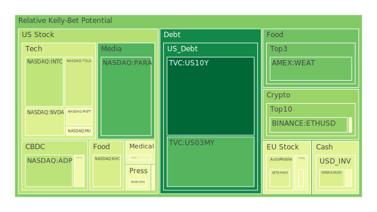
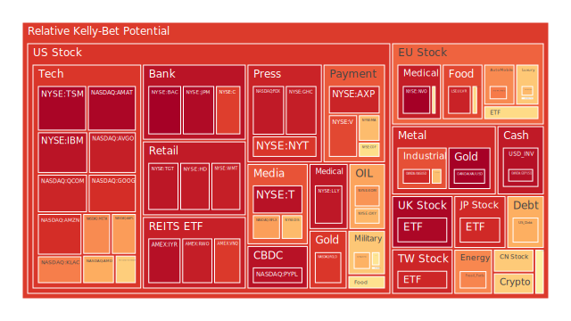
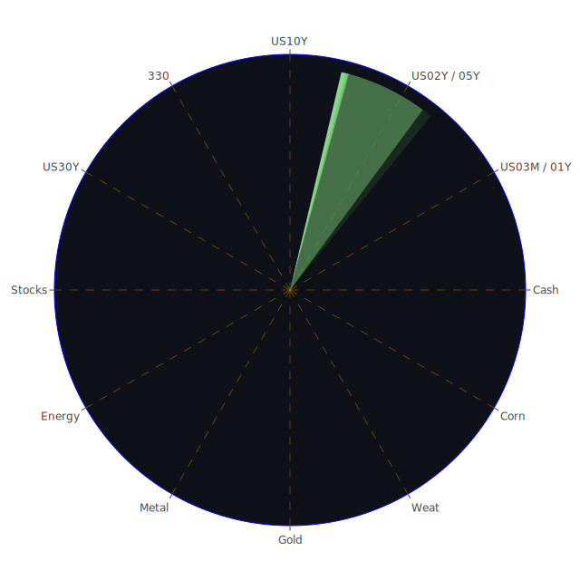

以下報告以嚴謹客觀的視角，結合經濟學、社會學、心理學與博弈論四種理論基礎，從空間（Spatial）、時間（Temporal）與概念（Conceptional）三位一體的角度，嘗試對當前市場與新聞所構成之多層次交互關係進行探討，同時也融入了正面與負面消息的「正—反—合」詮釋。報告將依照「投資商品泡沫分析」、「宏觀經濟傳導路徑分析」、「微觀經濟傳導路徑分析」、「資產類別間傳導路徑分析」以及「投資建議」進行完整闡述，最後並附上風險提示。雖然以下文字盡可能擷取並彙整了近期多項新聞、歷史類比及既有理論的觀點，但市場瞬息萬變，應審慎評估。

---

# 投資商品泡沫分析

在評估各項資產的泡沫風險時，我們觀察到近期的D1、D7、D14、D30等多層次風險指標，顯示部分資產已接近或超過過去常見的風險臨界值。以下從各類主要標的出發，結合近期新聞與歷史參考，進行客觀敘述：

## 美國國債
美國國債（如US10Y、US02Y、US03MY、US30Y、US05Y、US01Y等）在最近的殖利率表現顯示，10年期與30年期之間的利差仍相對狹窄，根據最新數據顯示，US10Y殖利率約4.50%，US02Y則約4.28%，US30Y來到4.71%。依照過去歷史經驗，當長短端利差持續偏低或倒掛度緩慢修正時，代表市場對未來經濟有不確定的預期，可能暗示經濟成長疲弱或擔憂通脹反覆。  
根據新聞面，許多與地緣政治、國際政策相關的不確定因素（例如美國政府對部分地區的新關稅或減少進口配額等）都可能推升避險需求。然而，聯準會近一段時間的鷹派講話相對減少，加上部分官方數據出現矛盾：一方面SOFR、OIS FED Fund Rate等利率指標高低互見，另一方面TGA（美國財政部一般帳戶餘額）出現走高，代表政府端資金活動有所變化。也有新聞報導提及“Bond Market Gains Fade as Trump, Inflation Keep Yields Elevated”等負面因素，暗示政治與通脹預期雙重壓力。  
從經濟學與社會學角度看，美國國債依舊是避險需求的核心品，但若FED政策產生大幅度轉向，將導致長端殖利率震盪。心理學與博弈論層面顯示，部分機構可能利用美國國債對沖其他高風險資產，因此市場對美國國債的需求並不會一夕消失。然而，長期來看，美債的結構性風險如舉債規模攀升、財政赤字居高等，也容易在通脹壓力抬頭時引發市場擔憂。

## 美國零售股
觀察零售股時，我們可以參考近來對消費者信心的數據。像WMT、TGT這些大型零售商，其風險指標在D1、D7與D14上呈現較高值。新聞面上，有關消費者就業前景的資訊並不樂觀，例如「11 US cities where home prices are falling the most」這類報導，暗示一些地區購買力正在被房地產價格下滑與就業壓力削弱。另外也有多起關於企業裁員的消息（Boeing、Meta、Microsoft、BP等），對消費者支出產生負面預期。社會學與心理學層面顯示，一旦消費者對未來更沒有信心，日常零售業可能首當其衝。然而也有報導指出，「Elf Beauty CEO提到市場受TikTok禁令和野火干擾」，顯示零售板塊並非單純經濟面的波動，而是綜合了社群、地緣事件、天災等多重衝擊。歷史類比可回顧2008年或2001年，當失業率走高與消費者信心低迷時，美國零售股往往先行反應並進行庫存調整。

## 美國科技股
美國科技股包括TSLA、MSFT、NVDA、AAPL、AMZN、GOOG、META、AMD、QCOM等，在近數月來持續維持較高泡沫分數。以TSLA為例，其D1風險值已達約0.38至0.39上下，D7與D14則分別更高，意味短期與中期泡沫風險皆相對顯著；MSFT、META和AVGO等企業的D1、D7、D14、D30分數都高居不下。近期新聞也提及，「Hidden AI stocks set to rally amid DeepSeek's breakthrough」，暗示AI題材持續帶動科技板塊投資熱度，但另一方面「Is AI making us dumb?」等負面議題也開始浮現，市場對AI的過度熱情可能產生反向擔憂。  
心理學角度：科技股容易激起投資人對未來高成長、高回報的想像，導致估值層面有時脫離傳統本益比範疇。社會學則顯示，科技創新的集體熱潮常在牛市後期出現，容易助長泡沫。歷史角度可參考2000年網路泡沫——市場對網路經濟無限想像，最終併發大量投機與估值失衡。若之後聯準會政策轉向更緊縮，科技股恐面臨估值重估。

## 美國房地產指數
美國房地產整體波動度由多方指標衡量，如RWO、VNQ或更廣泛的房市數據（固定房貸30年利率已上升至約6.89%）。最新風險分數顯示RWO、VNQ都接近或超過0.88的區間，泡沫跡象不容小覷。新聞面提到有11個美國城市房價正在下跌，但這種「下跌」不一定代表房地產崩盤，更可能顯示區域性修正。  
回顧2008年金融海嘯的歷史教訓可知，房貸利率變動、失業率飆升等結構性因素都是引爆房市修正的關鍵。社會學上，民眾對「房地產只漲不跌」的信念若再度動搖，恐引發系統性拋售，但目前僅見部分城市房價下修，尚未擴散全國。心理學與博弈論層面若開啟「跌價恐慌」，可能迅速擴大。

## 加密貨幣
BTC、ETH、DOGE近來出現相對活躍的走勢，同時風險指數顯示BTC的D1雖下降至約0.48，但D7仍在0.59上下，ETH的D1則在0.27至0.48之間（不同日期有不同波動）。DOGE也有明顯波動。一些正面消息（例如「Team Trump’s fight to convince Wall Street that Musk's DOGE is good for markets」）持續渲染，另外也有負面觀點如「Experts warn MicroStrategy’s high-flying valuation has ‘no rational explanation’」。歷史面可回顧2017年與2021年的加密熱潮：一旦市場瀰漫大量投機與FOMO情緒，加密貨幣易於飆漲，但當政治監管或企業財報不如預期時，又可能激發大幅拋售。  
社會學與心理學而言，加密貨幣類資產常帶有社群信仰與散戶集體行為特徵；博弈論角度，機構投資人也在透過期貨與其他衍生品「對沖」，使價格波動被放大。若政治形勢或法規監管大幅收緊，該領域可能瞬間面臨恐慌性賣壓。

## 金 / 銀 / 銅
近期看到XAUUSD（金）、XAGUSD（銀）以及COPPER（銅）都有比較明顯的異動。金的D1風險值在2月11日顯示高達約0.99左右，顯示短線潛在泡沫風險頗高，但仍是市場上的避險標的。銀的D1也在0.91至0.93之間波動，銅則略低於0.70到0.66上下。新聞面提到石油與金屬之間的比價關係有所變化，「GOLD OIL RATIO已上升至約40.30」，「GOLD COPPER RATIO約623.06」。這代表當前金屬市場的相對估值波動加劇。歷史上，在地緣衝突加劇或全球資金面寬鬆時，貴金屬往往走強；但若經濟復甦使得工業金屬需求上升，銅等基本金屬也可能同漲。  
社會學層面顯示，投資人對黃金的「金融保護」心態往往根深蒂固，而對銀、銅等工業金屬的需求則與經濟週期具高度正相關。博弈論角度，一些對衝基金可能同時在貴金屬與工業金屬之間進行對沖布局，以封鎖部分系統風險。

## 黃豆 / 小麥 / 玉米
大宗農產品如SOYB（黃豆）、WEAT（小麥）、CORN（玉米），近幾期的D1風險值都落在0.18 - 0.55之間。儘管表面上顯示泡沫風險不算極端，但也需留意氣候因素與地緣因素：新聞提及多國天災、水資源短缺以及政治性關稅調整，都可能在中期造成供需失衡。社會學與心理學層面，食物安全議題常牽動民眾情緒，若大規模天災或者全球貿易摩擦升溫，農產品可能瞬間供給短缺、價格飆漲；反之，若出現豐收且市場需求低迷，也會加速價格下跌。歷史來看，大宗農產品易受地緣戰爭與政府農補政策影響，投資人須審慎追蹤相關消息。

## 石油 / 鈾期貨UX!
近期油價（USOIL）D1風險值已攀升至0.54-0.76上下；新聞面顯示「Gulf Refiners Are Balking at Watery Mexican Oil in Blow to Pemex」，加上對OPEC產量與地緣局勢的持續關注，使得原油市場供需情緒波動加大。至於鈾期貨（UX1!），因能源轉型與地緣政治因素，過去一年來市場對核能需求的討論升溫，但其D1風險值約在0.50上下，並未到極端狀態。  
在經濟學與博弈論來看，石油受到美國頁岩油生產、OPEC策略、地緣政治與全球需求所影響；鈾則相對受國家政策（核能發電）與環保壓力影響。假設未來全球經濟下行，石油需求走弱，價格就會回落；若地緣衝突升級或核能逐漸擴張，鈾價格可能被推升。

## 各國外匯市場
外匯方面，GBPUSD、AUDUSD、EURUSD、USDJPY等近來呈現不同程度波動。例如果英鎊對美元在1.24上下徘徊，澳幣對美元在0.63左右，高泡沫風險指標顯示市場對部分商品貨幣（特別是與大宗商品高度關聯的AUD）心存疑慮。近期「Commodity Currencies Slide on Trump Tariff Plans: Markets Wrap」等新聞，揭示了政治消息對外匯的影響。心理學與社會學層面，外匯市場常是國際資金避險或投機的戰場；歷史上多次顯示，大型關稅與地緣衝突能在短時間內使某些貨幣波動劇烈。博弈論觀點則強調，央行干預和大型機構投資者頭寸對匯率影響甚鉅。

## 各國大盤指數
近期歐洲如FCHI、GDAXI等，亞洲如JPN225（日本指數）、SSE的相關指數，及英國FTSE等，都隨著政治新聞與全球經濟展望同步波動。舉例而言，FTSE目前泡沫指數約在0.98上下，相當接近警戒線，體現英國與歐盟之間的經貿談判與全球投資人對英國市場的不安。JPN225則來到約0.91，顯示日本股市雖然有企業財報成長動能，但也有日圓匯率和通脹不穩定等疑慮。根據「S&P 500 Gains and Losses Today: Supermicro Stock Surges Ahead of Business Update」等新聞，美國的大型指數波動幅度也不小。  
社會學層面，群體對「主要股指」普遍有正面信心，一旦一些領頭企業發布樂觀業績，就能帶動指數上漲；但倘若地緣政治或大型央行政策轉向負面，市場的樂觀情緒可能瞬間消退。

## 美國半導體股
包括MU、INTC、AMD、QCOM、KLAC、AMAT、NVDA等。半導體股的估值往往極度依賴全球需求，以及對未來技術換代的想像。D1與D7風險值普遍偏高，如INTC、MU近期在0.34-0.58區間，QCOM更高達0.91。新聞面提到「Hidden AI stocks set to rally」、「Another loaded Russian oil tanker stricken at sea」等，顯示AI與地緣問題同時影響半導體供應鏈。從歷史來看，半導體股在科技景氣循環中屬高波動板塊，社會與心理層面若出現「搶晶片」或「庫存堆積」等訊息，常造成大幅波動。博弈論則指向各國對先進製程晶片的爭奪與政策補貼，一旦貿易壁壘升高，相關企業可能受惠或受損。

## 美國銀行股
包含JPM、BAC、C、COF等；根據報告顯示，JPM近期D1風險高達0.97，BAC則更接近0.99，此類高風險分數往往暗示市場對金融體系健康度產生疑慮。然而，新聞並無明顯銀行業危機，但政治或國際事件若干擔憂（例如債務上限、資本適足率、商業地產等）均可能累積風險。歷史類比：2008年金融危機期間，美國銀行股先因房貸資產危機大幅回落，但在政策出手救市後，又成為強勁反彈代表。心理層面，投資人對銀行股常存有「too big to fail」信仰，博弈論角度亦見大型銀行利用金融創新工具在市場中對沖風險。但若聯準會持續縮表或通脹無法控制，銀行業可能面臨更大的撥備壓力。

## 美國軍工股
LMT、NOC、RTX等公司股票隨著地緣政治動態調整。報告指出LMT、NOC風險指數高於0.52至0.78之間，不算極端，但也不可忽視。新聞方面，可見多次抗議活動在歐洲與各地爆發，但軍費支出可能因地緣衝突而水漲船高。從博弈論角度，國防開支常被認為較不易大幅縮減，因此軍工股具一定防禦力；心理學與社會學層面，民眾對於戰爭或防禦性需求的正當化看法會影響軍工企業的長期訂單走勢。歷史上，美國在面對國際局勢緊張時，軍工板塊常逆勢維持相對高檔。

## 美國電子支付股
V、MA、PYPL、GPN等持續受市場矚目。近期V與MA的風險指數都接近或超過0.87-0.92，PYPL則高達0.96上下。新聞中並未直接提到大型電子支付公司有明顯利空，但全球經濟若轉向衰退，消費與跨境支付量就會走弱。歷史上，電子支付股多跟隨整體消費力變化；博弈論視角，支付平台在網路社群與線上零售生態系中扮演關鍵地位，亦難避免宏觀衝擊。

## 美國藥商股
如JNJ、MRK、LLY等。報告顯示，JNJ、MRK、LLY的D1風險值在0.45-0.95之間，高低差異頗大。新聞面提到「Trump wants to put tariffs on prescription drugs. Experts warn it could backfire.」，若真實施此類關稅，將打亂全球製藥供應鏈。社會學與心理學層面，醫療需求具有剛性，藥商股通常穩定，但政策面不確定將影響企業利潤預估。歷史案例看來，醫藥股雖常被視為防禦性標的，但也會受到政府補助或保險制度改革的重大衝擊。

## 美國影視股
包含DIS、NFLX、FOX等，其泡沫風險指數多在0.67-0.94之間，尤其NFLX、FOX接近0.72-0.94。新聞可見串流平台之間競爭激烈，且近期「S&P 500 Gains and Losses Today: Supermicro Stock Surges Ahead of Business Update」雖沒有直接針對影視公司，但整體市場情緒易受到「就業市況」「貨幣緊縮與否」「消費者預算」影響。歷史上，經濟衰退時，民眾娛樂預算可能縮減，也可能因「宅經濟」需求而釋放某些機會，呈現兩極發展。博弈論層面，各大影音平台在競爭用戶數時，也會發生補貼或定價戰，影響短期財務表現。

## 美國媒體股
與影視股相似，但涵蓋更廣，如NYT、CMCSA等。NYT目前風險指數在0.88上下，CMCSA則在0.46-0.63之間。市場整合、廣告市場競爭、社群媒體興起等長期因素都會影響傳統媒體經營；新聞面也頻繁討論政治與經濟議題對媒體的衝擊。心理學與社會學角度，媒體在輿論塑造和廣告營收上易受景氣變化與意識形態對立所左右。歷史上，印刷媒體的轉型艱辛已非新鮮事，未來可關注訂閱模式與多元佈局的成效。

## 石油防禦股
以XOM、OXY等為代表。XOM和OXY的風險指數介於0.58-0.68。新聞提到「BP targeted by activist investor as Trump unshackles US oil giants」，顯示油氣產業在政治政策放寬下可能獲利，但也同時面臨環保與ESG壓力。若地緣情勢升溫，石油供應中斷恐怕推高油價，使這類公司獲得短期收益。然而一旦全球經濟轉弱或綠能革命加速，石油需求下降，便對企業營收造成衝擊。

## 金礦防禦股
如RGLD等標的顯示，風險值約在0.90上下，處於高位。金礦企業通常在金價走升時受惠，但也需要考量開發成本與地緣風險。若全球避險情緒逐漸增強，金礦股短期或有支撐。然而，一旦市場風向急轉，貴金屬也可能隨資金輪動而被拋售。回顧歷史，在2008年金融危機爆發前後，金礦公司股價波動相當劇烈。

## 歐洲奢侈品股
KER、MC、RMS等。這些公司泡沫指數約在0.45-0.71之間，部分甚至更高。新聞提到「Germany saw new asylum applications tick upward in January」以及「Protesters in Slovakia demand PM Fico resign over Russia stance」，歐洲政治局勢仍多變，若造成富裕階層的信心動搖或旅遊消費減緩，奢侈品銷售也會受衝擊。歷史證據顯示，奢侈品行業在經濟擴張期通常超額成長，但遇到緊縮或重大地緣風險時，下跌速度也可能快於平均。

## 歐洲汽車股
BMW、MBG等。D1風險值中度，約在0.49-0.77區間。歐洲汽車產業正面臨電動化轉型、排放法規趨嚴、與國際競爭升溫等挑戰。新聞提到「Scholz Fails to Land Decisive Blow in German Election TV Debate」及「Thousands more people rally in Germany against the far right」，顯示德國政治氣氛仍存在分裂情況，社會對傳統汽車製造商是否能順利轉型存在疑慮。若經濟逆風、油價高漲、電動車競爭者崛起，都將衝擊歐洲汽車股的獲利。

## 歐美食品股
如KHC、NESN等在報告中可以觀察到，黃豆、小麥等原物料價格變動將影響食品業盈餘。市場上對未來通膨與消費力有多空爭論，KHC、NESN的D1風險各在0.39與0.61上下。若糧價繼續走揚或全球物流受阻，食品股利潤空間可能承壓，但同時食品行業具剛性需求，通常具一定防禦屬性。

---

# 宏觀經濟傳導路徑分析

1. **Spatial（空間面）**  
   目前全球主要經濟體同步受到政治波動（例如美國對外關稅、歐洲內部分歧、亞太供應鏈重新布局）所衝擊。地理分佈上，美國主導的貨幣緊縮政策、歐洲面臨難民與地緣衝突、亞洲在供應鏈替代中扮演新角色，三大區域之間互為市場、互為競爭，也意味若其中一方政策急轉，資金或商品流動會立即波及其他區域。

2. **Temporal（時間面）**  
   短期（1-3個月）觀察到的通脹微幅降溫，但市場對聯準會是否暫停升息存疑。中期（半年左右）則需留意中美之間的關稅博弈是否再度升溫，以及歐洲各地政治動盪對經濟復甦的影響。長期（1年以上）地緣衝突、能源轉型與全球債務堆高都可能成為潛在壓力點。

3. **Conceptional（概念面）**  
   經濟學理論：貨幣供給與利率對需求的調控並非線性，若市場持續緊縮，實體經濟或債務風險擴大。  
   社會學理論：群眾預期容易在社群媒體與政治宣傳中被極化，導致投資行為過度反應。  
   心理學理論：投資人對突發消息（如地震、戰爭、瘟疫或政治大變動）有迅速集體恐慌或興奮的傾向。  
   博弈論：大國之間的貿易與金融制裁過程中，各方會採取報復與應對手段，造成市場不斷重新定價。

---

# 微觀經濟傳導路徑分析

1. **企業層面**  
   企業因應高利率、關稅或原物料價格波動，會調整庫存與人力；大量裁員新聞也導致消費信心下降，進而回過頭影響企業的營收。若政治環境變動頻繁，企業投資計畫容易延期或保守。

2. **消費者層面**  
   消費者因就業前景不確定，可能縮減非必需品支出。高房貸利率使房市放緩，也影響整體消費意願。若部分地區爆發社會動盪，甚至影響到物流與供應，使物價或日用品缺貨進一步推高通脹，打擊消費者信心。

3. **金融機構層面**  
   銀行與投資機構需同時面對市場波動、政策不明確風險。若信用卡違約與房地產違約率上升，銀行需增提呆帳準備，亦可能緊縮放款標準，形成金融循環的下行壓力。

---

# 資產類別間傳導路徑分析

1. **原物料與貨幣**  
   石油、金屬與農產品價格若快速上漲，將刺激通膨，同時影響央行貨幣政策取向。貨幣緊縮會推升國債殖利率，並使風險資產（如科技股或加密貨幣）面臨下行壓力。

2. **地緣衝突與軍工、能源、防禦性資產**  
   一旦地緣衝突升級，軍工股與能源股往往獲得短期題材，但經濟衰退風險也會同步攀升，投資人會轉向黃金或公債避險，形成資金大規模挪移。

3. **股債聯動與避險**  
   若聯準會繼續升息或市場對衰退擔憂增強，長天期公債殖利率走高，股市估值下降；同時若風險意識變強，部分資金又會轉向黃金、日圓或瑞郎等傳統避險領域，引起外匯市場大幅波動。

4. **科技股與市場情緒**  
   科技股本身具高波動特質，若泡沫破滅風險增加，市場恐慌蔓延到其他板塊，尤其是半導體或電子支付等與全球消費綁定的產業，進一步影響就業與消費信心。

---

# 投資建議

以下基於風險對沖及資產相關係數約-0.5的假設，嘗試在三位一體正反合的框架下，提出穩健、成長、高風險的投資組合配置方向。其彼此盡量滿足120度「相位」分散，以降低市場單一波動衝擊。

1. **穩健型（約40%）**  
   - **美國國債** (如US10Y)：在經濟不確定環境下，仍是避險基礎工具，可約配置15%。  
   - **黃金** (XAUUSD相關標的或金礦股RGLD但需降低比重)：在地緣衝突風險下作對沖，可配置10%。  
   - **大型傳統消費股** (如KO、NESN)：雖D1風險偏高，但因剛性需求具防禦性，可配置15%。

2. **成長型（約40%）**  
   - **美國軍工股** (如LMT或RTX)：地緣衝突風險增高，軍工具中長期訂單優勢，可配置10%。  
   - **歐洲奢侈品股** (如KER、MC、RMS)：雖有政治風險，但高淨值客群韌性相對強，長線可配置15%。  
   - **科技股龍頭** (如MSFT、AAPL或GOOG)：AI與數位化浪潮仍然強勁，先進企業掌握技術瓶頸，可配置15%。

3. **高風險型（約20%）**  
   - **加密貨幣** (BTC或ETH為主)：波動極大，需嚴控部位，僅配置5%。  
   - **半導體股** (如AMD、NVDA、AMAT)：具高成長但估值昂貴，若波動巨大，建議配置10%內。  
   - **石油/鈾期貨** (如USOIL、UX1!)：政治與供需動盪帶來高槓桿機會，但風險亦高，配置5%。

上述比例僅供參考，總和維持在100%。各標的之間仍存在系統性風險，一旦全球經濟顯著衰退，所有風險資產都可能面臨回檔。

---

# 風險提示

投資有風險，市場總是充滿不確定性，尤其當前全球政治經濟形勢複雜多變，任何突發新聞、地緣緊張、央行政策轉變都可能引發漣漪式的資金移動與資產價格重估。本報告所提出的分析與建議，僅供參考之用，不能保證獲利。投資人應根據自身的風險承受能力、投資目標、資產配置比例，以及對宏觀趨勢的判斷，做出獨立而審慎的投資決策。同時，需特別留意高泡沫風險資產的可能暴跌空間，包括但不限於高估值科技股、加密貨幣、部分貴金屬與地緣敏感度高的能源品。回顧歷史，任何泡沫都可能在狂熱階段出現看似合理的支撐論調，但轉折點往往在於資金鏈與心理防線的一夕崩解。

綜合以上，我們從空間、時間、概念三個層次出發，並透過「正—反—合」的思維框架，嘗試勾勒出市場在各大類資產、地緣政治、新聞情緒以及歷史經驗交疊下所形成的整體圖景。雖然在多層面分析後，部分資產顯示出極高的泡沫與風險指標，但也同時蘊含結構性成長機會。投資者若能依照穩健、成長、高風險的架構區分，並適度掌握資金分配與風險對沖策略，就有機會在市場波動之間找到相對優勢。然而，無論如何，請謹記任何投資計畫都應量力而為，並做好資金控管與心理建設。風險管理永遠是首位，市場上沒有保證收益的交易，過度追逐短期暴利或忽視估值基礎，都將面臨巨大泡沫化風險。  

最終再次強調：投資並非單靠短期新聞或技術指標就能保證判斷正確，必須持續關注宏觀趨勢、地緣政局、企業財報與各種社會心理因素的變化。全球互聯格局下，每個區域政策的轉向或黑天鵝事件，都可能成為左右資產價格的大變數。縱使本報告試圖透過空間、時間、概念的三位一體分析來降低偏見與盲點，也僅能提出可能的發展脈絡；而一切最終仍需投資人根據自身狀況、資訊資料與市場動向做最終判斷。投資有風險，市場中充斥著泡沫警訊，請務必保持理性、警覺與持續關注。祝各位投資順利。

 
Daily Buy Map:

 
Daily Sell Map:

 
Daily Radar Chart:

 
