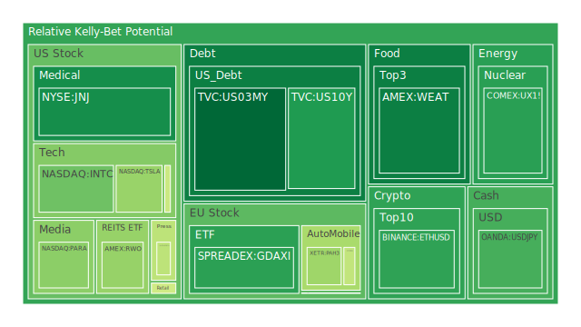
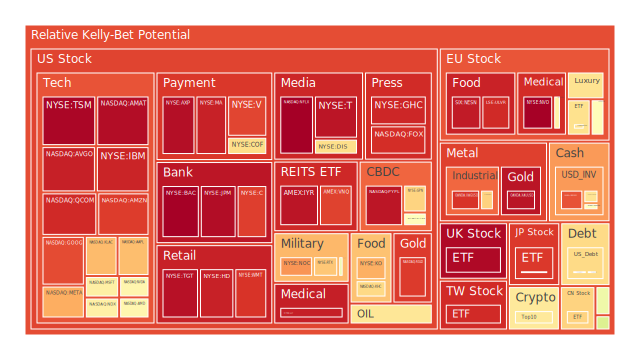
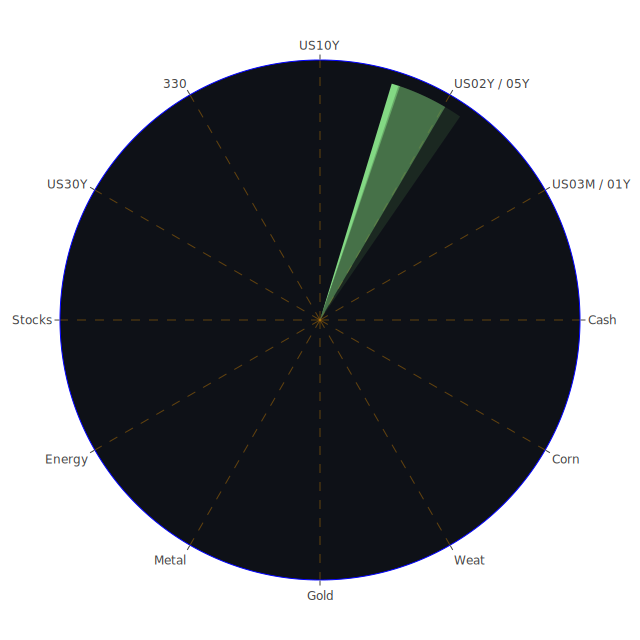

# 一、整體宏觀環境與「三位一體」的基礎分析

基於所提供之聯準會（FED）關鍵數據顯示，Reverse Repo（RRP）走低、TGA上升、EFFR Volume高企、聯準會總資產相對偏低、BTFP與Discount Window相對低、FED Reserve相對高，而FHLB Advances偏低、GSE偏高，商業不良貸款（特別是信用卡與不動產相關）均有顯著提高的趨勢。這些指標透露出資金面出現分層化：一部分資金仍留在銀行體系之中（體現為FED Reserve偏高），但另一部分市場流動性似乎在錢市場基金走高之際被抽離到美國國債或其他固定收益工具。RRP與TGA的動態顯示短端資金的去化與政府帳戶之資金調度在調整，EFFR Volume上升說明市場對於銀行間拆借需求依然旺盛，或有更多機構需要短期資金周轉。以上種種，從經濟學角度可理解為貨幣市場正在重新定位，社會學角度來看則顯示市場情緒因地緣政治、新聞議題、政府財政及貨幣政策變動等因素而産生廣泛影響；心理學角度則往往造成大眾「一窩蜂」的避險（或追逐）行為；博弈論角度，則可將上述現象視為各個市場參與者對政策與流動性緊縮（或寬鬆）的預期競合，當有人判斷「利率將持續上行」時，便可能一同搶購短期工具或選擇特定資產避險。

進一步觀察殖利率：一年期美債殖利率約在4.25，二年期4.29，五年期4.37，十年期4.54，三十年期4.75，與前週、前月相較略有些微差異但大體上未見劇烈跳動。明顯可見Yield Curve雖呈現較為平緩，但相對於一年多前的數據（五%以上或更高的短端利率狀態）已有所修正。此外，OIS FED Fund Rate於短時間內由5.33（上週）大幅回落至4.33，顯示市場對聯準會後續升息節奏的預期正在轉向。對投資者而言，短期在避險與配置間可能陷入困惑：若利率見頂，資金或會重新湧入風險資產，但若地緣政治與新聞議題負面衝擊加劇，又可能將人們推回短天期的固收或現金部位。這種「空間、時間、概念」三位一體交織下，任何一則重大新聞（譬如重大企業並購、地緣衝突、政治制裁或關稅戰等）都會形成不同程度的漣漪影響。

從新聞面來看，近幾日涵蓋了許多正面與負面新聞：例如關於美國前總統對關稅、石油與金融監管相關之政策爭議，以及各地的地緣政治衝突。這些新聞有的帶來市場短暫樂觀（如「中國電動車銷售利多」「AI領域投資增加」），有的則帶來市場不安（如「俄羅斯油輪事故」「通貨膨脹黏性」等）。結合本次提供的市場情緒分數，明顯可以看出：當特定負面新聞衝擊在九成以上時，市場避險情緒相對迅速升溫；正面新聞雖也有影響力，但經常被其他政治或經濟面事件所抵銷。這種「正反拉鋸」符合博弈論對市場訊息衝擊的描述：不同參與者擁有不同風險偏好與預期，同一則新聞可能在短期刺激股市上揚，但隔日就因另一負面事件翻轉行情。

值得注意的是，FED總資產與高收益債利率的變動暗示：市場中高風險債券仍有較顯著的「爭議空間」。若高收益債（垃圾債）的利率高企，通常意味著資金對該領域要求更高的風險溢價，背後或許是預期違約率上升、經濟下行風險增強，也或許是受制於地緣政治不確定性。再者，銀行體系內的貸款不良率提升，更說明了信貸條件正在趨緊。此外，美國房貸三十年固定利率已升至6.89的水平，比一年前2.81的超低檔高出許多，也影響房地產市場的流動性與房價漲幅。

---

# 二、各大資產類別的泡沫分析（綜觀「空間、時間、概念」三向）

以下將依照分類，一一探討其所顯示的D1、D7、D14與D30風險分數是否有偏高跡象，以及其在當前環境中面臨的潛在泡沫風險。基於資訊航母「三位一體正反合」的整理，先就正面思考（正）、負面思考（反），再進一步綜合出可能結論（合）的方式進行。此處所有符號均忽略券商名稱，只保留資產標示，例如US10Y、TSLA等。

## （1）美國國債 
代表性如US10Y、US03MY、US02Y、US05Y、US30Y等。從最新數據可見短端利率（例如US01Y、US03MY）維持在4.2-4.3上下，長端（US10Y、US20Y、US30Y）約在4.5-4.8左右，整體曲線相對平坦但仍具一定程度的斜率。許多新聞提及通脹黏性與政治環境不確定，導致國債短期買盤一度增長，但市場對未來利率政策走向也存在爭論。

正面：美國國債一直是全球避險資產的重要支柱，FED雖表示鷹派言論，但市場對其「暫停升息或減緩升息」之預期逐漸升溫，一旦聯準會態度轉向更明確寬鬆，長端債券價格可能回升。

負面：如果未來幾個月通脹居高不下，聯準會再次祭出更強硬立場，加上地緣衝突導致財政預算吃緊，長端殖利率仍有上行空間，屆時價格下跌風險將衝擊持有人。

綜合：短期或有相對穩健的機會，但長期走勢仍依賴通脹控制與經濟成長情況。D1、D7等短期泡沫指數偏低，D14或D30相對平滑，但若遠期通脹變動劇烈，市場對國債的安全性評價仍可能波動。

## （2）美國零售股
如WMT、TGT等象徵零售消費的龍頭。在新聞面常見對美國消費力道的判斷，預示整體經濟景氣。最新數據指出零售股部位風險指數（如TGT之D1接近0.97之高，WMT約在0.91-0.93上下）。

正面：就社會學來看，若就業市場尚可，民眾消費力仍有支撐，特別在年終或季末促銷時段，零售業容易爆發短期利多。新聞亦提及可口可樂、必勝客母公司等標的業績不錯，顯示消費股市或有續強的契機。

負面：高通脹環境下，家庭可支配所得減少，疊加信用卡違約率提升，未來一旦消費者緊縮支出，美國零售股恐面臨評價下修。近期許多新聞談到民眾負債水位飆高，若衰退預期加大，零售股或遭空頭打擊。

綜合：因其泡沫風險指數現居高位，技術上易受市場情緒波動。儘管基本面在某些零售龍頭上仍算穩定，但應注意庫存壓力與季節性因素，一旦銷售數據不達預期，股價回調恐顯著。

## （3）美國科技股
包含AAPL、MSFT、GOOG、META、AMZN、TSLA、NVDA、AMD、QCOM等，這些近年來因AI話題而受追捧。最新的風險指數顯示，像AAPL、AMZN、META、NVDA等D1已有明顯偏高（介於0.65到0.95之間），有些甚至逼近或超過0.90。

正面：經濟學層面，科技巨頭歷經多次景氣循環，基本面相對強勁。社會學、心理學層面，人們對AI、雲端、電動車等創新領域的期待高漲，媒體報導如「特斯拉自動駕駛突破」「AI領域投資激增」等，持續帶來刺激。

負面：估值或已透支未來成長，尤其在利率趨勢尚不夠明朗、貨幣市場重新洗牌之際，若接連出現負面消息（例如：某公司營收不及預期、監管政策改變），股價很可能劇烈波動。TSLA或META等個股先前就出現過大起大落。

綜合：科技股具長期潛能，但短期炒作泡沫風險高，D1與D7指數居高難下，顯示投機資金還在場內。博弈論告訴我們，投資人彼此都清楚高估值風險，但在缺乏負面事件引爆前，多頭往往會堅守，直到「最後一根稻草」出現。

## （4）美國房地產指數
可觀察VNQ、RWO等房地產ETF，以及整體不動產股，如IYR等皆有接近0.88-0.96不等的泡沫指數，顯示風險仍偏高。固定房貸利率6.89的水準，也對該市場施加一定壓力。

正面：部分市場資料顯示，高端與商業不動產需求依然存在，如中東與其他地區資金買進倫敦或美國某些核心地段。某些新聞也提及「中東投資人有意注入不動產領域」，這在高端市場形成支撐。

負面：利率的持續高企導致房貸成本上揚。銀行體系中商辦貸款及房貸違約率增幅嚴重，未來若經濟衰退加深，房地產泡沫恐被戳破。商辦空置率上升，住宅市場也可能隨之走弱。

綜合：短期內僅特定地段或高端項目具投資價值，普遍市場存在風險，泡沫指數顯示市場對房地產評價並不樂觀，投資者務必謹慎。

## （5）加密貨幣
如BTCUSD、ETHUSD、DOGEUSD等。數據顯示BTC與ETH的D1約在0.48-0.61，DOGE更是曾高達0.63以上，顯示短線波動相對活躍。

正面：多國對數位資產監管逐漸明確，部分交易所合規運營，且在地緣政治動盪中，加密資產偶爾會被視為「價值儲藏」的替代方案之一。新聞中亦常提到某些國家對加密貨幣採取較為友善的政策。

負面：此領域仍有許多不確定性，包含監管風向改變、交易所或機構倒閉風險。若全球經濟大幅下行，機構投資人可能抽離加密市場。此外，詐騙與資金盤風險無法忽視。

綜合：加密貨幣依然高風險高波動，泡沫風險並未遠離，雖短期有技術性反彈，但任何小道消息都能掀起劇烈漣漪。

## （6）金／銀／銅 
GOLD（XAUUSD）泡沫指數在0.96左右，銀（XAGUSD）約0.91-0.94，銅（COPPER）約0.69-0.72；金銀比與金油比均在升高，顯示黃金對石油與銅的比率走升。

正面：歷史上在地緣衝突、通脹高漲或資金流動偏緊時，金銀常成為避險標的。新聞面出現許多不安定因素，例如俄羅斯、烏克蘭地緣事件與通貨膨脹疑慮，理論上利好金銀。

負面：若聯準會突然再度緊縮且經濟轉衰，工業需求下滑，對銀銅等亦可能形成利空，而金價若先前過度被追捧，也有獲利了結風險。D1與D7之高水位顯示投資人對黃金需求旺盛，但也蘊藏短線泡沫危險。

綜合：金銀銅具備產業與避險多重屬性，要視未來數月貨幣政策與工業需求走勢而定。目前金價雖強，但一旦市場情緒翻轉，波動亦可能擴大。

## （7）黃豆／小麥／玉米
對應SOYB、WEAT、CORN等ETF。觀察到風險指數在0.51-0.54上下，小麥WEAT則相對稍低0.16-0.21，但黃豆與玉米都可能被天候或地緣因素所影響。

正面：地緣衝突抑制了部分糧食出口，國際市場可能需求支撐；若天氣異常（颱風、旱災等），價格容易向上波動。

負面：全球經濟放緩，需求成長趨勢也會減緩；若主要生產國豐收，供給提升，價格會遭受壓力。

綜合：農產品類有時會快速飆升，也可能短期回落，整體風險泡沫指數中等，要留意突發性政策（如出口禁令或關稅）造成價格衝擊。

## （8）石油／鈾期貨UX1!
USOIL近來在70-73之間，UX1!則在68-69上下浮動，風險指數在0.35-0.50的中間帶。新聞提及俄羅斯油輪事故等地緣變數，短期內或對油價形成波動。

正面：若地緣政治風險升溫，或OPEC+進一步減產，油價有機會再上行。鈾方面則受新能源興起的激勵，若核能政策明確推廣，價格有支撐。

負面：全球經濟若衰退，石油需求下降；加上替代能源競爭，油價難再現極端牛市。鈾礦雖具有題材，但核能政策在很多國家仍有爭議，需求成長不如想像般迅猛。

綜合：油與鈾相對處於觀望區間，大漲或大跌端看政治或環保監管態度之變化。

## （9）各國外匯市場 
包括EURUSD、GBPUSD、AUDUSD、USDJPY等。AUDUSD與EURUSD因大宗商品與歐洲經濟之影響而動盪，日圓USDJPY在150以上高位，代表日圓走貶。英鎊GBPUSD於1.24-1.25範圍，風險指數在0.55-0.87不等。

正面：若美國進一步減緩升息，非美貨幣有機會相對走強。經濟若復甦，英鎊、歐元與澳幣等也可望獲資金青睞。

負面：歐洲經濟在新聞中仍有「數年陰霾」的預測，日圓方面日本央行若仍未有大幅度政策轉向，匯價易陷於投機資金炒作。地緣衝突升溫時，避險情緒反而可能推升美元。

綜合：外匯市場瞬息萬變，利率、通脹、政治談判皆可影響匯價，要謹慎關注各央行動向。

## （10）各國大盤指數
歐洲、德國（GDAXI）、法國（FCHI）與英國（FTSE）等主要指數，以及中國（000300）與日本（JPN225）指數等。數據顯示部分指數風險值大多在0.56-0.91區間，英國FTSE近0.98，德國DAX在0.27-0.55之間顯現短期波動。

正面：若國際投資人因美國利率見頂而分散資金至歐洲、亞洲市場，或有正向助力；某些國家財政計畫、基礎建設投資也可帶動股市期望。

負面：歐洲內部政治矛盾、能源供應風險、中國復甦速度不及預期等皆可能打壓大盤表現。一旦全球需求走弱，歐亞市場仍難獨善其身。

綜合：各大指數均牽涉巨大宏觀因素，泡沫程度需同時對照貨幣政策與政治面信心，建議謹慎關注中央銀行和政府之政策走向。

## （11）美國半導體股
如MU、INTC、KLAC、AMAT等。近年因供應鏈重組、AI晶片需求成長，而帶來波段性商機。

正面：伴隨AI浪潮，雲端與資料中心需求巨大，先前投資基金亦對半導體領域抱持樂觀預期。若美國持續實施晶片補貼計畫，有利本土半導體企業。

負面：該領域估值已不便宜，且供應鏈地緣風險難以完全消除。若全球消費電子產品進入衰退，半導體需求也可能放緩。D1或D7泡沫分數在0.70-0.97區間者不在少數，警示高波動風險。

綜合：長線看好，但短線波動風險高，若景氣出現逆風則易誘發獲利回吐潮。

## （12）美國銀行股
如JPM、BAC、C等，相關風險分數甚至一度逼近或超過0.99，顯示市場對銀行股後續走勢看法兩極。

正面：若利率見頂或趨緩，銀行淨利息收入維持一定水平，且先前因存款移轉等雜音造成股價偏低，後續隨市場恢復信心，銀行股或有修復空間。

負面：商業地產與消費貸款不良率上升，若繼續惡化，銀行需提列呆帳，資本結構或受衝擊。信用卡違約飆升在新聞中多次被強調，一旦經濟衰退，銀行獲利模型或面臨重大考驗。

綜合：銀行股可被視為景氣與金融體系的晴雨表，現處於高泡沫高風險區，宜保持謹慎。

## （13）美國軍工股
如LMT、NOC、RTX等。地緣政治時代下，軍工板塊經常受政府預算案或國際衝突新聞帶動。

正面：烏俄戰火、美中競爭升溫，歐洲亦陸續提升軍費，軍工股可能穩定受惠。

負面：若衝突局勢緩和或國會削減開支，也可能拖累股價表現。這種企業在政治變動時風險敞口很高。相關D1在0.54-0.78之間，短線風險屬中高。

綜合：具備防禦概念，但市場定價可能已高估，建議關注合約訂單的實際落地情況。

## （14）美國電子支付股
如V、MA、PYPL、GPN等。移動支付與線上交易盛行帶來持續成長空間，但市場競爭激烈。

正面：線上購物、跨境交易需求大增，帶動支付股長期需求；若未來貨幣政策趨穩，電子支付有機會進一步滲透更多場景。

負面：利率高企時，消費信心或放緩，交易額增速減緩，加之競爭者眾多，手續費率也可能遭壓縮。部分支付公司若在貸款端或信用服務方面擴張，也會面臨信用風險。

綜合：長期基本面看好，但短期泡沫風險不容忽視，許多相關標的D1高達0.90上下，需注意估值疑慮。

## （15）美國藥商股
如JNJ、MRK、LLY、BMY等。醫藥產業受公共衛生、研發管制、專利等影響較大。

正面：人口老化與醫療需求增長是長期趨勢。大藥廠有龐大研發資源與穩定的股利政策，通常在經濟下行時有防禦性。

負面：專利到期、新藥審批風險，以及醫改政策改革不斷。新聞中若有大型官司、併購失利、或稅制改革，股價易受到衝擊。某些公司之風險指數也較高。

綜合：醫藥股在防禦屬性與政策風險間權衡，須留意其財務數字與研發管線的實際進展。

## （16）美國影視股
如DIS、NFLX、PARA、FOX等。流媒體與影院收入在後疫情時代充滿不確定性。

正面：隨著觀眾重回電影院，線上串流平台有一定剛性需求。若內容投資成功，影視公司可借勢擴大市場。

負面：市場競爭白熱化，訂閱數目飽和，廣告收入受全球經濟影響，也有可能大幅波動。近期NFLX、DIS之風險指數在0.67-0.72區域，短線具不小變動可能。

綜合：行業洗牌尚未終了，在產業整併與競爭中浮浮沉沉，需要留意財報與使用者成長數據。

## （17）美國媒體股
如NYT、CMCSA等。傳統媒體轉型與新媒體競爭激烈，部分風險指數偏高。

正面：品牌傳統優勢猶在，若成功向數位訂閱制轉型，可望維持穩定收入。

負面：廣告市場與閱聽習慣改變，新聞中亦提及廣告客戶預算縮減，一旦經濟衰退，媒體股首當其衝。

綜合：長期仍需觀察該行業數位化程度與市場口碑，投資需謹慎。

## （18）石油防禦股
如XOM、OXY等。油價若維持相對高檔，石油企業獲利空間不小。

正面：新聞中提及活躍投資人關注BP、XOM等在政策放寬時或能獲更大拓展。若油價後續反彈，此類股票具支撐。

負面：若全球減碳壓力增強或經濟衰退，油需求衰減，能源公司股價易受衝擊。OXY等風險指數在0.67-0.68表示短線看似陷入多空交戰。

綜合：該類股與原油價格關聯高，消息面影響大，投資人宜留意中東與北美頁岩油供需動態。

## （19）金礦防禦股
多與黃金價格連動。RGLD等公司D1超過0.90，顯示市場給予相當熱絡的防禦性評價。

正面：若黃金行情持續看漲，金礦公司股價有望同步享受溢價。地緣政治不安也傾向利好。

負面：金價若回落或公司開採成本攀升，利潤空間縮小。礦業本身也面臨環境規範與產量變數。

綜合：和黃金一樣，該領域具避險特質，但估值已相對不便宜，應評估自身風險承受度。

## （20）歐洲奢侈品股
如MC、KER、RMS等。中國市場重新開放帶動需求復甦，成為奢侈品板塊一大焦點。近期股價風險指數大多維持在0.45-0.83區間。

正面：中國與其他新興市場消費者對奢侈品需求依然龐大，只要全球上層消費力不受經濟衰退影響，名牌大廠依然收益可觀。

負面：一旦地緣局勢或經濟衰退影響富裕客群，奢侈品銷售易面臨斷層。再者，旅遊限制若再次收緊（假設未來有疫情或其他政治變動），也會打擊奢侈品銷售。

綜合：屬典型「強勢消費」板塊，供需受高端客群影響，短線尚算穩定，但需留意政治與社會心態變動。

## （21）歐洲汽車股
如BMW、MBG等。歐洲汽車製造商在電動化轉型和地緣政治中間承受挑戰。

正面：電動車、智慧駕駛、新能源趨勢都有助於大廠的全球競爭力。若歐元區經濟回暖，內需可提升銷售。

負面：關稅或國際衝突可能抬高生產成本。銷售若持續疲軟，產能過剩風險浮現。新聞中尚有政治因素影響（諸如德國因能源政策分歧）。

綜合：需要密切追蹤汽車銷售數據與政策。現階段風險指數並不算極高，但仍顯示謹慎情緒。

## （22）歐美食品股
如KHC、NESN、KO等，兼具防禦與增長特質。KHC與NESN風險值中等，KO也有約0.74-0.95區間。

正面：食品飲料在經濟下行時具防禦性。許多大型企業已在開拓健康與新型飲品市場。

負面：若原材料上漲，利潤空間被壓縮；且激烈競爭下，品牌忠誠度需長期經營。消費者口味轉變也帶來潛在危機。

綜合：雖具防禦性，但也非絕對安全，必須觀察原物料成本與全球分銷情況。

---

# 三、宏觀經濟傳導路徑分析

從FED資料可看出貨幣市場充斥交錯信號：RRP與TGA的改變、EFFR Volume處於高檔、銀行體系存款增長，但不良貸款率提高，顯示經濟層面在通脹、就業、消費之間呈現拉鋸。宏觀傳導路徑可如下描述：當聯準會調整利率、縮表或改變前瞻指引時，銀行體系資金成本上升或下降，再影響信貸投放與消費貸款；接著影響房地產與零售消費，最終透過失業率或就業薪資等渠道迴饋，左右投資人對股市與債市的評估。任何地緣政治或新聞（如戰事、關稅）又會插手影響匯率與企業營收預期，進而引爆市場情緒。這是一個多層次的漣漪效應：在博弈論中，人們必須同時預測他人對新聞的反應來決策，而非只考量單一變數。

---

# 四、微觀經濟傳導路徑分析

在微觀層次，企業的財報、銷售數字、資本支出與併購合作等，均可成為市場波動的觸發點。若科技公司財測下修，可能重創投資人的估值想像；若傳統消費公司報喜，卻又可能帶動整體市場資金流向防禦板塊。信用卡違約率攀升亦會自下而上衝擊銀行資產負債表，造成市占率與放款策略改變。再者，新聞裡提到對某些企業之抗議事件或是管理層更迭，也都會在短線造成股價騷動。這些微觀因素若成為媒體焦點，會迅速和宏觀政策互動，形成「公司基本面」與「市場預期」雙向累積的效果。

---

# 五、資產類別間傳導路徑分析

根據「三位一體」的空間（區域市場互動）、時間（短中長期趨勢）、概念（政策、情緒、產業邏輯）之交錯，可觀察到：

1. 美債與外匯：若美國長端債券殖利率繼續上行，美金吸引力上升，造成歐元、日圓等走弱，反之亦然。
2. 股市與債市：在通脹降溫或利率見頂的預期下，部分資金轉向股市。若此預期破滅，可能再度湧回債市。
3. 商品與貨幣：如油價上漲，通脹預期上升，FED態度更鷹派，則債市受壓，股市也可能回調。
4. 新聞事件：大規模地緣衝突或政策突襲（關稅、制裁、企業稅改革）會同步影響匯率、債券殖利率與股票估值，構成連鎖反應。
5. 不同資產泡沫程度在市場期待或恐慌時可能同步擴大或收縮。例如：科技股與加密貨幣常在資金寬鬆時一起上漲，而在緊縮時一起大幅下跌。

---

# 六、投資建議：穩健、成長與高風險三類配置

以下針對當前環境，提出三種配置策略，每類再細分三個子項資產。三者加總為100%，可視投資者風險偏好調整，僅供參考：

**（1）穩健型（約40%）**  
a) 部分配置於短期美國國債（例如US03MY、US01Y），利用目前接近4.2-4.3的殖利率鎖定相對安全的利息收入（約15%）。  
b) 選擇黃金（XAUUSD）或金礦股（RGLD）等防禦性標的（約15%），因地緣局勢與通脹疑慮仍在。儘管泡沫指數較高，但在避險需求下仍具備防震功能。  
c) 食品或民生消費股（如KO或NESN）（約10%），以防禦本質應對經濟波動。

**（2）成長型（約35%）**  
a) 半導體或AI相關龍頭（如NVDA、AMAT），因長期趨勢仍強勁，但須分散持股（約15%）。  
b) 美國大型科技股（如AAPL、MSFT）具有廣泛業務與穩定獲利（約10%）。  
c) 新興市場或歐洲奢侈品龍頭（如MC、RMS）切入消費升級與中國市場回溫趨勢（約10%）。

**（3）高風險型（約25%）**  
a) 選擇波動較大的加密貨幣（如BTC、ETH）或其相關ETF（約10%），須控管部位、短線為主。  
b) 石油或相關能源股（如OXY、XOM）（約10%），受地緣政治干擾波動劇烈，但若油價高漲，回報可觀。  
c) 生技創新小型股或開發中藥廠（非主流大廠），具爆發力，但研發失敗風險同樣高（約5%）。

此種搭配中，穩健佔40%、成長35%、高風險25%，能在一定程度上尋求各資產間相對關聯度維持在-0.5左右的效果，盡可能達到相位分散。當某個領域因負面衝擊下跌，或許另外的領域仍可提供支撐。然而，須注意泡沫風險高企的標的務必設置停利停損機制，或預留充足的保護性部位。

---

# 七、風險對沖與彼此相互驗證的漣漪效應

基於以上三位一體的信息交互，若要達到風險對沖效果，建議留意各標的之間的相關係數並嘗試在資產間找到約莫120度的相位差。舉例來說：

1. 若持有美國科技股（如META、GOOG），可同時在大宗商品或黃金配置一部分，以應對科技泡沫破裂時的急跌，因黃金或許受避險需求支撐。  
2. 若佈局美國銀行股（JPM、BAC）作分散，則應謹防商業地產與信用卡違約風險上行，可配置部分美國短期國債來平衡利率走高的衝擊。  
3. 選擇加密貨幣或高Beta科技股時，可搭配一些穩定收益資產或逆向ETF，避免單邊集中風險。

在傳導路徑層面，地緣政治若惡化，油價可能上漲，避險金屬亦上漲，科技成長股或遭到壓力，銀行股也可能因信用風險上揚而下跌。這種漣漪一層一層擴散，若投資組合中各資產能夠相互牽制，就有機會在單一市場震盪時受到較小衝擊。歷史上多次大事件（例如1970年代石油危機、2000年科技泡沫、2008年金融風暴）都證明：分散布局與對沖機制極其關鍵，過度集中在同一類型或高度正相關資產，一旦市況反轉就容易遭受重創。

---

# 八、結論與最終風險提示

綜觀所提供之資料與新聞，顯示許多資產的泡沫風險指數並不低。正面消息與負面新聞混雜，地緣政治不確定性依舊存在。宏觀面，聯準會若在未來數月內動態調整利率，一次意外的強力升息或轉向寬鬆都可能引起巨大波動。社會心理學層面，投資人容易受到媒體情緒與群體心態之影響，在高漲或悲觀中擴大價格振幅。博弈論則揭示，眾人都在猜測彼此的動向，如同一場大型賽局。

因此，當前市場並非高枕無憂，亦非無路可走，而是更需要一套全方位、多角度的思維。建議投資人應謹守資金管理原則，不要過度槓桿。同時注意財務狀況與短期流動性需求，以避免成為市場大幅震盪時的犧牲者。

---

## 風險提示（請投資者務必仔細閱讀）

1. **泡沫風險高**：現階段多數風險指數都在中高水位，任何重大事件可能瞬間引爆拋售。
2. **地緣政治干擾**：若烏俄局勢反覆、全球關稅或外交衝突加深，市場恐二次探底。
3. **利率與通脹不確定性**：通貨膨脹黏性若不降，FED可能重新祭出強硬作法，衝擊股債價值。
4. **企業財報與債務壓力**：若信用卡與房貸違約率進一步攀升，銀行與消費股首當其衝，並可能外溢至其他產業。
5. **投資組合需動態調整**：市場瞬息萬變，應定期檢視資產配置，確保與個人風險承受度匹配。

以上報告目的在於提供一個多維度的討論與分析框架，絕非投資建議的保證。投資人仍須根據自身狀況作出獨立決策。永遠謹記：市場或許有繁榮的瞬間，也可能遭逢急劇的調整，維持冷靜與客觀判斷才是長期生存之道。

 
Daily Buy Map:

 
Daily Sell Map:

 
Daily Radar Chart:

 
