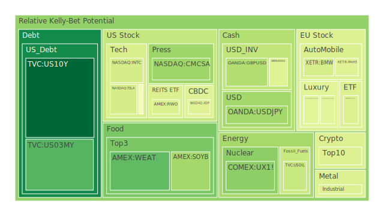
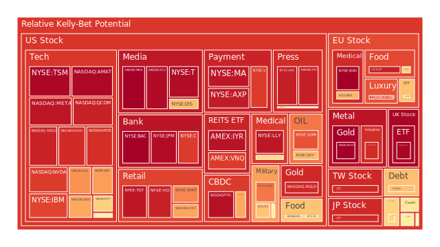
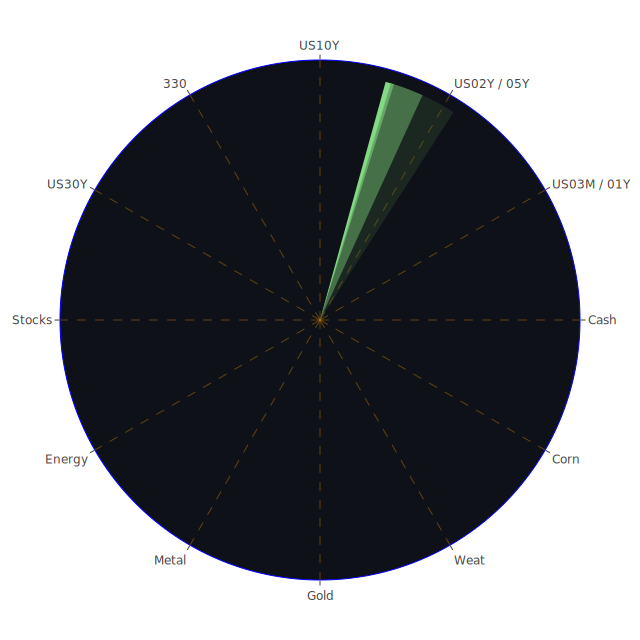

# 三位一體的初步思考

1. **Spatial（空間層次）**  
   在空間層次上，我們觀察全球市場的區域分佈與新聞事件之影響，嘗試將「市場、新聞、投資者情緒」作為一組三位一體來拆解。例如，美國市場的經濟動能與利率政策往往和歐洲及亞太市場產生聯動，而消息面若同時包含正面與負面因素（如公司財報佳但地緣政治緊張），則可能在不同地區造成不同的資金流向。藉由空間層面的分析，可以看出相對強勢市場與弱勢市場彼此間的競合關係。舉例而言，新聞透露中東資金逐漸流入倫敦房地產市場，可能同時顯現出對歐美其他市場之潛在影響，使資金流向更為複雜。

2. **Temporal（時間層次）**  
   在時間層次，我們強調歷史走勢與短期新聞催化之間的交錯，如同經濟學常用的「循環波動」視角，也能借用社會學、心理學、博弈論來解釋市場交易者於特定時間點可能的樂觀或悲觀集體行為。近期新聞顯示，市場對聯準會(FED)之政策變化仍相當敏感。同時，許多企業的財報週（或者地緣政治衝突之時間表）也與投資大眾情緒緊密互動。以這次數據顯示：美國國債收益率曲線有局部變化，尤其1Y、2Y、5Y、10Y、30Y的變動在近一週與近一月都有些微上揚趨勢，部分反映了對未來通膨或FED調整政策的不確定預期。  
   此外，歷史上出現過的「通膨預期拉抬—央行緊縮—市場震盪—再度回歸週期」循環，也常常牽動資產間的聯動。2008年金融危機、2013年taper tantrum，以及2020年疫情初期的恐慌，都曾帶來類似的時間節奏變化，在市場情緒與新聞互相強化下形成多次大幅波動。

3. **Conceptional（概念層次）**  
   在概念層次上，則是將市場（價格機制與資金面）、新聞（媒體敘事與輿論散播）、以及投資者心理（預期、從眾或逆向思維）三者交織，採用正反合思路來檢視可能的未來情境。正面新聞若持續累積，或許會鞏固投資者對某一資產的信心，但隨著利潤積累、泡沫因子抬頭，往往也埋下未來修正的伏筆；反之，負面消息雖然可能短期抑制價格，但若資產基本面強勁，市場也可能在沽壓結束後迅速反彈。透過概念層的辯證，我們能留意到「繁華背後往往潛伏風險，利空背後也可能蘊含轉機」。

在這個三位一體邏輯下，以下先就「投資商品泡沫風險」進行梳理，再延伸到宏觀、微觀、以及資產之間的連動傳導，最後提出對沖風險與潛在投資配置的可能。

---

## 投資商品泡沫分析

以下將針對多個主要投資商品進行泡沫風險評估與說明，並引用部分新聞事件與歷史相似場景提供視角。為避免繁雜，本段僅列舉若干焦點觀察。

---

- **美國國債**  
  近期的美國國債收益率從1年到10年皆有小幅攀升跡象，30年期收益率也在4.7%至4.8%上下浮動。根據最新數據顯示，美國10年期國債的泡沫分數D1略低，但D7、D14、D30都有往上攀的趨勢，顯示長債對通膨可能存在一定敏感度。利率曲線雖逐漸趨平，但仍不能忽視未來若通膨壓力意外走升、FED再度轉向更偏鷹派的風險。歷史上，如2013年美聯儲釋放縮減量化寬鬆(Taper)訊號時，長債大跌的慘痛教訓不容忽視。當下雖然市場普遍預期FED立場略帶鷹派且無太大意外，但一旦就業數據或通膨再次爆衝，長債資本利得面臨顯著回調風險。若以避險或資金停泊角度而言，目前美債的收益率雖有吸引力，但同時要意識到價格波動的潛在劇烈性。

- **美國零售股**  
  零售股如WMT、TGT等，在近期新聞與財報中呈現不同面向：TGT泡沫分數在D1有些許偏高，雖然7日、14日有小幅修正，但仍需留意零售市場消費力道衰退的可能。新聞顯示部分市場分析師對Apple或整體消費電子類的需求開始顯示隱憂，也恐影響消費信心。歷史上，在2001年與2008年時，美國零售銷售數字一旦受到經濟衰退與信用收縮影響，股價亦容易帶頭回落。眼下雖有季節性購物旺季結束的利空因素，但零售股同時也可能隨著美國勞動市場若持續穩健而獲得支撐。總之，這是一個正反拉鋸明顯的區域，泡沫風險中等，既不算極度高漲，但也不可掉以輕心。

- **美國科技股**  
  包括AAPL、MSFT、GOOG、META、AMZN等龍頭，以及半導體龍頭NVDA、AMD、TSLA（此處視為具相當程度科技色彩）。從近期的泡沫分數觀察，有不少科技權值股D1皆超過0.7或0.8以上，顯示市場對此類股票抱持高度預期，資金亦集中追捧。新聞面也反映出對AI概念、先進晶片領域的熱情，如先前NVDA在AI顯示卡領域的需求推動下股價翻倍。有些分析師認為這類現象與2000年科技泡沫期間對網路概念股的熱潮有些類似。近期若企業財報稍有不如預期，就容易觸發股價大幅回檔。  
  在歷史上，每一次創新科技浪潮皆有機會帶來長期價值，但短線上泡沫堆疊的風險同樣不小。考慮目前數據顯示META的泡沫指數尤其高(接近0.95以上)、GOOG亦在0.90上下，建議投資者對此一類股保持謹慎，考量分批或對沖策略，而非無差別追高。

- **美國房地產指數**  
  依照近期VNQ、IYR等房地產相關ETF的泡沫指數來看，D1有相對高(0.88甚至逼近0.96)的紀錄。這代表著市場在商用不動產前景、利率及區域性銀行放貸條件可能收緊的環境下，仍存在一定的預期炒作或資金湧入。不過美國房地產具地域差異，商業地產受到電商化與遠距工作趨勢的影響，辦公室空置率在若干都會區仍居高不下，回報率與未來發展可能承壓。住宅類市場則與就業、可支配所得等密切相關。  
  鑑於2008年房貸危機的教訓，許多市場參與者開始對「高房價是否出現泡沫」產生戒心。近期新聞與數據表明30年房貸利率升至6.8-6.9%，購屋成本升高後，買家交易意願可能進一步受到壓抑。雖整體還未見明顯大面積崩盤風險，但若利率進一步走高、就業市場出現轉折，房地產指數恐會面臨較大調整。

- **加密貨幣**  
  主要如BTC、ETH、DOGE等，加密貨幣波動性本就高，新聞中反映了各種「看多或看空」的情緒：近期亦有社群駭客入侵及對市場造成短暫衝擊的負面消息。BTC、ETH根據最新泡沫資料，ETH D1出現約0.48上下，BTC也在0.55附近，說明市場還在觀望中，但7日、14日、30日的平均風險分數依舊不低。歷史上，加密貨幣在全球資金寬鬆和投機情緒高昂時，漲勢極猛；反之在緊縮環境或負面監管消息接踵而至時，大幅回調亦令人驚心動魄。需特別留意近年監管力道加大與整體金融環境收縮的疊加效應，投資者如有意布局，建議以嚴控部位、設定停損或避險為前提。

- **金/銀/銅**  
  黃金在近期泡沫指數上升至0.99上下，十分接近1的警訊。新聞指出通膨壓力反覆、地緣政治衝突時斷時續，金價往往被視為避險資金的流入標的。但也需要注意到黃金/原油比(GOLD OIL RATIO)持續攀升至40上下，某種程度顯示金價漲勢相對原油更為加速，是否已超漲需謹慎。銀的波動更大，常被視為黃金的「高Beta版」。目前數據顯示銀的泡沫風險依舊高(約0.90以上)，暗示市場若發生大規模回調，可能重創追高者。至於銅則與景氣循環關聯度高，目前泡沫指數約0.41至0.69之間，也有一定漲幅，但尚未達瘋狂階段。歷史來看，若全球景氣減速、製造業動能下滑，銅價也可能受抑。

- **黃豆 / 小麥 / 玉米**  
  農產品常受天候、地緣政治、運輸成本影響。近期新聞顯示多地天災與極端氣候，使部分糧食生產受損，加上地緣衝突可能影響全球穀物出口。根據資料，WEAT、CORN等ETF泡沫指數介於0.21-0.57之間，短期雖非高點，但不可輕忽若有更嚴重的天氣事件或政治因素(如糧食出口受阻)，價格可能飆漲。歷史上，2010-2011年全球糧價飆漲曾引發一系列社會動盪，可見農產品價格具備高敏感與潛在波動風險。

- **石油 / 鈾期貨**  
  油價短期在70-73美元區間波動，泡沫指數約0.55-0.76，顯示投資人預期不算極端，但有一定炒作空間。國際上任何針對油國組織(OPEC)的產量協定、地緣政治衝突都可能帶來價格劇烈震盪。若經濟衰退風險上升，需求減弱，也會壓抑油價。  
  鈾期貨(UX1!)方面，目前價格相對前幾年高，部分緣於能源轉型、核能重新受到青睞。但當前泡沫指數並不算過度高(約0.26-0.50區間浮動)，代表市場對核能需求的期待雖在，但尚未到完全狂熱狀態。在歷史上，鈾價有時受安全疑慮及核電政策風向牽動，屬於相對冷門且具政策風險的商品。

- **各國外匯市場**  
  近期美元指數受FED可能維持偏高利率影響仍偏強，但EURUSD、GBPUSD也在1.03-1.25一帶出現劇烈起伏。AUDUSD目前約在0.63上下，反映澳洲商品市場不確定性。市場泡沫指數顯示：EURUSD、GBPUSD、USDJPY等在0.57-0.70之間，並未顯示泡沫極端，但需關注歐洲政治與能源議題、一旦出現風險事件或經濟數據不如預期，匯市仍易大幅波動。歷史上，每逢主要央行貨幣政策分歧加大，外匯波動也隨之加劇。

- **各國大盤指數**  
  如FTSE、GDAXI、FCHI、JPN225、000300等。其中，FTSE近期泡沫指數超過0.98、GDAXI約0.55-0.66浮動、FCHI約0.66上下、JPN225則接近0.91，也就是說部分歐洲與日本指數出現相對高昂的估值水準。新聞面提及德國經濟前景黯淡，卻不影響資金在某些板塊的堆積，顯示出投資人對歐洲大型企業盈利能力仍保有期待。然而，若經濟下行壓力最終顯現，大盤指數漲勢恐難以持續。日本方面的股市在寬鬆貨幣政策與企業轉型利多下，也累積不少漲幅，後續一旦日銀政策有變化，市場可能劇烈反應。

- **美國半導體股**  
  包括NVDA、AMD、MU、INTC、AMAT、KLAC、TSM等，綜合泡沫指數大多位在0.35-0.98之間，但也有如NVDA近幾個月來明顯處於較高區間。AI、先進製程需求支撐了股價，但先前已有消息顯示高估值所伴隨的未來營收成長不確定。若歷史可鑑，2000年也曾出現「一段時間所有半導體股都在熱炒」的盛況，之後在需求無法實際跟上時大幅回落。

- **美國銀行股**  
  BAC、C、JPM等，近幾次金融危機後市場對銀行股風險敏感度加劇。最新泡沫數據顯示BAC大幅逼近1.0，C及JPM都在0.88-0.97之間，暗示銀行股雖然看似穩健，但其估值已積累了不小的修正風險。新聞面並未見銀行業有太多系統性壞消息，但若經濟下滑，銀行呆帳或放貸意願減退，股價也恐受衝擊。

- **美國軍工股**  
  LMT、NOC、RTX等，在某些地緣衝突升溫或軍費預算增加的情況下，往往是防禦型布局。泡沫指數約0.55-0.78，屬於中高區間。新聞裡各式地緣政治新聞(如中東、俄烏等)層出不窮，預期軍備需求仍有支撐，但也不能忽視軍工股市盈率相對較高的風險。

- **美國電子支付股**  
  PYPL等公司，近期泡沫指數高(約0.96)，在新聞與財報中有「用戶成長放緩」之憂慮，也有「新功能與併購」之想像，兩者交織下波動很大。歷史上，此類公司易隨著科技板塊整體走勢而起伏，投資者宜留意股價高點的潛在泡沫風險。

- **美國藥商股**  
  MRK、JNJ、LLY等，近期財報整體平穩，但JNJ出現一些法律糾紛與藥品專利議題；LLY則因新藥及相關領域併購而有高估值。數據顯示LLY泡沫指數逼近0.95，雖然市場對生技與醫藥股普遍採取防禦性評價，但一旦估值走高也須謹慎。

- **美國影視股**  
  PARA、DIS、NFLX、FOX等，近年因串流大戰或影視產業的佈局整合而多次震盪。PARA最新泡沫分數約0.99，幾乎是極高危險區，反映該公司在產業整合競爭中面臨不確定；DIS因財報略有好消息，但成長動能能否重回高峰尚待觀察。NFLX在串流業務的競爭下依舊保持一定龍頭地位，但股價已累積不小漲幅，亦有高估值風險。

- **美國媒體股**  
  CMCSA、NYT、GHC等，與廣告市場、消費者訂閱行為息息相關。新聞指出數位廣告市場遇到競爭，短期或影響獲利。但NYT與GHC的泡沫分數也不低(約0.57-0.93)，顯示媒體股價格相對昂貴，投資者要留意獲利模式是否能持續。

- **石油防禦股**  
  OXY、XOM等，對原油價格走勢極其敏感。XOM近期有高額獲利紀錄，但股價在過去一年大漲後，D1仍有0.84上下。若油價後續下跌，石油股可能面臨回檔。

- **金礦防禦股**  
  RGLD等，和金價走勢高度連動，若金價已近高檔，金礦股雖有營運槓桿作用，卻也存在泡沫指數偏高(約0.91)的風險。過去也有金價回調、金礦股跌幅更深的案例。

- **歐洲奢侈品股**  
  KER、MC、RMS等受中國消費者回流及歐美高端需求支撐，股價近年飆升，但其中KER、RMS泡沫指數在0.42-0.84不等，部分時段甚至逼近高位。歐洲經濟若持續低迷，或中國消費若受其他因素干擾，都可能使該板塊大幅回調。

- **歐洲汽車股**  
  BMW、MBG等，隨著電動化與新世代科技轉型，投資人對歐洲車廠的評價分歧。泡沫指數約0.39-0.77，屬於中偏高。面對電動車的競爭(包含Tesla和中國品牌)，歐洲傳統車廠雖然市佔穩固，但利潤能否持續成長值得觀察。

- **歐美食品股**  
  KO、NESN、ULVR等，多數在消費通膨壓力下仍有定價權。然而資料顯示KO的D1約0.63-0.74區間，NESN也有0.55上下，ULVR接近0.93左右，顯示市場對防禦性食品企業追捧相當熱烈，預期其能在經濟不確定時維持營收，但估值若來到過高水準，也須警惕修正風險。

---

## 宏觀經濟傳導路徑分析

綜觀上述資產泡沫狀態，結合FED關鍵數據與新聞面，可見美國利率水準對全球資本流向影響深遠。美國公債收益率曲線若繼續抬升，一方面吸引資金回流美國市場，另一方面也可能推動美元走強，進而壓抑原物料價格與新興市場資金流入。  
除此之外，通膨居高不下之背景，讓FED維持鷹派基調的可能性升溫。若最終美國企業獲利下滑，恐引發全球股債同跌。歐洲方面，雖然部分奢侈品和汽車股仍被熱捧，但整體經濟指標顯示出放緩趨勢，市場對歐洲衰退風險的擔憂不容忽視。  
在新興市場與大宗商品層面，若美元維持偏強，原油、金屬與農產品可能持續波動。若地緣政治事件(如中東緊張或俄烏衝突)突然升溫，能源與農產品價格又可能急漲，帶動第二波通膨回升，形成再次衝擊。

---

## 微觀經濟傳導路徑分析

在微觀層面，企業財務狀況(如盈利成長、債務槓桿)與消費者行為(如信用卡負債、消費意願)至關重要。最新資訊顯示，信用卡的逾期率與壞帳率正在高檔徘徊，部分銀行的資產品質受到考驗。同時，許多零售業者與科技公司在人工智慧、雲端服務領域競爭加劇。若資金成本上升，初創或成長型企業融資難度勢必更高，經營風險因而擴大。  
此外，供應鏈的重整也會在企業間造成新的分化。有些公司順利構築多重供應來源，抗風險能力較佳；另一些則可能面臨生產成本增高、交付延遲、或地區政策限制的壓力。這些因素在某些敏感產業(如半導體與綠能產業)尤其顯著。

---

## 資產類別間傳導路徑分析

1. **股票與債券之間**：若通膨遲遲不降，或FED態度更緊，債券殖利率將走揚，進一步拉高企業借貸成本，壓抑股市估值；反之，若經濟數據轉弱超過市場預期，資金或因避險需求重新湧入債券，壓低殖利率，對股市形成另一種形態的支撐。  
2. **商品與外匯之間**：美元走強一般壓制商品價格，但若地緣動盪、供給面衝擊導致油價與農產品上漲，通膨壓力又會推動市場對美元需求，同時可能助長黃金的防禦性買盤。  
3. **股市與房地產之間**：利率上行時，房地產融資成本提高，投資意願趨緩。若股市同步遭遇拋售，整體資產縮水或出現連鎖負面財富效應；然而，若股市泡沫意識抬頭，部分資金會轉向相對穩健之不動產或REITs，帶來短暫支撐。  
4. **加密貨幣與科技股之間**：投機性資金常在行情火熱時湧向加密貨幣與高成長科技股，二者經常同漲同跌。當流動性變緊，投資人較易同時拋售風險資產，形成加乘的跌勢。  
5. **安全性資產與高風險資產之間**：黃金、瑞郎或日圓等傳統避險資產，與高風險小型股、創新型加密貨幣常呈現反向波動。當市場避險情緒升溫，後者資金往往流向前者；但若風險胃納再度上升，資金又流回高風險領域。

---

## 風險對沖的投資組合機會

由於本報告嘗試透過三位一體(空間、時間、概念)之正反合分析，並尋求不同資產間相位約120度、相關係數約-0.5的對沖組合，可歸納以下幾種可能的建構思路：

1. **股票(成長股) + 黃金(避險) + 能源(原油或能源股)**  
   - 成長股(如科技龍頭)或許在經濟回溫的樂觀預期下仍具潛力，但我們可用黃金來對沖地緣衝突、通膨再次升溫的風險。能源股受油價和景氣影響，走勢可能與科技股在某些時候呈現低相關或反向波動，形成一定對沖。  
   - 相關係數觀察：若科技股受市場資金追捧，油價卻因供給面意外寬鬆而回落，兩者之間或可維持負相關度。

2. **銀行股(美國大型銀行) + 加密貨幣 + 農產品ETF**  
   - 銀行股受金融市場流動性與利差政策左右，短期若經濟數據不錯，銀行貸款業務穩定；但一旦信用風險提升，銀行股下跌或遇系統性壓力，加密貨幣可能(在特定避險或資金轉向時)出現反向走勢。農產品則受天氣與地緣影響，與金融市場常保持一定獨立性。  
   - 此組合若權重適當配置，或能在市場輪動中減少波動。

3. **歐美食品股(防禦) + 半導體股(高Beta) + 美債中長期**  
   - 防禦型食品股在衰退擔憂時能穩住部分資金，半導體股雖泡沫風險偏高，但在科技長期趨勢下也能提供較大成長空間。若對市場波動有所顧慮，可以中長期美國國債做避險，尤其在某些風險事件升溫後，長期債可能成為資金避風港而價格上漲。  
   - 歷史經驗指出，經濟景氣若突然冷卻，半導體股易先受衝擊，但美債同時大漲；食品股因必需消費特性，波動相對較小。

4. **黃豆/玉米(農產品) + 先進製程晶片股 + 美元現金部位**  
   - 農產品與先進製程晶片股之間的基本面驅動因素迥異，且波動時程不一致，相關度可能偏低或負向。美元現金則能在流動性收緊或突發危機時提供及時彈性。  
   - 當通膨數據又起、FED趨緊，可能壓制股票表現，但若極端氣候推升農產品飆漲，投資組合內的農產品部位能提供對沖。

依照這些思路配置，要盡量分散在不同區塊、追求相位盡量錯開120度、確保相關係數約-0.5左右，才能在一方劇烈波動時，借另一方的相對穩定或上漲來緩衝。

---

## 兩兩相互驗證的篩選假設分析

基於以上所示多種資產的組合可能，我們透過三位一體的正反合視角，將各組合的核心假設進行交互檢驗：

1. **若市場對FED態度誤判**：假設FED後續更加鷹派，則成長股與高槓桿資產受衝擊，銀行股因利差空間變化而未必一定受益。此時可驗證是否持有中長期債券或黃金、農產品來對沖。若債券價格沒有上漲(例如市場反應過度鷹派，長債反而被拋售)，就意味需要提升食品或黃金部位的比重。  
2. **若地緣政治衝突擴大**：石油與農產品或黃金可能短期上漲，科技或金融板塊暫時承受賣壓。若配置了能源、防禦股與部分高風險科技股，則可以觀察雙方反向波動是否真能達到所需的對沖效果。  
3. **若經濟出現較大衰退**：防禦型股票與黃金或債券往往是避險資金去處，但農產品價格不一定隨衰退下跌(仍與天氣與區域供需相關)。可檢驗不同組合間的實際波動幅度是否吻合-0.5相關係數的估計。  
4. **若AI與新興技術繼續爆發**：半導體、高階晶片股可能再度走強，加密貨幣也可能受到新一波熱錢灌入，而防禦型或黃金則相對冷卻。可驗證對沖策略是否仍能維持相對穩定的淨值。

藉由以上多重「假設-驗證-調整」的分析架構，投資人可持續追蹤市場實際演變，並據此調整資產權重。

---

## 投資建議

以下提出「穩健」、「成長」、「高風險」三大類各自總和為100%的配置示例，且每一類各挑選三種投資標的，比例合計亦為該類型投資組合的100%。整體而言，投資者可在三種策略中選擇最符合自身風險偏好者。請注意，以下僅提供概念參考，並非實際投資建議，且任何市場風險皆須自行承擔。

# 1. 穩健型 (合計100%)

- **美國短期國債（如1年期、2年期）**：40%  
  由於美國短債收益率仍具一定水準，且波動相較股票小，可作為低風險停泊資金之處。  
- **防禦類食品股（如KO、ULVR等）**：35%  
  生活必需品消費穩定，遇到衰退時仍具抗震效果。  
- **黃金（現貨或金礦股較小部位）**：25%  
  避險特性明顯，可在地緣或金融市場動盪中發揮一定保值作用，但需要留意短期估值偏高的風險。

# 2. 成長型 (合計100%)

- **大型科技龍頭（如AAPL、MSFT、GOOG）**：40%  
  聚焦業務廣泛、現金流充足的龍頭公司，雖然估值偏高，但基本面相對扎實。  
- **半導體設備（如AMAT、KLAC）**：30%  
  押注AI與新一代製程需求，但要嚴控過度泡沫風險。  
- **新興市場消費或互聯網（選擇具營利能力者）**：30%  
  若新興市場在全球景氣回春時復甦，這類股票可能有不錯成長潛能。需提防區域政治風險。

# 3. 高風險型 (合計100%)

- **加密貨幣（BTC、ETH）**：40%  
  波動巨大，但長期仍有部分投資者看好其去中心化與數位黃金屬性，切忌過度槓桿。  
- **小型生技或創新類股**：30%  
  聚焦於具突破性技術，但盈餘不穩定；一旦研發成功，股價或倍數成長，失敗則風險巨大。  
- **波動性交易（如原油短線操作或槓桿商品）**：30%  
  這類純粹短期交易，憑藉避險或套利策略，能夠大幅放大收益亦可能遭受重大虧損。

---

## 風險提示

1. **泡沫風險高的警告**  
   本報告一再強調，當前已有不少資產處在泡沫風險高檔區域，包括部分科技龍頭、銀行股、黃金、房地產指數等。雖然市場有其樂觀理由，但投資人要認知到估值泡沫隨時可能破裂，一旦市場情緒翻轉，將帶來急速且深幅的修正。

2. **市場不確定性**  
   通膨、利率、地緣政治與經濟數據都可能在短期內劇烈變動，投資市場向來充滿不可預期。任何單一事件(包括但不限於極端氣候、突發地緣衝突、企業財報利空)都可能打亂現有趨勢。

3. **風險承受能力**  
   投資須量力而為，對於波動率或槓桿倍數的選擇更需謹慎。即便是穩健型配置，也不保證毫無波動，只是相對減少大跌機率；成長型與高風險型配置更要求投資者具備良好的心理素質和資本承受度。

4. **歷史不一定能完全預測未來**  
   雖然我們借鏡了多次歷史事件(如2008年金融海嘯、2013年taper tantrum、2020年疫情初期的市場劇變)，但未來情況或許出現新變數。投資決策應持續檢視最新消息，且預留退場及調整空間。

---

# 結論

本報告從空間(不同市場交錯)、時間(歷史循環與最新催化)、概念(消息、情緒、博弈)三個維度切入，運用正反合的思維邏輯，整理出各大資產的泡沫風險現況、傳導路徑與可能配置組合。總體來看，我們正處於貨幣政策走勢仍不明朗、地緣政治陰霾不散、加上部分資產評價偏高的環境裡。

面對未來不可預測的動盪，我們提出的建議配置只是一種理論參考，不保證能完全避免市場大跌時的損失。投資者宜根據自身風險承受度與投資目標審慎選擇，並隨時追蹤宏觀經濟與新聞脈動。

---

## 風險提示

投資有風險，市場總是充滿不確定性。本報告所提出的一切觀點，皆僅供參考，不構成實際投資建議或保證獲利之擔保。建議投資人結合自身財務狀況、目標與風險偏好，謹慎評估後再做決策。若有必要，可尋求專業人士或多方管道意見，以降低非系統性與系統性風險所帶來的衝擊。切記，任何資產都有可能遭遇突發性泡沫破裂、重大政策變動或黑天鵝事件。時刻保有風險意識與動態調整資產配置，方能在不確定的金融市場中謹慎前行。

 
Daily Buy Map:

 
Daily Sell Map:

 
Daily Radar Chart:

 
