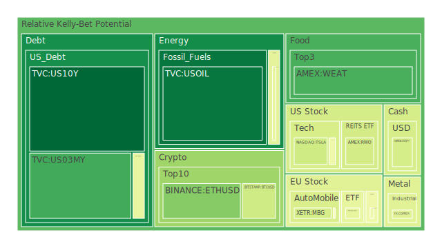
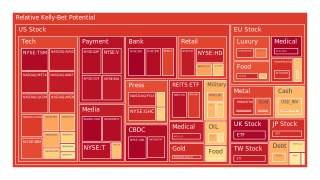
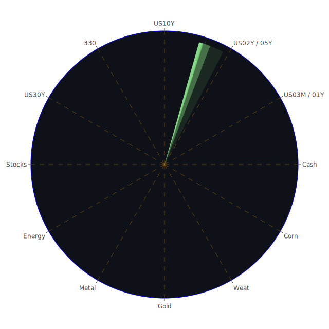

# 一、投資商品泡沫分析

以下針對所羅列的各投資商品，根據目前可觀察到的價格指標（如PP100）、泡沫分數（如D1、D7、D14、D30），以及市場消息面綜合參考，進行初步的風險解析。其中，泡沫分數越高者，可能面臨的市場過熱風險越高；而部分資產出現負面新聞或基本面轉弱時，亦需警惕短期急跌的可能性。

## 1. 美國國債
綜觀資料中常見的10年期、2年期等公債殖利率（如US10Y、US02Y、US30Y、US05Y、US01Y與US03MY等），其目前D1至D30的泡沫指數並非全部處於高檔，但10年期與30年期國債殖利率近來在4.5%至4.8%的區間震盪，顯示資金仍在美國長端債券的定價之間猶疑不定。  
在空間層面（Spatial），美國國債同時受到國際資金避險需求與海外央行資金流動的影響，消息面上「美國財政部發行的總量」與「海外持有部位的增減」都有重大影響。最近數據顯示美國公債在國際機構的持有量正在走低，而FED自己持債部位仍維持在相對高位，說明國際資金可能因地緣政治或匯率考量而移轉。  
在時間層面（Temporal），就歷史經驗而言，當通膨與利率見頂時，長天期公債可能在未來某段時間出現價格回升，但目前美國就業市場仍相當強韌，FED雖然有幾次鷹派談話，但也顯示某些放緩機制開始啟動，使殖利率在數據不斷變化中上下波動。  
在概念層面（Conceptional），從經濟學看，投資人聚焦於利率走向與經濟景氣循環；從社會學和心理學看，市場對FED的任何發言都可能被放大解讀；博弈論角度則強調市場對政策路徑的預期博弈。  
由於美國國債是重要的避險標的，在上段週期中若風險資產大幅回調，美債價格可能反向走揚。然而需要警惕「公債泡沫」的可能性也不能忽視：若未來經濟超預期好轉、風險資產吸引力上升，長天期公債收益率恐重新攀高。  
綜合而言，目前10年期與30年期公債短線波動大，尚未出現極端泡沫訊號，但因泡沫分數（例如US10Y D1: 0.03-0.05區間等）仍需持續觀察，如有外部系統性衝擊，其價格彈性可能成為投資人避風港或是反向套保的工具。

## 2. 美國零售股
美國零售股受到內需景氣與消費者信心影響。近期新聞顯示，美國消費市場在通膨壓力下仍有一定韌性，不過也出現商品類需求下降或轉向服務的趨勢。部份個股已經在財報中釋出不佳預期，例如零售巨頭在針對未來業績保持謹慎，也有一些高端零售商表現不如預期。  
歷史上，零售股常在景氣高點顯示出樂觀展望，但也最容易在景氣轉折點遭遇獲利下修的風險。從泡沫分數看，有些零售股（如WMT、TGT等）在D1、D7等區域有中高區間接近0.65-0.97之間，暗示某些零售股短期估值不算便宜，部分泡沫累積指數偏高。  
市場新聞方面，負面情緒可能來自於通膨居高不下，或是某些財報對未來消費者支出降低的預期。近期有報導「Shoppers面臨雞蛋價格創紀錄」等，也反映在消費必需品類別成本上升。心理層面，一旦通膨超出預期又壓抑消費意願，零售股獲利將面臨壓力。從博弈論看，零售商之間競爭激烈，會彼此削價相爭，以爭取市場份額。  
因此，美國零售股短期仍具觀察必要，若經濟出現任何超出預期的衰退訊號，零售股首當其衝。但其消費必需屬性的公司也不至於陷入深度恐慌，相對溫和。投資人若有佈局意願，建議審視估值與泡沫風險分數。

## 3. 美國科技股
美國科技股一向是市場高波動區域，因其成長性與創新題材受到矚目。歷史上，例如2000年網路泡沫與2022年科技估值回調，都顯示高估值科技股在市場流動性趨緊時最易遭受打擊。  
根據目前泡沫指數，部分科技龍頭（如AAPL、MSFT、META、GOOG等）近期的D1或D7指數已達到0.70以上，最高甚至逼近0.90-0.95，顯示市場對AI、雲端運算等題材依然保持高度興趣，但估值風險逐漸累積。新聞面上，整體而言正負參半：正面報導包括「Cisco因AI帶動網路設備需求而調高財測」，「Intel受美國製造晶片補貼與供應鏈回流計畫提振」，但也有分析師質疑Apple對未來產品線的成長性。部分科技公司在財報中雖展現上季不錯的營收，但也有對未來成長持謹慎看法。  
社會學與心理學角度來看，科技創新往往帶來投資者的正面情緒，但一旦市場過於樂觀，稍有不及預期就可能引發大面積拋售。博弈論則顯示大企業間在前沿技術競賽中互相角力，若出現壟斷或卡位成功，則後進者股價可能被嚴重低估或面臨存續危機。  
綜上所述，美國科技股目前仍是資金追逐焦點，但泡沫風險正在升高。投資人需關注最新消息，如未來FED政策走向、全球需求疲軟與否、地緣政治對供應鏈的影響等。一旦出現重大變動，資金可能快速抽離，尤以高估值成長股最為敏感。

## 4. 美國房地產指數
根據歷史經驗（如2008年金融危機），美國房地產受到利率政策高度影響。一旦抵押貸款利率上升過快，房地產交易量和價格都可能降溫。最近美國固定30年房貸利率維持在6.87上下，相較於前一年2%-3%的歷史超低點，現今購屋成本顯著提高。  
從泡沫指數觀察，追蹤房地產的ETF或指數（如RWO、VNQ等）在D1、D7、D14有些偏高或反覆；例如VNQ之類的泡沫分數接近0.88-0.96，某種程度上反映該板塊可能有市場對「房地產價格過高」或「商業地產空置率升高」的疑慮。新聞方面，一些報導指向辦公室空置率上升仍在持續，零售商鋪也持續面臨線上銷售衝擊。  
若從社會學與心理學來分析，房地產常被視為「實體資產」的安全港，但在高貸款成本環境下，購買力可能被抑制。博弈論層面，買方和賣方對未來房價的預期若產生分歧，市場成交量即可能進一步縮減。  
整體來看，美國房地產指數雖不一定如2008年般劇烈崩壞，但在商業不動產部分仍具壓力。投資人應警惕相關REITs的泡沫風險，若長期利率維持高檔且經濟景氣未如預期增長，估值恐進一步下修。

## 5. 加密貨幣
加密貨幣近年波動極大，BTC與ETH等領頭幣常成為市場風險偏好的代表之一。依照近期報價，BTC現價（PP100）接近96,000美元附近，ETH則約在2,600-2,700美元左右；相較於幾年前，價格雖已大幅成長，但在2022年曾經經歷崩跌之後，如今又漸趨震盪走揚。  
根據可見資料，其D1或D7泡沫指數大多在0.3-0.6區間浮動，也有部分交易所的狗狗幣（DOGE）或其他代幣指數更高，在0.57以上。從新聞面來看，近期加密市場雖沒有出現太多重大負面黑天鵝，但監管政策動向仍是最大變數。市場同時關注AI、DeFi等新創應用帶來的紅利，也留意美國SEC及其他國家金融監理法規的收緊。  
心理學角度，散戶對加密貨幣依舊容易產生「一夕致富」的高度期待，也容易被市場波動或社群媒體炒作驅動。博弈論顯示大型礦工或交易平台之間也存在競爭與合謀風險，一旦有巨鯨集中拋售則易引發恐慌。  
若觀察歷史，相對於傳統資產，加密貨幣的泡沫反覆出現，高峰時極度狂熱，低點時又非常冰冷。建議投資人審慎評估風險承受度，不宜重壓，並持續關注宏觀金融環境與監管走向。

## 6. 金/銀/銅
貴金屬（金、銀）與工業金屬（銅）在近幾年都受地緣政治及通膨預期左右。歷史上，當避險情緒升溫時，金價常出現上漲；銀則兼具工業屬性與避險屬性，走勢時而跟隨金價、時而跟隨工業金屬。銅價則被視為「經濟晴雨表」，因其需求常隨經濟活動強度波動。  
近期，金價在2900-2930美元附近徘徊，泡沫指數（D1）已接近0.81以上，過往約在0.46-0.77之間上下；銀則約在32美元上下，泡沫指數略高於0.9；銅約在4.70-4.76美元左右，短期泡沫指數在0.43-0.55上下。新聞顯示：部分投資機構仍認為金價有機會在地緣政治不確定性下持續攀升，但也有聲音指出若實質利率再度拉高，金價可能遭到獲利了結。  
從社會學和心理學角度看，黃金象徵保值，往往在動盪時期吸引投資者。銅則與實際經濟表現高度相關，一旦市場擔憂未來景氣轉差，銅價可能先行修正。博弈論方面，產量與需求亦牽動價格，主要礦商或出口國政策都會改變市場的均衡。  
綜合判斷，金與銀在避險需求高時的漲勢明顯，但高泡沫分數需引起警覺，易有獲利回吐。銅雖暫時不算過熱，但一旦全球製造業出現放緩跡象，其價格同樣可能快速回調。

## 7. 黃豆 / 小麥 / 玉米
農產品價格在近年歷經疫情、天氣異常、地緣衝突等影響，波動頗大。例如小麥（WEAT）、黃豆（SOYB）、玉米（CORN）等ETF或期貨價格，都牽涉到全球糧食供需與運輸通路問題。歷史上，農產品有季節性周期，天氣因素對產量影響尤其顯著。  
依照目前的泡沫指數，小麥（WEAT）在0.18-0.21之間，黃豆（SOYB）在0.48-0.51上下，玉米（CORN）也在0.51-0.57之間，顯示整體估值雖不算極端，但也不能忽視天氣與政治風險。新聞提到全球氣候異常與部分地區衝突阻礙了農業供給鏈；也有正面新聞指出中國等主要買家補庫存，可能支撐短期價格。  
從心理學和社會學來看，糧食安全一向敏感，稍有風聲就易引起搶購，將價格推升至非理性水平。博弈論角度，出口國與進口國之間的策略博弈可能影響貿易協定與關稅政策。  
未來若天氣持續惡化或地緣政治再度緊張，農產品價格易再次飆漲，但若生產恢復正常亦可能快速回落。投資人宜密切觀察供需面變化。

## 8. 石油 / 鈾期貨UX!
石油市場長期受制於OPEC+產量政策與全球需求，最近原油價格在70-73美元區間震盪，泡沫指數（D1）大致在0.55上下。新聞面顯示對經濟放緩疑慮降低了需求增長的預測，也有人認為OPEC可能減產以支撐油價。歷史經驗（例如1973年、1980年、2008年油價劇烈波動）顯示，若地緣衝突再次爆發，油價有機會迅速飆升；但當需求萎縮時，價格亦可能急跌。  
鈾期貨（UX）相對特殊，因核能需求討論升溫可能推升鈾燃料價格。近來UX1!顯示在67-68美元上下，短線泡沫分數約在0.27-0.44，顯示不算極端，但若未來各國再度積極投入核能，需求面可能上升。心理層面：核能議題常牽涉社會對環境、風險的敏感度；博弈論則在各國能源政策拉鋸之間發酵，反核或擁核聲浪都會影響市場預期。  
投資石油與鈾時，需警惕供給端政策、地緣政治，以及替代能源發展速度。

## 9. 各國外匯市場
在外匯市場上，近期美元兌日圓（USDJPY）持續在152-154附近波動，泡沫分數約在0.30-0.50之間。歐元兌美元（EURUSD）則在1.04-1.05上下，泡沫指數約0.57-0.67。英鎊兌美元（GBPUSD）約1.24-1.26區間，泡沫指數由0.32升至0.73不等。澳幣兌美元（AUDUSD）目前約0.63左右，泡沫分數在0.37-0.60間。  
外匯市場通常受利率差與全球資金流向影響。當美國利率維持高檔時，美元往往相對偏強。近期日本是否調整貨幣政策也是觀察焦點；若日本轉向升息，日圓或有機會反彈。歐洲方面，通膨依然高企，ECB政策雖趨強硬但也面對經濟放緩。  
從社會心理看，外匯市場波動容易與突發政治事件或央行貨幣政策聲明掛鉤。博弈論方面，各國央行為維持本國經濟競爭力，常有貨幣政策協調或分歧。未來若再出現系統性風險，投資人或許傾向持有美元避險；但若美國景氣轉弱，市場又可能調整資產分配。  
匯市投資建議仍是謹慎為佳，特別留意地緣政治局勢和各央行政策基調的變動。

## 10. 各國大盤指數
包含美國、歐洲與亞洲多國的股市指數。如美國NDX、道瓊成分股，歐洲FCHI、GDAXI，亞洲JPN225與中國A股（000300）等。  
根據最新數據，GDAXI、FTSE、JPN225均接近歷史高位或在相對高檔區震盪，泡沫指數多半落在0.90以上，一旦出現系統性調整，風險頗大。中國A股則在3900-3900多點，雖不算絕對高點，但投資情緒易受政策刺激影響。  
新聞顯示歐洲近期有工人罷工、移民和難民議題造成政治壓力；德國城市還傳出開車撞人事件，有社會安全面的疑慮。市場對歐洲經濟復甦看法不一。另外，亞洲方面，日本股市受益於寬鬆貨幣政策和企業改革動能，持續創新高，但也需小心隨時回調風險。  
歷史經驗中，大盤指數若在大幅推升後，最終必然會隨著利空出現而修正，幅度難以預料。心理層面來看，投資者若出現「擔心錯過行情」的心態，可能放大短期泡沫。  
因此，各國大盤指數雖持續創高，但部分指數泡沫累積明顯，需留意退場風險。

## 11. 美國半導體股
半導體股常被視為科技產業核心，目前美國半導體龍頭（如INTC、AMD、NVDA、AMAT、KLAC等）在AI、大數據、車用晶片需求下，曾有一波漲勢。近來泡沫指數大多在0.50-0.97高檔，例如NVDA先前在AI題材推動下大幅飆漲，但最近D1約在0.59左右；AMD、AMAT也都有接近0.90以上的指數紀錄。  
新聞面：近期Intel在政府補助、美國擴大晶片製造支持下得到利好，但市場也擔憂全球PC與伺服器需求能否延續。宏觀環境若繼續升息，企業採購預算可能遭壓縮。心理學層面，投資人對「新技術轉折點」高度期待，容易推升股價至高估區；博弈論方面，各大廠互相爭奪技術領先，一旦哪方進展不順，就可能帶動股價大幅波動。  
考量歷史，半導體股行情波動向來劇烈，2000年的網路泡沫、2008年的金融危機都曾顯著衝擊本產業。後勢建議投資人慎防籌碼過度集中或短期漲幅過大而誘發的回跌風險。

## 12. 美國銀行股
銀行股在2023年曾受到利率波動與擔憂資產負債結構的影響，一度有地區性銀行出問題，造成市場短暫恐慌。目前像JPM、BAC、C等大型銀行則因規模優勢而保持一定抗震力，但泡沫分數顯示，部分銀行股（如BAC）的D1數值甚至逼近1.0，說明投資人對其可能高估的疑慮頗深。  
在社會學角度，銀行被視為金融體系支柱，出現風險事件時常帶來恐慌；從博弈論看，各銀行為搶存款與優質資產而互相競爭，一旦出現流動性不足或監管壓力，股價可能急轉直下。新聞面亦暗示，Fed仍在觀察銀行系統的穩健程度，而「Charge-off Rate on Credit Card高企」亦顯示銀行呆帳可能在未來一段時間內繼續上升。  
考慮歷史上1990年代儲貸危機、2008年金融海嘯的教訓，銀行股風險不容小覷。建議投資人於此領域保持謹慎。

## 13. 美國軍工股
軍工股如LMT、NOC等，在地緣政治衝突升高時往往有利多動能。近期泡沫分數（0.54-0.78不等）顯示還未到最熱的狀態，但也不算低。新聞裡提及俄烏衝突僵持、部分中東地區投資在國防領域不減等，均可能支撐軍工股。  
從社會觀點，軍工產業本身爭議不斷，但也常受政府政策保護。心理學層面，一旦消息面出現大規模軍事衝突，投資人容易將資金湧入該板塊。博弈論則說明軍工股具有「戰略互斥性」，各國都要維持一定軍力。  
歷史經驗如冷戰時期或2022年的地緣衝突表現，都證實軍工股不容易受景氣週期大幅影響，但估值高昂時也可能遭獲利了結。投資該領域宜關注政治風險與國防預算走向。

## 14. 美國電子支付股
電子支付股涵蓋信用卡機構、線上支付平台等（V、MA、PYPL、GPN等）。近年在數位金融浪潮中，業績成長強勁，不過估值也不斷拉高。從泡沫分數來看，電子支付股整體普遍在0.86-0.96左右，高度顯示市場對其未來成長抱持樂觀看法。  
近期新聞顯示金融科技升溫，數位交易滲透率提高，但也有「消費者負債」、「信用卡呆帳」上升的風險。如果未來經濟下行，消費者欠款增加，電子支付業收益也可能受衝擊。心理層面，一旦市場追捧某科技模式，就容易推升股價過度；博弈論看，大廠相互兼併或技術整合，也會改變產業結構。  
建議投資人留意市場對該板塊的過度樂觀，並評估基本面是否能支撐目前估值。

## 15. 美國藥商股
美國藥商股（如MRK、JNJ、LLY等）一般被視為防禦型板塊。但從近來泡沫指數顯示，部分藥商股雖未大幅飆漲，卻也存在估值不斷攀升的情形。LLY等因研發新藥或特定領域突破而股價高漲，泡沫指數亦超過0.94。  
新聞面：醫療保健與製藥公司對未來高齡化市場有利基，不過也面臨政府藥價監管與專利到期等挑戰。社會心理上，防禦類資產常在不確定時期受到青睞；博弈論方面，藥廠之間競爭主要在研發領先度與藥物審批時程。  
因該板塊過去波動相對小，但高位時亦需留意回調風險，尤其碰上專利過期或研發挫敗將引發股價大跌。

## 16. 美國影視股
影視娛樂股（如PARA、DIS、NFLX、FOX）在串流服務與觀眾觀看習慣改變的背景下，競爭激烈。近來消息顯示，某些傳統媒體公司經營壓力增大，串流平台之間也會爭奪內容版權與市場份額。  
PARA、DIS等泡沫指數中，有些區間接近0.48-0.93，顯示股價波動與市場預期混亂。社會與心理學面：觀眾需求瞬息萬變，加上通膨時期人們可能減少娛樂支出。博弈論則指出，內容平台與製作方之間存在複雜的利潤分配博弈。  
歷史上，影視產業受景氣週期波動但也受技術衝擊，例如果DVD時代到串流時代。未來仍看重創新模式與內容品質，但投資該領域需要有長期視野。

## 17. 美國媒體股
媒體股（如NYT、CMCSA、GHC等）同樣面臨數位轉型、廣告收入波動等挑戰。泡沫分數顯示部分媒體股在D1區域約0.46-0.93間不等。廣告收入對景氣相當敏感，一旦企業廣告預算緊縮，媒體公司盈餘將受影響。  
新聞方面，部份公司採取併購或訂閱模式轉型，也取得一定成效。社會學角度：媒體作為輿論管道，除商業面外，也受政治或社會事件衝擊。心理學上，使用者行為轉移到社群平台後，傳統媒體訂閱人數不斷下滑，需要新策略。博弈論層面，少數大型媒體集團若合併，可能在談判中掌握市場定價權。  
投資該板塊需要關注經營策略及對廣告市場的依賴程度，也要留意訂閱模式的成長能否抵銷傳統廣告衰退。

## 18. 石油防禦股
此類股多指整合上下游業務，並擁有防禦性質的能源企業（如XOM、OXY等），在油價高檔時通常能維持不錯獲利。近期泡沫分數顯示XOM、OXY等略超過0.56-0.69之間，其中XOM也曾高於0.72附近。新聞指OXY正積極布局二氧化碳捕捉技術，顯示公司在能源轉型中的策略。  
歷史上，當油價漲幅驚人時，防禦型能源股能享受高獲利，但一旦油價反轉則股價受創。心理層面，投資人視其為「通膨時期防禦工具」，可能因一時的油價走弱而拋售。博弈論方面，面對OPEC+與其他國家產量策略，這些企業亦需應變。  
投資人可在通膨時期持有部分配置，但要警惕估值與油價變動帶來的風險。

## 19. 金礦防禦股
金礦企業或金礦ETF是另一種防禦標的，因金價走強會提振其盈餘。不過金礦股的泡沫往往比實物黃金更大，因有高財務槓桿與開採成本等因素。近期觀察RGLD等指數，泡沫分數逼近0.90；若金價大漲，金礦股往往更猛烈地上漲，但反之亦然。  
心理學與社會學角度：金礦股常成為「看多金價」的人短期投機選項。博弈論上，公司之間對開採權、地緣佈局也存在競合關係。  
投資該板塊時，要考慮金價走勢、公司財務結構與政治風險（礦區所在國家政策等）。

## 20. 歐洲奢侈品股
歐洲奢侈品集團（如KER、MC、RMS）近年在中國與美國市場拓展帶動營收，大膽預測若全球富裕階層消費繼續增長，該板塊有一定抗周期力。但目前泡沫指數顯示，KER、MC、RMS等均在0.52-0.84甚至更高區間，已有高估風險。新聞亦指出地緣政治、奢侈品稅收或中國消費放緩等不確定性。  
歷史經驗也顯示奢侈品消費在經濟環境良好時水漲船高，當經濟急速惡化時雖不至於全面崩盤，但仍會面臨高端需求縮水。心理學：奢侈品象徵地位，社會學：中產與富裕族群消費習慣改變都會衝擊該板塊。  
投資人可將其視為景氣延後指標或區域消費力檢驗，但要留意估值昂貴時的回落風險。

## 21. 歐洲汽車股
歐洲汽車（如BMW、MBG等）一直以來在高端車市場享有盛名，然而電動化浪潮、零組件短缺以及全球需求放緩都讓該產業面臨衝擊。部分汽車股泡沫指數達0.49-0.63，顯示並非嚴重過熱，但未來成長空間存在不確定。  
新聞指出許多歐洲車廠在電動車領域投資龐大，也面臨中國電動車品牌的競爭。在心理層面，消費者逐漸重視環保與智能科技，傳統歐系車企品牌力仍在，但擴張需要新策略。博弈論：各家廠商都想領先佔領電動車市場，激烈競爭難免壓縮利潤。  
歷史顯示汽車業與全球景氣連動高，一旦衰退來臨，豪華車銷售也將回落。投資宜謹慎並關注各大車廠在轉型中的表現。

## 22. 歐美食品股
歐美大型食品企業往往被視作防禦類資產，其泡沫指數一般不如科技股那般高燒，但也有部分龍頭因通膨環境下原料成本增長，售價上漲而維持利潤，其股價有機會水漲船高。不過某些食品股泡沫指數亦接近0.70-0.95區間，顯示估值不便宜。  
新聞曾提及雞蛋、麵粉等食品價格創高，一般民眾生活成本升高。歷史上通膨時期食品股通常能把成本轉嫁到消費者，但也要看品牌力是否足以支撐更高售價。心理學上，消費者對基本食品需求並不會大幅減少，但若價格過高也可能轉向替代品。博弈論：大型食品集團與零售渠道談判往往具優勢，但遇上經濟衰退亦需面對銷售放緩。  
投資歐美食品股可做部分防禦配置，但也要留意是否估值過度反映通膨溢價。

---

# 二、宏觀經濟傳導路徑分析

在空間層（Spatial）下，可見全球資金的配置邏輯往往由「避險」與「風險偏好」兩極的拉鋸決定。近期美國國債因FED利率走勢而牽動全球債市，歐洲方面則受能源價格與政治動盪影響，亞洲市場又在產能布局與地緣安全中遭到外資流動挑戰。這些路徑共同鋪陳一個「區域分化但又密切交織」的格局。

在時間層（Temporal）下，通膨數據、利率變動與經濟成長率預期是影響市場的關鍵節奏。當某段時間美國核心CPI居高，FED就可能維持更長時間的緊縮；如果未來幾個月CPI回落，市場預期就會改變，資金流向風險資產。時序上的差異使得投資人對未來幾季企業獲利預估亦隨之波動。

在概念層（Conceptional）下，經濟學、社會學、心理學與博弈論多重作用。經濟理論提供企業獲利與估值的基礎判斷；社會與心理因素可能引發市場情緒的瘋狂或恐慌；博弈論則著重國與國之間、產業之間和投資人之間的互動策略。最終，透過媒體新聞與社群網路等管道，強化或弱化各種預期，形成正反合的傳導機制。

---

# 三、微觀經濟傳導路徑分析

微觀層面多關注企業財報、消費者行為與產業供應鏈。許多公司在財報電話會議中透露營運展望，如：  
- 半導體公司是否接到更多AI、高效能運算相關訂單  
- 零售商與食品企業如何因應原料和物流成本上揚  
- 地產和REITs如何因應租金空置與利率壓力  

消費者行為端，若物價繼續走高，必需品消費也許不受太大影響，但可選消費（如旅遊、高檔奢侈品、耐久財等）就可能受衝擊。企業為保持利潤，若進行裁員或縮減行銷支出，又會影響其他行業收入。如此層層傳導，可能造成經濟景氣的連鎖效應。

在博弈論脈絡中，企業之間對市場份額與客戶爭奪日趨激烈。一些公司會選擇合併與收購，另一些則透過大幅折價來爭奪客群。這些行為在短期內改變市場供需平衡，也可能引發價格戰或創新浪潮。

---

# 四、資產類別間傳導路徑分析

資產之間的互動常見下列幾種「漣漪效應」：

1. **債券與股票**：當債券收益率攀升，投資人對股票高估值更敏感，可能引發股市修正；若經濟下行風險大幅上升，長天期債券反而因避險而受資金青睞。
2. **大宗商品與新興市場**：若石油或金屬價格上漲，新興市場（特別是資源出口國）可能受益，但同時進口國之生產成本上升。這會影響匯率並在股市中產生擴散。
3. **房地產與金融股**：房地產市場疲弱時，銀行股、保險股亦易受衝擊，因為可能引發不良貸款比率上升，或交易量萎縮影響手續費收入。
4. **加密貨幣與科技股**：加密市場熱絡時，科技股或交易平台股也會被聯想為擁抱新興技術的領導者，互相助漲；但一旦嚴管或泡沫破裂，雙方都會同時大跌。
5. **貴金屬與其他防禦型資產**：金價走揚常伴隨公債或日圓、瑞郎等避險貨幣的升值，投資人會同時布局保值性標的，也可能從高風險資產撤出。

在三位一體（空間、時間、概念）的互動中，全球資金一旦改變對利率走向、地緣政治或市場情緒的判斷，便能在短期內大幅重組配置，引起多板塊連鎖反應。

---

# 五、投資建議

基於以上觀察，以下從風險對沖與投資組合構建的角度，嘗試給出若干啟示。參考三位一體正反合、盡量達到相位120度、相關係數約-0.5的資產特性，並結合泡沫分數與新聞事件，提出三類配置：

1. **穩健型（約40%）**  
   - **美國國債**（10年期或30年期皆可酌量配置，佔穩健型約15%）：在經濟動盪或股市修正時，長天期公債通常具避險功能。  
   - **金**（佔穩健型約15%）：金價泡沫分數雖偏高，但作為長期避險對沖工具，可分散系統性風險。  
   - **歐洲大型食品股**（佔穩健型約10%）：日常消費類股具防禦性，通膨環境下轉嫁成本能力較強。

2. **成長型（約35%）**  
   - **美國科技股龍頭**（佔成長型約15%）：像是擁有AI、雲端業務的公司，雖泡沫指數偏高，但若經濟面並未嚴重衰退，仍具中長期成長潛力。  
   - **美國半導體股**（佔成長型約10%）：高速運算、車用晶片需求持續，但應在評估估值後逢回佈局，避免追高。  
   - **歐洲奢侈品股**（佔成長型約10%）：針對全球富裕族群的需求有長期支撐，但可能受中國市場波動影響，需分批投資。

3. **高風險型（約25%）**  
   - **加密貨幣**（佔高風險型約10%）：BTC或ETH為首，波動極大，但若金融市場出現流動性增加，可能迅速上漲；須隨時注意監管與市場情緒變化。  
   - **金礦或石油防禦股**（佔高風險型約10%）：在通膨或地緣衝突突然升溫時，有可能快速拉升；但平時波動大且易受商品價格牽動。  
   - **美國軍工股**（佔高風險型約5%）：可能受地緣政治因素激勵，但也面臨預算流程、法規與道德爭議風險，宜控制部位不宜過高。

上述比例為一種示範，投資者可依個人風險承受度與資金規模再作調整，確保整體組合相關係數盡量分散。同時，建議投資人在事件衝擊（如重大地緣政治、FED政策轉向等）時，盡速調整部位。任何配置都需留意資金流動性。

---

# 六、風險提示

1. **泡沫風險**  
   資產泡沫分數愈高，表示市場對其未來成長空間可能已有過度反映。一旦利率或流動性變化，該資產價格可能急速下修。投資人應留意新聞、財報與整體市場資金面，一旦出現與預期相反的訊號就需審慎評估風險。

2. **地緣政治衝擊**  
   新聞已顯示多地衝突持續，如俄烏、部分中東地區、非洲局部地緣衝突等。一旦衝突升級，能源與糧食供給可能受干擾，進而引發連鎖效應。軍工股與避險資產或許受益，但整體金融市場波動也勢必加大。

3. **政策與監管**  
   不論是美國FED利率路徑、歐洲央行或日本央行政策，或是各國對加密貨幣、科技壟斷等議題的監管，都可能在短時間內扭轉市場情緒。尤其加密貨幣對監管非常敏感，任何新法或限制都將引發價格大震盪。

4. **經濟衰退與消費收縮**  
   通膨壓力若持續存在或利率長期高檔，企業投資和消費支出將被壓抑，可能造成經濟衰退風險上升。一旦整體就業市場惡化，需求下滑將波及各行各業，從零售到製造業都可能面臨獲利下修。

5. **黑天鵝事件**  
   極端天氣災害、重大自然災害、系統性金融機構倒閉、瘟疫等任何不可預測的黑天鵝都可能瞬間改變資金流向，引發連鎖反應。投資組合應保留靈活性。

---

# 結語

綜合上述，當前市場顯示出多重矛盾信號：一方面，科技、半導體與奢侈品等高估值板塊仍持續吸引投資人目光，具有一定成長預期；另一方面，通膨、利率與地緣政治等風險並未完全消退，甚至在債市、房地產、銀行等領域隱隱浮現壓力。根據空間、時間與概念層面的三位一體正反合框架，整個經濟系統正處於一個博弈激烈且充滿情緒波動的階段。

投資者在面對如此市場環境時，應以謹慎、多元、相對分散的策略為主。穩健型標的與成長型標的皆可納入配置，而高風險商品如加密貨幣或軍工、金礦、石油防禦股等，應考量自身風險承受度適度配置。要時刻關注新聞事件與泡沫指數的變動，避免於情緒化熱點持續加碼，或於恐慌時過度拋售。

最後再次強調，市場充滿不確定性，投資者需靈活運用資訊，加上自身對風險的把握度，進行適合自我的投資決策。

---

# 風險提示

投資有風險，市場總是充滿不確定性。我們的建議僅供參考，投資者應根據自身的風險承受能力和投資目標，做出獨立的投資決策。任何泡沫積累或突發事件都可能帶來劇烈波動，請在評估個人財務狀況與心理預期後，再審慎進場或調整持倉。切勿忽視市場中對高風險與高波動的警告訊號，也應持續關注國際政治、經濟與社會變動所帶來的潛在影響。

 
Daily Buy Map:

 
Daily Sell Map:

 
Daily Radar Chart:

 
