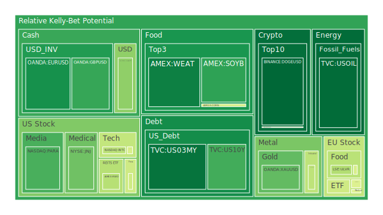
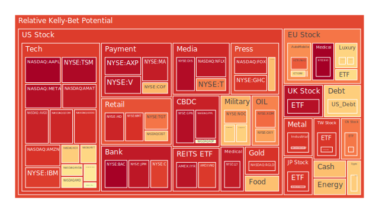
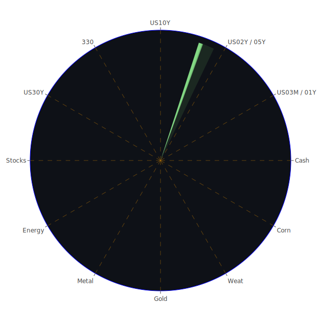

在進行細部討論之前，我們先從空間（Spatial）維度著眼：全球市場中，美國、歐洲、亞洲等各大區塊之間的資本流動、新聞事件的影響，以及當前宏觀經濟與地緣政治脈動。新聞中多次出現對德國、烏克蘭、俄羅斯等地區情勢的報導，尤其在歐洲地區，近期有關德國境內的罷工、難民庇護所攻擊陰謀、以及俄羅斯太空計劃負責人遭撤換等負面消息，可能對歐洲市場帶來一定負面衝擊。而美國部分，科技股財報和國債利率波動，對大盤指數的影響仍居關鍵地位。從社會學和心理學角度來看，市場大眾更在意下一步聯準會動向與高通膨的持續性；博弈論顯示，投資者對於超前布局與短期套利之間猶豫不決，容易導致大資金流動的波段性與突發性。

接下來是時間（Temporal）維度：必須追蹤各資產之過去數月乃至數年的趨勢。我們觀察到美債10年期（US10Y）與2年期（US02Y）的殖利率差已有所收斂，債券收益率曲線一度倒掛，如今雖然稍有回升，但中長期的倒掛風險仍在，一旦宏觀景氣轉差就可能造成市場劇烈震盪。歷史上，1980年代末與2006–2007年也有出現此種殖利率曲線徘徊不定的前期現象，最終市場往往走向衰退或至少深度修正。而新聞對於通膨數據或失業率變化的實時報導，往往會在短期內強化這種「緊縮預期—景氣下行」的投資者恐慌心理。

至於概念（Conceptional）維度，除了一般經濟學所強調的「貨幣供給與需求、利率、就業率、GDP成長」等議題外，也需關注社會與心理學層面，尤其是網路社群帶動的散戶投機情緒，以及在美國、歐洲社會時常引爆的政治與地緣動盪。博弈論的角度下，市場參與者會彼此權衡他人對「風險資產」與「避險資產」的態度，一旦判斷共識發生轉折，往往導致資金從一種資產高速流向另一種資產。

綜合以上「三位一體」的觀點，可以初步歸納出：  
1. 在地緣政治新聞與經濟指標交織下，市場對於利率、流動性與景氣的預期充斥較多變數。  
2. 某些資產類別泡沫風險上升，尤其是科技成長股與部分高Beta資產，因為前期漲幅過大或受到特定題材炒作。  
3. 地區市場間的聯動依然強烈，歐洲的負面消息（如罷工、移民衝突、政治動盪）以及新興市場貨幣對美元波動，都可能形成傳染效應。  
4. 資金對於避險資產或防禦性標的的需求將持續存在，但也須警惕金價、債券等避險部位過度擁擠時的價格擠壓風險。

---

# 投資商品泡沫分析

以下以部分指標資產為例，說明其泡沫風險與最近新聞或歷史背景的對應，並串聯既有理論與可能的市場情緒：

## 美國國債（例如 US10Y、US05Y、US02Y）
美國國債的殖利率近期略有升降互見，但泡沫指數尚未到極端高位。然而，新聞上美國CPI數據偏高時，往往造成短天期債券殖利率跳升，加深倒掛疑慮。歷史上，當聯準會升息至相對高點後，後續經常出現降息或經濟放緩。若未來數月就業市場疲軟，市場對長債需求可能再度上升，形成避險買盤，使長天期殖利率下滑。現階段債券雖具一定吸引力，但若通膨頑固則短期利率風險上行。

## 美國零售股（例如 WMT、TGT）
零售類股受制於消費能力與景氣，新聞報導顯示雞蛋等必需品物價攀升，消費者承受壓力，恐影響相關企業的獲利。在歷史上，每當通膨上揚與利率升高之際，零售股通常迎來獲利壓縮期。短期若消費信心不振、食品與日常必需品價格持續偏高，零售股恐維持較高的泡沫風險，尤其若前期股價已有大漲。

## 美國科技股（例如 AAPL、MSFT、GOOG、META、NFLX、TSLA 等）
科技股一向高度敏感於利率與企業獲利預期。新聞裡提及對Apple需求或營收成長疑慮，使部分分析師評論其熱潮「被過度預期」。然而，AI話題持續帶動資金湧入某些晶片或軟體類股。這種「熱潮-冷卻」的輪動在歷史上多次可見，如2000年網路泡沫或2017年比特幣和區塊鏈概念熱潮。泡沫指數依照近期行情看來，部份美國大型科技股的風險評分偏高。尤其TSLA、NVDA等在去年至今已漲幅顯著。需注意該板塊抱團現象下的高估值風險。

## 美國房地產指數（例如 RWO、VNQ）
美國房地產ETF價格受利率波動影響很大。歷史上，2006年房地產泡沫與後續2008年金融危機值得借鏡。目前利率仍處高檔，FED總資產規模也未大幅擴張，表示流動性沒有前幾年那麼充裕，房地產市場回暖程度存在不確定。新聞亦顯示部份地區可能面臨商辦空置率偏高，這對商用不動產REITs更具壓力。

## 加密貨幣（例如 BTCUSD、ETHUSD、DOGEUSD）
加密貨幣長期處於高波動狀態。近期根據新聞與市場情緒，雖然比特幣仍維持一定熱度，但市場對監管風險與資金面收縮的顧慮依然存在。以歷史相似狀況看，2017年末與2021年大漲後，隨著利率上行與監管收緊，都曾引發價格大幅修正。BTCUSD、ETHUSD、DOGEUSD的泡沫風險依舊相對高，易受投機情緒與社群言論放大，但仍有部分資金將其視為「區塊鏈新革命」的長期布局標的。

## 金／銀／銅（XAUUSD、XAGUSD、COPPER）
黃金在避險需求驅動下，一向於政治、地緣危機或通膨攀升時受到青睞。近期黃金價格上漲，新聞指向全球宏觀不安定與地緣政治衝突升溫也推升避險買盤。然而，一旦利率持續上行，無收益的黃金或面臨被拋售的壓力。銀價和銅價則與工業需求掛鉤較深；若經濟放緩，銀、銅等工業金屬可能回調。歷史可見2008年金融危機前夕，銅價大漲後迅速回落，投資者宜謹慎觀察宏觀景氣。

## 黃豆 / 小麥 / 玉米（SOYB、WEAT、CORN）
全球農產品在通膨及地緣政治（如戰爭、天災）下波動劇烈。新聞顯示部分地區農業成本上揚，而某些糧食出口國可能面臨氣候變化。過往類似例子如2010年俄羅斯大火造成小麥產量驟降，價格飆升。近期黃豆、玉米、小麥指數顯示中度泡沫風險，但若接下來北美、中南美天氣正常，供應充足，則漲勢恐受壓抑。投資者若期待通膨下的糧食漲價題材，需留意天氣和地緣衝突之不確定性。

## 石油 / 鈾期貨 UX1!
根據新聞，目前石油市場受到多方力量影響：經濟成長動能能否延續、美國頁岩油產量狀況，以及OPEC政策。歷史上，油價曾於2008年、2014年和2020年出現多次短期暴漲暴跌。現階段油價在70美元上下震盪，泡沫分數中等，若全球經濟放緩，需求面減弱，油價可能再度下修。而核能話題近年漸受關注，鈾期貨UX1!價格若遭市場炒作或產能轉移風波，波動性也相對高。

## 各國外匯市場（USDJPY、GBPUSD、AUDUSD、EURUSD 等）
外匯市場牽動全球資本流向。近期新聞顯示歐洲經濟受地緣因素與政局不穩衝擊，日圓則受日本內部通縮風險及該國央行政策影響，英鎊與澳幣也因英國和澳洲內部通膨與出口市場變化而波動。歷史上，外匯劇烈波動常伴隨金融危機或突發事件。若對沖基金或大型投資機構同時看衰某國經濟，拋售該國貨幣，很容易造成短期劇烈貶值風暴。

## 各國大盤指數（如 FTSE、GDAXI、JPN225、000300 等）
綜觀歐洲、亞洲與新興市場，近期新聞中提及德國城市示威罷工與車禍事件、烏俄衝突餘波仍在、英國經濟在脫歐餘震中尚未見顯著反彈。中國大陸方面，000300指數若受到內需消費政策與地產風險問題，市場也偏謹慎。歷史上一旦主要股市出現領頭下跌，往往會帶動區域及相關市場連鎖反應，表明連動性風險不可小覷。

## 美國半導體股（例如 AMD、NVDA、MU、KLAC、AMAT 等）
半導體為科技股核心，新聞透露全球AI與數據中心需求雖旺，但也面臨周期性起伏。2021-2022年半導體短缺後有可能轉向供過於求，特別是PC與手機等需求放緩。歴史可見2018年礦機熱潮帶動的顯示卡缺貨到2019年需求衰退時，股價亦急跌。近期部分半導體公司股價偏高，泡沫風險端看下游需求能否實質接棒。

## 美國銀行股（例如 JPM、BAC、C、COF 等）
美國銀行股受利差、貸款需求與壞帳率影響。新聞指出信用卡拖欠率上升，顯示消費者財務壓力增加。歷史上，當壞帳率上行、房貸或商用不動產違約增加時，銀行獲利易受衝擊。短期利率高企雖利好銀行淨利差，但若經濟放緩導致不良債權攀升，銀行股仍可能面臨下行風險。

## 美國軍工股（例如 LMT、NOC、RTX 等）
軍工產業易受政府預算與地緣衝突題材拉動。新聞顯示烏俄戰爭使歐洲各國防務支出多有提高，但若衝突進入膠著或外交局勢轉向，相關軍工需求也可能減弱。歷史上，軍工股大多隨國際安全局勢起伏而漲跌。今年一些負面地緣政治消息仍在，但市場已相對習慣，不一定帶來進一步大幅度推升。

## 美國電子支付股（例如 MA、V、PYPL、GPN 等）
近年電子支付普及度高，交易量穩定成長，但利率上升壓制整體成長股本益比。根據新聞，零售銷售若放緩，刷卡交易量增速也可能趨緩。歷史上，大多此類公司在經濟繁榮時獲得高估值，但經濟疲弱期也會看到獲利成長放慢而股價修正。

## 美國藥商股（例如 JNJ、MRK、LLY 等）
藥商股常被視為防禦性標的，新聞顯示某些大藥廠在專利權到期或研發管線不確定時仍可能受到衝擊。參照歷史經驗，經濟衰退時醫療需求相對穩定，但若政府削減醫療預算或對藥價進行嚴格管制，也會造成利空。目前整體泡沫風險不算特別高，但仍需謹慎觀察政策變動。

## 美國影視股（例如 DIS、NFLX、PARA 等）
串流媒體之間競爭激烈，新聞報導Netflix在全球市場的用戶增長正面，但影視產業整體仍面臨內容成本飆升的挑戰。若廣告收入或訂閱營收疲軟，則預估盈餘有下修風險。歷史可追溯至2000年代初期的媒體整合與網路衝擊，同樣帶來內容製作模式的轉變，投資者需留意技術更迭及市場飽和風險。

## 美國媒體股（例如 CMCSA、FOX、NYT 等）
新聞指出部份報業或有線電視訂戶數成長趨勢放緩，廣告收入亦受數位轉型與經濟周期影響。過往多次廣告市場下行都會衝擊傳統媒體股的獲利。流媒體平台的崛起亦瓜分市場，因此對於老牌媒體股來說前景仍有挑戰，泡沫風險與估值壓力並存。

## 石油防禦股、金礦防禦股（例如 XOM、RGLD 等）
這類標的通常兼具避險與穩定配息特性。XOM等石油能源類公司，在油價反彈時業績強勁，但一旦油價轉弱或環保法規變動，都會打擊獲利預期。金礦股則仰賴金價走勢，金價若持續高位，金礦股利潤擴張，但歷史上金價漲幅若受FED緊縮政策壓制，其股價回落也可能非常快速。

## 歐洲奢侈品股（例如 RMS、KER、MC 等）
這些高端品牌受中國、北美、歐洲頂級消費需求帶動。歷史上，一旦全球經濟景氣下滑，奢侈品需求會首先縮減，但在當前特殊環境下，部分高淨值消費並未明顯降溫。從新聞角度看，歐洲如德國或法國若發生社會動盪或經濟衰退，奢侈品公司可能在本土市場受壓，但在國際市場仍可能維持成長。

## 歐洲汽車股（例如 BMW、MBG 等）
歐洲多家車廠正面對電動化轉型與全球競爭壓力。新聞提及德國多地罷工、社會動盪，或導致生產、物流延誤。若全球需求放緩，汽車產量與銷量都易受衝擊。歷史上，汽車製造業對景氣循環極度敏感，若陷入衰退，該板塊評價亦會快速降溫。

## 歐美食品股（例如 KO、KHC、NESN 等）
食品飲料多具防禦性，但也面臨原物料成本上漲與人力成本增加的風險。新聞中，對於食品通膨數據、雞蛋等必需品價格飆升的報導，反映整體食品成本也偏高；若消費者信心疲弱，業者轉嫁成本的能力可能受限。歷史上，在高通膨時期，若終端消費者無法吸收提價，企業獲利空間就被壓縮。

---

# 宏觀經濟傳導路徑分析

本階段從宏觀角度檢視傳導路徑：  
1. **利率與信用**：美國FED緊縮政策尚未完全放鬆，利率仍處歷史偏高水準。消費、投資與就業市場若遭到擠壓，進一步加深零售業、房地產、市場流動性緊縮。  
2. **匯率與跨境資本流動**：美元若維持相對強勢，新興市場貨幣易被拋售，資金回流美國，造成新興股市與債市下挫。歐洲若政治或經濟不穩，也可能推升美元作為短期避險貨幣。  
3. **地緣政治與原物料**：烏俄衝突、東歐混亂、非洲部分地區動盪，可能推動糧食與能源價格波動。若供應鏈更趨緊張，通膨或難及時降溫。  
4. **財政政策與政府支出**：美國政府軍事與基礎建設開支可能支撐部分工業品需求，但若債務比率（Debt held by the public % of GDP）持續上升，市場將關注國債風險。

---

# 微觀經濟傳導路徑分析

1. **企業成本結構**：高利率與工資上揚使得企業利潤壓力更大。零售、媒體、運輸企業因通膨導致成本攀升，毛利率承壓。  
2. **消費者支出**：公共新聞顯示消費者對必需品通膨恐慌升高（如雞蛋價格），若持續擔憂景氣，會壓抑非必需品消費，衝擊零售、娛樂、奢侈品等領域。  
3. **企業投資意願**：若持續擔心經濟不確定，企業在研發、資本支出方面更趨保守，IT支出、雲端服務、半導體需求都會放緩，影響科技股表現。  
4. **不良債務蔓延**：銀行壞帳、消費者信用卡逾期、商用不動產違約，都會微觀層面上侵蝕金融部門資本，進而傳導至貸款供給緊縮。

---

# 資產類別間傳導路徑分析

透過以上宏觀、微觀的交互影響，可以看到以下幾條潛在的漣漪效應：  
1. **「利率上升→美元走強→新興市場資金外流→商品需求下行→大宗商品與新興市場股債受壓」**。  
2. **「地緣衝突加劇→能源與糧食成本走高→歐洲經濟壓力增加→歐元偏弱→美國大宗農產品短線受利、多方猜測持續推高黃金需求」**。  
3. **「經濟增長放緩→企業獲利預期下修→成長型股票估值受壓→資金轉向防禦及高股息標的→當該領域泡沫堆積後又出現獲利了解」**。  
4. **「信貸品質惡化→銀行保守放貸→企業投資受抑制→失業與消費降溫→房地產、零售股與工業金屬需求再受打擊」**。

這些漣漪路徑會隨市場情緒與政策變動而強弱交替，但可視為風險傳遞及對沖布局的重要參考。

---

# 投資建議

以下建議僅供參考，應根據個人風險承受度與財務狀況調整：

1. **穩健型組合 (合計 100%)**  
   - （40%）**短天期或中期美國國債**：基於當前利率仍在相對高檔，持有美債可提供一定票息並兼顧流動性與避險功能。  
   - （30%）**黃金相關資產**：雖然金價短期可能波動，但在地緣政治與通膨風險下，黃金往往能作為長期對沖。  
   - （30%）**防禦型藥商股或大型消費必需品**：如 JNJ、MRK、或穩健食品股 KO、KHC 等，能較好抵禦景氣波動。

2. **成長型組合 (合計 100%)**  
   - （30%）**半導體龍頭股**：如 AMD、NVDA、KLAC 等，雖具波動風險，但長期AI、數據中心需求具潛力，前提是留意估值高漲的泡沫風險。  
   - （40%）**部分消費科技龍頭**：如 AAPL、MSFT、GOOG 等，市占率與現金流穩健，但要留意新聞所提及的「成長減速」及估值壓力。  
   - （30%）**選擇性奢侈品或優質品牌**：如 MC、KER、RMS 等，若全球高端消費仍顯韌性，該類公司可望維持獲利增長。但同時需警惕歐洲政局動盪。

3. **高風險型組合 (合計 100%)**  
   - （30%）**加密貨幣或區塊鏈相關產業**：BTCUSD、ETHUSD、甚至 DOGEUSD 等，短期劇烈波動，但若有長期「去中心化」與「區塊鏈應用」信仰者，可進行小比例佈局。  
   - （40%）**能源及原物料期貨**：如油價（USOIL）或鈾期貨（UX1!），一旦地緣政治或供需失衡，價格易出現急漲。謹記此屬高杠桿操作領域。  
   - （30%）**高Beta科技或雲端軟體新創**：若看好未來數年產業爆發式成長，可納入TSLA、部分雲端或AI新創。但估值多半高企，需謹慎停損機制。

上述配置旨在示範多元資產分散與相位對沖，彼此相位盡量達到分散效果（理想中相關係數趨近於-0.5），同時利用不同方向的市場力道來平衡波動。必須強調，投資者應自行評估並不斷檢視市場風險。

---

# 風險提示

投資始終面臨不確定性。前述所有分析與假設僅作為思考引導，實際市場變化往往超出預期。尤其是：  
1. **高泡沫風險**：部分科技股、加密貨幣、原物料或其他標的，短時間有可能經歷大幅震盪或跳水。  
2. **地緣政治**：包括烏俄衝突、歐洲多國內政動盪，以及各地突發衝突，都能立即衝擊金融市場並影響全球供應鏈。  
3. **政策與利率變動**：聯準會或其他央行若有意外加息、縮表或釋出更鷹派訊號，恐再度擠壓股債與風險資產估值。  
4. **流動性枯竭**：若市場流動性急速枯竭，所有資產（包括避險標的）可能面臨同步下跌的壓力。  
5. **財務槓桿**：任何使用槓桿或衍生品的投資，都可能在市場劇變時造成更大虧損。需保持警覺與風控紀律。

總體來說，當前市場既有持續性的結構性機會，也蘊含泡沫化與因地緣情勢而急轉直下的風險。無論是從空間、時間還是概念三方面來觀察，投資者宜密切注意重大政策、國際事件及經濟指標變動。在佈局組合時，應將避險策略、資金管理與紀律嚴格落實，理解每一種資產都有其週期性與不可避免的風險特質。最終，請各位投資者根據自身財務目標與風險承受度做出決策，切勿忽視潛在泡沫所帶來的下行風險。

 
Daily Buy Map:

 
Daily Sell Map:

 
Daily Radar Chart:

 
