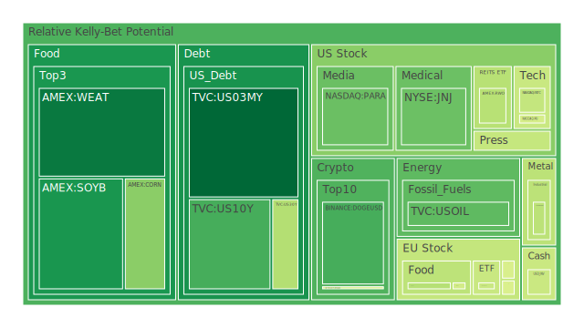
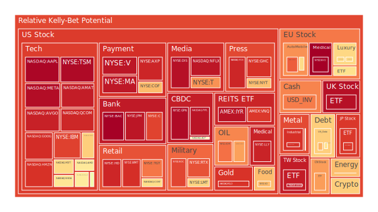
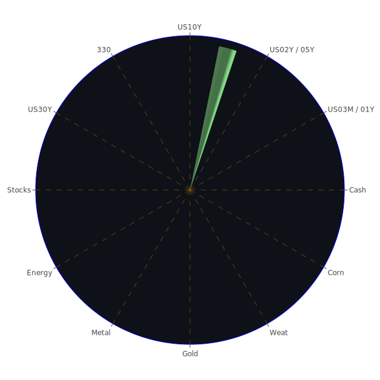

# 投資商品泡沫分析

以下將針對各主要投資商品進行泡沫風險的概括分析。泡沫分數（D1、D7、D14、D30）與當前價格（PP80、PP100）等指標，可以被視為市場潛在過熱或風險累積的度量，數值較高時代表風險亦較高；若該數值在短時間內顯著攀升，則更需警惕流動性及資金面逆轉的潛在衝擊。本報告參考了近期新聞事件與歷史上所出現的相似情境，以協助投資者全面思考各資產的情勢發展。

## 1. 美國國債
近期美國國債（以US10Y、US05Y、US02Y等為代表）的殖利率持續在4%至5%上下波動，報告中可見US10Y的泡沫指數（D1約0.28，D30約0.11）相對較低，表示整體市場對於較長天期債券的短期過熱程度目前並不高。但10Y-03M利差逐漸轉正至約0.15，顯示長短端之間的倒掛正在緩步修正。美國聯準會在2024年底以來出現的鷹派演說雖然只有4次，但結合經濟數據看，資金市場對於未來一年可能的利率走勢仍保持謹慎。

由於美國聯準會的資產負債表（FED Total Assets）仍在相對低檔，並且銀行體系整體存款量（US Bank Total Deposits）相對高企，若後續財政部持續加大發債規模以填補政府支出，10Y與30Y美債收益率仍有溫和上行空間。新聞面顯示，與政府借貸相關的失信率有上升風險，例如「More Americans with government loans are falling behind on their mortgages」之報導（市場負面衝擊97%），也會讓投資人擔心政府在住宅貸款與福利支出上承擔的壓力。

歷史場景方面，2008年金融海嘯以前，美債常被視為「避險資產」。然而在量化寬鬆解除並進入緊縮周期後，美債利率波動風險已大於前幾次緊縮周期。整體而言，美國國債在空間層面（市場籠罩在全球主要央行緊縮或暫停緊縮的氛圍下，需求仍存在避險傾向），時間層面（美債拍賣時程與財政部資金需求）與概念層面（政府舉債以及是否接近債務上限談判）之下，暫時並未出現極端泡沫，但也需關注未來市場對收益率的更激烈再定價。博弈論觀點上，市場參與者普遍等待更高利率才願接手長債，一旦情緒逆轉，債券市場的流動性與價格變動可能非常劇烈。

## 2. 美國零售股
美國零售業近期受到通膨與消費信心波動影響，高檔物價下使得一般消費者日常開支壓力升高。新聞面有「Amazon North Carolina workers reject union, handing retailer win in labor fight」等（負面90%）事件顯示，勞資衝突雖然暫時對零售巨頭有利，但長期勞工士氣問題可能沉積。沃爾瑪（WMT）目前泡沫指數D1約0.91，D30約0.65，屬於相對偏高區域；Target（TGT）則維持D1在0.81至0.94上下波動。Bank of America提到「growth stocks are in a bubble exceeding the 'dot-com'」，且美國零售股常被算入成長型指數或大盤綜合指數中，暗示零售股可能面臨估值過高風險。

然而回顧歷史，零售股在經濟緊縮週期中，如果供應鏈管理得當，再加上存貨合理化，偶爾也會出現逆勢增長。這或可部分解讀為在空間層面上，零售業在美國內需市場穩定之下依舊具有抗跌性。從時間維度看，若春季與夏季促銷活動帶來的銷售未及預期，其股價恐有一波更顯著的修正壓力。在博弈論層面，零售商與消費者之間經常面臨「折扣 vs. 盈利」的談判，若物價與利率繼續提升，零售商勢必削減促銷或加大價格策略，可能壓抑後續需求。

## 3. 美國科技股
近期科技股飽受「泡沫」之質疑，過去幾年在高度寬鬆的貨幣政策下，資金大量湧入龍頭企業。新聞報導「Bank of America says growth stocks are in a bubble...」可見許多大型科技企業估值偏高。從資產資料看，蘋果（AAPL）PP100約244.6，泡沫指數D1高達0.98以上（2月15日數據到2月17日連續逼近0.99），微軟（MSFT）則也在D1高於0.66左右，D30約0.73至0.74之間，顯示整體市場對大型科技股的熱度依舊居高不下。Meta（META）持續創波段高點，股價連續20天上漲也反映市場積極擁抱AI、元宇宙和社群平台商業化的願景。新聞面有利多如「Meta Platforms stock just closed higher for the 20th straight day」（正面90%），但也有負面新聞指出科技泡沫風險大於2000年科網泡沫。

歷史類比可參考2000年網路泡沫時期：資金大舉湧入高增長、高估值科技企業，最終泡沫破裂帶來大規模資本損失。就空間層面而言，當今市場同時存在供應鏈轉型、雲端運算與AI應用高速擴張的利多，也有流動性減少與估值修正的潛在利空；時間層面，一旦利率高企且企業財報出現不及預期，估值修正恐怕加劇。在心理學上，散戶與機構投資人皆對「科技創新能帶來高成長」抱有高度信心，但在市場波動加劇時，該信心往往容易轉為恐慌。博弈層面來看，機構之間的「抱團」若因風險管理而結束，會誘發多米諾式的拋售壓力。

## 4. 美國房地產指數
美國房地產整體而言，隨著30年期抵押貸款利率（Fixed Morgage 30Y Rate）從2024年的2,970,000快速上升到如今約6,870,000～6,910,000，房貸壓力大幅升高，購房需求亦有所冷卻。對應資料顯示RWO、VNQ、IYR等房地產或不動產投資信託相關ETF之泡沫指數均在0.88至0.96之間的高檔。例如VNQ D1約0.90以上、IYR則逼近0.96，意味市場對房地產投資的高風險已有所警戒。新聞方面也顯示「Home delistings soar 64% to the highest level in nearly a decade as buyers turn down sellers」，伴隨「buyers turn down sellers」之現象，反映賣方與買方對價格預期大幅出現落差。

歷史經驗方面，2008年次貸危機留下的陰影依然籠罩在許多投資者心中。雖然銀行體系在貸款篩選上相對謹慎，但若經濟衰退確定，房價的下修仍難以避免。就空間層面，美國房地產市場受限於地區性差異，沿海與內陸的升降幅度可能不一致；時間層面，抵押貸款利率升高所產生的影響仍需持續幾季後才會顯現；概念層面上，許多民眾將住宅視為主要資產，一旦就業市場或債務負擔惡化，拋售或斷供都會惡化房地產市場的信心。

## 5. 加密貨幣
比特幣（BTCUSD）目前接近96,000附近，泡沫分數在D1約0.48，D30則降至約0.32上下，說明投資人對其短期波動風險仍有一定警戒。以太幣（ETHUSD）則維持在2,600～2,700區間，DOGEUSD也出現D1約0.28～0.57不等的區間。新聞方面，「Argentine lawyers charge President Milei with fraud over cryptocurrency promotion」（負面86%）之消息，揭示當政治人物以激進方式推廣某些代幣時，市場波動和監管風險會同時增溫。

回顧歷史，加密市場於2017年底、2021年初皆出現過顯著繁榮並伴隨崩跌；這種週期在空間層面受全球資金流動特性影響，在時間層面上往往由「加密資本寒冬-牛市-泡沫破裂-政策收緊」週期循環。博弈論角度，加密市場參與者眾多且缺乏絕對的集中管理，易出現投機高峰期且散戶情緒傳染顯著。心理學層面上，市場過度樂觀時常忽略監管或詐騙等負面因素，一旦新聞面轉負面，情緒反轉速度相當快。在最新消息中，土耳其監管機構對Frito-Lay開罰，以及其他國家對加密詐騙的調查，都讓投資者對交易平台的監管合規開始更加留意。

## 6. 金 / 銀 / 銅
現貨黃金（XAUUSD）價格約落在2,900～2,930上下，泡沫指數D1約0.81～0.54間變動，仍顯示一定程度的高風險。白銀（XAGUSD）則約32美元左右，D1略高於0.91，暗示投資人對白銀的短期炒作較明顯。銅（COPPER）依舊維持在4.6～4.7的區間，中等偏上之泡沫分數約0.44～0.53。近幾則新聞無特別大幅影響到貴金屬，但地緣政治（如DR剛果武裝衝突、烏克蘭局勢等）仍對金銀產量或物流構成干擾，變動性不容小覷。

歷史上貴金屬通常在經濟動盪或通膨加劇時走強；然而本次CPI年增率（CPIYOY）約3%，已較前幾期稍降，且部分市場參與者預期未來通膨壓力可能進一步趨緩。在空間層面，金銀市場同時受到投機與避險需求拉扯；時間層面，若美債利率小幅上行，金銀往往走弱，但地緣政治動盪則使金銀受到支撐；概念層面則包含了「硬資產」的信念與ETF或紙黃金、紙白銀等衍生性的期貨交易擴張的影響，出現了更高槓桿與更多波動。

## 7. 黃豆 / 小麥 / 玉米
黃豆（SOYB）與小麥（WEAT）以及玉米（CORN）之價格持續受到地緣政治、氣候、全球供需等因素影響。小麥WEAT D1約0.18，SOYB則在0.23～0.24上下，玉米CORN約0.36～0.57之間，整體指數未呈現太明顯的極端泡沫。但新聞面顯示，部分地區農業災害與乾旱可能影響後續單產，也可能造成價格階段性上漲，尤其在烏克蘭戰爭尚未完全平息的背景下，黑海糧食供應線可能時時受到衝擊。

回顧歷史，每當國際衝突使糧食出口受阻（如2010年前後俄羅斯的糧食禁令），市場皆曾出現農產品大漲行情。但若衝突趨緩及其他地區增產，價格也有快速回落的歷史先例。博弈論方面，農產品市場常有投機資金炒作，容易放大天氣、疫情、地緣政治變化。心理學層面，農產品期貨交易者容易在恐慌訊息下大量搶貨，但一旦局勢穩定，又會造成拋售狀況。因此暫時不見極端泡沫，但保持警戒。

## 8. 石油 / 鈾期貨UX
西德州原油（USOIL）約70美元上下浮動，泡沫分數落在0.31至0.47，短線雖不似前期曾高達每桶100多美元，但目前市場對原油需求能否持續增長仍有疑慮。新聞面指出「Houston’s Oldest Refinery Is Shutting. It Won’t be the Last.」(負面91%)，顯示美國一些老舊煉油廠不堪能耗或維修成本而退出市場，供需動態更趨複雜。

鈾期貨（UX）價格在66～68之間，D1約0.71～0.44不等，相較2011年日本福島核災前後價格仍偏低。由於核電再度成為討論焦點，長期需求有潛在利多，但短期投資者還是關注地緣供應以及各國能不能鬆綁核能政策。歷史上，鈾價因重大安全事件（如核電廠事故）而暴漲暴跌。空間層面看，現今多國在轉型過程中，對核能需求屬「策略性備用方案」；時間層面，未來若碳排放與氣候法案更加嚴格，核能可能得到更大支援；心理層面上，投資者對核能常懷矛盾心情，一邊認為其清潔且高效率，一邊擔心核廢料與安全風險。

## 9. 各國外匯市場
美元對日圓（USDJPY）稍早報約152～151，上行趨勢仍然明顯。新聞提到「Hedge-Fund Bears Risk Being Burned by Resilient Aussie Dollar」（負面94%），但同時「Dollar Swings Drive Creative Yen Bulls to European-Based Trades」（負面71%），顯示外匯市場有多方博弈。澳幣近期受到鐵礦石、原物料需求支撐，看似有些抗跌。英鎊（GBPUSD）在1.26上下，歐元（EURUSD）在1.05左右，泡沫指數分別在0.87與0.63上下。短期仍須觀察英國與歐洲通膨與央行動向，尤其新聞提到「Resurging UK Inflation Will Keep BOE Cautious on Cutting Rates」（負面72%），暗示英國可能較晚進入降息循環。

歷史經驗顯示，高通膨與利率政策差異會直接引導資金流向；2008年全球金融風暴後，美元指數急漲，非美貨幣普遍貶值。此次在空間層面，主要經濟體間經濟成長速度差異化明顯；時間層面，美國仍有縮表與聯邦基金利率調整在後面進行；博弈層面，外匯交易者常根據市場風險偏好切換避險貨幣或高息貨幣，造成匯率波動顯著。

## 10. 各國大盤指數
歐洲大盤指數（FCHI、GDAXI、FTSE）在D1約0.66～0.96不等，其中英國FTSE逼近0.97（2月15～17日數據大致如此），顯示市場對英股報以較高的泡沫疑慮。德國DAX（GDAXI）數據約0.46～0.61之間，其風險偏中等。亞洲方面，日經225（JPN225）與台灣加權指數（TWSE:0050代表）亦處於高檔；TWSE:0050泡沫指數約0.94～0.93之間，意味著海外資金大量湧入台灣半導體等相關企業後，市場估值偏高風險凸顯。陸股上證300（000300）D1約0.76，D30約0.53，前陣子大幅波動後暫時稍事整理。

歷史告訴我們，當區域市場在景氣擴張階段伴隨國際資金湧入時，指數常創新高，但若國際資金收緊，外資撤離，往往加重指數下跌幅度。空間層面看，大盤指數與內外需求、外資動向緊密相連；時間層面，若各國央行不斷調整貨幣政策，指數勢必震盪加大；在概念層面，科技成長股、中小型股及權值股的「高估值」與「實質獲利」間落差仍是最大風險之一。

## 11. 美國半導體股
美國半導體股主要看NVDA、AMD、MU、KLAC、AMAT等。當前數據顯示NVIDIA（NVDA）D1在0.64上下，D30約0.59，AMD約0.63～0.57，Micron（MU）約0.48～0.49，AMAT更高達0.94～0.96，KLAC亦在0.62～0.73之間。整體呈現高風險區域。新聞面，AI、5G與自動駕駛等題材支撐了半導體股長期需求。然而Bank of America等機構也示警，市場對半導體股前景的高增長預期可能被過度放大，若之後需求不及預期，調整幅度恐相當顯著。

回顧歷史，2018年中美貿易戰導致半導體板塊大幅震盪，2020年疫情初期更造成供應鏈問題。半導體產業常以盛衰週期著稱，景氣高峰時資本支出與投資熱度高，但市場一旦飽和，庫存積壓就會誘發價格大幅下跌。空間層面，半導體製造集中的地區若受地緣衝突、極端氣候等因素干擾，影響全球供應量；時間層面，製程世代推進與企業佈局需數年才能看出成效；博弈角度，各國對半導體關鍵技術掌控都有國家安全考量，可能導致產業局部脫鉤和市場分裂。

## 12. 美國銀行股
美國銀行股（BAC、JPM、C等）數據顯示，BAC泡沫分數幾近1.0（0.99上下），花旗C也約0.88～0.91間，摩根大通（JPM）在0.95～0.97區間。銀行股本應在利率上揚階段有利差擴大的利多，但同時也面臨貸款風險提高。新聞提到「JPMorgan's Dimon sounds off on 'stupid' DEI expenses」(負面85%)，顯示投資者對銀行在企業社會責任及多樣性投資上也有某些爭議。此外，部分銀行因放款給高槓桿企業或消費者，可能面臨違約風險升溫。

歷史上每逢景氣衰退徵兆明顯時，銀行股通常首波受創。空間維度看，當前美國銀行業的競爭正在財富管理和金融科技領域擴張；時間維度，美聯儲如果再次意外加息，銀行資產負債管理若沒及時調整，可能出現資本大幅縮水；在博弈論的拆解下，銀行之間有跨業合併與資產競爭，也要同時面對客戶群體的違約隱憂。綜觀之，銀行股看似估值仍不算極端，但因泡沫指數接近1.0，值得密切留意。

## 13. 美國軍工股
雷神（RTX）、洛克希德馬丁（LMT）、諾斯洛普格拉曼（NOC）等泡沫指數也來到0.68～0.88之間。烏克蘭戰事與地緣衝突為軍工企業的訂單帶來支撐。新聞上，如「A German drone manufacturer backed by Peter Thiel says it will double its production capacity in Ukraine in 2025」（正面91%）此類訊息意味防禦類股的營收預期仍在升溫。然而若衝突緩和或地緣政治對話成效提升，需求急凍的可能性也不可忽視。

歷史上，軍工股常在國際局勢緊張時受青睞，但一旦預算削減或和平進程明朗化，股價回落就十分明顯。空間層面，北約及其他地區對先進武器的需求可能長期存在；時間層面，年度或多年度軍事預算審批，以及國際協議將直接影響訂單；心理學角度，市場對軍工股往往存在道德爭議，但同時其長期大額政府訂單又使之成為相對穩定的收益來源。

## 14. 美國電子支付股
Visa（V）、Mastercard（MA）、PayPal（PYPL）等電子支付與金融科技相關企業，持續受到移動支付、線上交易普及的利好支撐，但高估值風險也浮現。Visa、Mastercard的泡沫指數皆在0.95上下，PayPal接近0.96。新聞面提到「Uber accuses DoorDash of anticompetitive practices in lawsuit」（負面87%）等，也顯示電子商務與支付平台之間的價格策略與商業糾紛升高，可能拖累市場對產業的成長期待。

歷史上，電子支付概念股自2015年以來高速成長，尤其疫情後線上交易激增。但若全球需求回落，加之競爭對手層出不窮，其成長力道恐不如前。空間面，電子支付市場幾乎滲透到各國；時間面，若FinTech監管趨嚴或收費政策改變，市場報酬率恐受影響；概念面，區塊鏈或CBDC（中央銀行數位貨幣）一旦普及，電子支付模式或被重新洗牌。

## 15. 美國藥商股
強生（JNJ）、默克（MRK）、禮來（LLY）等屬大型製藥或生技公司。強生JNJ之泡沫指數約0.32～0.41，且在D30約0.26，顯示其相對泡沫風險並不高；默克則在0.48～0.56之間，禮來LLY則較高，約0.93～0.94。新聞面沒有明顯利多或利空，但醫藥產業通常相對防禦性強，對經濟波動不甚敏感。歷史經驗也顯示，在景氣衰退或波動時，資金常轉向醫藥股避險。然而若某些新藥研發或法規監管出現不確定因素，可能會衝擊個別公司。

## 16. 美國影視股
Netflix（NFLX）、Disney（DIS）、Paramount（PARA）等近期陸續出現訂閱、票房與流媒體營運的市場爭議。Netflix D1約0.95上下、D30約0.80，Disney約0.96～0.97，Paramount則在0.32～0.57之間。新聞面「Paramount, YouTube TV strike deal, averting CBS outage」（負面85%）顯示一些影視版權或串流合作談判仍較緊張，牽動市場對串流媒體整合趨勢的擔憂。此外，「Trump Media says it lost more than $400 million last year」則突顯媒體類公司若營運不善，虧損可能相當嚴重。

历史類比來看，媒體娛樂產業已有整合趨勢。空間面，全球消費者對數位串流需求仍在增長；時間面，短期競爭使串流平台陷入價格戰，與廣告投放模式快速切換；博弈面，傳統影視公司須面對Netflix、YouTube等新媒體的挑戰，雙方在版權戰、節目製作、廣告商爭奪中相互競爭並嘗試策略聯盟。

## 17. 美國媒體股
與影視股類似，媒體公司也涵蓋新聞、廣播、出版及線上平台等。New York Times（NYT）泡沫指數在0.70～0.73。市場對傳統媒體的營收模式並不看好，但網路訂閱多少提供支撐。新聞面「Trump Media says it lost more than $400 million last year」連結了政治因素與社群平台的營運表現。過去報業在數位轉型上曾有成功案例，但「華爾街日報」或「金融時報」等主流媒體也經歷訂閱制的市場爭奪。空間面，多元化收費模式與付費牆；時間面，讀者黏著度與廣告收入的不確定性；博弈面，大型科技平台壟斷部分流量，傳統媒體須依附或對抗。

## 18. 石油防禦股
XOM（埃克森美孚）、OXY（西方石油）等同屬能源類防禦股。XOM泡沫分數在0.62～0.82，OXY則更高，約0.69～0.76。新聞面顯示油價反覆震盪，煉油廠關閉、歐佩克減產與美國頁岩油增產等多空因素交錯。歷史來看，石油股在能源危機或經濟復甦初期常有大漲，但若經濟放緩甚至衰退，需求下滑使能源股面臨獲利壓力。空間層面，油公司為對抗ESG壓力而轉型；時間層面，各國新能源布局日益成熟，油公司面臨長期結構轉變；博弈面，油企之間與國家政策角力，地緣政治風險依舊沉重。

## 19. 金礦防禦股
RGLD等與金礦相關公司，泡沫指數約0.90～0.91；金礦股較受惠金價上漲，同時也面臨生產成本、地緣政治與公司治理風險。新聞面無顯著針對金礦股的訊息，但考量戰爭或避險需求升溫時，金礦公司也能受益；一旦情勢趨緩或金價回落，其股價容易承壓。歷史經驗指出，金礦股與金價雖正相關，但礦場資本支出大、探勘結果具有不確定性，故波動大於金價本身。

## 20. 歐洲奢侈品股
歐洲奢侈品牌（如KER、MC、RMS等）近年受益於亞洲市場需求，但在中國等地疫情反覆後，需求增長放緩。KER泡沫指數約0.48～0.78之間，MC約0.47～0.66，RMS約0.67～0.73。新聞面提到某些歐洲國家在經濟層面面臨通脹與供應鏈壓力；若中國或美國高端消費因景氣降溫而萎縮，奢侈品銷售恐現回落。歷史來看，奢侈品對外在經濟環境與富裕消費族群的財富效應高度敏感，亦常遭遇政治與地緣突發事件影響。例如2008年金融危機後奢侈品銷售快速縮水，之後又隨QE政策與中國消費崛起而激增。

## 21. 歐洲汽車股
歐洲汽車巨頭如BMW、MBG等泡沫指數約0.51～0.66之間。市場對電動化與自動駕駛轉型保持觀望。新聞面「Two High-End Mercedes-AMG Models Totaled in Head-On Collision During Test Drive in India」（負面96%）雖然是一起意外事故，但也再次引發對高檔車市場與車輛安全的關注。整體車市受缺料、物流成本、能源價格干擾，導致利潤率不確定性居高不下。歷史上，歐洲車廠在2008年及2012年歐債危機時期銷量大受衝擊；若目前歐元區景氣轉弱，再加上中國市場競爭，短期利潤壓力亦會升高。

## 22. 歐美食品股
可口可樂（KO）等公司泡沫指數大概0.72～0.65，麥當勞等速食連鎖或KHC（卡夫亨氏）也在0.50～0.58上下。新聞面看不出重大刺激訊號，但「Turkish Regulator Slaps $36 Million Antitrust Fine on Frito-Lay」（負面96%）透露出零食行業在全球監管日趨嚴苛的大環境下需謹慎因應。歷史上，食品業在經濟下行時也具一定防禦性，但若成本（農產品、包裝、運輸等）大漲，毛利率就可能受侵蝕。空間層面，消費者對健康化或低糖產品需求提升；時間層面，穩定的股利發放往往吸引保守投資人；博弈層面上，跨國競爭激烈，尤以新興市場成長潛力與當地監管政策互動顯著。

---

# 宏觀經濟傳導路徑分析

就宏觀角度來看，聯準會的政策動向依舊是全球市場的核心節點。資料顯示OIS FED Fund Rate從去年5.30到目前4.33，顯示市場預期中的降息或放緩加息在逐漸萌芽。若未來FED更快縮表或因通膨數據反覆而重新加碼緊縮，可能帶動基準利率上升、國際資金流向重新洗牌，進一步影響股票、債券、原物料、外匯和房地產等市場。

各項DELINQUENT（包括Commercial Real Estate、Consumer、Credit Card等）都顯示偏高，說明底層債務違約風險聚集。GSE（政府機構）與銀行關係依舊緊密，若未來資產品質惡化，金融市場仍可能爆發局部危機。再者，國際地緣政治持續衝擊能源與糧食價格，新聞面大多報導政治與局部戰爭相關的負面消息，打擊整體風險意願。最終將在宏觀層面上傳導至企業利潤與消費信心，導致市場評價的波動。

---

# 微觀經濟傳導路徑分析

從企業個體來看，利率水準與融資成本大幅提升後，現金流管理成為重中之重。高負債企業與新創若無法在風投收緊的環境中成功籌措資金，容易陷入經營困境。消費端若持續削減非必需品支出，零售、旅遊、奢侈品等行業受衝擊更大。企業間兼併收購可能在資金壓力下變得較冷清，或反之若估值大幅下修，也可能誘發現金流充足企業進行「撿便宜」併購。就電子支付、軍工、生技等行業，市場預期和政策支援佔比不低，故若政策突然轉變，投資者需謹慎因應。

---

# 資產類別間傳導路徑分析

1. 股債互動：當美國公債收益率上升，股票估值承壓，尤其是高本益比成長股。但若避險資金湧入債市，長期利率又有下行空間，使得股票再度受支撐，形成不穩定的震盪。

2. 商品與貨幣：若石油與天然氣價格攀高，能源輸入國之貨幣可能走弱，輸出國則受益。金屬（含貴金屬、工業金屬）價格的漲跌與全球製造業景氣亦形成互相牽動。

3. 房地產與銀行：若房地產市場景氣下行，銀行可能面臨壞帳風險，進而在資本市場籌資或緊縮放貸，連動企業貸款與個人消費貸款。反之，若銀行系統穩健，抵押貸款利率能控制在可接受範圍，則房地產投資有一定支撐。

4. 加密貨幣與科技股：大量風險資金同時關注加密貨幣和高增長科技股，資金在兩者之間「投機性流動」頻繁。市場樂觀時，兩者皆會快速暴漲；市場驚恐時，資金同樣快速撤離。

5. 奢侈品與匯率波動：歐洲奢侈品高度依賴中國、北美等富裕消費者。歐元、美元、人民幣匯率之間的變動，會影響遊客消費力與輸出價格優勢。

通過三位一體的空間、時間、概念交織，我們可發現市場如同多層網路，任一資產若因突發事件出現劇烈波動，都可能透過杠桿、對沖、流動性等機制向其他資產擴散，形成「漣漪效應」。

---

# 投資建議

以下嘗試提出風險對沖的投資組合機會，並注意彼此相位盡量滿足120度、相關係數約-0.5之理念。此僅概括說明，實際操作仍需更詳盡之數理模型與風控參數。

1. 兼顧不同市場：
   - 以部分期貨或ETF做分散：如在看好原物料時，同時避險科技股可能的估值下殺風險。
   - 若對加密貨幣偏好較低，可在黃金或白銀等貴金屬中尋找另一低相關標的，但泡沫指數仍偏高者則須逢高分批建倉。

2. 針對房地產與REITs：
   - 美國房地產REITs（VNQ、IYR）泡沫顯著，但可在下跌過程中觀察分批承接，尤其是存有良好現金流、地段與經營管理能力較強的標的，與短期公債的配置成對沖組合。

3. 不同成熟度市場佈局：
   - 新興市場股票指數在外資抽離時與美國大盤相關度可能下降。但若發生全球風險事件，負相關亦可能失效，需審慎衡量並且做好部位控管。

4. 在外匯市場：
   - 可透過日圓或瑞郎做防禦性對沖，尤其當市場顯著轉向避險時，這些貨幣具備弱相關或負相關特性。但近期USDJPY因日本政策不確定而波動大，也要考量其風險。

---

# 風險提示

投資有風險，市場總是充滿不確定性。回顧歷史，一旦貨幣環境逆轉，任何短期過度炒作的資產都存在大幅修正空間。目前觀察各主要市場與新聞事件，負面情緒佔主導的報導比例不斷攀升（例如美國消費信心下滑、歐洲衝突、地緣緊張、房貸逾期率上升等），且「Bank of America等稱成長股泡沫恐超越網路泡沫」的警訊值得重視。假使美國10Y、30Y國債殖利率進一步向上或經濟增長減速，資金勢必逃離估值最高的領域。此外，千萬不可忽視任何泡沫風險高的警告。

以下為根據當前環境下，提供的三大配置思路與比例建議（總計100%）：

1. **穩健型（約40%）**  
   - **短期美國公債或貨幣型基金**：考慮美國3個月～1年期國債（US03MY、US01Y）等，因其利率處於4%之上且風險相對低。  
   - **黃金或白銀少量配比**：雖然金銀泡沫指數偏高，但仍具長期避險特性，可佔穩健部位中的一部分，如2～5%權重。  
   - **防禦性消費或醫藥股**：選擇強生（JNJ）或成熟食品、零售龍頭（如KO），因其泡沫指數相對其他高增長股並不算高，且經濟衰退中需求相對穩定。

2. **成長型（約40%）**  
   - **科技龍頭分批介入**：如微軟（MSFT）或部分半導體設備股（AMAT、KLAC），雖泡沫指數偏高，但長期成長邏輯尚未破壞，可採分批買入控制風險。  
   - **歐洲奢侈品或汽車股**：如MC、BMW，在估值相對合理或調整後介入，以分散地區風險。  
   - **能源轉型相關**：包括新能源如鈾期貨（UX）或相關核能產業鏈，長期能源需求轉型可帶來結構性機會，但需注意政策面波動。

3. **高風險型（約20%）**  
   - **加密貨幣龍頭**：如BTC、ETH，波動甚大，但長期仍有制度化投資機構進場之趨勢，可作為小比例配置以搏取高報酬。  
   - **軍工股**：如LMT、NOC，地緣衝突難以短期解除，軍費預算有上行空間，但若衝突和緩則股價易回落。  
   - **生技創新**：鎖定研發管線具潛力的中小型標的，或ETF方式分散風險。此區域極易受研發結果、法規或收購消息左右，報酬與風險成正比。

整體建議佔比僅供參考，投資人可依自身風險承受度將穩健型降至30%或升至50%等，再配置成長和高風險部位。同時，應持續跟蹤泡沫指數（D1、D7、D14、D30）之變化，如有重大市場突發事件，需迅速調整部位以保護資產。

---

# 風險提示

投資市場不確定性高，且全球地緣政治因素仍處於多事之秋，如德國、法國等歐陸政治事件頻繁，俄烏局勢尚未明朗，中東地區也有零星衝突。新聞事件中負面消息超過一半，對市場情緒造成干擾。在經濟面，費城聯準銀行、聖路易聯準銀行等多個地區數據顯示商業活動已見壓力。再者，信貸違約率上升暗示金融體系正面臨隱憂。任何投資決策都應審視自身財務目標與風險承受力，本報告僅提供整體思路參考，不應被視為具體投資承諾。

在此強調，市場可能忽視的最大風險之一是流動性枯竭。一旦市場驟然喪失流動性，所有高估值資產的價格恐出現快速且深幅的回落，而此前明顯累積的泡沫更會使跌勢加速。對此，投資人應時刻注意資金管理與槓桿水準。最後重申，配置需多元化，切勿將資產集中於單一品種或單一區域。

 
Daily Buy Map:

 
Daily Sell Map:

 
Daily Radar Chart:

 
