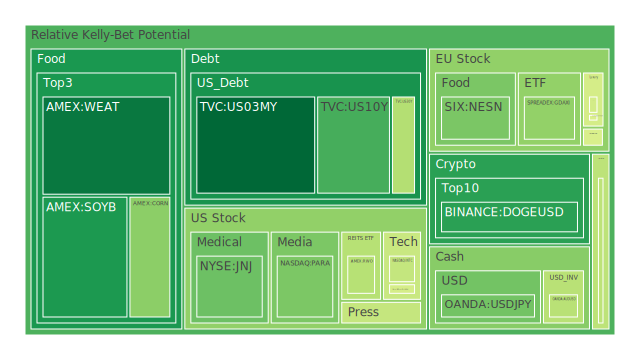

# 一、前言：Spatial、Temporal、Conceptional的三位一體背景概述

在探討市場與新聞的三位一體（Spatial、Temporal、Conceptional）之前，需要先理解此概念如何被應用於投資評估、風險判斷以及消息解讀：

1. **Spatial層面**強調地理、空間以及跨區域影響。例如，美國、歐洲與新興市場之間的資金流向、地緣政治動盪對原物料或防禦股的影響等，都可歸結於此。  
2. **Temporal層面**則側重時間序列與階段性發展，如聯準會（FED）在不同階段的利率政策影響；各國經濟循環高峰與谷底時，資產的熱度、投資人對風險的偏好，甚至是季節性產業（如農產品）的周期波動，都屬於此層面。  
3. **Conceptional層面**屬於觀念、心理、預期與信心面向。包括投資人對未來風險的預期、媒體新聞帶來的正面或負面情緒、群眾心裡的「恐慌」或「樂觀」程度等。博弈論也在此發揮作用：當市場出現重大訊息時，不同參與者彼此預測對方行為，最終引發集體行為模式。

同時，從經濟學、社會學、心理學與博弈論來看，以上三個層面彼此交織。舉例來說，某區域（Spatial）若爆發政治或經濟動亂，通常會引發資金轉移時間節奏的改變（Temporal），進而衝擊投資人對未來的預期（Conceptional）。在最近若干新聞中，我們也反覆看到以下的模式：官方或媒體曝露出負面事件（銀行財務問題、房地產逾期率上升、國際地緣風險增加），讓市場信心下降；接著投資人會想要尋求避風港，從而拋售風險資產，或轉向高槓桿的對沖操作；最後，市場情緒容易在短時間內急遽放大，形成泡沫或崩盤的可能風險。

以下各章節將結合Spatial、Temporal、Conceptional的「三位一體正反合」思維模式，以最簡潔但深入的文字描述近期市場概況，接著歸納出可能的投資機會與風險。

---

# 二、投資商品泡沫分析

以下按照指示，針對若干具代表性的投資商品，整合近幾日來（2025-02-15、2025-02-17、2025-02-18）所提供的泡沫風險數據（如D1, D7, D14, D30），同時綜合新聞事件、歷史類比與既有理論加以闡述。需要特別注意的是，泡沫風險指數若越高，表示該資產的過熱程度越高、潛在風險越大；而觀察它的D1（當日）、D7（7日平均）、D14（14日平均）、D30（月平均）之變化，能初步判斷資產在短中期內是否存在上漲動能或下跌隱憂。報告只引用資產名稱（例如US10Y），不特別標示其原始券商標示（如TVC:US10Y）。

## 1. 美國國債
美國國債的代表如US03MY（3個月國債）、US01Y（一年期）、US02Y（兩年期）、US05Y（五年期）、US10Y（十年期）、US30Y（30年期）等。  
- 近來，美國國債收益率從曲線短端到長端均有些許波動。2025-02-18所示，US10Y報酬率4.48附近，US30Y來到4.70。依據前述泡沫指數，US05Y與US10Y的D1僅在0.2～0.6左右，整體仍屬於偏向中度或中高程度的風險分數，但並未像部分股票或加密資產高達0.9以上。  
- 新聞面顯示，美國銀行業對未來的房貸與信用卡逾期更為謹慎，並且FED整體資產負債表收縮，銀行總存款規模雖高但趨於保守。這意味著短期或中期國債的需求在一定程度上可能持續，令收益率在某些時刻有壓力往上走，也顯示避險資金在動態流動。  
- 歷史上，美國國債在通膨趨勢尚未完全確立下行時，往往容易隨著FED態度而劇烈波動。眼下OIS FED Fund Rate從一年前的0.07一路走到2.33、5.33等不同數值，顯示政策仍存在調整空間。對於投資人而言，美國國債若作為穩定的資產配置，並非毫無風險；然而其泡沫風險仍較美國科技股或其他高槓桿標的低。

## 2. 美國零售股
以WMT、TGT、AMZN等為例：  
- 泡沫指標顯示，TGT在2025-02-18的泡沫風險約0.816以上，並且七日、十四日與三十日平均也偏高。WMT則約在0.91上下。AMZN則在0.91左右徘徊。  
- 近期新聞（例如「美國消費者健康惡化，越來越多房貸違約」、「企業利潤下修導致零售業展望偏弱」等）帶來負面情緒，儘管零售業平常被視為消費景氣的晴雨表，但在通膨與消費疲軟下，許多分析機構認為盈利壓力仍大。  
- 歷史上，零售股在美國節慶季後常有一波回調。現階段又疊加高利率環境，賣壓與獲利壓力相互交織，使得市場對零售股的前景頗多疑慮。

## 3. 美國科技股
科技股包括AAPL、MSFT、GOOG、META、NFLX、AMZN（亦屬零售與科技雙重性質）、AMD、NVDA、INTC等：  
- 觀察泡沫指數，AAPL在2025-02-18約0.985867，MSFT約0.666499，GOOG在0.917972，META高達0.972796，NFLX約0.957680，NVDA約0.643490，AMD約0.633275，INTC約0.454582。可見科技龍頭股普遍呈現風險分數偏高，部分接近0.95～0.98，顯示市場對未來預期可能過度樂觀、也可能帶有高泡沫性質。  
- 新聞面針對科技股也有正反消息。正面如「Meta連續20日收盤走高」、「中國科技股反彈帶動新興市場」；負面如「美元走強施壓企業盈利」、「美國對科技公司課徵關稅威脅」等。這些消息同時反映在Conceptional層面：投資人對AI、雲端等科技未來高度看好，但也憂心利率升高和潛在關稅政策衝擊。  
- 歷史經驗顯示，類似「網路泡沫」時期與「Nifty Fifty」時期曾出現極端泡沫化，因此必須謹慎留意此波科技熱潮是否又有泡沫跡象。

## 4. 美國房地產指數
可綜合美國房地產ETF（如RWO、VNQ、IYR）與新聞來進行探討：  
- RWO、VNQ與IYR在近期的D1皆在0.43～0.96之間浮動，VNQ 2025-02-18泡沫分數約0.90以上，IYR則約0.96，顯示房地產板塊泡沫風險相對偏高。  
- 新聞報導「更多美國房貸違約率上升，政府貸款族群壓力大」、「某些地區房地產下行趨勢加劇」皆為負面。對投資人而言，房地產雖曾是抗通膨的利器，但目前高利率與高通膨並存的環境下，讓持有房地產的槓桿成本走高，加上就業市場仍有不確定因素，形成對該產業的雙重打擊。  
- 歷史可參考2008年的次貸危機，當時房地產泡沫破裂造成系統性風險。雖然目前監管環境大不相同，但若逾期率、違約率進一步攀升，不可忽視房市再度出現系統性震盪的可能性。

## 5. 加密貨幣
加密貨幣以BTCUSD、ETHUSD、DOGEUSD等為代表：  
- BTCUSD目前價格高企接近97404（2025-02-15數據）或95916（2025-02-18數據），泡沫分數約0.52到0.68區間，但整體變動頗快；ETHUSD約0.48～0.68不等，DOGEUSD約0.25～0.28之間。  
- 新聞面對加密領域偏負面，如「某些政治人物推廣的幣種被質疑詐騙」、「加密市場部分專家認為投資人對於DeFi風險與黑客攻擊的恐慌上升」。另一方面，也有正面消息例如「部分國家嘗試制定更明確監管」，使加密貨幣有機會往主流化。  
- 歷史經驗顯示，比特幣、以太幣等常出現大幅波動，尤其在宏觀市場動盪時，其避險功能或許有所發揮，但也存在極端價格震盪與流動性風險。

## 6. 金／銀／銅
金價（XAUUSD）、銀價（XAGUSD）、銅價（COPPER）皆常被視為商品市場重要風向：  
- 2025-02-18，金價約2882～2899之間，泡沫指數在0.53～0.54區間，銀價XAGUSD則在0.87左右，銅價COPPER約0.44～0.50。可見近來銀的風險分數明顯較高，金和銅則相對穩健或中庸。  
- 新聞顯示：金銀比（或GOLD OIL RATIO、GOLD COPPER RATIO）都較去年顯著攀升，反映投資人對通膨、地緣政治的憂心，使貴金屬與基礎金屬價格有分歧。  
- 歷史曾有金價在動盪時期成為避險指標，也常見銀價波動幅度更大。銅常被視為全球景氣晴雨表，若新興市場或中國需求疲軟，它易受拖累。

## 7. 黃豆／小麥／玉米
以SOYB（黃豆）、WEAT（小麥）、CORN（玉米）為代表：  
- 近期泡沫分數顯示，SOYB大約0.23～0.47之間，WEAT約0.17～0.18至0.19，小麥整體風險偏低；玉米CORN約0.36～0.47。  
- 新聞如「國際局勢持續動盪，農產品生產國面臨氣候與地緣政治挑戰」，雖可能推升農產品價格，但同時通膨也壓抑消費端需求。  
- 歷史上，農產品期貨常有季節性或氣候突發事件帶動的價格飆漲。現階段市場對全球天候條件尚無重大憂慮，但需持續關注地緣衝突對出口航線的影響。

## 8. 石油／鈾期貨UX!
石油（USOIL）與鈾期貨（UX1!）同樣值得關注：  
- USOIL在2025-02-18報約71左右，泡沫分數約0.61上下，在2月中旬一度D7或D14超過0.47～0.54不等，屬中高風險。鈾期貨UX1!近期雖價格66～67，但泡沫指數在0.71～0.75之間也不算低。  
- 新聞提及「OPEC+可能延後增產計畫」、「各國能源戰略調整」，有時利多，有時不利。另有「德國表示停用核能但又面臨能源缺口」等一系列討論，對鈾需求的預期仍有爭議。  
- 歷史類比顯示，地緣政治衝突若惡化，石油價格常受衝擊；而核能在減碳趨勢下部分國家視為過渡能源，持續性需求或將不斷升溫，但在政策面與環保爭議中前景並非線性。

## 9. 各國外匯市場
如EURUSD、GBPUSD、USDJPY、AUDUSD等：  
- 2025-02-18顯示，GBPUSD泡沫指數高達0.995205，EURUSD約0.515313，USDJPY約0.337195，AUDUSD約0.435189左右。可見英鎊最近泡沫分數相當突出，或暗示市場對英國後續經濟前景抱持高度不確定。  
- 新聞指出「英國通膨率居高不下，BOE考慮維持較高利率」，同時也提到「英國房市疲弱」。若經濟面不振，英鎊易在投機資金操作下劇烈波動。  
- 歷史經驗看來，美元強勢時，歐元、英鎊、澳幣等往往承壓。近期儘管FED態度仍帶有鷹派訊息，但市場也觀望他國央行是否跟進。同時，若地緣政治不確定加深，避險貨幣如日圓也可能在心理層面受到支持。

## 10. 各國大盤指數
包括美國NDX（那斯達克100）、德國GDAXI、日本JPN225、中國000300（滬深300）等：  
- NDX泡沫指數在0.68～0.72區間，GDAXI約0.37～0.60之間，JPN225約0.90左右，000300約0.78。  
- 新聞面較多負面聲浪，如「企業盈餘成長放緩」、「地區政治動盪」，但也見「防禦概念股推升歐洲股市創新高」。顯示投資人正在區分市場板塊：軍工、防禦類尤其在地緣衝突背景下較受青睞；科技、金融等對利率敏感。  
- 歷史上，全球股市的同步性雖高，但區域表現偶有分歧。近期日本JPN225指數泡沫分數接近0.90，加上部分日企財報好壞參半，應謹慎評估是否存在過熱風險。

## 11. 美國半導體股
主要包括NVDA、AMD、KLAC、AMAT、INTC、TSM等：  
- NVDA、AMD、KLAC、AMAT泡沫指數大多超過0.60～0.95不等，TSM則一度衝到0.98以上，是近來最受追捧的板塊之一。  
- 新聞多次提及AI、電動車、雲計算需求帶動晶片需求，各大公司對未來展望雖樂觀，但也面臨「美元升值」、「貿易制裁可能再起」、「供應鏈分散化」等挑戰。  
- 歷史而言，半導體景氣通常具有週期性（約3～4年）。若本波熱度來自AI及高性能運算等長期需求，估值可望維持一定水平；但也要警惕過度炒作與現實庫存壓力之間的落差。

## 12. 美國銀行股
如JPM、BAC、C、COF、AXP等：  
- JPM泡沫指數約0.95～0.97，BAC達到0.995以上，C則約0.886～0.889。顯示市場對銀行股並非一面倒看好，甚至有過熱嫌疑。  
- 新聞層面「巴菲特大幅減持BofA」、「貸款逾期率攀升」，加上FED貨幣緊縮與經濟衰退隱憂，都會打擊銀行業獲利前景。  
- 歷史可見，當利率走高、經濟環境不佳，銀行常面臨壞帳風險攀升。資產負債表若未做好風險對沖，系統性風險可能擴散。

## 13. 美國軍工股
如LMT、RTX、NOC等：  
- 泡沫分數多在0.66～0.88之間，NOC約0.88上下。新聞則顯示地緣局勢緊張，如烏克蘭、亞太區域局勢未明，許多國家將增加國防支出。  
- 歷史經驗：若衝突長期化，軍工需求相對穩定甚至攀升。但需注意政治變數及預算週期，若地緣環境突變趨於和平，軍工產業將面臨回檔。

## 14. 美國電子支付股
如PYPL、V、MA、GPN等：  
- PYPL、V、MA泡沫分數皆在0.94～0.96上下，GPN則更高或逼近0.97。  
- 新聞談及「消費與跨境支付量減弱」、「利率影響消費者使用信用支付動能」，此類企業雖長期成長空間不小，但短期估值偏貴，市場容易對未來發展感到分歧。  
- 歷史經驗：支付板塊高度依賴經濟活絡度與消費者行為。一旦經濟轉弱或出現信用壞帳，交易量下滑或費用率上升，企業獲利空間將受影響。

## 15. 美國藥商股
如JNJ、MRK、LLY等：  
- JNJ泡沫指數在0.32～0.41之間，MRK在0.48～0.56之間，LLY則較高約0.93～0.94。  
- 新聞較少直接針對藥商，不過「醫療保險成本上升」、「通膨壓力導致醫療用品價格波動」等間接影響。長期來看，藥企的研發成果與專利保護是股價核心。  
- 歷史類比：醫藥類股常在經濟不景氣時兼具防禦性。若LLY估值偏高，可能是投資人預期其某些新藥或療法帶來超額收益，也要警惕研發失利或專利到期。

## 16. 美國影視股
可參考DIS、NFLX、PARA、FOX等：  
- DIS泡沫分數逼近0.96～0.97，NFLX約0.95，PARA約0.32～0.57，但近幾日略升。FOX約0.93～0.93左右。  
- 新聞面「串流戰爭競爭白熱化」、「傳統電視廣告預算縮減」、「串流平台與廣告收入模式變革」等因素，使得影視股估值面臨轉型風險。  
- 歷史來看，影視娛樂行業極度受消費者口味左右，也面臨科技巨頭跨界競爭。泡沫過高時，投資人宜謹慎留意內容營收能否支撐估值。

## 17. 美國媒體股
與影視股相近，如CMCSA、NYT等：  
- CMCSA泡沫分數約0.45～0.49，NYT則約0.70～0.71，二者都相較於大型科技或金融股泡沫分數稍微低一點，但仍有一定波動。  
- 新聞顯示「報業在數位轉型進程中，訂閱收入與廣告模式改變」、「競爭格局激烈」等。  
- 歷史曾見媒體股在經濟熱絡時獲得廣告收入激增，但若經濟趨緩，廣告主縮減預算，媒體股可能受創。

## 18. 石油防禦股
如OXY、XOM等：  
- XOM泡沫指數約0.82～0.83，OXY約0.75以上。因油價走勢一度震盪，加上企業獲利暫時良好，但市場擔心後續需求下滑或政策轉向。  
- 新聞提及「巴西Petrobras、沙烏地阿拉伯等國營石油企業戰略調整」，可能改變全球油市供需。  
- 歷史可見石油類股經常與國際原油價格同向，當地緣衝突與供給限制並存時，油價易飆高，石油股收益也跟著上漲；但也需警惕市場對綠能轉型的長期壓力。

## 19. 金礦防禦股
如RGLD等：  
- RGLD泡沫指數在0.90上下，短期金價若維持相對強勢，金礦股可受益。  
- 新聞層面顯示地緣緊張與通膨隱憂不減，金價相對偏強。RGLD也跟隨金價波動。  
- 歷史上，金礦股對金價彈性更大，上漲時往往比金價更猛，下跌時跌幅也加劇，因此風險管理顯得更重要。

## 20. 歐洲奢侈品股
如MC（LVMH）、KER（Kering）、RMS（Hermès）等：  
- MC約0.47～0.67之間，KER約0.49～0.54，RMS高達0.90上下，甚至在十四日平均中接近0.78～0.78以上。  
- 新聞提及「中國市場解封推動奢侈消費恢復」、「歐洲觀光潮帶動高單價商品銷售」。然而歐洲經濟本身仍存在能源、通膨壓力，後續應持觀望態度。  
- 歷史可見奢侈品股在全球經濟周期擴張時可享高估值，但若經濟趨緩或地緣衝擊，這些公司雖抗壓性高但也會受到投資人獲利了結。

## 21. 歐洲汽車股
如BMW、MBG、PAH3等：  
- BMW、MBG在0.50～0.61之間，PAH3約0.84上下。  
- 新聞面「德國汽車廠轉型電動化面臨歐盟政策壓力、供應鏈成本高漲」、「國際市場競爭加劇」。  
- 歷史而言，歐洲汽車龍頭多有強大品牌優勢，但過去排放門或電動化轉型不利時，股價常出現劇烈修正。

## 22. 歐美食品股
如KHC、NESN、KO等：  
- KHC（卡夫亨氏）約0.42～0.55區間、NESN（雀巢）約0.34～0.59之間、KO約0.71～0.72。此類企業多被視為防禦性資產，泡沫風險通常相對溫和。但若估值持續高企，也須提防獲利不及預期。  
- 新聞指出「食品原料通膨」、「消費者信心指數下降」，對食品股利潤產生壓力。  
- 歷史參照多次經濟衰退顯示，食品股抗跌性雖強，但若市場估值過度膨脹，也難逃回調命運。

---

# 三、宏觀經濟傳導路徑分析

從宏觀角度出發，美國聯準會（FED）對貨幣市場的調整是最大變數之一。新聞提到「FED資產負債表緊縮」、「RRP下降」、「政府TGA卻處於高位」、「OIS FED Fund Rate大幅波動」等，都在暗示貨幣市場的資金情況分化。以下以Spatial、Temporal、Conceptional三位一體綜合說明：

1. **Spatial面向**：  
   - 美國在全球金融體系中仍具核心地位，當FED趨向鷹派，國際資金便湧入美元，造成其他國家貨幣承壓。新聞亦提到「澳洲與歐元區也面臨利率壓力」，巴西、阿根廷等新興國家幣值易動盪。  
   - 歐洲在能源短缺、國防需求擴大的背景下，也產生對美元依賴度上升與通膨壓力加重的態勢。

2. **Temporal面向**：  
   - 短期內（幾周至幾個月），市場對聯準會持續升息或暫停升息的預期反覆，且OIS FED Fund Rate在4.33、5.33等數值間波動。這對金融市場的利率定價與債券收益率走勢具決定性影響。  
   - 中長期（半年至一年）若經濟數據顯示成長減速，FED可能放緩緊縮步調，令風險資產短暫回溫；但若通膨固執高企，利率保持高檔，則衰退風險升溫。

3. **Conceptional面向**：  
   - 通膨、利率、就業數據與地緣衝突等資訊會透過媒體與社交平台傳遞，投資者心理往往放大短期波動。近來「企業財報下修」、「銀行減持科技或金融股」的行為可能加深市場恐懼（或投機）。  
   - 消費者面臨房貸、信用卡貸款利率上升，引發負面情緒與消費收縮，形成自我實現的經濟放緩現象。

因此，宏觀層面的傳導路徑可概括為：FED緊縮→美元走強→全球資金循環改變→風險資產評價受壓→若通膨未退，利率易繼續升→企業獲利下滑→金融體系壞帳上升→市場恐慌情緒強化。

---

# 四、微觀經濟傳導路徑分析

在微觀層面，企業利潤與家庭資產負債表成為關鍵。當前新聞顯示：

1. **企業面**：  
   - 若負債比高（特別是成長股或小型企業），利率上升導致融資成本顯著攀升，獲利承壓或出現裁員、削減資本支出。  
   - 大型跨國公司如AMZN、META、GOOG等雖擁有雄厚資金，但受匯率、關稅、供應鏈中斷等影響，預估營收增速放緩。  
   - 金融機構在貸款利率提高的同時，也面臨壞帳風險；一旦消費者信用狀況惡化，銀行需提列更多損失準備。

2. **家庭面**：  
   - 消費者在房貸、車貸、信用卡利率上升的壓力下減少支出。新聞「更多美國房貸違約」「信貸卡壞帳率上升」都說明家庭金融壓力累積。  
   - 心理預期：若民眾感到經濟前景不明朗，就會降低可自由支配消費，削弱零售與旅遊、娛樂等非必需品支出，進一步影響微觀層面的企業營收。

最終，微觀的連鎖效應會再回到宏觀。公司業績欠佳→裁員→就業不振→消費再度縮減→GDP增速放慢→貨幣政策或財政政策因此調整。這些都是在Spatial、Temporal、Conceptional脈絡下相互糾纏。

---

# 五、資產類別間傳導路徑分析

各資產之間的漣漪效應傳導，往往透過下列機制：

1. **資本移轉**：當股市估值過高，投資人可能轉向債市或黃金，或是移往加密資產博取高報酬；反之亦然。近期高通膨與地緣風險上升時，黃金、軍工、農產品等常短期受捧。  
2. **槓桿去化**：如果銀行收縮信貸，槓桿資金逐步退出股市、房地產等領域，資產價格下壓。隨著新聞提到「銀行股風險積聚」、「壞帳攀升」，槓桿去化速度加快。  
3. **消息與心理面的迅速傳播**：社交媒體與新聞在數小時甚至更短時間內形成輿論，投資人根據預期迅速調整部位，一旦出現恐慌，拋售行為會牽動多個市場。

---

# 六、風險對沖的投資組合機會

根據上述泡沫分析，以及不同資產之間可能存在的負相關（接近-0.5）或彼此相位差約120度的特性，可以初步大膽假設若干對沖組合。下列僅為概念性描述，實際組合需再依投資者風險屬性與市場條件微調：

1. **組合A**：  
   - 同時持有部分黃金（XAUUSD）與美國短期國債（US03MY, US01Y）以及小部分高波動加密貨幣（BTCUSD或ETHUSD）。  
   - 理由：黃金與短債可以在經濟衰退、通膨或市場波動時提供一定避險；加密貨幣若受市場追捧則可以提供收益彈性，且在特定時間點與黃金、國債呈現相對低相關。

2. **組合B**：  
   - 持有防禦性股票（如部分食品股KO、NESN）與工業金屬（銅COPPER）及局部外匯避險頭寸（如USDJPY或AUDUSD的適度避險操作）。  
   - 理由：食品股波動相對小，銅在經濟復甦期時具潛在收益，若市場轉向防禦，日圓或澳幣頭寸可具空間；三者若在不同的時間窗口波動，具有一定對沖效果。

3. **組合C**：  
   - 結合美國房地產ETF空頭部位（VNQ或IYR適量放空）與石油多頭（USOIL）及歐洲奢侈品股（RMS、MC）少量布局。  
   - 理由：若利率持續高檔，美國房地產或許面臨回落風險；石油在地緣不穩中仍有上漲機會；奢侈品在中國與旅遊復甦帶動下尚可能維持增長。此三者短期波動間或能達到約-0.5左右相關。

上述僅舉例示範，投資人在操作時可試圖讓組合內部資產間相位分散，避免單一資產集體回落時造成重大損失。

---

# 七、對投資組合的篩選假設分析與多項資產漣漪效應傳導路徑

進一步對上述組合和資產進行「三位一體、兩兩驗證」的假設分析，可得出以下要點：

1. **美國國債 vs. 加密貨幣**：  
   - Spatial：美國國債主要受FED政策主導；加密貨幣分佈全球，無明確國境限制。二者在地理分佈上互補。  
   - Temporal：短期消息刺激加密貨幣劇烈波動，而國債則相對溫和。  
   - Conceptional：避險（國債）與投機（加密）心態互為對比。若市場情緒恐慌，國債需求上升；若資金尋求高報酬，加密貨幣或重新受追捧。

2. **房地產 vs. 軍工股**：  
   - Spatial：房地產受當地信貸與房屋供需影響；軍工則依國防預算與戰略布局，全球範圍皆有需求。  
   - Temporal：房地產走勢相對慢熱；軍工因地緣衝突消息而瞬息波動。  
   - Conceptional：衝突升溫時，軍工股受追捧；若經濟衰退導致房市下修，兩者走勢可能分歧，利於對沖。

3. **大盤指數 vs. 大宗商品（黃豆／小麥／玉米）**：  
   - Spatial：股票指數與農產品的背後供需差異明顯。  
   - Temporal：股市漲跌較能反映當下與短期預期；農產品可能有季節與氣候週期。  
   - Conceptional：投資人對糧食危機或通膨上行的恐慌，會推升農產品；股市若看衰經濟，下行風險高。兩者之間有機會負相關。

在此「正反合」的分析下，投資人可嘗試在每個組合中加入差異化資產，兼顧中短期獲利與長期避險，使最終配置更趨平衡。

---

# 八、投資建議

根據現階段環境，我們可將投資策略分成「穩健」、「成長」、「高風險」三大類，且三大類合計比重須為100%。每一類再細分三個子項目作配置範例。以下僅為示範性概念，比例可依個人風險承受度調整：

1. **穩健型（例如總持倉40%）**  
   - 子項目A：短期美國國債（US03MY或US01Y）20%  
   - 子項目B：投資級債券ETF或高信用評等公司債 10%  
   - 子項目C：大型防禦性股票（KO或NESN等食品類股）10%  
   - 理由：在經濟不確定下，穩健組合著重保本，國債與投資級債券為核心，搭配防禦股因應通膨。

2. **成長型（例如總持倉35%）**  
   - 子項目A：美國科技龍頭股（如MSFT或GOOG）15%  
   - 子項目B：軍工或醫藥（如LMT、JNJ）10%  
   - 子項目C：黃金ETF或金礦股（RGLD）10%  
   - 理由：科技龍頭具創新潛力，軍工或醫藥在地緣與健康議題升溫時有支撐，加上金礦股作風險對沖，同時兼顧成長與防禦。

3. **高風險型（例如總持倉25%）**  
   - 子項目A：選擇加密貨幣龍頭（BTCUSD、ETHUSD）10%  
   - 子項目B：半導體高增長股（NVDA、AMD）10%  
   - 子項目C：新興市場高波動ETF或槓桿基金 5%  
   - 理由：高風險高報酬，若市場情緒一旦回溫或資金面轉鬆，該組合可博取超額回報。但需警惕加密與半導體可能同向崩跌。

以上比重和項目僅供參考，合計100%。投資人應根據自身財務狀況、風險偏好及對未來市場的看法動態調整。不可忽視可能的泡沫風險，尤其在加密、科技股、軍工或高槓桿標的中，若消息面一夕反轉，極易引爆大幅回調。

---

# 九、風險提示

1. **泡沫風險高警訊**  
   - 本文多次提到科技股與部分防禦股（軍工、電子支付）估值偏高。新聞亦透露市場對全球經濟成長放緩的擔憂，若企業財報不及預期，股價恐大跌。  
   - 加密貨幣一直存在波動劇烈與監管風險，一旦消息翻轉或遭遇大型交易所流動性問題，跌幅可能重創。

2. **地緣政治變數**  
   - 新聞多次顯示烏克蘭戰爭、亞太局勢與中東衝突升溫。若情勢惡化，石油或軍工股雖可能受益，但整體股市、貨幣市場將面臨極高波動。  
   - 歐洲政治環境（如德國選舉、法國罷工、英國脫歐後續）也可能引發歐元、英鎊劇烈震盪。

3. **高利率與信用風險**  
   - FED縮表與高利率政策尚未完全明確轉向。銀行股或信用卡公司壞帳攀升，金融體系若爆發新一輪風暴，將牽動股債商品全局。  
   - 企業債違約率可能因升息趨勢而上行，新興市場亦有外債違約風險，不可輕忽。

4. **投資者自身狀況**  
   - 投資前須先評估自身風險承受能力、資金流動需求、投資期限。  
   - 不同年齡層、財務規模、就業狀況都有不同策略，切勿盲目追高或過度集中單一標的。

5. **市場不確定性**  
   - 過去兩年來的歷史顯示市場常超乎預期地快速轉彎，高波動性或將持續。  
   - 任何看似穩定的資產，可能因流動性不足或流向改變而瞬間大跌。

---

# 十、結論

綜觀以上，當前全球市場處於多重不確定交織之下：地緣政治持續動盪、宏觀經濟尚未脫離通膨與緊縮的陰霾、企業盈餘與消費力道轉弱、加密領域監管風險猶存。泡沫指數顯示許多高估值資產風險累積，投資人須警惕可能的下修。若採取三位一體的觀點去理解市場，便能從空間（區域資金流動）、時間（貨幣政策與經濟周期）與觀念（市場預期與投機心理）面，進一步拆解風險與機會。

在歸納所有資訊之後，投資組合的核心是分散：在不同區塊與資產間找尋相關係數相對低甚至負相關的標的，以分散大環境劇烈波動帶來的衝擊。同時，對於高泡沫資產要謹慎布局，嚴守風險限額。新聞事件和歷史場景都告訴我們，一旦經濟進入衰退或信用違約爆發，高估值標的的修正動能將尤其猛烈。

最後提醒，投資是長期且伴隨風險的行為。本文所提供的建議僅供參考，切勿將之視為投資指令。各類金融產品之間的傳導效應與漣漪，往往在訊息瞬息萬變與投資人情緒驟變時產生極端行情。投資者需深入了解自身風險承擔能力與預期報酬，再審慎調配資金。

---

# 風險提示

投資有風險，市場總是充滿不確定性。我們的建議僅供參考，投資者應根據自身的風險承受能力和投資目標，做出獨立的投資決策。

 
Daily Buy Map:

 
Daily Sell Map:

 
Daily Radar Chart:

 
