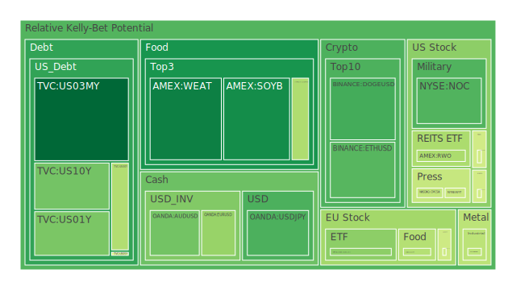
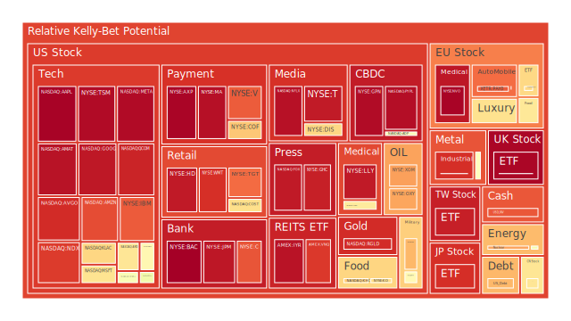
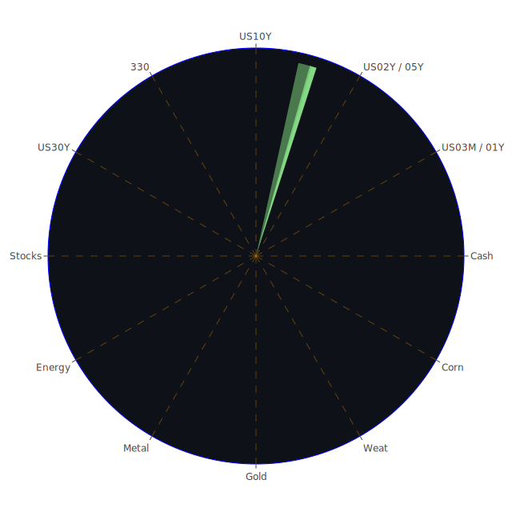

# （一）投資商品泡沫分析

下列針對各主要投資商品類別，整合了近期新聞訊息、歷史參考案例與現有理論，綜合經濟學、社會學、心理學與博弈論進行討論。由於每一資產在不同空間範疇（例如國際、區域市場）、不同行情時間序列與不同概念思維下，可能展現出截然不同的漣漪效應，本段將嘗試運用「三位一體」的正反合思維展開。

---

## 1. 美國國債

美國國債近期在收益率曲線上呈現出長短端相對緊張的跡象。根據所提供之資料，10年期國債（US10Y）在2月19日的即時參考值為4.55%左右，而30年期國債（US30Y）更是在4.77左右，這顯示長端收益率仍在緩步攀升，同時1年期或3個月期國債收益率亦維持在4.24-4.32上下波動，雖然相比於過去一年那些曾高達5%以上的極端短端收益率略有回落，但基於OIS FED Fund Rate從上週5.33下降到最新的4.33顯示出聯準會預期路徑的波動仍大，市場尚在博弈升降息節奏。

從新聞面觀之，有關「美國若大規模解雇聯邦公務員」的討論（如2月19日新聞稱「How Mass Layoffs Of Federal Employees Could Affect The Economy」），可能提升對政府財政前景的不確定性。財政若持續不穩，長端殖利率將面臨向上壓力。再者，最近有提到「Trump Floats More Tariffs」等消息，也可能引發市場對於整體經濟走向的焦慮，進而推升美國國債的避險需求。

**歷史相似場景：**  
- 2018年中期曾出現因中美貿易關係不穩，而導致長端債券需求初期上升、之後殖利率波動擴大的情況。  
- 2023年上半年聯準會升息循環進入末期時，亦使得國債短端利率狂飆。  

**風險警示：**  
- 目前D1、D7、D14、D30的泡沫分數相較股票或高收益債類資產普遍偏低，但依舊不能忽視長短端利差扭曲所造成的潛在流動性風險。  
- 若未來地緣政治衝擊或財政問題加劇，長端利率可能進一步上揚，債券價格面臨下跌風險；另一方面，若經濟衰退風險抬頭，長債也可能成為資金避險處。  

整體而言，美國國債依舊是全球資金避險的主要選擇之一，但在目前走勢下，投資人需留意殖利率升高所帶來的價格波動，並定期關注財政政策與貨幣政策之相互影響。

---

## 2. 美國零售股

零售板塊短期受到消費信心與利率前景的左右，尤其是大型零售商（如WMT, TGT等）在2月19日的即時泡沫分數顯示，WMT風險指標約在D1 = 0.912174，TGT則約在0.829971，雖然看似泡沫分數偏高，但亦須留意其相對估值與消費市場週期。

**新聞面訊息：**  
- 此前提到的新聞「Rising dollar pressures earnings as companies from Amazon to McDonald's signal more pain ahead」顯示部分多國營運的大型零售品牌恐因美元升值而產生獲利壓力。  
- 同時也有「Home delistings soar 64%...buyers turn down sellers」之類的負面居住消費需求消息，亦可能在房地產傳導至一般消費信心的路徑中，對零售股形成潛在壓力。  

**歷史相似場景：**  
- 2008年金融危機時期，在消費箝制與全球資金流動不順之下，部分零售股出現了長期估值受壓情況。  
- 2020年疫情初期的恐慌，曾令零售銷售一度大幅下滑，之後隨著政府補貼與居家消費模式崛起，又帶動股價陡峭反彈。這提示零售股對政策與社會心理衝擊相當敏感。  

**風險警示：**  
- 若利率進一步升高，消費貸款與信用卡循環利率的成本將推高，對零售支出帶來下行風險。  
- 美國內部政策（例如關稅、補貼、就業市場狀態）都可能改變消費者預期，從而擴大零售股震盪。  

在三位一體的空間分析下，國際美元強勢對跨國零售商造成營收壓力；時間面來看，若短期內就業與通脹壓力並未改善，零售股面臨業績衰退；概念上則要思考「消費傾向」在心理學與社會行為學中的動態演變：一旦消費者恐慌升溫，即便未來半年有再多政策刺激，也可能難以即刻扭轉。

---

## 3. 美國科技股

美國科技股在泡沫風險資料中普遍分數偏高。尤其像AAPL在2月19日D1約0.989941，MSFT約0.648460，GOOG約0.953086，META約0.974869，AMZN約0.871648，NVDA約0.560982，這些標的都有明顯的高估值與投資人對AI、大數據、雲端等領域高速發展的期待。

**新聞面訊息：**  
- （2月19日）「Meta's stock closes down, snapping 20-session winning streak」顯示部分科技龍頭開始出現漲幅放緩或修正跡象，也可能暗示投資人對於科技前景保持戒心。  
- 「Intel stock posts biggest five-day gain in history amid report of potential breakup」則提供另一面：投資人對於科技企業的重組或分拆，抱持一定的想像空間與短期利多反應。  

**歷史相似場景：**  
- 網路泡沫（2000年）時，市場對科技創新的過度期待與理想化估值，最後因基本面追不上而崩解。  
- 近年（2021-2022）對元宇宙概念的狂熱，也曾一度推升相關個股高估，後來因宏觀環境轉向緊縮，股價出現顯著修正。  

**風險警示：**  
- 高泡沫分數意味著市場對這些龍頭科技股的預期已經極度樂觀，一旦利率攀升，資金面收緊，或企業獲利不及預期時，股價下修幅度恐不容小覷。  
- 科技產業高估值常倚賴預期的創新，但若創新週期拉長，投資人情緒易轉為悲觀；心理學上「希望幻滅曲線」所帶來的集體拋售風險不容忽視。  

短期而言，科技股仍然擁有高流動性與市場追捧；然中長期則需時刻關注營收成長能否支持其高估值，並應留意地緣政治、監管風險（數據隱私、AI法規）等不確定性。

---

## 4. 美國房地產指數

根據所提供資料，房地產相關ETF或指數，如VNQ的泡沫分數曾在2月18日前後維持在0.90上下，最新仍接近0.900152，可見市場預期中，房地產板塊風險較高。新聞中提到「Home delistings soar 64%... buyers turn down sellers」以及固定房貸30年利率升至6.87%，都暗示潛在買家購房壓力加大。

**歷史相似場景：**  
- 2008年金融海嘯源於房地產與次貸市場泡沫破裂，當時許多房地產ETF大幅下跌。  
- 2020年疫情期間，超低利率與居家需求推動某些地區房價快速上漲，令房地產指數短期內漲幅劇烈。但現在利率環境已大幅反轉。  

**風險警示：**  
- 若利率維持高檔，買家貸款成成本增加，潛在需求減少，房市價格易受壓。  
- 消費者信用風險在房地產傳導路徑中扮演關鍵角色，一旦消費者開始違約或貸款展延困難，房地產相關指數將面臨巨大修正壓力。  

在心理層面上，居住需求常是剛性消費，但投資型需求一旦對未來前景轉向悲觀，便可能加速拋售。社會學角度顯示，一旦房市出現較大調整，亦可能引發其他產業連鎖反應。此時應密切關注TGA（美國財政部一般賬戶）、BTFP（銀行定期融資計劃）等聯準會或財政工具對房市流動性之影響。

---

## 5. 加密貨幣

加密貨幣板塊波動性與泡沫風險常居高不下。資料顯示BTC、ETH、DOGE等在近期的泡沫分數仍然有一定程度，例如DOGEUSD在2月19日的D1約0.284975，BTCUSD約0.499340，ETHUSD約0.306734，而它們的歷史泡沫指標（D7、D14、D30）也顯示時常處於高度波動的狀態。

**新聞與市場觀察：**  
- 「Milei Stumbles Into Crypto Memecoin Scandal Before US Trip」、「Argentine lawyers charge President Milei with fraud over cryptocurrency promotion」等新聞表明在阿根廷或其他地區，政治人物與加密貨幣的關聯度可能引發社會輿論、法律風險與投資不確定性。  
- 另有「Saylor’s Strategy to Raise Another $2 Billion for Bitcoin」之類的正面消息，代表市場上仍有頗為積極的機構或知名人士看好加密資產的長線價值。  

**歷史相似場景：**  
- 2017年比特幣狂飆之後的2018年熊市，在狂熱情緒退卻後，價格腰斬甚至更深的跌幅；2021年底至2022年之間亦出現大規模洗牌。  
- 加密貨幣受到宏觀情緒與流動性影響非常顯著，只要金融市場資金面一轉向，價格波動便呈倍數放大。  

**風險警示：**  
- 高泡沫風險在於缺乏實體支撐與大面積監管變動，任何監管動作都可能引起市場恐慌或大漲。  
- 心理層面上，加密市場的追高與恐慌情緒極易傳染，在社群媒體的發酵下，恐形成「博弈狂熱—絕望性拋售」的交替循環。  

投資加密貨幣應謹慎評估風險承受度，且留意短線漲跌可能遠大於傳統市場。若要進行多元化配置，應將加密貨幣部位控制於可承受損失的範圍內。

---

## 6. 金／銀／銅

貴金屬與工業金屬在本次資料中，金價（XAUUSD）D1大約0.576901，銀價（XAGUSD）D1約0.914034，銅價（COPPER）D1在0.443465。就新聞或市場情緒面看，貴金屬具備避險屬性，但隨著利率保持高位，其上漲空間常受壓抑。

**新聞面：**  
- 「Analysts Predict Gold to Reach $3,200 Later This Year」代表市場上仍有看多黃金的聲音，尤其地緣政治或通脹風險常是推升金價的一股力量。  
- 「Has China’s Oil Demand Peaked?」等對大宗商品需求的疑慮亦牽動了銅、銀等工業金屬價格走向。

**歷史相似場景：**  
- 2009年金融危機後，量化寬鬆大規模釋放資金，推升金價在2011年左右達到當時高點。  
- 2022年初，俄烏局勢升溫曾帶動金價快速衝高，但之後受聯準會激進升息導致的美元強勢壓抑，金價於2022年下半年回落。  

**風險警示：**  
- 金銀等貴金屬在心理學與社會層面上，長期被視為「保值資產」，但短期價格依舊易受市場資金面与實物需求波動影響。  
- 工業金屬（如銅）更受實際經濟活動景氣影響，若全球需求疲弱，銅價承壓。  

投資人應謹慎判斷全球經濟復甦節奏，並持續追蹤利率走勢。若地緣衝突或金融系統不穩等事件再起，金屬仍具備一定避險性質。

---

## 7. 黃豆／小麥／玉米

農產品期貨（例如黃豆SOYB、小麥WEAT、玉米CORN）同樣受到國際局勢、氣候、運輸成本與地緣政治等多重因素影響。從本次資料看，黃豆SOYB的泡沫分數D1約0.219459，小麥WEAT約0.197008，玉米CORN約0.421709，雖然整體分數不算特別高，但仍可能受天氣異常或出口政策衝擊而劇烈波動。

**新聞參考：**  
- 近期世界各地仍有供應鏈混亂的新聞，也有一些地區性的氣候問題，如巴西、阿根廷等地的乾旱或豪雨都會影響豆類與穀物產量。  
- 烏克蘭與俄羅斯的局勢，牽涉到黑海港口糧食出口暢通與否，亦可能重新帶動全球農產品價格。  

**歷史相似場景：**  
- 2010-2011年期間，俄羅斯小麥產量急劇減少，曾推升全球小麥價格快速上漲，引發多國食品通脹。  
- 2022年初，烏俄衝突也曾造成國際穀物價格不尋常飆升，之後在談判停火與航運走廊部分恢復後才略有回調。  

**風險警示：**  
- 農產品屬於供需彈性較低的品種，極易受到地緣政治與天氣因素衝擊。  
- 博弈論層面上，各國可能透過糧食出口禁令、關稅或補貼手段干預市場，引發價格急劇變動。  

整體來看，黃豆、小麥與玉米價格今年度或隨著經濟活動、各國儲備策略以及天氣狀況呈現區間震盪。投資人若介入此類商品，建議密切追蹤各國農業政策、天氣報告以及貨幣匯率波動。

---

## 8. 石油／鈾期貨UX!

石油（USOIL）在2月19日前後的泡沫分數顯示短線波動大，近日價格來到71美元上下；鈾期貨（UX1!）的泡沫分數較高，在資料中呈現0.755374等數值。

**新聞面：**  
- 「OPEC+ and Russian Supply in Focus」、「Oil Steadies After Gain With OPEC+ Considering Delay of April Output Hikes」等訊息指向石油供給端政策牽動價格。  
- 鈾期貨方面，核能議題、地緣政治對能源自給率的需求上升，使鈾期貨成為部分對衝資產。  

**歷史相似場景：**  
- 2022年俄烏衝突使得歐洲能源供應量偏緊，天然氣與石油價格一度大漲；之後OPEC+減產策略也左右價格波動。  
- 核能在某些時段曾被視為潔淨能源替代方案，導致鈾的需求端推波，但也常面臨政策與環保輿論壓力。  

**風險警示：**  
- 高通脹、利率與經濟成長的交錯影響下，石油需求與價格呈現顯著不穩定特性。若全球需求趨緩，油價或大幅下修。  
- 鈾期貨投資門檻高且交易不如石油流動，價格波動亦可能更為劇烈，需關注各國對核能發電態度。  

在博弈論層面，各大產油國調整產量都可能是「策略互動」的結果，一旦某一方違反協議或衝突升溫，油價將再度大幅波動。

---

## 9. 各國外匯市場

匯率市場與利率、國家經濟表現高度相關。從資料看，AUDUSD、EURUSD、GBPUSD、USDJPY等主要貨幣對的泡沫風險分數都有所呈現，如GBPUSD約0.856866、EURUSD約0.387944、USDJPY約0.294322等。日本央行政策若發生變化，可能使得USDJPY出現劇烈波動。

**新聞面：**  
- 多則新聞指出「Rising dollar pressures earnings...」代表美元兌其他貨幣的強勢正影響全球企業利潤。  
- 部分市場擔憂澳洲房市與消費力下滑，使澳幣可能走弱；而英鎊方面，仍要看英國脫歐後遺症與通脹持續度。  

**歷史相似場景：**  
- 美元指數在2014-2015年的大漲曾壓制新興市場資本流入，引發局部金融市場震盪。  
- 2022年中期，美元亦因聯準會升息而快速升值，衝擊歐日等國家貨幣，這種情況如今有所回落但仍具不確定性。  

**風險警示：**  
- 若美國再次祭出貿易保護或關稅措施，非美貨幣恐承壓；或是若地緣政治轉趨和緩，風險資產吸引力回升，美元也可能出現修正。  
- 短線匯市常因政治言論、央行決策、避險需求而出現急漲急跌。  

建議投資人密切關注各國央行動向及主要經濟指標（通脹、就業、GDP），並適度評估幣別配置比例。

---

## 10. 各國大盤指數

全球大盤指數如JPN225、FTSE、GDAXI、000300（滬深300）等，根據資料顯示，FTSE在2月19日泡沫風險D1達到0.984338，GDAXI約0.374069（但先前在其他日期也有高達0.608049的紀錄），滬深300約0.642895。這代表不同地區市場的估值情況差異仍大。

**新聞面：**  
- 歐洲市場面臨經濟增長困難，部分新聞警示「Europe is already sabotaging its own economy far more than US tariffs could…」，亦有「German election candidates clash over economy…」等政治干擾。  
- 中國市場方面，有提及「China signals softening stance on private sector as economy flounders」等，政策動向若朝支持民企，或刺激中國大盤指數；若疫情餘波與房地產壓力再起，則恐又帶來不確定。  

**歷史相似場景：**  
- 歐洲指數在歐債危機時期（2011-2012）大幅震盪；之後在央行寬鬆中緩步復甦。  
- 中國A股長期有政策市的色彩，每逢政府釋放刺激信號，股市常迎來大幅反彈，但也常陷入快漲快跌的循環。  

**風險警示：**  
- 區域經濟結構問題（如高通脹、能源依賴、人口老化）可能阻礙長期增長。  
- 心理上「熱錢」對新興市場或歐洲市場的態度易隨消息面極速轉向，一旦出現避險需求，資金可能快速撤出。  

投資全球大盤指數需充分考量各區域特定風險與評價水準，建議結合地緣政治、貨幣政策與產業結構進行綜合判斷。

---

## 11. 美國半導體股

美國半導體產業，包括INTC、AMD、NVDA、KLAC、AMAT等，其泡沫風險普遍較高。其中NVDA在D1約0.560982、AMD約0.641499、KLAC約0.674538、AMAT約0.962032，顯示市場對於先進製程、AI晶片需求仍抱有高度期待。新聞「Intel stock posts biggest five-day gain…」也再度激發市場對分拆、重組等題材的熱度。

**歷史相似場景：**  
- 2019-2021年，受5G、資料中心、雲端計算與遊戲需求等推升，半導體股價大漲。2022年在通脹與升息壓力下雖回檔，但之後又因AI題材重燃而反彈。  
- 半導體股易受上游原物料（矽、特殊氣體）和下游需求（終端消費電子與企業伺服器）周期波動影響。  

**風險警示：**  
- 對未來高需求的預期若不達標，如終端電子消費疲弱、企業資本支出放緩等，半導體股容易在高位回落。  
- 地緣政治（美中科技角力、制裁）也可能干擾供應鏈與市場份額。  

建議注意博弈論中各大半導體供應鏈廠商的合作與競爭策略，從空間上關注跨國佈局，從時間上關注技術演進週期，從概念上則思考產業整體需求的可持續性。

---

## 12. 美國銀行股

美國銀行股（如JPM, BAC, C, COF等），根據2月19日的泡沫分數顯示相當高，BAC約0.994765，C約0.860436，JPM約0.954385，COF約0.701401。這暗示銀行類股在目前環境下，市場預期有較高風險。

**新聞面：**  
- 「Warren Buffett’s Berkshire Hathaway slashed its Bank of America stake and dumped bank stocks last quarter」顯示知名投資人對銀行股抱持保留態度。  
- 「Trump Tightens Grip on Bank, M&A Regulators in Latest Order」顯示金融監管政策可能發生新的變化。  

**歷史相似場景：**  
- 2008年金融危機令銀行股遭受重創，之後透過政府紓困與金融改革才恢復元氣。  
- 2023-2024年銀行業面臨逆風：利率上升使放款利差一度擴大，但若經濟衰退帶動壞帳攀升，整體利潤恐轉向惡化。  

**風險警示：**  
- 消費信貸、商業不動產違約率若上升，銀行資產品質將惡化。  
- 高泡沫分數暗示對其財務穩健度已有較大的樂觀定價，若往後出現任何不利消息，引發銀行股大幅波動。  

投資銀行股需同時關注利率周期、信貸市場與監管政策。不少新聞提及銀行策略性收購或併購受監管阻力，也會影響其成長前景。

---

## 13. 美國軍工股

軍工股（如LMT, NOC, RTX等）通常受地緣衝突與國防支出預算影響，近期NOC的D1約0.299463，RTX約0.591583，LMT約0.726045。相對於部分科技股動輒0.9以上的泡沫分數，軍工股的分數雖不算太高，但依舊偏向中高位。

**新聞面：**  
- 「Defense Rally Pushes European Stocks to New Record」顯示歐洲軍工概念股亦有明顯上揚，暗示全球對國防開支的重視度上升。  
- 烏俄戰事持續使得全球軍事預算不斷走高，各國政府採購訂單延燒至2025年之後。  

**歷史相似場景：**  
- 每逢國際衝突加劇（如海灣戰爭、伊拉克戰爭、烏俄衝突等），軍工股普遍獲市場追捧，但若衝突降溫，該板塊也會出現獲利了結。  

**風險警示：**  
- 軍工股對地緣政治的依存度高，一旦國際局勢迅速轉向和平或大規模砍軍費，該板塊可能面臨估值回檔。  
- 產品研發週期長，加之國防承包競爭激烈，若公司無法持續獲得大型政府合約，營收也難以維持高水準。  

此板塊在心理層面往往吸引「防禦型投資」資金流入，但投資人仍須留意軍費走向與國際安全形勢變化。

---

## 14. 美國電子支付股

包括PYPL、V、MA、GPN等。根據2月19日數據，PYPL的D1約0.969595，V約0.850663，MA約0.966548，GPN約0.974531，顯示電子支付板塊具備相當高的市場熱度與估值水準。

**新聞面：**  
- 數位支付的滲透率持續上升，但也面臨政策監管、跨境交易成本與科技對手（如區塊鏈支付）挑戰。  
- 有些公司因「JPMorgan removes nearly all DEI references…」等企業文化與政府政策變動，會在短期內產生形象與合規層面的影響，但未必直接衝擊支付業務本身。  

**歷史相似場景：**  
- 2010年前後，全球信用卡與第三方支付滲透率大幅提高，電子支付股呈現長牛走勢。  
- 2021-2022年疫情期間，線上消費爆發，進一步推高此類股價，但之後在整體市場修正中亦曾下挫。  

**風險警示：**  
- 高估值往往建立在「交易量持續成長」的預期上，一旦宏觀環境下行或競爭加劇，交易量增速放緩可能導致估值壓縮。  
- 若利率持續高企，企業融資成本提高，部分原本以擴張市場為主的支付公司恐面臨資金困境。  

在博弈論角度下，支付巨頭間的市場佔有率競爭激烈，同時還需提防新技術替代。建議投資人應著重公司核心技術競爭力與客戶基礎的黏著度。

---

## 15. 美國藥商股

包括JNJ、MRK等大型藥廠。JNJ根據近期資料，D1約0.629886；MRK約0.538389。相對科技、支付等板塊，泡沫風險似乎稍低，但也不能忽視市場情緒的反覆。

**新聞面：**  
- 有些藥商面臨專利到期與價格監管壓力，同時也在疫苗與新藥物研發方面追求突破。  
- 「Mondelez CEO says Kennedy agenda product re-formulations…」等雖是食品業，但美國整體對健康領域政策關注度提升，也間接影響藥廠趨勢。  

**歷史相似場景：**  
- 2009年金融危機後，藥廠因穩定現金流與高研發壁壘，被視為防禦性資產，但2014-2015年開始的生技熱潮亦曾使部分藥企估值飆漲。  

**風險警示：**  
- 若保險制度或公共衛生預算有重大變革，大型藥企的商業模式可能被衝擊。  
- 法律訴訟風險也需留意，尤其是藥物副作用、專利爭議等。  

整體而言，藥商股具有一定的防禦性，但成長彈性可能不及科技類股。投資人可在資產配置中視之為穩定成分，但仍需審慎評估其未來研發管線與併購計畫。

---

## 16. 美國影視股

影視娛樂產業，如DIS、NFLX、PARA、FOX等，普遍受到串流市場競爭與版權內容成本影響。NBA等體育內容版權亦左右部分業者的訂閱率、廣告收入等。DIS的D1約0.672497，NFLX約0.965198，PARA約0.479668，FOX約0.949446。

**新聞面：**  
- 「Paramount, YouTube TV strike deal, averting CBS outage」顯示該產業長期在版權與分發平台協商上可能時有衝突，成功達成協議則有利短期穩定度。  
- 「Meta's stock closes down…」等大科技公司可能透過自有串流或社交平台分食影視市場，也會影響傳統影視公司的競爭力。  

**歷史相似場景：**  
- 影視股在2020年疫情期間，因居家需求而獲得巨量訂閱成長，2021年後競爭白熱化，市場開始出現分化，部分公司訂閱持續成長，部分則停滯或衰退。  

**風險警示：**  
- 內容製作成本高企，一旦無法吸引足夠訂閱用戶或廣告收益，EPS和現金流將面臨壓力。  
- 產業內競爭與合併也常見，投資人須留意併購案能否獲監管單位批准，以及是否真能產生協同效應。  

在心理與社會層面，影視產業對用戶偏好轉變（短影音興起、電影院回溫或網路串流延燒）非常敏感，需靈活因應。

---

## 17. 美國媒體股

媒體類股與影視產業有相當重疊之處，但也包括報紙（NYT）、有線新聞、廣播電台等。NYT數據顯示D1約0.464575，CMCSA約0.455951，FOX已歸類在影視範疇，同時也算媒體公司。媒體業收入結構多元，廣告市場景氣左右該板塊表現。

**新聞面：**  
- 線上廣告市場增長放緩，元件和技術成本上升也衝擊媒體營運。  
- 傳統媒體面臨數位轉型挑戰，各家競爭在於訂閱制、內容付費與線上數據分析。  

**歷史相似場景：**  
- 報業曾在2000年後，逐漸因網路衝擊陷入長期衰退，之後透過數位訂閱服務嘗試轉型。  
- 大型整合案（例如電信與媒體跨界收購）或許帶來短期利多，但若整合不佳恐造成財務壓力。  

**風險警示：**  
- 新聞中出現關於法規（如網路安全、言論政策）與平台演算法的變動，都可能衝擊媒體股營收模式。  
- 心理與社會層面，受眾對付費意願提升的程度仍具不確定性，若經濟環境惡化，訂閱量可能下降。  

中長期而言，媒體股具備轉型與協同的空間，但整體泡沫風險不算在最高梯度，需關注廣告市場與合併交易動向。

---

## 18. 石油防禦股

石油防禦股常指石油業中相對穩定、集中於上下游整合且具防禦性質的企業。像XOM、OXY等在本次資料中D1分別約0.760396與0.753108，也顯示市場對其定價相對高估值。

**新聞面：**  
- 「Chevron staffers absorb long-awaited layoffs as CEO pledges accountability」提及石油巨頭人事調整，可能抑制短期成本，但長期仍要看油價走勢。  
- OPEC+是否延後增產計畫，以及俄羅斯供給政策，都會牽動石油防禦股營運表現。  

**歷史相似場景：**  
- 石油防禦股在油價高點（如2014年）時大幅擴張，但油價崩跌（2015-2016）又造成公司獲利衰退。  
- 2022年地緣衝突與供給危機讓石油類股獲得巨大超額收益，後期油價回落才開始出現震盪。  

**風險警示：**  
- 若再度面臨全球經濟衰退，石油需求下降，價格回落，相關企業獲利承壓。  
- ESG風潮對石油企業長期發展的監督力度提高，亦帶來額外環境合規成本。  

在博弈論上，石油企業有時透過併購或減產保持價格穩定，但若單一主要生產國打破協議，油價可能瞬間崩跌。投資人宜分散風險。

---

## 19. 金礦防禦股

金礦公司通常在金價上漲時更能釋放盈利槓桿。RGLD等公司D1約0.919255，顯示估值處於相對高風險區間，一旦金價無法持續走升，股價易有回調風險。

**歷史參考：**  
- 金礦股在2009-2011年黃金牛市期間爆發，但2012-2015年金價回跌，它們遭遇嚴重虧損。  
- 金礦生產成本受到能源價格、區域政治（礦區所在國政策）等影響。  

**風險警示：**  
- 對金礦股的投資往往倚賴「金價持續走強」的前提，一旦利率維持高檔，金價上行空間被壓抑，金礦股估值會更快受到衝擊。  
- 地緣政治使部分礦區不穩定，突發安全事故亦是常見風險。  

雖然金礦股被視為某種防禦性標的，但投資人應意識到其對金價波動的高敏感性，與礦產開發本身的複雜成本結構。

---

## 20. 歐洲奢侈品股

如KER、MC、RMS等。KER在先前幾天資料裡D1約0.473474-0.490814之間，MC在0.615774，RMS在0.676270，有些時候甚至高達0.7-0.78。由於奢侈品需求與全球經濟富裕階層消費信心高度正相關，且在中國市場解封後需求可能回溫，但歐洲本身經濟仍具挑戰。

**新聞面：**  
- 部分新聞討論「Has China’s Oil Demand Peaked?」暗示中國整體需求結構或轉變，但高端消費潛力仍被部分人看好。  
- 若歐元区經濟持續受通膨與地緣政治擾動，奢侈品股短期震盪或加劇。  

**歷史相似場景：**  
- 2015年中國政府打擊貪腐，高端消費萎縮，曾令歐洲奢侈品股出現一輪修正。  
- 2021年底疫情反覆，奢侈品消費在歐美需求帶動下仍維持一定熱度。  

**風險警示：**  
- 奢侈品定位高度依賴品牌價值與消費者信心，若全球股票市場或房地產行情轉弱，富裕客戶的可支配資金可能縮減。  
- 匯率與旅遊限制也會影響奢侈品在全球的銷售與獲利。  

若投資人看好中國與新興市場富裕階層的需求回溫，可配置部分奢侈品股，但需承擔歐洲區域風險與品牌競爭壓力。

---

## 21. 歐洲汽車股

以BMW、MBG等為代表。BMW的2月19日資料顯示D1約0.520549，MBG約0.508003，相較於部分美股泡沫分數，似乎稍微溫和。然而近期新聞亦顯示德國經濟壓力、法規約束等，使汽車股不確定性增強。

**新聞面：**  
- 「Germany's far-right AfD comes under fire in four-way election debate」，反映德國政治環境動盪，也會延伸至產業政策、環保要求等方面。  
- 「Two High-End Mercedes-AMG Models Totaled in Head-On Collision During Test Drive in India」之類負面新聞雖不必然影響股價，但顯示品牌與安全形象或受關注。  

**歷史相似場景：**  
- 2015年「柴油門」事件曾重挫德系車企，之後花了數年才逐漸恢復信心。  
- 電動化與自動駕駛轉型，對歐洲傳統車廠是一場持續的激烈博弈。  

**風險警示：**  
- 在環保法規日益嚴苛的情況下，傳統燃油車銷售空間或受限，若電動化布局不順利，將影響未來增長。  
- 新興市場需求也是關鍵，若中國或其他地區需求走弱，歐系車出口受壓。  

雖然現階段泡沫風險不算高，但投資人應警惕整體汽車產業的技術轉型與地緣政治衝突對供應鏈的影響。

---

## 22. 歐美食品股

此類股包含NESN、KHC、KO等。NESN在D1約0.637999，KHC約0.687708，KO約0.662798，均處於中高位風險範圍。食品股多屬消費必需品，但隨著原料、運輸成本起伏，利潤空間也會大幅波動。

**新聞面：**  
- 「Mondelez CEO says Kennedy agenda product re-formulations will mean price hikes」，顯示市場對健康與配方標準的趨嚴，成本可能增加。  
- 「Brazil’s Sugar Leader Raizen to Sell Assets, Cut Investments」之類資訊暗示原糖供應或影響部分食品飲料成本。  

**歷史相似場景：**  
- 食品企業在通貨膨脹高企時期，通常會透過提價轉嫁，但若提價幅度過大會壓制需求或降低消費者忠誠度。  
- 2020-2021年疫情下家庭消費激增，一度提振食品股業績，但2022年後隨通脹升溫、庫存成本拉高，獲利承壓。  

**風險警示：**  
- 食品安全與品質風險：若爆發重大食品安全事件，企業股價恐受嚴重打擊。  
- 匯率波動也會影響跨國食品企業的營收。  

本板塊通常被視為相對防禦性，但依然須注意整體經濟情況與大宗原物料成本。

---

# （二）宏觀經濟傳導路徑分析

1. **利率與貨幣政策：**  
   - 聯準會雖然FED資產負債表縮表趨勢明顯，但同時RRP餘額下滑，顯示資金在貨幣市場上的重新配置。  
   - OIS FED Fund Rate從上週5.33降到4.33，雖然數據看似波動，但仍無法排除後續會不會再度升息或維持高利率更久。這種不確定性導致資金流向中短債與避險資產。

2. **通脹與消費：**  
   - CPIYOY大約3.00，顯示通脹壓力仍在，但已不若前一年高峰。消費行為可能因利率昂貴而放緩。  
   - 消費降溫將直接衝擊零售與房地產市場，並進一步影響企業獲利和就業。

3. **地緣政治：**  
   - 烏俄局勢、歐洲能源狀況、中美科技角力等，都對大宗商品與供應鏈穩定度造成影響。  
   - 同時國際關稅、外匯管制和資金流動也可能透過金融市場產生疊加效果。

4. **財政與政府政策：**  
   - 債務上限、政府支出計劃與潛在大規模裁員等議題都使市場對未來經濟成長產生動搖，防禦性資產需求上升。  
   - 另外，貨幣市場基金資產快速成長，意味投資人保守心態加重。

---

# （三）微觀經濟傳導路徑分析

1. **企業投資與資本支出：**  
   - 利率上升提高企業融資成本，削弱擴張意願；科技公司若研發與併購減緩，半導體與雲端供應鏈恐受波及。  
   - 房地產業者在利率高漲時籌資困難，也衝擊建案規模與就業。

2. **個人消費與信貸：**  
   - 高借貸利率限制了購房、汽車貸款、信用卡循環債務的擴張，零售銷售成長可能放緩。  
   - 若就業情況轉差或發生大量裁員，則快速影響日常消費支出。

3. **供應鏈與庫存管理：**  
   - 企業若預期需求放緩，可能壓縮庫存，加速去化過程。  
   - 物流與航運成本若再度升溫（如油價上漲），會牽動商品終端售價及通脹走勢。

---

# （四）資產類別間傳導路徑分析

1. **股債之間：**  
   - 利率升高使得長債殖利率攀升，可能吸引資金由股票流向債券，或在避險情緒升溫時，又反向回流債市。  
   - 若金融市場出現流動性緊缺，一些高槓桿投資人可能被迫拋售股票、債券與商品，同時造成市場波動。

2. **大宗商品與外匯：**  
   - 油價上漲通常利好能源出口國貨幣，利空進口國；金屬價格上漲則反映工業景氣或避險需求。  
   - 農產品價格易受氣候與貿易壁壘影響，匯率升貶也間接改變進出口平衡。

3. **房地產與銀行：**  
   - 房市若下行，銀行房貸業務的壞帳風險提高，銀行股表現受抑；反之，若房市繁榮，則銀行利潤提升，帶動股價。  

4. **科技與整體消費：**  
   - 科技股高估值源於對未來新需求的期待，一旦經濟轉差，企業與個人削減支出，半導體、雲端服務等領域首當其衝。  
   - 成長類資產對市場流動性依賴度高，升息收縮時尤須警惕。

---

# （五）投資建議

以下提出在當前環境下，根據穩健、成長、高風險三大配置方向的初步組合建議，並為每種類型選出三個子投資項目。整體三種類型加總應為100%，可根據個人風險偏好做微調：

1. **穩健型（約40% 配置）**  
   - **美國國債（約15%）**：在目前殖利率不斷調整的狀態下，配部分中長期美國國債作為防禦資產。  
   - **大型藥商股（約15%）**：如JNJ、MRK等，具備較防禦性的現金流和研發管道，估值相對科技股未過度高估。  
   - **全球主要金礦ETF或黃金現貨（約10%）**：金價在地緣政治或通脹不確定時具備避險效益，避免全盤押注於貨幣資產。

2. **成長型（約35% 配置）**  
   - **美國科技股（約15%）**：如MSFT、GOOG等具有高市佔率、充足現金流的龍頭，長期仍有成長動能，但需注意回調風險。  
   - **半導體設備/晶片股（約10%）**：如KLAC、AMAT，雖然泡沫風險偏高，但若長期AI與雲端需求持續成長，該產業仍具高潛力。  
   - **歐洲奢侈品股（約10%）**：可佈局MC、RMS等，受益於中國及其他新興市場高端需求回溫，但需嚴防歐洲政治與宏觀風險。

3. **高風險型（約25% 配置）**  
   - **加密貨幣（約5%）**：BTC、ETH等仍具有波段機會，若整體資金面轉鬆或避險需求出現，價格或可再上衝，但需控制曝險度。  
   - **美國零售股中仍具成長潛力者（約10%）**：如AMZN，或部分中型連鎖店可能在新零售模式崛起中受惠，但泡沫與營收壓力並存。  
   - **油氣或鈾期貨相關標的（約10%）**：適度承擔波動風險，若地緣衝突加劇或能源需求突然回升，此類商品價格可能走高。

此配置旨在將不同類資產的相位盡量分散，使相關係數不至於過高（力求-0.5左右），其中穩健型與成長型在經濟溫和復甦時能相輔相成，高風險型則能在局部行情爆發時享有超額報酬，但若大盤轉空則可能承受顯著損失。

---

# （六）風險對沖與多重漣漪效應傳導

綜觀上文，若要達成各資產之間相位差約120度、相關係數約-0.5，需要在空間、時間、概念三個面向進行假設與檢驗：

1. **空間層面（Spatial）正反合：**  
   - **正面（Thesis）**：區域多元佈局（美國、歐洲、新興市場）能分散單一國家政策風險。  
   - **反面（Antithesis）**：地緣政治緊張使不同地區市場更易同向下跌，如2022年全球股市一起受拖累。  
   - **綜合（Synthesis）**：可將資金在各區域之產業龍頭間分散，但保留部分對衝（如美元現金、黃金），以減少極端事件對單一區域的衝擊。

2. **時間層面（Temporal）正反合：**  
   - **正面（Thesis）**：短期交易能迅速反應新聞與經濟數據帶來的利潤機會。  
   - **反面（Antithesis）**：頻繁交易造成手續費與心態干擾，且無法完整捕捉長期趨勢。  
   - **綜合（Synthesis）**：採用核心-衛星策略，核心部位長期持有穩健成長標的，衛星部位做短期波段，並利用衍生品或反向ETF做避險。

3. **概念層面（Conceptional）正反合：**  
   - **正面（Thesis）**：未來AI、再生能源、數位經濟等新趨勢為市場注入新動能。  
   - **反面（Antithesis）**：高估值意味泡沫風險，一旦企業無法兌現承諾，市場或快速拋售。  
   - **綜合（Synthesis）**：精選具實質競爭優勢或明確營利能力的企業，避免盲目追捧概念股，同時配置傳統防禦型資產。

在兩兩交叉驗證下，假使大型科技股修正，資金或流入國債與黃金；若地緣衝突升溫，油價和軍工股大漲；若通脹壓力緩和，成長型股票可能再度吸引投資人。此種多項資產之間的「漣漪效應」將因空間、時間和概念不同而呈現複雜的互動。投資人可透過量化對沖工具（例如期權、期貨），在必要時抵消部分波動，但須付出額外成本與流動性風險。

---

# 風險提示

投資始終伴隨風險，高泡沫分數代表的是市場對該資產期望度高、估值偏貴，一旦不利因素發生，修正幅度會更大。同時，國際新聞中存在大量地緣政治與極端事件的負面因素（恐怖攻擊、軍事衝突、社會動盪、突發公共衛生事件等），隨時可能翻轉市場情緒。

1. **泡沫破裂風險：**  
   - 高估值資產（如部分科技、支付、零售、加密貨幣）若無法支撐成長，價格回調甚至雪崩的可能性不容忽視。  
2. **利率與流動性風險：**  
   - 若聯準會因通脹反覆而再次大幅升息，流動性收縮將使高風險資產首當其衝。  
3. **地緣政治與監管風險：**  
   - 國際衝突升級、貿易保護、科技管制等都可能造成供需斷層或資本外逃。  
4. **企業自身經營風險：**  
   - 個別公司若在創新或合併中失利，或發生財務醜聞、重大安全事故，股價也可能重挫。  

因此，本報告所提出的各種大膽假設與投資組合建議，均需投資人以自身財務目標、風險承受度為依歸，切勿盲目追漲或恐慌性拋售。在市場多變的環境下，時時關注最新新聞、經濟數據與產業趨勢，多角度驗證各種投資假設，才是長期成功投資的關鍵。

---

> **投資有風險，市場總是充滿不確定性。以上建議僅供參考，投資者應根據自身的風險承受能力和投資目標，做出獨立的投資決策。**

 
Daily Buy Map:

 
Daily Sell Map:

 
Daily Radar Chart:

 
