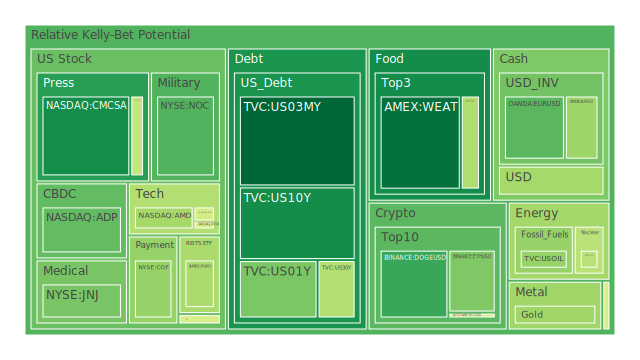
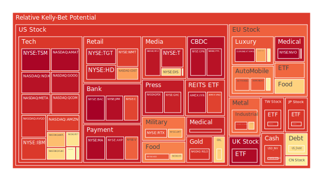
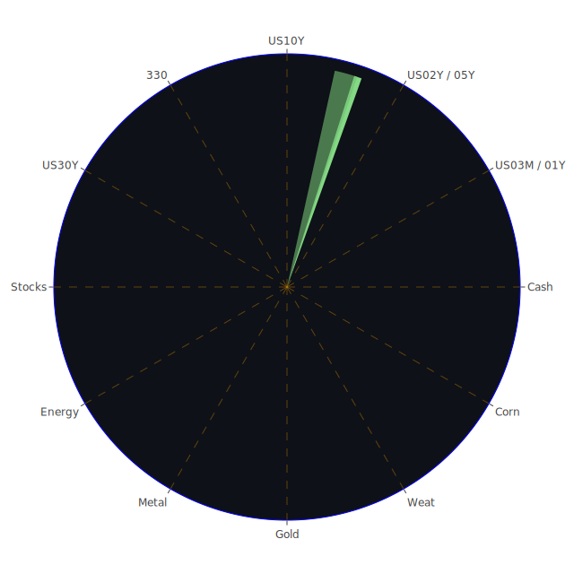

# （一）前言：三位一體的綜合思維

在面臨全球地緣政治、產業變遷、貨幣政策緊縮週期及資訊爆炸的多重衝擊下，現今市場常呈現出高度波動、板塊快速輪動以及投資人情緒反覆的特性。為了更有效地掌握市場脈動，透過「三位一體」的角度來進行分析，能幫助我們從空間（Spatial）、時間（Temporal）、概念（Conceptional）三大層面，去檢視各市場、資產以及新聞事件之間潛在的關聯性、傳導路徑與可能的風險—機會結構。

透過此一多重視角：

1. **Spatial層面**：著重於地域分佈、市場板塊之互動，以及跨國資本流向如何受到當前新聞、政策變動、地區衝突等影響。觀察焦點包含了美國國內市場、歐洲股市、亞洲新興市場、美國房地產、外匯以及商品期貨（如金屬、原油、糧食等）的相對互動。

2. **Temporal層面**：強調市場在不同時間軸下的波動型態，包括即時新聞對短期投資情緒的波及，以及長期利率結構、歷史性輪動趨勢和季節性因素對資本配置的影響。這同時也會結合各資產之短線泡沫指標（D1、D7、D14、D30）與歷史類似情境做比照。

3. **Conceptional層面**：則是綜合經濟學、社會心理學、博弈論，甚至歷史經驗等宏觀與微觀解釋架構，來推演市場行為與潛在風險。市場參與者心態，包括風險偏好、恐慌指數，以及政策面的左右，皆是此層面探討範圍。

再者，新聞事件與市場間所形成的「三位一體」呼應：第一是新聞的即時衝擊，第二是新聞的擴散效應（媒體與投資人信心互動），第三則是產業與宏觀政策之後續回饋。這三點透過正反合的形式，不斷交織與修正市場預期。在本文中將嘗試結合各種新聞資料、歷史案例與當前泡沫風險指數（D1、D7、D14、D30），並綜觀FED關鍵數據（包含美國公債殖利率走勢、貨幣政策、信用卡壞帳率等）。最後我們會將風險對沖與投資組合機會，盡量朝向相位分散（理想相位120度）、相關係數約-0.5的原則，試圖列出相對穩健、成長及高風險策略的配置比例。

---

# （二）各資產泡沫與風險概況

下述各資產的分析同時會參考近幾日所收錄的D1（當日）、D7（7天平均）、D14（14天平均）及D30（30天平均）等泡沫指數分數，並引用部分新聞事件來解讀市場情緒。由於不少資產的「symbol」在原始資料中包含了券商名稱，本文將省略該券商部分（例如US03MY只提「US03MY」，不再重複「TVC:」等前綴），以便使報告更聚焦於資產本身。

1. **美國國債（US03MY、US01Y、US02Y、US05Y、US10Y、US30Y）**  
   - 近期美國短天期（US03MY、US01Y、US02Y）殖利率維持在4.2-4.3%左右徘徊，整體曲線依舊呈現高位倒掛的情況，但隨著OIS FED Fund Rate數據顯示由高位回落、以及FED相關資產負債表持續收縮的消息，市場對進一步升息的預期顯著降溫。  
   - 新聞面上，近期並未出現對公債過度利多的正面驅動，但「美國國債由於其避險屬性，在全球經濟前景轉弱、地緣衝突或金融市場震盪時仍具資金避風港地位」這一傳統理念並未改變。  
   - 歷史場景方面，2018年底至2019年的升息尾聲時期亦出現類似的長短債殖利率混亂走勢，當時市場曾出現一波「避險湧入10Y與30Y」的行情，導致長債利率更快下滑。目前若以泡沫指數觀察，較短天期（如US03MY、US01Y）風險分數並不高，顯示投資人對其還是採納「短天期流動資金停泊」的策略，而長天期（US30Y）泡沫分數也相對中性，未見極端氾濫。  
   - 總體而言，美國公債可能呈現「短線殖利率維持高位、長線殖利率仍波動」的態勢，市場看似不太相信FED會再大幅升息，反而擔憂長期經濟放緩或地緣衝突會帶來資金避險潮。

2. **美國零售股（如TGT、WMT、AMZN、HD等）**  
   - 新聞引用：近期有關「Southwest Airlines與部分美國零售商進行裁員」的消息，以及「Walmart可能面臨獲利壓力」等負面報導，對整體美國消費股的情緒帶來一定衝擊。  
   - 泡沫觀察：TGT的D1有時高達0.8以上，一度呈現過熱。WMT同樣在前幾日出現了較高的泡沫分數，說明短期內投資者對零售業的估值較為樂觀，但新聞面不斷湧現負面衝擊，或暗示該板塊高檔震盪風險上升。AMZN則在雲端業務和廣告增長等領域有支撐，但整體D1指數亦接近0.9上下，不可忽視潛在回調。  
   - 歷史對照：回想2020年疫情後期到2021年初，美國零售股經歷超額需求行情，估值飛漲。但隨著通膨、利率走高與消費者信心放緩，2022-2023年後續回調明顯。現今若再度面臨經濟成長趨緩，需求轉淡，消費股處於相對脆弱位置，尤其基本面若無明顯成長空間，市場資金往往會尋找防禦性標的。  
   - 心理層面與博弈角度：零售股容易受市場短期消費預期與季報引導。若投資人開始對未來消費季產生質疑，就會迅速拋售，造成股價波動。

3. **美國科技股（MSFT、AAPL、GOOG、META、NVDA、AMD、INTC、AMAT、TSLA等）**  
   - 泡沫指數大多在0.6至0.9以上，顯示市場對於AI、雲端、大數據等概念抱有極高期望，尤其近期新一波「AI應用」、「自動駕駛晶片」等題材正熱。在新聞面上，Intel擬分拆部分業務的傳聞曾一度推升其股價，但也因為「難以實現或潛在交易障礙較大」等報導而出現短線震盪。  
   - 歷史對照：科技股在2020-2021年間於超低利率環境中大幅飆漲。2022年FED開始轉向緊縮後，其估值大幅回調。然而2024-2025年市場再度寄望於新科技週期，如AI自動化、元宇宙概念再次被炒作。心理學角度，FOMO（fear of missing out）情緒又重新升溫，推升泡沫。  
   - 新聞事件引用：部分新聞顯示「Palantir、Meta、NVDA」等在AI及國防應用領域原本得到市場關注，但近日有關「美國政府可能削減國防預算」的負面傳言，導致Palantir與部分半導體類股股價承壓。可見政策動向仍可能成為影響科技股漲勢的關鍵因素。

4. **美國房地產指數（RWO、VNQ、IYR等）**  
   - 這些ETF在近幾日的泡沫指數觀察中，多半介於0.8-0.96，且有時甚至突破0.9以上，顯示市場對房地產仍存巨大爭議：一方面在利率高位（30年固定房貸約6.8-6.9%）的環境中，不動產購買能力受到壓抑；另一方面供給短缺或部分區域需求仍強，使部分投資人繼續看多。  
   - 歷史案例：2007-2008年的次貸危機顯示當「壞帳率攀升」時，房地產相關資產易受衝擊。FED數據顯示部分消費者信貸壞帳率上升，但尚未到達嚴重失控的地步；商用不動產則有「Commercial Real Estate Delinquent」在相對高水位的提示，暗示商業地產存在結構風險。若經濟下行風險加劇，房地產ETF將面臨評價修正。  
   - 未來展望：從博弈論角度看，資金面若持續緊縮，房地產為高槓桿資產，承壓增大；但若宏觀經濟僅是輕微放緩，或FED在後續遇到金融壓力而放鬆貨幣，房地產板塊又可能再啟動一波反彈。短期看來風險高於收益，中長期或需視於不同區域的供需結構。

5. **加密貨幣（BTCUSD、ETHUSD、DOGEUSD等）**  
   - 泡沫觀察：BTCUSD的D1接近0.48-0.52區間浮動，ETHUSD約在0.35-0.67區間，DOGEUSD約在0.25-0.43。比照2021年的數據，尚未見2021年底那種瘋狂的波動水平。  
   - 新聞面：一些負面消息顯示「某些政治人物捲入疑似加密詐騙」與「阿根廷總統可能涉及宣傳加密而遭調查」，再次突顯了監管風險與詐騙事件對市場信心的破壞力。另外，也有零星正面聲音談論比特幣作為通膨對沖工具。然而，在風險市場普遍震盪時，加密貨幣容易出現資金排擠與恐慌性拋售。  
   - 歷史案例：過去幾年比特幣多次經歷牛熊循環，每當全球資金面寬鬆時，就出現一波主升行情，但在政策轉向或監管消息壓力下，往往短時間大幅回調。心理層面因素顯著：散戶投資者易在網路媒體或社交平台的情緒影響下集體買入或拋售，行情波動極端化。建議若布局，應嚴控倉位，設定停損或對沖策略。

6. **金/銀/銅（XAUUSD、XAGUSD、COPPER等）**  
   - 金價與銀價近期皆受地緣、通膨與經濟放緩預期的支持而震盪走高，但泡沫指數在0.5-0.9間波動；尤其銀（XAGUSD）短線波動顯著偏高，D1與D7都在0.87上下。  
   - 銅（COPPER）由於牽涉工業需求，近幾個交易日價格在4.55-4.60之間，泡沫指數仍在0.44-0.71左右飄移。新聞面上，部分媒體提及「中國需求可能放緩」，也有「印度等新興市場對基礎建設有一定支撐」。全球景氣若不樂觀，銅需求成長趨緩，價格後續承壓的機率較高。  
   - 歷史觀察：金、銀在經濟轉弱或地緣衝突加劇時常成為避險標的，但當利率上升或美元偏強，金屬價格亦受壓抑。目前美元指數並非極端強勢，為貴金屬提供一定溫和支撐。需關注OPEC+原油、通膨、地緣動盪等綜合因素對金銀需求的推升力道。

7. **黃豆 / 小麥 / 玉米（SOYB、WEAT、CORN）**  
   - 小麥（WEAT）、黃豆（SOYB）與玉米（CORN）這些農產品期貨，經常受到天候與地緣政治影響。若主要出口國遭遇戰爭或極端天氣，供應鏈可能受阻，期貨價格易急漲。  
   - 泡沫觀察：WEAT短線D1約0.17-0.19，黃豆（SOYB）曾最高接近0.47左右，玉米（CORN）也在0.37-0.42的區間。顯示黃豆相對高泡沫分數，可能與全球蛋白需求成長、或南美乾旱產量減少的擔憂有關。  
   - 新聞面：並無重大「農產品崩壞或飆漲」事件，但整體大宗商品市場常在地緣政治變動後出現供應鏈風險。需留意天然災害季節與部分產區的氣候情況。

8. **石油 / 鈾期貨 UX1!（USOIL、UX1!）**  
   - USOIL約在70-72美元附近震盪，泡沫分數在0.47-0.62上下徘徊。OPEC+傳出考慮延後增產計畫的消息，使市場對供給缺口有所揣測，但同時全球成長乏力又壓抑需求。  
   - UX1!（鈾）則因核能再度受到關注而價格有所支撐，但整體交易量並不算大，泡沫指數約0.42-0.75之間變動。若後續核能政策加快推動，鈾可能再次成為熱門題材。然而政治因素與供應相對侷限，易帶來大幅波動。

9. **各國外匯市場（USDJPY、AUDUSD、EURUSD、GBPUSD等）**  
   - USDJPY來到150-151區域，顯示日幣持續偏弱，投資人對日本央行寬鬆政策預期未見實質改變。AUDUSD約在0.63上下，在中國需求下滑、澳洲經濟反覆的背景下，澳幣短線走勢反覆。EURUSD則持續在1.04附近徘徊，代表歐元對美元暫時無太強勢表現。  
   - 歷史上，當美國利率居高不下且歐洲經濟表現疲弱時，EURUSD確實容易維持在較低水平。GBPUSD短線雖在1.26，但市場擔憂英國經濟成長趨緩及脫歐後遺症，英鎊波動度仍高。  
   - 新聞面：並無明顯的貨幣戰直指匯率操縱，但多個地緣風險事件與區域衝突使資金流回美元傾向依舊存在。在心理與博弈論層面，投資人遇到全球不確定性時往往回流美元避險，使美元維持相對強勢。若FED態度更鴿派，則可能扭轉些許趨勢，但目前看來FED仍維持「相對緊縮但漸趨保守」立場。

10. **各國大盤指數（GDAXI、FCHI、FTSE、JPN225、000300、NDX、0050等）**  
    - 歐洲股市如GDAXI（德國）、FCHI（法國）、FTSE（英國）近幾日出現滯漲傾向，且部分產業（如德國汽車零件、零售業）傳出裁員或盈利下修，泡沫指數有些仍在高檔，顯示估值面或許偏貴。  
    - 日經JPN225在約39000上下，持續高檔震盪，一些日企財報好壞參半。中國000300（滬深300）則約3940點附近，景氣並未明顯回溫，市場對中國2025年後的經濟改革仍存觀望態度。台灣0050則因半導體龍頭權重較大，且市場對AI與高階製程需求樂觀，使其維持在197元上下。  
    - 心理層面：歐洲通膨居高不下、美國FED尚未完全轉向寬鬆、地緣衝突等均讓國際投資人保持審慎。若大型指數進入調整，資金可能轉戰避險資產或部分熱門板塊（軍工、醫藥、AI等）。

11. **美國半導體股（NVDA、AMD、INTC、KLAC、AMAT、MU等）**  
    - 這些半導體公司D1泡沫指數多在0.48以上，一些熱門龍頭甚至超過0.9，可見市場對「半導體+AI」仍存熱情。然而新聞面，「NVDA、AMD等高階晶片」在地緣衝突或出口管制下仍存在不確定性。  
    - 歷史參照：半導體產業常經歷週期循環，每隔兩三年就有一波景氣高峰與產能過剩交替。當前正值伺服器、AI GPU需求旺盛，但若大環境景氣轉弱或營收無法達預期，高本益比下跌空間亦很深。

12. **美國銀行股（BAC、JPM、C等）**  
    - 新聞面：巴菲特削減銀行股、Bank of America等持股消息，引發投資人對銀行業前景的擔心。且FED升息週期下，銀行放貸風險增高，壞帳率上升可能影響資產負債表。  
    - 近期泡沫分數：BAC約在0.99上下，JPM也接近0.95-0.97，顯示市場對於銀行股估值存疑，股價雖高但潛藏風險。若消費貸款或商業不動產違約率升溫，銀行獲利恐難逃衝擊。

13. **美國軍工股（LMT、RTX、NOC等）**  
    - 地緣衝突和國防支出是該板塊的主要推手。雖有新聞提及「美國政府或削減國防預算」，但實際上軍工股是否遭受全面性衝擊仍待觀察。  
    - NOC、LMT近期泡沫指數在0.3-0.88區間上下浮動，整體相對高檔。軍工產業長期有政府訂單保證，但若預算減少或政治風向改變，股價也可能面臨不小壓力。

14. **美國電子支付股（PYPL、V、MA、GPN等）**  
    - 電子支付公司近年持續成長，但也面臨競爭加劇、區塊鏈支付與監管。PYPL近來泡沫指數高達0.96左右，V與MA也接近0.88-0.98，意味著市場對此類標的仍給予高評價。  
    - 若全球消費放緩，交易筆數下滑可能拉低營收增長率，這些高估值支付股就容易面臨估值壓力。2020年疫情帶動線上消費，使其股票大漲，如今要維持高增長勢頭並不容易。

15. **美國藥商股（MRK、JNJ、LLY等）**  
    - MRK、JNJ等在醫療保健領域相對防禦，但也有研發成本與競爭壓力。JNJ近期裁員傳聞、專利糾紛及消費保健業務分拆，使投資人開始重新評估。  
    - LLY則因新藥研發與體重管理藥物熱賣而股價一度大漲，但D1泡沫指數高達0.93-0.94，過熱疑慮仍在。若後續臨床試驗或政策定價不如預期，回調風險須謹慎面對。

16. **美國影視股（DIS、PARA、NFLX、FOX等）**  
    - 串流大戰期間，DIS、NFLX、PARA等長期爭奪用戶。近期有關Disney削減成本及PARA財務表現疲弱等負面消息，令該板塊承壓。NFLX表面上用戶成長穩定，但市場飽和，D1接近0.95上下，股價易受未達預期的財報衝擊。  
    - 心理學觀點：消費者在經濟壓力下，可能減少娛樂支出或重複訂閱；投資人也更傾向尋找防禦性板塊。歷史上，當經濟衰退時，非必需娛樂產業常首當其衝。

17. **美國媒體股（CMCSA、NYT、GHC等）**  
    - 數位廣告市場在經濟放緩時常首當其衝，CMCSA與NYT近來新聞負面居多，NYT裁員傳聞與廣告收入增長乏力使投資者謹慎。GHC屬教育與媒體綜合業務，泡沫指數雖高，但市場流動性有限。  
    - 歷史案例：媒體產業易受廣告商支出緊縮影響。若總體經濟看空，廣告預算削減會直接影響媒體股營收。

18. **石油防禦股（XOM、OXY）**  
    - XOM、OXY等巨頭，受益於前兩年油價高漲，但最近油價維持70-75美元之間，泡沫指數在0.68-0.82左右。因石油業擁有穩定現金流，具一定防禦能力，但也要注意全球減碳趨勢長期衝擊。新聞面上，並無太過明顯的利好，但OPEC+動向與地緣衝突風險仍是油價的關鍵。

19. **金礦防禦股（RGLD等）**  
    - RGLD作為黃金版權公司，其股價波動與金價高度相關。金價近來逐步走揚，該類公司收益也水漲船高。不過D1泡沫指數在0.90上下，已有一定炒作成分。金礦股常在市場動盪時獲青睞，但若金價一旦下滑，亦易出現大幅回落。

20. **歐洲奢侈品股（MC、KER、RMS等）**  
    - 法國、義大利等地的奢侈品集團，近幾年因中國與美國市場需求旺盛而大幅成長。但2025年初以來，中國消費復甦力道仍較疲弱，而美國高端消費也趨向放緩。  
    - MC、KER、RMS的D1介於0.47-0.97不等，RMS一度達到0.90以上，說明市場對奢侈品的擔憂與期待並存。若全球財富效應減弱，奢侈品恐出現需求萎縮；但長期品牌力仍在，通常回調後有機會吸引中長線佈局。

21. **歐洲汽車股（BMW、MBG等）**  
    - 德國汽車零件業者裁員消息、電動化轉型壓力，以及歐洲整體經濟疲弱，使BMW、MBG股價壓力較大。新聞面提到「德國企業可能進一步縮減本土生產」。D1在0.49-0.84區間，波動頗大。若全球需求放緩，出口導向的德國車廠將面臨挑戰。

22. **歐美食品股（NESN、KHC、KO、ULVR等）**  
    - 這類必需消費與食品飲料企業在經濟轉弱時通常相對防禦。D1泡沫指數多半在0.5-0.9之間，近期KHC一度接近0.68，KO約0.86，ULVR則相對更高，一度達到0.89以上。  
    - 新聞指出各國通膨仍居高不下，原物料成本上漲壓力仍未完全解除，廠商若再度漲價，或影響銷量。2020年疫情時期，必需消費類股展現高韌性，但估值是否過高，需要謹慎。

---

# （三）宏觀經濟傳導路徑分析

1. **貨幣政策與利率結構**：目前FED資產負債表持續收縮、RRP餘額下降、TGA攀升意味著政府財政運作重新累積子彈，整體金融環境雖仍在收縮，但2024年後期開始已不再像2023年那麼急速。加上市場對未來升息預期降溫，長債利率若維持4.5%-4.8%區間震盪，短債亦在4.2%-4.3%附近，長短債期限結構倒掛依舊，但幅度比之前稍微緩解。  
2. **企業融資與消費**：利率維持相對高位，消費者信用卡壞帳率上升、商用不動產呆帳壓力也開始浮現，預示著金融機構放貸態度更謹慎。企業若募資成本高漲，可能壓抑擴張與投資。零售銷售增長放緩新聞陸續出現，顯示消費意願降溫。  
3. **匯率與國際貿易**：美元偏強，歐元、日圓疲弱，造成各國出口壓力。若地緣政治衝突升級，能源價格再度波動，歐洲與新興市場可能面臨通膨升溫壓力，貨幣政策轉趨更複雜。

---

# （四）微觀經濟傳導路徑分析

1. **企業層次**：部分公司為了維持利潤率，選擇裁員、縮減資本支出或提高產品價格。裁員訊息往往在短期利多股價（節省成本），但若市場認為該公司無成長動能，股價恐再度回落。  
2. **產業鏈影響**：上游原料與中游製造商若遇到成本波動，會逐步傳導至下游客戶。特別是半導體、石油、農產品等具國際行情的領域，常見此傳導效果。  
3. **心理層面**：若媒體不斷出現裁員、衰退、戰爭等負面報導，投資人與消費者趨於保守。反之，若AI、自動化、國防、再生能源等新聞頻頻出現利好，資金會朝題材股聚集，推高泡沫風險。

---

# （五）資產類別間的傳導路徑

1. **科技股與半導體對股市指數的牽引**：美國科技股權重龐大，對NASDAQ、NDX指數影響巨大。一旦科技股陷入估值調整，對大盤造成明顯壓力。  
2. **大宗商品與新興市場**：油價、金屬與農產品在新興市場有高度相關性；若油價與金屬價格回落，許多資源出口國匯率與股市亦受衝擊。  
3. **匯率與債券市場**：資金跨國流動受利率差影響。當美元利率高企，外幣貶值壓力上升，國外資金回流美國公債或美元資產，造成新興市場面臨資本外流風險。  
4. **房地產與銀行**：商用房地產壓力易帶來銀行壞帳攀升。若房市顯著回調，銀行類股連動性高。  
5. **加密貨幣與科技類股**：加密貨幣常和高風險偏好投資人重疊，市場資金面偏緊時，兩者往往同步遭遇賣壓。

---

# （六）風險對沖與投資組合機會

基於前述三位一體的正反合觀點，在「Spatial分散（跨區域與產業）」、「Temporal分散（不同時程配置）」、「Conceptional分散（結合不同學理與心理因素）」的原則下，建議尋找「相位盡量滿足120度、相關係數約-0.5」的資產組合，以便在一個板塊下跌時，另一個板塊可能有機會對沖。以下將大致點出幾類對沖機會：

1. **美國國債與商品對沖**：長天期美債（如US30Y）在經濟趨弱或避險需求攀升時通常走強，而原油、銅等商品在經濟擴張階段可能上漲。若兩者能維持適度負相關，配置時可減少組合波動。  
2. **科技股與防禦性板塊對沖**：高成長科技股（如NVDA、AAPL）與必需消費/醫療（如KO、JNJ）時常呈現反向或低相關波動，尤其在市場風險偏好轉移時，有助分散風險。  
3. **外匯與黃金對沖**：強勢美元通常壓制金價，但若地緣衝突或全球流動性驟降，金價又易飆升，兩者呈現一定程度的負相關。投資者可在資產組合中適度使用此特性。  
4. **加密貨幣與必需消費股對沖**：加密貨幣易受風險偏好驅動而大漲大跌，與相對穩定的必需消費股（如KHC、KO等）呈現波動節奏大致錯開，若風險承受度高，可少量配置以追求高Beta表現。  
5. **區域股市與全球債券**：歐洲與新興市場股市若與美國債券形成避險對沖，可能在某些階段達到負相關。當歐洲經濟數據不佳，資金或將流向美國公債避險。

---

# （七）三位一體、兩兩驗證的篩選假設分析

1. **三位一體的相互聯動**：  
   - **Spatial層面驗證**：若歐洲衰退風險升溫，則歐洲股市、汽車股（BMW、MBG）恐受創；資金可能流向美國公債或美元資產，抬高美元。同時，新興市場（000300）或被連動拖累。此時黃金（XAUUSD）或美國防禦股（如醫藥、軍工）可形成避險。  
   - **Temporal層面驗證**：近幾周的新聞負面偏多，顯示短期投資情緒較為悲觀，推測短線波動可能加劇；若拉長至一年，FED若轉趨觀望，市場流動性趨於平穩，股市又可能醞釀反彈。  
   - **Conceptional層面驗證**：金融市場中，投資人的「恐懼與貪婪」心理在博弈論中往往造成資金於板塊間快速遷移；結合經濟與社會現象，當失業率上升或全球衝突擴大，人們傾向尋找保值資產（黃金、美債），壓制高風險資產的漲勢。

2. **兩兩相互驗證**：  
   - **科技股與房地產**：若科技股大漲，市場風險偏好升溫，同時房地產ETF也可能獲得偏正面影響（資金寬鬆或信心提升）；但高利率現實導致房地產成交不振。兩者呈現出有時正相關、有時不對稱波動的狀況。  
   - **銀行股與國債**：銀行若因壞帳或財報不佳下跌，市場避險情緒可能推升國債價格。  
   - **原油與航空旅遊**：油價上漲對航空運輸成本不利，航空股易回落。相反，若油價過低又意味著全球需求走弱，對航空股亦非絕對利好，需要綜合評估經濟動能。

---

# （八）投資建議：穩健、成長與高風險三大配置

以下提供三類型資產的配置組合示例（合計100%），並各舉三個子項。此配置純屬示範性質，需視個人風險承受度調整。

1. **穩健型（約40%）**  
   - (1) **美國10年公債（US10Y）**：避險、相對穩定，殖利率約4.5%上下，利率風險可控。  
   - (2) **大型必需消費股（KO或ULVR）**：通過日常用品銷售，具抵禦景氣波動能力。  
   - (3) **黃金（XAUUSD）**：在地緣政治或通膨升溫時的對沖，可佔一部分以提升組合防禦性。

2. **成長型（約40%）**  
   - (1) **美國科技龍頭（MSFT或AAPL）**：AI、雲端、手機生態系等驅動長期成長。但注意泡沫風險較高。  
   - (2) **半導體設備股（KLAC或AMAT）**：若AI與自動化需求延續，下游需求會拉動設備投資。  
   - (3) **歐洲奢侈品（RMS或KER）**：若全球消費復甦，奢侈品需求反彈，但要謹慎評估中國市場。

3. **高風險型（約20%）**  
   - (1) **加密貨幣（BTCUSD或ETHUSD）**：波動極大，一旦資金面寬鬆、或市場風險偏好回升，漲幅可觀；反之跌幅慘重。  
   - (2) **美國高Beta科技（NVDA或TSLA）**：若AI與電動車熱潮延燒，可享受大波動的潛在收益。  
   - (3) **新興市場ETF（000300或相關）**：中國或其他新興亞洲國家若成長加速，帶來超額回報；但地緣、政治與政策風險也更顯著。

上述僅作為配置示意，實際投資仍需考慮個人資金規模、流動性需求、當地稅賦與交易成本等。

---

# （九）風險提示

1. **警惕高泡沫風險**：多數資產D1與D7分數高企，暗示市場對未來漲勢已有較高預期，稍遇利空即可引爆拋售。  
2. **宏觀環境多變**：利率高位、地緣衝突、通膨等因素仍在轉折點；任何意外事件皆可能顛覆市場情緒。  
3. **產業與政策不確定**：國防預算削減的消息、對科技企業的反壟斷調查、碳排放政策對傳統能源股的衝擊等，皆可能深度影響板塊表現。  
4. **市場總是充滿不確定性**：投資者應保持警惕，設好停利停損。對於泡沫風險高的標的，需格外重視投資警告。

---

## 結語

本報告整合了Spatial、Temporal、Conceptional三位一體的分析方式，從空間地理分佈到宏微觀經濟結構，再到新聞衝擊下的社會與心理層面，試圖在複雜多變的市場局勢中找出邏輯鏈與潛在對沖機會。藉由引用歷史案例、最新新聞與既有理論，輔以泡沫指數（D1、D7、D14、D30）與FED關鍵數據，進一步描繪當前資產可能面臨的風險與契機。然而，面對充斥著裁員、財報不佳、地緣衝突、不動產違約疑慮等負面事件，以及AI、能源轉型、區塊鏈等正面新題材，任何投資策略都需謹慎審視其合理性與時效性。

整體來看，若市場持續存在地緣與經濟下行疑慮，防禦型資產（黃金、美國長短債、必需消費品）仍具吸引力；若FED態度轉鴿或政策出現寬鬆轉向，高Beta科技、新興市場、加密貨幣等又將吸納大量風險資金。投資組合的核心是分散化，盡可能透過負相關與不同風險敞口來優化績效。特別在三位一體的正反合之下，對每個假設都需保持彈性與批判思維，並持續關注最新數據與事件演變。

**投資有風險，市場總是充滿不確定性。我們的建議僅供參考，投資者應根據自身的風險承受能力和投資目標，做出獨立的投資決策。**

 
Daily Buy Map:

 
Daily Sell Map:

 
Daily Radar Chart:

 
