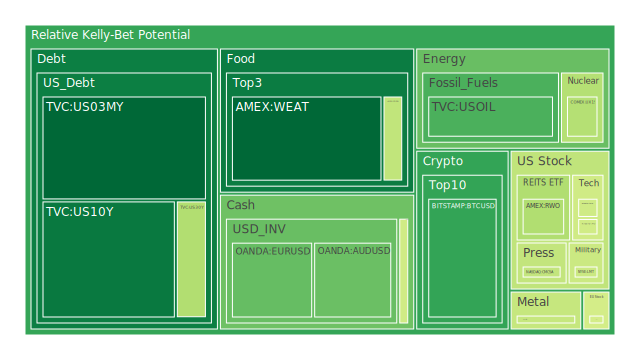
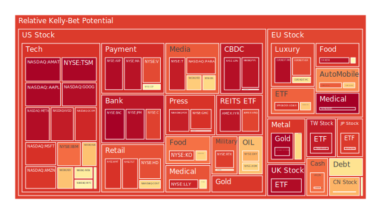
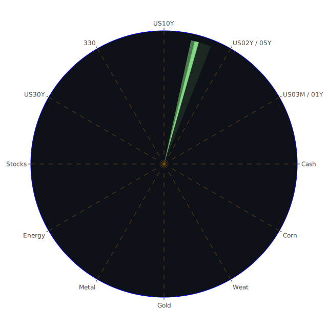

# 投資商品泡沫分析

在此部分，將依序就美國國債、美國零售股、美國科技股、美國房地產指數、加密貨幣、金銀銅、黃豆／小麥／玉米、石油／鈾期貨UX!、各國外匯市場、各國大盤指數、美國半導體股、美國銀行股、美國軍工股、美國電子支付股、美國藥商股、美國影視股、美國媒體股、石油防禦股、金礦防禦股、歐洲奢侈品股、歐洲汽車股、歐美食品股等主要資產，透過近期以及歷史上的泡沫風險分數(D1、D7、D14、D30)，並穿插引用新聞事件與歷史參照，進行一個整體觀察。

## 1. 美國國債
美國國債(如US03MY、US10Y、US30Y、US01Y、US02Y、US05Y等)近幾日觀察到短天期與中長天期的殖利率都有相對明顯的變動。從D1到D30來看，有些短期債券(US03MY、US01Y)的泡沫分數正隨著市場對利率調整的預期而呈現微幅增減，顯示投資人對流動性與FED政策的影響抱持戒心。同時長天期公債(US10Y、US30Y、US20Y)也有泡沫分數走向，但整體仍在中段偏低水位，說明在空間層面(Spatial)，各地資金依舊把美國國債當作最終避風港，但在時間層面(Temporal)，隨著美國政府公債餘額的增長、債務占GDP比例提升，以及潛在的政治角力，市場恐將出現對長期信用與利率政策多重懷疑的可能。概念層面(Conceptional)則體現在：經濟學與博弈論下，若FED繼續收緊與縮表，而美國國會在舉債上限議題上又有擴張的風險，則公債評價可能進入新一輪波動。

## 2. 美國零售股
以WMT、TGT等代表性零售股為觀察指標，新聞指出WMT因銷售展望保守，股價因「measured」的言論而回檔。TGT的泡沫分數偏高，而且近期D7、D14、D30均維持在高水位，隱含投資者對其經營成長的質疑。加上最新新聞報導Walmart給出的「sales growth forecast disappoints」進一步打擊市場信心。回顧2008年金融危機時，大型零售商因經濟疲軟導致銷售下滑，也曾面臨股價修正；在心理學層面，消費者行為隨經濟波動易出現恐懼心理與消費觀望。從社會學角度，零售業亦受到就業與薪資的影響極大，一旦出現高通膨或就業削減(如新聞中提到的IRS可能裁員、美國政府部門裁員等)，零售銷量恐被壓抑。

## 3. 美國科技股
科技股(AAPL、MSFT、META、GOOG、AMD、NVDA、INTC等)在最近幾季因AI、雲端與半導體展望而曾出現大幅炒作，但近期新聞頻傳：Meta下調員工股票選擇權、部份企業對AI應用過度樂觀導致回檔。泡沫風險分數方面，AMD、NVDA、META等短期仍處在D1、D7、D14等指標超過0.5甚至0.6以上的區間，顯示市場熱度依舊偏高；然而過往經驗顯示，若企業財報不及預期或政策突然改變(如政府對關鍵零組件管制或與他國爭端)，易引發大幅回檔。參考2000年網路泡沫，當時估值失真期間科技股廣受投資人熱烈追捧，但最終在企業獲利無法跟上高倍本益比的情況下出現崩跌。此番雖不一定重演，但短期內需關注高殖利率環境對科技股估值的壓力，以及博弈論下國際競爭對尖端科技出口、供應鏈的可能衝擊。

## 4. 美國房地產指數
以RWO、VNQ等房地產ETF做觀察，D1、D7、D14、D30整體數據呈現先升後微幅回落，顯示近期市場對房地產投資信心尚存，但也隨著FED升息趨勢、房貸利率(約6.85～6.93)居高不下，以及商業不動產(特別是辦公室需求下滑)的擔憂，讓房地產前景不甚明朗。回顧2008年次貸危機，房地產相關金融商品曾引爆全面性風險；社會面則反映著疫情後的遠距工作趨勢導致辦公室需求轉弱。短期內若失業率上升，零售與商業地產的貸款違約機率將增加；尤其新聞裡提及「Charge-off Rate on Credit Card is at relatively high level」，若消費者現金流持續緊縮，也可能衝擊房貸清償能力。

## 5. 加密貨幣
BTCUSD、ETHUSD、DOGEUSD等，根據最新泡沫分數，BTCUSD的D1約0.267274，DOGEUSD、ETHUSD也在0.3～0.5之間浮動，顯示加密市場興奮度仍高於疫情初期，但比前期巔峰時已有所降溫。值得注意的是新聞面對加密貨幣的負面情緒較少直接提及，但市場傳出部分新創企業裁員、銀行股對於加密交易的審慎態度，與美國監管可能日益收緊。回顧2017～2018年的加密泡沫，引發社會對「去中心化」的狂熱，最後價格大幅回調。當前在心理層面，投資者一方面害怕錯過行情(FOMO)，另一方面也有較強的止盈意識；在博弈論角度，機構玩家與散戶互相角力，若宏觀流動性趨緊，對加密貨幣投資的槓桿或信用擴張將更受壓抑。

## 6. 金／銀／銅
金銀銅等大宗商品往往在市場震盪、地緣風險升高時成為避險標的。XAUUSD金價近期PPP100接近2941.12，泡沫分數雖高但未達極端，約0.98左右，暗示市場的炒作仍存在；銀(XAGUSD)的泡沫分數約0.67～0.91(短期與中期之間有變化)，較金溫和一些；銅(COPPER)則在工業需求與宏觀景氣指標的博弈下，泡沫分數D1約0.46～0.71區間浮動。歷史上當金融市場不確定性增強(如1998年亞洲金融風暴、2008年全球金融危機、2020年疫情爆發)，金價常出現急速攀升；如今新聞面再度聚焦地緣政治衝突、許多國家疑似經濟疲弱，使投資人轉向金銀尋求保值。心理學上「避險」需求容易造成市場激情，亦在社會學層面體現人們對動盪時期的資產安全要求。但銅則更多取決於中國及全球工業生產等空間分布，若中國內需或基礎建設增溫，銅價易見反彈。

## 7. 黃豆 / 小麥 / 玉米
SOYB、WEAT、CORN等農產品價格與極端氣候、地緣政治衝突(例如俄烏衝突影響黑海穀物出口)、以及全球糧食需求有關。近期WEAT的泡沫分數(約0.15～0.19)並不算高，顯示投資人對小麥價格短期無過度炒作；CORN則有部分樣本顯示D1或D7數值上升或維持於0.42～0.45，暗示有些投機資金在關注玉米，但整體不算太熱。回顧歷史，美國農產品期貨在經濟衰退期或政策保護主義(如關稅、出口禁令等)時，價格波動加劇。新聞裡雖較少提及糧食議題，但全球通膨若持續，最終可能從上游工資與運輸成本轉嫁到這些必需品價格。投資人宜關注極端氣候可能帶來的產量不確定性，以及各國對農產品進口的態度。

## 8. 石油 / 鈾期貨UX!
石油(USOIL)與鈾期貨(UX!)一向與地緣政治密切相關。石油泡沫風險根據近期D1、D7、D14皆在0.29～0.55區間，不算極端，但仍有往上波動的可能。新聞顯示OPEC+維持減產策略，加上俄羅斯供應動向變數，引發油價上下震盪。回顧1990年海灣戰爭與2014年油價大跌，都反映政治與供需衝擊。鈾期貨數據(UX!)短期D1約0.43～0.44左右，屬於一定程度的投機。倘若國際對新能源、核能發電需求增加，鈾或許有支撐，但因政治、核廢料處理爭議等不確定因素，市場買盤仍顯得謹慎。博弈論層面，若有大國提出新的核能政策，對鈾需求可能一夕暴增；心理學上也存有核能疑慮造成的市場時常猶豫。

## 9. 各國外匯市場
包括EURUSD、GBPUSD、USDJPY、AUDUSD等。新聞資料顯示：USDJPY在D1約0.47～0.48，表面上日元具避險角色，但日本保險業者巨額債券損失的新聞(「Japan’s Top Insurers Lose $3 Billion From Bonds in Nine Months」)也在空間層面干擾日元信心。EURUSD與GBPUSD則交織了歐元區與英國通膨、就業與地緣政治等議題。AUDUSD在大宗商品價格變化、澳洲就業市場報告的驅動下亦波動。歷史參照如1997～1998年亞洲金融風暴，貨幣競貶曾重創區域經濟；在當前全球化趨勢下，外匯市場同樣敏感於各國貨幣與利率政策。若FED持續立場鷹派，美元可能在較長時間維持強勢，但一旦市場預期FED轉向，美元恐快速回落。

## 10. 各國大盤指數
主要觀察如NDX(那斯達克100)、GDAXI(德國DAX)、FTSE(英國FTSE 100)、FCHI(法國CAC 40)、JPN225(日經225)、000300(滬深300)等等。根據新聞與泡沫分數可見，部分歐洲指數(GDAXI、FTSE、FCHI)在D1、D7間有所震盪，且有高估現象(如0.83～0.97不等)。歐洲經濟深受能源危機、通膨與政治問題困擾，而新聞裡對德國等地的大量裁員、勞動力老化、以及零售市場下滑的描述，更讓社會學觀點裡的消費力道減弱顯現。亞洲方面，JPN225雖維持一定漲勢，但企業獲利狀況與國內通膨仍是關鍵；中國滬深300則受益於部分政策性資金扶持。時間層面(Temporal)上，全球股市自2020年疫情低點反彈後已累積大量漲幅，若進入升息尾聲或縮表衝擊，後續震盪在所難免。

## 11. 美國半導體股
這裡可再度聚焦NVDA、AMD、INTC、KLAC、MU、QCOM等。根據近期數據，MU、NVDA、AMD的泡沫分數在短期(D1)或一週(D7)維度雖有上下變化，但整體水平依舊偏高，象徵市場對AI、晶片需求的憧憬持續。回顧2000年網路科技股風暴，半導體板塊也曾在泡沫破裂時嚴重受傷。在心理層面，投資人對尖端技術常有過度樂觀的集體心態；在空間層面，全球半導體供應鏈集中在少數地區，美中貿易博弈持續，又讓產業更容易受政治牽動。市場若出現供給過剩或新一輪科技封鎖政策，股價波動幅度將擴大。

## 12. 美國銀行股
以JPM、BAC、C、COF等為觀察典型。近期新聞提及IRS、FHA、政府部門等潛在裁員，也暗示經濟整體下滑風險可能增大，進而影響銀行放貸品質。BAC之泡沫分數已逼近接近1.0上下，意味投資人持續炒作或擔憂該行股價估值已高；JPM則在0.95～0.97之間。回顧2008年雷曼事件，銀行股因次級房貸挫敗而大幅貶值。雖然目前監管機制相對完善，但社會對銀行資本充足率的恐慌仍可能被放大：一旦逾期貸款(例如信用卡、商業房貸)攀升，銀行股易遭市場拋售。博弈論觀點：若多家銀行都有潛在風險，市場可能出現連鎖反應。

## 13. 美國軍工股
以NOC、LMT、RTX等為例，受到地緣衝突與美國國防預算的推動，軍工股近年來維持較高評價。但NOC近期D1、D7、D14都出現偏高且波動幅度大的情形，新聞裡也提及美國政府在一些部門減支，但軍費是否維持增長仍具不確定性。軍工產業Historically在政黨輪替、地緣衝突升溫(如俄烏衝突)時常見股價飆升；反之，一旦局勢舒緩或預算受限，股價易下修。

## 14. 美國電子支付股
如PYPL、GPN、V、MA等。疫情推動無現金交易普及，曾使電子支付股受追捧，而近期觀察泡沫分數發現V、MA、PYPL等都在0.94～0.97之間，高度顯示估值可能偏貴。新聞面指出美國經濟與消費增速放緩；若零售受衝擊、消費者債務壓力上升，交易量增長恐放緩。回顧2017～2019年電子支付行業的迅速擴張，當時市場對移動支付與社交支付的前景極其樂觀，但2022～2023年之後，各家競爭激烈，收單方手續費下滑，再加上利率上行，支付股的前景需謹慎看待。

## 15. 美國藥商股
如MRK、JNJ、LLY等。醫藥產業向來被認為具防禦性質，但MRK、JNJ分別在報表中顯示不小的風險敞口。JNJ的泡沫分數在0.62上下，MRK也維持中度偏高，暗示市場對藥廠的收益波動有疑慮。過往2008年金融危機時，醫藥股也曾有抗跌表現，但在專利到期風險與新藥研發進度不確定下，股價仍可能大幅波動。社會學層面，公共衛生政策、醫療保險制度改革皆能影響藥廠收益結構。

## 16. 美國影視股
如PARA、NFLX、DIS、FOX等，近年因串流市場競爭與產業合併，多家公司股價大幅震盪。PARA短期泡沫分數約0.52～0.90間變化較大，DIS亦在0.67～0.71之間。歷史上，產業轉型時常出現劇烈洗牌，例如2000年代DVD到串流的轉換期。新聞面提及若經濟不佳，家庭可能縮減娛樂支出；同時串流市場競爭導致成本增高、利潤下降，需持續留意。

## 17. 美國媒體股
如NYT、CMCSA等，近年來廣告收入易受數位平台侵蝕，並且政治與社會情緒對媒體公信力也有干擾。NYT的泡沫風險D1達0.54～0.55之間，中長期仍要擔心消費者付費模式的成長能否維繫。心理學層面，新聞資訊過載使社會對「付費訂閱」的意願有限，也影響該類股價增長。

## 18. 石油防禦股
如XOM、OXY，當原油價格波動時，整體產業的市值亦跟著大幅變化。XOM近期泡沫分數約0.68～0.76；OXY約0.69～0.75，顯示市場對能源類股的熱度尚存。過去2020年油價大跌時，防禦股也受重創；如若國際油價再次劇烈波動，這些公司的盈餘同樣面臨風險。

## 19. 金礦防禦股
如RGLD等。金礦股常被視為替代金價之投資管道，泡沫分數接近0.90上下，顯示市場對貴金屬的熱情同樣可能導致金礦股估值偏高。2008年金融危機時，金礦股前期隨金價上揚，但流動性緊縮後也面臨賣壓。需留意公司本身的採礦成本、產能及財務體質。

## 20. 歐洲奢侈品股
如MC、KER、RMS等。疫情後中國與全球需求回暖一度拉抬奢侈品銷售，然而新聞顯示中國目前內需不振的苗頭，歐美消費者在通膨壓力下或削減高檔消費，導致這些公司泡沫指標攀升(部分維持在0.60～0.76甚至更高)。歷史經驗顯示奢侈品需求具韌性，但也與股市榮枯相關，若全球陷入經濟衰退，該類股價漲勢恐熄火。

## 21. 歐洲汽車股
如BMW、MBG等，根據新聞與泡沫數據來看，該類股泡沫分數中度偏高，約在0.50～0.60之間。歐洲大力推動電動車轉型，但同時受到能源危機、消費者信心下滑、勞動力短缺等影響，再加上歐洲央行貨幣政策的不確定性，將在時間維度(Temporal)上形成壓力。

## 22. 歐美食品股
如KO、NESN等，日常消費品股在經濟疲弱時通常有防禦性，但CPI對原物料成本壓力仍存在。KO泡沫分數已達0.88～0.90，NESN也有0.63～0.72區間上揚；顯示市場確信食品股具防禦性，但估值漸顯昂貴。回顧疫情初期，食品必需品需求旺盛；但若收入增長趨緩，之後恐難支撐如此高本益比。

---

# 宏觀經濟傳導路徑分析

1. **FED政策與利率**  
   依據FED經濟關鍵數據，總資產持續縮減、RRP下降，顯示資金回流市場所剩的餘地有限；同時EFFR Volume高企，表示市場對聯準會緊縮保持警惕。若利率維持高位或進一步升息，公債收益率抬高，風險性資產或許會面臨估值壓力。

2. **政府財政與就業**  
   美國政府部門裁員可能拖累整體就業與消費；美國國債若繼續擴大量化發行，則可能使殖利率曲線進一步上行，信用擔保成本攀升，最終又回頭壓制企業融資。高失業率一旦產生，必定衝擊零售與房地產等消費相關部門。

3. **國際貿易與地緣政治**  
   新聞顯示各地衝突不斷，包含歐洲地區、非洲多國、及中東等，對於原物料(石油、金屬、糧食)供給面衝擊加劇。匯市方面，美元維持強勢會使新興市場承受還債與資本外流壓力；若地緣衝突加深，金銀等避險商品需求增溫，石油價格亦不穩定。

4. **產業結構與替代效應**  
   在宏觀層面，若經濟轉弱，必需消費品、防禦型能源股、貴金屬有較高吸引力；相反地，高成長科技或高槓桿資產承受估值縮水的壓力。退一步看，美國銀行與金融體系若出現系統性動盪，將對整體股市與債市造成更嚴重連鎖影響。

---

# 微觀經濟傳導路徑分析

1. **企業財報與庫存調整**  
   零售商Walmart與Target對未來銷售預期保守，可能意味著下游供應鏈面臨庫存與訂單削減壓力，傳導至工業、製造業產出降低。

2. **金融槓桿與信用風險**  
   信用卡逾期率與Charge-off率不斷上升代表消費者財務壓力增大。在微觀層面，銀行股將面對更大的呆帳潛在損失，進而縮緊貸款標準，擴大對企業與個人的信貸壓力。

3. **新創與科技產業人員流動**  
   許多新創公司若無法持續融資，必定會進行裁員。員工流動擴大後，將在微觀層面折射到消費減少、住宅需求減弱，擴散至房地產與零售股。

4. **避險意識與資產重分配**  
   當企業面臨風險時，管理層與投資者傾向將資金挪往美元現金、黃金或短期美債；資金抽離高風險資產時，科技與小型股遭受的衝擊往往最先顯現。

---

# 資產類別間傳導路徑分析

1. **公債利率與股票估值的互動**  
   當公債殖利率上行，股票折現率提高，理論估值下滑；利率偏高亦會吸引資金從股市轉往債市，形成股市壓力。

2. **美元與大宗商品的反向關係**  
   一般而言，美元走強常令大宗商品(黃金、石油、銅、農產品)價格承壓；但若地緣政治增溫或市場極度恐慌，金價可能與美元同漲，形成避險雙支柱。

3. **銀行金融股與房地產市場緊密聯動**  
   銀行股若面臨壓力，貸款成數與意願降低，傳導到房地產與建築市場；若房地產不良貸款升溫，又反向衝擊銀行資產負債表。

4. **科技成長股與企業融資環境**  
   升息與流動性縮緊不利成長型科技股；若企業融資成本飆升，AI與半導體投資勢必放緩，產生對相關供應鏈、矽晶圓、設備廠的漣漪式影響。

---

# 投資建議

以下提出依穩健、成長、高風險三種配置思路。每類資產配置合計為100%，並各選三個子投資項目簡要說明。

## 1. 穩健型(約40%)
- **短期美國公債**(US03MY或US01Y)：佔比15%。收益穩定且流動性佳，可當現金替代。
- **黃金(XAUUSD)**：佔比15%。在地緣衝突與宏觀不確定下，黃金作為避險配置。
- **高股息必需消費股(KO或NESN)**：佔比10%。市場情勢動盪時，生活必需品需求相對穩定，但要提防估值過高風險。

## 2. 成長型(約35%)
- **半導體龍頭(NVDA或AMD)**：佔比15%。AI與高效能運算前景仍具吸引力，但留意估值風險。
- **醫藥防禦股(LLY或JNJ)**：佔比10%。雖然可能面臨專利到期壓力，但仍具防禦性質與潛在新藥成長。
- **房地產REITs(VNQ或RWO)**：佔比10%。若利率趨於穩定，REITs有望提供穩健現金流，但要謹慎篩選。

## 3. 高風險型(約25%)
- **加密貨幣(BTCUSD或ETHUSD)**：佔比10%。具高波動性，切忌過度配置，並建議嚴設停利停損。
- **新能源/鈾(UX!)**：佔比5%。若各國推行核能或能源轉型，鈾需求將顯著提升，但政治風險不容忽視。
- **新興市場科技股(可考慮部分中國或其他亞太區公司)**：佔比10%。若當地經濟政策寬鬆，或全球景氣回暖，有較大彈性空間，但易受地緣衝突或管制政策影響。

這樣的組合希望在相位120度、相關係數約-0.5的原則下，彼此分散風險。短期美債與黃金常有負相關，半導體與REITs表現則可能在特定通膨環境下呈現不同走勢，加密貨幣更與傳統金融市場常出現意料之外的相關性。

---

# 對上述所有表格（概念上）進行三位一體、兩兩相互驗證的篩選假設分析

1. **空間(Spatial)正反合**  
   - **正面假設**：全球資金依舊將美國視為資本投資與避險中心，公債與美元受青睞。  
   - **反面假設**：若美國政治不穩、國債規模持續擴張，資金可能分散流入黃金、瑞郎、日元甚至部分加密貨幣。  
   - **綜合**：投資者宜在地域分散上做更靈活配置，美國資產仍是核心，但應輔以其他區域避險或成長。

2. **時間(Temporal)正反合**  
   - **正面假設**：FED收緊接近尾聲，通膨可能逐漸回落，市場將穩定並重新進入成長週期。  
   - **反面假設**：若未來就業市場驟降、消費疲弱，市場可能重演過去衰退或局部金融危機的縮影。  
   - **綜合**：短期波動難免，建議分批佈局、避免一次性重倉，並關注中長期政策走向。

3. **概念(Conceptional)正反合**  
   - **正面假設**：經濟學理論顯示供需漸趨平衡，資金有效配置；博弈論認為各國會克制衝突；心理學預估投資者避險偏好與風險偏好能找到平衡。  
   - **反面假設**：若社會學層面出現民粹、排外或政策不連貫，博弈論下可能誘發局部衝突升溫。市場信心擊潰時，股債與商品皆恐出現連鎖反應。  
   - **綜合**：大膽假設小心求證，配置需多元，並持續追蹤實際政策與市場行為。

根據以上假設，若當前情勢繼續朝負面演化，可能在科技股與銀行股之間先引發漣漪效應：銀行貸款緊縮→新創科技資金短缺→裁員→消費緊縮→零售下行→房地產不良貸款增加→銀行再度壓縮放貸，構成循環。若此循環擴大，也會連帶衝擊國債(因違約與赤字大增)與匯率(因投資人轉向他國安全資產)。然而，若某些政策或企業研發突破成功，則另一種正面傳導路徑也可能出現：人工智慧帶動就業成長→科技創新產品熱賣→企業獲利回升→股市重獲動能。這些環環相扣路徑顯示，投資佈局應該進行跨產業、跨區域、跨時程的謹慎評估。

---

# 風險提示

投資有風險，市場總是充滿不確定性。回顧2020年疫情、2008年金融危機或2000年科網泡沫，皆可看出即使大多數指標預測良好，最終依舊可能爆發風險。近期泡沫風險分數在部分資產(科技股、銀行股、電子支付、加密貨幣)仍偏高，代表本金隨時可能面臨劇烈波動。地緣局勢與政策調整亦有突發性。本文所提供的任何建議僅供參考，投資者應根據自身的風險承受能力和投資目標做出獨立決策。切忌過度槓桿操作或在單一領域集中重倉。在現今瞬息萬變的市場，大幅度的泡沫風險不容忽視，更需以多元化、分散化以及嚴守停損原則來配置資金。若市場出現系統性震盪，需果斷應對並保留現金或等價流動資產，維持個人財務安全。

綜合而言，當前的投資環境同時存在通膨、升息尾聲、不斷更新的地緣政治衝突與企業併購裁員訊息，建議秉持審慎、多元以及動態調整的心態。在空間層面做好全球資產分散，在時間層面靈活掌握波動節奏，在概念層面維持務實與策略性的佈局。只有面對各種假設情境，都能做到冷靜應變、階段性重新檢視風險，方能在可能的漣漪與衝擊中維持穩健的投資步調。

 
Daily Buy Map:

 
Daily Sell Map:

 
Daily Radar Chart:

 
