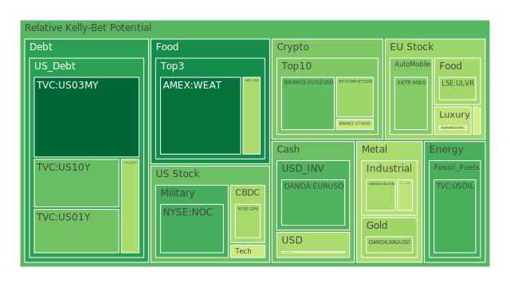
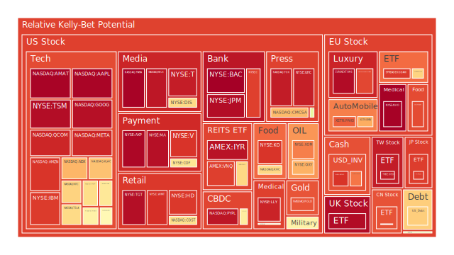
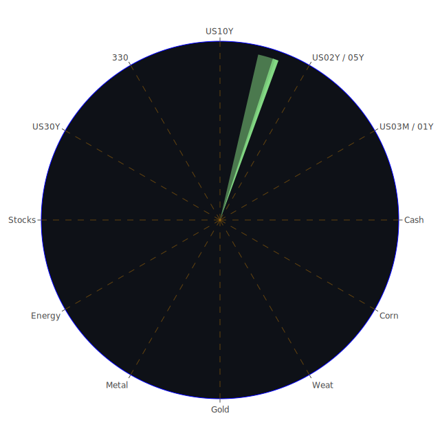

# 投資商品泡沫分析

## 美國國債
在「美國國債」方面，參考近期美債殖利率數據可見，1Y、2Y、5Y、10Y、20Y、30Y等多個年限收益率都有明顯波動，尤其近來報導提到，美國聯準會(FED)資產負債表持續縮表，加上RRP餘額下滑，TGA卻走高，顯示在資金面上有一定程度的收縮壓力。新聞方面，目前市場對通膨、關稅、地緣紛爭等因素存疑，2025年2月22日當天，道瓊指數大跌逾700點，也顯示整體避險需求一度升溫。歷史上，在QE縮減或升息週期末期，若經濟數據欠佳，反而可能讓美債成為一時的避風港。然而，美債本身亦會受到政府舉債水位、政局、債限博弈等牽動，依照既有的博弈論視角，若市場判斷FED不再激進緊縮，長端利率就有下行空間，但若赤字規模太大、債券供給過多，亦可能使得殖利率曲線壓力擴大而推升風險。從泡沫風險角度看，美國國債在當前環境的泡沫度雖相對他類高風險資產低，但長期仍需警惕債券價格波動。回顧2008年金融海嘯前後，美債曾因資金湧入而一度收益率下探，但不代表零風險，後續的財政狀況依舊是關鍵。

## 美國零售股
美國零售股方面，最近沃爾瑪(WMT)釋出較謹慎的銷售前景，導致市場恐慌情緒加劇。2月21日有多家媒體報導，Walmart給出「測度」式展望，並提到電子與一般消費品未來可能會更貴。這種訊號在疫情後期的消費市場不確定性下，容易推升市場的恐慌。另一方面，過去歷史中也曾見到零售股在景氣下行階段持續疲軟，如2000年網路泡沫之後，消費力道曾短暫下降，進而造成零售通路商庫存管理與銷售成長壓力增大。目前根據各種新聞，有關關稅與通膨疑慮或再次影響消費者支出，可能使零售股面臨風險上揚。心理學觀點則指出，若消費者預期價格將更動盪，短期消費可能減少，造成零售股利空加劇。因而此時零售板塊或需謹慎因應。

## 美國科技股
科技股一直以來都極具波動性。新聞報導顯示，特斯拉(TSLA)股價近期承受來自競爭與關稅不確定性壓力，而Meta、Alphabet(GOOG)、微軟(MSFT)等龍頭企業在AI投資與廣告收益調整等動態下，上漲空間雖曾在2024年顯著擴大，但2025年2月22日市場下挫，AI概念股也成為「漲多後被恐慌拋售」的重災區。從博弈論角度，科技巨頭之間的競爭與聯盟時常是此板塊股票重要的價格推手。社會學層面來說，市場對創新技術的「群聚期待」往往於初期帶有爆發性漲勢，但也容易出現高估泡沫。歷史上2000年科網泡沫、2020年疫情初期對雲端、遠端概念的爆炒，都有過類似跡象。目前許多投資機構在新聞訪談中仍表示看好長期前景，但短期波動難免，高風險與高報酬並存。

## 美國房地產指數
根據最新資料，全球商用不動產投資信託紛紛調整評估，如RWO、VNQ、IYR等房地產ETF於報價中顯現一定程度的高風險分數。FED近期固定抵押貸款30年利率約6.85%，較過去幾年的超低利率有大幅上漲，致使按揭成本上揚，購屋需求受到打擊。相關新聞顯示，部分地區房地產成交轉冷，而商辦市場在辦公空間需求轉變的情況下，更出現空置率攀升的狀態。回顧2007-2008年房市泡沫，當時整體槓桿率高、產品結構複雜，最後引發大規模金融風暴。當前局面雖在制度上更嚴格，但升息壓力與後疫情時代的辦公需求不確定，仍構成風險。若失業或消費力道減弱，房地產指數恐進一步下修，需審慎觀察未來數季貸款違約率與商業地產需求。

## 加密貨幣
比特幣(BTC)、以太幣(ETH)、DOGE等於2024年曾一度迎來爆炸性成長，但進入2025年後，根據新聞資料可見，2月22日出現多起負面消息：有加密交易所聲稱遭受15億美元駭客攻擊事件；Bybit被爆出重大攻擊，損失14億美元；若再與「SEC與加密相關爭議」等消息結合，市場情緒迅速轉弱。歷史上，加密貨幣市場常有大漲大跌循環；2017年末、2021年初都曾見類似熱潮與急跌。不少人將此歸因於投機心理及群體追捧行為。從博弈論觀點，加密市場的槓桿配置與多空對賭造就極端波動；從社會學或心理學來看，散戶恐慌與軋空更進一步放大波幅。建議投資人需嚴控槓桿，並注意資金安全性。

## 金／銀／銅
貴金屬金銀，通常被視為避險資產。近期新聞顯示金價正攀升至新高，黃金與白銀的價格與2025年初相比已顯示出較高風險分數，市場普遍因關稅不確定、地緣政治衝突，以及2月22日美股大跌帶動避險需求增強。至於銅則較依賴經濟景氣和工業需求；中國需求下行的傳聞，加上部分新聞指出澳洲與其他國家產量策略調整，使銅價短期波動也不小。回溯以往，金銀在2008年金融危機及2020年疫情初期都曾成為資金湧入的對象，短線大漲後也必然隨市場風向波動。從博弈論角度，若全球局勢動盪持續，金銀避險需求可望延續，但同時要注意「獲利了結」的拋壓風險。

## 黃豆 / 小麥 / 玉米
根據觀測，農產品受到氣候、地緣政策、運輸成本等多方干擾。小麥(WEAT)近期顯示風險指數雖然曾一度升高，但2月21日與2月22日的數據暗示其風險有逐步回落跡象。不過在新聞層面並沒有大規模的供應鏈中斷消息，只是部分市場擔憂經濟衰退恐打擊糧食需求。歷史上，農產品價格容易因天災人禍而瞬間上漲，亦可能因政策放寬和產量提升而快速下跌。例如2012年美國大旱時，玉米等糧食價格飆漲；而近年生質燃料議題也會推升穀物需求。當前情況下，需觀察地緣局勢（如東歐糧倉）、貿易政策、貿易航道是否順暢，以及極端氣候狀況。

## 石油 / 鈾期貨UX
石油價格(OIL)在短期內多次出現震盪，主因包括地緣緊張升溫、不少國家釋放戰略石油儲備或承諾增加產量，而另一方面全球需求預期又因通膨、關稅不確定性、消費動能減緩而放緩，導致供需預期拉鋸。新聞面顯示，美國能源股雖一度相對抗跌，但在2月22日市場大幅回調時也下挫。鈾期貨(UX)則與核能需求、地緣政治局勢、各國能源政策緊密相關，目前整體風險評估雖不至於極端，但若俄羅斯或中東地區發生新一波動盪，核能話題可能再度引發波動。回顧1970年代石油危機或2011年日本福島事件，石油與核能話題往往在情緒與政策互動下展開大幅波動。

## 各國外匯市場
主要關注美元、歐元(EURUSD)、日圓(USDJPY)、澳幣(AUDUSD)、英鎊(GBPUSD)等。2月22日數據顯示，英鎊對美元匯率仍在1.26-1.27區間，但波動度有所增加。歐元在1.04-1.05之間震盪，與新聞中提及歐洲整體經濟動能不足有關。回顧歷史，外匯市場容易被貿易狀況、利率政策以及市場風險偏好左右。2025年新聞指向歐洲勞動力短缺、通膨仍未充分平抑，民粹與地緣不安加劇匯率波動；加上FED動向尚不明朗，使美元短線仍可能保持較強勢或反覆震盪。外匯往往適合短線博弈或對沖，長期投資者需留意國別政策變動風險。

## 各國大盤指數
觀察例如美國S&P 500、NASDAQ 100(NDX)、道瓊工業指數、德國DAX(GDAXI)、法國CAC(FCHI)、英國FTSE、日本日經225(JPN225)、以及中國滬深300(000300)等。2月22日，美股整體走跌幅度顯著，NASDAQ 100過去數月受AI題材推升而屢創高點，現在面臨估值壓力與賣壓回吐。歐洲方面，勞力短缺及經濟增長放緩，中東歧見和烏俄局勢又增加了變數；新聞多次報導各國經濟前景持續遭受不確定性考驗。回顧歷史，全球指數在政治與經濟局勢穩定時往往同步水漲船高，但在金融危機及地緣大事件衝擊時也可能同步大跌。近期在社會心理層面，對衰退、關稅的擔憂可能加大，且隨著企業獲利預期下修，相關指數波動仍大。

## 美國半導體股
半導體產業前期在需求激增下庫存嚴重積壓，之後出現急速調整的週期特性。新聞報導中，Nvidia(NVDA)、AMD、Intel(INTC)、Micron(MU)等皆受到AI服務器、資料中心需求的正面影響，但同時面臨終端PC市場放緩、手機需求疲弱等負面衝擊。近來關稅議題也屢被提起，若中美科技對峙升溫，半導體企業可能在供應鏈端受到壓力。歷史上，半導體屬於典型景氣循環行業，1990年代末、2000年網路泡沫、2008年全球金融危機、2020年疫情爆發時都曾大漲大跌。從經濟學與博弈論立場看，寡占龍頭彼此之間在技術與市佔角力下，易帶來股價極端波動。若AI技術落地不及預期，也可能引發一段較長的修正期。

## 美國銀行股
美國銀行股(JPM、BAC、C等)近期新聞多提到放款與貸款違約比率，銀行遭受消費者信用卡違約與商業地產壓力。FED資金回收、貨幣緊縮或量化緊縮餘波持續影響銀行體系。回溯2008年金融危機教訓：銀行槓桿與信用擴張往往在繁榮期累積風險，一旦景氣逆轉，容易爆發系統性問題。2025年2月的消息指向某些銀行上季獲利表現不如預期，而IRS人手不足、追稅恐減少的消息，也可能間接影響銀行稅務收支面。整體來看，由於銀行系統關乎金融運作核心，一旦風險釋放，市場波動將更劇烈，投資者不應輕忽。

## 美國軍工股
軍工股(NOC、LMT、RTX等)先前因地緣衝突與國防預算增加而有漲勢。然而，近期出現「特朗普政府或削減部分國防預算」的相關報導（新聞指出Palantir、國防資訊預算可能遭砍），引發市場對於軍工股的成長性質疑。歷史上，軍工股常與地緣局勢和政府預算緊密綁定。例如2018年時美國主張提升軍費開支，帶動一波軍工股熱潮；若政策轉向或削減，該板塊會立刻面臨調整。從社會學與心理學的角度看，地緣緊張消息容易讓投資人將錢投入軍工股，而軍工預算與國防需求的真實落地，則是理性評估的關鍵。當前若2025年的外交環境有變，預算增長放緩或壓縮，也可能產生風險。

## 美國電子支付股
電子支付股(PYPL、Block(SQ)、Visa(V)、Mastercard(MA)等)，在疫情期間一度受惠於線上交易爆發，但現階段若經濟成長不如預期，消費支出減弱加上市場競爭激烈，該板塊容易迎來獲利壓力。近期新聞顯示Block因財報不及預期而股價大跌，又遇到全市場風險偏好急劇轉弱，使得支付股整體面臨修正壓力。回溯過去，支付產業受金融科技趨勢驅動，但也曾因監管、資費、資安等議題多次波動。例如2018年歐盟推行PSD2等新規，市場一度憂慮成本上升。當下在關稅、通膨、AI技術投入與競爭種種因素干擾下，仍需觀望下一輪創新或盈利模式變化。

## 美國藥商股
藥商(MRK、JNJ、LLY等)屬防禦性質行業，過往在市場震盪時常有相對抗跌的表現。不過2025年2月以來，根據新聞顯示，部分藥商股價出現漲跌互見：有些因疫苗、專利到期、研發結果、市場競爭等原因，獲利預測動向不一。歷史上，藥廠股價常伴隨臨床試驗結果而大幅波動。從心理學層面來說，投資人對於防禦性產業在高通膨、經濟衰退預期的情況下，會有一定偏好；但同時面臨專利懸崖與競爭的風險。需要關注政府醫療保險改革、藥價管制等政策性因素，這些也是社會學的要點，往往透過政治角力影響股價。

## 美國影視股
迪士尼(DIS)、Netflix(NFLX)、康卡斯特(CMCSA)、派拉蒙(PARA)等。近期消息稱Meta削減員工期權、以及流媒體產業競爭加劇，影響整體科技娛樂類股市值。Netflix在2024年飆漲後，當前風險係數顯示已相對高企，若經濟走弱或家庭支出縮減，訂閱成長恐放緩。回顧2008年金融危機和2020年疫情初期，大眾在經濟壓力下，娛樂支出及消費頻道會因財務壓力而調整，股價往往隨市場情緒波動。以社會學角度言，民眾對於宅經濟平台的黏著度頗高，但對價格敏感度亦上升。投資人可留意廣告收入、會員費模式轉變，以及新興競爭者介入的衝擊。

## 美國媒體股
美國媒體股如Fox(FOX)、New York Times(NYT)等，同樣受到廣告市場景氣與政治氛圍影響。過往在選舉年或重大新聞衝擊時，媒體收視與訂閱常出現劇烈變化。近期新聞提到NYT股價等也有顯著波動，恐怕與廣告收益壓力、網路媒體分流以及經濟數據轉弱相關。歷史上，媒體產業在數位轉型過程中面臨印刷與紙媒訂閱下滑，廣告收入模式多次被衝擊。如今再度碰上經濟放緩的可能，加上網路社交平台演算法更新，市場結構或再次洗牌。從博弈觀點來看，新舊媒體在網路與流量分配的版圖對峙激烈，衍生出新的投資不確定性。

## 石油防禦股
石油防禦股(XOM、OXY等)指綜合石油生產與下游產業鏈具相對防禦力的標的。新聞顯示，2025年2月後，能源股一度成為市場較為強勢板塊，但2月22日因市場全面拋售而承壓。若油價後續繼續維持相對高檔，石油公司利潤有支撐；但若經濟衰退加深，需求萎縮，股價將面臨修正。回想1970年代石油危機或2014-2016年國際油價崩跌，都曾在短期造成油商股大起大落。當前既有理論中，石油需求主要和GDP成長高度相關，也受到地緣或OPEC+協商結果影響。可作為對沖通膨的題材，但需提防國際政治糾紛帶來的波動風險。

## 金礦防禦股
金礦防禦股(RGLD等)與金價的走勢息息相關。新聞指出，美股的走空與對經濟的不確定性，再度推升對黃金的需求，金礦股往往受金價上漲提振而攀升。然而金礦企業的生產成本、礦區風險、政治法律環境也會影響淨收益；例如過去某些企業在地緣衝突或疫情期間面臨停產或成本飆高，而使獲利不如預期。回顧2008年金融海嘯以及2020年疫情初期，金礦股因市場避險而大漲，但之後又可能因獲利回吐而出現較大波動。從博弈論看，金礦企業之間在併購與產能調節中也會彼此競合，對金價產生不確定性。

## 歐洲奢侈品股
歐洲奢侈品(如LVMH、Kering等)在2024年因亞洲與美國市場需求反彈而大漲，但2月22日的波動暗示可能已到估值調整階段。新聞顯示，消費者對奢侈品需求仍相對穩定，但若美國對中歐實施新關稅或地緣局勢惡化，出口管道與市場需求將打折扣。歷史上，奢侈品市場曾在2008年金融風暴受到衝擊，但高端消費的抗跌力亦較一般消費品強。心理學層面，奢侈品象徵財富與身份地位，於經濟不確定時依然可能維持部分忠實客群。但若失業率攀升、股市長期下跌，奢侈品股不可避免也會受到需求減少的壓力。

## 歐洲汽車股
歐洲汽車業(BMW、Daimler(MBG)等)深受全球經濟景氣、供應鏈和關稅政策影響。新聞提到，中國與歐洲之間是否重新修訂貿易協定，對德系車企非常關鍵。回溯2018年中美貿易衝突初起時，歐系車企在美國市場一度面臨關稅威脅，股價重挫。現在若再度爆發關稅爭端，在電動車轉型與原材料短缺下，汽車股的風險上揚。社會學視角指出，歐洲「綠能轉型」政策相對積極，也會改寫汽車產業佈局，保守或行動慢的車廠恐受市場淘汰，投資人對該領域須保有長期觀察。

## 歐美食品股
可留意可口可樂(KO)、聯合利華(ULVR)、雀巢(NESN)、Kraft Heinz(KHC)等大牌消費食品企業。過去曾是防禦性資產，但2月22日數據顯示，部分公司因原物料、人工成本上升，風險係數仍在累積。新聞中也見到管理層對未來市場不確定性做出保守指引，甚至有報導提到某些企業在推行多樣化或國際化策略時的成本增加。歷史上，食品股雖在經濟逆風時展現一定韌性，但若通膨過高、需求放緩，獲利空間仍會壓縮。博弈論上，各品牌大廠以廣告、價格與市場佔有率競爭，僅有少數真正壟斷型企業能順利轉嫁成本，因此仍需慎思定價能力與現金流。

---

# 宏觀經濟傳導路徑分析
就宏觀來看，當前市場正同時面臨：  
1. 聯準會等主要央行動向不確定：RRP餘額與TGA走向，顯示資金供給與需求微妙角力。  
2. 關稅與地緣政治風險：新聞接二連三地報導「關稅再起」或「地緣衝突升溫」，衝擊全球貿易流動、外匯與資本市場。  
3. 全球債市與利率曲線扭曲：長短端利率之間差距縮小，但已略微翻正，顯示未來的衰退機率與時程仍有分歧。  
4. 消費市場轉弱跡象：零售商、運輸類股普遍喊出疲弱指引；若就業數據配合度高，或將帶動整體消費與信心指數持續下行。  
5. 能源與糧食價格波動：石油、金銀、農產品等資源若持續劇烈波動，通膨可能再度被推升，反過來影響貨幣政策制定。  

簡言之，這些變量相互疊加，引發全球資金流向的快速轉變，進而影響多種資產價格，展現了經濟學層面「正－反－合」的博弈：貨幣收緊(正)，成長放緩(反)，尋找平衡(合)。

---

# 微觀經濟傳導路徑分析
微觀層次則表現在企業獲利與消費者行為：  
1. 企業端：若關稅成本增加或全球訂單下降，企業利潤空間壓縮；部分公司或將採取裁員或調整策略。新聞中可見美國IRS裁員與各類企業布局縮手的跡象，一旦供應鏈再出現瓶頸，對內部成本與外部定價均有衝擊。  
2. 消費者端：失業陰影或物價攀升導致消費支出轉向、防禦性消費增強(減少奢侈品與非必需品消費)，拉低零售、旅遊、娛樂、耐久財需求，但可能保留部分必需食品與醫藥保險相關支出。  
3. 投機與恐慌心理：金融市場中，散戶追漲殺跌心態強烈，特別在新聞顯示AI類股可能遇挫或加密貨幣出現大規模駭客攻擊後，資金恐陸續退出高風險市場，進而轉往黃金、美債等避險標的。  
總體而言，在微觀面，企業、個人消費與市場投機的決策均受到政策、新聞事件的影響，往往快速反映在股價與商品價格上。

---

# 資產類別間傳導路徑分析
1. **債券與股票**：當通膨與經濟成長預期轉弱，市場可能從股票撤資投入債券，帶動債券價格暫時走高。若政府財政惡化或升息壓力增強，則債市也可能同步下跌。  
2. **股票與大宗商品**：地緣不確定與關稅爭端可能推高原物料成本，企業利潤遭壓縮，進而影響股市；通膨升溫下，原物料本身價格常出現大漲。  
3. **匯率與跨國企業獲利**：若美國升息趨緩，美元相對走弱，可能利多美國出口商，但國外競爭者也將陸續調整策略，形成博弈。  
4. **避險資產(黃金、瑞郎等)與高風險資產(科技股、加密貨幣)**：通常在市場恐慌時，資金湧入避險標的；但一旦情緒平復，可能再度回流高風險高報酬的市場。  
5. **地緣政局對軍工、能源、農產品的外溢效應**：任何地緣衝突升溫都會推升軍工與能源價格，衝擊整體成本結構並引發全球市場連鎖反應。  

從空間(不同市場、國家區域)到時間(短期恐慌、中期政策、長期結構調整)，以及概念(避險、風險、槓桿、政治博弈等)，這些環環相扣，同時塑造了交易行為的「正(長期成長)－反(短期拋售)－合(估值與政策再平衡)」演化。

---

# 投資建議

根據以上三位一體的綜合分析，並嘗試以相關係數約-0.5、相位120度為目標，做出以下三種類型投資組合建議，盡量涵蓋穩健、成長與高風險三大方向，各以「總配比=100%」為原則。此處所謂比重僅為示意，並非絕對指引。

1. **穩健型(約40%)**  
   - （A）美國短天期國債：佔穩健組合15%。短天期國債相較長天期受利率波動影響較小，具有相對穩定收益。  
   - （B）黃金實體或金礦股：佔穩健組合15%。在通膨與地緣風險並存時，作為避險與價格支撐的資產。需注意金價因獲利回吐而產生的短線波動。  
   - （C）大型必需消費品企業(例如可口可樂、雀巢等)：佔穩健組合10%。防禦特性較強，即便經濟放緩也能保持一定銷售。

2. **成長型(約40%)**  
   - （A）美國科技龍頭：佔成長組合15%。如微軟或Google等在AI、生態系佈局更廣泛的企業，承擔一定短期波動風險，博取長期增長潛力。  
   - （B）歐洲奢侈品或奢侈品ETF：佔成長組合10%。近年亞太市場需求仍具潛力，若地緣衝突減弱，消費力可回暖。  
   - （C）半導體產業：佔成長組合15%。AI發展和5G、雲端都仰賴晶片，儘管短期調整較劇烈，但長期仍是主要驅動力。

3. **高風險型(約20%)**  
   - （A）加密貨幣：佔高風險組合5%。雖波動性極大，但可視為分散性標的的一環，重點在控制倉位。  
   - （B）新興市場高收益債或股票：佔高風險組合10%。尋求較高收益，同時承擔政治與貨幣風險，適合經驗豐富投資人。  
   - （C）軍工股或原油相關標的：佔高風險組合5%。地緣局勢反覆，但若衝突升溫或國防預算仍維持，短期可能有波段機會。

以上比例旨在呈現多元分散原則，並以「相位錯開、相關係數盡量負相關」為出發點。此舉意在同時保有避險緩衝與成長潛力，並避免單一板塊大跌時對整體組合的毀滅性衝擊。

---

# 風險提示

投資有風險，市場總是充滿不確定性。歷史經驗顯示，任何看似安全的資產都可能面臨結構性或突發性風險；高風險產品也可能帶來極佳的報酬，卻需充分承擔價格劇烈波動與潛在杠桿壓力。尤其在2025年2月22日，市場因通膨疑慮、關稅爭端、地緣政治動盪以及部分企業財報不理想而大幅下跌，顯示恐慌情緒可能加快傳導到各類資產。新聞裡不乏加密貨幣被駭、能源供給與需求矛盾、社交媒體罰款與法律風險，以及地區衝突持續升溫的訊息，各種泡沫風險絕不容忽視。

此外，報告中所提及之資產與配置建議，僅為提供思考架構與潛在機會，並非保證一定可獲利。投資者須依個人財務目標、風險承受度、資金流動性需求以及對市場的研究程度，做出獨立判斷。任何單一資產若出現估值失控、政策突變、重大意外事件，都會破壞整體組合的平衡，因而最好持續關注全球財經新聞與重要數據的變化動向，也要盡量保持足夠的現金部位或安全資產來應對突發狀況。

在此強調，泡沫風險最高的標的必須警惕。儘管市場不斷演化，但歷史往往會重演：亢奮時資金瘋狂湧入，當潮水退去往往出現淒慘的泡沫破裂。投資者若能在「正－反－合」的思維下評估各種可能路徑，並在空間、時間與概念三個層次上全面考量，方能在機會與風險的交錯中謹慎前行。切記，在面對短期價格暴漲或災難性下跌的行情時，都務必冷靜評估基本面與資金管理，不宜盲目追逐或恐慌拋售。請投資者多加衡量自身風險承受能力，再行進場或調整部位。

總結而言，當前環境複雜多變，宏觀縮表與地緣政治緊張同步存在，高通膨與需求不振同時糾結，企業財報不一致而新聞訊息紛雜；在此之下，透過三位一體正反合的思維、多層次的觀察、以及對沖組合的靈活配置，方能於波動市況中尋找可能的漣漪效應與投資機會。然而，再周詳的策略亦無法迴避市場突如其來的黑天鵝；敬請投資人秉持理性、持續關注市況、研判新聞事件真實影響並保留適度安全邊際，穩定前進。祝投資順利。  

 
Daily Buy Map:

 
Daily Sell Map:

 
Daily Radar Chart:

 
