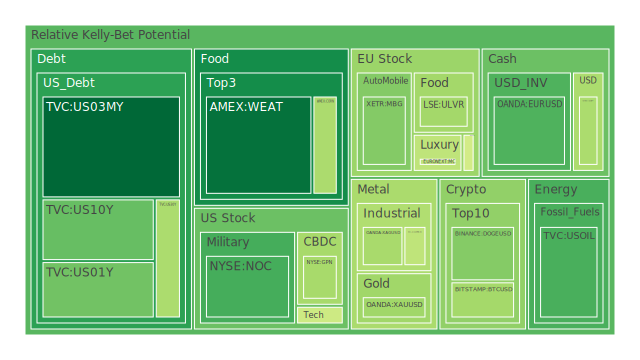
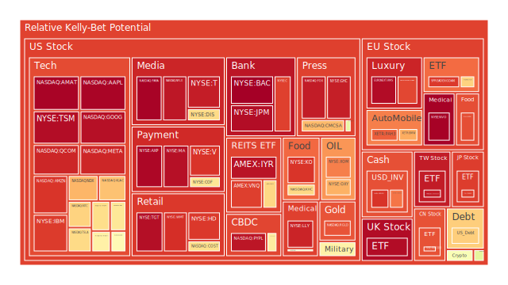
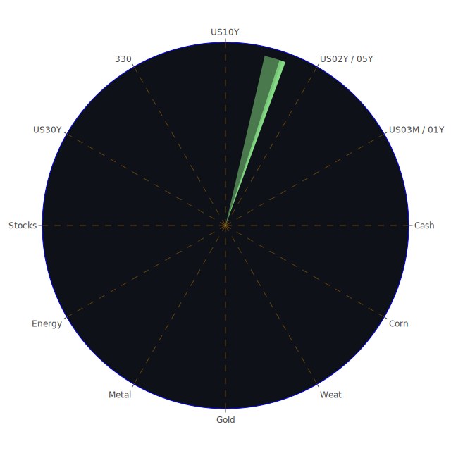

# 一、前言與整體背景

2025年2月下旬，全球金融市場動態持續面臨多重因素交織。一方面，美國聯準會（FED）相關數據顯示，其資產負債表與RRP水位正逐漸下降，而美國國內多項經濟數據（包含Charge-off Rate on Credit Card、Commercial Real Estate Delinquent等）卻有走高趨勢，暗示著消費者信貸與商用不動產市場的壓力增溫。另一方面，在政治與國際新聞方面，貿易關稅、地緣爭端、各國之間的航空與鐵路、港口等基礎建設話題，正於媒體報導中反覆出現，為市場整體情緒帶來時好時壞的波動。

外匯市場也呈現相當微妙的結構變化，數據顯示OANDA平台上的EURUSD、AUDUSD、GBPUSD等主要貨幣對，短期或中期皆可能因國際貨幣政策趨勢與通膨預期出現較大波幅。商品市場方面，金價（XAUUSD）相對石油（USOIL）、銅（COPPER）之比率明顯走升，顯示能源與金屬價格可能受到地緣緊張情勢以及新一輪保護主義浪潮的影響。

美國國債殖利率曲線則持續面臨一定的倒掛或低斜率狀態：2年期、3個月期等短年期利率高於10年期或20年期利率曾是2024年到2025年之間多次媒體討論的焦點。最近統計顯示，10年期與3個月期利差約0.12，與前幾個月與過去一年相比有正向修正，但仍未回到過去常見的「正常化」水平。

新聞脈絡上，市場情緒多半顯現「負面」訊息居多。例如：多起歐美與中東地區的地緣政治突發事件、各大企業的獲利預警、通膨或關稅的不確定性、科技巨頭配股與裁員計畫，以及關於AI研究、加密貨幣交易所出現龐大駭客事件等等，都在新聞裡讓投資人神經緊繃。在此背景下，對於各類資產之泡沫分數（D1、D7、D14、D30）也顯示出多半還處於中高檔或甚至接近高檔，需要相當的警惕。

以下報告將採取「空間（Spatial）、時間（Temporal）、概念（Conceptional）」三位一體分析，透過三位一體「正—反—合」的思考，提出最簡練而具體的結論。但為了滿足闡述之完整性，我們仍會在文本中展開相應的細節探討，而不以表格的形式呈現。最後，將綜合所有所觀察之風險對沖機會，並針對多項資產之間可能存在的漣漪效應進行推演。

---

# 二、空間（Spatial）維度之三位一體分析

「空間」主要著眼於同一個時間點上，不同地區、不同市場板塊，以及不同新聞情緒如何交織影響價格。可從經濟學、社會學、心理學、博弈論角度做大膽假設。

1. **經濟學假設：**  
   在同一時點裡，無論是美國本土或歐亞區域，都面臨因關稅、通膨壓力、利率波動而使消費者支出可能持續下修的風險。新聞中如「美國大型零售商對2025年銷售表現預期偏保守」、「歐洲國家因能源價格可能再次上揚」等，都讓市場人心思動。博弈論觀點認為，若各國都提高關稅，以保護內需或特定產業，將導致多重報復循環，不僅原物料價格動盪，貨幣市場走勢亦難以趨於穩定。這一連串因子在空間面上放大了全球聯動的特性。

2. **社會學假設：**  
   從空間觀點來看，新興市場與已開發市場之投資行為深受媒體氛圍所塑造。報導中負面訊息（如公司獲利下滑、恐怖襲擊、地緣衝突）相對集中，造成社群與投資人「羊群效應」的恐慌擴散。此類恐慌有時會觸發資產拋售、資金驅趕至較保守的標的，包括美國國債、黃金、黃豆、小麥之類具有避險或民生屬性較強之商品，也或將推動部分資金湧入防禦性個股（例如軍工股、金礦股等）。

3. **心理學假設：**  
   空間層面裡，人們在情緒受到負面新聞影響下，更容易出現一致性預期：假如認定短期風險尚高，則會在各地市場同時進行資金撤出，即使部分資產的基本面未見嚴重惡化，仍會被理所當然地賣出。或反過來，若負面情緒達到飽和，市場也可能進行所謂的「超賣後反彈」博弈。

4. **博弈論假設：**  
   由於許多國家在地緣爭端或貿易摩擦的拉鋸中，短期無法順利協商出雙贏局面，投資人將在空間維度裡考量「別人會怎麼動」，繼而選擇最符合自身利潤與風險控管的決策。局部區域之債券（例如歐洲、東亞）可能成為套利資金與短線避險資金的流入目標，但也面臨政策突變風險。

於空間面，「正—反—合」可以極簡表達為：  
- 正：全球化下的聯動擴張，財富與風險同步擴散。  
- 反：高牆關稅與地緣衝突在多國蔓延，引爆資金碎片化與恐慌蔓延。  
- 合：形成區域性防禦集群與部分逆勢資金暗流，共同在短期行情裡尋求另一階段平衡。

---

# 三、時間（Temporal）維度之三位一體分析

「時間」聚焦於市場動態在歷史脈絡到未來預期的演進，強調短、中、長期不同事件如何影響市場定價，並運用經濟學、社會學、心理學與博弈論作出可能的未來推論。

1. **經濟學：**  
   短期來看（未來數周至一季），受到新聞負面情緒與FED資產負債表變動加速縮表、貨幣市場流動性減少等衝擊，美股或全球股市都可能維持震盪。中期（半年至一年），市場將密切觀察房地產與消費信貸呆帳是否繼續攀升。美國的泡沫分數顯示很多科技股、支付股、醫藥股都在高檔，需留意若企業獲利未如預期，就容易觸發估值重估。長期（兩年以上），若各種保護主義政策仍反覆操作，世界供應鏈或將進一步區域化，也會影響各資產類別之交互關係。

2. **社會學：**  
   歷史上曾出現類似貿易爭端與地緣衝突同時升溫的時期，例如2018年至2020年間的中美貿易摩擦，或2022年俄烏戰事延燒所引發的通膨飆升。若從「集體創傷與復原」的理論來看，市場往往會在短時間經歷嚴重恐慌，但一旦資金與政策逐漸適應，就可能進入暫時的「風平浪靜期」。然後，只要再度出現決定性負面因素，投資市場又會急轉直下。這種週期性在疫情爆發初期與後疫情時代也都曾見證。

3. **心理學：**  
   就時間層面而言，人們傾向過度放大近期事件的重要性，這稱之為「近期偏差」（Recency Bias）。因此，當2月下旬連續幾日的負面新聞壓力放大，可能出現加速殺盤。而一旦市場情緒沈澱，若3月或4月出現通膨有所緩解、美國零售業回暖等正面消息，便有機會提振買盤。但投資人容易忽略中長期的結構性問題，例如企業獲利或債務風險，並因短期利多消息而盲目樂觀。

4. **博弈論：**  
   以時間為軸，投資人會試圖預測「下一步」的他方行動，包括貨幣政策是否轉向、地緣衝突是否擴散、市場主要資金是否續抱高泡沫類股等等。若大多數人預期FED暫緩升息，則科技與成長型股票短期或許有一波反彈。相對的，若官方數據再度顯示通膨抬頭，FED與各國央行立場轉鷹，又將引發多空交戰。

於時間面，「正—反—合」可概括：  
- 正：通膨若下行，則市場會迎來一段相對緩衝與企業估值修復期。  
- 反：一旦再爆發關稅、地緣、金融槓桿等衝擊，市場恐慌來得又急又猛。  
- 合：最終在利率與通膨達成新均衡後，市場價值終究向基本面靠攏，但衝擊過程充滿變數。

---

# 四、概念（Conceptional）維度之三位一體分析

「概念」強調市場與新聞背後的意識形態、規則與投資行為框架，以及理論之外可能存在的未知影響。

1. **經濟學：**  
   從概念層次看，市場之間互相串連已非單純「風險分散」或「風險集中」的二元概念，而是大量衍生商品、ETF、槓桿工具之交織。例如，「美國房地產指數」與「VNQ」等房地產ETF，背後牽涉許多房貸證券化、新型態抵押商品。當概念複雜度提高，系統性風險便更難被單純模型捕捉，容易出現「黑天鵝」或「灰犀牛」事件。

2. **社會學：**  
   媒體與社群平台在概念構建上扮演關鍵角色。新聞報導若將某些趨勢（例如AI、綠能、元宇宙）反覆提及，就可能形成投資人集體想像，大量湧入該領域。當實際獲利模式尚未穩定時，巨量資金的湧入會拉高泡沫分數。加密貨幣世界裡也有類似現象，如DOGEUSD、ETHUSD、BTCUSD等，在社群熱度與媒體渲染下更易價格暴漲暴跌。

3. **心理學與博弈論：**  
   概念層面下，投資人往往希望找到「未來十年顛覆世界」的新題材，而忽略市場過度擁擠帶來的風險。博弈論提示若多數人都相信「長期一定向上」，那麼短期泡沫反而會越吹越大，但一旦人群的風向逆轉，跌幅也將同樣劇烈。

於概念面，「正—反—合」可歸納為：  
- 正：新科技與新理念若得到持續驗證，的確能創造可觀投資收益與社會進步。  
- 反：意識形態若脫離實體經濟基礎，資金瘋狂炒作會迅速累積泡沫。  
- 合：市場最終在「真實落地的應用」與「投資熱潮的幻滅」之間取得一個長期平衡。

---

# 五、整合三位一體之正反合（最少文字凝縮多重意義）

以下以最簡練方式，結合空間、時間、概念三個維度，以「正—反—合」的角度總結：

- **正（積極擴張）：**  
  全球資本與資訊在地理、時間與想像力上高度交織，創造新興機會與繁榮。  
- **反（衝突震盪）：**  
  關稅、地緣、情緒、理論盲點交互干擾，資本市場產生深度動盪與泡沫。  
- **合（動態均衡）：**  
  透過不斷的利率、政策、心理調適，市場終將收斂於新平衡，但其間震盪風險巨大。

---

# 六、風險對沖的各種投資組合機會（相位盡量滿足120度、相關係數約-0.5）

在尋找「相位差約120度，相關係數約-0.5」的投資組合時，我們希望不同資產之間在週期與風險上具有部分對沖功效。透過此前提，嘗試舉例：

1. **能源 vs. 金屬 vs. 防禦性債券：**  
   - 能源（例如原油或石油相關標的，如USOIL、XOM等）泡沫分數在0.7至0.8上下，短期新聞提到「油價受地緣不確定支撐」但又有「需求減弱」風險。此類資產屬於週期敏感，若經濟向好，油價上行；若經濟下行，需求縮減，價格走跌。  
   - 金屬（如黃金XAUUSD、白銀XAGUSD、銅COPPER）則大多扮演避險或工業需求指標作用，當政治動盪時，金銀可能上揚；景氣回溫時，銅或產業金屬得利。  
   - 防禦性債券（如美國國債），在市場恐慌時具資金避風港的功能，然而殖利率曲線近期仍處於扭曲狀態，要謹慎挑選期限。

2. **消費必需品 vs. 科技成長 vs. 加密貨幣：**  
   - 消費必需品類股（如可口可樂KO、沃爾瑪WMT等）通常和景氣有較低敏感度，但若通膨、關稅造成成本上升，獲利亦會被侵蝕。  
   - 科技成長股（如AAPL、MSFT、AMD等）普遍D1或D7泡沫分數顯示偏高，一旦市場調整，短期跌幅可能凌厲。但若市場期待利率趨緩，成長股又可能帶起反彈。  
   - 加密貨幣（BTC、ETH、DOGE等）與傳統資產關聯度時高時低，但「非主權貨幣」概念使其受地緣政治與貨幣政策衝擊的方式與傳統市場不同。若配置比例恰當，能提供與股票和商品不同的風險敞口。

3. **穀物農產品 vs. 半導體 vs. 房地產REITs：**  
   - 農產品（如黃豆SOYB、小麥WEAT、玉米CORN等）不僅和天氣、地緣衝突、運輸航道緊張相關，也常受投機資金青睞，其波動節奏較商品、科技股不同。  
   - 半導體股（如NVDA、AMD、MU等）高度受需求端景氣影響與博弈論下的全球產能佈局。其泡沫指數顯示大都高於平均，需要注意產業景氣循環的峰谷期落點。  
   - 房地產ETF（如VNQ、RWO、IYR等）可視作對動盪市場的一種多元配置，但也會面臨利率攀高與信用違約的雙重衝擊。

若善用這幾個大方向資產間的週期差異與負相關性，整體投資組合可望在多空循環間降低波動。然而這種「理想相關係數」僅是一種假設，實務操作仍得隨時追蹤各標的之季報、新聞以及流動性，以動態調整持倉比例。

---

# 七、兩兩相互驗證的篩選假設分析與漣漪效應傳導路徑

在具體操作上，投資組合不僅要考量單一標的內在基本面，也要比較資產彼此可能誘發的傳導效果：

- **美國國債與美國零售股：**  
  當FED保持緊縮姿態或市場恐慌升高時，資金或由股票流出轉進美國國債；若經濟數據好轉，零售股反彈，國債需求下滑。兩者有顯著跷跷板效應。
- **美國科技股與加密貨幣：**  
  兩者皆受到投機資金驅動。若科技公司財報失色，加密貨幣可能因資金避險需求暫時獲得青睞，也可能因整體風險趨避情緒而同跌，需視市場敘事而定。
- **石油（或能源股）與黃金：**  
  若地緣衝突升高，石油與黃金可能同漲；若衝突趨緩，油價與金價或雙雙回落。此時看聯準會貨幣政策對黃金需求的影響尤為重要。
- **半導體與房地產REITs：**  
  半導體景氣常先於整體經濟循環而行，若晶片需求下滑，代表下游消費或企業支出出現瓶頸，進而影響房地產需求、就業市場等，連帶衝擊REITs之租金收入與估值。
- **黃豆/小麥等農產品與各國外匯市場：**  
  若主要糧食出口國貨幣有大幅波動（例如巴西雷亞爾、澳幣），可能影響全球農產品報價。加上天候因素、國際衝突等，都能帶動糧價飆漲或暴跌。
- **銀行股與軍工股：**  
  一旦金融體系緊張升溫，銀行股可能壓力巨大，而軍工股常因地緣不確定性而異軍突起。反之，金融穩定時，銀行股收益提升，軍工股若無重大衝突題材則溫和整理。

從這些例子中可看出漣漪效應：某個產業或資產的下跌，可能透過就業、融資、供應鏈等路徑波及其他類別；或某些避險性資產因上述動盪而受益。這些路徑常在新聞中的合併佈局與歷史相似事件裡留有蛛絲馬跡（例如歷次大型衝突或關稅升溫，資金往往流向黃金、防禦股；科技泡沫時期則常見大起大落）。

---

# 八、各資產類別泡沫分析（引用新聞、歷史場景與專業論述）

以下依序對列舉的各類資產進行概括論述，並援引當前數據及歷史相似情境。為簡化敘事，本報告忽略券商名稱，只描述資產名稱：

1. **美國國債**  
   現時泡沫分數相對中性，但因殖利率曲線扭曲，長天期（10Y、20Y、30Y）殖利率在4.4%至4.7%多區間徘徊。若FED確定放緩緊縮，美國國債價格可能反彈；若通膨再次惡化，則債券空頭再起。歷史上，在2008年金融海嘯時期，美國國債曾是全球資金強力避險的選擇。

2. **美國零售股**  
   近期新聞顯示，大型零售商對2025年銷售成長較謹慎，並強調庫存管理壓力。泡沫指數並不算極端，但公司獲利面可能受成本壓力衝擊。在2001年網路泡沫破裂後，美國零售板塊曾一度相對抗跌，但若經濟衰退加深，零售股仍會受到衝擊。

3. **美國科技股**  
   許多重量級科技股（AAPL、MSFT、GOOG、META、NVDA等）日常泡沫指數維持在偏高水準。新聞報導指出，市場對通膨與利率仍有顧慮，且裁員與配股不時出現。歷史上如2000年科網泡沫破裂就是典型教訓，一旦利率高企或獲利不及預期，估值下修速度可十分驚人。

4. **美國房地產指數**  
   包括一些房地產ETF（RWO、VNQ、IYR）在內，近期泡沫指數顯示接近或超過0.85以上，警訊並不低。新聞裡提到商用不動產、房貸貸款逾期率走升，在利率居高不下情境下，房地產市場下行風險不可忽視。

5. **加密貨幣**  
   BTC、ETH、DOGE等各有波動特性。新聞亦指出有交易所被駭客大規模攻擊以及監管不確定性，投資人應密切注意流動性風險。歷史上2017年末至2018年的加密崩盤便是先例，高風險高報酬，建議只佔整體資金一小部分。

6. **金 / 銀 / 銅**  
   金銀的泡沫分數走高，部分因地緣與經濟動盪帶來的避險需求，也反映在新聞裡「金價創新高」、「市場對戰爭與通膨的擔憂」等情緒。銅則屬工業金屬，與全球製造業榮枯息息相關，目前泡沫指數也不低，短期需留意中國或歐洲製造業恢復程度。

7. **黃豆 / 小麥 / 玉米**  
   SOYB、WEAT、CORN等價格易受氣候、地緣、貿易政策（如關稅與農業補貼）影響。歷史上，若大宗商品市場進入一輪升勢，糧價走勢常會跟隨能源、金屬整體輪動而漲。這些資產也具對沖通膨的效果。

8. **石油 / 鈾期貨（UX1!）**  
   石油市場目前受到OPEC+政策與地緣政治因素左右，新聞頻繁提及「供應不確定雲霧」。通膨若走緩則需求可能放慢。鈾期貨（UX1!）相較冷門，但若核能在能源轉型中地位上升，需求有長期支撐，短期亦可能遭受地緣衝突或礦產安全議題衝擊。

9. **各國外匯市場**  
   歐元、日圓、澳幣、英鎊等主要貨幣兌美元之走勢，既受本國央行政策亦受國際資金風向影響。新聞中多次提及關稅與地緣議題，都易在匯市激起短期波動。歷史證明，1997年亞洲金融風暴、2015年瑞郎黑天鵝等，都顯示外匯槓桿風險巨大。

10. **各國大盤指數**  
   包含NASDAQ指數（NDX）、德國DAX（GDAXI）、英國FTSE、法國FCHI、中國滬深300（000300）、台灣加權指數成分股（0050）等，泡沫分數大多偏高或極高，如FTSE、台灣50在0.97以上，顯示高估值風險累積。新聞顯示部分地區政局與貨幣政策有不確定性，投資人需隨時警惕。

11. **美國半導體股**  
   AMD、NVDA、MU等數據皆顯示中高泡沫分數，背後涵蓋AI晶片、運算、資料中心需求等題材，但若景氣循環進入下行段，或企業資本支出大幅下修，將出現評價修正。2000年科網泡沫破裂後，半導體也曾大幅震盪。

12. **美國銀行股**  
   C、JPM、BAC等銀行股近期在新聞裡涉及房貸、信用卡帶來的壞帳風險攀升。若經濟環境再度惡化，銀行業獲利與股價勢必受到衝擊。2008年金融海嘯即為警示，只要房市與信用風險增加，銀行端就難以避免壓力。

13. **美國軍工股**  
   LMT、NOC等被視為地緣升溫時的防禦性或題材性資產，泡沫指數中檢測到中高區域。新聞報導國際衝突與國防預算若升高，軍工股或有不錯行情，但一旦局勢緩和或政府預算削減，軍工股也會失去成長性支撐。

14. **美國電子支付股**  
   PYPL、MA、V等，泡沫分數普遍居高。目前市場擔憂高利率環境下，消費支出成長趨緩，交易量成長可能放慢，同時也關注行動支付與區塊鏈支付挑戰。回看2010年至2020年的移動支付浪潮，該族群能有高成長，但也意味估值被推到高檔，一旦成長不及預期，修正幅度常很明顯。

15. **美國藥商股**  
   MRK、JNJ、LLY等，因醫藥股屬防禦板塊，疫情之後仍保持一定需求，但近年市場也觀察到研發管線與專利到期風險。在歷史上，醫藥板塊常在經濟下行週期表現防禦性，但不一定完全抵禦大規模拋售潮。

16. **美國影視股**  
   DIS、PARA等在串流媒體戰爭中競爭激烈。新聞指標顯示，如果廣告市場因經濟走緩而萎縮，影視與媒體公司獲利將受拖累。歷史上，每當經濟緊縮期廣告主預算刪減，傳媒與娛樂業均首當其衝。

17. **美國媒體股**  
   CMCSA、FOX等同屬傳媒娛樂勢力，泡沫指數中度或偏高。流媒體、傳統有線電視、娛樂園區營運都存在競合關係。若訂閱數與廣告收入滑落，股價調整空間依然不小。

18. **石油防禦股**  
   OXY、XOM等，泡沫分數在0.68至0.80區間，代表有中度過熱風險。地緣危機與能源轉型爭論此起彼落，該類股也具一定不確定性。2008年油價暴漲時，能源股曾快速飆升，卻也在之後泡沫破滅。

19. **金礦防禦股**  
   RGLD等，在金價攀高時往往同步受益。但若金價大漲後市場出現獲利了結，金礦股也常跟著回跌。投資者須警惕金價週期與礦業開發成本等結構性因素。

20. **歐洲奢侈品股**  
   LVMH（MC）、KER等，是歐洲引以為傲的高端消費。泡沫分數顯示亦在0.85以上，若全球富裕階層消費仍保持強勁，該板塊有一定防禦能力；但若金融市場動盪，奢侈品亦受財富效應衰退衝擊。

21. **歐洲汽車股**  
   BMW、MBG等，既面臨電動化轉型壓力，也會受到全球關稅與供應鏈變化影響。泡沫分數顯示約0.55至0.70不等，短期可能跟隨經濟景氣波動。

22. **歐美食品股**  
   KO、ULVR、NESN等，作為日常民生消費，理應相對抗通膨，但原料與人力成本上升也削弱獲利。2020年疫情初期，這類公司因民生剛需仍相對穩定，然而面對關稅與匯率波動，估值若被推高太多，也會面臨回調壓力。

---

# 九、宏觀經濟傳導路徑分析

宏觀層面上，FED縮表與利率決策對市場流動性有決定性影響；加之美國、歐洲與亞洲主要經濟體之GDP、就業與通膨指標互相影響，形成跨市場共振。地緣爭端與關稅壁壘，亦會透過貿易渠道提升或削弱出口、進口價格，傳導到能源、農產品與製造業成本，進而影響企業獲利與通膨走向。歷史上，1970年代石油危機與1990年代新興市場危機，都體現了商品與金融市場高度聯動的全球傳導路徑。

---

# 十、微觀經濟傳導路徑分析

在企業與消費者層次，信用卡壞帳、房貸逾期率、商業不動產貸款收緊等，都會先在單一行業或地區引起浪潮，繼而透過就業、薪資與消費信心影響其他板塊。新聞報導裡，若美國零售商銷售預期轉弱，將衝擊零售供應鏈，包含運輸、倉儲、工廠等環節，最終牽動企業投資與人事策略。再者，科技或加密貨幣的裁員潮也會移轉到民間消費與小企業擴張意願，形成一連串滾動效應。

---

# 十一、資產類別間傳導路徑分析

如先前所述，股票與債券往往存在替代或跷跷板效果；商品與外匯亦可相互影響；黃金、軍工股往往與地緣局勢、通膨預期相輔相成。半導體與房地產的溝通則透過產業景氣循環與就業市場。各資產若同向波動，代表市場對總體風險的認知高；若分化走勢，可能是投資人分配資金到不同標的以對沖。

---

# 十二、投資建議：穩健、成長、高風險三種配置

以下提出穩健、成長、高風險三類組合（總和100%），各選三個子投資項目。請留意，這只是一般化建議，仍需投資人根據自身風險屬性調整。

1. **穩健型（合計約40%）**  
   - **美國國債（10年期或20年期）** 15%：景氣若下滑，可作為避險；殖利率水準相對合理，但需小心利率調整壓力。  
   - **黃金（XAUUSD或金礦股）** 15%：對沖地緣危機或通膨的通道。金價雖高，但長期依然具備保值功能。  
   - **高評級公司債或投資級債券ETF** 10%：信貸風險相對可控，提供穩定配息收入。

2. **成長型（合計約40%）**  
   - **美國科技龍頭股（例如MSFT或AAPL）** 15%：在經濟恢復期和利率下行假設下具潛在反彈力。儘管現有泡沫分數高，但長期仍是創新驅動。  
   - **歐洲奢侈品股（例如LVMH、KER）** 10%：受惠於全球富裕人口成長以及亞洲消費升溫，但高估值風險須謹慎。  
   - **半導體ETF或晶片股（NVDA、AMD）** 15%：AI、車用半導體需求長期成長，但需小心週期高低谷及公司財報表現。

3. **高風險型（合計約20%）**  
   - **加密貨幣（BTC或ETH）** 5%：短線波動巨大，但若未來區塊鏈應用加速，或有爆發潛力。  
   - **新興市場股票或ETF** 10%：包括東南亞或拉丁美洲，若全球化格局調整，部分國家或成供應鏈新樞紐，但政治風險需納入評估。  
   - **小型創新公司或特定題材股（如電動車新創）** 5%：在新技術、新需求浪潮中可能成長迅速，但投資風險亦極高。

以此排列，穩健型40%、成長型40%、高風險型20%，可在波動市況下取得兼顧。惟任何投資都需實時追蹤財報與全球新聞變動，保留適度的現金部位或流動性。

---

# 十三、風險提示

投資有風險，市場中從不缺不確定性。歷史證明，任何單一資產都有崩跌潛能，尤其在泡沫分數高漲之際更需警惕。當前，美國與歐洲的地緣政治、貿易關稅、AI技術戰與加密貨幣規範等，都可能在短時間內引發重大行情逆轉。再者，本次報告所引述之新聞訊息、FED及市場數據，皆屬特定時點的觀察，未來若發生政策突變或重大黑天鵝事件（如大型金融機構破產、戰爭擴大、自然災害破壞供應鏈），都將大幅衝擊投資組合表現。

另外，對於高風險類型，如加密貨幣與創新題材股，更要特別注意其流動性與法律監管挑戰。投資者應評估自身的風險承受度，做好資金控管，不可忽視任何泡沫風險高的投資警告。所謂「熊市中唯一的避險是現金」雖未必絕對正確，但保有靈活資金以應對突發危機，始終是務實之策。

綜合以上，無論是空間、時間或概念層面，市場的「正—反—合」將不斷循環演進。人們在投資時務必維持理性，關注宏觀與微觀的傳導效果，並於投組中善用多元資產的負相關來做風險對沖。在新聞事件與歷史場景的比對下，可發現許多波動並非前所未見，但即使再熟悉的劇本，也可能因新元素或新政策立場而改寫。唯有在充分資訊基礎上持謙卑態度，才能在這多變的市場浪潮中尋得相對穩健的立足之地。

---

## （投資風險聲明）
本報告內容僅供參考，所涉觀點與假設基於公開資訊與一般化分析，並不保證任何資產之未來績效。投資者應依自身風險承受能力與投資目標，獨立審慎評估後作出決策。如對特定標的有疑慮，宜諮詢專業財務或法律顧問，並持續關注市場動態。若遭遇市場劇烈震盪，應重新檢視投資組合，以避免資金部位過度集中或槓桿失控。切記，在泡沫風險高漲時，理性分析與分散布局比短期賭博心態更為重要。祝投資順利。

 
Daily Buy Map:

 
Daily Sell Map:

 
Daily Radar Chart:

 
