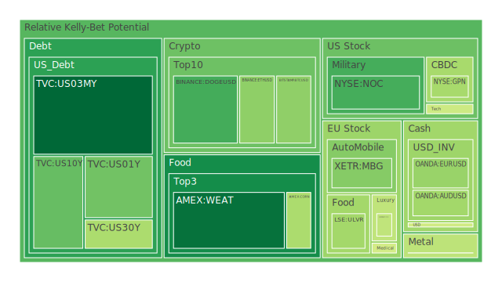
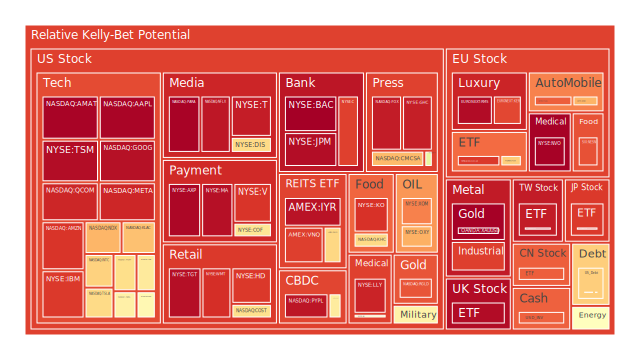
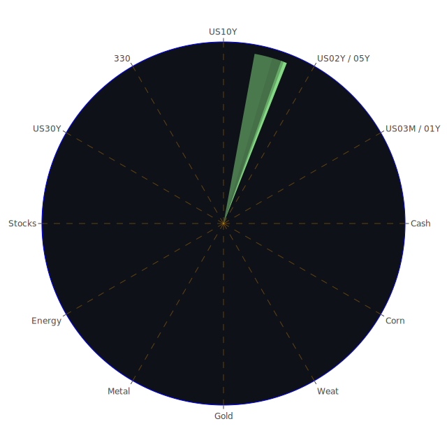

# 投資商品泡沫分析

## 美國國債
美國國債向來是避險資產的指標，因美國政府相較之下違約可能性低。然而近期數據顯示，美國長短天期殖利率（例如US10Y、US30Y、US03MY、US02Y等）彼此之間的差值仍然存在一定程度的倒掛或陡峭化現象。依照2025-02-24最新資料，US10Y約4.43%、US30Y約4.68%、US03MY約4.31%、US02Y約4.20%，近來雖然長天期收益率不斷波動，但相較一年前高峰已有些微下滑。同時，FED顯示其資產負債表縮減仍在進行，RRP水位下降，而EFFR交易量處於相對高位，顯示資金市場緊張度雖無明顯惡化，卻仍不能掉以輕心。

新聞面影響上，近期市場對通膨疑慮在新聞層面並不斷攀升，且政治面關稅風波一再受到提及，多次負面消息引發對景氣衰退的恐慌，使得美國國債一度被追捧，但又因資金對FED未來升息或降息方向不明而顯出徘徊。歷史上在2008年金融海嘯與2020年疫情期間，國債曾多次成為市場湧入的避風港，但伴隨利率劇烈波動，資金於短時間又撤離的情況亦屢見不鮮。目前泡沫風險指數雖不至於極端，但美國國債的D1至D30分數有局部時段微幅攀高，說明資金短期避險情緒仍時而升溫。長期看來，在「債務占GDP比率高」、「FED資產縮表」及「國內外投資人對殖利率敏感度提升」的格局下，美國國債仍具一定吸納避險資金的能力，惟須留意長短期利差的敏感度，避免盲目認定長債即絕對安全。

## 美國零售股
美國零售股如WMT、TGT等大型零售商，在2024年經濟環境因通膨壓力、消費者信心波動而歷經震盪。有關新聞，如「消費者情緒因關稅不確定性而下滑」造成普遍負面影響。在當前資料中，WMT、TGT等泡沫風險指數整體呈高位，部分檢測指標顯示TGT的D1約0.969644至0.970472上下，WMT也在0.917左右，顯示市場對此類零售股短期過度炒作的疑慮。從歷史來看，2008年金融危機期間，民生必需品零售企業獲得一定的保護力，但股價也同樣因整體市場恐慌而下跌。近年在疫情後網路購物興盛之下，實體零售通路雖仍有消費剛性需求支撐，但通路轉型壓力和營運成本增長可能造成獲利空間下滑。短期若再遇到通膨、關稅等政策干擾，零售股或被拖累。在心理層面，投資人往往對零售大商超保持適度信任，但此信任也可能反向加劇泡沫，建議多觀察季報顯示的存貨水準與毛利率走勢。

## 美國科技股
2025年以來，美國科技股持續受到AI、雲端、高階製程等題材的刺激，但新聞報導同時顯示有關「AI類股大跌」、「部分公司獲利不如預期」的負面衝擊。資料中可以看到，例如MSFT在2月下旬的泡沫分數約在0.66上下，AAPL更攀升到接近0.99，META大約0.93上下，顯示某些龍頭企業的市場預期極為樂觀，但伴隨著高度炒作和不確定性。回顧2000年網路泡沫時期，投資人因「新科技浪潮」大量湧入，最後出現崩跌。惟與當年不同之處在於，現今龍頭科技公司多具有龐大現金流與實質獲利來源。博弈論角度可見，市場對科技股的追捧易陷入「你追我趕」的局面，導致股價短期劇烈波動。建議投資人密切追蹤企業獲利成長與實際產品落地。若消息面持續負面，如「AI機構預算削減」、「自動駕駛法規延宕」、「某些科技公司員工大量裁員」等，都可能引爆短期回檔。

## 美國房地產指數
美國房地產指數（如RWO、VNQ等）之波動主要與利率走向、就業市場、消費信心等相關。現行固定房貸30年利率約在6.85%，較去年同期約3%有明顯上升，將壓抑部分購屋需求，對房地產公司和REITs帶來壓力。新聞面報導「美國多地因通膨與貸款成本走高，住宅市場成交放緩」，並有經濟學家警示部分過熱地區恐有結構性風險。歷史上，2007-2008年次貸危機就是因房地產槓桿過度而觸發。當前整體槓桿比率雖較那時期更加嚴格控管，但不排除局部地區的房地產仍有過熱情況。數據顯示，VNQ之泡沫風險分數高達0.89以上，IYR亦接近0.96，可見市場對房地產投資信託的評估已達相對高昂的價格水準。建議警惕業者的資金流動性，以及分租市場是否足夠應對利率調整帶來的收益衰減。

## 加密貨幣
加密貨幣方面，BTC、ETH、DOGE等幣種新聞此起彼落。例如DOGE在2月22日前後出現重大駭客事件，使Bybit疑似受創，而BTC與ETH則持續在9萬至10萬美元區間（注意本文之BTC價格源於對應單位，以免與傳統數字認知混淆）震盪。2025-02-24最新顯示，BTC泡沫分數大約0.38至0.46之間，ETH約0.38至0.51之間，DOGE在0.29至0.39上下。與往年相比，加密市場波動性依然明顯，但較前兩年的過度狂熱稍有降溫。然亦須注意新聞提到如「加密交易所巨額駭客損失」、「主管機關對加密交易爭議的態度變動」都能造成價格劇烈波動。歷史類似事件可回顧2017年底至2018年初之加密瘋狂行情與崩盤過程，社會學角度顯示加密社群投資人對「區塊鏈革命」之信仰，仍易在正面與負面情緒之間急速轉折。建議投資人慎防短線修正風險，若要分散佈局，須在資金占比與槓桿使用上更加謹慎。

## 金/銀/銅
貴金屬與工業金屬常作為景氣循環與對沖通膨的觀察標的。近期黃金價格（XAUUSD）一度衝高至2930美元之上，2月24日最新價格維持在2937美元左右，泡沫指數從D1約0.99一直到前幾週0.41上下，顯示波動頗大。新聞提到黃金因地緣政治與市場不安而受追捧，並有「實物黃金出貨量」上升的報導。白銀（XAGUSD）與銅（COPPER）方面，則因供應鍊與工業需求多所牽動，尤其歐洲電動車與再生能源計畫之推動可能拉抬需求，但中國經濟成長趨緩、新興市場購買力不振，也帶來壓力。歷史上，每當宏觀不確定度增強時，金銀常被視為避險或對沖通膨工具，亦在市場避險情緒釋放後修正。對於銅而言，其泡沫指數約介於0.45至0.53不等，需留意若未來基礎建設或新產能沒有如預期釋放，市場就可能出現下行回調。

## 黃豆 / 小麥 / 玉米
農產品方面，SOYB、WEAT、CORN等期貨ETF或相關股票皆受到氣候、貿易政策、地緣政治因素的影響。新聞報導顯示一些地區的極端氣候削弱了產能，如南美洲極度乾旱或北美天氣異常，可能影響黃豆和玉米的供給；關稅與國際貿易糾紛則對小麥市場衝擊較大。歷史上，農產品價格不時出現因單一事件暴漲或暴跌的情形，尤其與油價或地緣政治連動。當前觀察到泡沫風險（以WEAT為例）D1不算太高，在0.18上下，CORN約0.42上下，顯示整體依然屬於中性水準。儘管短期可能受到通膨預期與國際關稅風波影響，但農產品因基本面供需相對剛性，一旦政治或天氣干擾減弱，價格也可能回落。建議投資人關注新聞中的「耕作季節預估」、「氣候預警」、「貿易協定談判」等關鍵變數。

## 石油 / 鈾期貨UX!
能源市場部分，石油（USOIL）的走勢與全球經濟景氣及地緣政治緊密相關。近期市場報導中「通膨」、「關稅」、「產油國動向」皆帶來動盪。最新數據顯示USOIL大約在70美元上下徘徊，泡沫風險指數於2月24日顯示從0.30一路升高，最新甚至達到0.60的水準，暗示市場對油價的看漲或看跌分歧劇增。歷史上，油價曾因中東衝突或大國禁運制裁大起大落，也可能因經濟衰退預期而受到需求面的衝擊。至於鈾期貨（UX1!），長期受核能需求支撐而呈現特殊狀態，目前D1約0.52至0.53上下，相較於其它大宗商品波動較小，惟未來若核能話題再度升溫或政策面出現變化，價格亦可能迎來快速調整。

## 各國外匯市場
外匯市場方面，以EURUSD、GBPUSD、USDJPY、AUDUSD等為代表。2月24日顯示，EURUSD約在1.05上下，GBPUSD則在1.27附近。相關新聞提及歐洲經濟在能源議題和通膨之下依然承壓；英國面對通膨與勞動市場結構的挑戰，貨幣政策走向不定；日本在超寬鬆貨幣政策結束與否之爭下，日元波動性加大；澳洲礦產經濟則受到中國需求下滑的拖累。回顧1997年亞洲金融風暴以及2008年金融危機時，匯率常反映資金避險與投機力量的博弈。當前USD整體走勢雖不如2022年狂飆，但需求仍強。須關注FED與各國央行利率決策的變動，以及地緣政治是否再度推升美元需求。

## 各國大盤指數
在歐洲方面，如FCHI、GDAXI等；在美國方面，NDX、SPX等；在中國則有000300（滬深300）等。最新觀察：NDX泡沫分數約在0.73上下，GDAXI也達0.90左右，暗示市場對歐洲與美國股市都存在一定高估風險。新聞面指出，歐洲奢侈品與汽車股雖具有彈性，但人口與經濟結構的壓力亦不可忽視；美國則一直受通膨升溫、利率走勢未明與關稅爭議困擾；中國滬深300在0.85上下，投資人關心該國是否有進一步刺激措施。歷史上，主要大盤指數最終仍受本國企業盈餘與整體經濟基本面驅動。若後續新聞持續報導「貿易壁壘升高」或「地緣衝突升溫」，恐加深大盤波動。

## 美國半導體股
半導體股（如NVDA、AMD、MU、KLAC、AMAT、TSM等）近年受惠於AI、高速運算、車用晶片需求增加，但同時飽受供應鏈與地緣爭端衝擊。在2月24日數據中，TSM泡沫分數已高達0.97上下，NVDA與AMD也都在0.62至0.64間，KLAC更達到0.71以上。加上新聞屢傳「半導體景氣循環放緩」、「主要企業獲利指引下修」、「可能開徵新關稅」等負面因素，都顯示短期資金對該族群仍在博弈徘徊。歷史上，半導體產業景氣循環往往大約三到四年一輪，泡沫可能在需求極旺盛時加速堆疊，但一旦需求峰值回落或突發事件（如出口限制）就會急殺。建議投資人應審視企業在先進製程或利基應用的護城河，以及國際博弈對技術出口可能造成的斷層。

## 美國銀行股
銀行股（如JPM、BAC、C等）表面看來收益來自淨利息差，但在高利率環境與經濟衰退陰影中，可能面臨壞帳風險升高。數據顯示，BAC泡沫風險近乎1.00，JPM也在0.97上下。新聞提到「銀行裁員」、「商業地產違約風險」、「信用卡壞帳率攀升」等負面訊息，使銀行股短期受到市場疑慮。歷史上，金融業最常在景氣轉折點出現放大反應。社會學與心理學觀點則指向投資人對銀行股之信心一旦動搖，資本迅速撤出，再加上金管單位監管的強度波動，易引發股價劇烈震盪。投資人若要佈局銀行股，須留意相關金融產品的風險敞口、貸款組合質量，以及是否有潛在的流動性壓力。

## 美國軍工股
軍工企業（如NOC、LMT、RTX等）往往在地緣政治衝突時受注目。觀察NOC泡沫分數落在0.29到0.66之間，LMT則在0.51至0.64上下。雖然新聞顯示軍工需求仍有長期支撐，如各國防務預算、科技升級、太空軍事計畫等，但市場也會擔憂軍工股估值過高。歷史經驗顯示，在局部衝突升溫時，軍工股短期內受買盤推動，但一旦政治和談或軍費開支暫緩，也可能出現回跌。社會輿論對軍工投資有分歧，部分投資者基於道德或ESG考量撤資，部分則視其為防禦性標的。

## 美國電子支付股
電子支付股（如GPN、PYPL等）隨著消費支付習慣轉向線上化而擴張，報告中GPN泡沫指數逼近0.42至0.76不等，而PYPL更是0.95以上，暗示市場對部分公司期待甚高，但也可能高估。若遇到金融監管加強或競爭者（如大型科技公司）介入支付市場，將產生壓力。歷史上，電子支付需求大幅成長是在電商與行動支付盛行後的十餘年，但2022至2024年間，各大公司之發卡量與交易量增速已在部分地區趨緩。投資此類公司須特別注意新聞中對「數位稅」、「金融科技監管」等議題的討論。

## 美國藥商股
醫藥類股（如MRK、JNJ、LLY）歷來被視為防禦性，但近期新聞顯示疫苗研究、醫療器材監管與各國健保系統改革等因素，使藥商股之未來走勢並非絕對穩定。MRK與JNJ、LLY之泡沫風險介於0.48至0.93間；LLY高達0.93以上，或反映市場預期其重磅藥物及先進療法可帶來利潤。同時，新技術（例如基因編輯）研發進度不確定性高，一旦臨床試驗或法規環保出現問題，股價即可能大幅下修。回顧2015-2016年間生技股泡沫一度擴張並瞬間破裂，顯示研發進度與法規環境都是關鍵變數。

## 美國影視股
影視產業代表（如DIS、PARA、NFLX、FOX等），新聞面曾報導串流平台競爭激烈，導致各家獲利空間遭擠壓。資料中，DIS的泡沫分數一度達到0.67，NFLX則逼近0.95上下，PARA約0.99上下，市場對部份內容供應商之收入模式有疑慮。歷史上，影視股因整體經濟衰退或消費轉向免費內容平台時，股價易受到衝擊。近日新聞也指涉「YouTuber關閉ETF」、「MrBeast在亞馬遜的節目虧損重大」，多少暗示多元平台競爭日益白熱化。投資人需關注內容製作成本、訂閱戶增長趨勢，以及未來版權糾紛等因素。

## 美國媒體股
媒體股（如NYT、CMCSA、GHC等）雖與影視產業重疊，但其廣告、出版、新聞報導、市場定位各有不同。報告數據中，NYT的D1數值在0.53至0.67之間，CMCSA約0.72上下，GHC更接近0.94。市場對傳統媒體業前景疑慮頗深，加之新媒體與社群平台的崛起，整體廣告收入可能進一步被分食。歷史如2000年代後期，報紙發行量大跌、廣告收入亦長期下滑。但此類公司若成功轉型線上訂閱制，或者獲得某些專業資訊市場的優勢，仍能找到新的利基。

## 石油防禦股
石油防禦股並非單指傳統石油公司，而是指主要從事石油開發、開採與環境相關配套的新型公司，其收益受到國際原油價格變動與政策支持程度的影響。當前像OXY、XOM等大型企業，泡沫風險也並不低：XOM約在0.80以上，OXY約0.74上下，顯示評價並不便宜。新聞一旦出現如「綠色能源轉型加速」、「投資者撤資化石燃料」的報導，都可能使相關股價短線下挫。但另一面，若地緣政治衝擊油價上漲，這些股票又會受青睞。

## 金礦防禦股
金礦股（如RGLD）因其獲利與國際金價高度連動，也是抗通膨或避險概念的重要標的。RGLD的泡沫指數已達0.86上下，有過熱嫌疑。歷史可見金礦股常在金融恐慌時受到追捧，但若金價一旦高位回落，且礦場開採成本與管理費用巨大，也會導致企業獲利下滑。長期來看，金礦公司存在環保與開發區域限制，要密切注意地緣政局與成本控制。

## 歐洲奢侈品股
歐洲奢侈品（如KER、MC等）近年來依賴中國、北美高端消費。資料中MC約0.45至0.56之間，KER則約0.88上下。新聞顯示，「奢侈品市場」可能因地區衝突、關稅摩擦或消費者信心下降而承受壓力，但部分報導也提到「渴望身份象徵」的購買力在年輕世代仍不斷湧現。歷史上，如2008年金融海嘯期間，奢侈品股雖遭重挫，但當環球經濟復甦後又迅速創新高。經濟學與心理學分析指向「炫耀性消費」在一定財富階層的剛性需求。建議留意消費信心指數與高端旅遊需求回升情況。

## 歐洲汽車股
歐洲汽車股（如BMW）受全球經濟和產業變革（電動化、智慧車）影響。BMW泡沫風險約0.73至0.75左右，新聞面顯示「電動車轉型投入」，以及「中國需求疲弱」帶來短期不確定性。回顧2015年左右的柴油門醜聞，曾重創德系車企的聲譽與股價，也凸顯法規與技術路線轉折對傳統車廠之衝擊。投資人宜關注該企業在電動車與自動駕駛領域的技術實力，以及歐洲產業政策支持力度。

## 歐美食品股
美國與歐洲多家食品企業（如KO、ULVR、NESN等），在經濟衰退時具一定抗跌性。但如報告中顯示，KO的泡沫分數一度達到0.91以上，ULVR高達0.57上下，NESN也逼近0.86。新聞面提到「蛋價飆漲」、「食品通膨」，導致整體生活成本壓力上升，部分消費者也改買替代品牌，或減少非必需消費。歷史上，食品類股雖相對穩定，但若通膨長期居高不下，且企業難以將成本全部轉嫁，毛利縮水終將影響股價。心理層面上，投資人往往視食品為「最終剛需」，但尚需留意庫存和物流成本的累積效果。

---

# 宏觀經濟傳導路徑分析
宏觀層面上，美國FED持續進行資產負債表緊縮，利率中樞仍在高位。外加國際市場對通膨與關稅衝擊之憂慮升溫，多項新聞（如「關稅再次升高恐慌」、「聯邦政府裁員可能影響市場消費」等）形成負面輿情。另外，歐洲方面在能源與政治不確定因素中仍顯脆弱，中國地方政府債務也被部分報導視為潛在危機。種種因素經由「金融市場避險」→「資產需求與利率互動」→「企業投資收縮或加碼」的管道，最終反映到大盤與債券殖利率。金價、油價則透過地緣紛爭與通膨預期交互影響，引發大宗商品行情波動。當前觀察到的狀況是：全球資金流多在美國利率走勢與地緣風險的拉扯下，呈現短期高速流動，而非長期安置。

---

# 微觀經濟傳導路徑分析
就企業與產業層次而言，利率走高推升融資成本，消費者信用卡費率升高，導致零售銷售動能和高價非必需品需求受限。銀行壞帳攀升風險增加，引發風險意識提升。科技與電子支付企業面臨法規與競爭壓力，半導體產業則承受下游需求不確定。房地產商和REITs在貸款利率居高的情況下，可能縮減投資或斷頭拋售資產，進而擴大傳導至施工、原物料供應鏈。對農產品來說，天氣與地緣衝突是直接衝擊因素，也會反映到最終生產及物流成本。若企業難以轉嫁成本，獲利自然承壓，股價相應受挫。

---

# 資產類別間傳導路徑分析
在三位一體正反合的分析下，我們可看到以下傳導關係的「漣漪效應」：

1. **通膨與利率對衝**：美國國債收益率高，吸引保守資金，但也同時使風險資產評價承受壓力。若通膨消息惡化，投資人再度湧向黃金、白銀與美國國債避險，導致股票與房地產價格壓力加大。

2. **地緣政治與大宗商品**：若新聞出現油國衝突、礦區產能受限、農產品出口禁令等，石油、金屬、農產品價格就會波動，當能源與糧食成本升高時，零售、消費品企業利潤率下降；相反地，石油防禦股、金礦股在短期亦可能受益，卻也會面臨環保與國際壓力的挑戰。

3. **科技與金融交叉風險**：若銀行產業或金融市場流動性吃緊，科技企業孵化與研發經費籌措可能受限，連帶影響半導體股與電商、電子支付股。心理學層面上，一旦市場對「科技泡沫」產生恐慌，大規模拋售會進一步拖累金融機構資產質量。

4. **匯率驅動海外投資配置**：美元強勢對新興市場造成資金外流壓力，若中國或歐洲經濟面臨增長阻力，會進一步影響奢侈品、汽車、原物料出口市場，最終反饋到美歐日的產業供應鏈。

5. **房地產與消費連動**：房價走軟抑制消費者財富效應，結合高利率對信用卡負債的壓力，使非必需消費與服務業成長受限，故零售股與媒體、影視娛樂皆易受衝擊。

---

# 投資建議

綜合以上，為了滿足穩健、成長、高風險三種配置，並令其總佔比為100%，同時盡量利用相關係數約-0.5、相位120度左右的對沖原則，我們可提出以下示意性配比（非表格式，只做文字敘述）：

1. **穩健型配置（40%）**  
   - 選擇美國國債：可分配於1年至10年期之間，用以對沖股市波動。  
   - 部分黃金：金價對地緣政治或市場恐慌較敏感，可扮演避險角色。  
   - 藥商股：如MRK、JNJ等防禦類標的，具相對穩定的需求，長期分紅可視為補充。  
   此類配置重點在於穩健收益與抗波動，對負面新聞或景氣下行有較佳防禦力，但若市場全面上漲，報酬可能較溫和。

2. **成長型配置（40%）**  
   - 半導體龍頭：如NVDA、TSM或AMAT等，著眼長期AI、高速運算需求。  
   - 能源類（油、鈾）中偏向轉型與上游技術的公司，從長期趨勢考量供應稀缺性。  
   - 網路與電子支付股：如PYPL，或表現較佳的FinTech企業（須評估估值泡沫）。  
   這部分利用產業趨勢，尋求中長期成長動能。同時留意新聞中的研發及併購訊號。

3. **高風險型配置（20%）**  
   - 加密貨幣：如BTC、ETH等主流幣，考量其高波動與高潛在報酬。  
   - 軍工股中相對波動度高的標的：如RTX或NOC，若地緣衝突升溫，可能急漲；但政治風險也大。  
   - 新興市場ETF：包含中國或南美在轉型時期的成長機會，但同樣具有政策與貨幣波動風險。  
   這部分預留於需要承擔波動與流動性風險的投資人，若市場持續走多，回報可能優於大盤；但若新聞或政經形勢突變，也容易快速虧損。

需要再度強調，以上佈局並非絕對建議，僅是基於不同風險屬性所做的示範性比例。投資人須思考自身風險承受度、流動性需求等，再做具體調整。在三位一體的正反合過程中，這些資產之間或能藉負相關性互相對沖，但也要持續追蹤彼此之漣漪傳導，一旦某一市場忽然出現極端事件，仍有連鎖反應的可能。

---

# 風險提示

投資市場永遠充滿不確定性。本報告旨在從經濟學、社會學、心理學、博弈論的多元視角出發，整合近期新聞事件與歷史相似場景，嘗試客觀剖析各類資產之潛在風險與機會。其中任何投資策略都有可能在突發政治、經濟、氣候或技術演變中受到顛覆。請務必：

- 留意泡沫風險高的警告：在本文分析中，多檔股票或標的之泡沫指數接近或超過0.90，可能意味市場對其未來成長預期過度樂觀或投機行為過度，一旦不及預期，價格波動幅度恐非常大。  
- 注重國際新聞消息與政策：如關稅風波、地緣衝突、國際制裁、全球疫情反覆等，都能在短時間大幅改變投資環境。  
- 密切觀察利率與信用市場：高利率時期對金融與房地產衝擊顯著，也會間接影響科技與消費品股市值的估算。  
- 動態調整：投資非一勞永逸，應依市場變化與自身財務目標定期檢討，避免過度或過少集中。  

最後再度強調，本報告僅供參考，不能保證任何投資結果。風險最終需由投資人自行承擔，宜在多方研究後再做出決策，必要時可尋求專業顧問意見。投資乃長期不斷學習與調整之過程，縱使市場情況反覆無常，理性評估與嚴謹紀律仍是保持穩健最關鍵的核心。祝投資順利。  

 
Daily Buy Map:

 
Daily Sell Map:

 
Daily Radar Chart:

 
