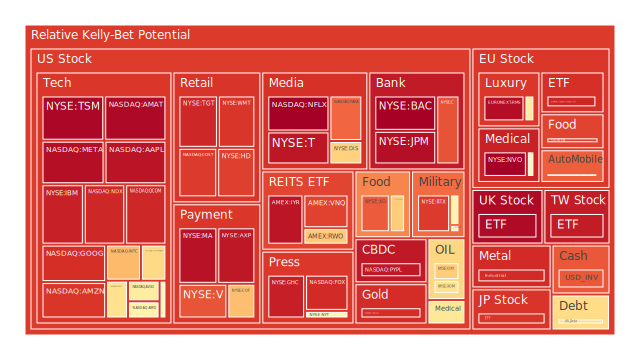

# 一、總體敘事與三位一體初探

## （一）Spatial：全球市場與新聞的三位一體大膽假設
所謂「Spatial」層面，主要關注全球範圍內之區域性經濟、政治與市場事件對資產的交互影響。近期新聞顯示，各國都在面臨多重議題：包括地緣政治衝突、通膨壓力、貨幣政策角力，甚至某些新興市場的政府債務危機或貨幣貶值風險，以及部分國家對於數位資產監管的升級等。從新聞中看到，「美國」方面持續面臨科技裁員、軍工與國防預算的議題；「中國」則傳出地方政府債務壓力與對新冠後經濟復甦的擔憂；「歐洲」方面受地緣政治、能源轉型以及通膨變動的多重衝擊；其它地區，如非洲及南美，則有零星社會動盪、經濟結構轉型等挑戰。各區塊之間互相牽動，蘊含不同的交易與資金流向。

就近期新聞中，對市場影響較為正面的事件，例如「Buffett持續增加日本商社投資」、「AI及機器人技術在深圳加速布局」、「部份國家對於基礎建設與能源專案有更多資金投入」、「德國政府或歐盟面臨某些選舉與政策轉型的時機」等，都可能為區域股市注入正面動能。但在負面消息方面，諸如「巴西與部分歐洲地區近來出現社會動盪」、「烏克蘭戰事與周邊國家政治局勢波動」、「中國地方債壓力與寬鬆力道不足」、「美國潛在對部分國家實施新的關稅」、「各地針對民生必需品價格的爭議與示威」等，皆使市場不確定性再度放大。透過空間層面來審視，能夠看出全球資本流竄正試圖在各種大型市場之間尋找收益與避險的平衡點。

這種空間層面的博弈，包含經濟學上資源重新分配的效率問題、社會學層面對失衡階層的關注、心理學裡投資人情緒在對地緣及政策風險的反應，以及博弈論中各國互相施壓與合作的複雜策略。因不同地區在政策調控、金融結構及社會穩定層面有明顯差異，故在觀察各市場的同時，要格外留意區域政策突變或政治干擾所引發的短期震盪。其中，包括美元流動性、主要央行貨幣政策走向，也都可能對外匯市場及資產價格產生空間層級的急速傳導。

## （二）Temporal：時間維度與新聞的三位一體大膽假設
時間層面上，市場以週期性的審視、季節性因素以及歷史對比進行解讀。從最新FED關鍵數據來看，EFFR交易量上升而總資產下降，RRP下滑、TGA上漲等現象，顯示資金在短期流動性與長期部署之間做拉扯。利率方面，與一年前相比，幾乎所有美國公債收益率在一年內都明顯回落，顯示通膨雖然仍在，但對比去年同期的更高利率，如今市場預期出現某種程度的修正。這種修正也帶動OIS與SOFR的預期轉變，暗示市場希望看到更趨穩定或逐步下行的政策利率。

然而，各國的時間軸並不一致。歐洲在能源問題與地緣衝突之中，政策拉長時間進行整頓；美國雖然在去年大幅升息，如今正處在觀察經濟數據的階段，市場不確定美國政府是否會繼續強力緊縮，或開始在就業數據與金融穩定之間尋找平衡。同時，中國在疫情之後的經濟復甦未必如官方預期順利，地方政府舉債及經濟刺激時程並不一定與市場期待同步，各種刺激手段也可能來得過早或過晚，導致股市與商品期貨的表現並未直線反應預期。

新聞與歷史事件提供佐證：過去在量化寬鬆結束、開始升息的週期中，常常會有市場先行反應之後，緊接著一段時間陷入震盪，例如2013年「縮表恐慌（Taper tantrum）」、2004年前後的加息週期都曾帶來市場階段性回調。今年市場是否重演類似的循環，需要再視各國央行後續的公開聲明及實際操作。同時，本次景氣結構包含了通膨壓力、地緣衝突、供應鏈重整以及AI等新科技領域投資熱潮，多個主線同時運作，讓時間維度的預判更為複雜。市場在面對過往歷史時，常有心理學上「恐懼與貪婪循環」的動態，對利率與經濟成長之間的時間差產生極度敏感的反應，博弈論則顯示，若各方都選擇保守的貨幣與財政政策，可能對全球風險資產形成壓抑，而若有一方顯示寬鬆跡象，熱錢又會瞬間流向該處。

## （三）Conceptional：概念層面與新聞的三位一體大膽假設
在概念層面，經濟學理論常用的需求與供給框架、貨幣流動性假說、菲利普斯曲線、IS-LM模型等，都嘗試從總體與微觀兩方面佐證市場盛衰；社會學角度強調收入分配不均與政治對立帶來的衝擊；心理學角度揭示投資人行為可能在市場繁榮或下滑中被放大，出現「從眾」、「錯失恐懼症」或「恐慌性拋售」；博弈論則觀測各國在關稅、軍事、外交的互動上，如何影響全球資本流向及資產評價。近期新聞提到某些國家可能對鄰國或貿易夥伴祭出新的關稅，這不僅在國家層面激發談判，也會在心理層面造成風險偏好快速變化。再者，各大資產管理機構可能以動態對沖的手段，將資金從一個部位切換到另一個部位，借力使力地在短期間內造成價格劇烈波動。

對於「三位一體」的正、反、合來說：當前的資金面與地緣政治（正）不斷衝擊市場，市場又在對通膨與貨幣政策（反）產生激烈的重定價，最後在全球需求疲弱或結構轉型的（合）下，形成一種自我平衡的不穩定格局。整個概念層面中，我們可以大膽假設：各國極可能在軍工、科技、能源轉型上加大支出，而在傳統民生、外援等領域縮減預算，如此造成與以往不同的資金流向，使得投資人觀察通膨和就業數據時，往往難以一刀切地推導出利率走勢和風險資產的表現。

---

# 二、投資商品泡沫分析

以下針對常見資產做綜合評估，並援引近期新聞與歷史場景，觀察其現狀與可能風險：

1. **美國國債**  
   美國國債收益率近一年呈現先升後回落的走勢。根據近期數據，10年期殖利率略低於前一個月甚至前一週的水準，顯示市場對未來通膨與政策不確定性略為放緩。然而從新聞可知，部分市場人士仍擔心美國政治紛擾或赤字擴大，在長端殖利率上容易突然激增。歷史上在財政談判陷入僵局或政府暫停運作時，短期國債曾爆發流動性危機。因此，美國國債雖是公認相對穩健的資產，但仍要提防政策風險反覆對殖利率造成波動。

2. **美國零售股**  
   近期新聞顯示，美國零售企業面臨消費力道下修和工資成本上升。像是多家商店關閉部分據點、裁員消息四起，有些新聞更提到某些傳統零售商因電子商務衝擊或高負債壓力而前景堪憂。在歷史上，零售業常在景氣放緩階段產生庫存積壓和獲利壓縮的窘境。短期內若消費者信心持續疲弱，零售股股價波動恐加劇。有新聞指出部分零售公司財報不佳，導致股價大跌，泡沫風險也許不算特別高，但下行風險顯著。

3. **美國科技股**  
   科技股在AI、雲端與各種創新領域仍是資本市場的焦點。同時新聞提到，有巨頭暫停部分數據中心租約，有銀行加強對企業貸款的成本管理，這些消息對於一些高估值但尚未實現穩定現金流的科技公司構成風險。歷史對照2000年前後網際網路泡沫，顯示科技股一旦估值過分擴張，若後期獲利無法跟上，就極易崩跌。部分機構開始擔心軍工或政府預算縮減，衝擊到某些科技細分領域的收入。因此儘管AI熱度仍在，仍須留意部分公司泡沫風險偏高。

4. **美國房地產指數**  
   近期固定房貸30年利率仍在6-7%左右上下波動，雖然比去年最嚴峻時期略有回落，但對許多潛在買家來說仍屬高水位，導致買氣下滑。新聞也提到春季銷售季不甚樂觀，可能繼續打壓房價與房地產相關股票。歷史經驗告訴我們，美國房地產若要大幅上漲，需要相對寬鬆的貸款環境及強韌的就業市場，目前看來就業市場雖然尚可，但利率環境並不友善，建商與相關REITs也一再釋放風險提示。

5. **加密貨幣**  
   比特幣、以太幣與其他山寨幣在過去一年間震盪激烈。儘管近期一些新聞顯示某些科技巨頭仍可能把區塊鏈與數位支付等技術納入業務布局，但政府監管與投資人情緒都相當敏感。一旦出現監管新規或某些交易所爆雷，容易發生價格大幅修正。歷史上，加密貨幣多次出現短期飆漲後的長期下滑，泡沫風險高於大多數傳統資產。新聞有報導法規擴大監控，或各國央行對CBDC的研發，皆使民間加密貨幣的應用前景面臨不確定性。雖然也有正面聲音認為虛擬資產將與黃金一樣成為新興避險工具，但至少目前高波動與潛在流動性風險不可忽視。

6. **金/銀/銅**  
   金價近期在避險需求下依然受到支撐，且GOLD OIL RATIO持續在高位，顯示黃金相對石油較強勢。部分分析師認為若各國央行持續對地緣或通膨存憂慮，仍會持續買入黃金做儲備。白銀與銅則更加受到產業需求與經濟景氣輪動所影響，一旦全球製造業有不振跡象，這些金屬價格可能回調。新聞提到，有些國家在新能源車、充電樁、基礎建設等需求拉抬銅價，但若宏觀面偏空，需求成長可能受限。歷史上，貴金屬在地緣政治緊張時常有不錯的避險表現，但也容易隨利率走勢而劇烈波動。

7. **黃豆 / 小麥 / 玉米**  
   近期新聞對於全球糧食供應鏈較為憂慮，一方面烏克蘭局勢導致農產品出口不穩，另一方面極端氣候在巴西、阿根廷、北美都不斷出現，容易影響收成。黃豆與玉米受到飼料與生質燃料需求帶動，小麥則隨戰爭或政策限制出口而價格波動。歷史上，農產品價格若遇到地緣或氣候衝擊常會短線飆升，但隨著全球供應鏈重新調配，又容易快速回落。所以對於黃豆、小麥、玉米也需留意期貨槓桿投機造成的泡沫風險。就近期數據看，有些農產品價格已從高點回落，但仍需警惕倉位集中度。

8. **石油 / 鈾期貨（UX!）**  
   石油價格近期雖然在70美元上下波動，但新聞提到部分產油國政策不穩定、地緣緊張及OPEC+可能進一步減產的議題，仍讓能源市場保持警戒。歷史上，石油價格在政治爭端與供給失衡時，曾出現驟升，對於通膨與股市都有重大衝擊。至於鈾期貨，近年因核能發電需求爬升，市場對清潔能源的再評估，以及對氣候變遷憂慮，使鈾的需求面呼聲增加。但此市場規模相對小，消息面若有任何供應端的新發現或政治干預，都可能使價格上下劇烈擺動，需要嚴控風險。

9. **各國外匯市場**  
   根據最近FED公布的部分指標，美國利率端正在趨於溫和；歐洲利率則在能源與通膨間掙扎，中國貨幣可能因地方債風險而偏向寬鬆，但是否寬鬆仍不明朗。英鎊、歐元、日圓、澳幣等主要貨幣，在全球風險偏好短暫回升時兌美元可能走強，但一旦市場避險情緒升溫，資金又很快回流美元。新聞也顯示部份地緣衝突地區之貨幣大幅貶值，引發輸出國或新興市場波動，因此外匯市場短期內難以有明確趨勢，更多是針對政策消息面做即刻反應。

10. **各國大盤指數**  
   如美國大型股指數、歐洲股指（德國DAX、法國FCHI、英國FTSE等）、日本JPN225，以及中國大盤如000300等，近期多呈現震盪態勢。有新聞表示，美股近來因企業獲利下修、科技股裁員、新關稅動向、軍工預算不確定性等而出現壓力，但整體還未大幅回調。歐洲大盤指數面臨通膨與政治動盪，中國大盤則因經濟刺激預期時強時弱而上下洗牌。歷史告訴我們，大盤指數往往在週期調整階段，容易因大型機構的資金流向而快速上漲或下跌。

11. **美國半導體股**  
   包含NVDA、AMD、INTC等，年初以來因AI、資料中心需求與地緣半導體供應鏈調整而股價表現明顯波動。新聞提到部分企業正與AI相關夥伴合作，不斷推出新的晶片方案；也有負面消息指出在資本支出與軍事訂單縮減時，半導體需求不一定能長期保持高速增長。回溯歷史，每當科技浪潮與應用爆發，就會有一波半導體的超額盈利期，但若應用端無法落地，或被宏觀趨勢壓制，隨即出現深度回調。因此，半導體股可能具有高成長與高波動並存的特徵。

12. **美國銀行股**  
   近期部分新聞提到銀行面對資本規範、商業不動產貸款風險，以及一般消費者信用卡呆帳上升的疑慮。大型銀行雖然較有韌性，但也有傳出對一些業務單位重新布局，甚至收緊貸款標準。回顧2008年金融危機，銀行自身槓桿與風險控管是關鍵。一旦任何踩雷或逾期激增，都可能擴散到市場，形成流動性緊縮。雖然目前沒有過度杠桿跡象，但未來若商業地產泡沫破裂，銀行股將先受衝擊。

13. **美國軍工股**  
   軍工企業長期受政府預算與地緣政治影響。新聞顯示，有些投資人擔心美國國防預算可能在某些領域削減，也有報導指出烏克蘭和部分國家對軍備需求很高，故前景並非絕對悲觀。歷史經驗裡，軍工股在重大衝突下通常利好，但倘若衝突進入緩和或政治氣候改變，該類股市值也曾迅速下挫。加上軍火標案的合約週期長，若出現政治波動或預算卡關，短線都會對股價產生影響。

14. **美國電子支付股**  
   有些新聞提到部分支付企業的交易手續費與跨境業務減少，加上競爭者不斷湧現，使得老牌支付公司面臨挑戰。從歷史看，數位支付的普及帶來爆發性成長，但也逐漸趨於飽和，市場份額之爭激烈。加上監管機關對於手續費率的關注，可能進一步壓縮利潤。業者若無法持續加碼金融科技或跨境服務創新，就有被新創或區塊鏈支付方案取代的危險。

15. **美國藥商股**  
   近期新聞顯示部分藥廠在研發管線、專利保護、併購上都有動作，整體對比其他產業雖相對穩健，但仍會因新藥審批、藥價管制及官司糾紛而出現較大波動。歷史案例如早期藥廠遭逢專利到期、競品崛起，股價常一落千丈。因此雖具某些防禦屬性，但若研發與專利風險同時爆發，仍可能令泡沫化的風險加劇，尤其對市值較小、研發管道較依賴單一領域的企業。

16. **美國影視股**  
   隨著串流平台與傳統電視電影公司競爭，實體院線的需求結構改變，影視公司財報起伏不定。部分新聞提到某些影視巨頭裁員、國際擴張受阻，以及製作成本飆升。歷史上，影視娛樂市場會隨經濟週期上下擺動；若廣告商削減預算或消費者娛樂支出減少，該行業就會被波及。雖然泡沫風險未必如科技股般高，但競爭激烈下，部分中小業者可能被整合或淘汰。

17. **美國媒體股**  
   媒體股和影視股有重疊之處，但媒體更直接受廣告景氣支撐。新聞提到數位廣告市場競爭加大，社群平台分走大筆預算，若媒體公司轉型不及時，就會衰退。歷史經驗，傳統媒體往往難以扛住數位化浪潮。若整體經濟下行，廣告支出被優先削減，此時媒體股會面臨成交量萎縮與獲利惡化的風險。

18. **石油防禦股**  
   這裡泛指專精於石油開採、煉製、管線等領域的防禦型企業。一些大型石油公司在能源轉型浪潮下也積極布局再生能源，但整體投資者往往視其為紅利穩定、股利率相對可觀的投資標的。歷史上，當能源價格走跌時，這類公司普遍縮減資本支出；當油價回暖，又迅速獲益。儘管有防禦屬性，但一旦國際油價急挫，其股價同樣會承受下行壓力。

19. **金礦防禦股**  
   金礦公司類似黃金ETF的槓桿模式，只是還需承擔開採成本、政治風險與管理效率等挑戰。當金價上行時，金礦股漲幅有可能遠超現貨金，但反之亦然。歷史經驗中，金礦股在地緣動盪、全球通膨時期也能得到追捧，但倘若公司有經營風險，如某些礦區政局不穩，或勞資糾紛，股價會急挫。因此雖可當防禦一環，也暗藏潛在波動。

20. **歐洲奢侈品股**  
   新聞提到中國和世界其他市場對奢侈品的需求可能存在放緩。儘管精品行業在過去幾年迅速成長，但全球經濟若持續放緩，奢侈品需求勢必受衝擊。然而也有研究指出奢侈品牌具備一定的文化與地位認同屬性，往往在危機時期仍能維持一部分高端客群的消費。歷史證明，奢侈品股的估值常以未來成長率支撐，一旦成長趨緩，股價修正幅度可以相當劇烈。

21. **歐洲汽車股**  
   歐洲汽車業正面臨電動化轉型的壓力，新聞提到許多車廠因電池成本高企、供應鏈短缺、政策法規趨嚴，都在調整產品線或尋求新科技合作。對傳統燃油車的需求若有加速萎縮，廠商在過渡期可能利潤下滑。歷史上，汽車景氣循環具明顯週期性，高利率與經濟下滑都可能對車市造成壓力。

22. **歐美食品股**  
   食品行業需求較穩定，但當前通膨仍使成本端承壓，尤其是農產品價格、人力與能源成本相疊加。許多食品公司試圖透過提價轉嫁成本，但消費者可能出現替代品或縮減支出。歷史經驗顯示，大型食品公司若品牌強勢可相對抗通膨，但仍有新聞指出一些企業獲利衰退並裁員。由於食品是必需消費，泡沫風險並非特別高，但要當心股價已經預期過高的防禦題材，可能出現估值回調。

---

# 三、宏觀經濟傳導路徑分析
從宏觀面來看，地緣政治衝擊對供應鏈、能源與貨幣政策交織，使整體市場預期反覆。FED數據顯示，雖然政策利率近來趨向穩定，但Discount Window及FHLB的使用狀況、BTFP的水位、RRP與TGA變化，皆可能在某些短期內誘發資金流向急轉。加上高收益債利率與企業違約率若攀升，就會帶動高槓桿領域的資產縮水，最後從企業層面蔓延至股市乃至銀行信貸，形成負向循環。地緣衝突的延燒，若再度推升油價與糧價，會讓通膨升溫，政策利率調整恐再起動作。於是這些宏觀因素如同多層傳導網絡，牽一髮而動全身。

---

# 四、微觀經濟傳導路徑分析
在企業與消費層面，一旦利率維持高檔或借貸標準收緊，房地產、汽車、耐久財銷售會萎縮，接著影響企業營收及就業。若就業面承壓，消費力道又進一步減弱，帶來零售、娛樂等行業的衰退，最後銀行壞帳攀升、貸款利差收窄，連帶削弱金融業的獲利。資金也會因消費者與企業對風險承受度降低，而自高風險資產撤離，流向黃金、美國國債等相對穩健標的。但若國債利率也波動，投資人將轉向持有現金或其他低波動資產，造成市場流動性不足、股市和債市雙殺的窘境。

---

# 五、資產類別間傳導路徑分析
綜合來看，一旦某個資產（如高風險信用債或某些科技成長股）出現劇烈拋售，可能因機構投資組合風控機制而波及其他品項。反之，若有利多集中在軍工、AI或新能源相關股票，短時間也會吸引資金自債市或傳統藍籌股撤離，造成收益率或股價的顯著波動。根據博弈論，若各國在軍備競賽與關稅壁壘上不斷升級，則石油、稀有金屬等關鍵資源品在價格上可能快速抬升，通膨壓力再度推高，外匯市場與央行政策又將跟進反應。如此環環相扣，帶來一連串漣漪效應。再者，新聞中提及多次地緣危機、氣候與糧食議題，也都會沿著金融市場的交易網絡，從衍生品到現貨市場不斷擴散，最終影響全球投資組合。

---

# 六、投資建議

在目前波動性仍高、泡沫風險不可忽視的環境下，建議將投資組合分為三大類：穩健、成長、高風險，三者比例合計需為100%。以下提供僅供參考的配置示例，每大類各自挑選三個子投資項目，並盡量考慮對沖需要及相位分散（相互相關性盡量偏低甚至負相關）：

1. **穩健類（建議配置比例約30%）**  
   - **美國國債**：選擇期限較長（如10年），或可適度採短中期分散。利率已較前期稍回落，但仍具一定收益與避險屬性。  
   - **黃金現貨或金礦防禦股**：若希望提高波動彈性，可混合配置金礦股，但要留意其經營風險；若只想單純避險，則以黃金現貨或類似ETF即可。  
   - **大型食品股**：雖然通膨對成本造成壓力，但品牌力強的食品股較能撐住價格，長期股利配發也較穩健。  

2. **成長類（建議配置比例約50%）**  
   - **美國半導體龍頭**：著眼於AI與云端運算需求，儘管有高估值爭議，但依舊是未來技術核心領域。挑選財務體質佳、在製程或技術上領先的龍頭，可有效分散風險。  
   - **歐洲奢侈品股**：若經濟緩步復甦，中產與富裕階層的消費回溫可能帶動業績反彈，但要警惕中國與全球需求的放緩。一旦需求不如預期，需機動調整。  
   - **美國軍工或能源轉型公司**：雖然新聞有提預算或政治變動風險，但長期來看，新能源或軍工高科技裝備可能是各國博弈下的核心焦點。需留意標的業務分散程度與研發投入。  

3. **高風險類（建議配置比例約20%）**  
   - **加密貨幣（BTC/ETH等）**：高波動、高潛在報酬，但也須承擔監管與市場流動性風險，僅適合用於整體組合的小部分。  
   - **新興市場高收益債或股票**：可能受地緣與疫情後經濟結構轉型衝擊極大，但若全球資金湧入，漲幅也可觀。必須做好對沖與止損機制。  
   - **中小型科技成長股**：專注於前景廣大的新興技術領域，例如醫療AI、雲端運算邊際應用，或是特定硬體解決方案。風險在於資金鏈與研發不確定性。  

此種配置試圖在各領域之間保持一定的負相關或相位差，以免單一市場重挫就全面拖累組合。從數據上推估，某些資產的相關係數約在-0.5左右，如金市對應加密貨幣或部分半導體股，或是美國國債對應新興市場高收益債，皆有不同程度的對沖特性。當然，真實市場關聯性會隨著時間動態變化，仍需持續關注。

---

# 七、兩兩相互驗證的篩選假設分析與可能漣漪效應路徑

若將前述三位一體資訊（Spatial、Temporal、Conceptional）彼此之間兩兩驗證，可以先在空間層面進行區域對比：  
- 美國國債與美元指數高低走勢，反映FED政策與全球資金風險偏好。  
- 歐洲奢侈品股與新興市場糧食期貨的變動，可能透過貿易往來與貨幣貶值壓力互相影響。  
- 軍工股、石油、鈾等因地緣政治直接或間接相關，情勢升級時一方漲，另一方亦可能得利。

時間層面上，若FED與其他主要央行在未來一年繼續保持較鷹的姿態，那些高槓桿或對利率高度敏感的資產（如高評價科技股、新興市場高收益債）短期有回調風險。然而，一旦央行轉向寬鬆或停滯性通膨顯現，又有一批資金轉而追逐股市及商品。歷史與新聞顯示，政策與經濟指標通常會滯後，有可能在官方聲明改口時，市場價格已先自發性大漲或大跌。

概念層面上，各種經濟學與社會學理論相互交織：若各國向內收縮、保護主義升溫，全球供應鏈更分散，資源成本提高，最終造成通膨溫度難下。若貿易與技術領域競爭升級，軍工與AI領域投資更蓬勃，高風險與高報酬共存。這些預測若被市場以博弈的角度反覆測試，投資人就會在某些關鍵股票和期貨上建立杠桿部位，當市場情緒一旦改變，就迅速串聯傳導到其他資產，顯現巨幅波動。

綜上所述，彼此之間的篩選假設分析顯示：風險配置不能只依賴單一面向，必須依照地區特性（空間）、周期趨勢（時間）及理論基礎（概念）同時評估。不同資產在避險、成長與高風險之間的比例安排，能夠透過對其歷史相對價格以及當前市場情況進行量化或質化比對，來尋找盡量符合負相關的對沖機制。假使某些資產之間還存在意料之外的正相關（例如有些高槓桿機構同時投入科技股與加密貨幣），那在市場修正時兩者可能同跌，導致原本預期的分散失效，須特別警覺。

---

# 八、風險提示

1. **泡沫風險：**  
   多項高成長或高評價資產（例如部分科技股、加密貨幣、新興市場高收益債等）都可能因市場情緒轉變或資金面收縮而出現劇烈崩跌。報告中多次提及的新聞事件、歷史先例都顯示，一旦市場空頭情緒抬頭，這些資產的流動性和估值都會受到巨大壓力。

2. **地緣政治與政策不確定性：**  
   烏克蘭衝突延燒、各國對關稅與國防支出爭議，以及某些區域選舉與政府債務等，都可能迅速且大範圍影響大宗商品、外匯和全球股市。一旦重大地緣事件惡化，原本的相關性與對沖機制可能失效，導致資產價格同向大幅波動。

3. **利率與流動性風險：**  
   雖然有部分跡象顯示央行立場可能趨緩，但歷史上也常見反覆升降息的情況。一旦通膨再度高企或就業市場惡化，利率政策又可能出現變化。流動性縮減時，高槓桿領域資產下跌壓力格外沈重，投資人應謹慎管理槓桿。

4. **企業財務與信用風險：**  
   美歐日中等主要經濟體的企業，若在高利率或需求放緩環境下出現獲利不達標，股價恐連帶大跌，更可能導致金融機構資產質量惡化。尤其是商業地產、長期虧損的科技新創、槓桿融資過高的企業，風險更為明顯。

5. **監管與法規變動風險：**  
   新聞提到加密貨幣監管升級、某些地區對外來投資實施限制、對高科技或能源企業之稅負或補貼調整等，都會使投資環境產生突變。歷史上，政府一旦快速改變監管態度，對市場的衝擊往往巨大且深遠。

---

# 投資有風險，市場總是充滿不確定性。我們的建議僅供參考，投資者應根據自身的風險承受能力和投資目標，做出獨立的投資決策。

綜合來看，整個報告經由空間、時間、概念三位一體的觀點反覆審視：各種地區市場與新聞事件在博弈論框架下交織；利率與經濟周期亦在歷史經驗與心理學因素的牽引下不斷演變；既有理論雖提供些許依據，但也要注意超出理論範圍的突發性事件和社會動盪所帶來的影響。對於任何高泡沫風險的資產務必保持警覺，對沖的投資組合應同時兼顧地域分散、不同產業與不同週期的協同或負相關性，以在波動劇烈的市場中尋求更大的抗震能力。投資者需保持彈性且密切關注全球新聞、政策宣示與企業財報等關鍵訊號，並不斷重新校準自己的投資組合，以應對瞬息萬變的金融環境。

 
Daily Buy Map:

 
Daily Sell Map:

 
Daily Radar Chart:

 
