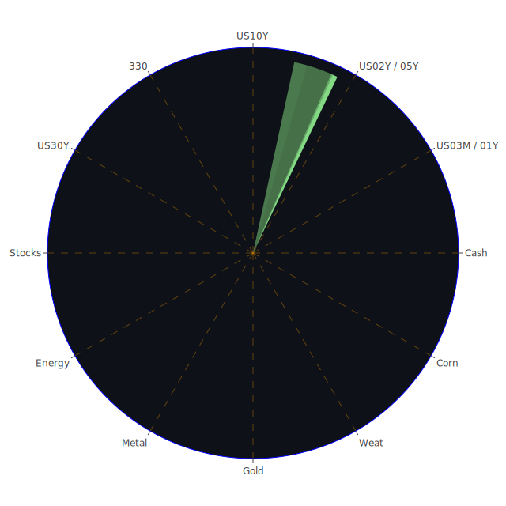

# （一）三位一體視角：空間面（Spatial）
所謂空間面，主要著眼於全球各地市場之間的聯動與新聞事件的發生地點及其在地影響，並嘗試從經濟學、社會學、心理學與博弈論做跨領域假設。

1. **主要市場區域與新聞事件交織**
   - **美國市場**：近期新聞顯示，美國市場在大型科技股（如AAPL、MSFT、GOOG）、零售股（如WMT、TGT）以及銀行股（如JPM、BAC）等方面仍風波不斷。新聞可見對於辦公室復工（RTO）之爭議，部分企業如銀行類股（JPM）管理層態度強硬，顯示內部人力資源結構面的紛爭與社會心理衝擊或將影響公司士氣。另有多家企業財報顯示，美國消費數據及存款變化（銀行存款仍相對高位）存在一定的「矛盾」：一方面通脹壓力仍然存在，另一方面又顯現企業利潤因高成本而被壓縮。博弈論的角度看，美聯儲緊縮策略與企業擴張意願彼此角力，若利率仍在高水準徘徊，將使融資成本與企業投資決策在空間上出現進退維谷的態勢。
   - **歐洲市場**：從新聞內容看，歐洲受到奢侈品股（如RMS、KER）與汽車股（BMW）等板塊動向驅動。此外，德國政治動態近來顯示出一場地區選舉中極左與極右聲浪同步擴張，引發社會不安與政局動盪。對於企業信心來說，政治不穩定可能短期削弱投資意願。但從心理學看，越是動盪的政治情境，有時反而刺激本土投資者對特定「避險類資產」或「相對安全」股份進行投入。從新聞觀點看，德國近年在武器研發、軍工上的意圖提高（如NOC、RTX相關新聞多少透露西方國防供應鏈需求），這既是空間面的外交與軍事合作，也牽涉地緣政治博弈。
   - **亞洲市場**：中國消息顯示地方政府債務壓力加劇，房地產價格再度下滑的風險仍然存在，帶來金融系統流動性考驗；澳洲則有公司董事會內鬨及退出現象，引發對澳洲企業治理和流動性風險的擔憂。新聞中亦提到中國的防禦匯率措施對大行造成壓力，金融機構可能產生長遠不良債務風險。心理學角度而言，不確定性易使投資者更傾向短線交易；然而在博弈論層面，這也可能吸引擁有冒險基因的資金尋求套利機會。

從經濟學觀察，各國在貨幣政策、財政政策上的取態雖互不盡相同，但在全球化市場下難脫「聯動性」。當國際主要資金開始調整投資組合，往往會同時出現多市場共振。社會學面向顯示，地區衝突（中東地區、烏克蘭等）持續牽動原物料及軍工需求；心理學層面裡，市場擔憂情緒易受負面新聞驅動，也會因正面事件而瞬間轉向樂觀，顯得脆弱又善變；博弈論暗示多個大國在政治與經濟決策上既互相競爭又需合作，其對外政策的拉鋸是空間面市場波動的深層動因之一。

2. **空間面正反合**
   - **正（Thesis）**：全球市場持續一體化，資金流動效率高，任何地區利好皆可能輻射至其他市場。
   - **反（Antithesis）**：地緣政治與區域性衝突、地區經濟結構差異，將加大各國市場波動的分化程度。
   - **合（Synthesis）**：在多極化的世界格局下，投資者或需在全球主要市場的資產中做適度佈局，分散風險，捕捉區域性的亮點，同時留意政治衝擊。

---

# （二）三位一體視角：時間面（Temporal）
時間面著重短期、中期、長期的市場走向與新聞資訊的時序安排。此處包含對歷史類似場景的參照，與對未來可能發生的風險情境做大膽假設。

1. **短期：新聞爆發與情緒衝擊**
   - 依照近期新聞，有關部分公司如TSLA在歐洲銷售下滑、品牌形象受創；部分零售品牌（例如Forever 21）則再度傳出重整或破產謠言。在投資心理層面，負面新聞密集出現容易激化恐慌和拋售行為。短期往往存在「市場反應過度」的情況。
   - 加密貨幣新聞（如DOGEUSD、ETHUSD、BTCUSD）近期反覆出現正面報導（關於技術突破或機構資金進入）與負面報導（監管升級、交易所糾紛）相互交織。此種高波動常見於短期博弈，容易導致「順勢交易」與「短線獲利了結」的行為反覆出現，助漲也助跌。

2. **中期：貨幣政策與企業佈局**
   - 從美聯儲（Fed）釋出的訊息觀之，近期OIS Fed Fund Rate顯示在4.33上下波動；雖然相比去年的5.33已有所下降，但也需考量過往歷史：在貨幣緊縮情境下，市場往往還會面對流動性進一步收縮與潛在衰退壓力。大量新聞顯示企業在這樣的融資成本環境中，資本支出會比以前更為謹慎。Fed和其他央行動向可望成為中期市場走勢的主導因子。對應社會心理和企業決策脈動，中期資金選擇勢必更傾向穩健或防禦型標的（例如國債、黃金、防禦性股票），同時也有企業開始布局新產業（如AI、先進製造）以求在下一輪經濟擴張週期中取得先機。
   - 在社會學面向，中期經濟政策與政治風向標常促使民眾或團體對政府之施政成效產生質疑或信任反彈。例如新聞裡對「德國選舉」與「美國國防預算」的討論，都可能成為中期經濟現象的一部分。若民粹或極端政黨力量上升，市場的波動也可能擴大。

3. **長期：結構轉型與歷史借鑑**
   - 參照歷史相似場景：1980年代美國通膨高企時，短期利率劇烈波動，最終在金融去槓桿與大規模產業轉型後，才開啟新的成長週期。當前高通膨雖暫時放緩，但結構性問題（供應鏈重組、地緣爭端、能源轉型）仍未解決，市場仍有「結構性高成本」與「需求不確定」的風險。
   - 對於加密貨幣等新興資產而言，長期生存必然要經歷多次監管回合與投資者行為的成熟化。歷史上科技泡沫（如網路泡沫）也曾帶來巨幅震盪，但部分龍頭企業終於在大浪淘沙後存續至今，同樣的劇本或可類比加密領域。博弈論視角下，大型金融機構、監管部門與市場玩家之間的博奕或將在未來數年醞釀出新的遊戲規則。

4. **時間面正反合**
   - **正（Thesis）**：短期消息面影響顯著，中期貨幣政策趨勢明確，長期產業走向迴歸實質技術與結構轉型。
   - **反（Antithesis）**：局部事件（如戰爭、金融危機）可能在短期或中期就重創全球經濟，並改寫原本的長期走勢。
   - **合（Synthesis）**：投資人可根據短期訊息靈活調整部位，但仍需遵循中期風險與長期價值的原則做整體規劃。

---

# （三）三位一體視角：概念面（Conceptional）
概念面強調從理論與知識體系出發，探討市場所運行的可能機制，搭配新舊觀點融合。

1. **經濟學：供需、通脹、貨幣政策**
   - 美國國債（US10Y、US02Y等）殖利率近來維持在4%至4.3%左右區間波動。從原始資料可見，美國30年國債（US30Y）約4.56%，比起3個月短債利率（4.30%）的差距略有擴大或收斂，其曲線已呈現不同程度的倒掛或接近平坦化。若10年-3個月利差繼續擴張或重新倒掛，都預示經濟衰退風險不容忽視。通膨率則維持在3.00上下，遠高於目標2%，但已低於前年及去年尖峰。市場對Fed下一步行動猶豫不決。
   - 資產類別間也可看到通膨恐慌時黃金（XAUUSD）往往作為對沖手段，新資料顯示黃金對石油（GOLD OIL RATIO）已來到42.26之高，與一年前25.88相比，顯示黃金價值在相對抬升或石油價格相對走弱，也可能同時存在。此屬於典型的「通膨保值或地緣衝突避險」經濟學現象。

2. **社會學：群體情緒與信任機制**
   - 新聞裡大量負面事件（戰爭、恐攻、政治極化）易使群體心態轉向恐懼。據新聞顯示，部分市場恐慌情緒與不安（如對某些零售品牌預期破產、對某些科技企業併購或業務收縮）正發酵。由此衍生投資避險情緒，資金可能流入黃金、美國國債或其他低波動標的。對於銀行股（如COF、JPM、C）等，如果經濟前景糟糕，社會對金融體系信任度下降，也會導致銀行槓桿收縮、貸款意願減弱，令整體市場資金面緊張。
   - 也有正面新聞如AI技術、可再生能源或醫藥突破等，能激發群體對未來創新的期待，帶來脈衝式投資浪潮。這種現象在社會學與投資心理的交融中通常呈現「牛熊急轉」的極端化傾向。

3. **心理學：投資者行為與泡沫感知**
   - 泡沫分數為判斷市場過熱或高風險的一大指標，近期不少資產（例如某些大型科技股、部分歐洲奢侈品股、乃至某些加密貨幣）出現相對較高泡沫分數，顯示投資者對未來預期高度樂觀或投機行為增強。然而此種高樂觀情形往往是最易催生泡沫化的一個階段。
   - 心理偏誤包括「過度自信」與「從眾」在市場上屢見不鮮。若媒體或機構報告狂熱追捧某些標的，散戶與部分機構資金就會蜂擁而入，使價格有被推高的風險。待到基本面驗證落空，拋售也會來得猛烈。

4. **博弈論：大國之間、機構之間、投資者之間的互動**
   - 大國在政治上競合，例如對半導體產業的競賽（NVDA、AMD、INTC等都牽涉在內），或對能源供應的控制（石油OIL、鈾UX1!等），都是跨國博弈。這種賽局往往反映在貿易、關稅、匯率操控與高端製造鏈布局上，導致不同比例的市場風險與機會。
   - 金融機構之間也會進行可見或不可見的博弈，包括跨市場套利、打壓弱勢資產、擴大或鎖定利差等行為。對小投資者而言，若難以洞悉內部資訊，盲目跟風就會面臨高風險；對主權基金或大型資產管理公司而言，或能透過多市場、多部位的對沖來平衡長期目標。

5. **概念面正反合**
   - **正（Thesis）**：經濟學理論、社會學分析、心理學研究與博弈論的結合可以幫助我們更全面理解市場運作。
   - **反（Antithesis）**：理論與實際往往有差距，尤其在不斷演化的全球局勢中，單一理論可能無法覆蓋所有突發事件。
   - **合（Synthesis）**：綜合多學科觀點，維持動態調整與靈活應變，才可能避免在資訊不對稱的市場中陷入盲點。

---

# （四）將上述資訊進行三位一體正反合簡析（以最少文字綜合最多意義）
1. **正：全球流動性與訊息流高度互聯**，任何區域正面政策、技術突破都能在短時間內促成全局資金湧入。
2. **反：地緣對立與政策分化導致市場高度波動**，某些局部衝突或負面衝擊可能迅速擴散並影響投資心態。
3. **合：在多學科視角下做適度佈局**，放眼短中長期，並根據空間面差異調整資產配置。

---

# （五）風險對沖與投資組合機會
基於「彼此相位盡量滿足120度、相關係數約-0.5」的大膽假設，可嘗試在股票（科技與非科技）、債券（長短年期美國國債）、商品（黃金、石油、農產品）、加密貨幣，以及外匯市場之間做分散。以下僅以文字敘述，強調概念，而非嚴格運用數學公式：

1. **美國長天期國債 + 部分科技股 + 黃金**  
   - 長天期國債（US30Y）在利率高企時短期價格波動大，但若市場進入衰退或避險心態升溫時，該部位可能逆勢上漲。  
   - 科技股（NVDA或AAPL等）在創新驅動、AI熱潮的背景下仍具吸引力；短期遭逢利空或獲利了結時，與其他資產（如國債或黃金）之間相關度不算極高。  
   - 黃金（XAUUSD）可在地緣政治或通脹升溫時扮演防禦角色。綜觀歷史，黃金與股票、債券的長期相關度大體偏低。

2. **防禦性股票（食品、日常用品） + 石油或能源期貨 + 歐洲奢侈品股**  
   - 食品股或日常消費用品股（KO、ULVR）具相對抗跌力，尤其在經濟下行時，生活必需品依然有穩定需求。  
   - 石油（USOIL）或鈾（UX1!）期貨若面對地緣衝突或供給變數，價格易起伏激烈，與必需品股可能呈相對低或負相關。  
   - 歐洲奢侈品股（RMS、KER）雖具高beta，在不確定的環境下，奢侈品需求有時能維持驚人韌性；當市場情緒轉好時，又能展現高彈性，故在分散配置中也可扮演收益補充角色。

3. **美國金融股 + 農產品期貨 + 加密貨幣**  
   - 金融股（JPM、BAC、COF）與宏觀經濟高度聯動，但與某些原物料商品或加密貨幣間的走勢不一定呈高正相關。在宏觀環境穩定時，銀行股或具槓桿特性，有較高的增長潛力；當市場動盪時則可能大跌，但此時若農產品期貨受氣候或地緣影響逆勢上揚，就能平衡風險。  
   - 加密貨幣（BTCUSD、ETHUSD）高波動且風險甚高，但其走勢有時與傳統金融市場並不完全同步。無論升或跌，皆可在多元對沖策略中發揮相位差異之效果。

若依此思路再配合如博弈論所提的大型機構操作，這些資產組合之間於不同時間具備-0.5左右的相關性並非不可能，但實際需要更進一步的量化分析。此處僅為概念說明。

---

# （六）多項資產間之漣漪效應與傳導路徑
若要做「兩兩相互驗證的篩選假設」分析，可簡略舉例：

1. **科技股（如MSFT）與加密貨幣（BTCUSD）**  
   - 當市場對科技股充滿熱情，資金也可能部分外溢至加密貨幣，以致雙方同漲；一旦科技股現獲利了結，投資者短期內或轉向加密貨幣投機，也可能增強加密泡沫風險。這種「正面漣漪」後易出現負面共振。  
   
2. **美國國債（US10Y）與黃金（XAUUSD）**  
   - 若地緣政治危機爆發或經濟數據大幅衰退，市場恐慌升溫，黃金與國債常同向上漲；但在某些通脹高漲、利率又快速抬升之際，長期國債價格會承壓下跌，而黃金則可能因地緣衝突或通脹預期續漲，兩者走勢分歧。此時「正負」的漣漪效應交疊，投資組合中若同時持有這兩項，反而能降低整體波動。

3. **石油（USOIL）與美國銀行股（BAC、COF）**  
   - 經濟旺盛時，石油需求上升，銀行的放款業務也活躍；然而若石油價格飆升至企業難以承受時，又會衝擊企業獲利，並反射到銀行壞帳上升，導致金融股下跌。這是一種「負面迴圈」的可能傳導。  
   - 在博弈論層面，OPEC、主要產油國以及國際金融機構之間互相角力，也增添了石油價格與金融股基本面之間的不確定聯動。

經過此種多維度、三位一體的篩選假設分析之後，投資者更能理解某些資產為何同漲同跌，哪些資產走勢能夠互補，以及哪些資產走勢可能會加重彼此風險。

---

# 投資商品泡沫分析：關鍵觀察與警示

以下僅列出若干主要資產的概念性分析，並在敘述過程中提及相關新聞與歷史類似狀況，以提示可能的高泡沫或風險：

- **美國國債**  
  近期殖利率維持高檔，長短期利差局部倒掛，惟若經濟衰退機率上升，長債價格仍具上漲潛力。泡沫風險相對較低，但需提防政府舉債規模與財政僵局帶來的長期信用問題。歷史上，美國國債曾在多次金融危機中發揮避險功能，現狀亦有望繼續，但任何違約疑慮都會動搖其根本地位。

- **美國零售股**  
  部分零售商正面臨線上電商競爭與消費者購買力下降問題。新聞傳出Forever 21可能進一步裁員或關店，Joann遭遇破產風險，體現疫情後零售業加速洗牌。若經濟增長不如預期，零售股可能泡沫化並迅速破滅。

- **美國科技股**  
  AAPL、MSFT、NVDA等龍頭企業因AI、新產品期待而仍受追捧，泡沫指標雖高，但同時亦擁有扎實現金流和廣大生態系。與2000年網路泡沫有所差異，但高估值也意味著風險並存。若未來技術增長趨緩或利潤率縮水，將面臨大幅回調。

- **美國房地產指數**  
  隨著抵押貸款利率升高（30年固定房貸利率已升破6.8%），房地產市場需求在某些地區可能降溫或下修價格。長期而言，若通脹持續高企，房地產也具一定抗通膨能力，但短期投機行為或高槓桿操作將承擔相當風險。歷史上2008年次貸危機便是一例證。

- **加密貨幣**  
  BTCUSD、ETHUSD、DOGEUSD等皆呈高波動性。新聞面看，監管壓力與機構進場交織，加密市場走勢分歧。曾有多次類似2021年牛市迅速飆漲並回落的歷史。泡沫分數常偏高，投資須格外審慎。

- **金/銀/銅**  
  黃金在地緣不確定與通脹壓力時具吸引力；白銀、銅則更多受工業需求驅動。新聞顯示全球經濟成長放緩可能拉低銅價，但若中國復甦超預期，又可帶動銅強勁上行。金銀銅之間的相對價格關係可反映對通脹與工業生產的預期。近年黃金逐漸邁向高位，需留意回調風險。

- **黃豆 / 小麥 / 玉米**  
  這些農產品（SOYB、WEAT、CORN）與天氣、地緣衝突、航運等息息相關。若極端氣候或局部衝突影響主產區則價格飆升，但一旦產量回復，價格也可能大幅回落。此類商品因金融化程度升高，泡沫風險不可忽視。

- **石油 / 鈾期貨UX1!**  
  石油需求與地緣政治波動高度正相關，鈾則牽涉核能發電議題。若國際能源轉型推進，加之政治干擾，油價可能上下劇烈晃動；鈾價則在部分國家考慮恢復核電下具中長期上行空間，惟政策與安全問題會牽動市場情緒，泡沫風險應當注意。

- **各國外匯市場**  
  EURUSD、GBPUSD、USDJPY等主要貨幣，近期皆受央行政策與經濟基本面影響。若歐元區通脹持續或政治局勢動盪，歐元匯率恐受壓；英鎊亦面臨英國自身政治與經濟結構挑戰。日圓若日本政府繼續寬鬆政策，對美元可能維持疲軟。外匯市場泡沫相對難以像股票般衡量，但需警惕大幅度波動。

- **各國大盤指數**  
  歐洲如FCHI、GDAXI，亞洲如SSE:000300（此處省略券商標記為000300），美國如NDX等，皆在全球資金流動和宏觀政策共振下起伏。大盤指數泡沫風險往往不集中於單一板塊，而是整體估值偏高或偏低的綜合性體現。

- **美國半導體股**  
  NVDA、AMD、INTC、KLAC等。AI及高性能計算需求旺盛，但評價水準已大幅拉升。若未來需求不如預期或有新競爭者進場，回調壓力不容小覷。

- **美國銀行股**  
  JPM、BAC、COF等。雖然現在存款水平相對高，但若經濟走下行或違約率上升，金融股面臨信用風險擴大。2008年金融危機就是前車之鑑，一旦資本充足率與不良貸款激增，銀行的脆弱性便顯現。

- **美國軍工股**  
  LMT、NOC、RTX等。地緣衝突若加劇，軍工訂單增加，股價易走升。但和平曙光或預算削減時，也可能造成企業營收急降。軍工本質上受政治周期牽動，歷史上亦證明軍工企業股價與國防開支呈正相關，短期泡沫風險視衝突態勢而定。

- **美國電子支付股**  
  PYPL、V等。電子支付在疫情後依然是大趨勢，但市場競爭激烈。近期若經濟疲軟、交易量萎縮，企業營收也會受影響；若技術創新或消費恢復快速，股價仍有上行空間。

- **美國藥商股**  
  JNJ、MRK等。醫藥領域在研發成果與專利佈局方面具壁壘，但也面臨生技產業競爭。新聞指出部分企業遭遇訴訟（例如針對生物相似藥的專利爭議），可能帶來股價波動。歷史上大藥廠表現相對穩健，但政策風險與研發失利都會造成短期跌幅。

- **美國影視股**  
  DIS、PARA等。串流平台、票房表現、消費習慣轉變都構成不確定性。DIS在主題樂園收益與串流訂閱之間尋找平衡，PARA若內容投資失利也可在短期造成股價劇烈波動。

- **美國媒體股**  
  CMCSA、NYT等。新聞內容付費模式與廣告營收模式不斷演化。網路與社群平台興起下，傳統媒體的吸金力不如過去，泡沫風險不大但衰退風險得關注。

- **石油防禦股**  
  XOM、OXY等。若原油價格高漲，該類股會受益，但若各國能源轉型加速或需求下滑，亦可能拖累股價。高度依賴國際關係與產油政策博弈，風險也顯著。

- **金礦防禦股**  
  RGLD等。金價走勢直接影響礦企收益；若金價持續上揚，該類公司或能提供高槓桿收益；相對地，一旦金價滑落，礦企也面臨較大跌幅。

- **歐洲奢侈品股**  
  RMS、KER。近年靠新興市場（尤其中國）消費者支撐，若中國經濟放緩或其他新興市場貨幣動盪，需求受挫，該股就可能泡沫破裂，反之亦是利多驅動。

- **歐洲汽車股**  
  BMW、MBG等，轉型電動化持續，但與全球經濟週期鏈結密切。若消費信心不振或供應鏈再次斷裂，該類股仍有大幅震盪風險。

- **歐美食品股**  
  KO、ULVR等。屬於防禦型，儘管新聞中偶有負面消息（如原料成本上升），但企業具長期抗波動體質。然而估值過高時也會面臨獲利了結壓力。

---

# 宏觀經濟傳導路徑分析
宏觀層面，主要是政府政策、央行貨幣立場、國際收支和地緣政治對資本流向造成影響。新聞提及各國財政政策和央行操作，如Fed收緊或放鬆，直接影響全球利率水準與資金成本；地緣政治升溫或衰退，則引發對軍工、原油、貴金屬的需求。另一方面，跨國企業投資策略會隨之調整，擴大或收縮該地區就業與研發投資，從而影響該地區GDP、就業率和消費力，進一步回饋到資產價格。

---

# 微觀經濟傳導路徑分析
微觀層面考量企業財報、行銷策略、供應鏈管理、消費者行為等因素。若企業獲利預期向好，管理層可能擴大支出並提振該產業供應鏈。反之則縮減開支並壓低需求。對投資者而言，單一公司或行業的營運失誤（如董事會內鬨、產品醜聞）都可能讓股價和市佔率蒸發；這時又會刺激其他競爭者擴張。此種路徑往往在新聞中具相當關注度。

---

# 資產類別間傳導路徑分析
資產之間並非孤立。舉例來說，當央行升息，債券殖利率上行，股票估值面臨壓力；若升息導致經濟衰退預期上升，又使資金流入黃金避險；同時可能讓外匯走強或走弱。某些産品如石油上漲則加劇通脹並壓縮企業利潤，而農產品價格衝擊則影響消費者購買力和企業成本結構。每一環節都透過價格與需求供給關係相互影響並傳導。

---

# 投資建議：穩健、成長、高風險 三種配置（總和100%）

以下將提出三種可在當前環境下的配置，佔比僅作示範，各有三個子投資品作為範例參考。投資者仍須根據個人風險承受度調整。

1. **穩健型（約50%）**  
   - **美國短天期國債**（例如US03MY或US01Y），利率較高且流動性好，可在市場波動時提供一定安全墊。  
   - **黃金現貨**（XAUUSD），長期避險功能，對衝地緣政治風險與通膨。  
   - **高級投資等級企業債**，評級AAA或AA，雖非零風險，但違約機率較低，收益優於銀行定存。

2. **成長型（約30%）**  
   - **美國大型科技龍頭股**（如MSFT或AAPL），持續研發與穩固生態系，有望中長期成長，但要注意估值風險。  
   - **半導體設備/晶片股**（如KLAC或AMD），受AI、高速運算需求帶動，未來幾年成長機會大，同時風險也不可小覷。  
   - **歐洲奢侈品股**（如RMS或KER），全球富裕族群消費力雖受宏觀環境影響，但仍有韌性成長空間。

3. **高風險型（約20%）**  
   - **加密貨幣**（BTCUSD、ETHUSD），波動劇烈，可能帶來顯著收益也可能大虧，僅適合少量佈局或短期操作。  
   - **新興市場科技股**，如中國或其他亞洲市場的科技企業，政策面具不確定性，但若趨勢翻轉，漲幅可觀。  
   - **原物料期貨**（石油或農產品），適合捕捉短期價格急漲機會，但需承受下跌風險與滾動保證金壓力。

---

# 風險提示

投資有風險，市場總是充滿不確定性。  
1. 當前全球仍存在許多潛在風險：地緣政治緊張、疫情變數、經濟衰退可能。新聞面顯示，許多看似孤立的事件其實可能引發市場聯動。  
2. 泡沫分數高的資產，需警惕過度追高與市場反轉風險，2000年網路泡沫與2008年金融危機皆是警示前例。  
3. 利率與通脹趨勢可能在未來仍有意料之外的變化，切勿低估貨幣政策急轉的殺傷力。  
4. 加密貨幣、單一股票或期貨槓桿操作，皆可能在短期內招致巨大虧損。  
5. 本報告僅為分析參考，並非對任何投資標的的保證或建議，投資人應根據個人風險承受能力和資金狀況自我判斷。

總結而言，在多重新聞事件與泡沫風險指標交織下，市場充滿不確定性。從三位一體（空間面、時間面、概念面）的維度加以綜合，能使我們更清楚地洞察資產之間的連鎖反應與漣漪效應。唯有建立動態調整機制、保持資產多元配置，投資者方可在全球化的錯綜局勢中爭取相對穩健與靈活的財務策略。無論是穩健型投資組合還是高風險投機，都必須依託對整體大環境之持續追蹤、深思熟慮與審慎的風險控管，方能在不斷演化的市場中立足。請勿忽視任何泡沫風險高的投資警告，檢視歷史教訓始終至關重要。願此報告所提供之各方觀點能協助投資者保持冷靜與理性，並為自我投資決策增添更全面的觀察視角。

 
Daily Buy Map:

 
Daily Sell Map:

 
Daily Radar Chart:

 
