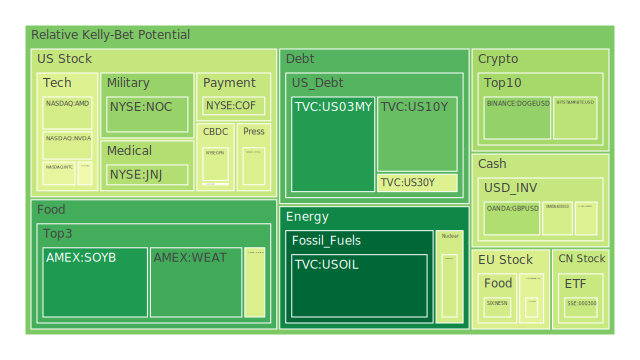
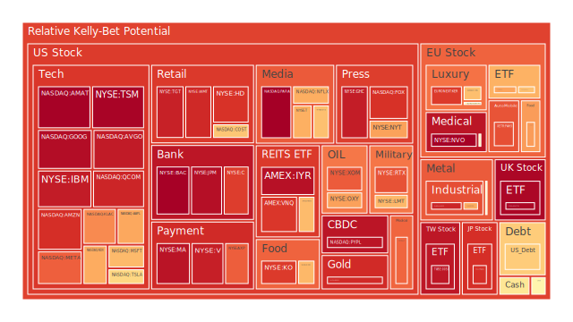
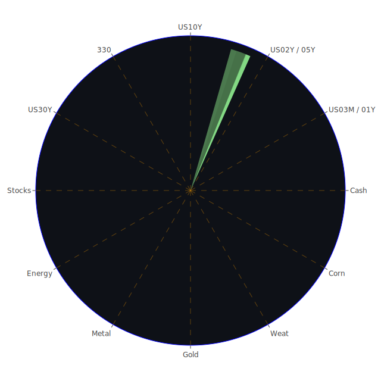

# 投資商品泡沫分析

以下就各大類資產進行泡沫風險與新聞觀點的綜合分析，參考經濟學、社會學、心理學以及博弈論之論點，並援引歷史事件做比照。此處同時考量了近期新聞中對市場情緒的各種正負面訊號，以及投資商品在短期、中期與長期內可能面臨的供需變動。由於各類資產的定價背後都伴隨不同的交易機制與市場預期，所以即便在同一時期，也可能因為投資人認知與政策介入程度的差異，導致各資產間泡沫風險出現不同的「漣漪效應」。以下各項商品分析皆以繁體中文敘述，並融合部分歷史行情與新聞來加深投資者對風險的認知。

---

- **美國國債**

  美國國債向來被視為最重要的避險資產之一。然而近幾季以來，因聯準會利率政策走向反覆，以及美國政府支出和舉債上限爭議在政治層面不斷發酵，長短天期殖利率出現顯著扭曲。近期新聞亦揭露，不少金融機構留意到美國國債總流通額的持有者結構發生些許變動：外資減持而國內投資機構持有比重上升，或有政治動機的國家主權基金正在重新調整配置。  
  歷史經驗顯示，在2007年前後、2019年中，以及2020年初的幾次利率大幅波動期，長期國債都曾被投資人視為「安全港」，故短時間有資金湧入推高債券價格。然而若經濟數據、地緣政治、央行政策語調一旦出現利空，情勢常瞬息翻轉。許多投資人忽略了當市場流動性快速緊縮時，甚至美國國債都可能被拋售以補充現金部位。  
  心理學與博弈論可用來解釋在國債交易中，投資人之間形成的共識如何瞬間瓦解：人人都想在「可承擔風險」的狀態下擁有國債，卻又在市場恐慌時一齊賣出。由近期的泡沫指數來看，即使美國國債的D1短期分數並不算最高，整體仍有隱性風險。社會學視角下，一旦政府財政赤字和債務上限問題再被放大，市場疑慮還是可能引爆泡沫。  
  因此，雖然美國國債常被歸類為「零風險」資產，但在非常態市況下仍有價格動盪劇烈的可能。對於中長線穩健投資者，適度布局仍具防禦性，但必須持續關注政府財政動態、聯準會政策與市場流動性。

- **美國零售股**

  近來美國零售業連番傳出負面消息。新聞揭示部分大型零售商因線下銷售持續疲軟而大舉關店裁員，包括布料、服飾、生活用品店面臨消費萎縮。這些訊息往往在社會心理學層面產生「恐慌效應」，使投資人不斷調降零售股預期。最近更有零售鏈無法尋得買家而宣布破產結束營運，說明消費力下滑衝擊已非個案。  
  從歷史案例來看，2008年金融海嘯時期便有數家美國零售龍頭關店潮，導致相關股票市值慘跌。對零售股而言，泡沫形成往往是當前景過度樂觀，高估了消費者的可支配所得與支付意願，一旦經濟逆轉或所得增幅趨緩，泡沫即應聲破裂。現今通膨雖可能已從高點回落，但利率水準和貸款成本仍在抑制消費。  
  經濟學角度下，零售股交易價格深受預期未來消費意願的影響；社會學層面顯示，市場對失業率變化、薪資水平報告非常敏感。博弈論則闡述了大零售商之間的價格競爭可能導致獲利空間進一步受壓縮。近期任何對消費市場的負面新聞，如「大眾縮衣節食」、「商場人潮不再」都可能再度衝擊零售股。  
  整體來說，美國零售股泡沫程度視經濟週期與政策環境而定，但短期訊號不佳，多家企業財報預估的營收與獲利指引並不樂觀。投資者應謹慎評估零售業對信用市場的依賴度、庫存水位，以及電商競爭格局。

- **美國科技股**

  科技股在過去幾年獲得資金高度青睞，包括人工智慧（AI）與雲端運算相關題材多次成為市場熱點。不過從新聞所見，部分科技企業在龐大的研發與資料中心投入後，後續現金流受到考驗，甚至傳出裁員或合併以削減成本。大型企業例如超大市值公司在AI方面掌握優勢，但同樣要面對製造端或專利糾紛。  
  2000年的網路泡沫即是經典案例：許多新創公司憑藉「未來無限成長」的敘事獲得天價估值，一旦市場發覺獲利無法匹配股價，原本的熱潮迅速瓦解。社會心理學解釋，投資人對創新技術抱持夢幻式期待，博弈論告訴我們：若有一間龍頭企業成功，跟進的投資狂潮就接踵而至，進而吹大整個科技板塊估值。  
  近期泡沫指數對於部分美國科技公司給出了偏高的短期分數（如D1或D7顯示風險抬頭），顯示股價或許仍在情緒驅動下維持高檔。若未來財報顯示AI或半導體營收不如預期，或者全球經濟放緩抑制了企業IT支出需求，科技股極可能出現大幅回調。故持有者需留意潛在修正風險，短線漲幅已整合許多正面題材。

- **美國房地產指數**

  在升息環境下，美國房地產市場的壓力越發顯現。近期房貸30年固定利率依然位於6%-7%左右的高檔，對剛需與投資買家都形成壓力。新聞指出多家房地產信託（REITs）收益不如預期，尤其辦公室空置率攀升，遠距工作趨勢讓部分企業縮減辦公空間。  
  2007-2008年金融海嘯就因次級房貸衍生品泡沫破裂導致銀行體系爆雷，最終拖累整體經濟。現今雖然貸款條件與監管較以前嚴格，但不少地區的房價仍歷經數年飆升，存在高估風險。一旦消費者無法負擔高利率而停止購屋，或商辦需求長期低迷，房地產市場可能面臨量縮價跌。社會學與經濟學層面皆認為，當貸款利息支出過重時，整體民間消費力會被進一步擠壓。  
  因此，美國房地產指數雖然尚未大規模崩跌，但市場普遍預期後市仍存下行壓力。若經濟進一步降溫，失業增加，導致違約或法拍案件上升，則恐進一步引發房地產泡沫破裂的連鎖效應。

- **加密貨幣**

  加密貨幣市場自歷經多輪飆漲與暴跌後，目前的交易量與市場情緒都相對收斂。然而新聞與政經因素仍能迅速炒作價格，像是某些政治或金融機構聲明可能會採用區塊鏈技術，或是部分國家祭出限制性監管，都能立刻引發幣價劇烈波動。  
  心理學層面常見的「恐懼與貪婪」指數對加密貨幣影響深遠，一則正面消息便足以讓散戶快速湧入推高行情，一則負面訊息又能觸發集中性拋售。博弈論亦指明市場對加密貨幣「是否真正能成為支付或儲值手段」的共識尚未完全建立。  
  歷史經驗如2017年底到2018年初，比特幣從近乎兩萬美元崩至三千美元區間；2021年中比特幣亦曾腰斬。對於以太幣、狗狗幣等亦有類似經驗。本報告基於近期的泡沫風險指標來看，短期（D1）雖然不一定處在頂峰，但中期（D14, D30）依然不低，暗示只要有利空來襲，價格就有大幅下修可能。  
  總體而言，加密貨幣的投機性依舊強烈，如果沒有足夠的避險及風控機制，極易在短時間內造成重大資金損失。

- **金/銀/銅**

  貴金屬方面，黃金常被視為對抗通膨或地緣危機的避險工具。近期國際金價在市場不確定因素下維持相對強勢，新聞同時顯示多個央行在增持黃金儲備。另一方面，銀、銅則更顯現工業屬性，景氣下行通常衝擊它們的需求量。  
  歷史上在2008年或2020年危機時期，黃金都出現過一波強勁漲勢，但同時也可能因投資人流動性需求急增而短期拋售。在社會學和博弈論視角下，大量資金湧入或撤出黃金ETF時，常造成價格瞬間脫離基本面的急升或急跌。  
  至於銅價往往被視為「經濟溫度計」，如果全球主要經濟體的製造業需求不振，銅價會面臨壓力。過去中國與美國對銅的需求常主導全球行情，因此若中美之間貿易摩擦再度升溫，也可能直接衝擊銅價走勢。  
  從近期的泡沫指數和新聞綜合判斷，金價雖維持高檔，但若全球回歸穩定或利率高企吸引資金回流債市，金價泡沫可能迅速排出。銀與銅則仍需注意工業需求端的波動性。

- **黃豆 / 小麥 / 玉米**

  農產品市場長期受到天氣、地緣政治與國際貿易政策的影響。新聞提到南美洲或黑海地區的作物生產及運輸遇到一些中斷因素，恐提高穀物價格。若全球衝突加劇，農產品出口管制也會干擾國際供給，引發期貨價格劇烈震盪。  
  回顧2012年美國乾旱、2014年黑海地區緊張情勢，都曾經造成黃豆、小麥和玉米期貨在短期內大幅上漲。之後當供需回歸平衡，期貨價格又迅速回調。博弈論顯示，投機資本一旦看好缺貨行情，會集中買入並拉抬期貨價格，但也可能因一場及時雨或談判協議化解供應風險而瞬間跳水。  
  從近期泡沫指數來看，部份農產品的短期風險雖不算最極端，但仍不可忽視農產品的急漲急跌特性。一旦出現顛簸的國際衝突或重大天氣事件，價格可能迅速飆高；若事件落空或供應線恢復正常，又會急轉直下。

- **石油 / 鈾期貨（UX!）**

  石油的供需往往由國際政治局勢、產油國政策、以及全球景氣循環共同決定。新聞顯示近期石油市場多空互見：產油國可能減產的風聲常令油價上行，但經濟放緩的疑慮又壓抑需求。加上部分頁岩油商在資金與投資節奏上較為謹慎，令油價在70美元上下震盪。  
  回顧2014-2016年，油價從100多美元崩至30美元區間顯示，即使石油市場體量龐大，也無法抵擋供需突變時的泡沫破裂。2022年更因地緣衝突與解封需求高漲，石油價格一度飆升，之後又因市場預期經濟放緩而修正。心理學層面顯示，投資人對油價的預測常帶有情緒化及過度樂觀或悲觀的成分。  
  鈾期貨則受核能政策與安全疑慮支配，一旦各國加大核能發電投入，鈾價可能快速攀升，但若發生核能事故或反核聲浪上揚，鈾價又有急跌風險。這種泡沫潛勢相當依賴政治決策的風向。  
  整體來看，石油與鈾的價格一旦進入投機熱點，容易大起大落。對想要布局該領域的投資者而言，需特別留意政策與地緣新聞走勢，並慎防流動性不足時引發的劇烈拋售。

- **各國外匯市場**

  外匯市場中，美元對其他貨幣的強弱往往是全球資金流向的指標。近期若聯準會政策立場偏強或市場避險需求升溫，美元可能增值，新興市場貨幣或歐元則面臨貶值壓力。倘若某些國家為穩定通膨或支持出口而進行貨幣干預，也可在短期內干擾匯率走勢。  
  歷史上，亞洲金融風暴（1997）與歐債危機（2010）皆顯示匯率大幅波動對實體經濟破壞力很大。一旦匯率出現非理性炒作或大規模熱錢出逃，往往醞釀本幣資產泡沫的破滅或進口成本飆升。博弈論上，央行與投資人之間存在策略互動，一旦市場猜測央行會放任貨幣貶值，投機者就可能加碼空頭部位，形成負向循環。  
  因此，外匯的泡沫風險不僅反映在匯價水平，更包含央行政策公信力與外匯儲備的充足度。近來新聞顯示部分國家因通膨壓力而提高利率，意圖穩住本幣，但仍然難擋美元或他國貨幣的強勢；如此的競爭性貶值或升值，容易帶來後續不穩定。

- **各國大盤指數**

  全球各大指數如美國的S&P 500、歐洲STOXX 600、亞洲Nikkei或滬深指數等，都受企業獲利預期與國際政經形勢的牽動。近期新聞面訊息錯綜：一方面有人看好解封後的消費與投資反彈，另一方面又擔憂通膨與高利率壓制經濟成長。  
  從歷史角度看，2000年、2008年、2020年等多次股災都顯示指數泡沫累積到某個臨界點，可能在一兩個月內出現急速殺跌。社會學分析指出：散戶與機構若同時在高點瘋狂湧入，甚至加槓桿追高，就會形成「順勢擴張」的牛市假象，結果在利空出現時一發不可收拾。  
  目前部分大盤指數雖仍在高位，甚至屢創新高，對比企業的真實獲利能否支撐如此估值，存在疑慮。新聞報導多次提示：若未來供應鏈或就業市場的數據轉趨疲弱，機構投資人可能帶頭撤資，帶動大盤指數更劇烈的修正。

- **美國半導體股**

  半導體是當代科技產業的核心，涵蓋CPU/GPU、記憶體、特殊應用晶片等。新聞披露多家龍頭企業在AI時代享有高營收成長，但生產設備昂貴、技術研發周期長，導致資本支出驚人。過去數次產業週期的興衰，如2001年網路泡沫、2008年金融危機、2020年疫情，都對半導體需求造成急劇波動。  
  博弈論觀點認為，各國對半導體的戰略地位都極重視，一旦地緣衝突或貿易限制升級，對晶圓生產、關鍵原物料、先進設備出口等皆可能有衝擊。若企業營收原本依賴特定國家市場，政治與疫情狀況都可能令庫存調整失控，引爆泡沫。  
  目前部分半導體股的短期泡沫指數仍偏高。市場對AI晶片供需看好，造成部分股票市盈率攀升到極度水位。一旦競爭對手搶占市場或下游需求趨緩，股價將面臨大幅回檔風險。在長期看好半導體成長的同時，也應警惕投資人可能因短線利空而出現集中拋售。

- **美國銀行股**

  銀行股通常在利率上升期能擴大利差，但同時也面臨較高的信用風險。新聞中多次出現金融機構預警：消費者貸款違約率恐上升、商業地產壓力浮現、零售業呆帳等問題都會反映在銀行資產負債表。  
  2008年次級房貸危機的慘痛教訓便是銀行過度槓桿與風險曝險，如果貸款評估鬆綁，泡沫形成後的爆破將極具殺傷力。社會心理學與經濟學顯示，人們在經濟擴張時期往往高估安全性，樂意貸款投資，但景氣回落就可能集中違約。  
  近期新聞顯示個別銀行開始縮減分支或調整員工規模，透露對未來經營前景趨於謹慎。儘管大型銀行因政策監管更嚴，風險可能相對可控，但中小銀行或地區型銀行對房地產、零售或地方產業的曝險較高，一旦景氣下行，泡沫破裂的沖擊更大。

- **美國軍工股**

  在地緣衝突可能升溫、全球局勢不穩定的背景下，軍工產業往往攫取國防訂單，帶動股價短期飆高。新聞中提到國防預算若增長或削減，都立刻反映在軍工股的走勢。軍工產業的特性是與政府合約掛鉤嚴重，但同時也受政黨、預算協商等不確定因素干擾。  
  回顧歷史，軍工股也並非絕對抗跌。若政府財政吃緊或轉向，可能一口氣削減國防開支，導致相關公司訂單腰斬，股價應聲倒地。博弈論的角度認為，軍工大廠彼此雖有競爭，但在政治外交或軍售領域中也面臨「誰能在預算分配中獲得更多」的博弈結果。  
  近期高風險的國際新聞像邊境衝突、國防部對先進武器需求等，都可能炒作軍工板塊。若市場預期短期不會爆發大型衝突或預算縮編，軍工股或有泡沫縮水風險。對該領域的投資者而言，需要對政治風向保持警覺。

- **美國電子支付股**

  電子支付與金融科技近年來快速發展，各類行動支付、線上支付服務崛起。然而新聞披露部分電子支付巨頭為因應市場飽和與競爭，需要大量燒錢在技術研發、折扣優惠等。短期獲利能力成疑，而利率上升也增加了資金成本。  
  歷史上，新支付手段常在前期享有高成長，但若不能達到規模經濟，或競爭對手推出更有吸引力的服務，則可能面臨股價與估值的急速回落。社會心理學表明，投資人有時會過度美化新經濟形態的前景，形成一種「只漲不跌」的神話。  
  近期若零售消費持續疲弱，消費交易量減少，電子支付手續費收入將同步下滑。一旦公司財報與新聞對前景出現調降，股價可能有大幅下修風險，因此該領域的泡沫風險不可小覷。

- **美國藥商股**

  美國大型藥廠或生技公司一直備受矚目，原因在於健康與醫療需求長期看好。但新聞亦披露，部分藥廠在研發支出、專利保護到期風險、保險給付制度改變等方面的挑戰，使得藥廠獲利前景存在不確定性。  
  舉例來說，若某重磅藥物專利到期，市場立刻湧入學名藥競爭，原廠藥售價與市佔率就快速滑落。2000年代以來，不少大藥廠都因專利懸崖而股價劇烈波動。心理與博弈論層面，市場通常會猜測某家藥廠是否能成功研發下一個「億美元藥物」，炒作股價。若臨床試驗失利，投資人信心摧毀後便可能拋售。  
  從泡沫指數來看，部份藥廠在中期指標（D14, D30）中出現高風險分數，意味著市場對其未來研發或專利爭議仍存疑慮。歷史上醫藥板塊雖防禦性較強，但研發風險與政府健康預算政策無法輕忽。

- **美國影視股**

  隨著串流媒體平台競爭加劇，美國影視產業的營收模式、廣告模式都面臨重組。新聞報導部分公司影視作品投資巨大，但成果乏善可陳，或廣告客戶投放意願降低，都將衝擊營運數字。  
  2019年與2020年，全球電影市場因疫情陷入停頓，一度讓線上串流服務蓬勃成長，拉抬影視股走勢。然而恢復常態後，市場發現作品過多且品質不一，贏家不一定是片商，而是具有巨大訂閱基礎的龍頭平台。博弈論顯示，大量競爭者殺入市場，訂閱費與廣告收益的分配競爭激烈，難以維持高利潤率。  
  若未來經濟減速，消費者對訂閱娛樂的支出意願降低，影視股的泡沫也會同時受挫。近期泡沫指數對部分影視公司評估相對較高，預示大量資金抱持樂觀或短線投機心態，若財報令市場失望將面臨修正。

- **美國媒體股**

  媒體產業橫跨電視、廣播、平面、數位等多種形式。傳統媒體在數位化衝擊下，廣告營收不復以往，而新媒體平台也面臨成長放緩與用戶分散。新聞中，許多媒體公司訴求裁員或合併以降低成本，但廣告市場整體不景氣仍是挑戰。  
  2000年網路泡沫時，傳統媒體股先是被視為「守成型資產」，接著也跟著大勢一起崩跌。社會心理學表示，大量散戶或機構常因市場氛圍轉變而快速撤資。博弈論觀點則強調，媒體巨頭之間在爭奪廣告與內容生態系時的競爭，若廣告主減少投入，整個產業可能陷入負和局面。  
  因此，媒體股仍有顯著泡沫風險：一旦廣告支出繼續萎縮，或新興媒體吸走大部分流量，投資人對傳統或半數位化的媒體公司將大幅調降估值。

- **石油防禦股**

  所謂「石油防禦股」往往指與石油開採、提煉、管線運輸及下游服務相關，且在油價下跌或市場不安時也能勉強維持營收的企業。事實上，防禦概念並不代表毫無風險，因為當國際油價巨幅波動，整個產業鏈都會受到波及。  
  歷史上，2014年油價從巔峰崩落後，不少石油類股曾被視為「逢低買進」機會，但最終發現油價長期低檔，石油企業獲利下降，造成股價大幅回落。新聞也顯示，若地緣衝突壓低了出口量，短期油價會上漲利好產業；但若經濟衰退導致需求低迷，油價回落也將打擊這些公司的毛利。  
  因此，石油防禦股的泡沫風險依舊存在於政治與經濟循環之中。投資者常高估其「防禦力」，實際上在遭遇整體市場拋售時，跌幅也能十分驚人。

- **金礦防禦股**

  金礦防禦股是隨黃金市場而波動的一類標的。理論上，當金價上漲時，金礦公司獲利能同步攀升。但若金價回落，礦業公司的成本因長期採礦投資或資本支出而難以迅速縮減，股價也會大幅下跌。  
  在2008年或2020年動盪時期，金價一度飆高，金礦公司股價同步衝高。但只要市場流動性緊繃或風險偏好快速回籠，金價往往先跌一波。新聞反映目前金價維持高檔，但一旦聯準會貨幣政策趨向穩定或風險資產再度受到追捧，避險資金撤退，金礦股就有泡沫破裂的可能。  
  雖然金礦公司可視為防禦型標的，但投資人需注意其營運效率、債務槓桿與採礦進度等基本面要素，一昧追漲就可能面臨泡沫放大的風險。

- **歐洲奢侈品股**

  歐洲奢侈品市場長期仰賴全球富裕消費者，包含歐美本土與新興市場高端客群。新聞顯示近年來，亞洲市場增長趨緩及某些地緣政治衝突，對奢侈品銷售造成干擾。若經濟增長放緩，富裕階層雖受影響較小，但整體市場還是可能拉低業績。  
  2010年歐債危機時，歐洲消費力嚴重下滑，奢侈品公司反而靠亞洲市場維持成長。隨後數年間，當亞洲需求變動或貨幣匯率波動，奢侈品股價就經歷大漲大跌。從心理與社會學觀點來看，奢侈品若失去新鮮感或潮流指標地位，需求可能很快萎縮。  
  不少歐洲奢侈品牌被視為高度「溢價」標的，目前股價或已消化長期成長預期，故存在一定泡沫風險。如果全球景氣反轉或出現大型市場衝擊，奢侈品銷售下滑將明顯衝擊股價。

- **歐洲汽車股**

  歐洲傳統車廠多有悠久歷史，但面臨電動化轉型的挑戰。新聞提及部分品牌在歐洲本土與全球市場上不斷投入電動車研發，但仍受供應鏈瓶頸、電池技術、競爭對手崛起等挑戰。過去數月來，汽車芯片短缺也限制了交車量。  
  心理學與博弈論分析：若投資人看好電動車前景，往往會提前炒高歐洲車廠股價。但一旦競爭加劇或整體經濟衰退，銷量下滑、利潤下降皆會戳破股價泡沫。歷史上車廠營運具高度週期性，2008年危機導致多家歐洲車廠尋求政府救援，也顯示該產業面臨極端市況時的脆弱性。  
  近期泡沫風險評估對一些歐洲汽車大廠給出中高分值，顯示市場對電動化計畫的結果尚存分歧，也有博弈投機者加大槓桿押注。若銷售數據不如預期，股價調整幅度恐相當可觀。

- **歐美食品股**

  食品產業常被視為民生必需、具防禦性的投資選擇。然而新聞指出，食品原物料成本因通膨及運輸費用上漲，壓縮企業利潤。許多跨國食品企業亦需面對不同地區的匯率與關稅問題。  
  2008年金融風暴時，食品類股跌幅小於金融與科技，但仍出現顯著修正。社會學角度下，人們即便經濟不景氣也要購買食物，但會更多選擇價格實惠的品牌，利潤空間較高的高端食品公司或者國際品牌，仍可能在消費者縮衣節食後被棄守。  
  近期泡沫指數顯示歐美食品股整體處於中高風險，或因市場過度預期其「逆勢防禦」能力。一旦原物料行情持續走高，或通膨雖緩但利率維持高位影響消費結構，將對該板塊盈餘造成衝擊。投資人不可忽視此領域可能的估值回調。

# 宏觀經濟傳導路徑分析

從宏觀層次來看，全球主要國家或地區的貨幣政策、政府預算、地緣政治衝突，以及金融市場情緒，往往透過資本流動與匯率調整的機制，形成傳導網絡。當某一區域的經濟增長放緩、政治風險上升或通膨失控，其貨幣與資本市場便會率先感到衝擊。若該國同時是大宗原物料或工業品的主要供應者，也會在世界範圍內擴散價格與供需的變化。舉例而言，當美國利率政策趨緊時，新興市場容易產生資金外流，匯率貶值進而影響該區域的進口成本與通膨壓力；而歐洲若因地緣能量供應疑慮而陷入通膨，再度拖累歐元區需求萎縮，最終反饋到全球製造業出口。

在過去十年裡，全球化與金融創新的發展，使得各類衍生性商品或ETF將不同地區資產相互連結，形塑一張綿密而複雜的傳導網。任何單一地區或產業出現系統性風險，都可能沿著這些產品關聯快速傳遞。近期新聞顯示，美國、歐洲與亞洲各自面臨不同層次的經濟與政治變數，一旦匯率不穩、貿易壁壘或政治衝突加劇，則會引發整體市場恐慌，讓投資人加速調節資產部位，或在避險需求驅使下拉抬貴金屬和公債價格，加劇全球資金回流先進國家。

---

# 微觀經濟傳導路徑分析

微觀層次則聚焦於企業財報、消費者心理、勞動力市場與供應鏈效率。當利率持續在高檔，企業借貸成本上升，獲利預估偏向保守，再加上消費者若預期未來經濟不振而緊縮支出，就會讓企業端面對銷售下滑、庫存上升、虧損加劇的狀況。若衝擊向下游擴散，供應鏈中的中小企業更容易出現資金斷流或減產，最終回饋到就業市場惡化，形成一個負向循環。新聞報導中的大型零售關店、房地產信託收益不佳或一些科技公司裁員等，都顯示這條微觀傳導路徑已經逐漸浮出水面。

此外，根據心理學與博弈論，投資人往往以有限理性做出判斷，並深受情緒與群體行為左右。一旦見到新聞標題高喊市場泡沫或災難降臨，集體拋售的力量會壓過理性價值評估；反之，如果市場吹捧某檔股票將迎接「下一個十倍成長」或「結合AI與大數據的新時代商機」，則市場資金會在短期內蜂擁而入，提高股票估值，最終引發泡沫化。這種漣漪現象在微觀層次也不斷將風險積累於企業財務結構與投資人的心理預期之中。

---

# 資產類別間傳導路徑分析

在宏觀與微觀交匯的層次，資產類別之間的漣漪效應顯得更複雜。舉例來說，當投資人擔憂股市可能修正而轉進公債避險，公債殖利率因需求升高而下跌；然而若之後市場又對經濟成長恢復信心，資金可能瞬間離開公債湧入股票，令公債價格回落。若地緣衝突加劇，石油或軍工股恐迎來漲勢，並進一步推升通膨預期，最終又會使金價上揚。相反地，若風險偏好已經極度亢奮，追逐高報酬的資金會流向加密貨幣、科技股或新興市場，但只要稍有利空消息，這些高波動標的就會首當其衝被拋售。

此外，零售股表現不佳通常也暗示著消費力衰退，可能引發銀行業對消費貸款的保守態度，最終影響銀行股評價。又如歐洲汽車股若因出口銷售下滑而利潤受挫，也可能影響其供應鏈的零部件企業，這些企業股價下跌又拖累歐洲大盤表現，進一步造成外資撤離區域資本市場，擴散至歐元匯率走弱。故而，透過各類新聞事件的交互印證，可知當前市場一顆小石子落下，都可能在不同資產池裡激起漣漪。

---

# 投資建議

綜合上述觀察，在當前高不確定性的環境下進行投資佈局時，需注意以下幾點：資產配置需兼顧風險對沖、觀察新聞或政策動向對價格可能帶來的短期衝擊，以及留意長期產業或技術趨勢的可靠度。本報告建議可分為穩健、成長、高風險三大組合，各自配置三個子投資項目，並以總配置為100%為前提。

第一，穩健組合。由於在歷史與新聞事件裡，公債與黃金皆有一定程度的避險特質，而大型歐美食品企業也因其必需消費屬性受到市場青睞，因此可考慮分別配置在美國中長天期國債、市場流動性較好的黃金資產，以及歐美食品龍頭公司。三者若各佔穩健組合的約30%、40%、30%，能在市場急跌時提供一定的緩衝。無論是過去的2008年或2020年，都顯示在衝擊來臨時，避險資產與必需品企業往往相對抗跌，不過也要警惕公債若遭到信用或流動性恐慌，仍可能短期重挫。

第二，成長組合。考慮到未來AI與半導體等科技發展仍具潛力，但又不想承擔最極端的泡沫風險，可在美國半導體龍頭股、歐洲汽車股（特別是電動車或智能車領域）以及美國電子支付股中進行均衡配置。譬如分別占成長組合的40%、30%、30%。過去新聞事件中，各產業都具備中長期成長空間，但若彼此的股價波動時間點有所差異，便能互相稀釋單一產業或區域的高震盪風險。歷史經驗如2000年網路泡沫破裂之後，部分真正掌握關鍵技術的企業仍能脫穎而出，這些具創新力與市占率優勢的公司在長期往往回饋不錯的成長空間。

第三，高風險組合。若投資人對市場風險承受度高，希望捕捉劇烈波動中可能的大幅報酬，可考慮將資金配置於加密貨幣、軍工股，以及農產品期貨。不妨讓三者各佔高風險組合的30%、40%、30%。軍工股在地緣衝突之際或國防預算上漲時易有較大漲幅，而加密貨幣一直是市場投機熱點，農產品期貨則受天氣與地緣衝突影響劇烈。然而，這三者遭逢任何一則重大利空都可能面臨股價或價格重挫，所以僅適合資金充裕且能承擔高波動的投資人。歷史上，比特幣在短短幾週內腰斬的案例屢見不鮮，軍工股在政府預算縮水時也會一起被拋售，農產品期貨更可能因天候一夕逆轉，因此風險相當高，需嚴密盯緊市場變動。

假設投資人對整體穩健（總和30%）、成長（總和40%）、高風險（總和30%）這三大板塊的比例感到合適，那麼便可依各自子項目去做更精細的執行。但仍須注意，每個標的都潛藏特定的泡沫風險，且在市場情勢急變時，單一標的可能無法提供足夠對沖效果，必須同時考量關聯度與資產流動性。

---

# 風險提示

投資市場裡最不可忽視的便是泡沫風險，尤其在當前全球政治與經濟情勢仍具有高不確定性。新聞事件一旦出現重大轉折，可能迅速翻轉投資人的樂觀預期，造成泡沫迅速破裂。在對沖風險時，亦需注意不同資產之間的正負相關關係，並非全然恆定，而是會因市場情緒、流動性和政策變化而改變。若市場突然出現極端流動性短缺，即便一般認為關聯度較低或負相關的資產，也可能同時陷入拋售。這便是歷史上多次金融危機所演繹的教訓——在真正的危機裡，很多人以為的避險標的並不能提供想像中的保護。

有鑑於近期多則負面新聞指出包括企業破產、地緣衝突、消費萎縮等仍在持續蔓延，加上一部分正面新聞如企業營運報喜、科技創新突破之後也常常伴隨市場獲利了結的震盪，因此不宜對單一市場或資產過度集中。近年來投資人對加密貨幣、AI與生技等領域曾報以過度熱情，最終不小比例的資金在泡沫化後面臨重挫。同時，傳統穩定標的如公債與黃金也並非在任何時期都能平順避險。尤其在通膨壓力、政府赤字擴張、或貨幣政策轉向快速的情境中，即使公債曾被譽為「零風險」，也可能面臨市場對殖利率反轉的擔憂，甚至衝擊價格大幅波動。

另一方面，某些地緣政治衝突帶來的軍工需求攀升、能源短缺對石油和天然氣的追捧，再加上對供應鏈中斷造成工業金屬價格上漲的推測，都屬於短期或中期的風險集中爆發點。一旦交易過熱、槓桿資金大量湧入，資產價格或期貨價格的短線急升容易累積過量泡沫。同理，若情勢降溫或經濟衰退導致需求瓦解，價格也可能陡然回落。最終，投資的核心仍在於分散與長期穩健規劃，而非盲目追逐潮流。

總結而言，現今的金融市場因資訊快速流動而更具不確定性，每則新聞都可能成為影響投資心理的關鍵變數。面對泡沫風險高企，建議投資者切記審慎評估各資產類別的價格合理性與波動性，並保持靈活的資產配置策略，同時留意不同標的之間的關聯度與潛在傳導路徑。若能在資訊解讀上保持客觀冷靜、對市場心態多一分警覺，或許能在動盪之中守住資本並把握逆勢機會。然而，投資終究有風險，所有決策需衡量自我需求與風險承擔能力，不可輕忽系統性衝擊或偶發的黑天鵝事件。

 
Daily Buy Map:

 
Daily Sell Map:

 
Daily Radar Chart:

 
