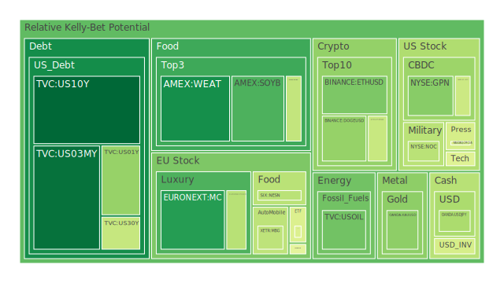
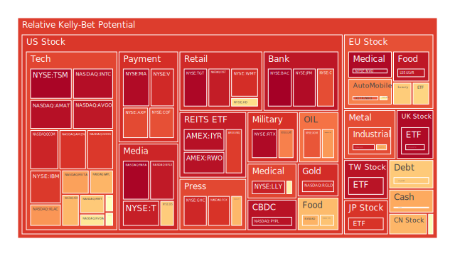
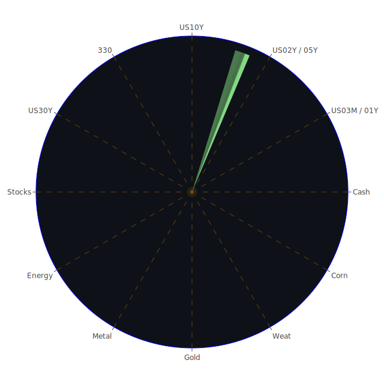

# 一、三位一體前言：Spatial、Temporal、Conceptional 的大膽假設
## Spatial 角度
經濟學大膽假設：當前全球資本市場的空間分布呈現「產業與地緣政治」雙重集中化。能源、科技等關鍵領域資金流動加劇，部分新興市場因地緣風險（如南美貨幣不穩）或政治壓力（如中東地區衝突）出現資金外逃。不過，有些地區（如東南亞）的低成本製造業與資訊服務業則同時承接了部分歐美企業尋求分散供應鏈的佈局。
社會學大膽假設：跨國的「新聞資訊流」與「社群媒體」放大了投資者對任何一地的金融風險恐慌或樂觀解讀。地區的負面新聞（如橋樑倒塌、或跨國企業裁員）容易引發全球投資者的恐慌性資本移動；相反地，出現若干地區利多（如新基建、國家補貼）也會瞬間吸引投機者湧入，使該地區資產價格出現劇烈震盪。
心理學大膽假設：投資者在地理空間上的關注往往存在「聚光燈效應」，即媒體聚焦的區域，能短時間內吸納大量資金，但也可能在新聞焦點轉移後急速流失。人群傾向於在空間上「扎堆」，而對於政治風險或局部衝突的邊緣地區保持距離。
博弈論大膽假設：地緣政治對手國家之間，可能互相「騎劫」經濟資源或製造通脹轉嫁，形成在某些地區的刻意掏空與另一些地區的泡沫積聚。不同地區之間，亦在資本流動上相互試探、合作或對抗。

## Temporal 角度
經濟學大膽假設：時序上，資產價格常隨著政策面、經濟周期而起伏。根據近期 FED 關鍵數據顯示，總資產縮表壓力仍在，RRP（逆回購機制）走低，TGA（美國財政部普通帳戶餘額）升高，以及市場對利率走向反覆揣測等因素，預期短期(3M, 1Y, 2Y)與中長期(10Y, 20Y, 30Y)公債收益率出現倒掛或小幅度修正。與此同時，美國長短天期利差在本報告參考的時間點呈現微幅修正，過去幾週的「10Y-3M」由明顯負值逐漸趨近於零附近，也暗示未來一到兩個季度對經濟衰退或通脹的判斷較為分歧。
社會學大膽假設：隨著時間推移，大眾媒體傾向於階段性放大特定事件。例如，在新聞中，某些企業裁員或破產（如服飾零售、快時尚品牌關店）的報導，短期內可能引發市場恐慌，但若之後其它利多（如財報好轉、政府救濟）介入，媒體很快會轉移焦點，導致投資者人群的風險偏好也急劇改變。
心理學大膽假設：時序上的反覆情緒波動表現在投資者的「三分鐘熱度」行為：短期市場訊息非常容易誘發追漲或殺跌；然而當時序拉長，這類短暫恐慌或興奮會重新被稀釋。因此，對於波動劇烈的高風險資產（如加密貨幣），行情往往出現過山車般的短期激漲暴跌。
博弈論大膽假設：在時間維度，賽局策略往往包含了領先與跟進的週期。例如各國央行或企業會先觀察國際動向，一旦發現對自己不利，就在更短的時間框架內迅速政策轉向，以爭取優勢或減少損失。對投資人而言，也常見「追逐 FOMO（害怕錯失）」與「過度避險」之間的時序性反轉。

## Conceptional 角度
經濟學大膽假設：概念層面，市場對資產配置往往存在「避險」與「進攻」的二元思維，導致各類資產之間相互此消彼長。像近期美元指數、金價、長天期國債收益率變化，皆顯示投資者正持續在「保值資產」與「成長資產」間來回切換，尋找不確定環境下的最優收益。
社會學大膽假設：大眾對新聞與投資資訊的心理框架，會從「宏觀敘事」（例如全球衰退）轉變為「局部利好」（如某公司財報超預期）等不同層次的解讀；當資訊混雜，普通投資者難以清晰辨別，可能依賴口碑、網路社群或意見領袖做出倉促判斷。
心理學大膽假設：概念層次里，市場參與者渴望「簡單歸因」：大漲就歸因於政策利多，大跌則歸因於美國聯準會或地緣政治事件。這種思維模式往往導致行為偏誤，不理解市場背後的複合因素疊加。
博弈論大膽假設：於概念層次，各方玩家（包括官方機構、對沖基金、散戶）為了各自利益，會傳遞或隱藏某些資訊，使市場資訊並非完全透明。這種「訊息不對稱」的博弈情境，往往在表面利多或利空的新聞下，藏有更深層布局。

# 二、三位一體綜合：正、反、合的思考（以最少文字表達最多意義）
## 正面（積極預期）：
空間層面（Spatial）：部分地區因技術創新或地緣風險緩解，有新一波增長契機；
時序層面（Temporal）：短期流動性充裕，市場出現明顯風險胃納提升；
概念層面（Conceptional）：大眾傾向尋求下一個「風口」，並對前沿領域（AI、綠色能源、半導體）的增長抱持期待。

## 反面（消極預期）：
空間層面：各種政治或社會動盪的區域，資金出逃風險高；
時序層面：中長期利率與衰退風險曖昧不明，經濟放緩訊號在之後幾個季度可能突然浮現；
概念層面：散戶對新聞與市場訊息的恐慌反應，可能導致泡沫資產無預警大幅下殺。

## 綜合（新的視角）：
空間的聚合與分散同時進行：區域衝突誘發分散投資，但也使某些地緣安全地區成為資金熱點；
時序的快慢交替：高度波動的短期劇烈波段與中長期策略布局並存；
概念的動態調整：新聞所賦予的「敘事框架」易使資產在樂觀與悲觀之間急速擺盪。

# 三、各類資產泡沫風險與新聞事件觀察
以下依序針對較具代表性的投資品種，結合泡沫風險指數（D1、D7、D14、D30等），引用當前新聞事件與歷史場景，試圖在每類資產中觀測潛在風險與機會。各資產於本報告中忽略其券商名稱部分，僅使用代稱或簡稱（例如 JNJ 而非 NYSE:JNJ）。

1. 美國國債
近期 1Y、2Y、5Y 與 10Y、30Y 公債收益率曲線出現微幅修正，官方數據顯示 3M、1Y 一度高於 10Y 但開始拉近，暗示美國經濟前景充滿爭議。新聞面上，聯準會縮表進行中，總資產繼續走低；且 RRP 也下滑，顯示市場流動性或轉往他處。歷史上來看，倒掛若持續到一定時程常常預告經濟衰退，不過也有「短暫倒掛後被貨幣寬鬆逆轉」的歷例（例如 1990 年代末或 2019 年底）。目前美國國債的泡沫指數並非特別高，多集中在中長天期 D1、D7、D14 在 0.4-0.7 區間，整體顯示風險仍屬中低。若未來就業市場與通脹數據不達預期，利率路徑又再度變動，美國國債收益率可能重新激烈波動。

2. 美國零售股
從新聞觀察到，消費者信心在近期出現顯著下滑，Krispy Kreme 業績預測走低、快時尚或服飾品牌裁員與關店新聞不斷，Home Depot 與 Lowe's等家居零售也表現疲軟，市場對零售消費的預期偏負面。不過也有 WMT、COST 等大型零售商因價值型消費的轉向而持續吸收市場份額。歷史相似場景可參考 2008 年金融風暴期間，消費者需求大幅萎縮，但折扣零售通路逆勢成長。不過目前零售股中如 TGT、WMT 的泡沫指數都偏高，D1 已在 0.9 左右水準，說明市場對於成長的預期與同時對其泡沫風險的擔憂並存。

3. 美國科技股
Nvidia（NVDA）、Tesla（TSLA）、Microsoft（MSFT）等高市值科技股近期面臨震盪，新聞多次提到「市場對 AI、半導體短期過度炒作」，同時最新新聞顯示 Nvidia 財報雖不差，但因預期太高，股價仍大幅修正，顯示投資者信心容易因「高估值」而對任何負面訊息過度反應。歷史上也有類似狀況，如 2000 年網路泡沫期間，市場狂熱進場，財報一旦不達超高預期就瞬間暴跌。當前科技股 D1 大多在 0.5-0.9 高檔（如 META、AAPL、GOOG、NVDA 都在 0.65 以上），推測仍存在一定泡沫成分，需提防震盪。

4. 美國房地產指數
從 VNQ、RWO 等房地產相關 ETF 的泡沫指數可發現，其 D1 已經在 0.88-0.96，不容忽視。新聞指出美國房貸 30Y Rate 近期約 6.76%，雖比上週 7.04% 略有下滑，但仍處在歷史高位，且商業不動產（CRE）違約及呆帳的警報越來越明顯。若未來就業或經濟週期下行，房地產恐再受衝擊。歷史上亦可對比 2007-2008 年次貸泡沫；然而本輪的升息速度與貸款條件也與當年不同，暫時仍以市場關注較多的商辦空置問題為主，住宅市場相對剛需仍在，但估值已顯吃力。

5. 加密貨幣
BTC 與 ETH 近期波動激烈。新聞在 2 月 26 日與 27 日多次提到加密市場與風險意識上升。DOGEUSD 的 D1 接近 0.350.38，BTCUSD 在 0.360.43 區間波動，ETHUSD 約 0.48-0.68。雖然表面上波動率略有收斂，但市場依舊高度神經質；任何監管或大型機構資金動向的新聞皆會引爆一波漲跌。歷史上，數位貨幣早在 2017 年末、2021 年初都出現過瘋狂飆漲後回吐的狀況，得留意泡沫風險分數中期仍偏高。

6. 金 / 銀 / 銅
黃金（XAUUSD）的 D1 指數近期約在 0.330.54 波動，對比白銀（XAGUSD）則維持在 0.830.93 的高水準，可見銀價相對黃金更「擁擠交易」。從新聞來看，地緣政治衝突與全球經濟不確定性帶動投資人買進實物金銀。銅價則受到需求面不明（中國復甦力道不如預期、美國基建是否施展）而呈現震盪，D1 約在 0.45-0.72，不算特別高，但因銅在綠能轉型與基礎建設中地位重要，長期仍有結構性需求。

7. 黃豆 / 小麥 / 玉米
近期阿根廷油籽工會威脅罷工，引發短期供應疑慮，小麥（WEAT）在泡沫風險指數約 0.170.18，不算太高，但需求彈性較低；黃豆（SOYB）因南美產區氣候而波動，D1 在 0.250.55 間浮動。玉米（CORN）則在 0.42 左右。過去也曾出現重大氣候或貿易戰導致農產品價格飆升的案例（如 2012 年美國乾旱），投資者若瞄準農產品ETF，要留意天氣變化與貿易戰情勢。

8. 石油 / 鈾期貨
油價（USOIL）近期約在每桶 6870 美元之間震盪，D1 約在 0.010.30 之間曾出現波動，目前指數攀升至 0.290.47，歸因於地緣因素與需求前景不明。歷史上，油價常受到中東局勢、OPEC 政策、全球需求增長放緩或突然加溫等影響而大幅波動。鈾（UX1!）因核能需求逐漸受到各國重視，在全球減碳趨勢加上部分傳統化石燃料成本攀升，未來或有長期需求支撐，不過近期泡沫風險指數在 0.400.53 左右，應留意市場炒作熱度。

9. 各國外匯市場
近期新聞顯示日圓(USDJPY)約在 148150 區間，歐元(EURUSD)約在 1.05 左右，英鎊(GBPUSD)約在 1.261.27，澳幣(AUDUSD)在 0.620.64。各貨幣 D1 指數多在 0.340.75 不等，代表市場對央行政策、經濟成長前景的看法仍混亂。歷史上若美國利率高度仍存，美元相對具有強勢基礎；但若FED 轉向或全球政治局勢穩定，資金又可能流向非美貨幣。

10. 各國大盤指數
歐洲（如 FCHI、GDAXI、FTSE）、日本（JPN225）、以及中國（SSE 000300）、台灣（TWSE 0050）等指數的泡沫風險指數多在 0.70-0.96 高檔，代表全球股市在近一年曾經歷急漲，但市場也隱含對大盤估值過高的警覺。新聞面看來歐洲正面臨能源問題與地緣政治壓力，日本則因寬鬆政策而出現股市高檔（JPN225 目前 D1、D7 都在 0.90 以上），中國大陸股市則因內需恢復不及預期，指數雖不斷震盪，但仍維持相對高估值區域。

11. 美國半導體股
AMD、INTC、MU、KLAC、AMAT 等企業近期受 AI 熱潮、晶片需求輪動等影響，財報與前景指引不一，導致股價大幅波動。新聞層面，Nvidia 的最新財報反映出「需求強勁」，但只要稍有不及市場過度樂觀預期，就觸發獲利了結。過往 20182019 年半導體景氣循環回檔時，也出現過「一瞬間雪崩」。目前半導體股的泡沫指數普遍落在 0.50.99，非常明顯是高風險高波動領域。

12. 美國銀行股
金融板塊如 JPM、BAC、C 等大行近期處在相對高檔，但 D1 指數也幾乎逼近 1，暗示市場雖對其穩定性有肯定，但同時擔心市值偏貴。歷史上銀行股在升息循環尾聲一般獲利較佳，但若經濟衰退預期成真，壞帳與消費貸款問題會迅速惡化。不少新聞指出「信用卡壞帳率提升」、「商業地產貸款壓力」，銀行獲利空間或遭壓縮，因此潛在風險依舊不容忽視。

13. 美國軍工股
如 LMT、NOC、RTX 因地緣政治衝突（包含烏俄戰事或中東火種）而持續受到關注。新聞提到北約相關國家增加軍購預算，以及美國國防預算並未縮減，支撐了軍工股估值。歷史案例如冷戰時期，軍工需求強勁使相關企業收益成長穩定。現階段泡沫風險指數約在 0.49-0.79，雖非最高，但亦非安全低檔。要留意萬一大型衝突出現結束跡象，或政府預算分配改變，軍工股可能短期受壓。

14. 美國電子支付股
如 GPN、PYPL、V、MA 等，面臨利率上升與消費減弱的壓力，但同時全球數位支付趨勢依舊成長。新聞層面，部分金融科技公司財報亮眼，但也有使用者成長放緩的隱憂。歷史上支付產業通常在經濟擴張階段獲益良多，而在經濟下行時則必須面對交易額度減少、資金成本上升。D1 多在 0.4-0.96 之間不等，越接近 1 代表短線炒作資金可能湧入，需謹慎。

15. 美國藥商股
像 JNJ、MRK、LLY 等大型藥廠，通常被視為防禦性標的，但近來受專利到期、醫保改革、併購案變數等影響，短期內也可能出現不小震盪。新聞顯示部分公司在臨床試驗、併購等獲市場看好，然而疫情後醫藥股普遍估值已高於長期平均水平，泡沫風險指數在 0.35-0.88 之間。

16. 美國影視股
如 DIS、PARA、NFLX 等，流媒體競爭加劇，加上廣告市場多變，致使市場對影視娛樂產業未來獲利難有共識。新聞提到 DIS 近期在串流策略調整、PARA 持續虧損，NFLX 也有訂戶增長疑慮，故泡沫風險普遍偏高，D1 在 0.67-0.97 的高位區間。

17. 美國媒體股
NYT、FOX 等傳統或新興媒體公司在數位轉型與廣告市況壓力下，各自面臨不同挑戰。新聞顯示有些廣告市場萎縮跡象，尤其是在經濟不穩下，企業削減行銷預算。過去 2008 年也曾見到媒體廣告業斷崖式下跌。D1 多在 0.90 以上，表明投資者對其估值擔憂。

18. 石油防禦股
如 XOM、OXY 等，隨油價波動產生高額獲利或快速回落。近期美國頁岩油增產並未完全跟上；但若需求端衰退，油價下行會令這些股票的利潤承壓。泡沫指數約在 0.68-0.85，顯示仍有不小風險。

19. 金礦防禦股
如 RGLD 等礦業公司，一方面受金價支撐，另一方面也需面對開採成本和地緣風險。新聞報導世界局勢越亂，金價越能獲避險買盤推升，但若市場對全球景氣轉好，資金可能流向更具爆發力的資產。現階段泡沫指數多在 0.70-0.90。

20. 歐洲奢侈品股
MC、KER、RMS 等，近年依賴中國與美國消費者需求，但新聞顯示中國內需復甦不如預期，美國消費也有趨緩跡象。歷史上，奢侈品股若缺乏新興市場需求托底，股價常急速回落。泡沫風險現在大約在 0.49-0.88 區間，宜謹慎。

21. 歐洲汽車股
BMW、MBG 等德系車廠，面對電動化競爭、能源成本，以及歐美關稅紛擾，新聞持續報導大環境不穩，其泡沫指數約在 0.50-0.62 之間。雖算不上最高，但電動車與燃油車轉型陣痛仍大，必須注意長線佈局風險。

22. 歐美食品股
如 ULVR、NESN、KHC 等，雖具防禦特性，但若通膨持續或原物料成本上揚，毛利率面臨考驗。近期 NESN、KHC 數據顯示 D1 均在 0.40-0.69 間；歷史上食品巨頭通常在經濟不景氣時能保有韌性，但仍存在因原料、貨幣波動、地緣衝擊而侵蝕獲利的風險。

# 四、宏觀經濟傳導路徑分析
## 貨幣政策與利率傳導
FED 縮表（Total Assets 降低），RRP 下滑等訊號顯示流動性正收緊，但 TGA 提高可能導致國庫餘額增加。若聯準會未如市場預期般轉向寬鬆，信用收縮將逐漸在消費、企業融資領域顯現壓力，連帶影響企業獲利與就業。外匯方面，假如美元維持高利差，非美資金或持續流出風險。

## 財政政策與地緣政治
報導顯示在地緣政治不安定的背景下，軍工支出加碼，能源轉型投資加速，但相對也壓縮了部分基建、社會福利的預算。國家之間的博弈可能透過關稅、制裁、補貼競爭等方式，將通脹與資金流動風險相互轉嫁。若政治對立擴大，可能推升黃金、原油、軍工、防禦型資產的需求。

## 消費與就業
近期新聞揭示，消費信心下滑與零售業壓力同步顯現。若就業市場松動，貸款違約率升高，銀行股與房地產也將遭受衝擊，最終影響整體市場風險情緒。房貸利率居高不下會打擊房市成交量，導致建築材料、家居零售股也受到影響。

# 五、微觀經濟傳導路徑分析
## 企業營收與成本結構
高利率導致融資成本攀升，企業若無法迅速透過漲價或銷售成長來吸收，利潤率就會被侵蝕。部分產業（如半導體、AI、綠能）尚能拿到政府補貼或擁有定價能力，可度過此衝擊；但傳統產業（如零售、旅館、傳統製造）獲利可能快速下滑。

## 供應鏈與庫存
全球供應鏈在後疫情時代正逐漸恢復，但還存在地緣衝突與能源價格波動干擾。若企業庫存未能健康管理，尤其在消費萎縮時就容易積壓，進一步迫使企業降價促銷、削減開支。這些微觀層面的庫存週轉壓力，最終也會反映在股價和泡沫風險上。

## 融資與併購活動
當資金成本上升，創新企業或槓桿高的公司會面臨生存考驗，若市場對其前景不再高估，就可能見到大規模估值修正或被迫出售。另一面，若有資金雄厚的企業會利用併購撿便宜，形成市場格局洗牌。

# 六、資產類別間傳導路徑分析
## 利率走勢對固定收益與風險資產的輪動
一旦市場相信利率觸頂或衰退風險加劇，大量資金會回流到公債與黃金等避險資產；反之，若觀察到就業數據、通脹維持強韌，資金又會重新流向股票、工業金屬、加密貨幣等風險較高的領域。

## 大宗商品與新興市場的聯動
油價若持續波動，通脹預期就難以穩定，抑制或放大全球對農產品、金屬等的需求。新興市場若出口以原物料為主，可能受益也可能受害，視國際價格與匯率而定。投資組合若持有新興市場債券或ETF，需留意匯率與商品價格的影響。

## 避險心理下的資金擇地
新聞顯示，當地緣政治或疫情、災害等風險升溫，黃金、瑞郎、日圓、美國國債等往往成為短期避風港；但需要注意有時「避險資金過度擁擠」亦會產生自我實現的泡沫。

# 七、風險對沖的投資組合機會（相位盡量120度、相關係數約 -0.5）
基於前述三位一體的分析，我們嘗試找出在空間、時間、概念上互有分散效果的資產組合，並令相關度偏低甚至為負、盡量達到「相位差 120 度」的均衡互補。以下以文字形式示意數種可能的對沖組合方向：

## 長期投資：美國國債（中長天期） + 金礦防禦股 + 半導體股
美債在市場波動時提供避險；
金礦股在通膨與地緣風險升溫時可對沖；
半導體股則鎖定科技成長潛力；
三者之間在歷史上相關度中度偏低，可達成一定程度的對沖。
中期輪動：美國零售股 + 農產品ETF + 加密貨幣龍頭
消費板塊與農產品之間，受不同經濟週期與天氣因素牽引；
加密貨幣與傳統資產往往相關度並非穩定，有時能在風險偏好提升時做補充；
需注意零售與加密貨幣在某些熊市階段也可能同向下跌，但長期來看階段性表現可互補。
短線策略：石油防禦股 + 新興市場貨幣多空 + 科技股空方對沖
石油防禦股受油價波動影響；
新興市場貨幣對美元若維持一定負相關，可幫忙對沖；
若對高估科技股適度布局空單，可在市場回檔時獲得風險緩衝；
三者在歷史行情中往往漲跌週期並不同步，相關性可能較低。

# 八、綜合篩選假設與可能漣漪效應
## 篩選假設
所有組合須避開同一產業或同一地區的過度集中；
不同資產在泡沫指數與新聞風向上有一定的正反對應：若一者因市場悲觀而下跌，另一者或受恐慌避險買盤支撐；
同時考慮地緣政治博弈與長期成長空間。

## 漣漪效應
地緣動盪：若某地區衝突升級，油價、金價、軍工股往往同向上漲；與之對比，新興市場資產或受到避險資金流出衝擊。
貨幣政策：若 FED 再度升息，強勢美元凸顯，黃金暫時或受壓，進而壓抑商品漲勢，但高利率衍生的經濟壓力又能提振債券需求。
消費收縮：若零售銷售繼續下滑，反映到物流、廣告、甚至加密支付等產業鏈，引發一連串獲利預期調整。
樂觀衝擊：若經濟數據與企業財報意外好轉，科技、工業金屬、新興市場等風險資產或出現一波短期暴漲，但防禦型標的則受資金分流而回落。

# 九、投資建議：穩健、成長、高風險 三大類最佳化配置
以下提供「穩健」、「成長」、「高風險」三種資產配置組合，每類合計各自子項目佔比相加後，再與其他兩類合併構成 100% 的分配。

## 穩健型 (50%)

美國長天期公債 (20%)：利用利率或衰退風險下的防禦能力；
黃金 (20%)：地緣政治動盪下的核心對沖；
高品質公司債 (10%)：挑選違約率低、成熟市場大企業所發行的債券。
說明：在當前環境，宏觀不確定高，保本與抗通脹兼顧為首要，故提高了公債與黃金比重。

## 成長型 (30%)
美國科技龍頭 (10%)：如 MSFT、AAPL 等具穩定研發與生態系實力的龍頭；
醫藥或必需消費 (10%)：如 JNJ、MRK、或 ULVR 及 NESN 等全球消費與醫療；
半導體關鍵廠商 (10%)：如 AMD、KLAC，聚焦在硬體製造與設備領域。
說明：儘管科技板塊與半導體泡沫指數不低，但其長期成長力道仍強，適度配置有機會把握結構性利多，並輔以防禦性醫藥與必需消費做平衡。

## 高風險型 (20%)
加密貨幣 (5%)：挑選主流 BTC、ETH 等流動性強的標的，仍要嚴控部位。
新興市場股票 (10%)：可透過當地大盤ETF或指數基金分散，期望經濟體系轉型紅利；
原物料或能源ETF (5%)：包含石油、銅等，捕捉地緣政治催化或供需錯配機會。
說明：此部分波動最大，但也可能在風險胃納提升的時候帶來超額收益，需做好停利停損機制。

上述配置，穩健(50%) + 成長(30%) + 高風險(20%) = 100%。此僅供參考，不同投資者可依自身風險承受度調整。

# 十、風險提示
投資有風險，市場總是充滿不確定性。本報告之建議皆出於目前所能蒐集之新聞、數據、泡沫指數資訊，以及多元理論（經濟學、社會學、心理學、博弈論）的綜合運用，並非對未來保證。投資者應持續關注最新經濟指標、地緣政治走向與公司財報變化，針對自身風險承受能力與財務目標做出獨立判斷。

目前觀察到的泡沫風險尤其值得重視：科技、半導體、房地產、加密貨幣、媒體娛樂等板塊普遍出現高 D1 或者接近 1 的情形，顯示短線若市場情緒翻轉，該等資產可能面臨劇烈修正。此外，農產品、能源、軍工等雖非最高泡沫區，但地緣政治緊張時往往帶來不可預測的價格波動。歷史已多次證明，任何資產都可能出現泡沫化風險，不可因漲勢亮眼或新聞利多就放鬆警惕。

總結而言，市場眼下所經歷的空間（地緣與產業轉移）、時間（短線與中長線升息或衰退爭論）與概念（人群敘事框架反覆）皆高度複雜。謹慎管理頭寸，落實風險對沖策略，是在不確定時期保持相對安全與合理收益的關鍵。願本報告能提供投資者多元參考視野，在多重理論與新聞觀點之下，持續細心評估並因應市場的瞬息萬變。

投資有風險，市場總是充滿不確定性。我們的建議僅供參考，投資者應根據自身的風險承受能力和投資目標，做出獨立的投資決策。

 
Daily Buy Map:

 
Daily Sell Map:

 
Daily Radar Chart:

 
