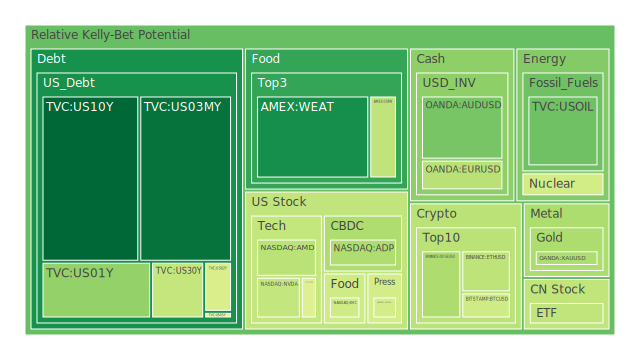
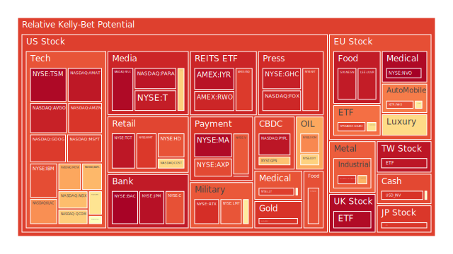
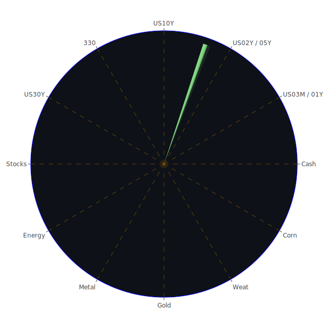

# 投資商品泡沫分析

## 美國國債
**空間面（Spatial）**：  
美國國債在全球金融市場中具有核心地位，各國央行、主權基金與國際投資人普遍將其視為流動性與安全性的主要標的。地緣政治動盪時，不少資金會自新興市場或高風險資產撤出，轉而投向美債，形成空間上的「資金避風港」效應。近期新聞顯示，海外持有的美國國債總量雖在些微下降，但整體仍佔相當比例，說明國際市場對美債安全性的既定信仰尚未明顯動搖。

**時間面（Temporal）**：  
觀察近幾個月的殖利率曲線變化，3個月、1年期短端利率於前期一度高企，但最新數據顯示已有所放緩，10年期與30年期雖然相對穩定，仍在4%左右波動。在歷史的維度來看，當美債殖利率曲線接近倒掛而持續一段時間，往往伴隨後續幾季經濟放緩或衰退的警訊。2000年科網泡沫與2008年金融危機時都曾驗證過此結論，因此時序上的「預警」效力不容小覷。

**概念面（Conceptional）**：  
經濟學理論通常把美國國債視為「無風險」收益基準，但實際上也得考量政府財政問題、貨幣政策走向以及「資金回收率」等層面。社會學與心理學觀點指出，當投資人普遍認同美國國債是最安全資產時，可能過度擁擠在該市場，一旦聯準會加速升息或市場對美國財政失衡產生懷疑，便會引發大規模拋售。博弈論角度則提醒我們，若主要的外國持債國以地緣政治或貿易報復為由，進行大幅減持，也可能產生對美債價格的衝擊。

總體而言，美國國債泡沫分數雖相對較低，但不代表完全沒有風險，特別是美國債務上限、政府赤字與貨幣政策轉向等因素都可能在關鍵時刻擴大波動。

---

## 美國零售股
**空間面（Spatial）**：  
零售業者遍及全美各州，商品面向廣，對區域性就業與內需貢獻重大。同時，跨國零售大廠也在全球布點，連動國際供應鏈。新聞顯示近期一些州的勞動力成本上漲、供應鏈瓶頸與運輸成本升高，皆會造成各地門市獲利率差異化。若海外市場需求放緩，也影響美國零售品牌在國際據點的業績。

**時間面（Temporal）**：  
疫情期間，民眾的儲蓄率和網購需求推升零售股大漲；但隨時間推進，聯準會多次升息、通膨壓力加劇後，消費者可支配所得趨緊。歷史經驗如2008年金融危機或2000年網路泡沫爆破時，一旦消費者信心下滑，零售股往往成為首波受創標的。現階段零售業績雖還不至於全面衰退，但成長趨勢顯然趨緩，泡沫分數已有上揚跡象。

**概念面（Conceptional）**：  
經濟學上，零售業業績與消費者信心呈高度正相關。社會學與心理學層面，多數民眾在通膨與升息的環境中會削減非必需品消費；若再遇到政治動盪或就業不穩定，零售支出更易驟降。博弈論觀點下，零售商之間也在競爭中不斷削價，可能導致整體利潤空間被壓縮。一旦預期利潤減少，投資人情緒翻轉，股價修正就會迅速且猛烈。

---

## 美國科技股
**空間面（Spatial）**：  
美國的科技產業聚集在矽谷、西雅圖、奧斯汀等地區，吸引全球科技人才與風險資本。海外市場對美系科技產品的需求亦遍佈歐、亞等地，形成全球性產業鏈。近期新聞提及因關稅政策與地緣政治，部分廠商嘗試多元化生產據點，空間上的產能配置成為調整熱點。

**時間面（Temporal）**：  
2023～2024年初，由於AI、5G、雲端與自動駕駛等概念興盛，推升科技巨頭股價屢創新高；但到了2025年前後，市場對「高速增長」的預期已非常高，稍有差池財報就難令人滿意。參照2000年科網泡沫爆破的經驗，當獲利無法接上資本支出與市場期待時，資金往往急速撤離。

**概念面（Conceptional）**：  
經濟學上，科技股是高Beta值的成長型投資，一旦景氣轉折或融資成本上升，估值會被放大影響。心理學層面，投資人對「AI革命」過度興奮時，情緒可能迅速推升股價；但同樣地，若利空消息出現，恐慌情緒又會加倍反應。博弈論顯示，各國都想在先進晶片、雲端平台領域取得主導權，若爆發技術或貿易摩擦，科技企業將陷入更大的不確定。

---

## 美國房地產指數
**空間面（Spatial）**：  
美國境內城市與州的房地產市場差異巨大，像紐約、舊金山、洛杉磯等地的商業不動產租金與住宅價格常高居不下，但中部與南部一些州價格相對平穩。當地緣政治或全球資金面臨動盪時，部分海外資金仍視美國主要城市房產為資產配置選項。但近期新聞報導的商辦空置率升高、遠距辦公普及，使得某些區域的辦公室租金深受衝擊。

**時間面（Temporal）**：  
疫情後初期（2020～2022），低利率與寬鬆貨幣政策推動房市狂飆。進入2023年後，抵押貸款利率翻倍，使部分買家資金斷炊。歷史上，2008年次貸危機凸顯了房地產泡沫破裂對金融市場的巨大震撼，這種「炸彈」若在景氣下行階段被點燃，傳染速度尤其快。2024年底至2025年初，觀察房地產ETF或住宅建商股票的走勢已呈現震盪徘徊，隱示市場態度謹慎。

**概念面（Conceptional）**：  
從經濟學來看，房地產價格受利率、就業、人口結構等影響深遠。社會學面則提及年輕世代負擔能力下降，居住模式改變，長期推升租屋需求但壓抑購買意願。心理學面指出，「房地產永遠只漲不跌」的信仰一旦被打破，投資人情緒容易一面倒。博弈論下，政府與銀行體系密切關聯，一旦商業地產爆發大規模違約，可能引發金融緊張並衝擊全市場。

---

## 加密貨幣
**空間面（Spatial）**：  
加密貨幣交易無國界，全球各地皆可參與。新聞報導SEC對部分加密企業採取法律行動，顯示美國監管體系開始加大力道，歐洲和亞洲國家也不斷推出相應的法規，形塑了多極化的空間秩序。加密行業的礦場主要分布在能源成本較低的地區，如北美、北歐、哈薩克等，地緣政治與能源政策也影響其挖礦成本及合法性。

**時間面（Temporal）**：  
比特幣2月下跌近17%，這在其歷史走勢中不算極端，卻足以昭示高波動特性。回顧2018年與2022年的大回調周期，常因監管加壓或流動性收緊而發生。眼下2025年左右，若全球利率仍處於高水位，市場對加密貨幣的高風險偏好會減弱。

**概念面（Conceptional）**：  
經濟學面，部分人視加密貨幣為「數位黃金」，也有人認為它僅是投機性工具。社會學與心理學層面，網路輿論與群體狂熱常大幅放大行情波動；監管層面的不確定性更令許多傳統投資人裹足不前。博弈論也凸顯了國家與民間在控制貨幣發行權、資本外流等領域的角力，使加密貨幣成為複雜的對戰場域。

---

## 金／銀／銅
**空間面（Spatial）**：  
黃金作為各國央行儲備資產，全球需求主要集中於新興市場與歐美投資機構；白銀與銅則更廣泛用於工業、生產製造。新聞上提及礦業公司（如Freeport-McMoRan）因區域政局與政策利多而股價上揚，顯示礦山分布地區（南美、北美、東南亞等）之政策與勞工狀況影響金屬供應。

**時間面（Temporal）**：  
歷史上，金價在經濟衰退或地緣衝突時常出現快速走高；銀、銅則隨全球工業需求起伏較大。近幾個月來，金價維持相對高檔，銀、銅價格則受到中國需求與國際製造景氣消息的拉扯。通常在景氣放緩訊號顯著時，銅會先反應下跌；當通膨升溫或恐慌情緒升高，金價會大幅領漲。

**概念面（Conceptional）**：  
經濟學分析指出，金屬價格與美元指數、利率環境密切相關；社會學及心理學面暗示黃金的象徵意義（傳統避險資產）使投資人迅速湧入或撤出。博弈論層面也呈現各國央行對黃金儲備的策略性考量，一旦國際形勢或貨幣格局動盪，金屬交易量暴增，就可能誘發短期泡沫。

---

## 黃豆 / 小麥 / 玉米
**空間面（Spatial）**：  
農產品供應鏈跨越多個大洲。美洲（美國、巴西、阿根廷）為主產地，亞洲與非洲為主要消費地。最近阿根廷油籽工會的罷工威脅就顯示產地物流暫停時，容易引發全球飼料與食品相關市場價格劇烈波動。巴西農業企業盈餘大幅增長，意謂著該國在空間上獲得更多國際訂單。

**時間面（Temporal）**：  
季節性收成週期、天氣變化、貿易政策等，往往在某些時段同時發酵，促使農產品期貨漲跌不斷。歷史上，若主要產區遭受極端氣候，糧食價格曾在短時間內飆升。2022～2023年間，部分國家因氣候異常而減產，已推高全球農產品行情；若2025年下半年再度爆發乾旱或洪澇，則恐讓泡沫更明顯。

**概念面（Conceptional）**：  
經濟學面，農產品市場受供需法則顯著制約，但補貼、關稅與外交糾紛也使價格失真。社會學與心理學分析：飢荒與糧食短缺新聞經常激發投資人與投機者的恐慌性操作。博弈論指出，農業大國也可能利用糧食出口做談判籌碼，一旦報復性關稅或禁運實施，容易激化全球糧價波動。

---

## 石油 / 鈾期貨UX!
**空間面（Spatial）**：  
石油價格主要由OPEC+、美國頁岩油、俄羅斯原油供給，以及中國、印度、歐美需求構成國際市場格局。一旦地緣政治衝突集中於中東或俄羅斯，供應面就會面臨劇烈衝擊。鈾期貨則受限於核能政策，各國核電站的部署分佈在歐洲、亞洲及北美，若有關法律或安全疑慮提升，就會影響提煉或儲存營運。

**時間面（Temporal）**：  
石油市場在2022～2023年大幅波動後，2025年初維持在70美元上下震盪。歷史經驗顯示，石油向來具有「瞬間翻盤」的特性：戰爭或制裁即刻帶來暴漲，需求降溫或經濟不振則使油價急跌。鈾期貨在過去幾年因綠能轉型題材而獲得青睞，但每當國際輿論對核能安全質疑升溫（例如日本福島事件之後），價格又會大幅回調。

**概念面（Conceptional）**：  
經濟學面，石油是工業與交通的血液，對整體通膨與製造業影響深遠；鈾同樣關乎發電成本與能量供應。社會學與心理學則強調，一旦發生石油禁運或核能事故，媒體報導往往造成市場恐慌或短期追捧。博弈論觀點顯示，油國之間或核能技術輸出國之間的角力不斷，一有風吹草動，期貨價格即跳漲或跳水。

---

## 各國外匯市場
**空間面（Spatial）**：  
英鎊因英國脫歐在歐陸市場定位改變；歐元牽動歐盟多國經濟，日圓則與日銀貨幣政策與美日利差關係密切。澳元與商品行情高度相關，尤其礦產與農產品出口。各地區貨幣若因關稅或政治因素受到衝擊，往往透過資本流動在全球外匯市場迅速反應。

**時間面（Temporal）**：  
疫情後，歐、美、英等主要經濟體的利率逐漸走高，日銀步調相對溫和，日圓出現長時間偏弱。歷史上，當美國進入升息循環，新興市場資金經常外流，匯率走貶。2025年若美國進入利率高原期，隨著歐洲勞資糾紛或衰退風險攀升，歐元、英鎊走勢也可能劇烈震盪。

**概念面（Conceptional）**：  
外匯市場是經濟學中最典型的供需均衡體現，但政治干預與突發性事件常令匯價背離基本面。心理學層面，投資人易因匯率大漲大跌而產生恐慌性平倉或追高行為。博弈論指出，若各國同時採取競爭性貶值或干預外匯市場，會造成國際摩擦與市場失衡，進一步強化波動。

---

## 各國大盤指數
**空間面（Spatial）**：  
美國的標普500、NASDAQ、道瓊，歐洲的DAX、CAC，亞洲的日經225、上證指數、台灣50等，彼此通過全球資本配置緊密連動。某一地區的重大事件，如歐洲罷工、亞洲地緣衝突、美國關稅政策，都可能讓該區大盤在一天內出現明顯跳空，並由程式化交易連鎖影響其他市場。

**時間面（Temporal）**：  
疫情後，各大盤指數快速反彈並多創歷史或階段性新高。隨時間推移，市場對企業獲利成長的樂觀看法遭遇升息與通膨的現實考驗。歷史證據顯示，若資本支出與消費動能雙雙趨緩，大盤就可能進入長期高位震盪或下行周期。

**概念面（Conceptional）**：  
大盤指數是多種產業與公司加權總和，從經濟學角度來看是整體企業健康度指標。社會學與心理學面則揭示，大眾媒體和社群平台常放大對大盤漲跌的解讀，引發散戶或機構投資行為。博弈論方面，若各國政府在大盤下跌時祭出激進刺激政策，也許能短暫阻止跌勢，但長期仍需基本面支撐。

---

## 美國半導體股
**空間面（Spatial）**：  
半導體生產鏈由美國在晶片設計與關鍵設備上占優勢，亞洲在晶圓製造與封測領域領先，形成跨區域合作競合。美國對特定國家實施晶片技術出口管制，或與歐洲、日本聯手推進先進製程，都影響全球科技供應鏈分布。

**時間面（Temporal）**：  
2023年以來，Nvidia、AMD、Intel、Micron等多家企業股價隨AI題材水漲船高；但進入2025年，市場開始質疑高成長能否持續，Dell的AI伺服器利潤疑慮也使投資人興奮度降溫。對比2000年之後的泡沫經驗，半導體板塊可能出現先衝高、後急挫的走勢。

**概念面（Conceptional）**：  
經濟學上，半導體具備高度週期性特質，供需失衡時會導致價格激烈波動。社會學與心理學顯示，投資人對「AI革命」的龐大敘事深信不疑時，易忽視週期轉折風險。博弈論方面，美中科技戰、歐美補貼戰等都是主導先進晶片與半導體設備訂單流向的關鍵力量。

---

## 美國銀行股
**空間面（Spatial）**：  
大型銀行業務涵蓋全國與全球，多家銀行在歐洲、亞洲也有子公司或分支。若海外經濟衰退或政治風險加劇，銀行需針對當地部位計提準備金，牽動母公司資產負債表。新聞上對美國商業地產潛在違約、消費者信用卡壞帳上升的警訊，也顯示銀行股在空間層面承擔多重風險。

**時間面（Temporal）**：  
利率循環走高初期，銀行往往因淨息差擴大而獲利增加。但歷史上，每當衰退徵兆明朗化，銀行壞帳攀升與放貸意願降低，都使股價走弱。2008年金融危機便是一例，當房市下行與金融衍生品違約同時爆發，銀行股瞬間巨幅下挫。

**概念面（Conceptional）**：  
從經濟學看，銀行是貨幣傳導與信用創造的中樞；一旦體系失衡，就會延燒到實體經濟與投資市場。社會學與心理學層面，一旦傳出某大型銀行出現財務危機，市場恐慌擴散可能引發擠兌或連鎖反應。博弈論提醒，我們需留意監管機構、中央銀行與商業銀行之間的利益平衡及防火牆設計，一旦某方政策劇烈變動，整個銀行體系的穩定度隨之改變。

---

## 美國軍工股
**空間面（Spatial）**：  
軍工產業主要分佈於美國東岸與中西部州，與NASA、五角大廈、國防相關研究機構等緊密合作。海外軍售版圖也遍及多國，包含中東、亞太與歐洲盟邦，一旦區域衝突或軍備競賽升溫，軍工企業訂單即水漲船高。

**時間面（Temporal）**：  
20世紀至今，軍工股在冷戰、911事件、全球反恐或地區衝突時常逆勢走強；當國際局勢趨於和平或預算削減時，則面臨估值回檔。近期新聞談到烏俄緊張、中東零星衝突，都使軍工概念暫時維持市場熱度，但若日後局勢和緩，可能回跌。

**概念面（Conceptional）**：  
經濟學上，軍工屬於高技術、高門檻行業，巨大的研發成本需仰賴國家支出。社會學與心理學層面，人們對戰爭陰影通常懼怕，但資本市場卻常在衝突升級時追捧軍工股。博弈論強調，各國政府在國防談判或地緣角力時，往往祭出軍購大單作為籌碼，直接推升相關企業利潤。

---

## 美國電子支付股
**空間面（Spatial）**：  
Visa、Mastercard、PayPal等公司的支付業務普及於全球，多數線上與實體交易都能見到他們的系統。若某些區域性的法規或跨境交易限制加劇，支付公司就需調整策略、增設合規成本，影響獲利表現。

**時間面（Temporal）**：  
從疫情初期到2023年，電子支付需求與數位化浪潮大幅提升企業營收；但2024～2025年之後，市場逐漸飽和，加上利率上升、金融科技新創崛起，增長趨勢趨緩。回顧2010年代初期移動支付興起時，一度讓傳統金融股大感壓力，現今則是新舊勢力競逐之下，易形成估值泡沫。

**概念面（Conceptional）**：  
經濟學面，支付產業的規模效應與網路效應相當顯著；社會學與心理學層面則顯示消費者對數位支付的安全信任度極度關鍵，一旦發生大規模駭客事件或數據外洩，使用者會迅速轉向他家服務。博弈論看來，電子支付公司與大型電商、銀行、甚至加密貨幣平台之間的角力日趨激烈，市場份額重新洗牌時，也可能造成股價波動。

---

## 美國藥商股
**空間面（Spatial）**：  
美國各州對藥價監管與醫療保險法規不一，醫藥公司通常在研發集中地（如波士頓、舊金山）聚焦人才與研發實驗室。國外市場對美國先進新藥的需求不斷，尤其歐洲與日本也會有關稅與藥價談判機制，影響外銷利潤。

**時間面（Temporal）**：  
歷史上，藥品專利到期的「專利懸崖」一向是大藥廠成長的潛在危機點。2023～2024年，多家藥廠面臨重大專利保護到期，市場競爭加劇。新藥研發若遲緩或臨床試驗失利，股價也會在財報當下大幅波動。Moderna近期失去政府部分資金支持，更突顯時間上的政經因素疊加風險。

**概念面（Conceptional）**：  
經濟學上，醫藥的高研發成本與長上市周期決定了此行業進入門檻與不可預測性。社會學與心理學面，人們對藥價上漲極度敏感，各種民粹或政治力量都可能影響藥廠獲利模式。博弈論顯示，藥商之間或藥商與保險機構間常有策略聯盟或排他協定，一旦談判破局，衝擊面同樣龐大。

---

## 美國影視股
**空間面（Spatial）**：  
迪士尼（DIS）總部及主題樂園集中在美國，但其電影、串流服務遍及全球；派拉蒙（PARA）或Netflix等同樣在全球擁有龐大觀眾。地區性文化審查、競爭者之間對版權及市場的爭奪，也與「空間」有關。

**時間面（Temporal）**：  
早期傳統影視企業收入主要仰賴院線票房與電視廣告，然而這在2020～2022年疫情衝擊下已大幅變動；2023～2025年則進入串流平台飽和競爭期。歷史曾見證：當技術或消費習慣產生根本改變，傳統媒體巨頭若跟不上，股價易大幅重挫。

**概念面（Conceptional）**：  
經濟學上，影視公司需要龐大資金投拍內容，若觀眾口味改變或新平台竄起，回報無法保證。社會學與心理學面向顯示，流行文化與粉絲效應常在短期帶動股價，但若競爭過度分散目光，最終公司仍需回到盈利模式。博弈論觀點下，影視產業存在版權爭奪與市場隔閡；與政府、電信及互聯網平台之間的角力，也可能扮演關鍵角色。

---

## 美國媒體股
**空間面（Spatial）**：  
紐約時報（NYT）、FOX等美國媒體遍布於全國與全球分社，報導內容涉及國際政治與財經議題。一旦各地廣告支出削減或政治宣傳經費減少，營收立刻受衝擊。若是區域性災難或重大衝突，媒體流量雖上升，但廣告客戶可能不增反減。

**時間面（Temporal）**：  
新聞媒體在每一次重大事件（選舉、戰爭、疫情）時都可能流量暴增，但收入與訂閱能否持續，則是時間考驗。歷史經驗顯示，投資人經常誤判媒體股的長期成長性，以為「話題不斷」就能帶來盈利，但最終若廣告市場委縮，泡沫隨之破裂。

**概念面（Conceptional）**：  
經濟學理論中，媒體公司的收益與廣告商預算、讀者付費意願密切相關。社會學與心理學層面，更強調大眾對新聞內容的信賴度、資訊多元性以及讀者黏著度。博弈論意涵在於，媒體常扮演影響輿論的重要角色，政商勢力若介入，便會改變媒體的定位與財務結構。

---

## 石油防禦股
**空間面（Spatial）**：  
ExxonMobil、Occidental Petroleum等石油巨頭在北美、中東、非洲等地皆有開採與生產業務。地緣衝突或政府環保政策改變，可能使某些油田面臨減產或關停風險，也因此導致區域供應不平衡並影響油價。

**時間面（Temporal）**：  
近期油價在70美元上下徘徊，但歷史上油價常在一年內就能出現翻倍或腰斬的極端情況，像2014～2016年期間油價雪崩，各大油企股價也重挫。防禦性雖然存在，例如經濟下行時部分投資人仍會偏好能源股穩定股息，但若全球需求長期下跌，防禦力也不足以抵禦大環境衝擊。

**概念面（Conceptional）**：  
經濟學觀點，石油是工業命脈，需求彈性較低，但無法擺脫供需失衡的循環。社會學與心理學層面看，如果環保意識高漲、新能源崛起，石油企業地位可能動搖。博弈論認為，OPEC+與非OPEC產油國在減產或增產議題上彼此角力，產量決策一旦協調破局，立刻造成市場大幅波動。

---

## 金礦防禦股
**空間面（Spatial）**：  
金礦公司分布於北美、澳洲、非洲等產地，由於採礦過程涉及環境與社會衝擊，所在國家政策（稅制、環保、勞工）影響其生產成本。全球各地的央行與民間投資人需求亦透過倫敦金市、COMEX等市場集中定價。

**時間面（Temporal）**：  
黃金價格在經濟繁榮階段可能遭冷落，但每逢金融動盪或地緣衝突升溫，金價便迎來飆漲。金礦股因有槓桿效應，漲跌幅度往往超越金價本身。回顧2012年後金價長期走弱時，不少金礦公司曾陷入財務困境；2023～2025年行情多變，需要謹慎關注各礦企的債務結構與開採效率。

**概念面（Conceptional）**：  
經濟學上，金礦股隨金價波動顯著，但營運成本與地區風險也會扮演關鍵變數。社會學與心理學面則說明金價是避險情緒的一大指標，當投資人信心崩潰，就容易湧向黃金。博弈論層面，各國央行若持續增加黃金儲備，便會推升金價並刺激礦業股的資本支出。

---

## 歐洲奢侈品股
**空間面（Spatial）**：  
歐洲品牌LVMH、Kering在全球各大都會開設旗艦店，客源尤以北美、中東與亞洲客戶為主。若歐洲本土出現大型罷工或政治動盪，旅遊受阻，觀光客消費即下降；同時，關稅壁壘也可能妨礙跨境銷售。

**時間面（Temporal）**：  
疫情初期全球旅遊遇挫，奢侈品銷售大減，但2022～2023年開放後報復性購物推升業績。歷史上，奢侈品在經濟擴張期表現亮眼，但若遇到緊縮或消費力下滑，其股價易大幅回調。2025年若各主要市場都進入升息尾端或衰退邊緣，奢侈品需求可能首當其衝。

**概念面（Conceptional）**：  
經濟學理論視奢侈品為高所得彈性消費，當富裕族群財富縮水，需求也跟著降。社會學與心理學面映射「炫耀性消費」的風潮，一旦群體認同改變，奢侈品熱潮即可能退燒。博弈論角度，品牌之間的市場瓜分和折扣策略也會影響長期估值。

---

## 歐洲汽車股
**空間面（Spatial）**：  
德國、法國為歐洲汽車制造重鎮，銷售市場卻集中於中國、北美及中東等地。物流罷工、能源議題和關稅衝突都直接牽動汽車零組件的跨境運輸與成本結構。新聞顯示歐盟與日、美、韓等對汽車進出口的談判往往風雲變色，引發市場對歐洲車企獲利預估的調整。

**時間面（Temporal）**：  
汽車業正進行電動化轉型，2023～2025年是關鍵過渡期，各大車廠的投資開支龐大。歷史上，2008年金融海嘯時歐美汽車需求崩跌，許多車廠陷入財務危機。若經濟景氣再度轉弱、利率不斷高企，市場買氣下降，汽車股將再面臨嚴峻考驗。

**概念面（Conceptional）**：  
經濟學面：汽車屬耐久財，對利率與消費者信心高度敏感。社會學與心理學層面：環保意識與使用者體驗改變消費習慣，電動車成為新顯學，但品牌忠誠度尚未完全確立。博弈論指出，歐美日各家車企與中國新勢力競逐電動化主導地位，保護主義與專利訴訟也可能再添變數。

---

## 歐美食品股
**空間面（Spatial）**：  
歐洲與美國的食品大廠，如Nestlé（NESN）、Kraft Heinz（KHC）、可口可樂（KO）等，生產線與原料供應分布全球。若關稅政策改變、某些國家實施輸入禁令或特殊食安檢測，將影響產品跨區流通。

**時間面（Temporal）**：  
2023～2025年，原物料成本（如糖、穀物、可可豆等）價格起伏劇烈；若再度遇到極端天氣或大規模罷工，運輸暫停必然推升食品企業成本。回溯2011年商品行情大漲時，食品股毛利率普遍受壓縮，股價短期也隨之震盪。

**概念面（Conceptional）**：  
經濟學分析，食品業具防禦性，但若估值已偏高，仍有修正壓力。社會學與心理學顯示，消費者健康意識與口味趨勢驟變（如低糖、無麩質等），也可能衝擊企業營運。博弈論考量各國農業補貼與供應鏈談判力，廠商若無法順利轉嫁成本，利潤就被大幅壓縮。

---

# 宏觀經濟傳導路徑分析
以下以簡化符號的方式，呈現宏觀層面因果連動：

1. **(地緣衝突或關稅升溫)** → 2. **(國際貿易量下降 + 資本流向防禦資產)** → 3. **(供應鏈斷裂或成本提升)** → 4. **(通膨與利率壓力疊加)** → 5. **(企業獲利能力下降 + 投資人信心下滑)** → 6. **(全球股債市同時震盪 + 避險資金進入黃金或美債)**

歷史上如2008年，房貸違約風險激化+銀行流動性壓力→國際投資人恐慌→股票、商品、房地產全線受創。當前若類似情景重演，將呈現如上「經濟衰退—資金避險—全球需求衰退」的惡性循環。

---

# 微觀經濟傳導路徑分析
1. **(企業利潤下滑或現金流不足)** → 2. **(削減員工或砍投資預算)** → 3. **(消費者信心下降 + 就業市場壓力增加)** → 4. **(零售消費減少 + 房地產需求減弱)** → 5. **(銀行壞帳風險升 + 金融機構資本壓力)** → 6. **(進一步引發市場恐慌拋售)**

微觀層面往往在財報季時顯現，當企業報告營收或獲利不及預期，即會觸動投資人對該產業的負面預期，並向其他產業延燒，形成骨牌效應。

---

# 資產類別間傳導路徑分析
1. **(石油價格暴漲)** → 2. **(運輸、化工、航空成本提升)** → 3. **(企業獲利壓力 + 物價上漲)** → 4. **(股市波動 + 債券殖利率走高)** → 5. **(黃金與其他避險資產受追捧)** → 6. **(外匯市場出現套息交易反轉 + 加密貨幣震盪)**

亦或：
1. **(加密貨幣價格暴跌)** → 2. **(投資機構出售股票或黃金部位彌補虧損)** → 3. **(引發股市波動擴大)** → 4. **(市場避險需求增加，轉向美國國債或其他低風險標的)** → 5. **(利率與資金供給再度扭曲)**

這些連鎖傳導隨時可能因新聞、政策或市場情緒的微小觸發而被放大。

---

# 投資建議
為平衡上述各類泡沫風險，依穩健、成長、高風險三大配置方向，嘗試對沖與分散：

1. **穩健型（約30%）**  
   - **美國國債（10%）**：短期避險、保留流動性空間。  
   - **黃金或金礦股（10%）**：考量地緣政治或通膨時的避險價值。  
   - **防禦型消費或大型藥廠（10%）**：民生必需品需求相對穩定，藥廠若研發管線穩定也能提供防禦性。

2. **成長型（約40%）**  
   - **大型科技龍頭（15%）**：Apple、Microsoft等現金流充沛，雖有估值壓力，但長期競爭力猶在。  
   - **半導體設備股（15%）**：如AMAT、KLAC等，受惠AI及5G基礎建設，市場波動大但若擁有護城河則具潛力。  
   - **歐美食品或零售龍頭（10%）**：面對消費市場調整仍具一定抗壓性，原料成本浮動須留意，但龍頭議價能力較高。

3. **高風險型（約30%）**  
   - **加密貨幣（10%）**：BTC或ETH等，波動劇烈，但在資金週期或政策轉向時也可能迅速反彈。須嚴控倉位。  
   - **新興市場股市（10%）**：印度、東協國家受全球供應鏈轉移受惠，但若美元強勢和外資撤出，亦可能大跌。  
   - **軍工 / 能源轉型概念（10%）**：衝突升溫或國防預算提高時漲幅可觀，但政治局勢若轉向和平或減碳取代傳統燃油，風險也大。

此配置力求在資產間保持適度負相關（如相位120度、相關係數-0.5），以降低單一領域崩盤時的整體損失。投資人應持續關注基本面消息與國際局勢；若市場訊號顯示衰退風險升溫，可增加穩健型比重並降低高風險敞口。

---

# 風險提示
投資市場充滿不確定性，所有資產皆可能在短期內因政策、新聞、國際衝突或金融事件而出現急遽波動。歷史經驗告訴我們，無論是2000年科網泡沫、2008年金融海嘯，還是更早期的石油危機，都曾在樂觀情緒高漲時突現劇烈拐點。  
1. **泡沫隱憂**：當前不論是美國科技股、半導體、加密貨幣或歐洲奢侈品，普遍累積了一定漲幅，任何利空皆可能成為引爆點。  
2. **政策風險**：關稅、禁運、補貼或貨幣緊縮等舉措，都可能打破原有的需求或資本配置平衡。  
3. **地緣政治**：各國間的軍事、外交和貿易角力會帶動油價、金屬價格、糧食安全與外匯市場的劇烈波動。  
4. **流動性風險**：聯準會與各主要央行的貨幣政策轉向速度，可能超出市場預期。從過往來看，資金緊縮期往往催化泡沫破裂。  
5. **心理恐慌**：一旦市場情緒翻轉，拋售不分優劣，資產價值可能一起遭到錯殺，甚至引發連鎖性金融事件。

投資者需依自己財務狀況、風險偏好與投資目標謹慎評估。報告中建議之配置僅供參考，切勿忽視高估值與槓桿操作帶來的危險。唯有做好多元分散、動態追蹤新聞與經濟數據，才可能在瞬息萬變的市場中穩定布局。風險無所不在，但也伴隨機會。當泡沫風險升高時，更應冷靜審視並落實停損與對沖策略，才能在不確定環境中存活並尋找獲利空間。

投資有風險，市場總是充滿不確定性。我們的建議僅供參考，投資者應根據自身的風險承受能力和投資目標，做出獨立的投資決策。請持續保持警覺，謹慎衡量潛在泡沫可能性的警告訊號，並有效部署風險管控手段，方能在多變的局勢中謀求長期穩健與成長。

 
Daily Buy Map:

 
Daily Sell Map:

 
Daily Radar Chart:

 
