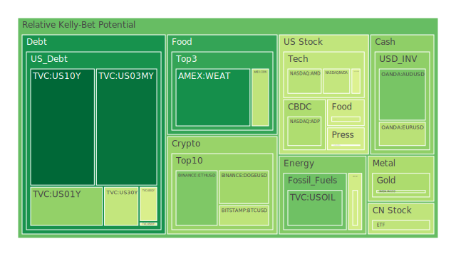
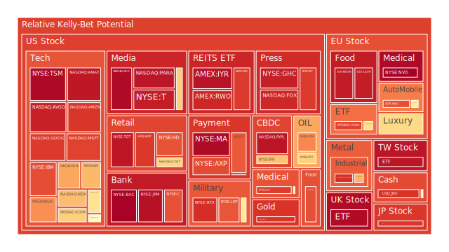
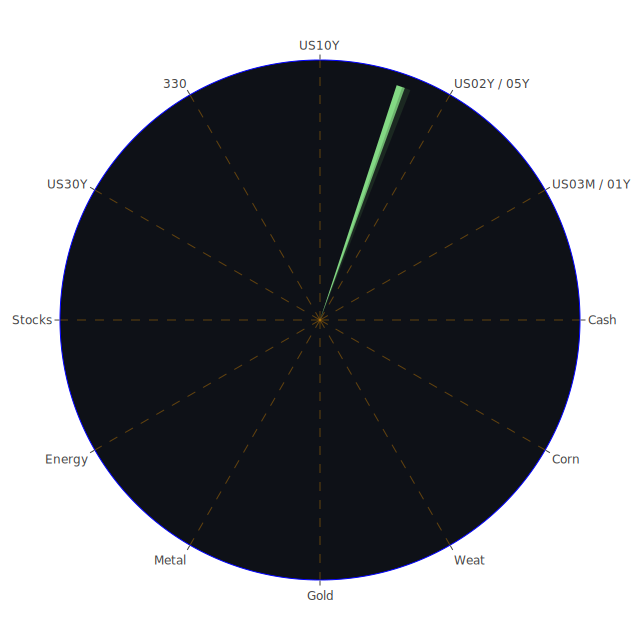

# 一、投資商品泡沫分析

## （一）美國國債
美國國債在近期的泡沫指標（依據D1、D7、D14、D30等風險分數）整體相對偏低，尤其是短天期國債（例如TVC:US03MY、TVC:US02Y等）根據資料所示，當日數值與短期平均風險大多維持在0.1-0.4之間，顯示近期對於國債的擁擠交易程度並不算特別高。然而新聞面上，美國財政狀況遇到政治面與赤字問題時，還是可能使長天期國債收益率波動。據最新FED關鍵數據可見，公債由外國機構持有的數量正在降低，代表海外需求略顯疲弱，但美國國內持有量與聯準會持有量皆偏高。此現象若從社會學與心理學角度來看，可能反映投資者對「安全資產」的迷思依舊存在；而博弈論觀點可認為市場普遍預期今年度利率路徑將趨於平穩或微幅調整，故使國債需求持續。但空間層面上，全球區域資金之流動在地緣政治緊張與美元仍相對強勢的背景下，短期美國國債仍具吸引力；時間層面上，伴隨通膨趨緩，市場對聯準會更激進升息的預期已經減弱，使長短天期國債的利率反轉幅度逐漸收斂；概念層面則顯示若未來爆發更嚴重的財政懸崖或政治僵局，美債市場依舊存在利率尖峰與劇烈震盪的可能性。

## （二）美國零售股
美國零售股（例如NYSE:WMT、NYSE:TGT等）近期泡沫指數處於較高水平，尤其某些零售股D1甚至高於0.9。在近期新聞面，可以看到「消費支出收緊」與「薪資增幅不如預期」的報導，結合「市場整體恐慌」等負面訊息，顯示零售股雖可能在財報季有不錯收入，但對後市展望卻趨保守。若從社會學與心理學來看，消費者面對不確定經濟情勢時容易縮手，對大型零售業利潤有壓力；博弈論則體現於各零售商之間的競爭加劇，包括市場優惠與促銷手段此起彼落。時間向度而言，若後續就業市場持續轉弱，零售業景氣可能面臨挑戰。空間向度則考量全球供應鏈仍在調整中，也不排除市場轉向尋找更具防禦力的選擇。

## （三）美國科技股
美國科技股（包含NASDAQ:AMZN、NASDAQ:AAPL、NASDAQ:MSFT、NASDAQ:NVDA、NASDAQ:AMD等）大部分泡沫分數偏高，有些甚至已逼近0.95-0.98以上，顯示市場前期因AI浪潮、雲端服務、GPU晶片等題材而推動一輪爆發，致使估值極度擁擠。近期新聞則充滿對Nvidia、Dell、Super Micro等「AI伺服器」的盈餘前景憂慮，而且投資者擔心競爭者湧現，壓抑龍頭企業的高獲利空間；亦有報導指出Tesla出現「第二糟糕月份」等衰退跡象，衍生出整體科技圈是否已達到短期估值頂峰的疑慮。從心理學來看，投資者一旦累積過度樂觀情緒，若財報或產品創新不及預期，往往引發更劇烈的賣壓。從博弈論出發，許多科技巨頭之間正在進行AI專利與應用生態系的佈局競賽，對市場形成「贏家可能寡頭壟斷」的預期；惟若經濟循環轉弱，這些高估值公司將面臨估值重整。空間與時間綜觀下：科技股在近期一至兩季內，仍需觀察獲利能否支撐先前飆漲的股價。

## （四）美國房地產指數
美國房地產指數（AMEX:VNQ、AMEX:IYR等）由泡沫指數來看，約在0.88-0.96之間，同時部份指數近月加速升高，但仍受到抵押貸款30年利率與聯準會貨幣政策趨勢影響。新聞顯示美國抵押貸款利率在2月和3月顯著下降，但仍處高檔，而經濟焦慮可能持續抑制買盤情緒。歷史上，當房貸利率在6%以上、甚至接近7%時，房地產市場交易量往往大幅下滑。從社會學角度而言，一旦房價和貸款負擔比過高，年輕族群購房困難，租賃市場需求可能上升，但長期而言也會拉抑住宅售價。心理學部分，若市場對房價上漲的信心一旦動搖，可能引發去槓桿效應。時間脈絡上，目前看不到2008年那種大規模斷頭賣壓，但若經濟衰退幅度加深，房地產指數仍須審慎面對資金退潮的風險。

## （五）加密貨幣
加密貨幣（如BITSTAMP:BTCUSD、BINANCE:ETHUSD、BINANCE:DOGEUSD等）近期泡沫指數整體介於0.32-0.48至0.90上下不等，比特幣D1約在0.41-0.42區間，乙太幣則稍高，但多家報導顯示2月顯著下跌，甚至是自2022年6月以來最糟的單月表現。新聞中亦有Crypto Enforcement等政策面訊號，加上美國對部分交易機構或ETF的持續審查，令市場產生負面情緒。历史上，加密貨幣常在監管消息或全球金融資金緊縮時波動劇烈；心理學層面上，幣圈投資者的「投機-避險」心理很容易受到短期消息催化。博弈論角度，若各國政府聯手監管，加密貨幣以往依賴的「自由競逐」生態將受到衝擊。空間面而言，資金流向分散於各種鏈上生態；時間面則顯示，若未來全球流動性再度縮減，加密資產恐有新一輪拋售壓力。

## （六）金／銀／銅
黃金（OANDA:XAUUSD）近期泡沫分數中等（約0.38-0.51），白銀（OANDA:XAGUSD）則更高（約0.84-0.91），銅（FX:COPPER）也接近0.72上下。這表示白銀的投機成分可能更重，而黃金雖然依舊是眾多投資人尋求避險的標的，但對於升息趨勢放緩的預期，亦推動金價不斷波動。歷史上，當利率走緩與地緣政治不確定性升溫時，黃金往往受資金青睞；銀、銅則更受實際經濟週期需求影響，因此若經濟衰退預期強烈，銅價或銀價常會大幅波動。博弈論觀點可見，大多數對衝基金會「同時」配置黃金與其它金屬，以分散風險。心理學與社會學面向下，一旦社會恐慌心態出現，貴金屬通常吸引資金流入；但若市場情緒快速反轉，也可能劇烈下修。

## （七）黃豆 / 小麥 / 玉米
三類農產品（AMEX:SOYB、AMEX:WEAT、AMEX:CORN）根據所見資料，泡沫指數約介於0.17-0.50之間，相對於高飆的科技股和部分金屬板塊，算是溫和。新聞報導中，全球氣候與農業供應鏈仍存在變數，例如在歐洲或南美地區的乾旱、颶風損害，以及地緣衝突影響糧食出口等，這些因素皆可能在特定時點推高價格。然而歷史上谷物多由政府戰略物資控管，即使面對氣候變遷與地緣政治，真正的大崩盤或大狂飆通常有特定限制。心理角度，投資人視糧食為必需品，較少恐慌性投機；博弈論部分，各主要出口國之間明裡暗裡也會透過產量與補貼來調節市場。時間面而言，若接下來天氣季節性轉折，價格波動可能加劇；空間面對各地糧食需求與供應之互動也值得持續追蹤。

## （八）石油 / 鈾期貨UX!
石油（TVC:USOIL）泡沫指標目前約0.29-0.46，表明短期內投機熱潮並不算極度誇張。新聞顯示，因地緣政治陰影以及美國前總統對外貿易關稅威脅再次升溫，油價面臨多空消息互相拉扯。歷史經驗顯示，石油在地緣衝突、OPEC談判、全球經濟景氣轉折皆可能產生大幅度震盪。社會學與心理學層面：石油牽動民生與能源供應，若市場對衝突或通膨的恐懼上升，油價易出現投機波動。鈾期貨（UX1!）資訊相對有限，但其供需格局主要受核電與地緣政策牽制，假如全球重啟核能、包含歐洲或亞洲國家增加核能佈局，可能帶動鈾需求。歷史上在能源轉型的浪潮下，鈾價也曾出現激烈漲跌，只是市場深度不及石油廣泛，風險集中度更高。

## （九）各國外匯市場
其中較明顯的有OANDA:USDJPY與OANDA:EURUSD、OANDA:GBPUSD以及OANDA:AUDUSD等，近期資料顯示日圓、歐元、英鎊、澳元對美元之價格波動。根據泡沫指數，日圓對美元近期約0.53-0.54中等水準，澳元對美元則有0.31-0.48上下波動，英鎊對美元在0.58-0.90間浮動。新聞面提及地緣政治、各國央行貨幣政策差異等都是影響匯率的因素。從經濟學來看，一旦美國利率若重新回升，美元可能走強，施壓其他貨幣；心理學與社會學層面，地區投資人對通膨與就業情況的焦慮感，也會加重本幣或外幣資產配置的變動。博弈論觀點下，主要國家央行往往相互牽制，不希望本國貨幣過度貶值或升值。空間與時間維度交織後，若全球資金再次回流美元，非美貨幣恐出現震盪走弱之局面。

## （十）各國大盤指數
根據資料可見，美國NASDAQ:NDX、SSE:000300（中國滬深300）、SPREADEX:GDAXI（德國DAX30）等指數之泡沫指數不少都在0.7-0.9之間，尤其美股科技板塊帶領NASDAQ:NDX持續接近高位風險狀態。SSE:000300則在0.42-0.61之間，顯示大陸市場雖有內需與政策支撐，但全球景氣轉弱之風險依舊。歐洲市場方面，GDAXI約0.88，亦有偏高泡沫風險。新聞面顯示通膨數據略有和緩，但地緣政治或潛在衝突造成市場不安。歷史上，一旦市場恐慌加重時，歐美大盤可能同步遭到拋售；在心理學與社會學的角度看，投資者對指數「順勢抱團」容易擁擠，而當轉折點出現時下跌也可能迅速擴大。

## （十一）美國半導體股
美國半導體板塊（NASDAQ:NVDA、NASDAQ:AMD、NASDAQ:INTC、NASDAQ:KLAC、NASDAQ:AMAT等）泡沫風險多數高於0.70，甚至NVDA、AMD、AMAT等達到0.95以上。近期新聞對AI伺服器、晶片前景的修正顯示投資人對半導體「超高估值」已開始持懷疑態度，尤其財報只要略低於超高預期，股價就會立即大跌。歷史上，科技股與半導體面對「需求循環」的起伏時常大幅波動；心理學層面說明散戶和機構皆易陷入FOMO（害怕錯失）心態，推高股價再度形成泡沫。博弈論層面，主要晶片商之研發與市場占有率爭奪，在空間上形成技術護城河，在時間上拉長競賽週期；但若資金流動縮減，半導體板塊跌幅往往加深。

## （十二）美國銀行股
銀行股（NYSE:JPM、NYSE:BAC、NYSE:COF、NYSE:C等）泡沫分數大多接近0.86-0.99，非常之高，顯示市場對銀行股前期炒作頗深，也可能包含了對利差擴大或財報意外增長的正面預期。但同時，新聞報導顯示壞帳率、信用卡逾期率、房地產逾期率等信用指標都有逐漸惡化趨勢，若有風險事件（例如企業違約或債券市場的衝擊）發生，銀行獲利恐大幅回吐。歷史經驗在2008年金融危機告訴我們，只要企業端和消費端的倒帳風險同時升溫，銀行業的資產品質就會急轉直下。從博弈論看，銀行之間同時競爭市場份額，也可能在金融監管下慎防系統性風險。空間層面注意全球銀行競爭，尤其歐洲與亞洲銀行的資產負債表健全度也牽連著美銀估值；時間層面下，若美國經濟真正進入衰退，銀行貸款風險成本會迅速上升，對股價構成沉重壓力。

## （十三）美國軍工股
軍工股（例如NYSE:LMT、NYSE:NOC、NYSE:RTX等）泡沫指數多在0.60-0.85之間。新聞層面：國際衝突與國防開支增加的預期常推動軍工概念股，但仍須觀察美國政府預算及跨黨派博弈能否持續支撐防務支出。從社會學與心理學出發，大眾對國家安全威脅往往容易接受較高軍費；博弈論顯示各國軍備競賽對龍頭軍工企業有利。然而，一旦地緣紛爭趨於緩和或國會卡關，使國防預算受壓縮，軍工股也可能出現結構性回調。歷史上亦見過階段性軍費緊縮，導致整體軍工產業衰退。短期不確定性高，須持續追蹤政治與國際新聞。

## （十四）美國電子支付股
電子支付股（NASDAQ:PYPL、NYSE:V、NYSE:MA、NASDAQ:GPN等）泡沫指數偏高（約0.69-0.96不等），反映出市場對支付產業的長期成長預期依舊旺盛，但近來加密支付、金融監管或經濟成長放緩對其也有一定壓力。新聞面提到部分企業營收雖超市場預期，但在信用環境趨緊下，消費支出動能減弱可能拖累支付交易量。從社會心理學看，消費者支付習慣朝非現金化演變可能是不可逆的長期趨勢，但短期宏觀衰退還是會帶來收縮效應。博弈論部分，各支付巨頭透過專利與生態系綁定用戶，但市場競爭者也不少。若資本市場信心動搖，電子支付股的高估值會面臨風險。

## （十五）美國藥商股
藥商股（NYSE:MRK、NYSE:JNJ、NYSE:LLY等）泡沫指數約0.50-0.93不等。有些防禦型標的較溫和，如MRK大約0.50上下，也有如LLY達到0.89以上的情況。新聞面，疫情後階段醫療需求與研發新藥的潛能仍提供支撐。但歷史告訴我們，若政策施壓藥價、或某大藥研開發失敗，都會造成股價衝擊。心理層面，一般認為醫藥是「牛長熊短」的防禦性產業，但估值過高也容易在市場激烈輪動時被調整。空間與時間交互下，藥廠在研發周期長、臨床試驗結果難測的特性，使股價對突發性消息相當敏感；博弈論顯示各大藥廠爭奪專利、收購生技新創，都將使併購風潮此起彼落。

## （十六）美國影視股
影視股（如NASDAQ:DIS、NASDAQ:NFLX、NASDAQ:PARA等）泡沫分數通常在0.67-0.98不等，尤其串流巨頭或傳統娛樂公司在近兩年受到競爭加劇衝擊。新聞報導顯示部分公司財報強調用戶增長或內容製作成本壓力，市場也擔憂如果經濟景氣不佳，用戶可能削減非必需訂閱。歷史觀察串流領域常在訂閱飽和或競爭白熱化後出現高估值回調。心理學上，消費者娛樂支出易隨經濟繁榮度波動；博弈論裡，串流與院線或電視台之間的市場瓜分不斷演變。投資人應留意產業快速迭代的可能。

## （十七）美國媒體股
一般媒體股（NYSE:NYT、NASDAQ:CMCSA、NASDAQ:FOX等）不少泡沫指數約0.45-0.93，較分散。近年來廣告收入模式受到數位轉型衝擊，更有部分媒體進行併購以獲取線上平台。心理學與社會學看法，傳統報紙、電視台等若在網路時代轉型不順，易遭投資人拋售；博弈論層面，各媒體巨頭在新聞、娛樂、串流、體育版權等板塊爭奪激烈。若未能開發成功的付費生態，大盤回調時衝擊更大。

## （十八）石油防禦股
所謂石油防禦股，多指那些與石油開採、管道、煉油和下游業務相關但資本結構相對穩健的公司（如NYSE:OXY、NYSE:XOM等）。泡沫分數約0.65-0.85不等。油價支撐和股息政策對此類公司具吸引力，但同時面對綠能轉型壓力。歷史上，若油價過度波動，防禦股也難獨善其身；心理學和社會層面，投資人若認為傳統能源未來受碳排限制，就可能在估值上趨於保守。時間維度而言，隨著新能源比重逐漸提高，市場對石油防禦類股的想像空間並不如以往那麼寬廣。

## （十九）金礦防禦股
金礦股（如NASDAQ:RGLD等）通常跟金價連動，但因礦企生產成本、政治風險等因素而波幅更大。資料顯示RGLD的泡沫指數高達0.90以上，存在投資擁擠的跡象。歷史上金礦企業常因地緣政治或礦脈開發而遇到執照風險，引發股價劇震。心理層面上，若投資人預期金價能持續走強，就可能湧入金礦股，但若金價稍有回調，此類高槓桿公司往往先跌得更深。

## （二十）歐洲奢侈品股
歐洲奢侈品股（如EURONEXT:MC、EURONEXT:RMS、EURONEXT:KER等）泡沫分數大多處於0.47-0.88之間不等。隨著中國與其他新興市場富裕階層的需求擴張，奢侈品股於近十年大幅飆漲，估值已不再便宜。新聞面上，若地緣政治或海關關稅爭端加劇，奢侈品在國際市場銷售可能受阻；也可能出現官方限制消費主義或打壓奢華消費的風潮。從心理學與社會學來看，奢侈品的象徵符號需求一旦遭社會風潮或經濟衰退抵制，其銷售衝擊可不容小覷。博弈論則體現於各大奢侈品集團搶先擴張版圖，但也面臨年輕世代消費行為轉變的挑戰。

## （二十一）歐洲汽車股
歐洲汽車股（例如XETR:BMW、XETR:MBG等）泡沫指數在0.47-0.61或更高範圍。新聞顯示中國市場消費放緩及電動車競爭都壓抑歐系傳統車廠的獲利前景。歷史上，歐洲車廠因能源政策、排放標準或地緣關稅常面臨反覆的生產與銷售挑戰。心理學層面，消費者對電動車轉換意願提高，使傳統燃油車銷量降溫。博弈論裡，歐洲車企也急著與全球科技巨頭合作，或自行開發電動與自動駕駛方案，以免在競爭中落後。

## （二十二）歐美食品股
歐美食品股（如SIX:NESN、NYSE:KO、NASDAQ:KHC等）泡沫分數在0.49-0.95左右。有些標的因防禦屬性而吸納資金，有些則因通膨壓力造成成本攀升，壓縮利潤。新聞面看，消費者實際可支配收入若下滑，再加上原物料價格波動，食品股毛利恐出現壓力。歷史上，若全球經濟衰退，民眾會縮減奢侈型食品而轉向平價品牌；社會心理層面，健康與環保意識或各類飲食趨勢也改變食品業的需求結構。時間維度觀察，此類公司在經濟衰退時仍有相對穩定，但估值過高仍會經歷修正。

---

# 二、宏觀經濟傳導路徑分析
從FED相關數據可見，目前EFFR交易量升高、總資產下降，代表流動性收緊趨勢尚未結束，而RRP下降、BTFP與Discount Window較低，顯示銀行體系暫時性的流動性需求雖沒那麼緊繃，但消費與企業端的違約率卻有上升苗頭，尤其信用卡壞帳率與商業地產逾期率位居高檔。一旦這些負債質量惡化超過臨界值，銀行風險偏好或放款意願都將快速逆轉，導致市場流動性更加萎縮。

同時，央行對外流動性互換（Central Bank Liquidity Swap）較低，暗示全球範圍內的資金流並未過度依賴美元流動性援助。然而「Net Due to Related Foreign Offices All Commercial Banks」處於高水準，也意謂著國際間銀行往來可能積累了一些結構性風險，一旦國際金融市場劇烈波動，將可能透過匯率與債務市場快速傳遞至各資產類別。

整體而言，這些FED數據在空間層面表達了全球資金在美國市場的聚攏或分散狀態；在時間層面則看出利率與就業或消費數據的互動會進而牽動信貸週期；在概念層面，若地緣政治或重大政策逆轉，這些指標的意涵也可能急速改變，帶來意想不到的宏觀衝擊。

---

# 三、微觀經濟傳導路徑分析
若將宏觀面再細分到企業與家庭部門，則可見以下傳導路徑：

1. **家庭可支配收入下降**：CPI雖放緩但並未大幅回落，實質工資成長有限，同時信用卡利息上升，導致消費意願減弱。零售與服務業即使營收保持表面成長，但利潤率可能被成本或折扣行銷瓜分。

2. **企業融資壓力上升**：銀行若察覺經濟下行風險加重，風險權重調升，對中小企業貸款更加保守，導致部分企業或新創資金取得不易。隨之產生裁員或業務縮減，進一步抑制消費與就業。

3. **供應鏈波動與原物料價格**：若石油、農產品或金屬價格反覆震盪，中下游製造業的庫存管理與成本控管產生難度；再者，貿易摩擦與關稅威脅也抬高進口原料的成本。以上鏈條往往造成最終產品售價波動不定，衝擊企業獲利預測，投資人更難評估企業價值。

4. **金融槓桿效應**：當投資機構對科技、半導體、房地產等高泡沫板塊同時重倉，一旦市場出現利空共振，槓桿資金迅速離場，股債雙跌或局部流動性枯竭的現象皆有可能發生。

---

# 四、資產類別間傳導路徑分析
綜合以上，於「空間、時間、概念」三重維度下，資產間可能出現以下漣漪效應：

1. **股債聯動**：假使美國國債利率再次走升，或市場對聯準會貨幣路徑產生不安，科技股與銀行股可能首當其衝被拋售，導致其他股市（歐洲、亞洲）也出現同步修正。

2. **外匯與大宗商品**：美元走強常壓制金屬、石油與農產品報價；若國際對局勢恐慌加深，金銀可能短期上漲作為避險，而銅與原油卻因需求擔憂而走跌，農產品也受國際貿易關稅談判不確定性干擾。

3. **地緣政治衝擊**：消息顯示各地政局動盪，如中東衝突、歐洲通脹與罷工、亞洲貿易紛爭，都能牽動當地貨幣與股市的大幅波動，也可能影響能源、原物料或農產品價格。

4. **金融創新與監管變動**：若SEC或FED對某些ETF、加密資產等提出更嚴格規範，可能導致市場對風險資產更謹慎，也恐引發流動性重新分配。此外，地方政府關稅與政策改革，也會使企業供應鏈重新布局，進一步改變資產之間的聯動模式。

---

# 五、投資建議

根據以上空間、時間、概念三位一體的分析，我們嘗試找出相互對沖且相關性約為-0.5、相位差距盡量維持120度的多元化配置機會。以下建議分為三大類型：

## （一）穩健型（約40%配置）
1. **美國國債（10年或5年）**：在通膨回落及聯準會政策趨勢大致穩定的情況下，國債仍具避險及穩定收益功能。不過需要留意財政狀況及政治面風險。
2. **大型消費必需品股（如KO或NESN）**：雖然通膨可能壓抑利潤，但生活必需類往往抗週期，能在衰退或震盪階段提供一定防禦力。
3. **黃金現貨或金礦ETF**：在地緣政治風險增溫或金融市場出現波動時，黃金常有避險效果，但若短期利率再度走高，金價也會受抑。

## （二）成長型（約35%配置）
1. **美國科技龍頭股（例如MSFT、AAPL）**：雖然泡沫指數偏高，但擁有龐大的現金流、全球市場占有率和研發動能；在市場修正後，若能低接，或具長期價值。
2. **半導體設備股（如AMAT、KLAC）**：AI與先進製程帶來的長期需求仍在，然而波動可能加大，必須控制進場時機，適合中長線佈局。
3. **綠能或再生能源相關（如TP Solar等傳出訂單新增的業者）**：全球碳中和趨勢不變，綠能企業具有長期成長潛力，只是股價易受政策與原料成本影響，應保持中度配置。

## （三）高風險型（約25%配置）
1. **加密貨幣核心資產（如BTC、ETH）**：看重其「另類對沖」潛力，但波動極大，需要良好風險控管；可利用少量資金做分散投機。
2. **新興市場高收益債**：收益率較高，但地緣政治與貨幣風險不可小覷；若全球景氣下滑或美元走強，將引發贖回潮。
3. **軍工或高Beta題材股（如NOC、RTX）**：一旦國際衝突升溫，業績可受激勵；反之衝突降溫或預算縮減，修正幅度也大。

此穩健(40%)、成長(35%)、高風險(25%)的粗略配置方式，旨在利用相關性與風險程度的差異來達到某種對沖與平衡。當然，投資者仍需結合自身風險承受能力與資產規模做最終調整。

---

# 六、風險提示

1. **泡沫風險**  
   多數科技、半導體、銀行股泡沫指標偏高，投資者應提防市場情緒一旦反轉，恐怕出現急跌。歷史上對於估值過高的板塊，往往只需要一季或一兩次重大財報利空，就足以引發系統性拋售。

2. **流動性壓力**  
   當前FED資產負債表縮減，市場流動性漸退。若銀行或信用機構提高放貸標準，會迅速傳導至企業融資，衝擊經濟增長。

3. **政治與關稅不確定性**  
   關稅摩擦與地緣衝突變數多，任何突發性政策都可能改變股市、油價與匯市走向。尤其近期新聞反覆提及美國前總統與他國領導人對關稅、能源的言論，易造成市場劇烈波動。

4. **通膨與利率路徑**  
   雖然最近通膨趨緩，但尚未回到歷史低位，一旦通膨再次走升，利率也可能再度上行，擊垮現有的估值前提。

5. **產業競爭與技術風險**  
   科技公司、新能源公司一旦無法領先市場，就會面臨獲利下滑或市佔萎縮等壓力。高估值的公司，對創新失利最為敏感。

6. **地緣政治與極端氣候**  
   任何地區的極端天氣事件、供應鏈中斷、乃至戰事擴大，都可能對石油、糧食、金屬等市場帶來超預期波動。投資者須保持警覺。

---

## 結論與投資建議總結

綜合各方資訊可知，現階段許多資產處於泡沫化風險偏高的階段，尤其科技、銀行、地產等板塊格外明顯。宏觀經濟上，聯準會縮表以及信貸條件正在收緊，而通膨雖有降低趨勢，卻仍保持在需要持續觀察的水位。地緣政治擾動以及關稅政策反覆，也時常令全球資金進退失據。在心理學與社會學層面，市場情緒易被重大新聞撼動，過度樂觀或過度悲觀皆能瞬間切換。博弈論角度則啟示我們，各大機構、各國央行、各產業龍頭之決策會相互影響，並且可能在關鍵時刻扭轉整個市場預期。

在此空間（地區資金流動、國際政治）、時間（利率走勢、產業週期、財報季）與概念（投資人情緒、風險偏好、產業發展）三位一體的交叉下，我們看到不同資產可能因為負面新聞和財務弱勢而產生較強的漣漪傳導；或在重大正面事件或政策利多下產生補漲。然而因各領域近期的泡沫指數普遍偏高，故建議配置時必須運用分散化對沖原則，避免集中押注單一板塊或市場。

在穩健、成長、高風險三大方向的佈局上，建議視各人的風險承受度調整。假設較保守者可將穩健型比例再拉高至50%，而高風險型降至15%；相反地，若對新興科技與高波動市場充滿信心，也可提升成長型佔比，但切記保留足夠的現金部位因應不測之風雲。

---

# 風險提示
投資有風險，市場總是充滿不確定性。本報告所提供的見解僅供參考，投資者應根據自身的風險承受能力與投資目標做出獨立決策。近期泡沫高漲、政治經濟情勢變化迅速，請審慎評估並持續追蹤市場最新動態。切勿忽視任何潛在的金融或經濟風險，尤其對極度泡沫化的標的要保有警覺。

 
Daily Buy Map:

 
Daily Sell Map:

 
Daily Radar Chart:

 
