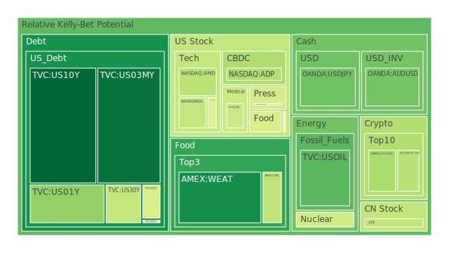
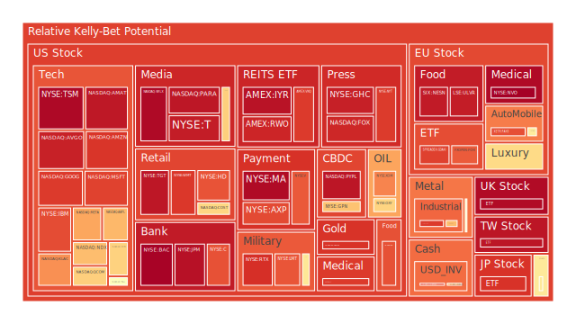
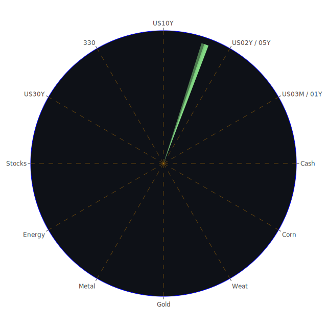

# （一）整體三位一體分析──空間、時間與概念的融合

1. 空間（Spatial）面向：  
   在空間維度上，全球市場可大致區分為美國市場、歐洲市場、亞洲新興市場，以及新近受關注的虛擬資產市場。從新聞脈絡來看，近期負面情緒高漲：2025-03-01與2025-03-02的多則報導顯示「Bitcoin（BTCUSD）近來在2月下跌約17%，創下自2022年6月以來的最差單月表現」，美國科技股當中如Super Micro、Dell的獲利以及AI伺服器競爭壓力都使股價出現顯著回落。此外，美國零售股、例如某些百貨類股或消費連鎖餐飲品牌，也受到「消費者支出放緩」與「可能的財務壓力」之新聞影響。歐洲方面，法國被S&P調降展望至負面，引發市場對歐洲國家財政狀況的隱憂。德國郵政罷工、通膨水準，及梅賽德斯-賓士（Mercedes-Benz）在中國未來擬進行人力調整的消息，也在歐洲與中國市場投下陰影。部分亞洲國家，如日本，則面臨食品通膨導致的消費者需求結構改變，澳洲則出現房市結束下行趨勢的跡象，同時一些投資者認為降息或利率調整將對該區域房市再度帶來活力。  

   此外，國際資本市場的資產配置往往會受到地緣政治事件的牽引，例如俄烏衝突尚未完全落幕，歐洲多國領袖籌組「願意者聯盟」意圖持續支援烏克蘭，並竭力維持與美國的合作，這樣的動作同樣會擾動外匯市場、黃金、債券以及某些軍工產業的股票價格。從空間分布來看，世界各地都在針對各種事件進行反應，也因此從北美到歐洲、從亞洲到非洲都可見到各式各樣的風險與機會在擴散。  

2. 時間（Temporal）面向：  
   觀測時間軸，本報告整合了2025-03-01、2025-03-02與2025-03-03的市場泡沫數據與新聞概要。整體來說，加密貨幣在2月份出現大幅回落後，2025-03-03又有「Bitcoin上漲6.06%至89359美元」的消息，反映其波動仍大。而黃金（XAUUSD）與白銀（XAGUSD）在過去數個月的走勢似乎與通膨預期或利率走向交互牽制。美國聯準會（FED）的相關數據顯示EFFR交易量升高，同時FED總資產減少，Reverse Repo（RRP）偏低，Discount Window也偏低，顯示相對來說市場的流動性策略尚存保守態度，而這將左右後續市場投資人的信心。OIS與FRA等利率互換，以及美國公債殖利率曲線近幾個月以來的變動，也呈現出「收益率倒掛程度有所改善」的現象，不過10年-3個月公債利差在2025-03-03依然顯示為-0.10，而1年前曾經更負值至-1.10，可見倒掛幅度雖縮減但尚未完全轉正。  

   過去歷史上，美國利率維持高檔而且公債殖利率曲線倒掛時，市場對衰退的預期往往出現，但不一定能馬上反映於股市；有時需要經過至少半年的滯後期或更長時間才有可能發生大規模修正。再者，加密貨幣在2022年–2023年間歷經多次大漲大跌，歷史上也曾有「BTCUSD三個月跌幅逾40%」之案例，顯示其對流動性和市場情緒高度敏感。若與2000年網路股泡沫或2017年加密貨幣熱潮相較，我們不能忽視加密資產所特有的風險與神經質。  

3. 概念（Conceptional）面向：  
   從經濟學、社會學、心理學與博弈論四個角度進行綜合解讀：  
   - 經濟學角度：在貨幣政策持續緊縮之後，因為聯準會縮表且利率維持在相對較高的水準，企業與個人的融資條件收緊，美國國債的收益率波動也隨著資金面緊繃而有動態調整。投資人需留意美國長短債利率倒掛的修復過程，以判斷下一波資金流向。  
   - 社會學角度：新聞提及多起勞資糾紛或社會衝突案例，如德國郵政大罷工、英國局部罷工與移民家庭出於安全顧慮而遷離等，顯示潛在的民生壓力在各地持續累積，一旦造成群體行為的變化，往往會反映於消費力、就業市場和民間投資意願。  
   - 心理學角度：市場情緒偏空的新聞不斷疊加，包括「市場顯示極度恐懼」或「投資人對AI行情的獲利能力質疑」等，都會讓投資人陷入過度解讀的恐慌循環。然而，一旦短期空頭情緒釋放過度，也可能意外帶來反向的報復性反彈。此種認知偏差與情緒波動，往往在市場成交量和波動度攀升的時候同步放大。  
   - 博弈論角度：大多數投資人會關注美聯儲與政府之間、各國央行之間，及企業與企業之間的策略互動。例如，歐洲多國積極地想支持烏克蘭，但也同時擔憂通膨和民生問題會否造成選民反彈；科技巨頭相互競爭AI市占率，而小型創業公司則可能在市場恐懼時被大型企業併購，或因資金斷流而倒閉。整個市場的動態就像一場多方遊戲，每一方都在估算其他參與者的意圖，投資人需考慮這些微妙對弈帶來的漣漪效果。  

透過空間、時間與概念三者交織，外部環境動盪不安、內部市場對泡沫以及利率風險有所警戒；此時「正反合」的思維在於：  
- 正：先掌握市場對未來成長與機會的正面資訊，包括AI題材的中長期潛力、歐洲奢侈品或科技豪強在特定條件下的復甦空間、美國房地產指數於通膨稍緩後的可能支撐等。  
- 反：市場眼前有諸多負面衝擊，如經濟景氣疑慮、地緣政治風險、企業獲利衰退、通膨雖稍緩但仍高於歷史平均，以及全球勞動市場的摩擦，都會抑制資金的風險偏好。  
- 合：綜合兩者，投資人或許需要在配置中保持靈活，透過分散與對沖策略來尋求120度相位、相關係數約-0.5的資產組合，使資產能在某些區塊下跌時，由其他相對獨立或具負相關的標的進行風險緩衝。  

---

# （二）各投資商品泡沫分析

接下來從泡沫風險與近期新聞、歷史參照以及現階段市場狀況出發，對多種重要資產類別進行綜合敘述。請注意，以下討論忽略券商名稱，並只聚焦於資產本身，如「US10Y」指美國10年期國債等。若內文提到「BTCUSD」、「ETHUSD」、「DOGEUSD」等，皆為加密貨幣代表之交易對。

1. 美國國債  
   近期美國10年期（US10Y）、2年期（US02Y）、5年期（US05Y）與30年期（US30Y）公債殖利率在倒掛幅度略有收斂跡象，但10年-3個月之利差仍為-0.10，代表對經濟前景仍存在某種不確定性。歷史上若倒掛持續過久，往往容易伴隨經濟衰退發生。然而，部分投資人也將美國國債視為避險工具。聯準會可能放慢縮表與升息步調的消息，常會引發公債價格的短期波動。泡沫程度相對不算高，但殖利率的中長期走勢仍需密切觀察。

2. 美國零售股  
   在新聞層面，陸續傳出各大零售龍頭銷售不如預期，部分品牌或大賣場遭遇消費者需求收縮，加上消費者信用卡違約率上升的隱憂，恐使零售業者面臨周轉與融資壓力。歷史上，一旦經濟進入衰退期，零售業需求會快速下滑。當前零售板塊雖無明顯「爆炒」現象，但隨市場情緒波動，若企業財務狀況惡化，仍有風險加劇的可能。

3. 美國科技股  
   以AMD、AAPL、NVDA、META、MSFT、GOOG等為代表。近來AI題材相當炙手可熱，但新聞顯示對AI伺服器競爭或AI獲利能力的質疑聲音開始浮現，尤其Super Micro以及其他供應鏈公司股價大跌，顯示市場對「故事」的炒作已趨審慎。歷史上如2000年網路泡沫，有過度擴張後的崩跌前車之鑑。從泡沫分數來看，一些熱門科技股依舊在高位徘徊，而相關係數若與宏觀經濟環境不匹配，則須警惕一旦市場信心流失，科技股調整幅度可能擴大。

4. 美國房地產指數  
   房貸利率在6.76%上下，相比前些年顯著提高，但從新聞來看，有部分地區房市結束下行態勢。觀察過往2008年房地產泡沫破裂的經驗，可知若消費者無力負擔過高的貸款利息，或就業市場惡化，房地產價值仍有下修空間。目前看來整體泡沫程度雖未復現當年次貸危機的高點，但仍不可忽視長期高利率下的隱憂。

5. 加密貨幣  
   BTCUSD在2月下挫17%，3月又出現約6%反彈，上下劇烈波動。ETHUSD、DOGEUSD等亦然。先前新聞強調比特幣已跌至近幾個月以來最差的單月表現，暗示其受市場情緒影響極大。歷史案例顯示，加密市場的槓桿行為與散戶投資浪潮常導致大漲大跌。若監管機關對加密產業加大制裁，或市場流動性再次縮緊，加密資產泡沫風險上升也不足為奇。

6. 金/銀/銅  
   金價（XAUUSD）時常作為避險指標，近期新聞指出金價與原油比（GOLD OIL RATIO）處於40上下，顯示黃金與石油之間的價值關係相對高估（歷史平均通常在20～30區間）。銀（XAGUSD）與銅（COPPER）也反映需求端與全球製造業的景氣變化。過往若地緣政治不安或通膨升溫，金銀價格可能走揚；但若需求疲弱，銅價常下跌。就數據看，目前金銀銅並非完全同步，金與石油的比率偏高，需小心若原油需求回升，金價可能遭遇波動。

7. 黃豆 / 小麥 / 玉米  
   在原物料市場，豆類（SOYB）、小麥（WEAT）、玉米（CORN）等農產品的泡沫指數看來不算太高，但仍受地緣政治、氣候、運輸與關稅等多重因素影響。歷史上糧價若因天災人禍而大漲，易形成投機浪潮，但短期內消息面僅顯示小幅震盪，仍需留意烏克蘭、俄羅斯、小麥供需以及美國大豆出口情況。

8. 石油 / 鈾期貨(UX!)  
   油價（USOIL）從先前的高點回落，GOLD OIL RATIO偏高表示油價相對黃金低估。若地緣政治再度升溫，或OPEC+減產，油價可能重新反彈。鈾期貨市場（UX1!）本身交易量不大，但長期來看，若各國政策轉向支持核能發電，需求增加可能帶動鈾價波動。歷史上原物料行情波動常具突發性，泡沫風險雖非當前焦點，但任何供給面意外都能引爆短線價格猛漲。

9. 各國外匯市場  
   主要關注美元指數、美金對歐元（EURUSD）、英鎊（GBPUSD）、日圓（USDJPY）、澳幣（AUDUSD）等。以消息面來看，美國利率接近峰值、通膨緩降，歐洲因法國評級調降隱憂，英國經濟動能不強，澳洲房市微妙翻揚，日本則通膨壓力上行、國內需求不振，導致匯市劇烈波動。歷史多次顯示當市場避險情緒高漲時，美元可能走強；但若市場預期美國經濟放緩，投資人也可能尋求其他避險貨幣或黃金。現階段外匯市場並無大規模泡沫跡象，但高波動下仍存隱憂。

10. 各國大盤指數  
   包括美國NASDAQ 100（NDX）、台灣加權0050、歐洲主要指數如FCHI、GDAXI、FTSE等。近期高通膨與地緣政治風險仍壟罩市場，新聞多顯示「情緒偏負」或「極度恐懼」的訊號。2025年以來，AI熱度曾帶動NASDAQ 100，然而相對估值在某些時間點偏高。若經濟轉向衰退，企業獲利難以支撐，可能引發估值修正。歐洲部分因法國、德國的罷工與政治風險、美國部分因金融與科技股獲利不確定，使得大盤指數面臨震盪。

11. 美國半導體股  
   NVDA、AMD、KLAC、AMAT等均屬龍頭型半導體企業。AI需求帶來中長期利多，但短期新聞顯示一些伺服器供應商或晶片廠營收增速不如市場原先預期。歷史上半導體股常出現「景氣循環」特徵，若AI應用尚未大面積滲透而市場卻提前推高股價，就容易產生結構性泡沫。

12. 美國銀行股  
   JPM、BAC、C、COF等。隨利率升高，傳統銀行利差業務短期受益，但若經濟惡化導致貸款違約率上升，銀行需提列準備金，亦可能衝擊營利。歷史證明，銀行股常與總體經濟健康程度密切連動。新聞也顯示某些信貸指標開始上升，顯示卡債或商業不動產逾放情況漸增。銀行股泡沫程度雖不如科技股明顯，但仍有監管風險和不良貸款風險。

13. 美國軍工股  
   LMT、NOC、RTX等軍工防禦企業，在俄烏衝突後需求看似堅挺，然而預算與政治因素影響大。歷史上，軍工股若戰事出現變局或地緣政治降溫，往往也會獲利修正。需關注政治風向、政府軍費分配。  
   
14. 美國電子支付股  
   V、MA、PYPL、GPN等。消費者支出若放緩，將連帶影響交易手續費；同時高利率環境下，消費者信用與購買意願有下修風險。然而長期隨著電子支付普及，有成長潛力。現階段部分支付龍頭的估值仍不算低，若市場情緒轉差，泡沫疑慮會上升。

15. 美國藥商股  
   MRK、JNJ等。醫藥類股多半抗景氣循環，但仍受法規風險、研發進度、公共衛生支出變化影響。近期新聞不算聚焦此領域，泡沫程度顯示較為溫和，但還是要警惕產品研發或藥證風險。

16. 美國影視股  
   FOX、PARA、NFLX、DIS等。串流平台競爭持續，傳統影視龍頭在內容製作成本與訂閱收益之間的矛盾日益增強。歷史上曾有過度投資、內容泡沫化的案例。新聞顯示某些影視公司開始出售資產或精簡人力，以求降低成本。若市場環境惡化，該板塊短期有進一步波動壓力。

17. 美國媒體股  
   CMCSA、NYT等。此類股價常跟廣告市場以及紙本發行、訂閱模式轉型連動。數位廣告若因經濟放緩而衰退，媒體股營收會立刻受衝擊。從過往經驗看，媒體板塊受市場情緒與廣告景氣極為敏感，目前新聞顯示媒體公司可能面臨嚴峻轉型期，泡沫程度暫時不高，但營收壓力或導致未來股價波動。

18. 石油防禦股  
   XOM、OXY等為石油產業，兼具某種防禦性質。油價回落會削弱該等企業獲利，但若政治動盪帶動油價再次上行，短期獲利也可能大增。長期轉向再生能源的趨勢對石油產業帶來某種不確定性，而泡沫程度主要取決於油價預期是否過度樂觀。

19. 金礦防禦股  
   RGLD等。金價上漲可推動金礦公司營收，反之則受到打擊。歷史上金礦股更容易隨金價波動，且槓桿效應明顯，投機現象時有發生。若投資者預測經濟衰退或地緣風險升高，會看多黃金，進而推升金礦股。但是否形成泡沫，仍需觀察金價與金礦公司本身的財務指標。

20. 歐洲奢侈品股  
   MC、KER、RMS等。奢侈品消費受高淨值客群行為影響，若全球股市下跌或財富大幅縮水，高端消費可能緊縮。不過近年中國與其他新興市場的高端需求復甦，帶動奢侈品股價維持高位。新聞顯示法國被評級調降展望，或許對奢侈品產業短期造成觀感上的負面影響；歷史上該板塊常在社會兩極化時期依然能維持售價，但需注意估值風險。

21. 歐洲汽車股  
   BMW、MBG等。面臨電動車轉型、全球供應鏈波動，德國郵政罷工與部分勞動爭議也間接影響該產業。中國市場若銷售放緩，歐洲汽車品牌將面臨產銷壓力。過去若經濟衰退，汽車需求往往優先受衝擊，加之電動車競爭，歐洲車廠可謂「轉型壓力大」。當前看不到明顯泡沫，但倘若未來銷量不及預期，股價也容易回落。

22. 歐美食品股  
   KHC、NESN、ULVR等。這些消費必需品雖具防禦屬性，但若原物料或運輸成本飆升，或消費者因經濟環境緊縮轉向更廉價品牌，銷售可能不及預期。歷史證明食品類股在衰退來臨時的防禦性高於可選消費品，但若市場預期過度樂觀、推高估值，仍可能存在隱憂。

---

# （三）宏觀經濟傳導路徑分析

當前全球通膨雖有放緩跡象，但仍處高檔，美國聯準會的縮表、利率政策變動皆透過利率、資金流動、企業融資成本、外匯市場等多重管道傳導至各國資本市場。歐洲方面若繼續受到能源危機、地緣政治衝擊，歐元區內部景氣差異可能擴大，並最終影響全球需求。中國市場在疫情後展開修復，但外商投資信心仍不穩定，歐洲汽車廠與其他跨國企業為降低風險，或考慮重新佈局供應鏈。這些變化會同時作用於資產價格：  
1. 利率與信用市場：利率走高壓抑經濟成長，但也可能強化避險資金對債券的需求，同時推高信貸成本，引發企業財務壓力。  
2. 匯率波動：若美元趨弱，資金可能流向新興市場；若美元走強，則壓縮該國出口與新興市場資金面。  
3. 大宗商品：油價、糧價與金屬價格受地緣與供需交織影響，可能牽動通膨預期。若大宗商品再次大漲，Fed等央行可能維持緊縮更久，對股票市場不利。  
4. 房地產：房貸利率居高，民間投資與消費支出減弱，可能拖累房價與整體經濟動能。  

---

# （四）微觀經濟傳導路徑分析

在企業層面，資金成本變化最直接影響擴張或投資速度。科技公司若利率居高，公司估值將被壓縮，並削弱併購或開發新領域（如AI）的動力。零售與餐飲產業若消費者支出被削弱，就會降低雇用意願，進一步影響失業率與工資水平。對中小企業來說，若貸款條件嚴苛，庫存或週轉壓力亦加大。大宗商品價格若上漲，部分下游製造商與物流企業的利潤將被擠壓；但資源類公司則可趁勢擴大獲利。這些傳導機制往往由市場預期率先反映，之後才在企業財報與就業數據中逐步浮現。

---

# （五）資產類別間的傳導路徑與潛在漣漪效應

1. 美股（包括科技、銀行、防禦等）與債券之間常呈負相關；當股市下跌，避險資金湧入債市，推高債券價格。  
2. 加密貨幣與美股之間，近年已越來越正向連動，特別是與NASDAQ 100同步；然而在極端恐慌時，加密貨幣可能跌幅更大。  
3. 原物料（石油、黃金、農產品）與美元匯率之間具有互動關係：若美元偏強通常壓抑商品價格，反之則推升商品價格。  
4. 歐洲奢侈品股與中國消費市場之間高度連動，中國景氣回溫會帶動奢侈品需求。若中國需求不振或歐洲政治不穩，都會衝擊奢侈品股價。  
5. 房地產市場若下滑，會影響建材、金融機構貸款業務；若違約率上升則造成銀行資產品質惡化。  

由此看出，當前的市場架構彷彿一張錯綜複雜的網，任何一處的波動都可能透過金融與貿易體系傳遞至其他區塊，形成漣漪效應。尤其在高槓桿或資金緊張的情形下，若某個板塊爆發流動性危機，就會迅速帶動跨市場連鎖反應。

---

# （六）投資建議：穩健、成長與高風險三大類配置

以下嘗試就當前環境提出三種配置思路，總和為100%。此處僅為示意性概念，實際操作仍須依投資人自身條件做調整。

1. 穩健型（約50%）：  
   - 美國短年期國債（例如US01Y、US02Y等），佔穩健組合20%。利率雖漸趨於平穩，但依舊具有避險與保值功能；且若市場再次出現波動，短債相對利率與價格風險較小。  
   - 防禦性必需消費或食品股，如KHC、NESN、ULVR等，佔穩健組合20%。在衰退風險時具較佳防禦力。  
   - 黃金（XAUUSD）或黃金礦商（RGLD等），佔穩健組合10%。以對沖地緣政治或通膨風險。黃金比率宜控制在適度水平，以免遇到突然加息周期再次壓抑金價。  

2. 成長型（約35%）：  
   - 部分科技龍頭股，如AAPL、MSFT、GOOG，佔成長組合15%。此類企業在AI或數位化趨勢下仍有中長期價值，但需留意估值與短期波動。  
   - 半導體與關鍵晶片股，如AMD、NVDA、AMAT，佔成長組合10%。AI與資料中心長期需求仍在，可慎選財務體質良好的標的。  
   - 能源轉型與再生能源相關公司、或油價反彈機會，如XOM或供應鏈中具優勢之企業，佔成長組合10%。短期原油價格雖波動，但中期若地緣衝突升溫或需求回暖，能源股仍可享一定漲幅。  

3. 高風險型（約15%）：  
   - 加密貨幣（BTCUSD、ETHUSD等），佔高風險組合5%。市場波動大，受情緒與監管影響，若承擔能力不足者應慎入。  
   - 軍工股（如LMT、NOC），佔高風險組合5%。地緣政治加劇時可能上漲，但若衝突降溫或預算縮減，也恐出現下挫。  
   - 新興市場或題材股（如部分生技、AI新創），佔高風險組合5%。需高度承擔流動性風險與公司倒閉風險，但若研發成功或被大企業併購，報酬或可觀。  

選擇上述標的時，須盡量關注它們之間相關係數的波動，嘗試維持互相分散的結構，目標在於令各資產之間的相關度約-0.5（或至少呈現低度正相關），以期在一方下跌時能獲得另一方的避險或抵銷效果。以博弈論觀點來看，將資產分散至不同「策略陣營」，把資本在不同局勢下輪流發揮功效。

---

# （七）對沖風險與兩兩驗證之篩選假設

根據前述三位一體空間、時間、概念的觀察，我們要在各投資機會中進行雙向驗證，以確保假設的合情合理，例如：

1. 若判斷房地產市場存在下修可能，就應減少對房地產投資信託（REITs）的配置比例，或以空頭部位對沖建築材料股；同時若外匯市場顯示美元未必繼續強勢，可以考慮在某些新興市場貨幣中做小部位布局，對沖通膨風險。  
2. 若預期AI相關產業尚需一段時間成熟，可以通過一部分投資於具實際業務落地的科技龍頭，如AAPL、MSFT，同時避免高估值、尚未盈利的初創公司，以免AI泡沫破裂時損失過大。  
3. 若認為油價將因地緣情勢升溫而反彈，就可在組合中配置石油防禦股（XOM、OXY）和少量鈾期貨（UX1!）概念股，以捕捉能源上揚機會，同時準備在油價若急升後進行獲利了結。  
4. 若預見加密貨幣在監管壓力下波動更劇烈，可通過避險工具（例如部分穩定幣或小型對沖策略），並在牛市情緒回暖時，謹慎地減碼獲利。  

此種透過「雙向檢驗」以減少過度集中於單一風險，使資產的漣漪效應傳導能被分散，而非集中爆發。

---

# （八）歷史相似場景與新聞參照

1. 歷史參照：  
   - 2000年科網泡沫：過度炒作，最後出現大幅修正。現今若AI或加密貨幣被過度追捧，須留意重蹈此轍。  
   - 2008年金融海嘯：房地產和信用泡沫破裂，銀行體系出現流動性危機。當前銀行股目前資本比率雖較以往好，但若經濟放緩導致大量呆帳，仍可能引起系統性風險。  
   - 2017年加密熱潮：BTCUSD在一年內飆漲數倍，卻於隔年崩盤；顯示對新興標的的投機情緒易被市場放大。  

2. 新聞參照：  
   - 三天內反覆提及「德國郵政罷工」、「英國工人罷工」、「法國評級下調」、「移民爭議」、「烏克蘭與俄羅斯的軍事衝突」，顯示全球局勢依舊存在高張力的政治風險。  
   - 多家科技公司如Super Micro、Dell出現財報利空或競爭疑慮；AI伺服器需求雖大，但市場對獲利能力開始刪減樂觀預期，顯示後續可能調整。  
   - 加密貨幣、黃金、石油等均在市場消息面高頻震盪，既有正面回暖情緒，也有監管、地緣、需求等面向的負面新聞交錯。  

---

# （九）投資建議總結

綜合以上所有資訊，本報告建議投資人首先要充分理解當前環境充滿結構性與偶發性風險：金融面與實體經濟、地緣政治與區域發展、社會勞動衝突與民粹可能相互糾結，形成衰退隱憂與政策變動的複合威脅。因此在資產組合中，應以兼顧「多元分散」「保留流動性」以及「對沖策略」為主。  
1. 以50%部位做穩健型資產，以防高波動帶來的衝擊。  
2. 35%部位放在成長型標的，鎖定財務體質穩健、長期需求確定度較高的企業，避免盲目追逐題材。  
3. 15%部位進行高風險投資，包含加密貨幣、軍工股或新興市場投機機會，但該部位需設停損機制。  
4. 定期關注美聯儲政策與全球信用市場動向，若觀察利率、通膨或就業數據與預期明顯背離，應及時調整部位。  

---

# （十）風險提示

投資市場時常充滿不確定性與潛在泡沫風險，請特別留意：  
1. 景氣循環與政策轉折速度可能比預期更快，債券殖利率或股市估值都可能瞬息萬變。  
2. AI、元宇宙、加密貨幣等題材炒作容易讓投資者忽視企業基本面。  
3. 任何地緣政治危機的突然惡化，或系統性金融風險的再度爆發（如大型銀行資產負債問題），都會顯著打擊市場信心。  
4. 原物料供給與需求波動常在短時間內劇烈變動，導致相關企業股價或期貨市場出現超預期漲跌。  
5. 房地產若面臨長期高利率與就業衰退，仍有可能步入顯著的下行週期。  
6. 各種社會、政治或公共衛生事件（如重大罷工、衝突、災害）都會對市場產生連鎖效應，必須持續觀察。

最後強調，以上資料與觀察僅供參考。投資者應綜合自身資金規模、風險承受度、投資目標，以及對國際市場的動態追蹤後再做決策。切勿忽視任何泡沫風險高的警告，因為即使是當前看似穩健的標的，也可能因宏觀與微觀因素交織，瞬間陷入新的風險之中。市場千變萬化，投資人宜謹記「分散風險」與「謹慎評估」的基本原則，並隨時做好風險控管。如同歷史告訴我們的，經濟與市場的交錯漣漪能在意想不到的時刻席捲而來，慎思而行方能於動盪之中尋求相對穩定的機會。

---

投資有風險，市場總是充滿不確定性。我們的建議僅供參考，投資者應根據自身的風險承受能力和投資目標，做出獨立的投資決策。請在任何進一步投資行動之前，確保已充分掌握相關市場動態及自身的財務狀況，並於必要時尋求專業財務或法律顧問協助。願每一位投資者都能在此充滿挑戰和機遇的市場環境下，穩健而明智地前行。

 
Daily Buy Map:

 
Daily Sell Map:

 
Daily Radar Chart:

 
