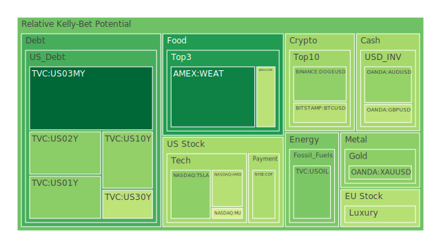
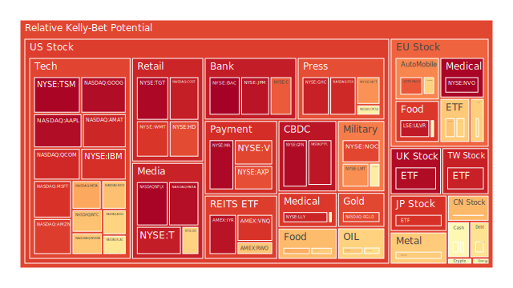
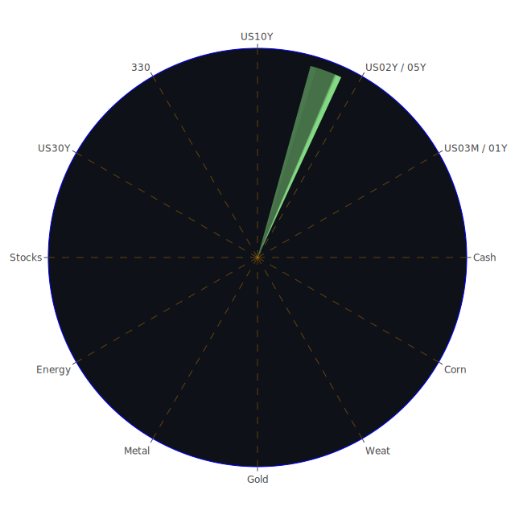

# 一、三位一體（Spatial / Temporal / Conceptional）之整體觀察

1. **空間（Spatial）面向：**  
   透過全球市場與多國新聞交織的資料來源，我們可以觀察到不同地區之間投資情緒的同步與差異。近期新聞顯示，美國在貿易關稅、通膨議題與聯準會（FED）資產負債表調整的交互影響下，市場心態趨於謹慎。歐洲方面，法國、西班牙、德國等地都面臨通脹和失業率方面的挑戰，且有關郵政、醫療等產業罷工與示威的新聞屢見不鮮，進一步干擾經濟活動。亞洲則呈現複雜局面：中國在併購（M&A）與人工智慧（AI）興起的驅動下，潛藏成長契機；日本則受消費市場下滑與通貨膨脹拉扯；印度、越南等新興經濟體，有局部性投資利好消息（如太陽能專案合約），但也伴隨全球資金流向變動而動盪。  
   若從「市場—新聞—情緒」的三位一體角度判斷，空間層面顯示出局部市場出現部分走弱跡象（如歐洲車市、德國工業產值、部分新興國家之高風險事件），也有局部市場具備利多發酵潛力（如部分科技股與再生能源概念在中國、東南亞的發展）。這些區域差異在投資組合的佈局上，提供了某種地理分散化的可能性，也在博弈論層面牽動各國對利率與關稅政策的競合。

2. **時間（Temporal）面向：**  
   近期新聞頻頻圍繞在關稅即將落地、各國央行貨幣政策變化、以及製造業、服務業的短期衰退警訊等負面情緒；而通膨與高利率環境似乎並未在短期內結束。不過，也有部分正面消息顯示，比如某些與AI相關的企業（如Nvidia相關供應鏈）營收增長，或再度傳出併購整合的市場機會，預示著中長期仍有題材可期。  
   在「市場—新聞—情緒」的三位一體之時間維度上，若回顧歷史：在2008年金融海嘯或2000年網路泡沫時期，市場也曾歷經類似樂觀—恐慌—谷底反轉的過程。目前有部分新聞報導提及「美國國債殖利率曲線出現倒掛或利差縮窄」、「房地產指數下行趨勢」、「各國貨幣面臨資本外流風險」等，讓人想起多次經濟週期下的警訊。然而，時間序列亦顯示：有些消息雖短期衝擊大，但後續發酵仍需觀察。如2025年以來，美國短期公債殖利率（3M、1Y）及長天期（10Y、30Y）一度攀高但近日又有回落，呈現不穩定的波動，使得通膨或經濟衰退的預期牽動投資人信心。這樣的時間差與週期性反覆，既對投資決策造成干擾，也暗示可能在波動階段獲得錯配與套利的機會。  
   心理學與博弈論的結合，則顯示出市場參與者對未來持高度不確定性預期，容易使負面訊息放大衝擊。相對地，若有重大利多或政策轉向宣示（例如額外量化寬鬆、減免稅收、或與其他國家談判解除關稅），都可能引發市場情緒激烈逆轉，這是投資決策需特別留意的節奏關鍵。

3. **概念（Conceptional）面向：**  
   以經濟學、社會學、心理學與博弈論加以詮釋，各市場表面上看似分離，實質則有深層關聯。經濟學理論指出，資產泡沫常與資金成本、期望報酬、投資人過度槓桿、以及金融創新失控等因素糾葛。社會學則關注群眾行為與輿論，尤其是對特定產業（如醫療、AI、軍工）的社會認同或排斥。心理學揭露「恐慌—貪婪」循環：近期多起負面新聞（例如對國際衝突的擔憂、對大型科技公司競爭的顧慮）都可能強化投資人的避險傾向或出現拋售，引發短暫的價格下跌。然而，一旦情緒修復，資金又可能大舉回流特定標的。博弈論則強調各國政策互動：當美國揚言新增關稅或調整軍事預算，其他國家勢必制衡或反制，也對匯率、貿易流動及資本配置構成影響。  
   在「市場—新聞—情緒」的三位一體之概念維度上，可大膽假設：某些產業的結構性需求（如雲端服務、晶片、關鍵金屬供應鏈）終究難以替代，故長期仍具成長基礎。某些則可能在炒作之後急速冷卻，特別是當泡沫指數持續攀升且基本面未及時跟上時，風險就會倍增。  

歸納以上三位一體分析，若以「正反合」整合：  
- **正面**：AI與再生能源仍帶來長期成長前景，各國在危機時亦會推出紓困或寬鬆舉措，一旦通膨趨緩，可能釋放風險資產的反彈空間。  
- **反面**：關稅、地緣政治、全球需求縮減和利率高企，可能抑制中短期的企業獲利與經濟活力，尤其對財務槓桿高或現金流不穩的企業，泡沫風險甚高。  
- **綜合**：宜在組合策略上兼顧避險與進攻；利用地區與產業的相互對沖來分散風險；面對負面新聞所帶來的短線波動，應評估真實衝擊的實質程度，而非僅看市場情緒宣洩。  

---

# 二、投資商品泡沫分析

以下依照常見投資標的逐一審視其泡沫現況及相關新聞、歷史場景，並輔以簡要論述與建議。當中所引用的「當日現價」（PP100）與「泡沫指數」（例如當日、七天平均、兩週平均、月平均）等僅供風險研判參考，泡沫指數越高，通常意味著該商品/資產目前的市場定價越可能背離基本面。

1. **美國國債**  
   近期數據顯示，短天期美債（3M-1Y）利率較前期略有回落，但與長天期美債（10Y、30Y）利差仍未完全修復，Yield Curve大體處於相對扁平或局部倒掛的狀態，暗示市場對經濟未來走向抱持高度戒心。新聞方面，關稅與政府預算談判的議題不斷，美國可能為了彌補財政缺口而繼續發債。歷史上，2000年初或2006-2007年期間也曾出現殖利率曲線嚴重扁平化，最終揭示經濟周期可能轉弱。儘管如此，美國國債往往被視為避險資產，在金融市場波動時仍可能吸引資金流入；然而當前泡沫風險主要體現在「國債需求若過度集中於短端，一旦政策或經濟預期改變，長債波動空間會加大」。投資人宜透過分散期限或採用梯形配置，以應對利率風險。

2. **美國零售股**  
   從新聞面可見，家得寶（HD）等連鎖品牌在財報中顯示高成本壓力，另外消費者行為因通膨與就業不確定而更趨保守。近來也有「美國零售商營收不如預期」「人力成本上升侵蝕獲利」的報導。歷史上，零售股在經濟衰退或通膨時期往往表現疲弱。當前泡沫指數於部分零售企業亦偏高，若企業未能有效轉嫁成本或擴大規模，有被市場過度預估的風險。須留意近年通路多元化、電商與傳統零售整合的趨勢，能夠成功轉型者仍具有長期競爭力，但短線上籌碼與情緒都不穩定。

3. **美國科技股**  
   高成長的科技股同時包含兩大面向：一是雲端、AI、晶片等領域；二是網路零售、電商平台、社群媒體等商業模式。近期新聞顯示，Nvidia在AI相關領域維持霸主地位且營收上升，而Intel也傳出與其他AI芯片合作廠商的利多。與此同時，部分雲端服務和電商平台（Amazon、Google母公司）雖傳出營收增長放緩，但仍有新事業動能的支撐。歷史上，科技股常在經濟週期低迷後率先反彈，但也曾出現「網路泡沫」的慘痛教訓。投資人需警惕當前泡沫指數偏高的科技股，一旦市場資金退潮或競爭白熱化，其估值恐大幅回檔。不過，「創新週期」如同心理學與博弈論所述，會吸引資金的持續關注，一旦調整完畢後亦有新一輪上漲空間。

4. **美國房地產指數**  
   報導顯示，美國三十年期固定房貸利率仍處在6%以上的高位，盡管最近有些微回落，但仍遠超過疫情前的水準。房價在部分地區已顯現鬆動，房地產ETF或REITs（例如VNQ）也呈現空間上的下壓。歷史上，2008年房地產泡沫曾導致金融風暴，因此對房市泡沫的警惕度無人敢大意。現階段家庭可支配所得被通膨侵蝕，使得購屋需求減弱，這對房地產業的泡沫風險具有警訊。短期內若利率仍居高不下，房地產指數恐持續承壓；但若未來經濟形勢逆轉、利率下調或政府祭出房市刺激方案，則可能帶來一定反彈。  

5. **加密貨幣**  
   最近比特幣價格一度回落，再有消息指稱「某些比特幣『儲備計畫』已暫緩或失去動能」。同時，監管力度增加，SEC 對部分加密貨幣的法規限制或調查也使市場承壓。歷史上，加密貨幣曾多次經歷價格的大起大落，主要驅動來自投機熱潮與對「去中心化金融」的信仰。從心理學角度看，加密市場的群眾效應尤為顯著，正面與負面新聞的情緒放大極為明顯。目前加密貨幣的泡沫指數隨市場消息面快速翻轉，需要密切追蹤資金流動狀況；雖有一定遠景（如應用在全球支付、數位資產管理），但高風險特質不變。

6. **金 / 銀 / 銅**  
   黃金往往是市場動盪時的避險資產，但近期觀察顯示，金價與石油和其他原物料之比（GOLD OIL RATIO）有明顯走高跡象，也意謂著投資人對未來可能通膨或地緣風險的預防意識再度升溫。白銀與銅則受工業需求與宏觀景氣連動較大。例如，若全球製造業或電動車市場放緩，銅價就容易滑落。新聞也提及若美國對特定關稅加重，可能衝擊金屬供應鏈。從歷史經驗來看，金屬族群隨景氣循環波動很大，其泡沫成分常在需求激增或避險浪潮中快速膨脹，而一旦供需或市場預期反轉，也會迅速回落。

7. **黃豆 / 小麥 / 玉米**  
   這些農產品的價格常受氣候、地緣政治（如戰爭導致糧食出口受阻）、運輸成本與國際進出口政策影響。根據新聞，印度、巴西、北美等地的天氣變化將直接關係穀物產量，俄烏衝突對小麥供應造成結構性衝擊仍未徹底消除。歷史上，農產品泡沫較少出現巨大幅度，但也可能在短期內由於災害、禁運或投機資金湧入而大漲。投資該領域需注意基本面（例如產量預估與庫存）與政治風險之變化，泡沫指數通常不是農產品最主要風險，而是波動率來源與短線缺口更值得關注。

8. **石油 / 鈾期貨UX!**  
   石油價格近期雖在減產與地緣爭端的拉扯下震盪，但整體趨勢偏向疲弱，報導則指出OPEC+也有意微調產量。反觀鈾礦與核能議題因多國重啟核電討論而再度升溫，市場預期未來鈾需求可能增加。歷史上石油期貨常受經濟週期與中東地區政治事件支配；若全球經濟放緩，油價走低；若衝突或減產則油價又飆升。鈾期貨在歷史上也曾出現大漲大跌，高度取決於政治風向與安全顧慮。此兩者的泡沫風險都跟短期事件與長期趨勢糾結，須同時留意。

9. **各國外匯市場**  
   美元、歐元、日圓、英鎊、澳幣等近期報價隨著利率決策與通膨指標左右劇烈波動。新聞暗示美國關稅政策擴大時，部分出口國貨幣可能承壓；歐元則面臨歐洲多國公共財政問題與通膨干擾；日圓則受製於本國貨幣政策與投資人對避險需求的轉變。回顧歷史，外匯市場常伴隨經濟周期翻轉之時波動幅度最大，若加上地緣政治緊張或央行突發調整，更可能激烈震盪。泡沫風險在外匯較難以「高估」或「低估」字面呈現，但一旦走勢脫離國家基礎面，便可能呈現快速修正。

10. **各國大盤指數**  
   從美股、歐股到亞洲新興市場，一些大盤指數近期普遍呈現下修壓力，當中又以德國、法國、義大利等歐洲國家與部分亞洲指數受通膨、就業、地緣衝突等因素影響最大；中國上證、港股則因產業結構調整與政策干預，呈現時好時壞。美國NASDAQ、S&P500一度因科技股帶動而有支撐，但若未來企業營收普遍不佳，指數仍有下行風險。歷史顯示，大盤指數的泡沫風險與資金流向密切關聯，尤其是ETF產品帶動的大量被動式資金，進出時會同時拉抬或壓低指數。須關注未來半年至一年內的全球經濟增速變化。

11. **美國半導體股**  
   半導體是近年來熱門產業之一，各國對先進製程與成熟製程的需求並存。同時新聞指出，Nvidia等龍頭在AI浪潮中市占持續擴大，而Intel致力於晶圓代工領域再度激起市場關注，也有傳聞Broadcom與其他大廠在AI、雲端伺服器相關專案的投入。歷史上，半導體景氣通常有3-4年的起伏循環，庫存過剩或需求忽然釋放都能使股價大幅震盪。近來泡沫風險並不小，因為若供給堆積或客戶訂單砍單，估值可能瞬間跳水。短線仍需觀察AI伺服器需求和全球去庫存速度。

12. **美國銀行股**  
   銀行業消息面多集中於貸款違約率、消費者信貸表現，以及利差擠壓。報導亦稱，有部分信用卡違約率上升趨勢，且商業地產貸款、車貸、學生貸款等潛藏風險。歷史上銀行業對經濟週期十分敏感，2008年金融海嘯即由房貸問題引爆。當前若經濟走弱或房地產價格下滑，銀行資產品質就受衝擊，泡沫風險可聚焦於高杠桿或資產配置過度集中者。然而，美國大型銀行經過數次壓力測試，資本充足率有所提升，雖然難言能完全避免風險，但與次貸危機前相比已相對穩健。

13. **美國軍工股**  
   近期地緣衝突話題持續，包括烏俄戰事尚未落幕、中東地區不確定性依然存在。美國軍工訂單多來自國防預算，新聞指出若政府財政壓力偏大，可能影響國防支出增幅。歷史顯示，軍工股常在衝突升溫時需求上揚，但一旦結束或被政治協商取代，軍工股則會出現獲利了結或短暫空窗。泡沫風險在於投資人對軍火合約持續性的過度樂觀，一旦預期落空股價或估值容易回吐。

14. **美國電子支付股**  
   近年金融科技崛起，信用卡、電子錢包、線上交易快速成長，但新聞面也顯示監管、競爭、資安風險都有升溫趨勢。美國電子支付龍頭公司在疫情期間曾經大幅受惠於線上消費興起，後來通膨和市場恢復實體消費後，成長率趨緩。歷史經驗表明，若經濟衰退，交易量下滑，支付類公司營收就會減少。此領域的泡沫潛在風險在於市值是否過度反映未來成長，若有更多競爭者加入或手續費調整政策，可能導致估值重置。

15. **美國藥商股**  
   政策面如醫保改革、藥價監管常影響藥廠利潤。新聞提到部分藥廠面臨專利過期或新藥審批延遲，增加不確定性；但大體上醫藥需求具剛性，不易受到經濟週期衝擊而劇烈波動。歷史上，藥商股偏向防禦性資產，但若市場對創新藥或疫苗的預期過度膨脹，亦可能發生高估現象而回跌。需特別留意臨床試驗結果、新藥上市進度等事件衝擊。

16. **美國影視股**  
   受串流平台競爭和廣告收入的影響，有些傳統影視公司財務壓力漸增，同時也得面臨工會罷工或演員合約糾紛的可能。新聞顯示，影片與內容製作的成本走高，市場則競爭者眾多。回顧網路串流興起前後，部分影視巨頭一度風光，卻因轉型不力而陷入財務危機。當前泡沫風險在於市場對串流平台用戶增長的幻想，一旦達到飽和或多家平台戰火加劇，股價恐面臨壓力。

17. **美國媒體股**  
   和影視股相似之處在於廣告市場競爭、用戶黏著度與多平台佈局。新聞顯示，大型傳統媒體面臨網路媒體崛起的長期挑戰，並且廣告投放預算受到通膨與經濟周期影響，廣告客戶削減預算會令媒體收入下行。歷史亦曾有「廣告寒冬」沖擊整體媒體業。此類股泡沫風險通常與投資者對新媒體轉型的預期掛鉤，若轉型成功仍可改寫頹勢，否則一旦用戶流失或重複付費行為受限，估值難以承受。

18. **石油防禦股**  
   即石油產業中的相對穩健或防禦性個股，多半是整合上下游業務的大型石油公司或提供油田服務的公司。這些公司通常受國際油價波動、環保規範及碳稅政策等多因素影響。新聞指出有些能源公司財報在油價高時獲利大增，但若油價回落恐難維持。歷史經驗顯示，石油產業的價格彈性大，投資人常因一時獲利亮眼而高估公司長期價值，誘發泡沫；也需留意全球綠能轉型趨勢，長期而言石油需求成長恐受限。

19. **金礦防禦股**  
   與金價波動緊密相連，若市場在通膨或地緣風險升溫時買進黃金，金礦股常有更大杠桿效應。新聞面顯示，若金價上漲，礦業公司收益增厚；但也須考慮開採成本、政治風險（如礦區所在國家政策不穩），一旦黃金行情反轉或開採條件受阻，股價回落速度可能更快。歷史上金礦股也經歷多次因「黃金熱潮」快速飆漲，後又因實際需求不振或政策干預而爆跌的情形。  
   
20. **歐洲奢侈品股**  
   法國、義大利等奢侈品大廠受益於富裕消費者與新興市場需求，但也面臨地緣、關稅與貨幣波動等風險。新聞顯示，某些歐洲奢侈品牌銷售增長放緩，特別是中國消費動能尚未完全恢復，歐洲本土需求也不夠強勁。歷史上，奢侈品股易隨全球富人財富變動與旅遊便利度而大漲大跌，一旦奢侈品消費減少或競品衝擊，股價回調幅度會相當顯著。

21. **歐洲汽車股**  
   德國、法國、義大利等國家車廠深受能源政策、電動化轉型及國際關稅影響。新聞指出，德國汽車製造業勞資關係緊張，加上中國電動車競爭者崛起，歐洲車企壓力持續增大。歷史上，汽車業之周期性強，景氣低迷時往往銷量下滑，也曾發生2015年柴油門事件引爆市場信心危機。當前泡沫風險若集中於電動車轉型期待過度，或對新型號銷售高估，都可能導致估值高企而後回落。

22. **歐美食品股**  
   食品產業雖相對穩定，但新聞面指出原物料（穀物、糖、乳製品等）價格波動，進而影響毛利率，且消費者對健康與環保意識提升，使部分傳統食品股銷售下滑。歷史經驗看，食品類往往被歸類為「防禦性標的」，但若市場對特定品牌抱持過度憧憬，或公司負債率高企，也可能發生股價走勢超離基本面。投資需注意該公司原料供應鏈與產品多元化程度。

---

# 三、宏觀經濟傳導路徑分析

1. **利率與貨幣政策傳導：**  
   聯準會（FED）近期資產負債表縮減、RRP下滑、EFFR Volume高企的信號，加上OIS預期和FRA SOFR顯示未來利率路徑仍有不確定性。歷史經驗中，當利率維持高檔或貨幣緊縮，長期債券價格承壓，股市資金動能減弱，甚至可能導致企業融資成本過高而縮減支出。這條傳導路徑亦影響匯率：若美國持續升息，美元相對強勢，其他貨幣承壓。

2. **財政政策與關稅衝擊：**  
   新聞顯示美國對多國祭出關稅，造成貿易摩擦升溫。歷史上的關稅戰容易波及全球供應鏈，也使企業成本增加，最終反映在消費者物價或企業獲利。當宏觀情勢惡化，企業減少投資、裁員，導致就業與需求進一步收縮。此循環放大衰退或通膨壓力，具社會學與心理學層面的負面情緒傳導。

3. **地緣政治與安全：**  
   俄烏紛爭、亞太局勢、歐洲內部財政問題等，都會透過貿易、資本流動與投資人信心等路徑影響全球市場。博弈論提醒，各國在軍事與外交對立時，資源投入防衛或產業補貼，牽動原物料市場、運輸管道與貨幣互換條件。最終反映在進出口價格與企業全球佈局策略上。

---

# 四、微觀經濟傳導路徑分析

1. **企業獲利與成本結構：**  
   通膨推升原料與人力成本，壓縮企業利潤；若需求同時放緩，營收端也受壓力。負面新聞更使資本市場信心降低，企業發債或增資難度上升，償債或擴張計畫可能延誤。微觀層面上，尤其對商業模式脆弱、槓桿高者形成致命衝擊。

2. **金融機構與貸款風險：**  
   當房價或商業地產價格下跌，銀行擔保價值減損；消費性貸款（信用卡、汽車貸款）違約率若上升，銀行必須提列呆帳。這些因素會連帶影響企業融資利率。微觀層面若蔓延為系統性風險，最終會返回宏觀層面形成金融收縮。

3. **產業供應鏈與競爭：**  
   在現代全球化下，任何一個環節斷裂或成本上升，都可能在上下游產生連鎖效應，如半導體缺貨導致汽車製造延誤，農產品缺貨導致食品成本暴漲，等等。各企業必須在供應鏈管理上投入更多資源，而投資者需評估其是否具有供應彈性與議價能力。

---

# 五、資產類別間傳導路徑分析

1. **避險資產（黃金、美國國債）與高風險資產（加密貨幣、科技股）的互動：**  
   當市場負面情緒累積，資金可能轉向黃金或長天期國債，但這次在利率與全球需求的對立下，長債也有波動風險。若市場忽然轉趨樂觀，高風險標的（如某些加密貨幣、AI概念股）就可能迅速吸走資金。

2. **大宗商品（石油、金屬）與消費性產業（零售、食品、航空）的互動：**  
   油價上漲則運輸成本提高，通膨壓力加重，零售與食品等最終商品價格也受影響；相反地，若大宗商品價格崩跌，能源與原物料股受衝擊，但消費產業成本反而可望舒緩。

3. **地區股市與貨幣匯率的互動：**  
   當美國升息或維持緊縮政策，資金傾向湧入美元資產，壓低其他國家匯率，進而不利新興市場股債表現，或使歐洲等地大盤指數承受拋壓。

---

# 六、投資建議

在「風險對沖與相位120度」以及相關係數約-0.5的想法下，可將以下幾種投資機會混合配置，以求在不同情境下互有避險。此類對沖配置，著重於讓資產之間在價格波動上呈現中度負相關或結構性互補。

1. **穩健型（40% 配置，舉例）：**  
   - （1）美國中長期國債（15%）：歷史經驗顯示在經濟增速放緩或股市大跌時，美國國債具備安全資產地位，雖然近日利率變動較大，但仍具避險屬性。  
   - （2）黃金（15%）：面對地緣政治及通膨風險時，黃金為傳統避險選擇，有助抵銷股票大幅震盪帶來的虧損風險。  
   - （3）大型醫藥股或非週期性消費股（10%）：醫藥與必需消費在經濟循環中較具防禦性，若考量專利保護與剛性需求，長期波動較小。

2. **成長型（35% 配置，舉例）：**  
   - （1）美國半導體龍頭（15%）：AI趨勢與雲端需求帶動下，半導體仍屬高成長領域；建議留意庫存周期與競爭動態，但長線發展可期。  
   - （2）再生能源/電動車供應鏈（10%）：考量各國對碳排放控管趨勢，太陽能與電動車產業將受政策利好，不過也需警惕估值過高的泡沫風險。  
   - （3）歐洲奢侈品或高端消費品牌（10%）：儘管歐洲市場現階段有經濟疑慮，但全球富裕階層的需求仍具韌性，選擇營收遍及多國的龍頭企業可分散地區風險。

3. **高風險型（25% 配置，舉例）：**  
   - （1）加密貨幣（10%）：該市場短線波動劇烈，但長期仍存在去中心化金融、數位資產應用的可能。建議控制部位，因泡沫風險高。  
   - （2）新興市場成長股（10%）：例如印度、東南亞擁有較年輕的人口結構與技術紅利，若全球資金回溫，有機會吸引買盤；但政治、匯率等風險亦高。  
   - （3）石油或鈾期貨衍生品（5%）：若地緣政治或新能源政策加劇波動，這些商品價格或能帶來潛在報酬，但同樣易受供需與政策風向影響，起伏巨大。

上列僅供示範性參考，實際配置需結合個人風險承受能力與市場跟蹤。此種組合概念在博弈論與社會心理層面可理解為：把資產分布在不同景氣循環與政治風險維度之上，以獲得適度的負相關（約-0.5），避免資產同步下跌或同步追漲。

---

# 七、風險提示

1. **泡沫風險加劇：**  
   報告內容多次提及泡沫指數過高的警訊，一旦基本面無法支撐投資人對高估值的期待，市場拋售情緒會迅速增溫。特別是加密貨幣、部分科技類股與房地產ETF，都須謹慎應對。

2. **利率與流動性壓力：**  
   若FED重啟更積極緊縮，或其他主要央行跟進升息，流動性驟減可能對高槓桿產業、金融市場造成劇烈震盪。另外，利率的大幅波動，也將扭轉國債、企業債乃至房市的風險預期。

3. **地緣政治突變：**  
   若中東、歐洲或亞太區域衝突升溫，軍工與能源股或短暫受惠，但整體市場走勢難料，並可能引發原物料價飆升，從而衝擊民生通膨。

4. **政策與監管不確定性：**  
   關稅政策即將落地，監管機關對加密貨幣、科技巨頭的限制亦未明朗，這些政策轉向都能對市場情緒與資金流動產生巨大衝擊。

5. **公司營收與財報不及預期：**  
   部分企業在高成本與需求萎縮下，可能在下季或未來幾季出現業績不達標。如銀行信貸風險升高、零售及影視公司廣告營收下滑、汽車公司電動化投資龐大等，都可能拖累股價表現。

6. **全球經濟增速回落：**  
   許多新聞預測若關稅與通膨問題未解，消費降溫、企業投資縮水，甚至爆發區域性金融危機，都會令資本市場陷入停滯或衰退。

---

# 結語與再次聲明

投資市場瞬息萬變，上述觀點皆為基於目前可蒐集之資訊所做的客觀推論，仍可能因各種突發事件或政策轉變而失靈。任何配置或判斷都應根據投資者自身的財務目標與風險承受度來決定。本報告強調泡沫風險不可忽視，也建議多方佈局、適度對沖，善用分散化原理並警惕任何過度集中或過度槓桿的行為。

**風險提示：**  
投資有風險，市場總是充滿不確定性。我們的建議僅供參考，投資者應根據自身的風險承受能力和投資目標，做出獨立的投資決策。本報告反覆強調當前環境下存在明顯的泡沫與潛在衰退風險，切勿因一時獲利或市場樂觀情緒而忽視風險管理。若經濟基本面未獲實質改善，任何單一資產都可能在負面訊息之下遭受大幅回調。保持多元布局與流動性彈性，並緊密關注政策與國際情勢變化，方能在艱鉅多變的市場中謹慎前行。

 
Daily Buy Map:

 
Daily Sell Map:

 
Daily Radar Chart:

 
