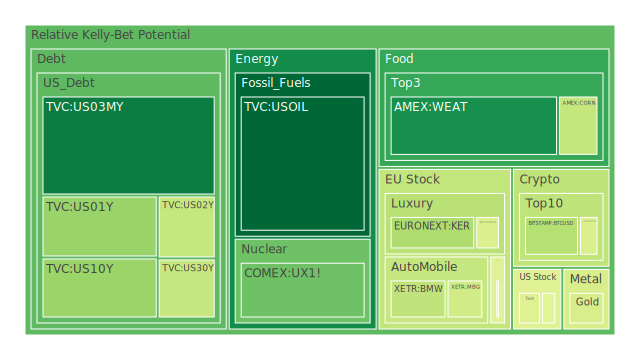
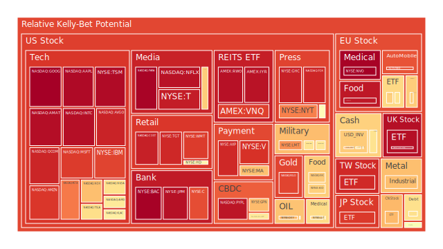
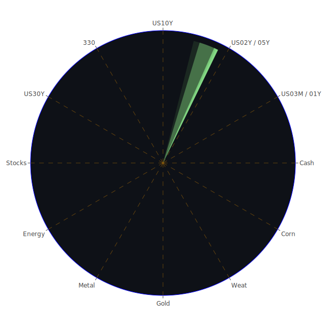

# 一、投資商品泡沫分析

以下針對常見的主要資產類別，逐一從經濟學、社會學、心理學以及博弈論等角度，輔以部分新聞與歷史場景的回顧，進行初步的風險評估與泡沫跡象分析。所謂的「泡沫」，在此並不一定指價格必然即將下跌，而是暗示若市場風向一變，有可能引發連鎖反應的潛在風險。

## 1. 美國國債（US10Y、US02Y、US03MY、US30Y等）
美國國債收益率近來雖然一度走高，但近期數據顯示利率曲線的高點並未持續升溫，尤其US10Y、US02Y、US03MY之間的利差正逐漸縮小。新聞多次提及關稅、貿易衝突與通膨調控仍是壓力所在，加上聯準會（FED）資產負債表縮減與市場對於未來經濟放緩的預期，短端利率（如US02Y、US03MY）在歷史上曾有幾次因緊縮預期而飆高，但若景氣轉向衰退，長端利率（如US10Y、US30Y）反而可能下行。  
從社會學與心理學角度來看，美國國債是風險資產動盪時的避風港，多數投資人仍將其視為世界最重要的安全資產之一；然而一旦市場對美國政府舉債上限或財政政策失去信心，就可能引發流動性緊繃。博弈論看來，投資人通常在不確定性升高時湧向國債，但一旦聯準會貨幣政策立場持續收緊或市場在恐慌時出現「賣掉一切換現金」的現象，國債價格也不保絕對的防禦優勢。因此，長期雖相對穩定，短期若爆發劇烈債市調整，也不可小覷其傳染性。

## 2. 美國零售股
受到近期新聞「Best Buy預期消費者需求下滑」以及「Kroger執行長意外辭職」等的影響，市場擔憂美國內需動能放緩。經濟學角度，零售銷售數據是觀察消費者信心和整體景氣的重要指標，而通膨壓力、利率上揚可能打擊消費意願。社會學層面，消費模式正快速轉向網路平台與宅配業務，傳統零售若無良好數位化策略，競爭力恐被淘汰。歷史上，美國零售業亦數度因電商興起與高通膨衝擊而經歷洗牌；心理學則顯示一旦消費者信心受到新聞負面因素影響，往往會引發「自我實現」般的消費緊縮。整體來說，零售類股若無重大利多振興（例如大規模財政補助、稅改紅利），短線可能持續疲軟，需留意潛在的泡沫風險尤其在某些門店擴張過度的企業。

## 3. 美國科技股
科技股一直是市場風向標，包含軟體龍頭、AI相關企業，以及半導體大廠。新聞報導「Nvidia支援的雲端新創IPO」與「Intel研發AI晶片技術得到合作夥伴關注」等均對板塊帶來利多。經濟學觀點看，科技創新往往同時伴隨資本的大量湧入與高估值。社會學層面，市場對「下一個爆點」的群體性追捧使得科技股估值循環反覆出現。歷史回顧2000年網路泡沫、2021年小型科技股瘋漲，均顯示投資人對「成長故事」抱持過度樂觀時，易出現估值脫節。博弈論來看，競爭者若同時都想在新技術領域卡位，容易產生激烈燒錢戰。  
因此，當前科技板塊中仍有相當機會，但同樣潛藏泡沫因子：部份高成長概念股在利率上行周期下，現金流折現後的估值難有進一步空間，一旦業績不如預期，估值砍半的速度可能極快。

## 4. 美國房地產指數
固定房貸利率一度升至7%左右，近期略微回落至6.76上下，但與疫情初期3%出頭的超低利率相比，購屋成本仍然高出許多。新聞提及「美國小型企業就業削減」及「NYC財政狀況惡化」等，顯示部分地區的商業不動產與高階住宅市場壓力增強。歷史上，美國房市在2008年次貸危機中出現過一波大幅下探；今日雖有較多風控措施，但若房貸壞帳再度攀升，可能又引發流動性問題。心理層面，美國人對房地產仍具高度情感連結，視其為長期資產，但若經濟衰退信號出現，大眾或將選擇削減房地產投資或二手房需求，房地產指數可能面臨長期回調壓力。

## 5. 加密貨幣（BTC、ETH、DOGE等）
部分新聞顯示「Bitcoin一度上漲6%，但也有報導指出美國宣稱欲涉入市場監管或發行官方數位貨幣」、「Crypto股和Bitcoin出現回落」等反覆消息，可見該領域多空交戰激烈。歷史上，比特幣在2021至2022年曾經歷多次狂漲狂跌。市場在高通膨時期常將其視為對沖資產，但當監管壓力升溫或金融機構大幅減少資金配置時，加密市場亦會迅速降溫。社會與心理層面，加密貨幣社群狂熱時常推動價格飆漲，但也最怕監管阻力。近期來看，投資者仍需警惕虛擬幣市場流動性與槓桿風險，稍不慎便可能爆發劇烈修正。

## 6. 金／銀／銅
金銀銅等貴金屬、工業金屬常被視作通膨對沖、或經濟週期轉折的領先指標。新聞提到「金價近期因全球通膨與地緣政治壓力顯示上漲空間」，也提及「銅價受需求減弱影響出現波動」。歷史上，金價常在大幅寬鬆政策尾聲或恐慌情緒高漲時飆升；銀除了貴金屬屬性外，也跟工業需求緊密相關，波動幅度相對更大；銅則與全球製造業景氣息息相關，是所謂「博士級金屬」。在社會心理面，金常被視為終極保值之選，但若市場資金短缺或美元走強，也會出現獲利了結和金價下跌的場景。

## 7. 黃豆／小麥／玉米
近期新聞提到「美國可能對食品類入口加課關稅」，市場擔心玉米、大豆等農產品價格被擾動。若國際地緣衝突或氣候異常（如颱風、乾旱）影響產量，價格也易飆升。社會學層面，糧食價格直接影響民生與政治穩定，政府可能出台補貼或進口管制。回顧2008年全球糧食危機，突發的供需失衡便曾引起多國糧價翻倍。這些大宗農產品雖屬剛性需求，但在金融市場中亦被視為相對分散風險的管道之一，值得注意的是：若期貨市場投機力道太強，亦可能催生短期泡沫。

## 8. 石油／鈾期貨UX!
油價近期於70美元上下震盪，但新聞報導「OPEC+終於決定增產」、「石油市場供給或因地緣衝突再度縮減」之類訊息反覆出現，給予油價極大的不確定性。若宏觀經濟轉弱，則能源需求下滑，油價易受壓。反之，地緣動盪或產油國突發減產，價格又能迅速飆漲。鈾期貨（UX!）則更多地與核能發電未來政策前景關聯，若全球持續重視減碳，核能發電或見反彈需求。歷史經驗顯示，能源價格泡沫常伴隨投機交易集中，若金融市場對能源股與相關期貨同時槓桿過度，一旦方向改變則可能大幅修正。

## 9. 各國外匯市場
美元指數在2023、2024年間曾經歷大幅波動，目前市場上對「美元霸權是否動搖」有不少討論。新聞裡不斷提到「特朗普政府擬再次祭出關稅」「多國央行可能介入外匯市場」等。澳幣、歐元、日圓等匯率都可能跟隨該國貨幣政策與出口情況而劇烈波動。歷史上多次出現亞洲金融風暴、歐債危機等事件，皆顯示匯率市場牽動全球投資者情緒。心理學面向：投資人大多對外匯變動反應敏感，因槓桿交易隨時可能放大損益。

## 10. 各國大盤指數
如歐美主要大盤（如S&P 500、NASDAQ 100、FTSE、GDAXI、FCHI等）以及亞洲主要指數（如JPN225、上證300等），往往代表市場整體風險胃納程度。近期新聞顯示「美國關稅再起」「歐洲因烏克蘭局勢向更多國家尋求能源保障」等，都可能影響企業獲利預期。回顧1997年亞洲金融風暴、2008年金融海嘯、2020年疫情初爆等，皆證明大盤指數可以在短時間內重挫數成，期間若槓桿或融資餘額高企，就更易助長泡沫破裂的風險。

## 11. 美國半導體股
Nvidia、AMD、Intel等為主的半導體企業常被視為全球科技產業的核心關鍵。新聞指出「Nvidia與新創雲端業者合作IPO」、「Intel嘗試發展AI晶片技術」，市場期望高成長。但該行業在週期性方面相當顯著，當終端需求下滑，庫存累積過多，就可能引發價格競爭。歷史上半導體景氣循環大約2-4年一個周期，投資人需留意市場情緒亢奮時是否忽略了景氣反轉風險。

## 12. 美國銀行股
銀行股與利率變動密切相關。新聞顯示「美國小企業削減就業」「消費者信用卡壞帳率上升」，若經濟放緩，銀行放貸業務就面臨挑戰。回顧2008年金融危機，銀行槓桿與壞帳是引爆危機的起點。社會與心理學角度，對銀行的信心一旦瓦解，可能迅速引發擠兌風潮。儘管現行監管較為嚴格，但若資本市場波動加大，銀行股仍可能成為市場調整的第一波反應對象。

## 13. 美國軍工股
軍工企業在地緣政治升溫時往往受到追捧，但一旦衝突局勢降溫或預算削減，就可能失去成長動能。新聞提到「歐洲領導人擴大協防烏克蘭」等，對美國軍工供應鏈可能是一大利好。但歷史上當主要衝突告一段落，軍工股可能出現回跌。投資人若過度追捧，也可能在談判或停火消息一出時遭遇獲利了結的賣壓。

## 14. 美國電子支付股
隨著數位交易普及，V、MA、PYPL等電子支付公司發展迅速。但新聞也顯示「消費放緩」「零售業疲弱」等風險，可能拖累交易量。回顧電商浪潮初起時，電子支付股也曾因手續費與競爭者增多而獲利不如預期。心理學層面，許多投資人將電子支付視為長期大趨勢，但估值若在短期被推向極端高檔，需留意回調風險。

## 15. 美國藥商股
美國藥商，如MRK、JNJ、LLY等，長期以來被視為防禦型標的。但是新聞指出「醫藥支出政策存變數」「消費者支出壓力擴大」，使醫藥板塊可能無法完全脫身。如果出現新藥臨床試驗失敗或藥價管制趨嚴，也會壓抑整體表現。歷史經驗顯示，藥企受法規與研究成功率大幅影響，一旦市場對研發前景過度樂觀，漲勢亦可能演變為泡沫。

## 16. 美國影視股
影視內容供應商面臨「串流平台高度競爭」「廣告市場景氣」等因素。近期新聞顯示某些影視串流平台用戶成長放緩、競爭加劇，導致投資人憂慮營收前景。歷史上，傳統媒體企業在數位化衝擊中已有不少退場案例。投資人若只憑過去影視公司在家用娛樂市場的輝煌績效，就易忽視新時代競爭者的威脅。

## 17. 美國媒體股
廣告市場走弱、美國政治情勢多變，對媒體公司營收形成雙重挑戰。若景氣轉差，廣告主縮減預算最為直接，媒體股同樣面臨壓力。再者，新型社群媒體興起搶佔年輕族群注意力，傳統媒體若轉型不及，易有估值泡沫化可能。

## 18. 石油防禦股
石油產業鏈上游公司在油價上漲時利潤可觀，但市場早已見識到油價急轉直下的風險。近期雖有產量調整議題，但國際政治、OPEC協議等隨時可能改變供給。石油防禦性標的常被視為相對穩定，然而一旦需求預期下修或替代能源轉強，也可能面臨結構性壓力。

## 19. 金礦防禦股
金價上升通常帶動金礦股表現，但挖礦成本、礦區政治風險都會影響獲利。尤其礦企業績對金價的反應常被放大，若金價出現回落，金礦股跌幅往往更劇烈。歷史回顧金礦股在金價高點時常被資金瘋買，但一旦金價回調，容易見到市值蒸發相當顯著。

## 20. 歐洲奢侈品股
歐洲奢侈品商如KER、MC、RMS等，在經濟繁榮時往往成交亮眼，但若全球需求放緩，其高價市場可能萎縮。新聞顯示「中國市場合併趨勢與AI投資興起」或「歐洲旅遊業尚未全面回溫」，都可能影響奢侈品購買力。投資人在經濟學理論下通常視奢侈品為高所得彈性產品，故在景氣好時股價飆升得快，衰退時也跌得重。

## 21. 歐洲汽車股
如BMW、MBG等德系車廠，近年面臨電動化轉型、全球供應鏈不穩定等挑戰。新聞提及「德國就業市場壓力」「罷工」與「電動車市需求分散」等因素，可能導致投資成本與利潤率同時受影響。歷史上，車企景氣週期亦相當明顯，若景氣下行，銷售便會縮減，累積庫存加速壓力，也會導致股價泡沫破滅風險。

## 22. 歐美食品股
可口可樂、KHC等企業在日常消費品領域占據龍頭。但新聞顯示「關稅衝擊導致原料成本波動」與「消費者支出減少」等，可能壓縮利潤。歷史案例顯示，食品類股雖偏防禦性，但估值過高時也會出現泡沫隱憂，一旦通膨過高或關稅上漲，企業毛利將面臨縮水。

---

# 二、宏觀經濟傳導路徑分析

在Spatial（空間）層面，美國關稅政策升溫、歐洲與亞洲在能源和地緣議題上的動盪，皆形成全球資本流向轉折。外部衝擊往往使投資人同時關注美國國債與美元流動性，進而影響匯率與大宗商品價格。各國大盤指數受到國際資金移動左右，呈現出區域間連動性愈發強烈的趨勢。

在Temporal（時間）層面，聯準會釋放縮表訊號的時間點、貿易摩擦升級或緩和的時序，都會左右投資氛圍。假設在某時點關稅大幅提高，可能先衝擊相關進出口產業，接著傳遞到整體供應鏈，最終影響就業市場與消費信心。在時間軸上，短期或許見到通膨數據高企，但若長期經濟放緩，則可能看到利率走低、國債需求增加、風險性資產價格出現修正。

在Conceptional（概念）層面，市場對「去全球化」或「區域合作」等概念的詮釋，往往左右投資人對未來世界經濟秩序的判斷。近年盛行的ESG、AI、新能源技術等主題，也將形成投資趨勢的催化劑。若投資者對其中任一概念的預期過度樂觀，而該技術或政策最終成效不及預期，就會出現「概念泡沫」的破裂風險。

綜合正反合的思考：  
- 正面：許多產業在新科技與全球合作下仍有成長潛力，尤其是AI、半導體、奢侈品在某些區域仍具擴張空間。  
- 反面：關稅政策升溫、地緣衝突等不確定性，使市場高度波動，泡沫風險並未消失，尤其在槓桿資金活躍的領域。  
- 綜合：不同行業與資產之間因關聯度與階段性需求不同，會呈現錯峰或錯位波動，投資人若能抓準產業週期與風險對沖配置，仍有機會把握收益。

---

# 三、微觀經濟傳導路徑分析

在企業層次，零售、製造、科技等行業最先感受到成本與需求的變動。若關稅升高，材料或零件成本攀升，企業毛利遭壓縮，若購買力下滑，零售端又不易把成本完全轉嫁消費者。部份企業若信用壓力大增，可能向銀行申請更多貸款，若銀行整體風險偏好降低，企業就面臨融資困難或利率高企，加劇經營壓力。若這類壓力蔓延到金融體系，整體市場流動性將收縮，可能使投資者拋售風險資產，再推升避險資產如黃金、國債之價格。其邏輯鏈：  
1. 關稅與供應鏈干擾 →  
2. 原物料與零部件成本增加 →  
3. 企業毛利壓縮、消費需求萎縮 →  
4. 銀行信貸壓力提升 →  
5. 金融體系對風險資產定價轉為保守 →  
6. 投資人轉進防禦標的或現金 →  
7. 全面風險偏好下降，泡沫性標的最先破裂。

---

# 四、資產類別間傳導路徑分析

不同資產間的「漣漪效應」主要透過資金流動、槓桿機制、情緒傳染，以及避險需求等管道傳導。例如：  
- 當加密貨幣價格快速下挫，高槓桿投資人被迫平倉，連帶拋售手中的科技股或其他資產，導致科技板塊或高Beta資產跟著遭受賣壓。  
- 石油若因地緣政治飆漲，通膨壓力再度加劇，市場預期聯準會可能更鷹派，再推升國債收益率，壓制銀行股、房地產市場；同時金銀可能因避險情緒重新受追捧。  
- 若歐洲奢侈品股出現獲利下滑跡象，顯示全球高端消費力道不振，投資人也可能預期其他與高端消費相關的高價科技品牌銷售下滑，而開始調整資金部位。  
- 若銀行股先暴跌，市場對金融體系失去信心，連帶影響整體股市走勢，甚至促使投資人拋售其他週期股或投向現金與金礦股等防禦。

透過三位一體的兩兩相互驗證（Spatial、Temporal、Conceptional），投資人可留意：  
1. 地區（Spatial）衝擊：例如某區域貿易戰升溫，會先影響該區域相關商品，漸漸牽動全球資金流向。  
2. 時序（Temporal）層次：政策落地或企業財報發布的先後時點，往往是行情分水嶺。  
3. 概念（Conceptional）衝擊：AI、ESG、區塊鏈等如成為市場主流話題，其對資金流與風險定價之影響不容小覷。

---

# 五、投資建議

根據上述多角度的資訊蒐集與對風險對沖機制的考量，建議打造分散投資的組合，並藉由資產間相位差約120度、相關係數約-0.5的概念，嘗試讓投資組合各標的的波動不至於同漲同跌，以期在市場劇烈震盪時仍能保持較為穩健的表現。

以下提出「穩健、成長、高風險」三大類配置，各自約佔一定比例，總和為100%。在每類之下各挑選三項子投資標的作為可能的配置案例（請注意，以下純屬假設性示範，非針對個別標的之買賣建議）：

1. **穩健型（合計40%）**  
   - 美國國債（US10Y或相近存續期）約15%：利用其相對穩定的特質，對沖經濟衰退風險  
   - 黃金（XAU）約15%：在通膨或系統性風險高漲時可提供避險  
   - 防禦型食品股（如可口可樂、KHC）約10%：因日常消費較不易被削減，股息相對穩定

2. **成長型（合計40%）**  
   - 半導體龍頭（如AMD或NVDA）約15%：看好AI、資料中心等長期需求  
   - 奢侈品股（如KER或RMS）約10%：若全球景氣維持一定水準，高端品牌在主要消費市場仍具潛力  
   - 綠能或核能概念（如鈾期貨UX!）約15%：伴隨全球減碳趨勢，可能帶來長期的需求成長

3. **高風險型（合計20%）**  
   - 加密貨幣（BTC或ETH）約5%：追求高波動、高報酬，但需謹慎控管風險  
   - 小型科技創新股（如某些正在進行IPO之雲端新創）約10%：承擔新技術失敗風險，博取超額成長收益  
   - 新興市場高收益債或外匯約5%：在穩健組合外加上一些對沖通膨或貨幣波動的布局

以上配置之比例僅供參考。投資人須視自身風險承受能力、資本規模、投資時程做動態調整。

---

# 六、風險提示

1. **泡沫風險**：  
   任一資產類別都可能因短期熱錢湧入與過度樂觀預期而導致估值與實際獲利脫節。一旦市場流動性反轉或消息面出現重大利空，泡沫勢必加速破滅。

2. **地緣政治與政策不確定性**：  
   如今各大國之間關稅戰升溫、地緣衝突不斷，加上貨幣政策走向不明朗，市場仍處於動盪狀態。任何一個突發事件都可能打破原有預期，造成劇烈波動。

3. **槓桿與流動性風險**：  
   企業或投資者利用槓桿放大報酬的同時，也放大了虧損。一旦流動性收縮，槓桿頭寸被迫平倉，連鎖賣壓可能引發大範圍的拋售。

4. **宏觀與微觀傳導效應**：  
   目前全球經濟雖未見全面衰退，但多項數據（如就業、利率曲線、銀行放貸意願等）出現疲態。若宏觀景氣不佳，企業營收下滑，最終會透過微觀路徑傳導至金融市場，成為下跌壓力來源。

5. **既有理論與新興趨勢的不匹配**：  
   部分新創技術或模式，可能在萌芽期即獲得資金瘋狂追捧，理論上支撐不足而估值過高。一旦無法實現預期成長，往往導致價格跳水。

---

在當前的多重動盪局面下，市場時刻充滿不確定性。投資者若能從空間（市場區域與地緣政治）、時間（政策與經濟數據發布時序）、概念（主題投資、理念衝擊）三個層面出發，運用正反合的辯證思維，多方衡量潛在風險與收益，就能在面對任何一種資產的「自然現象」時，更加鎮定自若。結合分散投資與風險對沖原則，並嚴格控管槓桿與流動性，或可在泡沫風險暗潮洶湧的市況中，尋得相對穩健的航道。

**投資有風險，市場總是充滿不確定性。我們的建議僅供參考，投資者應根據自身的風險承受能力和投資目標，做出獨立的投資決策。**

 
Daily Buy Map:

 
Daily Sell Map:

 
Daily Radar Chart:

 
