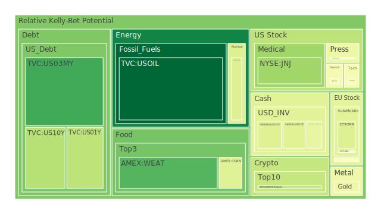
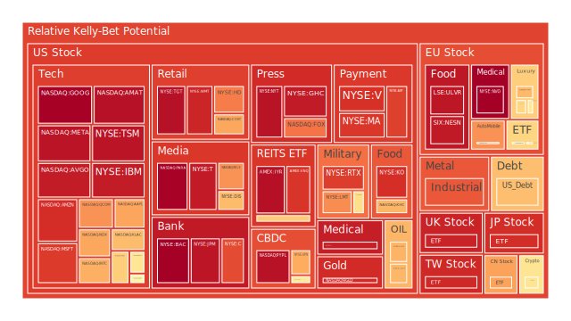
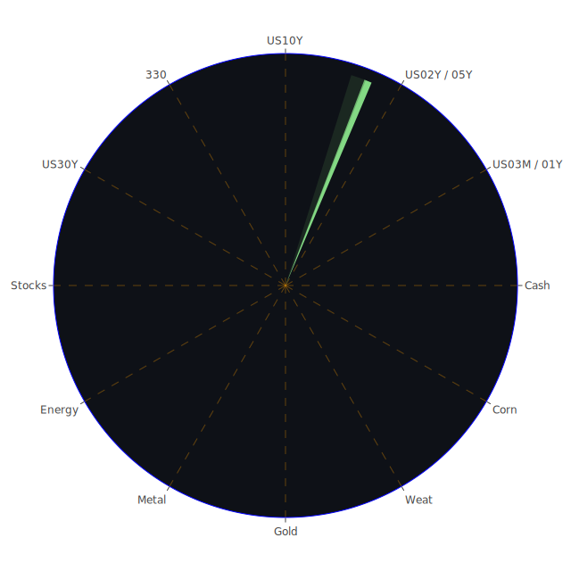

# 一、前言與整體背景

在過去數日（2025-03-04、2025-03-05、2025-03-06）裡，全球市場與媒體充斥許多關於關稅政策、地緣政治衝突、貨幣政策轉向以及科技產業格局變動的負面或正面新聞。從新聞角度來看，以美國對多國祭出關稅、各大企業財報預估不佳、部分科技股與零售股受關稅及需求變動而震盪等為主要焦點。在心理學層面，市場投資人對於「關稅衝擊」與「全球經濟放緩」之恐慌情緒明顯升溫，對避險資產（例如黃金、部分政府公債）的需求時升時降，同時又在種種關於科技轉型與地緣政治衝突的利空消息下呈現複雜波動。博弈論上，各國間的關稅與反制行為、企業之間的技術合作或競爭，都讓市場多空難以形成單一共識，導致劇烈震盪。

根據最新FED關鍵數據顯示，美國Fed總資產持續走低、RRP下降、EFFR交易量仍高、BTFP與Discount Window在相對低點、而FHLB也保持在較低水平，但聯準會儲備（FED Reserve）則相對高企，顯示銀行間流動性尚未走到極端匱乏的地步，惟局部市場仍出現信用風險。美國國債殖利率呈現部分段落倒掛修正，1年期和2年期利率從先前高點（在5%上下）下滑至約4.0%-4.1%水準，與10年期的4.28%之間利差較以往有所收斂，但依舊需要留意收益率曲線形狀不穩定帶來的預警信號。此外，美國30年期公債殖利率維持在4.57%上下，該數字亦與20年期（4.61%）差距不大，整體長短端利率的結構顯示市場對未來通膨預期與經濟增長仍有相當程度的存疑。

新聞消息面顯示，由於關稅與地緣政治的變動，許多企業的盈餘預估面臨較大壓力，如Best Buy、Ross Stores等零售業者對其全年營收與利潤預測趨向保守；類似地，科技股如Tesla在中國市場的銷售滑落、Marvell因未來展望不如預期而股價承壓，以及眾多新聞報導指向資本市場投資人對某些半導體與零售產業的需求疲軟深表憂心。另一方面，也有若干正面消息，如Nvidia背書的CoreWeave公司公開募股、BlackRock在運營碼頭等基礎建設領域的佈局，以及部份國家積極擴充在綠色能源與AI產業的投資，皆帶給市場一定程度的前瞻性發展憧憬。

從經濟學、社會學、心理學及博弈論的綜合觀察，當前市場狀態可視為一種「多重拉扯」：一方面，各國對關稅的討價還價呈現典型的博弈反覆；另一方面，投資人因恐慌心理而湧向避險資產的動能又會被新科技、AI產業併購與更多政策刺激的樂觀消息所抵消。此外，各國對出口與進口的依賴度、資源面臨的分配問題，使得社會對「全球供應鏈安全」的討論升溫，反映出社會學脈絡下對就業、通膨、民生經濟的懸念。心理層面更是在看到新聞負面面向集中在高達七到九成的負面比重（例如「Tesla在中國銷售下滑49%」、「關稅即將落地導致企業成本增加」等）後，驚慌情緒一度上升，但也同時出現轉向相對積極的觀點（例如「OPEC+終於決定增產」或「BlackRock積極在港口基礎建設投資」），讓投資群體不至於完全失去希望。整體來說，這樣的市場情緒與消息混雜，預示未來將持續出現多頭與空頭的激烈分歧。以下將從空間（Spatial）、時間（Temporal）、概念（Conceptional）三方向切入，將市場與新聞的三位一體展開論述，並進一步進行正反合的擬合。

---

# 二、空間（Spatial）的三位一體觀察：大膽假設與市場、新聞互動

1. **市場空間：**  
   - **經濟學觀點**：目前的全球市場在關稅壓力下有分化趨勢，一些國家或區域市場（如中國、歐洲）的製造業或科技製造鏈處於壓力之中，尤其汽車、半導體與零售股在市場分布與供應鏈中遭遇較多阻力。另一方面，美國國內的防禦性產業（如軍工股、醫藥股）則相對平穩。  
   - **社會學觀點**：新聞所揭示的各國民眾對當局在政策調整與對外關係之不滿、公司員工裁員的社會壓力，及保護主義抬頭的民粹浪潮，都在全球市場的空間中編織出對「長期穩定」的疑慮。  
   - **心理學與博弈論觀點**：空間維度的互動顯示，各國政府與企業皆對外部衝擊展開策略性應對，包括關稅反制、產能遷移、研發新技術等。投資人則在面對新聞的負面情緒襲擊時，短期會有傾向拋售高風險資產並佈局美國公債或黃金的情形；但又因AI、芯片、高速運算等題材的熱度，對科技成長股抱持反覆試探的投資態度。  

在空間層面來看，我們可做出大膽假設：全球供應鏈分流並非暫時，而是由於各國關稅與地緣摩擦的常態化政策所致，企業將更深度地將生產據點或市場布局轉向其他區域，如越南、印度等國家。此舉意味著未來若任何一塊地區因戰爭、疫情或政治風波而受阻，那麼另一塊區域就有機會攫取市佔；這種「空間博弈」的結果在中長期可能拉高某些半導體廠或製造業廠商的市值，但也可能使當地的內需與房地產領域泡沫風險上升。

---

# 三、時間（Temporal）的三位一體觀察：大膽假設與市場、新聞互動

1. **市場時間：**  
   - **經濟學觀點**：依據各資產泡沫分數（如D1、D7、D14、D30），可見部分資產的即時（D1）風險評分相對較高，但在長週期的D30卻相對平緩，如美國短年期公債的近期風險評分較前一週略降，暗示市場對短期通膨預期或是聯準會升息步調有所緩和。  
   - **社會學觀點**：從新聞看出，社會輿論對於企業裁員與關稅造成生活成本上揚的情緒，在短期迅速累積，若中長期的政治與外交關係未能緩解，則這些民眾抗議或社會不滿情緒恐在未來幾個月甚至更久產生更多不可預測的後果。  
   - **心理學與博弈論觀點**：時間維度下，投資人短期因新聞一次性衝擊而出現恐慌性拋售與避險湧入，但隨著時間拉長，注意力可能逐漸轉移至央行政策與企業財報的實質結果上。對此，博弈論或許暗示「若各國政府在一段時間內並未顯示真正的激進對抗，市場恐慌可能放緩；但若新一輪報復性關稅或地緣衝突浮現，恐慌便會再次上升」，如此造成時序上的反覆與動盪。  

基於時間軸上的大膽假設：未來三至六個月內，各國對關稅與金融政策的調整可能陷入「拖延與慢動作磋商」的狀態，讓短期市場維持高波動。而若此僵局無法在半年內舒緩，長期投資人或將移轉至更偏長期的資產（如長期公債、黃金、防禦型股票）避險；同時，一旦市場對關稅常態化的認識趨於理性、或者出現新一波寬鬆政策支撐，成長型科技股也可能趁低點重新吸引資金。

---

# 四、概念（Conceptional）的三位一體觀察：大膽假設與市場、新聞互動

1. **市場概念：**  
   - **經濟學觀點**：關稅最初或許是政治工具，但對市場來說則影響到成本結構、邊際利潤以及跨境資本流動。若全球都處於高關稅環境，物價與通膨可能受到推升，而市場的利率走勢、企業信用風險也將被重新定義。  
   - **社會學觀點**：各國政治人物透過概念塑造如「保護本土勞工」、「增進國家利益」，進而獲得民意支持，但若國際供應鏈斷裂後導致更嚴重的民生成本飆漲，社會認知也可能產生反轉，轉而痛斥政府決策失當。  
   - **心理學與博弈論觀點**：從概念層面觀之，對投資人的「敘事框架」一旦形成，很可能在市場情緒中發酵；譬如，若「去全球化」成為社會主流敘事，那麼對跨國企業的評價與長期預期將顯著改變；若「逆風轉型」成為共識，則投資焦點將轉向具備自有品牌與內需市場者。  

概念層面的大膽假設為：投資人對「關稅和去全球化」的概念興起後，可能衍生出全新類股或投資標的，如區域型供應鏈、高階AI本土化、高速計算晶片在各國境內製造等。若後續出現能進一步刺激經濟且避免社會衝突的政策，市場可能給予高度正向反應；反之，若新聞不斷醞釀對新一輪貿易衝擊的恐懼，則概念性的信心將崩解、泡沫易迅速破裂。

---

# 五、三位一體正反合的精簡整理

綜合上述空間、時間、概念三位一體的正反合，可歸納如下：

- **正面（ Thesis ）**：科技、AI、綠色能源等長期趨勢依舊強勁，OPEC+增產、各國財政與貨幣政策或有轉圜餘地；同時，區域市場的興起讓新興國家獲得更多商機。
- **反面（ Antithesis ）**：關稅與地緣衝突將拉高企業成本、抑制國際貿易，導致消費疲軟、企業獲利能力下滑，並且社會不滿與政治動盪可能提升經濟不確定性。
- **綜合（ Synthesis ）**：在不斷反覆的博弈中，市場可能呈現區塊化、極化，資本將往穩定且具技術優勢或內需保護的區域與產業聚集。而投資情緒將短期內持續波動，長期則視各國政策妥協或新產業突破為方向。

---

# 六、風險對沖的投資組合機會與相位（120度、相關係數約-0.5）概述

在三位一體的脈絡下，若我們要尋求互相對沖且在波動市況中盡量達到中度負相關（約-0.5）與相位差120度的配置，可考慮以下投資組合機會：

1. **避險債券 vs. 成長科技**：  
   - 美國國債（長短混合）與高科技成長股在特定情境下呈現負相關性。當市場恐慌時，美債往往成為資金避風港；當市場信心回溫，資金又流向成長股。若能適度在時間軸上切換比重，或同時持有兩者做動態調整，理論上能對沖部分波動。
2. **貴金屬 vs. 能源**：  
   - 金銀等貴金屬在市場恐慌或通膨預期增強時有上漲驅動；而石油、天然氣等能源商品當經濟成長強勁或地緣衝突擴大時也會波動。兩者雖並非絕對負相關，但常在資金風險偏好變動時表現逆勢。
3. **防禦消費 vs. 高Beta週期股**：  
   - 防禦型消費（必需品、醫藥、公共事業）在經濟衰退或不確定時相對穩定；週期性較高的汽車、零售、旅遊等在景氣熱絡時反應更大，兩者的漲跌常呈互補或反向，亦可做階段性配置。
4. **加密貨幣 vs. 外匯**：  
   - 部分加密貨幣（如BTC、ETH）在投資人追求超高風險與回報時表現亮麗，但一旦流動性收縮或監管趨嚴，通常大幅回落；而主要外匯貨幣（如美元對歐元、日圓等）可能在金融市場動盪中有不同方向的震盪，具一定對沖效果。
5. **新興市場股債 vs. 黃金**：  
   - 新興市場往往波動較大，但若該區域沒有受到直接衝擊、資金趨勢向外國投資流入，則報酬相對可觀；然而風險也更高，故以黃金或其他防禦資產做一定配置，能在大動盪時分擔風險。

透過觀察各類資產在不同新聞與市場脈動下的表現、泡沫分數D1至D30變化情形，我們可挑選彼此分散度較高、相關性不強（甚至略帶負相關）而同時具有中長期潛力的標的，以期達到較佳的風險對沖。

---

# 七、兩兩相互驗證之三位一體篩選假設分析

為進一步讓上述對沖假設更具體，我們可將各資產的三位一體結合在一起，並以兩兩相互驗證的方式，歸納出合情合理之假設：  

1. **美國國債 vs. 黃金**：  
   - 在空間面（Spatial）上，美國國債主要影響力在美國市場與資金全球流動；黃金則相對不限地域且具全球避險功能。兩者在恐慌時或利率轉趨寬鬆時往往同時上漲；但若市場預期經濟將穩定復甦並追求更高報酬，又會將資金移出，故短期波動中他們有潛在的互補關係。  
   - 在時間面（Temporal）上，若聯準會態度鷹派或市場對升息預期增强，美國國債的殖利率可能上升（價格下跌）；黃金則因美元升值壓力而表現較不穩。然一旦市場風向改變，美債與黃金可能再次同步成為避險去處。  
   - 在概念面（Conceptional）上，美國國債自帶「國家信用」的背書，而黃金則是「資本最終保值」的象徵。兩者存在一定程度的正向關聯性，但因購買力與通膨情境會影響黃金表現、而利率環境會影響美債價格，兩者又並非完全同向。這種半同向、半對立的關係，正能提供一定程度的對沖空間。

2. **美國科技股 vs. 石油或金屬商品**：  
   - 在空間面，科技股集中於美國本土以及全球化市場；石油及金屬則與全球能源與製造需求密切。當新一波科技創新帶來投資熱潮時，原料需求同樣可能被推升，但若關稅或政治衝突扼殺國際貿易，原料需求減弱，而科技公司亦可能受到衝擊。然而，短期波動裡往往先看到商品價格的翻轉，後續才看到科技股反應。  
   - 在時間面，科技股可能在財報季或新聞利多時迅速飆升；石油或金屬價格波動則受地緣政治、OPEC+產量等因素影響，較易在突發新聞後立即上下激烈動盪。一長一短的節奏差，能形成投資組合的時序對沖。  
   - 在概念面，科技與能源皆為全球經濟支柱；科技象徵未來創新與生產力提升，能源則象徵生產活動的基礎。若市場預期「經濟擴張」且「技術革新」並進，兩者可能同向上揚；若市場預期「全球經濟放緩」且「政治風險上升」，兩者或同步下跌，但在幅度與時間點上仍有差異。

3. **加密貨幣 vs. 傳統金融股（銀行、保險等）**：  
   - 空間面：加密貨幣跨越國界、受網路通行的全球性影響；銀行及保險則受較多本國或區域監管與利率政策影響。  
   - 時間面：加密貨幣的波動往往來得快且烈，傳統金融股的波動相對緩慢且受銀行獲利週期驅動。這兩者的時序差異能對沖短中期市場風險。  
   - 概念面：一者是去中心化的金融創新代表，另一者是中心化的金融穩定體系。當監管打壓加密貨幣時，銀行股或許受惠於對法定金融體系的信任；若市場趨向數位化與信心高漲，加密貨幣或再度爆發。  

透過類似此種兩兩交叉的三位一體檢驗，可評估多組資產配置間的合理假設。若能確立約莫-0.5的相關係數，同時又能在空間、時間、概念三面向形成風險分散，則該配置對極端市場情況之緩衝能力可能較強。

---

# 八、主要資產之泡沫風險分析

以下將依照多種資產類別，分別給出概述性的泡沫分析，並引用部分新聞與歷史場景進行觀察視角補充。請注意其中的「PP100」或「泡沫分數D1/D7/D14/D30」皆僅供參考，分數越高意味著潛在風險越高，並不代表必然崩盤或絕對牛市。

## 1. 美國國債
美國國債短年期利率自5%區間回落到4%上下，10年期則維持在4.28%，30年期約4.57%。新聞面顯示投資人對「短期衰退風險下降」與「通膨或被壓抑」有些許期待，FED最新數據中顯示EFFR交易量仍在高點，但利率維持偏高水準。歷史上，每當市場預期進入降息週期時，美國國債價格可能飆升；反之，若通膨重新抬頭或FED重新轉鷹派，都會對債券造成壓力。當前泡沫風險屬中度，因若市場大幅擔憂經濟衰退便會湧入美債，但一旦避險情緒退卻，長債價格可能回調。

## 2. 美國零售股
過去幾日新聞頻頻提及Best Buy、Ross Stores等零售商預期因關稅與消費疲軟而下修全年營收，顯示通路端需求不振。回顧2008年金融危機時，零售股曾因消費力驟降而暴跌；2020年疫情初期部分零售股也先跌後漲。現今關稅與通膨疊加，對成本與銷售造成壓力，若後續就業市場惡化，零售股恐持續走弱。泡沫風險不算極高，但基本面下行壓力加大，投資人須謹慎。

## 3. 美國科技股
Tesla中國市場銷售下滑、Marvell及其他半導體股因未來展望不明朗，造成部分科技股波動。然而亦有Nvidia、BlackRock等正面消息。歷史上，2000年網路泡沫告訴我們，科技股過熱容易在估值過高時破裂；但同時，也有許多投資人將AI視為未來十年的革新主題。D1、D7、D14、D30泡沫分數普遍偏高，顯示市場對此類股仍帶有炒作成分，一旦資金面緊縮或實際營收不及預期，可能面臨較劇烈修正。

## 4. 美國房地產指數
根據新聞與FED資料，房貸利率約6.76%，比一年前大幅走高。部分地區房價漲勢逐漸趨緩，但由於就業市場尚算穩定，尚未見到斷崖式下跌。回顧2008年時的次貸危機，房地產泡沫是由高槓桿與次級貸大量違約導致；如今若利率持續高檔且就業狀況不佳，則房地產需求恐緩跌。從泡沫分數觀之，不少房地產ETF或指數(D1至D30)呈中高水位，屬於需要密切留意的狀態。

## 5. 加密貨幣
新聞中多次提及DOGE、BTC在馬斯克動向或監管風向下劇烈波動，而ETH等主要幣也因投資人對未來風險規避而可能震盪加劇。歷史上，加密貨幣動輒在短時間內暴漲暴跌，反映全球投機與流動性變化。近期中國市場對該領域交易也較為冷淡，如同曾經多次上演的監管風波，若監管態度突然轉向嚴厲，價格可能急挫。泡沫分數相對較高的時候，宜謹慎。

## 6. 金／銀／銅
根據最新行情，金價因避險需求反覆且美元走勢不穩而震盪；銀則大致跟隨金價方向，但波動更大；銅作為工業金屬，在貿易衝突與需求疲軟時受到壓抑，但若中國需求出現回溫跡象時又可能反彈。歷史上金價大漲常與金融或地緣危機伴隨；白銀具備投機特性而價格彈性更強；銅則常被視為「經濟指標」。觀測泡沫風險時，金銀常是資金避險象徵，但當前分數顯示部位仍偏高，或有波動風險。

## 7. 黃豆／小麥／玉米
農產品期貨受天候、地緣、關稅影響度極高。新聞顯示美國對進口農產品課徵關稅的威脅，可能引發對國際糧價的擔憂。回想2010-2011年的全球糧食危機，小麥與玉米都曾因俄羅斯與中東局勢而大漲。若情勢惡化，農產品恐重蹈漲勢。但若天候因素良好或談判釋出利多，也有回跌空間。泡沫風險現階段屬中性，惟關注地緣與天災變動。

## 8. 石油／鈾期貨UX!
石油價格接近六個月低點，一部分因需求預期減弱與OPEC+增產信號，以及市場對全球衰退的疑慮。過往歷史如2014年石油崩跌和2020年疫情期間的負油價慘劇，都說明若需求端萎縮，石油極易產生大幅波動。鈾期貨UX!則相對受核能發展政策、地緣政治影響。雖然有國家積極發展核能，但一旦政治情勢不穩或核能議題引發爭議，也可能動搖鈾價。泡沫分數提示風險仍存，需審慎。

## 9. 各國外匯市場
根據新聞與FED資料，美元利率趨勢可能放緩升息腳步，歐元區則有ECB可能再度降息或寬鬆的消息，日圓也因日本當局可能干預匯率而變得波動。歷史上，外匯市場常牽動全球貿易與資本流動，如1997年亞洲金融風暴因貨幣大幅貶值，導致股債雙殺。當前若關稅戰延燒，貨幣互競貶值風險將提升。泡沫風險主要在於短線對沖基金大舉進出，投資人要有快速應變的流動性。

## 10. 各國大盤指數
近期新聞顯示歐美與亞洲主要大盤出現不同程度回調，S&P 500、道瓊、NASDAQ指數都出現三日內大幅下跌。歐洲如德國DAX、法國CAC40、英國FTSE也受地緣與經濟放緩衝擊。歷史上，2000年與2008年兩次大盤大跌都曾在相對樂觀的情境下突然崩塌；現今關稅與政治不確定性若再結合企業獲利下滑，恐陷入多頭結束的噩夢。泡沫風險雖未極度飆升，但已在高檔，需要嚴密監控。

## 11. 美國半導體股
Nvidia、AMD、Intel、Micron等近期新聞消息繁多，如Nvidia積極投資雲端與AI、Tesla的半導體訂單轉單疑慮、國際關稅對供應鏈的牽制等。2000年網路泡沫與2008年金融風暴都曾重創半導體業，但往往在下一輪科技週期又獲得爆發式成長。當前泡沫分數顯示高風險水平，需留意全球景氣若不佳，對出貨量與晶圓代工需求的打擊。

## 12. 美國銀行股
新聞顯示部分銀行（如COF、JPM等）可能因壞帳與高利率環境面臨獲利壓力，同時也涉及對中小企業貸款放緩。歷史上，2008年銀行股在金融海嘯中首當其衝；之後的量化寬鬆週期使銀行信貸活絡，股價回溫。現今若經濟降溫或信用風險升高，銀行股易遇阻。泡沫分數顯示有些銀行股估值偏高，但市場對其盈餘仍有期待，屬高不確定性。

## 13. 美國軍工股
軍工股（RTX、LMT、NOC等）因國際衝突與美國國防預算增加而具防禦性特質。歷史案例顯示，地緣政治緊張時此類股往往逆勢抗跌，但若國際局勢緩和或預算轉向民生領域，軍工股也可能回調。當前關稅戰與區域紛爭雖多，但尚未全面爆發大規模衝突；軍工股泡沫分數偏高，顯示部分投資人有炒作預期，需提防一旦和平訊息加大，股價迅速回落。

## 14. 美國電子支付股
如Visa、Mastercard、PayPal等。疫情後的數位支付需求提升，一度大漲，但在關稅與跨境交易減少等因子下可能承受壓力。歷史上，電子支付領域呈穩步擴張，幾度回檔多半是因法規或大型經濟波動。D1與D7泡沫分數都較高，代表短線交易情緒濃厚，若消費下滑，收單量恐下行，預期波動仍偏高。

## 15. 美國藥商股
藥品、疫苗與醫療保健市場在任何經濟形勢都具剛性需求。然而，新聞提及部分醫藥股財報預估不如預期，表示研發成本或銷售進度受限。回顧2000年與2008年，醫藥股也曾在大盤修正中維持相對抗跌，但估值太高時亦面臨回檔。當前泡沫風險屬中等，應持續關注專利、政策補助與FDA審批等重要新聞。

## 16. 美國影視股
Disney宣佈裁員6%，表示其娛樂與新聞部門受到整合衝擊。歷史來看，消費者在經濟不佳時往往削減娛樂支出，但串流平台也帶來另一波挑戰。疫情期間曾帶來爆發，但現今關稅衝擊、廣告營收減退等因素，都可能壓抑該產業。泡沫分數顯示其股價雖經歷回調，但仍不可小覷進一步下跌風險。

## 17. 美國媒體股
新聞中常提及NYT、FOX、CMCSA等媒體公司，有的面臨傳統紙媒衰退，有的轉型數位串流仍在過程中。歷史昭示媒體股易受到廣告市場景氣影響，若經濟放緩，廣告預算縮水，股價亦遭連動。當前泡沫風險中等偏高，投資人須留意財報對廣告業務指標之釋放訊號。

## 18. 石油防禦股
如XOM、OXY等，本報告將其歸納為「石油產業中具相對防禦性的公司」，通過上游勘探與下游銷售的多元化降低風險。新聞中顯示油價走低對這些公司毛利有所壓縮，但若經濟衰退，其他風險資產的跌幅或大於此類公司。歷史上，2008年油價大跌時，部分石油巨頭也跟著重挫，只是跌幅較獨立頁岩油商稍微緩和。泡沫分數屬中高，因股價已累積漲幅，須留意空間有限。

## 19. 金礦防禦股
金礦股同時結合貴金屬與礦業特性，常在金價走高時有槓桿放大效應。當市場避險情緒熾烈時，金礦類股往往領漲；但若金價高位震盪或回落，礦業成本與債務壓力也會使其股價下跌更劇烈。過往2008年與2011年金價大漲都帶動一波金礦熱；隨後若金價轉弱，金礦股也跌幅慘重。目前泡沫分數偏高，宜謹慎追高。

## 20. 歐洲奢侈品股
新聞顯示歐洲奢侈品牌（如KER、MC等）受中國需求、匯率波動與全球富裕人群購買力影響。回顧2008年危機後，奢侈品反彈相當迅速，但疫情後供應鏈重新洗牌，加上關稅戰可能限制跨境消費，風險不容小覷。泡沫風險隨著近期估值偏高而累積；若新興市場需求再度放緩，可能面臨修正。

## 21. 歐洲汽車股
如BMW、Daimler、VW等。新聞提及歐洲在關稅與能源轉型中遭遇較大壓力，尤其當中國需求下滑或歐洲內部經濟不振時，更顯脆弱。歷史上，汽車業與景氣循環高度連動，2008年金融海嘯時衝擊極深。泡沫風險處於中高；在通膨、升息、原物料成本攀升的情況下，利潤空間被壓縮。

## 22. 歐美食品股
跨國食品大廠在原物料成本與關稅升高下，利潤空間亦被擠壓，同時消費者可能因通膨而減少非必需食品的購買。2011年全球糧食危機時，食品股曾一度成為熱門避險，但當市場發現需求亦會因經濟衰退下降後，又面臨回落風險。目前新聞中小幅提及食品企業的挑戰，泡沫分數多維持中性偏高，易隨市場波動而上下震盪。

---

# 九、宏觀經濟傳導路徑分析

綜觀宏觀層次，近來FED資產負債表縮減、RRP與SOFR交易量高企顯示市場對流動性的偏好仍強。當前債券殖利率結構與關稅事件糾結在一起，如下幾個主要傳導路徑值得重視：

1. **利率與企業融資成本**：  
   關稅推高企業成本，企業獲利下滑；若聯準會還維持較高利率，企業再融資需求成本加重，可能先衝擊中小企業，就業或消費亦會下降，再進一步打擊整體經濟。

2. **國際資本流動與匯率**：  
   關稅戰若造成區域封鎖，一方面會導致資本挪移至非關稅區域；另一方面，若美元持續堅挺，許多新興市場貨幣或將面臨貶值壓力，造成外債負擔擴大。歷史上，如1997年亞洲金融風暴，即是因美元強勢以及部分貨幣防守失敗而導致全面崩盤。

3. **避險情緒與金融市場波動**：  
   地緣政治與新聞負面因素若不斷累積，可能引爆市場更強烈的避險需求，黃金、美債與日圓等傳統避險資產的需求升溫。隨著市場波動加劇，融資杠桿風險亦同步上升。

---

# 十、微觀經濟傳導路徑分析

在企業和產業層次，傳導路徑更為細膩：

1. **供應鏈重組**：  
   關稅戰可能迫使企業選擇將生產線遷出某些國家。對零組件需求可能轉向他國，影響局部供應鏈企業的訂單。相關性在短期內體現在工廠稼動率與原物料訂購量的改變。

2. **商品與銷售通路**：  
   零售商的高庫存與消費者需求疲弱使得打折促銷情況增多，利潤空間進一步收斂。上游品牌商若無法及時調整策略，也將被迫擴大宣傳或降價。

3. **就業與消費反饋**：  
   若零售、汽車、科技製造等產業裁員增多，消費意願可能跟著下滑，使得更多企業營收不振。這種消費與就業的交互作用容易形成負面循環。

---

# 十一、資產類別間傳導路徑分析

不同行業與資產之間的漣漪效應往往透過以下機制展開：

1. **股債之間：**  
   當股市劇烈下跌，資金往債市移動，推高債券價格；反之，若股市風險偏好提升，債市可能出現殖利率攀升。在此過程中，新聞消息如「關稅拋售潮」「企業財測不佳」等，都會強化這樣的互動。

2. **商品與外匯之間：**  
   石油、黃金、農產品和金屬價格變化，若牽涉到主要出口國匯率走向，則影響該國進出口盈餘；同時，投機資金也透過外匯期貨與商品期貨間的對沖策略擴散風險。典型例子如「石油價格下跌，出口國貨幣貶值，進而衝擊其外債」。  

3. **地緣政治與軍工、能源、科技的交織：**  
   當國際局勢變動時，軍工和能源往往同時受到追捧，而科技產業若供應鏈分散則也有受益或受創的可能；該影響可透過國債收益率和股市板塊輪動傳遞到整體市場。

---

# 十二、投資建議

基於風險對沖與中長期投資的角度，建議投資人配置成以下三大類總計100%，以在當前動盪環境下力圖均衡：

1. **穩健型（約30%配置）**  
   - **美國國債（10-15%）**：透過3-10年期配比，以對沖景氣走弱風險。  
   - **黃金（5-10%）**：因避險需求，能在地緣與金融風險升溫時提供部分保值。  
   - **投資級公司債（5-10%）**：分散金融與非金融企業，雖利率較高時價格有壓力，但能收息並具防禦性。

2. **成長型（約40%配置）**  
   - **美國科技股（15%）**：著眼於AI、雲端、半導體領域，但須嚴控風險，留意個股營收與估值。  
   - **新能源（10%）**：包含綠能、電動車相關供應鏈，因未來政策與需求均有中長期支撐。  
   - **亞洲/新興市場龍頭股（15%）**：挑選供應鏈轉移受益者，如印度、東南亞製造與網路科技公司。

3. **高風險型（約30%配置）**  
   - **加密貨幣（10%）**：僅限小比例佈局，以捕捉波段漲幅，但須嚴密風控。  
   - **原物料期貨或ETF（10%）**：包含石油、金屬或農產品，利用價格波動與通膨預期獲利。  
   - **選擇權或波動率商品（10%）**：用於對沖或投機，包含VIX或期權操作，需高度專業並控管損失。

此三大類配置意在將「穩健、防禦」與「成長、高風險」相互結合，使得整體投資組合對關稅戰、地緣政治與經濟週期波動具有一定的韌性。比例分配僅供參考，投資人應依自身風險承受度與資金規模靈活調整。

---

# 十三、風險提示

在任何投資決策之前，都應重視可能的泡沫風險與市場不確定性。當前環境下須特別留意以下幾點：

1. **泡沫風險高的警告**：  
   - 加密貨幣、科技股、半導體股的估值在部分指標呈現偏高，歷史經驗顯示一旦市場資金面轉向或監管升溫，可能面臨快速下跌。  
   - 軍工、黃金、部分奢侈品股同樣處在高檔，極度依賴地緣局勢；若談判趨穩或情勢逆轉，則會遭到資金抽離。  

2. **短期新聞衝擊與長期趨勢的落差**：  
   - 關稅、政治爭端等突發新聞容易在短期造成劇烈波動，但也可能很快被市場新的焦點所取代。投資人應以多元資料驗證長期基本面走向。  

3. **歷史不保證未來**：  
   - 雖參考2000年、2008年、2020年的歷史事件，但市場結構、政策工具與企業營運模式都在演變。任何投資推論都帶有不確定性。  

4. **槓桿與流動性風險**：  
   - 若使用槓桿交易期貨、選擇權或加密貨幣，需時刻警惕流動性蒸發或價差急劇擴大，並確保有充足保證金因應市場跳空變動。

5. **資本管制與地緣衝突**：  
   - 若關稅戰升級為更全面的經貿或軍事衝突，各國可能祭出資本管制或制裁措施，導致資金難以在國際間自由流動，衝擊全球投資布局。

---

## 結語

面對當前關稅政策與全球地緣政治對市場帶來的多重波動，投資者亟需從空間（國際供應鏈與市場佈局）、時間（短期消息面與長期政策轉向）及概念（對全球化與產業創新之認知）三方面審視市場正反合的可能演變。根據上述分析，市場短期內仍存在相當高的波動性與風險，但同時，在高風險資產之餘，亦有避險與防禦性標的可供參考，且在長線來看，AI、綠能、高端製造等仍具潛在成長動能。

最終強調，本報告所提及的任何資產泡沫分數、投資建議與配置比例，皆僅為綜合相關新聞、歷史經驗、經濟理論與市場心理之歸納，不構成任何保證或承諾。投資市場具有高度不確定性與系統性風險，投資人需依自身風險承受能力與投資目標做獨立決策，避免盲目追逐高風險標的或輕忽可能的下行風險。

 
Daily Buy Map:

 
Daily Sell Map:

 
Daily Radar Chart:

 
