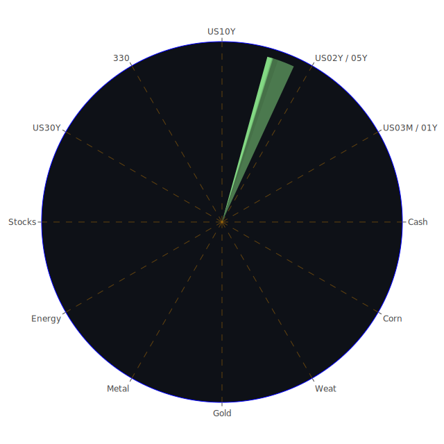

# 投資商品泡沫分析

以下將針對各類常見投資標的，結合空間（Spatial）層次下各市場與新聞的對應、時間（Temporal）層次下資產波動的前後變動、以及概念（Conceptional）層次下潛藏的心理與博弈因素，進行三位一體之整理與大膽假設之分析。本文為了兼顧文字的流暢與報告完整性，將不呈現實際表格，而以段落敘述方式傳達。

## 美國國債
美國國債一向被視為穩健資產。在近期數據中，1年、2年與10年期國債收益率仍呈現對倒掛狀況有所減緩的趨勢，從新聞可見美國多次談及關於政府支出、公共債務上限、以及各種地緣政治衝擊帶來的負面情緒，不過市場對美國央行後續動向亦在觀察。儘管美國國債的長天期仍呈現一定風險係數（根據部分泡沫指標顯示D1接近0.35到0.42不等，有些時點甚至更高），但整體上相比其他類別的高波動性資產，國債仍對投資組合提供避險作用。  
回顧歷史，2008年金融海嘯或是之後歐債危機期間，美債一直保有避險魅力；新聞上近期因關稅紛爭所產生的「政府財政重新分配」或「各類財政刺激方案」，也可能進一步影響美債的需求。因此在博弈論與心理學的層面上，市場總會在混亂時資金回流至美債，除非美國本身出現重大的信用動搖。

## 美國零售股
美國零售股受到許多「就業市場數據」與「民間消費力」等宏觀經濟指標的影響。從新聞觀察到，某些零售企業公佈財測警訊，如Best Buy、Ross Stores、Target等均有提到關稅爭議以及通貨膨脹陰霾，導致營運預期不如往年樂觀。多家新聞也報導部份零售連鎖面臨營收下滑或人事裁減，如Best Buy預估未來價格壓力增高，Stater Bros.甚至傳出史上首次裁員等。這些事件在社會學角度下，可能帶來消費習慣的收斂；心理學層面則因市場對未來景氣轉弱的恐懼，形成對零售股股價的壓力。  
歷史上亦可對照2000年代網路泡沫之後的「電商擴張」與2019年以前的「實體零售衰退」趨勢。雖然不少零售品牌試圖用Omnichannel或電商整合來力挽狂瀾，但若關稅與物流成本再度升溫，短線上零售股仍易受到打擊。

## 美國科技股
科技板塊在消息面易受「政治局勢」、「產業變遷」、「國際關稅」影響，且當前許多科技龍頭也面臨估值偏高與成長性放緩的風險。本次整理資料顯示，某些科技股的泡沫風險有逐漸拉高趨勢（D1或D7指標接近0.90或以上），新聞層面提及晶片、雲端、AI等仍受關注，但在「關稅反覆」、「地緣政治」、「供應鏈轉移」下，需求面不如先前那麼一致樂觀。譬如Tesla電動車在中國銷售下滑，甚至中國在國產車（如BYD）上競爭激烈；Marvell、Nvidia、Intel等半導體及AI類股則在漲多之後，近期展現一波獲利了結與前景雜訊。歷史上，2000年互聯網泡沫同樣曾經高舉高打，最終估值回歸仍是較為殘酷的自然現象。  
從博弈觀點來看，科技股與其他傳統行業可能因為政治談判而獲得不同的關稅優勢或補貼，不過一旦風向突變，股價波動會尤為劇烈。

## 美國房地產指數
美國房地產指數近日面臨抵押貸款利率攀升與通膨壓力。新聞中提到美國整體就業增長放緩，小型企業裁員的信號增加，民間購房力道的可能萎縮。歷史上2008年房市泡沫破裂的教訓仍歷歷在目，目前也有較多監管措施來避免過度槓桿。但最新的30年固定房貸利率仍在6.63%左右，處於近年高水位，代表新貸款的購屋成本較沉重。在社會學角度，若大多數民眾擔心未來經濟表現不佳，房市買氣也會連動下滑，形成正反合之中的「反面」壓力。  
心理學面向可見大眾對「房地產不會跌」的信念逐漸鬆動，尤其是高單價房產可能有回檔空間；然而長期仍然受都會區需求支撐，不致全面性崩盤。就博弈論而言，若市場相信通膨偏高、貨幣政策持續收緊，房地產指數便可能被壓抑；相對地，也有人押注房貸利率一旦回跌，房市可能再起一波反彈。

## 加密貨幣
比特幣、以太幣、狗狗幣等的價格波動，依舊深受市場流動性、投機情緒的驅動。本報告整理之近期泡沫分數顯示，比特幣（BTC）短期D1大約在0.40上下徘迴，並未達到極端，但ETH的泡沫風險也有升溫的跡象，尤其市場消息出現El Salvador持續購買比特幣、以及部分企業因資金面壓力可能拋售加密資產的交錯報導。歷史上，加密貨幣多次經歷驚人漲跌，如2017年末的狂熱與2018年的暴跌等皆是常態。  
社會觀點下，年輕世代對加密貨幣接受度高，但也不免隨著全球經濟壓力縮水而暫時退場；心理學方面，投資人對加密貨幣的“信仰”或FOMO（害怕錯過）情緒能使價格上衝，也能迅速崩落。博弈層面，監管機構在交易所合規、洗錢防治、穩定幣法規等議題上若採強硬態度，都會導致市場流動性劇變。近期新聞談到北美地區對加密交易進一步審視，意味風險雖高、但仍有持續關注度。

## 金／銀／銅
貴金屬與工業金屬向來扮演抵禦通膨與反映製造需求之關鍵。近期報告顯示，黃金泡沫指數有時一度攀高，銀也呈現同步波動，而銅則與全球製造業需求相關。最新「GOLD OIL RATIO」自上月35左右攀至43以上，表示黃金相對原油的價格在上升，象徵市場避險情緒升溫。歷史上，當金融市場動盪時，金銀價格往往受青睞。新聞提到關稅反覆，亦有地緣衝突與能源價格等複合因素，可能提振金價需求。然而若經濟放緩，銅等工業金屬需求減弱會帶來壓力，近來銅價雖有漲幅但泡沫風險也在升高。  
從心理學角度來看，黃金擁有傳統保值地位，銀則兼具貴金屬與工業金屬角色；博弈思維中，一旦資金過度湧入貴金屬也可能出現短線炒作導致估值過高。這段時間需留意新聞報導的通膨持續度、各國央行動態，以及投資機構是否將金、銀、銅做為輪動標的。

## 黃豆 / 小麥 / 玉米
農產品易受天氣、地緣與政治影響。報告中顯示黃豆、小麥、玉米的泡沫分數大約集中在0.17～0.50上下區間，仍是中低度風險，但若國際局勢有所波動，例如關稅提高或大宗商品航運受阻，價格會隨之震盪。新聞中時常出現「化肥供應」、「惡劣天氣」以及「局部地區衝突」造成農作物減產的訊息，均可能令市場對糧食安全有新一波恐慌。  
社會學理論下，糧價牽涉民生，因此政府常有補貼、或在關稅政策上對糧食進出口加以保護；心理上則是一旦出現任何傳聞，如「某國限制出口」、「惡劣氣候導致歉收」，往往引發投資與囤積的行為。歷史上如2010年前後的俄羅斯小麥出口禁令，就一度造成國際小麥價格飆升。故農產品可成為投資組合的一環，但也須注意天災人禍帶來的衝擊。

## 石油 / 鈾期貨UX!
石油價格近來承受多重壓力：包括經濟成長疑慮、供應端OPEC+產量政策、關稅以及地緣局勢，皆帶來反覆震盪。近期一些新聞報導OPEC+嘗試透過產量調整支撐價格，但成效有限；另一方面，美國原油生產與俄羅斯出口動態也持續在改變供需格局。從泡沫分數顯示，石油短期風險並不算極端高，但價格仍在弱勢徘徊。回顧歷史，油價在2008年曾劇烈震盪，2014年供給過剩也造成暴跌，因此需持續密切留意財政刺激方案與地緣關係演變。  
至於鈾期貨（UX）相對是較冷門的標的，常與核能議題掛鉤。泡沫風險雖不如部分科技股那麼顯著，但一旦各國重新審視能源政策並轉向核能，鈾需求可能迅速拉升。歷史曾在2011年福島核災後，市場全面看衰核能，一度讓鈾價走低；但隨著碳排放議題受重視，尤其歐洲對核能態度反覆，若未來再度傾向於發展核能，鈾期貨有潛在成長空間，惟政策風險極高。

## 各國外匯市場
近期數據顯示美元相對主要貨幣波動度加劇，日圓、歐元、英鎊的走勢也不穩定。新聞報導提及各國因關稅摩擦出現貨幣競爭貶值或升值的博弈，特別是澳幣、英鎊在全球貿易爭議與當地經濟基本面影響下，出現短期忽漲忽跌的現象。歷史經驗顯示，大型關稅爭端往往會引發多邊貨幣干預，大量資金往往尋找美元避險；但這次若美國自身出現赤字與政治紛擾，美元可能也不再是絕對的“唯一避風港”，而是呈現雙向劇烈波動。  
心理層面上，投資人對匯市預期常受到媒體與央行言論的影響。博弈論的角度也說明外匯市場是零和博弈，某一國貨幣升值，即意味著他國貨幣相對貶值。近期消息如墨西哥與加拿大受到美國關稅豁免期限延長等，都使其貨幣短暫走強，且對應新聞出現「加拿大、墨西哥貨幣齊漲」的正面解讀，但一旦政策旋轉，匯率亦可能迅即逆轉。

## 各國大盤指數
全球股市指數（如美國S&P 500、納斯達克指數、德國DAX、法國CAC、中國滬深300等），受到國際資金移動、總體經濟數據等綜合因素影響。整理近幾天的泡沫指數發現，許多主要大盤的短期泡沫風險普遍提升，顯示估值面存在壓力；新聞關稅不確定性讓投資人產生相當恐慌，陸續傳出對未來企業獲利的修正報告。歷史經驗如2018年也曾有類似貿易戰格局，其後雖一度緩和但又重啟談判，拉長整個震盪時間。  
另一方面，若各國政府採行刺激政策，如歐洲或亞洲地區增支撐市場成長，股市便可能走出一波補漲；但情況也受全球央行是否「緊縮或寬鬆」影響。社會心理方面，投資人屢屢對「央行會救市」抱有希望，但亦擔心金融體系去槓桿的結構性難題未解。

## 美國半導體股
半導體產業對關稅和地緣政治最為敏感，尤其若核心零組件被限制出口，或最終產品受關稅影響，都會衝擊下游需求。新聞指出部份廠商如Intel在資料中心需求回落、AMD雖在伺服器和AI領域有新產品，但市場競爭激烈；Nvidia方面在AI與繪圖晶片領域曾大幅上漲，目前則發生估值過高之疑慮。回顧2000年初網路泡沫以及之後的手機週期，半導體常伴隨週期性大漲大跌特性。投資人需注意短線消息，如某些晶圓廠大幅削減設備支出，或出口管制升級，都是利空。  
心理學層面，有一種「先進製程大躍進」的集體樂觀，投資人傾向重押未來。然而博弈理論告訴我們，若對手國家也積極扶植本土晶片，全球競爭恐怕將更加白熱化；此外，若實際需求端不如預期，過剩的供給反而造成價格下跌。

## 美國銀行股
銀行股受利率政策、經濟景氣、消費者貸款表現等多因素牽動。近期美國銀行股在新聞面方面，有傳出小型銀行壓力加大，放貸策略緊縮等跡象。從Fed釋出的關鍵數據，看來銀行總存款依然較高，但消費者違約率在信用卡方面有所抬頭。回顧2008年金融海嘯時，銀行股曾因房貸打擊而深受重創；本波雖未見大規模次級房貸問題，但若經濟轉差、企業與個人欠款攀升，銀行獲利也將縮水。  
博弈角度，銀行股在高利率環境下或可享利差，但若經濟不振、壞帳增多，利差利益恐不足以彌補壞帳損失。加之新聞也指出美國部分金融機構對關稅與地緣衝突可能引發的衍生風險相當顧慮，導致資金調度更加謹慎。

## 美國軍工股
軍工產業相關公司，通常在地緣政治升溫、國防預算擴增時獲利。新聞面出現「法國、德國各自提高國防支出」、「捷克也計畫加大國防投資至GDP的3%」等資訊，這或將間接利多部份美國軍工企業。不過也有報導提到歐洲國家若選擇在區內擴充軍工體系，對美國軍工出口的依賴度可能下降。歷史上，軍工股往往能在危機期間逆勢走強，比如多年前的中東衝突帶動某些軍工企業訂單增長。然而任何區域衝突一旦緩和，或政府預算被轉移，他們的股價也會回落。  
心理層面上，投資人對國防工業有不同道德評價，也會影響其資金投入。博弈論下，若各國繼續軍備競賽，美國軍工企業可能享紅利，但若全球局勢緩解或國防預算另有分配，其成長率就會放緩。

## 美國電子支付股
電子支付、金融科技產業在高利率、監管政策、關稅衝擊下，近年來仍持續擴張。許多報導指PayPal等公司近期泡沫風險指數達到高水位，股價波動幅度相當大。若國際跨境交易手續費受關稅影響，或若全球消費增速下滑，都將使電子支付服務交易量受限。回顧2010年後行動支付崛起以來，該產業多次調整商業模式，如擴充借貸、虛擬貨幣支付整合等，但競爭對手增多與監管加嚴，也帶來風險。  
心理層面，有些投資人相信數位化的必然趨勢，保持長期樂觀，但若短期交易量降溫或併購潮放緩，可能造成估值回歸。博弈論可見大型支付企業往往透過聯盟或收購手段來擴張市佔，若監管部門放行，他們能迅速壟斷市場，但也可能引來更多政治監管。

## 美國藥商股
藥廠股價主要與醫療保險政策、研發成果、疫情動態等掛鉤。近期新聞報導，整體醫療預算在某些地區受限於財政壓力，美國內部也爭論是否縮減一些醫保開支。若保險覆蓋範圍減少，或藥價談判壓力增大，醫藥類股恐受衝擊。然而歷史上，像2009年之後醫改政策的實施，藥商反而因更多人獲得保險而收益增加，顯示政策導向的正反合影響極大。  
心理層面上，大眾對大型藥企研發管線常抱持希望，而對政策談判心存疑慮。博弈角度若政府和藥企間協議達成，投資藥商股可獲穩定現金流，但也得承擔新藥研發失敗的風險。

## 美國影視股
影視娛樂產業隨市場景氣走向波動。新聞裡面提到Disney裁員，關閉某些部門（如538網站），也暗示流媒體或傳統電視廣告營收的壓力。回顧2020年因疫情曾讓串流服務爆發式成長，但隨後競爭愈趨激烈。心理層面上消費者口味瞬息萬變，博弈論上各大影視平台彼此競爭收購版權，也需與電信、科技公司談合作或分潤，加深了市場不確定性。  
歷史對比，如2010年前後Netflix剛崛起時就已顛覆傳統付費電視模式，如今市場已經成熟飽和，再加上廣告預算可能因經濟下滑縮減，影視股勢必面臨營收上的瓶頸。

## 美國媒體股
媒體產業與廣告市場高度連動。若整體企業預算減少、廣告支出同步下滑，媒體股就會面臨逆風。本報告整理新聞得知，不少媒體機構裁員或嘗試轉型，例如社群媒體與傳統媒體之間的競合白熱化。歷史可見2000年時的網路浪潮已重創報刊雜誌，而近年流行的自媒體與影音平台再度爭奪注意力。心理層面上，消費者偏好分散，各媒體公司需在多渠道佈局。博弈論則體現在媒體話語權可影響輿論，政治干預或企業併購都會干擾股價走勢。

## 石油防禦股
所謂石油防禦股，多是與傳統能源業務密切相關的企業，通常被視為在經濟下行時相對抗跌，因為能源需求難以在短期內大幅減少。不過若油價持續疲軟，這些防禦性的特性也會削弱。新聞提到某些石油巨頭雖然在地緣衝突中獲益，但近期也在承受歐洲可能強化綠能、以及整體需求放緩的壓力。歷史上石油企業常受到環境保護、高碳排放議題挑戰。心理學上，投資人偏好穩定股息而買入石油股，但一旦公司本身減產或資本開支不足，亦會產生後續隱憂。

## 金礦防禦股
金礦防禦股與黃金價格高度相關，若避險情緒提升，金礦企業因產量與黃金價格掛鉤，盈利可望提高，但也面臨開採成本與政治風險。新聞未特別大篇幅報導金礦公司的發展，但部分分析指隨金價走升，金礦股價尚有支撐。然而，歷史上金礦股往往伴隨金價高低起伏劇烈，尤其若礦區所在國政局不穩，將影響實際投資人對其價值評估。  
心理層面，長期擁金派往往同時布局金礦股，但需注意槓桿與現金流情況。博弈面來看，金礦開發國家可能透過稅率或特許權改變遊戲規則，對企業經營產生衝擊。

## 歐洲奢侈品股
歐洲奢侈品公司受全球富裕客戶消費力影響甚深。若美中關稅糾紛或全球經濟放緩，頂級消費可能也會減少。但新聞中依然見到部分高端品牌銷售仍有韌性，像是歐洲車廠或奢侈品巨頭在特定市場依然暢旺。然而若地緣政治或旅行限制復燃，觀光客消費會銳減，衝擊奢侈品需求。歷史經驗如2003年SARS期間，觀光消費驟減；2008年金融危機後，高階消費在第一年重創，但在2010年後又快速反彈。此呈現正反合的現象：衝擊過後若沒造成大面積失業，富裕人群往往快速恢復消費。  
心理學上，奢侈品消費帶有「炫耀性」，當社會對經濟未來悲觀時，此種消費可能轉趨保守；博弈觀點，奢侈品牌之間價格戰不明顯，往往以品牌力維持高價策略，但若競爭市場擴大，折扣和促銷也會出現。

## 歐洲汽車股
歐洲汽車產業近年面臨電動化轉型及全球競爭。新聞表示德國部分車企雖然在國內協商減少成本，但同時也寄望開拓中國或美國市場，如BMW、Mercedes-Benz等。若關稅拉高，歐洲車要出口美國或亞洲將受影響，導致利潤壓縮。歷史對比，如2008年金融海嘯造成汽車業需求崩跌，之後政府推出補貼才挽救局勢；疫情期間（2020-2022）原料成本及晶片供應短缺，也使生產一度受阻。  
心理層面，消費者對電動車和傳統燃油車的看法正在轉變，若環保意識更高昂，歐洲車廠勢必加速電動化，而轉型成本可能在短期傷及利潤。博弈論指出，一旦美國或中國持續補貼自家電動車，就會排擠歐洲車在國際市場競爭力，車廠股價因而持續動盪。

## 歐美食品股
食品股通常帶有防禦性，因必需消費支出在經濟不佳時仍相對穩定。然而新聞提及成本壓力（原料、運輸、關稅）上升，食品企業利潤空間被壓縮。若零售端價格無法一次性轉嫁給消費者，就得自行吸收成本。歷史上2007-2008年食物價格飆升，也造成大廠競爭並加劇市場洗牌。  
心理層面，消費者若預期經濟轉差會選擇更廉價產品，博弈論則表現於各大食品品牌、零售通路之間爭奪市場份額，透過促銷或品牌效應來維持營收。對投資者而言，食品股仍是中長期穩定標的之一，但也要防範因全球政經動盪造成的原物料大幅波動。

---

# 宏觀經濟傳導路徑分析
在宏觀層面，Spatial（地理空間）上美國、歐洲、中國三大經濟體的關稅與貨幣政策，是影響全球資金流向的核心；Temporal（時間）上，目前所處環境包括疫情後復甦與通膨壓力交織，央行同時考慮壓抑通膨與維持金融穩定；Conceptional（概念）上，由於新聞時常報導對衰退的恐懼，使得投資人情緒面在博弈中更趨謹慎。當央行傳遞鷹派訊號，市場擔心利率偏高打擊企業盈餘；若轉向鴿派，則擔憂通膨失控。  
透過正反合角度去看，政府或央行出台擴張政策是「正」，通膨或金融風險來襲為「反」，二者經過碰撞與調和，最終市場找到一個暫時平衡。然而這平衡並非固定不變，一旦國際情勢再度震盪，貨幣流動方向就會逆轉。

---

# 微觀經濟傳導路徑分析
從企業與家庭的角度檢視，關稅成本增加時，企業為了維持利潤，可能縮減人事或挪移供應鏈；這牽涉社會層面中勞動者的就業與所得。若大規模裁員，家庭可支配所得減少，再反饋到零售與房地產等需求縮減。此外，銀行若擔憂壞帳率上升而收緊貸款，企業融資就更加不易，風險資本也隨之收縮。歷史上類似傳導在歐債危機期間發生，造成實體經濟連鎖下滑。  
心理上，企業面臨不確定性時傾向保守投資；博弈論中，若某些企業想趁對手衰退之際擴大市佔，也面臨融資條件的挑戰。因而整體微觀經濟的融資成本、就業市場、企業獲利等互相影響。

---

# 資產類別間傳導路徑分析
1. 當原油或金屬價格大漲，製造成本上升，壓縮企業利潤，連動股市走弱，但可能推升商品期貨與黃金避險需求。  
2. 當關稅提升造成通膨預期升溫，債券價格下跌，收益率走升；同時資金可往金銀、外匯或其他非美元資產尋找對沖。  
3. 若地緣政治不確定升高，軍工股、金礦防禦股吸引避險買盤；但若局勢緩解，前述資產回吐漲幅。  
4. 半導體與科技股之盛衰，也會間接影響整體大盤指數。若科技權值股出現獲利回吐，資金有時流向防禦類股（如食品、醫藥、公共事業）。  
5. 貨幣市場方面，若某國中央銀行率先激進升息，該國貨幣短線走強並吸引短期熱錢，但長期若損害經濟成長，股市與房市卻受創。  

這些路徑彼此之間猶如漣漪效應：任何一個環節的動搖，都可能沿著金融市場、商品市場、勞動市場一路傳導，最終影響到各類資產價格。所有市場參與者都在博弈中關注彼此的行為，再因心理與社會預期的調整而迭代。

---

# 投資建議

根據三位一體（Spatial, Temporal, Conceptional）綜合市場新聞和歷史經驗，並考量各資產間的相位關係盡量滿足120度、相關係數約-0.5的思路，我們建議在穩健、成長、高風險三大類下分散配置，以期達到對沖效果。以下比例僅提供參考（穩健、成長、高風險三大類加總為100%），並於每一類細分三種子投資項目：  

1. **穩健類（30%）**  
   - **美國國債（10%）**：優先考慮中長天期的美國國債。雖然收益率較前幾年上升，但仍具有在風險事件中保本的特質，可視為核心防禦。  
   - **黃金（10%）**：近來避險情緒升溫，對抗通膨並可分散信用風險。從歷史觀點看，金價在大動盪時有保值功能。  
   - **高股息且財務穩定的食品股或公用事業股（10%）**：該類公司受經濟衰退影響較小，可提供穩定股息收入，也在宏觀動盪下相對抗跌。

2. **成長類（40%）**  
   - **醫藥或生技龍頭（15%）**：雖然面臨醫保政策談判風險，但長期研發和人口老化需求支撐，加上現金流通常相對穩定。  
   - **半導體設備或晶片設計公司（15%）**：長期看好AI、雲端與自動駕駛需求，但短期波動大，需要有耐心。挑選研發實力雄厚、財報穩定者。  
   - **歐洲奢侈品龍頭（10%）**：富裕客層的消費力較不易受景氣循環劇烈打擊，品牌力可維持毛利。不過若全球經濟轉差仍需警惕下修風險。

3. **高風險類（30%）**  
   - **加密貨幣（10%）**：例如比特幣、以太幣。波動性極大，但有助於和傳統資產的分散效應。建議僅用可承受虧損的部分資金投入。  
   - **能源或礦業相關標的（10%）**：包含鈾期貨或高波動石油股，視未來政治與能源轉型情況，可能享受高回報，但政策與地緣風險高。  
   - **軍工股（10%）**：在地緣政治不確定下，軍工訂單有機會增長，但若局勢緩解或預算被轉向，也會迅速回落，風險不容小覷。

此種配置思路希望透過不同資產間的低或負相關係數，實踐對沖效果。穩健部位鎖定必需或避險性標的，成長部位聚焦未來可能的趨勢產業，高風險部位則嘗試捕捉高波動背後的潛在獲利。三類配置總和為100%，彼此之間保留彈性，可隨市場狀況做5%～10%的調整。

---

# 風險提示

投資有風險，市場總是充滿不確定性。本報告是根據目前已知信息進行歸納與假設，並參考部分新聞事件與歷史經驗，僅供參考性質。投資者應謹慎評估個人風險承受能力、投資期限，以及市場動態變化後再行決策。面對可能的泡沫風險或政策調整，也應留意最壞情境下的資金安全與流動性準備。特別是針對任何「泡沫風險較高」的標的，如高估值科技、加密貨幣、高槓桿金融產品等，更要防範價格劇烈波動或政策突變造成的資本損失。

回到三位一體（Spatial、Temporal、Conceptional）的觀點，我們已在空間層面說明市場的國際交錯與關稅牽動，在時間層面分析近期與歷史類比，在概念層面則融合經濟學、社會學、心理學、博弈論等理論進行推敲。同時透過正反合的方式，審視可能的利多（正）與風險（反），並嘗試在不同標的之間尋求合理調和的投資建議。期望投資者能在壓力測試下，保有風險控管與靈活調度的能力。

值得再次強調的是，任何投資決策皆該考量可能的泡沫與過度樂觀情緒。新聞面所顯示的大量負面訊息可能引起恐慌拋售，也可能被市場過度解讀；同樣地，正面訊息亦可能造成不切實際的樂觀。投資者若能理性面對、根據各自財務情況並秉持長期規劃，將更有機會穿越經濟週期與市場雜音。

總之，在這樣一個關稅衝突、地緣政治、多重聲浪不斷的環境裡，維持對「泡沫風險」的警惕度仍是重要課題。不論哪種類型的資產，都可能隨著國際談判進展、央行政策逆轉而產生重大波動。面對這些自然現象般的市場漣漪，唯有充分的研究、穩健的資金控管，以及對不同理論與歷史經驗的靈活運用，才有助於在多變環境中達到相對合理的投資成果。

 
Daily Buy Map:

 
Daily Sell Map:

 
Daily Radar Chart:

 
