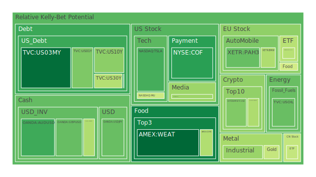
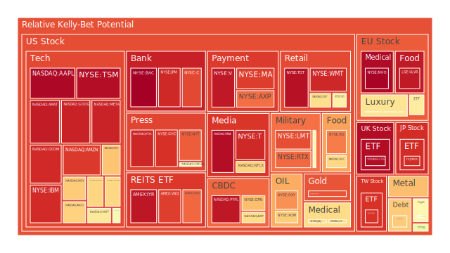
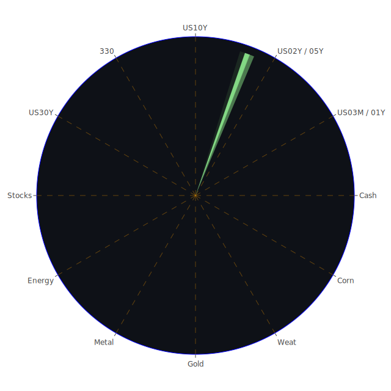

# 資訊航母三位一體（空間／時間／概念）的整合前言

在面對多變的全球市場時，為了提升對當前投資環境之理解，可以嘗試從三個維度——空間（Spatial）、時間（Temporal）以及概念（Conceptional）——去觀察「市場與新聞」的交織形貌，進而綜合經濟學、社會學、心理學、博弈論等領域進行大膽假設與歸納。

**第一：空間維度（Spatial）三位一體觀察**
1. 市場方面：空間維度著眼於全球地區與不同產業間之互動。例如，美國、歐洲、亞洲等主要經濟體與新興市場國家之間，資金流動可能因地緣政治、供需結構和產業分布產生差異。近期若觀察美國房地產指數、美國半導體股、加密貨幣以及各國大盤指數的波動，可以發現隨著全球貨幣政策分歧，資金正從部分高估值資產流向相對被低估或者新興產業領域，然而市場對地緣政治衝突或突發新聞（如關稅政策、國際衝突）的反應往往轉瞬即變。
2. 新聞方面：空間維度下，新聞焦點跨越全球各地，包含對於貿易關稅、新能源合作、國際軍事部署、全球氣候變遷、區域性罷工、或大型企業裁員與併購等。例如：新聞提到「某些公司在歐洲面臨罷工」、「南美洲國家因高溫停課」、「中東地區又有邊界糾紛」，都將影響到不同空間中投資人信心與資產重新定價。近期可見德國與法國等多個機場或交通系統同日罷工，影響了旅遊與物流產業；亞洲地區如中國與印度之間，也在半導體或晶片製造領域展開新一波合作與競爭。
3. 三位一體正反合：在空間層面，可以看到市場（正）對未來技術領先區塊充滿期待，新聞（反）則不斷報導全球衝突升溫或罷工與司法糾紛的負面情緒，彼此形成拉扯。最終合流之後，可能是區域間的資本調配出現方向性轉移，例如部分資金轉向更具防禦性的黃金、國債等安全資產，也可能進行大舉套利或結構性佈局。這種空間層面的「正反合」會使市場對地緣政治風險日漸敏感，也使得國際資金考量更多對沖組合，同時預防過度集中在單一地區的泡沫風險。

**第二：時間維度（Temporal）三位一體觀察**
1. 市場方面：從時間縱深來看，近期（2025-03-06 到 2025-03-08）部分資產的泡沫風險指標顯示出某些品種的風險上升或下降。例如，美國國債收益率曲線近來出現些許波動，3個月、1年、2年等短端殖利率與10年、30年等長端殖利率之間的差距有所收斂或擴大，顯示市場對於經濟成長與通膨前景的時間預期正在改變。當利差趨近反轉或已部分反轉之際，部分投資人擔憂經濟衰退或金融情勢緊縮，但也有市場觀點認為景氣循環雖放緩但仍有結構性潛能。
2. 新聞方面：根據一些新聞事件的時序排列，可從暫時性或周期性因素去推斷資產在未來幾週到幾個月可能受到的影響。例如「聯準會（FED）從2025-01-29後有若干鷹派談話，尚無明顯鴿派發言」、「多家美國大型企業公布裁員計畫」、「德國與法國機場將於下週一同日罷工」等短期新聞，常在一至兩週的時間範圍內擾動市場。反之，更長週期觀測如「美國房地產長期指數2020-2025的變動趨勢」，或「當前歐洲各國推行國防增支的長期路線」，則顯示投資人對未來幾年可預期的政策或地緣變化。
3. 三位一體正反合：在時間層面上，市場（正）期望發展延續既有趨勢，如美國科技股長期走牛或加密貨幣在區塊鏈新技術推動下維持成長；新聞（反）可能會帶來短暫或急劇的扭轉，例如關稅政策臨時翻轉、突發衝突升溫、公司財報不及預期等，令人擔憂週期反轉；最終合流後，投資人常在時間跨度的「長線 vs. 短線」博弈中找尋平衡，透過風險對沖、槓桿操作或持倉調整策略，嘗試兼顧短期震盪與長期增值。

**第三：概念維度（Conceptional）三位一體觀察**
1. 市場方面：概念維度側重於資產定價所隱含的信念與敘事，包括資金的風險偏好變動、對技術創新的想像空間、對通膨及就業數據的解讀。近期市場可能對「人工智慧（AI）概念股」、「新能源概念股」特別敏感，但過於集中的熱潮也導致泡沫疑慮。加密貨幣方面，雖然部分社群有強烈支持，但仍須面臨監管疑雲與實際應用價值能否落地之質疑。
2. 新聞方面：新聞報導能塑造或顛覆某些概念，尤其是當新聞具高強度負面情緒時，市場會從興奮轉為恐懼。例如有關特斯拉在中國銷售下滑的報導，可能打擊投資人對電動車前景的信心；或某些報導強調「人工智慧取代人力」將至，卻尚未有明確營收支撐，也可能出現心理落差。這些概念與情緒時常會成為市場波動的主因之一。
3. 三位一體正反合：概念維度顯示出市場（正）的樂觀敘事，如「新能源能大幅取代化石燃料」、「區塊鏈將革新金融」；新聞（反）則揭露企業真實獲利不及預期、地緣衝突頻仍，以及可能的監管風險；兩者最終合流後，市場常在悲觀與樂觀之間，湧現對「核心價值」的重新檢視，並在股債配置、商品配置與衍生品的避險或投機策略上做出調整。

---

# 根據三位一體信息，風險對沖與投資組合機會

經綜合空間、時間、概念三位一體的正反合，大多數投資人會在不同資產間進行風險對沖。在此強調，依據泡沫風險指標顯示，有些資產的短線泡沫程度較高，有些則相對穩定，兩者之間若相關性能維持在約 -0.5（或至少非高度正向），則可成為彼此對沖的潛在組合。下列為若干可能的風險對沖思路：

1. **美國國債 vs. 加密貨幣**：美國國債與加密貨幣之間，常因風險偏好而具有一定程度的負相關。當市場恐慌時，資金或許流入國債避險；反之，若市場走向樂觀或尋求高回報，資金則往往轉向加密貨幣。然而，近期加密貨幣有一定泡沫風險，一旦監管壓力再起，流動性可能驟降。因此，美國國債和加密貨幣的互持可望在某些程度上抵消風險敞口。
2. **石油 vs. 美國科技股**：油價變動牽涉到地緣政治、貨幣政策與全球成長預期；科技股則受整體風險偏好、企業獲利與創新前景影響。過去一些時期顯示，油價與某些高估值科技股之間，有時呈現中度反向關係。假如能源通脹或貿易關稅加劇，石油價格上揚可能壓抑消費支出，損及成長型科技股的估值；反之，油價下行時，科技股估值的擴張空間較大。
3. **黃金 vs. 美元匯率 (或各國外匯市場)**：黃金傳統被視為對沖通膨與地緣政治危機的重要資產，但其實也跟美元指數此消彼長。有時黃金與某些非美貨幣如歐元、日圓等之間帶有負相關。若考量當前美國貨幣政策趨勢與地緣不確定性，黃金相對可能維持防禦性，但若美元突然走強，也會打壓金價；反之則黃金上漲。
4. **美國半導體股 vs. 農產品 (黃豆 / 小麥 / 玉米)**：半導體股受全球景氣與技術周期帶動，遇到終端需求轉弱或利率環境惡化時，波動常較劇烈。農產品價格則受天候、物流、地緣衝突與糧食政策影響，但與科技股之間並不總是同步。若全球需求升溫，同時糧價有可能走高，但亦可能因地區農業增產而保持緩升，形成相對分散的對沖組合。
5. **REITs(房地產投資信託) vs. 半導體或科技ETF**：房地產指數本身在利率與景氣環境影響下波動，有些人認為在通膨環境中也能提供相對收益。科技ETF則易受估值壓力與市場熱炒影響。二者之間雖然不一定呈現高度負相關，但若配合其他大宗商品或匯率避險工具，也可能達到分散風險的效果。

整體來說，若要將這些對沖概念落實，應觀察兩資產在不同時間區間的相關係數、波動程度，以及新聞對情緒面的即時衝擊。以三位一體分析「空間」可比對地域或行業的資金分散度，「時間」可掌握趨勢或短期事件的衝擊時機，「概念」可避免盲從過度樂觀或悲觀的市場敘事。

---

# 彼此的三位一體兩兩驗證與篩選假設分析

若進一步對上述建議的對沖組合加以檢驗，便是將任意兩類資產在「空間、時間、概念」三方面，套用「正反合」篩選如下：

1. **空間互補**：是否在地理或行業分佈上形成分散？若美國銀行股與黃金防禦股分屬兩個截然不同的風險面向，則在地域與產業層面呈現空間互補。檢視新聞，如近期金融股新聞顯示銀行裁員、費用升高，而黃金新聞有時與國際地緣衝突或美元走勢掛鉤，於是二者或能形成「正反合」中的避險組合。
2. **時間週期對稱或錯位**：例如，石油有時受季節需求影響（冬季取暖需求、夏季駕車需求），科技公司財報則依季度、年度周期發佈。若二者在關鍵時間點的擾動因素並不完全重疊，在某些時段能互相稀釋波動風險。
3. **概念敘事抵消**：若一類資產強調「未來創新與高成長」的樂觀敘事（如美國電子支付股），另一類則屬於「經濟低迷時的剛需」或「傳統型防禦資產」（如農產品或公用事業）。當市場忽然轉向悲觀，防禦性需求抬頭，而成長股遭受估值擠壓；或市場轉向樂觀，高成長資產反彈，更能把握風險與報酬的動態平衡。

藉由空間、時間、概念三位一體交叉檢驗，可以進一步刪除彼此高度正相關的組合，挑選出約-0.5相關係數的資產，讓投資組合在短期內有較好抗風險能力，長期亦能捕捉成長機會。

---

# 投資商品泡沫分析

以下對常見投資標的進行概略的泡沫風險與現況敘述。此處僅為示範性列舉，並融合近期新聞、歷史對照，及各資產的潛在風險因素。

1. **美國國債**  
   美國國債收益率曲線近期顯示短端殖利率漲跌互見，聯準會對通膨態度仍具不確定性，市場一度擔憂貨幣政策持續偏緊。然而，若國際地緣局勢緊張，美國國債常成資金避風港。歷史上，美國國債也曾在多次金融危機中發揮避險功能。但需留意目前殖利率雖偏高，若長期增長動能放緩或通膨回落，美國國債價格仍有上漲空間，但短期波動性可能升高。

2. **美國零售股**  
   近期新聞提到多家零售商裁員、調整庫存，並且在面對關稅政策反覆的情況下，採購成本與定價策略出現壓力。如「Costco」財報顯示消費者行為偏謹慎，某些零售企業如「Victoria’s Secret」或「Gap」則或多或少受到市場擔憂與消費轉移影響。歷史上零售股常在經濟景氣向下時表現疲弱，若消費稅或關稅政策改變，零售商利潤恐被侵蝕。

3. **美國科技股**  
   包含晶片、半導體、網路服務、人工智慧等領域的科技股，一向備受高風險偏好投資者青睞，也曾造就多次泡沫。近期新聞關注人工智慧發展、電動車企在華競爭衝擊等。科技板塊在疫情後大漲，但經歷2025年初的市場震盪後，短期泡沫風險仍相對偏高。歷史參照「網路泡沫」時期，我們需警惕即便技術革命方向正確，一旦估值過度擴張，伴隨利率上行，股價仍可能出現大幅回調。

4. **美國房地產指數**  
   美國房地產受FED利率政策、銀行放款意願及民間消費能力影響。從部分REITs或實體房地產指數可見，近一年因抵押貸款利率升高，市場交投熱度趨緩。有些大型城市房價在高檔盤整，投資或自住需求都面臨壓力。若經濟放緩超出預期，房地產泡沫風險可能攀升，形成部分「空置率增加、價格回落」的局面。

5. **加密貨幣**  
   包括BTCUSD、ETHUSD、DOGEUSD等，2024年底到2025年初又出現一波漲勢，一度再度吸引投機性資金。市場同時關注官方監管動態以及加密貨幣交易所是否有流動性風險。歷史上，加密貨幣多次經歷暴漲暴跌，當新聞頻繁報導監管打壓或大型交易所出現流動性問題，通常價格會劇烈波動。

6. **金 / 銀 / 銅**  
   黃金作為傳統避險資產，近期受到通膨與地緣政治干擾而價格易波動。白銀、銅則更多用於工業應用，世界景氣好壞對其價格影響較大。新聞若提到基礎建設計畫升溫時，銅價往往上揚，若全球需求放緩或供應擾動，銀與銅可能進入震盪。歷史上，金銀常伴隨金融與政治不穩定而上漲，但也需留意美國利率對其影響。

7. **黃豆 / 小麥 / 玉米**  
   農產品的波動涉及全球氣候異常、地緣戰爭（如黑海地區供應變化）、以及運輸成本等。新聞若報導糧食減產或極端氣候衝擊（例如巴西或非洲地區乾旱、颱風），往往推升價格。但有時國際組織協調、或出口大國增產也能抑制漲勢。歷史上，農產品價格走勢常在經濟周期末端出現大幅波動。

8. **石油 / 鈾期貨 (UX!)**  
   石油價格牽動能源、化工、運輸等多部門成本，也往往和美元走勢、OPEC政策有關。新聞若報導中國需求下滑、美國增產，或地緣衝突導致供應受阻，都會使石油價差擴大。鈾期貨則涉及核能產業前景、能源轉型，以及政治與社會層面的爭議。倘若歐洲或亞洲國家重新檢討核能計畫，鈾需求可能階段性走揚，但也面臨核能安全與碳中和政策的衝擊。

9. **各國外匯市場**  
   近期英鎊、歐元、澳幣、日圓等波動都不小。新聞若提及歐洲陷入連串罷工、或英國政治動盪，匯率常轉弱；美國公布經濟數據佳，美元則易升值。若投資者對加息預期重新修正，匯市也會有劇烈震盪。

10. **各國大盤指數**  
   例如美國大型綜合指數、歐洲主要股市（DAX、FCHI、FTSE等），以及亞洲大盤（如中國某主要指數、台灣主要指數）。這些指數多少受全球資金流動影響，若新興市場熱度下降，資金回流美國，也會使新興市場大盤受壓。歷史上，多次金融波動都從美國或歐洲的衝擊開始外溢到他國。

11. **美國半導體股**  
   半導體是科技產業命脈，但也最容易受到週期、庫存、地緣政治和關稅政策打擊。新聞常關注某些龍頭廠商的財報或研發成果，一旦預期不佳，整個板塊可能大跌。此類資產泡沫風險通常較高，因為估值與未來成長率嚴重掛鉤。

12. **美國銀行股**  
   對利率與貸款需求敏感，銀行股所面臨的壞帳風險及監管壓力亦不可忽視。若新聞爆出信用卡違約率上升、商業地產呆帳或銀行資金水位不足，股價恐大幅回調。歷史上，2008年金融危機便是因次貸問題連鎖爆發所致。

13. **美國軍工股**  
   地緣衝突、國防預算、海外軍售等都影響軍工股走勢。當新聞聚焦某些區域衝突或美國加碼軍備支出，往往利多此板塊。然若衝突降溫、政府削減軍費，也會壓抑股價。

14. **美國電子支付股**  
   近年來隨著電商與線上支付發達而走紅，倘若消費市場動能衰退，或競爭者湧現，股價可能波動劇烈。新聞上若顯示裁員、虧損擴大、或監管挖角問題，通常引發投資人擔憂。

15. **美國藥商股**  
   醫療產業相對具防禦性，但新藥研發風險高，且受專利到期衝擊。若新聞爆出專利勝訴或疫苗需求提高，股價大漲的案例也不少；相反地，一旦臨床試驗失敗，殺傷力相當大。

16. **美國影視股**  
   收益模式正面臨串流平台改變與觀眾行為轉移。新聞如果報導某影視公司財報不佳、或員工罷工、內容爭議，都可能短時間重創股價。歷史上影視產業與整體消費能力關聯甚深。

17. **美國媒體股**  
   新聞、廣告、娛樂串流業務等錯綜複雜，也受政治環境、反壟斷法規影響。一旦市場廣告預算縮減，媒體股通常首當其衝。某些大型媒體併購也會衝擊競爭生態。

18. **石油防禦股**  
   主要指石油相關公司中，獲利較穩定、對油價有一定抗震能力者。當油價上漲時，盈利亦水漲船高；可是一旦油價大幅下跌，也可能使擴產計畫受阻，股價遭遇修正。

19. **金礦防禦股**  
   金礦股通常跟隨金價波動；若政治情勢緊張或貨幣寬鬆預期升溫，金礦股迎來利多。但需注意礦場生產成本、公司治理與地緣開採風險等。

20. **歐洲奢侈品股**  
   受中國等新興市場消費需求影響非常深。若新聞報導中國需求回溫、遊客大量湧入歐洲購買名品，股價往往大漲；反之，如果地緣衝突或經濟放緩，奢侈品銷售遇冷。

21. **歐洲汽車股**  
   德國、法國等歐洲車廠常面臨關稅、電動化轉型，以及亞洲車廠競爭。新聞若報導罷工或零部件缺貨，對其衝擊頗大。2018年以來的關稅議題就曾顯著影響歐洲汽車業出口。

22. **歐美食品股**  
   食品類防禦性較高，但因國際糧食價格或運費上漲，成本壓力也可能吃掉利潤。若新聞點出疫病風險、食品安全醜聞，則對該板塊打擊嚴重。

---

# 宏觀經濟傳導路徑分析

1. **國際利率走向**：聯準會（FED）及其他主要央行的政策變化，直接影響金融市場流動性與借貸成本。當利率上行，所有依賴槓桿的產業，如房地產、科技股等容易面臨估值壓力；金銀作為保值工具可能因機會成本上升而吸引力相對減少，但若通膨或地緣動盪持續，又有資金流入。
2. **財政政策與政府開支**：包含基建計畫、國防預算、社會福利支出等。近期若多國增加國防開支，軍工股與相關供應鏈受惠。相反，若出現稅制改革或補貼調整，也會影響企業的獲利預期。
3. **貿易摩擦與關稅**：新聞顯示，全球關稅爭議常在短時間內反覆，引發供應鏈重新配置。這會進一步傳導至本土市場之就業、物價、企業獲利；投資人對進出口企業或多國佈局企業的看法因此波動。
4. **貨幣供給與通膨**：若中長期通膨預期穩定，市場對企業營收與薪資增長有正面期待；但當新聞報導企業成本飆升與消費意願疲弱時，會引發「停滯性通膨」擔憂，衝擊估值。
5. **國際資本流動**：資金在地區間移動，帶動外匯市場與股票市場的漲跌。若某地因局勢混亂或監管不穩，外資便快速撤離，拖累該地大盤指數和貨幣。

---

# 微觀經濟傳導路徑分析

1. **企業利潤與成本結構**：企業財報反映利率、原物料、人工、關稅等多重因素。新聞若揭示某產業的關鍵技術或關鍵零組件受限，競爭力削弱，企業獲利下修便會傳導到股票價格。
2. **就業與消費信心**：零售、餐飲、旅遊等依賴消費者支出的產業，若失業率上升、消費信心減弱，銷售成長即放緩。這些指標在企業財報與短期市場反應中往往較快反映。
3. **產業供應鏈**：科技業需穩定原料晶圓與相關零組件供應；農業及食品業需要物流及恆定氣候條件；石油天然氣靠管線與運輸。新聞若揭露任一環節受突發事件干擾（如罷工、極端天氣、邊境衝突），商品價格會立刻波動。
4. **企業槓桿與債務**：若利率上升或資金收緊，負債高的企業面臨債務成本攀升壓力，信用評等下修可能雪上加霜。銀行股本身也有放款風險，故任何債務違約事件都可能在微觀層面傳到金融股。

---

# 資產類別間傳導路徑分析

1. **股債互動**：當股市大跌，引發避險情緒，資金流向美國國債或黃金等；若股市樂觀且信貸市場寬鬆，國債等避險資產需求減弱，價格下修。  
2. **匯率與大宗商品互動**：美元走強時，金屬與石油等大宗商品的美元計價成本較高，常壓抑其價格；反之，美元若走弱，國際油價或金價容易上漲。  
3. **地緣政治影響的迴圈**：軍工股、能源股、匯率、國債之間的互動往往由新聞導火。舉例：若美國對某地實施制裁，該地原油出口或供應中斷，石油股與美國軍工股上漲，但歐洲汽車股或航空股因油價上揚而承受成本壓力。  
4. **槓桿資金連鎖效應**：對沖基金或投資機構常同時持有多類資產，若一類資產發生踩踏，槓桿斬倉機制或保證金追繳，會誘發其他資產無差別拋售，引發連鎖震盪。

---

# 投資建議

在當前環境下，我們可依照「穩健、成長、高風險」三個層級，擬定各自約佔整體投資組合的比重，使總和達到100%。以下僅為範例，不代表實際個人投資推薦。

## 一、穩健型（40%）
1. **美國國債**：可布局中長天期，兼顧利率平衡與避險特性，約配置15%。  
2. **黃金防禦股**：黃金在地緣或通膨陰影下常具保值優勢，配置10%以分散股市風險。  
3. **歐美食品股**：此類為生活必需品，景氣循環影響相對小，雖收益不算亮眼，但在波動市況能提供穩定度，建議配置15%。

## 二、成長型（35%）
1. **美國科技股**：選擇已具有穩定獲利能力的領頭企業，如部分半導體大廠、雲端服務公司，配置15%。  
2. **歐洲奢侈品股**：雖有週期風險，但若中國等新興市場需求回溫，將帶動銷售增長，配置10%。  
3. **美國藥商股**：醫療防禦中又帶有成長潛力，如研發管線順利，長線可望增值，配置10%。

## 三、高風險型（25%）
1. **加密貨幣**：如BTCUSD、ETHUSD等，雖監管不確定性依然存在，但波動大，若抓準時機則報酬可觀，配置10%。  
2. **石油 / 鈾期貨**：視各國能源政策及地緣戰局而定，報酬風險俱高，配置10%。  
3. **美國電子支付股 / 新興金融科技**：未來成長潛力大，但可能面臨利率、競爭與監管衝擊，配置5%。

以上三大類加總為100%，僅為參考比例，用以示範如何於波動市況下做分散佈局。在實際投資執行前，投資者仍應依照自身風險承受能力、資金規模與投資目標做調整。

---

# 風險提示

1. **泡沫風險不可忽視**  
   根據多項市場訊號，部分資產（特別是加密貨幣、科技成長股、以及部分半導體股）可能有局部泡沫跡象，若後續利率再次走高或消息面利空襲來，易產生集中拋售風險。

2. **政策反覆性**  
   近期關稅或法規反覆變動，若企業供應鏈無法即時調整，衝擊範圍不只在貿易數據，也包括中長期投資佈局。同時政府預算與稅收政策的忽然轉向，也會打亂市場預估。

3. **地緣衝突風險**  
   部分地區的戰火或社會動盪對能源、糧食、基礎原料供應造成重大變數。如中東或北非一旦局勢升溫，油價可能飆升，而歐洲或亞洲的製造業成本受壓。

4. **極端天氣與公共衛生**  
   氣候變遷導致農產品價格與企業供應鏈易受衝擊；大型疫情或其他公共衛生事件若再度擴散，也會打亂生產運輸與社會運作。

5. **金融槓桿與流動性**  
   長期低利率環境所累積的債務與槓桿，一旦流動性收緊，極易引爆連鎖風險。投資人應關注銀行股與高收益債市場的結構性問題。

6. **政治與社會不穩**  
   多國陸續出現選舉、政府人事更迭、或大型罷工行動等，這些社會動盪恐導致投資信心轉弱。新聞顯示德國、法國等國多次罷工導致運輸與觀光受創，可能影響公司財報表現。

---

# 結論

全球市場從空間、時間、概念三大維度觀之，充滿錯綜複雜的動能。大量新聞事件凸顯地緣政治、關稅政策、企業財報不確定性，同時也帶來機遇與風險。投資人若能在空間層面避免資產過度集中，時間層面在短期波動與長期佈局間取得平衡，概念層面警惕過度樂觀與恐慌的情緒輪轉，即可透過多元的資產配置、適度對沖策略、以及關注泡沫風險徵兆的方式，增強組合抗波動能力。

建議投資人在擬定策略時，務必再三檢視新聞報導與實際市場數據的「背後邏輯」，因為任何一個消息都可能被市場過度放大或忽視。利用經濟學、社會學、心理學、博弈論的綜合分析方法，在「正反合」的角力中尋找最能平衡報酬與風險的路徑，才能在多變的市場環境中爭取長期穩定獲利。

---

# 風險提示

投資有風險，市場總是充滿不確定性。本報告僅提供參考資訊與分析假設，並不構成投資建議或保證收益。投資者應根據自身風險承受能力與投資目標，獨立審慎評估後再行決策，並持續關注市場變化及資產泡沫風險。切勿忽視任何可能出現的高泡沫風險警告，亦請隨時留意全球政治經濟與企業財務報表之動態，以應對未來未知之變化。

 
Daily Buy Map:

 
Daily Sell Map:

 
Daily Radar Chart:

 
