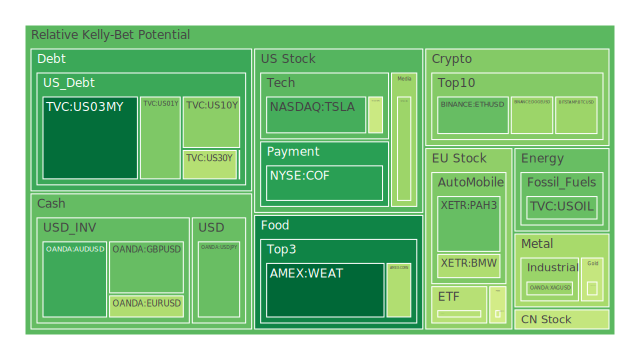
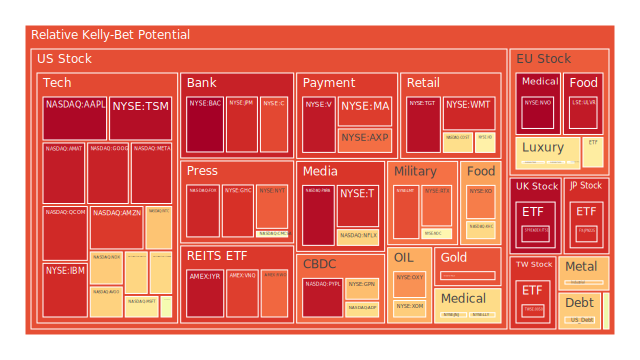
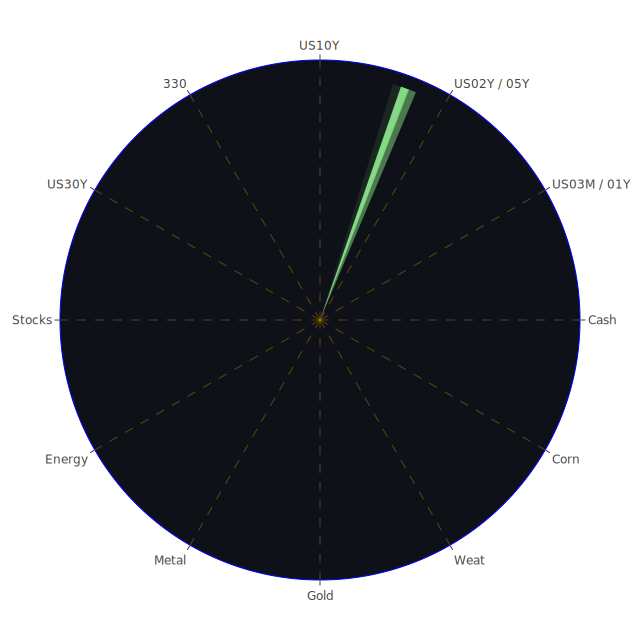

### 關於「Spatial（空間層面）、Temporal（時間層面）、Conceptional（概念層面）」三位一體的正反合大膽假設

1. **Spatial（空間層面）**  
   - **正面假設**：全球各地市場由於數位化與金融創新的高度連結，地域隔閡正逐漸縮小，多種金融產品跨區域交易更為便利。若企業在多個地區建立穩固供應鏈，可同時吸收區域性風險。  
   - **反面假設**：地緣政治衝突、關稅措施反覆、局部地區制裁、能源政策錯配等變數，可能在不同地區產生分裂的供應鏈風險，造成區域性經濟分歧。若某些地區爆發政治事件或戰事，資金可能瞬間撤離當地市場，增添不確定性。  
   - **綜合理解**：此層面的變化反映在最近頻仍的新聞中，包括某些國家因國防、外交問題向外國大使館驅逐人員，或區域性罷工、抗議、甚至爆炸性事件（如未爆彈導致火車延誤）。在空間層面上，須警惕局部地區突發事故對全球市場的連帶影響。

2. **Temporal（時間層面）**  
   - **正面假設**：技術演進、貨幣政策趨勢、歷史周期等，往往能提供一定的可預測性；過去多次經濟週期顯示，在貨幣寬鬆和產業升級的階段，市場常有新創或科技相關投資熱潮帶動長期成長。  
   - **反面假設**：若某些產業技術或政策尚未成熟就提前炒作，易造成短期泡沫。再者，短期消息（如「關稅再度翻轉」「非農就業報告失守」「國際緊張局勢升高」）往往會引爆急速震盪。  
   - **綜合理解**：觀察新聞，近期市場對關稅反覆、Fed利率政策走向、以及大型科技企業的裁員計畫等消息十分敏感。時間層面的不確定性使得資本市場呈現高波動，高評價資產或高槓桿投資容易在短期內遭遇爆跌風險。

3. **Conceptional（概念層面）**  
   - **正面假設**：理念上的合作（如全球供應鏈互利、綠色能源共識、科技共享）能促進更大範圍的跨國發展；投資者在概念上更加開放、多元佈局，對不同資產之間的關聯度也有更多理性評估。  
   - **反面假設**：一旦世界主要經濟體出現保護主義、反全球化浪潮或意識形態對立，容易使資本市場信心轉弱；若投資者過度追捧或恐慌，都可能激化市場情緒，讓高風險資產泡沫化或遭到大量拋售。  
   - **綜合理解**：從新聞來看，美國「America First」或某些國家對核能、移民、軍火交易等特定議題的立場分歧，便體現了概念上的認知鴻溝，對於貿易、供應鏈佈局、跨國金融合作，都潛藏影響力。概念層面的對立或融合，往往映射到市場投資標的的風險溢價。

在上述三位一體「空間、時間、概念」的正反合交疊之下，我們發現：關稅、地緣政治、產業走向、金融政策等因素，同時以不同方式作用於市場。對投資者而言，此種複雜交錯促使「風險對沖」的必要性更為凸顯。理想情況下，若能找到相位接近120度、彼此相關係數約-0.5的投資組合，即可在多種情境下維持較佳的穩定度。以下將進一步針對各主要投資商品，進行更細部之泡沫與風險探討。

---

## 投資商品泡沫分析

以下針對主要資產類別，依據近期市場數據（例如PP100、泡沫分數D1/D7/D14/D30等）以及新聞事件，進行客觀敘述。

---

- **美國國債**  
  以US10Y（10年期國債）、US02Y（2年期國債）、US03MY（3個月期國債）等為指標，美國國債殖利率在過去數月有顯著震盪，最新資料顯示US03MY利率約4.31，US02Y約4.00，US10Y約4.30，期限利差偶爾轉正偶爾倒掛。在新聞面上，相關報導與Fed對利率政策的動態關聯甚高；同時整體聯邦政府可能因關稅、財政政策、稅收調整等帶來潛在不確定性。  
  從泡沫風險角度觀之，部分短債泡沫指數仍不算極端，但長債若因通膨及政府資金需求再度上揚，恐怕會出現定價失衡。不過歷史經驗（如2008年金融危機期間）也顯示，美國國債在系統性風險爆發時往往仍是資金避風港，資金會回流至長債，讓價格上升、殖利率下降，因此短期內或許仍有防禦性價值。

- **美國零售股**  
  代表性標的如WMT、TGT、COST、HD等，普遍面臨關稅與消費力道不穩的衝擊。最新新聞顯示，Costco財報雖然銷售仍成長，但獲利卻不及預期，市場對零售股較為謹慎；HD因房市與裝修需求動能下降，股價泡沫分數在D7與D14呈上揚，意味著投資人疑慮漸深。  
  過去在2000年前後、2008年金融危機以及2020年疫情初期，也出現零售股營運壓力激增的狀況。若本次關稅反覆延宕，使進口成本增加，再加上消費者對通膨與就業市場的不安，零售股恐持續震盪。

- **美國科技股**  
  這類股票如AAPL、MSFT、GOOG、META、AMD、NVDA等，長期以來是美股的成長引擎。近期新聞提到Microsoft加速AI佈局、Apple可能延後某些產品升級、Tesla則遇到政府角色爭議與銷售壓力。泡沫數據顯示AAPL與MSFT的泡沫分數已經不低；NVDA先前的市值衝上紀錄後大幅回落，也說明了市場對AI概念炒作的退燒。  
  回顧2000年網路泡沫或2021年科技熱潮退卻的教訓，一旦估值無法持續獲得利潤支撐，跌幅會相當劇烈。近期市場關稅翻轉、Fed緊縮步伐未定，也可能加重科技股籌碼面的波動。

- **美國房地產指數**  
  以VNQ、IYR、RWO等ETF做代表。根據現行數據，房地產相關標的的泡沫分數相當高，如VNQ與IYR皆有D7、D14數值逼近0.96上下甚至更高，顯示市場對房地產板塊風險的警覺度上升。新聞面則有提到「Fed基準利率維持高位」「抵押貸款利率在6.6%上下」等，使房市需求受壓抑。同時，也有報導顯示美國部分城市零售商店關閉加劇，造成商業地產空置。  
  歷史上，2008年次貸危機的血淚教訓在前，一旦房價虛高被戳破，金融市場多會出現信用緊縮與銀行資產負債惡化的連鎖反應。故目前對美國房地產需保持審慎。

- **加密貨幣**  
  以BTC、ETH、DOGE等最具代表性。近期數據顯示BTC約在PP100為86208上下，ETH在約2206附近，DOGE約0.1923。有些新聞提及白宮與加密業者互動、法規審查、部分銀行停止處理加密相關業務等。泡沫分數方面，BTC近幾日D1在0.39-0.40之間，ETH D1有過0.31上下的小幅震盪。  
  回顧2017年底至2018年初的加密狂潮、2021年高峰後的幾度深度修正，加密貨幣常受到地緣監管、投機情緒，以及資金行情影響。若Fed維持偏緊的流動性環境，再加上市場對數位資產監管增強，短期內波動仍大。  

- **金/銀/銅**  
  實物貴金屬如黃金XAUUSD、白銀XAGUSD，以及銅市場（Copper）。因通膨與地緣因素，歷史上金價常被視作避險資產；2025年數據顯示金價上漲至約2909-2915區間，泡沫指數D1接近0.45-0.46，尚未到「極度泡沫」，但必須留意本輪金價已累積漲幅。白銀近來波動頗大，D7達到0.76以上，市場高估值跡象也比較明顯。銅價則與製造業前景密切相關，若全球經濟放緩可能壓抑銅價。  
  參考2008年金融危機與2020年疫情初期，金銀價格常先後受到恐慌性買盤推動。若國際局勢繼續動盪，黃金與白銀或獲青睞；但若之後經濟數據出現好轉、資金回流風險資產，貴金屬或有回落風險。

- **黃豆 / 小麥 / 玉米**  
  三者作為大宗農產品，近來亦受到氣候、關稅戰、地緣衝突影響。資料顯示小麥(WEAT)與玉米(CORN)的泡沫分數在0.42上下浮動，黃豆(SOYB)在接近0.46-0.50間，屬中度水準。新聞面提到巴西高溫、南美農產成本波動等，都與穀物價格密切相關。  
  回顧2011年及2022年國際糧價大漲時，天災、能源價格和地緣政治都曾成為推動因素。本次亦需注意美國對某些地區加徵關稅，農產品外銷之供需結構易被扭曲，帶來短期不規則的價格衝擊。

- **石油 / 鈾期貨UX!**  
  石油(OIL)近期維持在每桶66-67美元上下，泡沫分數中等偏低。市場對經濟放緩的擔憂和供應面增減的反覆，使油價易陷區間震盪。新聞亦報導「油價本週表現為自去年10月以來最大週跌幅」，顯示投資人對需求前景比較悲觀。  
  鈾期貨(UX)，由於核能相關議題在各國的政策並不一致，有些國家推動，有些則是計畫逐步退場。短期來看，鈾的價格與投資交易量並非絕對主流，但地緣政治和能源安全考量或在長期推動需求。  

- **各國外匯市場**  
  包含EURUSD、GBPUSD、AUDUSD、USDJPY等。近期EURUSD約1.08，GBPUSD約1.29，AUDUSD約0.63，USDJPY約148上下。新聞有提到「日圓受到BOJ政策模糊與外資對日元干預疑慮」，也有「歐洲陷入罷工潮，德國、法國經濟動能受創」等。  
  回顧1997年亞洲金融風暴及2009年歐債危機，都顯示外匯市場的脆弱性。一旦利率政策或地緣因素驟變，匯價往往出現快速而劇烈的貶值或升值，伴隨資本流動劇烈。

- **各國大盤指數**  
  例如美國的NDX、歐洲的FCHI、GDAXI，及英國FTSE、日本JPN225，大陸000300，台灣0050等。整體上，科技密集的指數（如NDX）泡沫指數較高，D7與D14均在0.70-0.77區間；歐洲方面FCHI、GDAXI，以及FTSE等因工會罷工、未爆彈、機場停飛等新聞衝擊，雖有短暫震盪，但市場動能尚未完全轉弱。  
  注意如果全球主要央行同時緊縮，對大盤指數的壓力不容小覷。在歷次金融風暴中，無論歐美亞指數，往往同步回調。

- **美國半導體股**  
  以AMD、NVDA、KLAC、AVGO、QCOM、INTC等為代表。自2024年末以來，半導體股票一度因AI題材炒作而大漲，但近期有些新聞指出Nvidia市值大幅回落，市場對AI熱潮可能出現分化。KLAC與AVGO等雖然財報不差，但泡沫分數已偏高，QCOM亦在高位區間震盪，AMD再度面臨景氣周期挑戰。  
  2000年網路泡沫、2018年比特幣挖礦潮崩潰都曾帶動半導體股大起大落。需警惕若需求面不及預期、企業設備投資縮減，此板塊容易快速波動。

- **美國銀行股**  
  如JPM、BAC、C、COF、AXP等。資料顯示近期這些銀行的泡沫分數大多位在0.80到0.99之間，尤其BAC達到0.998以上，顯現投資人對銀行體系的擔憂。新聞面提及企業裁員、貸款需求下滑，與消費性信用壓力上升。  
  2008年雷曼事件與2023年初部分地區中小銀行出問題，都顯示銀行股擁有高度槓桿敏感性。一旦信貸風險或資本不足的風聲傳出，股價極易大幅震盪。

- **美國軍工股**  
  如NOC、LMT、RTX等。即使地緣衝突升溫常使軍工需求擴大，但市場亦擔心預算削減或政治立場變動帶來風險。資料顯示NOC的泡沫分數中等偏高，LMT在0.87上下震盪。部分新聞顯示數個國家增加國防支出，如法國、捷克共和國；但若外交局勢突轉和緩，也可能壓抑軍工訂單成長。

- **美國電子支付股**  
  以V、MA、PYPL等為主。由於整體消費市場不振以及Fintech競爭，新用戶增長可能放緩；PYPL近來泡沫分數在0.95上下攀高，V與MA也接近0.90甚至0.93之上，顯示估值壓力並不小。歷史上，電子支付平台在網路發展紅利時期增長迅猛，但市場一旦轉向，估值亦可能劇烈收斂。

- **美國藥商股**  
  像MRK、JNJ、LLY等。在醫療保健領域具一定防禦性，但也要關注專利到期、政府藥價管制等風險。近期資料顯示JNJ泡沫指數在0.66上下，MRK在0.51至0.53間，LLY則偏高到0.85以上。若醫改或保險制度改革出現調整，可能衝擊定價能力。

- **美國影視股**  
  包含NFLX、DIS、PARA、FOX等。Netflix近期D1在0.68上下，但D14接近0.87，顯示短期投資人或有謹慎情緒。Disney面臨收視與流媒體訂閱增速放緩，營收與成長的爭議增多。Paramount（PARA）股價泡沫指數屢屢升高，對於市場所謂的傳統媒體轉型疑慮仍在。  
  參考歷史，網路串流興起改變了傳統有線或衛星電視生態，但現在競爭對手之多也使內容平台業者利潤承壓。

- **美國媒體股**  
  如CMCSA、NYT等。紙媒以及有線電視營運模式轉變，NYT泡沫指數在0.85上下，顯示市場對傳統媒體仍有疑惑。若廣告收入下滑，或美國經濟成長乏力，媒體股恐進一步承壓。

- **石油防禦股**  
  通常是指上游與整合型巨頭（如XOM、OXY等）採取相對防禦性策略。XOM的泡沫分數已在0.69附近，OXY則在0.78，顯示評價與風險並存。國際油價若無法回升，獲利空間或將下降；倘若地緣衝突加劇，則油價又可能飆漲，帶動營運表現。

- **金礦防禦股**  
  代表如RGLD等，在金價上漲時表現通常優於大盤。但一旦金價回落，金礦公司股價往往跌得更深。近期RGLD泡沫指數在0.86上下，表示市場對其未來營運有相當期待，也須防短期回檔。

- **歐洲奢侈品股**  
  例如MC（LVMH母集團）、KER（Kering）、RMS（Hermès）等。歐洲市場正面臨罷工和旅遊不穩定因素，且全球經濟若放緩，高端消費可能減少。資料顯示MC、KER、RMS之泡沫指數約在0.56-0.78之間，數字雖非極端，但也暗示一旦奢侈品需求趨緩，股價易受衝擊。

- **歐洲汽車股**  
  像BMW、MBG等。電動化轉型、地緣政治、關稅等皆影響其出口與利潤。泡沫指數在0.40-0.50間，不算過度高估，但歐洲境內罷工、供應鏈干擾仍是重要風險。

- **歐美食品股**  
  KHC、NESN、ULVR等均與消費及通膨相關。資料顯示KHC泡沫指數約0.67上下，NESN約0.47-0.64，ULVR甚至達到0.94或更高，顯示投資人擔憂原物料成本上漲或匯率波動。若之後歐美經濟持續下行，預計食品類股受壓，然而日常必需品同時也有一定防禦力。

---

## 宏觀經濟傳導路徑分析

在Spatial層面，地緣政治因素——包括北美關稅政策反覆、歐洲多國罷工、巴西極端天氣、部分國家內部的社會動盪——都會透過跨境供應鏈與資金流動，影響全球大宗商品價格與企業獲利表現。

在Temporal層面，美聯儲利率調整路徑、OIS FED Fund Rate與SOFR交易量的變化，往往在短時間內引發金融市場的劇烈震盪。關於債務上限、政府支出削減或擴張等議題，則是中長期可能的風險源。

在Conceptional層面，美國「America First」政策、歐洲對於烏克蘭局勢與國防開支的分歧，可能導致不同陣營之間的政治互信不足。再加上一些道德與文化議題上的衝突（例如移民政策、核能去留），都容易透過信心機制影響投資氛圍。

---

## 微觀經濟傳導路徑分析

一方面，企業與消費者對未來成本的預期（如關稅、原料價格、工資、稅負）會直接影響訂單、生產計畫與庫存管理；另一方面，金融機構若預期貸款風險升高，可能收緊資金或提高利率，導致中小企業營運成本上揚，進而傳導回就業市場。最終，消費端面對就業不穩與物價高漲，也更趨向謹慎消費，使整體需求下降、企業獲利縮減，成為惡性循環。

---

## 資產類別間傳導路徑分析

若美國國債殖利率持續上行，可能誘發資金自股票、房地產等風險資產撤出，轉投國債，使股市與房地產承壓。石油價格如持續低迷，石油防禦股與俄羅斯等能源輸出國的經濟也難免衝擊。半導體、科技及零售股則高度依賴市場景氣與消費者支出；若房地產市場放緩、銀行貸款收緊，將削弱消費者的可支配資金。黃金、白銀等避險資產往往與股市存在反向或弱相關關係，若金融市場信心動搖，可能推動金銀價格上行。

---

## 投資建議

根據以上對三位一體（Spatial、Temporal、Conceptional）的正反合分析與泡沫指數觀察，我們嘗試提出在當前環境下三種投資組合策略：穩健、成長與高風險。三類資產合計配置佔比需達到100%。以下僅提供示範性的配置說明，請投資人斟酌個人風險承受度進行調整。

1. **穩健型**（合計 50%）  
   - **美國國債（10年期或5年期）**：20%  
     - 優點：在景氣下滑或避險需求上升時可提供穩定收益。  
     - 風險：若通膨意外回溫或政策轉向，殖利率上行會導致債券價格下跌。  
   - **黃金**：15%  
     - 優點：地緣政治惡化或股市震盪常使金價得到資金追捧。  
     - 風險：若市場風險偏好再度回升，金價可能回檔。  
   - **歐美食品股（例如KHC或NESN）**：15%  
     - 優點：日常必需品具防禦性，經濟衰退時較不易出現銷售崩潰。  
     - 風險：若原物料與運輸成本上漲，利潤被侵蝕。

2. **成長型**（合計 30%）  
   - **美國科技股（例如AAPL或MSFT）**：10%  
     - 優點：長期看好大型科技企業的AI或雲端服務紅利。  
     - 風險：估值偏高，若宏觀環境偏緊，股價易受壓。  
   - **歐洲奢侈品股（例如MC、KER）**：10%  
     - 優點：全球高端消費潛力仍在，中產層級壯大。  
     - 風險：若經濟衰退範圍擴大，奢侈品需求萎縮會相當顯著。  
   - **美國軍工股（例如LMT）**：10%  
     - 優點：地緣衝突升溫常使國防預算難以削減。  
     - 風險：政治因素較大，若局勢忽然緩和或政府改變軍費方針，訂單恐受影響。

3. **高風險型**（合計 20%）  
   - **半導體股（例如AMD、NVDA）**：8%  
     - 優點：科技革命迭起、AI需求驅動晶片升級。  
     - 風險：估值昂貴，市場熱度若迅速冷卻，下行風險顯著。  
   - **加密貨幣（BTC或ETH）**：7%  
     - 優點：若全球金融體系波動、法幣誠信受質疑，可能再次獲資金青睞。  
     - 風險：法規監管、交易所清算風險、波動劇烈，易出現大漲大跌。  
   - **石油或鈾期貨**：5%  
     - 優點：能源供需改變、地緣緊張、核能復興都可能推升價格。  
     - 風險：政策面不確定性、全球經濟放緩會壓抑需求。

上述分配僅為示例，不代表應毫無調整地採用。若投資人偏好更高流動性或低槓桿策略，可酌情降低高風險型資產的比重，或在成長型中納入更分散的標的。

---

### 風險對沖與漣漪效應

綜合Spatial、Temporal、Conceptional三位一體之考量，若要尋求相位盡量保持120度、相關係數接近-0.5的配置，可在穩健型資產與高風險型資產之間製造「負相關」的屏障。例如：  
- 當加密貨幣或半導體股走勢與美國國債或黃金走勢相對較為負相關時，就能達到一定程度的風險對沖。  
- 對應地，一旦股市大幅調整，若避險資金轉而湧入國債或黃金，則能在配置中緩衝損失。  
- 若油價走低，金價或國債吸引力上升。反之，若全球經濟意外復甦，風險資產回補時，上述避險類標的報酬雖可能下滑，但可由成長與高風險部位獲利彌補。  

此外，資產間彼此的「漣漪效應」可概述如下：  
1. **銀行股→房地產市場→消費支出→零售股/食品股**  
   - 一旦銀行股因信貸風險而收緊貸款，房地產供貸也會趨嚴，影響買房與裝修等需求，進而打擊消費力。零售與食品類股的盈餘也可能受衝擊。  
2. **科技股/半導體股→企業投資/消費電子→金屬需求/貨幣政策**  
   - 科技股泡沫若破滅，整體企業投資意願下降，帶動金屬需求下滑，也壓抑部分通膨壓力，致使貨幣政策走向更加不明。  
3. **加密貨幣→法幣信心→跨境資金流動**  
   - 若金融市場動盪，部分資本可能分散至加密貨幣；相反地，若監管層面施壓或利率走高，資金又流出加密領域，對外匯與法幣市場造成短暫衝擊。  
4. **地緣新聞→軍工股→石油/鈾期貨→黃金/白銀**  
   - 重大衝突或軍備競賽的新聞，可能推升軍工需求或油價（或促使核能關注度提高），也常伴隨對金銀的避險需求。  

這些漣漪效應在空間（各國市場聯動）、時間（短期衝擊與長期構造）、概念（政治意識形態和全球化趨勢）三層面中相互呼應，產生多向度的衝擊。

---

## 風險提示

投資有風險，市場總是充滿不確定性。本報告中所提及的相關數據與觀點僅供參考，並不構成對任何個人之投資建議。投資者應根據自身的風險承受能力與資金狀況，自行評估各項資產的優劣勢。同時，由於高泡沫指數往往暗示估值可能已高估，對於任何顯示「泡沫風險高」的投資標的更應謹慎考量。在國際局勢、關稅與貨幣政策多變之際，請務必保持警覺，對所持資產進行動態追蹤，方能在錯綜複雜的市場環境中立於相對穩定的地位。

 
Daily Buy Map:

 
Daily Sell Map:

 
Daily Radar Chart:

 
