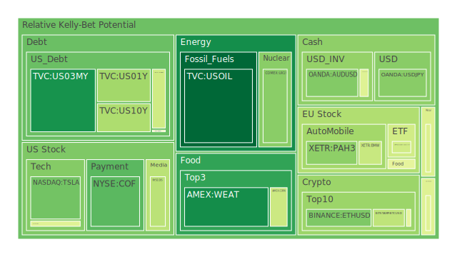
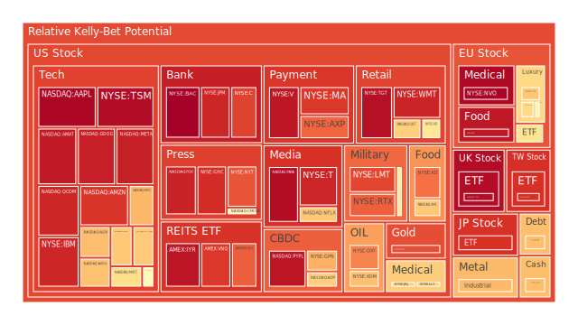
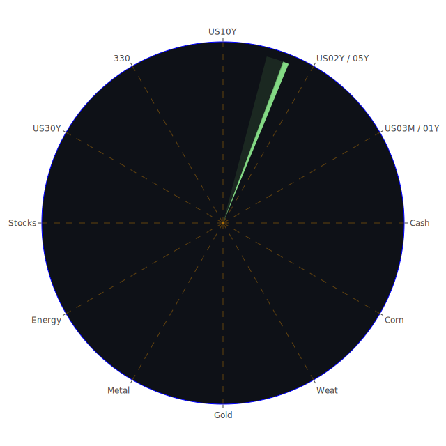

# 投資商品泡沫分析

在「資訊航母表格」的空間(Spatial)維度中，我們先從市場與新聞的交織關係著手，觀察不同資產在全球範圍內所受的情緒波動與經濟面影響。接著，時間(Temporal)維度則著重於近期（數天、數週、數月）所累積的走勢變化與新聞事件的交互影響。最後在概念(Conceptional)維度，則以理論假設、大膽推論與歷史類比的方式，歸納出可能的風險對沖與投資機會。以下針對各主要資產逐一闡述：

## 1. 美國國債
美國國債常被視為風險較低的投資工具，但從「資訊航母表格」的空間維度來看，市場對於公債的需求與情緒很大程度受到美國聯準會（FED）動向、地緣政治風險，以及全球資金尋求安全港的情況影響。根據最新資料顯示，短天期國債如US03MY（3個月）和US01Y（1年）收益率在4%左右浮動，而US10Y（10年）與US30Y（30年）則維持在4.3至4.6的區間。綜觀近期新聞與宏觀環境，市場對美國國債的情緒雖有反覆，但由於一些歐洲地區罷工、未爆彈、移民爭議等負面新聞，使得部分資金仍在尋找避險管道，短期內美債需求可能保持相對穩定。

在時間維度（Temporal）分析中，聯準會過去半年雖著力於通膨控制，但就最新數據來看，OIS FED Fund Rate在4.33、FRA SOFR在4.35，顯示市場對於未來利率仍有不確定性。這樣的利率不確定性對美債的價格波動形成短期壓力，亦會影響資金的避險走向。從概念層面（Conceptional）而言，歷史上美國國債在全球動盪時期往往成為資金停泊的首選，但必須警惕若美國國內政治或財政出現較顯著風險（如增稅、政府赤字擴張、債務上限等），其避險功能也可能減弱。就泡沫風險而言，美國國債整體泡沫分數雖非過於顯著，但還是得持續關注全球資金流向，以及負面新聞若持續累積，市場恐轉向避險或轉向其他資產而加劇波動。

## 2. 美國零售股
觀察COF（常被視為信用消費與零售相關度較高之金融股）等零售或消費金融領域的標的，其D1泡沫分數約0.24-0.25之間，並非特別高，但部分新聞顯示美國家庭儲蓄率降低、信用卡壞帳率（Charge-off Rate）在某些統計上逐漸提高。從空間維度看，美國零售股易受全球供應鏈與國內就業情況影響。目前新聞裡，負面消息如大企業裁員（例如HPE、特斯拉等），加上實質薪資下降，可能削弱零售端的消費動能。

時間維度則強調，近期的就業數據顯示美國新增就業有放緩跡象，市場擔憂消費能力減弱。在概念層面，歷史上當信用卡壞帳率開始走高時，往往意味著整體消費力道遇到挑戰，可能導致零售股表現承壓，也可能在更廣泛的層面反映市場對經濟衰退風險的恐慌。對於零售股之泡沫疑慮，雖不見極端高昂的風險分數，但若企業獲利不如預期，或信用環境惡化，仍可能觸發股價大幅回調。

## 3. 美國科技股
以TSLA、MSFT、AAPL、GOOG、META、NVDA、AMD等為代表。科技股在空間維度上，受全球晶片供應、地緣科技爭端（如美中科技脫鉤或晶片出口管制）等影響相當顯著。新聞資料顯示，Nvidia（NVDA）的市值從高點回檔相當明顯，AI板塊雖然短期仍有題材，但若投資人對於高估值產生疑慮，科技股的調整可能仍會延續。近期報導提到特斯拉七週連跌，也對電動車市場所代表的成長神話產生壓力。

時間維度上，科技股在過去一年波動頻繁。從疫情後的爆發式成長到近期相對上行阻力變大，都在顯示市場情緒的快速轉變。從概念層面，歷史上網際網路科技泡沫（2000年）與後續的科技輪動都告訴我們，高估值領域往往伴隨高風險。一旦資金面趨緊或市場情緒逆轉，跌幅可能十分快速。綜合各方數據，部分科技股如AAPL、NVO等泡沫分數接近0.98-0.99，顯示投資人須高度警惕。新聞裡也多見負面情緒，例如Musk相關企業人員流動或AI競爭加劇等議題，都可能在短期內推動股票出現振盪。

## 4. 美國房地產指數
美國房地產相關ETF如VNQ或IYR，近來泡沫分數逼近0.95上下。空間維度觀察，房地產與全球資金流動、高淨值人口移動，以及國際資本對美國房地產的偏好度密切相關。根據新聞與數據，固定房貸30年利率約6.63，雖較一週前下降，但仍處於相對高位，形成房地產市場融資成本壓力。此外，抵押貸款利率升高也造成購入力下降，部分地區房價已有鬆動的跡象。

時間維度觀之，自COVID-19後的幾輪寬鬆政策帶動了房地產的一波大漲，但隨後利率逐步回升，交易量與過去幾年相比有了明顯收縮。概念層面則提醒，2008年金融海嘯的起因之一正是房地產與抵押貸款的泡沫累積；雖然本輪市場結構與當時略有不同，但利率昂揚下的供需失衡可能仍形成系統性風險。新聞裡，有關消費貸款壞帳率、就業疲軟等負面資訊，若進一步擴大，恐導致房地產端出現壓力。

## 5. 加密貨幣
BTCUSD、ETHUSD、DOGEUSD是市場較為矚目的加密貨幣標的。從空間維度來看，加密貨幣市場受到全球監管消息、多國央行數位貨幣發展與地緣政治事件等影響。2025-03-10的數據顯示BTC有超過5%的日內跌幅，報約81,554。根據泡沫分數顯示，比特幣D1風險大約0.3988，ETH約0.2967-0.4857之間，DOGE則在0.48左右，顯示近期市場對加密貨幣有一定風險擔憂。

時間維度方面，加密貨幣向來波動巨大，先前AI概念或機構入場曾帶來一波熱潮，但負面新聞層出不窮，尤其是監管打擊與大型交易所的財務或合規爭議，都可能帶來下行壓力。概念層面立足於過去幾年的數位資產熱潮，從2017-2018年一路到2021年的大漲大跌，都提醒投資者加密貨幣在極端行情下的泡沫化速度。有些新聞（如政府對區塊鏈、DOGE等的負面評價）也提升了投資人的戒心。

## 6. 金/銀/銅
貴金屬金（XAUUSD）與白銀（XAGUSD）往往是避險指標。從空間維度來看，金價與地緣衝突、通膨預期以及美元資金面掛鉤頗深。近期新聞顯示全球經濟不確定性增加，亦使黃金持續受到一部分買盤支撐。銀和銅更倚賴工業需求，故銀的波動度常會比金更大，而銅則是經濟榮枯的重要風向球。目前XAGUSD的泡沫分數約0.66-0.80不等，銅（COPPER）則在0.72-0.73之間，代表雖有風險，但未至於極端。

時間維度來看，金銀銅近幾週波動與地緣政治消息密切相關，如俄羅斯對烏克蘭能源設施的攻擊、歐洲罷工等，都會推動市場的風險意識，使資金在不同工業金屬之間尋求避險或套利。若參考歷史經驗，金銀在金融市場動盪時容易受到追捧，而銅易在全球經濟衰退疑慮升溫時出現回調。未來若全球經濟進一步放緩，銅可能面臨更大壓力。

## 7. 黃豆 / 小麥 / 玉米
SOYB、WEAT、CORN等農產品受天氣、地緣政治與國際貿易協定影響相當深遠。空間維度觀察，新聞裡提到極端氣候或某些國家減少農產品出口，皆可能引發價格波動。像俄羅斯在烏克蘭的軍事行動，也擾亂了黑海糧食供應鏈。時間維度可見，前陣子全球糧價曾攀升，但近期不少消息顯示農產品的供需關係已出現階段性修正，如大豆與小麥價格轉趨溫和。不過，歐洲方面出現的罷工、天氣異常等事件若再度擾亂供應鏈，則可能推高農產品價格。

概念層面上，1970年代和2008年也曾出現糧食價格暴漲情形，因此投資者不能忽視極端情況下的農產品通脹風險。就泡沫分數來看，WEAT（小麥）相對較低（約0.14-0.17），CORN（玉米）在0.42左右，大豆（SOYB）在0.49上下，不算偏高，但若碰到極端天氣或地緣緊張升溫，這些農產品就可能瞬間跳升。

## 8. 石油 / 鈾期貨UX!
石油（USOIL或OXY）近來受供給面與全球需求憂慮互相拉扯，在空間維度上，中東地緣政治與美國頁岩油產量增減、俄羅斯出口量波動等都形成關鍵。根據最新資訊，石油價格已經下探至66美元附近，短線有壓力。新聞裡不少負面情緒如「供應過剩」、「需求放緩」，但亦有人認為一旦歐洲或亞洲大國需求回溫，油價又會反轉。對應的泡沫指數顯示，OXY股票的分數約0.78，雖高但並非頂峰。

鈾期貨UX1!由於核能重新受到多國重視，尤其歐洲遭逢能源危機，不少國家開始猶豫是否重啟核電。空間維度上，鈾價格雖非所有投資者都關注，但在地緣政治與減碳趨勢驅動下，鈾相關投資有時成為「小眾亮點」。時間維度則顯示，鈾價雖震盪，但長期趨勢可能逐漸抬頭。概念上，歷史經驗告訴我們，核能發展易受社會輿論、政府政策与安全事件影響。從現行數據觀察，鈾泡沫分數約0.31-0.53之間，風險不算太高但也不可輕忽。

## 9. 各國外匯市場
包含AUDUSD、GBPUSD、USDJPY、EURUSD等。空間維度中，外匯市場最受地緣政治與各國央行政策指引。新聞顯示，美國與歐洲近期皆有波動，如歐洲罷工事件使歐元在短期內時強時弱。GBP面臨英國通脹與金融環境壓力，與美元匯率有過一段上揚。日圓則受日本國內薪資不振、貨幣政策不確定性干擾，最近有報導指稱日圓被視為新避險貨幣，但也可能在國內經濟轉差時更顯疲弱。

時間維度顯示，FED利率走向不定，OIS FED Fund Rate大幅波動，造成美元指數前景不明朗。概念層面如博弈論或心理學則指出，當市場一致預期美元會走弱時，往往會出現反向交易。近期新聞中亦有關於「美元最糟糕的一年」的耸動標題，值得投資人保持警惕：匯市容易被情緒性交易放大漲跌幅度。

## 10. 各國大盤指數
如GDAXI（德國大盤）、FCHI（法國）、FTSE（英國）、JPN225（日本）、000300（中國滬深300）等。在空間維度上，歐洲大盤受罷工、能源政策、移民危機等負面新聞干擾；日本日經指數則可能因本國貨幣與國際需求而受到波動；中國市場方面則受結構調整、監管政策與地緣角力影響。

時間維度顯示，全球主要股指近來皆有較明顯震盪，部分市場呈現出高位整理或反覆拉鋸的走勢。歐洲方面，罷工及未爆彈所造成的交通中斷等負面情緒持續發酵。概念層面參考歷史數據，每當歐洲整體政治、勞動問題加劇時，往往導致經濟增長預期下降或不確定性上升，投資者對歐股的興趣也降低。從泡沫風險看，GDAXI、FTSE等指數的泡沫分數在0.43-0.97間分布；部分指數接近0.97（如FTSE），需高度留意。

## 11. 美國半導體股
如NVDA、AMD、KLAC、AMAT、QCOM等皆為市場關注重點。空間層面，半導體供應鏈在地緣科技爭端下顯得脆弱：若有任何限出口或國際政治變化，對相關股票可能產生巨大衝擊。時間維度從疫情以來，半導體走出高速成長，曾出現「缺貨潮」推升股價，但進入2024-2025年，市場開始出現庫存調整、需求放緩等雜音。概念層面基於經濟學與博弈論，若大國之間的貿易關係不穩定，對半導體股的估值與前景會產生長期影響；投資者需時刻觀察政策動向。泡沫風險方面，NVDA等接近0.55-0.59，AMAT、KLAC則在0.94-0.97區間不等，顯示部分標的估值已較高。

## 12. 美國銀行股
如JPM、BAC、C、WFC等。空間面上，美國銀行業在利率走高的情況下，淨息差或能擴大，但同時信用成本與壞帳風險也在升高。新聞提到信用卡壞帳率上升、商業地產違約風險攀升，對銀行資產質量構成威脅。時間面可見，從疫情後的寬鬆到現今逐步緊縮，銀行類股的利潤結構在調整；某些銀行亦面臨潛在監管或政治因素壓力。概念層面檢視2008年金融海嘯經驗，如若經濟陷入衰退、貸款違約率攀升，銀行股會大幅下跌。BAC的泡沫分數特別高（接近1），表示投資人須極度審慎關注。

## 13. 美國軍工股
如LMT、NOC、RTX等。空間觀點顯示，地緣衝突（例如俄烏戰爭、中東局勢）往往使軍工股受益。時間方面看，軍工股在較長週期中往往逆勢走強，但若消息面顯示局勢緩和，市場對軍備需求衰退，股價即可能修正。概念層面聯想到二戰或冷戰歷史：大型軍工企業常受政府長期合同支持，具備某種「特殊避險」性質，但也會因政策變化和預算分配而波動。當前RTX約0.83-0.82的泡沫分數，LMT也達0.87左右，有潛在高風險。

## 14. 美國電子支付股
如MA、V、PYPL、GPN等，在空間維度上，全球數位支付領域仍在擴張，但也面臨區塊鏈支付與監管的挑戰。時間方面觀之，線上支付疫情後快速崛起，但2024-2025年隨著消費力與景氣走弱，交易量增速或放緩。概念層面可回顧，電子支付產業雖可提供便捷與創新，但投資估值往往偏高，需防範市場情緒逆轉。根據泡沫指數，MA、V、PYPL都在0.90-0.96之間，也顯示對該領域的高預期亦伴隨高泡沫。

## 15. 美國藥商股
如MRK、JNJ、LLY等。空間維度顯示，生技與醫藥領域在疫情影響後，一部分藥廠受疫苗與治療藥物帶動，但也出現競爭日益激烈與研發風險增高的情形。時間維度看，醫藥股近年漲多漲少互見，一方面需求穩定，另一方面研發失敗或專利風險仍相當高。概念層面參考2000年科網泡沫與後來生技股熱潮，投資者常在防禦型思維下轉向藥廠，但要警惕政策管制（如藥價限制）造成的壓力。LLY目前泡沫分數逼近0.66-0.87，JNJ約0.66，亦非全然安全區域。

## 16. 美國影視股
如DIS、PARA、NFLX等。空間面觀點，內容產製、串流市場競爭全球化，受消費者口味與技術變革影響。時間面觀之，疫情時串流高速成長，但之後成長動能趨緩，競爭者百家爭鳴。概念層面，歷史上娛樂產業的整合與新舊媒體交替，往往瞬息萬變。近期DIS泡沫指數約0.39，NFLX則約0.67-0.86不等。PARA則接近0.97，且公司財務面受到衝擊，屬風險較高者。新聞也指出有關電影、影視罷工或經營不善等負面情緒在市場傳播。

## 17. 美國媒體股
如FOX、NYT、CMCSA等。空間維度顯示，媒體業受廣告需求與民眾收視行為轉型所影響。時間面觀察，疫後廣告支出一度復甦，但全球經濟前景不明確，也令媒體收入增長趨緩。概念層面，媒體業曾在互聯網興起時經歷重大洗牌，之後再面臨社群媒體及串流平台的衝擊。FOX和NYT的泡沫分數都在0.90附近，CMCSA也逾0.56，若經濟環境惡化或產業競爭加劇，媒體股可能出現修正。

## 18. 石油防禦股
如XOM、OXY等，多數大型石油企業除了開採與精煉業務外，也在全球佈局防禦型供應。空間面可見，若國際油價走跌，企業利潤壓力大增；但若地緣局勢升溫或油價重回高檔，該類股又能相對受益。時間面觀察，XOM、OXY等股價與油價走勢聯動，亦與企業自身財務結構、債務水平等相關。概念面提醒，石油公司過往在地緣戰爭或能源短缺中擁有相對優勢，但若替代能源或全球減碳趨勢加強，則長期前景可能受到質疑。XOM泡沫分數約0.68-0.69，OXY則0.78，上漲空間與下行風險都並存。

## 19. 金礦防禦股
如RGLD等。空間維度，金礦股常被視為避險工具的延伸；若金價攀升，礦商能享受更高獲利。時間維度顯示，金價近期在地緣風險下仍有支撐，但若全球利率或美元走勢變化，金礦股也會受牽動。概念層面，2008年金融危機時，有部分金礦股受金價飆升帶動創歷史新高，但若金價反轉，股價跌幅也可能不小。泡沫分數約0.86，顯示市場對該領域已有相當大預期，須注意回檔風險。

## 20. 歐洲奢侈品股
如MC、KER、RMS等。空間面觀點，奢侈品需求倚賴高淨值人群及新興市場購買力，一旦地緣政治或全球旅遊趨勢轉變，都會衝擊銷售。時間維度，全球經濟若進入衰退，奢侈品銷售常先行下滑，但也有部分超高端品牌不受太大影響。概念層面，2008年與2012年歐債危機時，奢侈品雖曾短暫受到衝擊，但一些龍頭企業仍能迅速恢復，顯示此領域具抗波動特性與品牌價值支撐。然而MC、KER、RMS等泡沫分數分布在0.56-0.78不等，市場對該領域抱有高期待，也隱含修正風險。

## 21. 歐洲汽車股
如BMW、MBG等。空間層面中，歐洲汽車業面對電動化轉型、AI駕駛與全球關稅政策，若美歐貿易摩擦升溫，出口型車廠將直接受衝擊。時間維度觀之，近來歐洲因罷工與供應鏈瓶頸，導致汽車生產與零件供應存在不穩定因素；同時中國市場的需求變化也深深影響這些歐洲汽車品牌。概念面回顧2008年金融危機，歐洲車廠也曾歷經銷售疲弱與轉型期，但靠品牌與高端市場撐過衰退。現今BMW、MBG的泡沫分數在0.41-0.50之間，雖未到危險區，但有潛在風險累積。

## 22. 歐美食品股
如NESN、KHC、ULVR等食品或日用品巨頭。空間維度顯示，食品業對糧食原料供應敏感，如原料價格大漲，利潤空間就受壓。近期新聞指出農產品波動，能源運輸成本亦有升降不定的風險。時間維度看，食品消費具有剛性需求，但經濟衰退時，高端或非必需品食品需求會縮減。概念層面可參照歷史上1970年代的通膨危機，食品價格波動往往帶動消費者行為調整，也影響企業庫存與定價策略。泡沫分數顯示NESN約0.47，KHC約0.67，ULVR逼近0.95，若營收不及預期，可能面臨回檔。

---

# 宏觀經濟傳導路徑分析

「資訊航母表格」在空間、時間、概念三位一體的正反合推演下，顯示宏觀經濟有以下幾項傳導路徑值得關注：

1. **利率與貨幣流動性的傳導**  
   聯準會的利率走向直接影響美債收益率曲線，進而帶動全球資金流。新聞裡提到OIS FED Fund Rate起伏、BTFP與Discount Window水位變化，暗示銀行間的資金壓力狀況。若緊縮加劇，投資人可能轉向更安全的標的，如美債或黃金。

2. **地緣政治與全球貿易的傳導**  
   歐洲多國罷工、烏克蘭危機持續、東亞局勢等，均會影響能源與糧食市場，同時衝擊製造業供應鏈。新聞中許多關於關稅、出口管制、乃至於多國關於難民或移民的政策事件，都可能在全球供需結構造成衝擊。

3. **企業財務壓力與信用週期的傳導**  
   收入放緩、就業減少，導致信用卡或房貸、商業地產貸款的違約率升高。這可能進一步衝擊銀行資產負債表，也可能使企業投資與擴張縮手。從FED資產負債表與高收益債利率的狀態，都顯示目前仍處在潛在風險的疊加期。

4. **市場情緒與避險需求的傳導**  
   當負面新聞增多（如暴雪、未爆彈、罷工、衝突），避險性資金往往湧向黃金、美國國債等。然而若美國本身也出現政治或財政危機，避險天平可能倒向其他資產（例如日圓、瑞士法郎等）。

---

# 微觀經濟傳導路徑分析

1. **家庭消費與貸款壓力**  
   消費者若面臨薪資增長停滯或物價上揚，會影響零售股、食品股與貸款相關金融股的業績。若信用卡壞帳率提升，銀行會收緊信用額度，形成惡性循環。

2. **企業研發與投資**  
   半導體、科技、藥廠等公司投資研發需要資金；若利率偏高，融資成本上揚，成長型公司加快燃燒資本，可能被迫減少人員或推遲專案。例如HPE裁員、特斯拉的生產計劃放緩，都與此相關。

3. **製造業與國際原物料成本**  
   歐洲汽車業、機械業與美國製造企業，都受到石油、金屬與農產品價格的影響。當這些原物料變動頻繁，企業的利潤與排程都要不斷調整。

---

# 資產類別間傳導路徑分析

1. **負相關的對沖機制**  
   根據「資訊航母表格」的空間/時間/概念三位一體綜合判斷，若想在波動環境中配置資產，需留意資產之間的相關係數。以黃金對沖部分股票風險、或以貨幣對沖部分原物料風險，是市場常見做法。然而新聞顯示，當地緣政治或經濟衰退同步擴大時，傳統避險未必能完美發揮。

2. **三位一體的連鎖效應**  
   舉例來說，若歐洲罷工推高能源價格，進而壓抑汽車產銷，同時導致消費下滑並使歐洲銀行壞帳率升高，也可能讓投資人轉向美國國債與美國大型科技股尋求庇護，但若美國也因信用問題而出現黑天鵝，避險資金或將流向金銀或日圓。

3. **風險資產與防禦資產的輪動**  
   當市場消息偏好風險時，比特幣、科技成長股、半導體股等容易上揚；相反地，若新聞層面顯示重大衝擊或衰退隱憂，金礦股、國債或日圓往往受到青睞。這些輪動常非單一事件引發，而是多個消息疊加所產生的結果。

---

# 投資建議

根據上述對各領域的泡沫與新聞事件觀察，並結合「資訊航母表格」所呈現的三位一體（Spatial、Temporal、Conceptional）剖析，可歸納出以下三種不同風險層級的配置建議（比例加總為100%）。投資人可依照自身風險承受度調整，以下僅供參考：

1. **穩健型（約50%配置）**  
   - **US國債**（約20%）：在目前市場動盪中，美國中長期國債仍具避險地位，但需警惕利率波動。  
   - **黃金**（約15%）：在地緣衝突多發、政治風險升高、新聞負面因素頻繁時，黃金往往能提供保值作用。  
   - **歐洲食品股**（約15%）：雖然食品類股也有泡沫風險，但剛性需求與品牌護城河具備一定防禦性，像NESN、KHC等可適度布局，惟要避免追高。

2. **成長型（約35%配置）**  
   - **部分科技龍頭股**（約15%）：如MSFT、GOOG、META等，儘管估值高，但若自動化與AI需求持續攀升，仍有中長期發展空間，適度關注。  
   - **半導體設備股**（約10%）：如KLAC、AMAT等，長期看半導體需求仍在，但估值泡沫不容小覷，宜在價格回調時逐步布局。  
   - **石油/鈾能源股**（約10%）：在地緣政治下，傳統與新興能源板塊都有契機，長期需求可望維持，但波動風險高。

3. **高風險型（約15%配置）**  
   - **加密貨幣**（約5%）：BTC、ETH為主，雖然短期有大幅波動與監管壓力，但若市場再度轉向風險偏好，或有大漲可能，切記用閒置資金小部位試水。  
   - **美國影視或媒體股**（約5%）：DIS、NFLX、FOX等，若未來娛樂需求回溫、競爭態勢穩定，存在反彈空間，然新聞顯示衝擊仍大。  
   - **歐洲奢侈品股**（約5%）：RMS、KER、MC等，在中國與新興市場復甦或高淨值消費回升時可能大漲，但一旦全球經濟走弱風險甚高。

投資人可將以上穩健、成長、高風險三個組合以50%-35%-15%比例布局，因應個人目標與承受能力稍作微調。配合「相位120度、相關係數-0.5」的對沖思維，可考慮在各項資產間維持適度的分散。

---

# 風險提示

投資有風險，市場總是充滿不確定性。  
1. **泡沫風險**：根據上文之資產泡沫分數與新聞事件，許多標的都處於相對高風險區域，一旦市場情緒反轉，股價或價格修正幅度可能巨大。  
2. **地緣政治與政策不確定性**：歐洲罷工、烏克蘭與中東衝突、移民問題、關稅政策反覆等，皆會顯著干擾市場，任何單一事件都可能在短期內造成資產大幅波動。  
3. **全球經濟放緩的連鎖效應**：若經濟衰退來臨，企業獲利普遍下滑，可能連帶引爆信貸風險或高槓桿部位的斷頭風險。  
4. **央行緊縮節奏難料**：新聞顯示FED雖然釋出部分鷹派訊息，但實際決策可能受到通膨、就業數據和金融市場狀況影響。一旦利率變動超預期，將引發金融市場大幅震盪。  
5. **加密貨幣與新興科技**：此類投資波動劇烈，監管態度也尚未完全明朗，一旦遭遇監管利空或技術漏洞，價格大幅回調的風險相對高。

總體而言，建議投資人保持警惕，適度分散資產，並根據自身風險承受能力及投資目標審慎評估。無論任何策略，都應持續關注最新的國際新聞與宏觀指標動態，切勿盲目加碼或過度集中於單一標的。也需理解市場情緒容易在負面消息頻傳時過度恐慌，在利好消息時又過度樂觀。此時期強調穩健的投資心態與動態調整的投資組合，才能應對各種可能的市場漣漪效應和結構性風險。

 
Daily Buy Map:

 
Daily Sell Map:

 
Daily Radar Chart:

 
