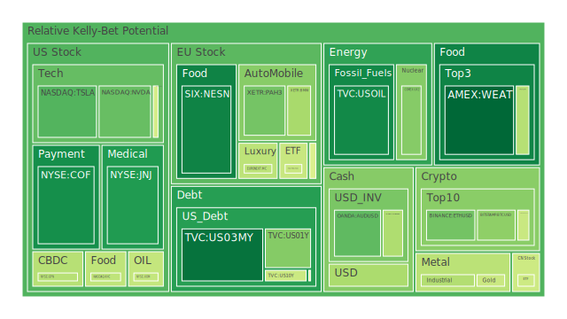
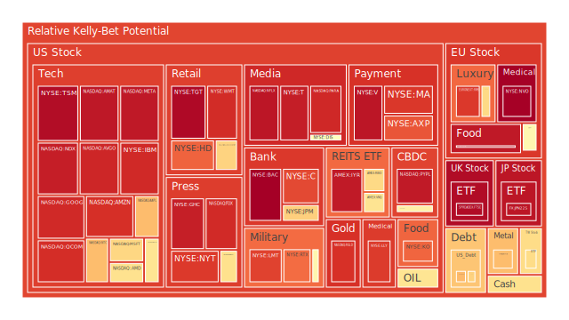
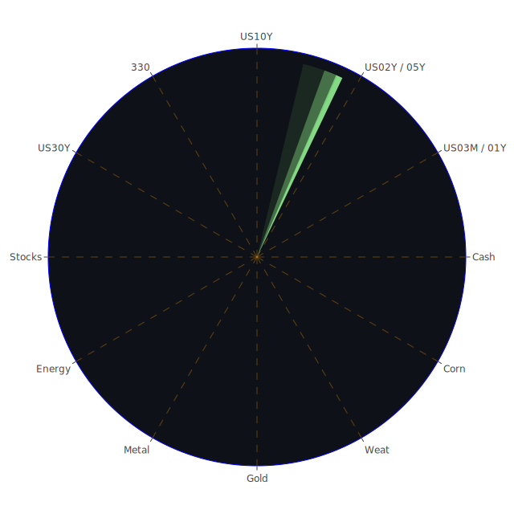

# 一、投資商品泡沫分析

## （一）美國國債
根據最近的市場資料，短天期與長天期的美國國債收益率出現一定幅度的走低或走高波動；如2年期美國國債與10年期美國國債之間的利差依然時常倒掛或接近倒掛區間，顯示短線與中長線對經濟前景的分歧仍在。從歷史經驗來看，當殖利率曲線倒掛時，市場往往對未來經濟狀況更加謹慎，或者預期未來會有貨幣政策轉向。近期新聞顯示，多位機構下修經濟預測，且美國聯準會似乎仍處於較高利率觀望期，暗示資金成本可能持續維持高檔。在社會心理層面，投資人對「避險資產」的需求時高時低：一方面擔心股市大幅回調，另一方面又在通膨與地緣風險反覆下陷入猶豫。博弈論觀點則顯示，各國央行互相牽制利率政策，若某一地區的避險情緒升溫，美國國債價格短線可能受到追捧，但長線利率高企亦可能對價格形成壓力。

整體來說，美國國債短期的風險分數並不極端高，但受市場流動性、聯準會資產負債表收縮以及政府公債發行量較高等因素影響，中長期存在一定的波動。新聞裡提及關於赤字攀升、政府支出壓力增大與債務佔GDP比例持續上揚，都使得投資人在心理上出現對美國國債長期信用風險的警示聲浪，但歷史經驗亦顯示美元體系穩定性相對較強，故泡沫風險仍屬中性至偏低。

## （二）美國零售股
近期數據顯示部份零售公司股票出現獲利預測下修，如大型零售商宣告經濟前景不明朗，導致獲利指引保守。新聞提到美國部分零售類股遭市場拋售，其泡沫風險分數中長期維持在高檔區間，部分零售企業甚至有獲利大幅下滑或裁員的消息。從社會學角度看，零售需求若因消費者情緒轉弱、購買力降低而受影響，會產生疊加效應；心理上，人們對通膨或經濟衰退預期若升高，非必需消費支出自然收縮；博弈層面，若政府祭出新的稅務或貿易保護政策，零售企業也可能因成本上揚面臨壓力。歷史上，零售股不乏在經濟末端循環泡沫化的案例，如2007至2008年時期就有大型連鎖百貨因景氣轉差而股價急挫。綜合來看，目前美國零售股雖非全面崩盤，但確有高泡沫壓力，其D1與短期風險呈現不斷上升的態勢，投資人宜持謹慎態度。

## （三）美國科技股
在新聞中可以看到「特斯拉」與其他高成長型科技公司，近期遭逢不少負面消息；包括執行長在社群媒體的爭議言論、需求疑慮、財報低於預期等，都讓科技股在短期內連續大幅回調。部分「大型科技龍頭」過去被稱為「夢幻7劍客」，在2025年以來股價動能顯示漲多後回檔的風險驟升。而綜觀社會層面，科技產品用戶增長遇到飽和、替代產品競爭激烈；心理層面則可見在高度波動時期，投資人「害怕錯過」與「恐慌拋售」兩種情緒交織。如果從博弈論視角來看，各方對未來技術路線的激烈競爭（如AI與雲端、晶片技術等），使得科技股彼此在資源爭奪與市場估值上仍存在激烈博弈。歷史相似案例如2000年網路泡沫時，市場曾過度炒作科技概念，一旦利率走揚或經濟放緩，引爆一連串股價修正。根據目前的短期風險指標顯示，美國科技股中部分成長型標的的泡沫指數相當高，需特別當心。

## （四）美國房地產指數
綜合新聞及數據看來，美國房地產市場持續面臨升息壓力與高房貸利率衝擊，房市活絡程度減弱。雖然部分地區的住宅價格仍在高檔，且市場普遍認為供給面並未大幅增長，但「實質需求」及「融資條件惡化」仍讓房地產市場壓力日增。回顧2008年房市泡沫經驗，最核心問題在於房貸品質劣化與借貸過度，一旦經濟衰退或失業率上升，就可能使房價向下修正。心理上，民眾見到高房貸利率即容易卻步；若經濟再度萎縮或信用環境嚴峻，房地產指數也可能快速走弱。然在社會學面向，部分地區因人口仍在持續流入（例如特定科技中心城市），即使利率高，對當地房價有相對撐盤。但觀察此類資產風險指標，短期雖非最高，但長期結構性風險不能小覷。

## （五）加密貨幣
根據近期數據，比特幣、以太幣等加密貨幣價格已較之前高點回調不少；新聞亦顯示各種監管、避險情緒交替衝擊市場，投資人心態趨於謹慎。一旦整體股市及高風險資產下跌，加密市場往往也會被拖累。社會心理層面，市場對加密貨幣的狂熱程度較前些年降溫，但仍可能因宣傳或社群效應瞬間升溫。回顧歷史，2017年和2021年都有加密幣的大漲大跌，顯示該類資產週期性泡沫風險極高。數據亦顯示，以太幣與狗狗幣近幾日短線風險拉高或回落交替，但長期來看波動仍屬劇烈。新一輪政策面，尤其對交易所合規及法定貨幣監管的要求，可能影響投資人情緒。投資者若看好區塊鏈技術長遠應用，應分散佈局而非重壓，因為短期泡沫風險仍在高檔。

## （六）金 / 銀 / 銅
近期金價一度居高不下，特別是在市場避險情緒升溫時，黃金常常發揮對沖價值；多則有新聞提到通膨或地緣衝突的反覆讓金屬成為保值標的。銀與銅則常被視為工業需求的晴雨表：若經濟展望疲軟，銅價會受到壓力；若市場對綠色能源、電動車等需求看好，銅價又會得到支撐。在歷史上，金價在全球動盪時往往持續走強，但倘若利率往上走到一定水準，黃金也不一定能長期維持高點。近期數據顯示，金的泡沫風險並非最極端，但仍有一定中高風險；銀價則波動更大，泡沫風險時有升溫；銅的短期與長期風險介於中等，意味著對全球景氣敏感。若前景走弱，銅需求會下滑；若有基建或新能源投資計畫，銅價又可能再漲。投資人應當有足夠風險承受度，再考慮進入。

## （七）黃豆 / 小麥 / 玉米
這幾種農產品有對應的ETF，如SOYB、WEAT、CORN等，近期雖然波動並非絕對劇烈，但部分新聞顯示關稅政策與極端氣候對農作物產量的影響。若天氣因素或地緣政治（如糧食出口禁令）發酵，就可能使此類商品價格飆漲。社會學角度而言，農糧價格牽動民生消費與通膨，是容易產生政治議題的區塊。歷史上1980年代或2007～2008年糧價動盪都衍生社會不安。若未來全球再度出現貿易阻礙或氣候異常，小麥、玉米短線價格難免大幅波動，心理層面亦會引發「恐慌性採購」。就現有數據看，小麥（WEAT）短線風險分數不算高，但長線若遇天候與政策疊加風險或有抬頭空間；玉米（CORN）也是類似情況，投資人要留意農作物價格劇烈震盪的可能性。

## （八）石油 / 鈾期貨
石油（近期的USOIL）價格在新聞裡屢見波動，尤其在全球需求下滑的擔憂與部分產油國政策變動之間拉扯。從今年看來，石油價格曾經在需求預期不佳的情況下出現長期偏弱，但若地緣局勢緊張或某些產油國減產，油價又可能大幅反彈。歷史上，經濟衰退初期常見油價下跌，但戰爭或地緣政治可以快速扭轉供給面。鈾期貨（UX）雖是較少人關注的品項，但近年來因核能話題回溫，引發市場炒作，短線風險相對升高。一旦各國推動核能計畫，鈾需求會上漲；若遇到政治或核能發電爭議，情緒又可能反轉。新聞顯示，石油近期普遍偏弱，但若市場再度「風險開啟」，商品多頭也可能隨時捲土重來。此類商品投資需留意宏觀與地緣風險，不可輕忽泡沫化危險。

## （九）各國外匯市場
美元指數在2025年顯示較大波動：通膨趨勢、美國政局、不斷變化的關稅政策與各國貨幣政策競合，皆使外匯市場難以預測。英鎊、歐元、澳幣、日圓等匯率，新聞裡也提到日本面對外界對其干預匯市的「誤解」，英國、歐洲整體還受到通膨與能源壓力干擾。歷史教訓告訴我們，外匯市場受到的心理層面驚恐指數也不可小覷，投資人一旦預期匯率大幅波動，通常短時間就可能看到匯價極端走勢。若採用博弈論觀點，各國央行意圖保持出口競爭力或壓制進口通膨，互相施力的結果，往往導致匯市震盪不休。整體而言，外匯投資者需要關注美國利率政策走向，也需留意地緣政治。如英鎊、澳幣在數據上短期風險分數處於中到偏高的區間，不可掉以輕心。

## （十）各國大盤指數
綜合歐美與亞洲主要大盤指數看來，歐洲與美國市場受關稅衝擊、科技股回調及經濟預期下修等多項利空壓制，新聞反映多空情緒交織；部分亞洲市場如中國、台灣、韓國的指數也因對美國出口放緩而受衝擊，但偶爾又被內需政策短線托底。歷史案例如2018～2019年的貿易戰期間，指數呈現持續性震盪或長期壓力。如今2025年在後疫情與新衝突局勢的疊加下，市場呈現「區域分化」加劇。大盤指數的泡沫風險上，在美國科技與金融股估值偏高的狀況下，普遍風險較高；而其他地區雖然估值相對便宜，但可能受全球需求不振而遲遲無法脫離谷底。投資人若進場大盤ETF，宜審慎評估全球與區域基本面。

## （十一）美國半導體股
半導體類股（如NVDA、AMD、INTC、MU等）相當敏感於景氣循環與技術變革。新聞中提到AI等高需求題材確實支撐了晶片股一段時間，但近期財報若不及預期，或者市場需求趨於保守（包括資料中心或消費端需求減弱），股價就容易大跌。社會層面上，晶片在所有科技領域的地位舉足輕重，且各國競爭態勢激烈。心理層面上，投資人時常被「尖端技術將撐起未來」的樂觀想像推動，但也擔憂科技資本支出縮減的風險。歷史可對照2000年網路泡沫與2021年疫情後的半導體缺貨狂潮，不同的週期都讓半導體面臨「由盛轉衰」或「從衰轉盛」的急轉彎。就近期風險分數觀察，不少半導體公司短期與中期風險指標不低，顯示漲多後的泡沫成分，須注意回調風險。

## （十二）美國銀行股
銀行股泡沫潛在風險在於利率調整的衝擊；若利差收窄或貸款成長趨緩，盈利空間將受影響；同時市場對金融風險容忍度降低，任何消息如呆帳上升、商業房地產不良貸款攀升，都能引爆恐慌。新聞顯示，銀行股有因「貸款需求減弱」與「消費者信用風險升高」而承壓的跡象。此外，社會心理層面對2008年金融危機尚存陰影，一旦出現信用鏈條鬆動，市場反應往往劇烈。博弈論下，各銀行為了維護流動性與資產負債表穩定，可能收縮放貸，導致經濟面陷入惡性循環。就歷史經驗而言，當資產負債表惡化與外部環境壓力同時出現時，金融類股下跌可非常深。近期資料顯示，中大型銀行泡沫分數偏高，不宜忽視。

## （十三）美國軍工股
軍工股通常與地緣政治與國防預算掛鉤。新聞指出地緣衝突仍在持續，某些軍工企業受惠於國防合約擴張，不過也有企業面臨供應鏈或預算上限的煩惱。歷史顯示軍工股在危機時相對抗跌，但若全球局勢趨於和緩，則可能回吐漲幅。在社會層面，人道與外交輿論壓力也會間接衝擊軍工產業擴充。近期數據看來，軍工類股的短期風險偏中高，投資人切勿把它當作零風險的避險標的，一旦國防訂單延遲或預算縮減，也會影響企業獲利。

## （十四）美國電子支付股
近年來線上交易、行動支付盛行，加之電商蓬勃，電子支付公司成長性被看好。但新聞也提到該領域競爭激烈，成本與手續費利潤空間可能壓縮。回顧過往如2000年或2008年，電子金融服務領域在市場震盪時受風險偏好衝擊不小。此外，社會心理觀察顯示大家越來越依賴非現金支付，一旦出現黑天鵝（例如資安危機、關鍵系統癱瘓），也可能導致用戶流失或監管當局施壓。風險分數顯示不少電子支付龍頭公司短期與長期都在高位，暗示前期漲幅不小或估值偏貴，必須警惕回調風險。

## （十五）美國藥商股
藥商或生技類股通常受到政策、研發進度、專利到期等影響。若法規面臨改變（例如政府對藥品定價干預加大），則藥商利潤可能受損。歷史上，醫藥股有時可在經濟衰退中維持較佳表現，畢竟需求相對剛性。然而心理層面若出現重要藥證未能通過或嚴重副作用消息，個股跌幅也很驚人。近期新聞與數據顯示，部分大型藥商短期泡沫指標不算極端，但因市場對防禦類板塊預期較高，也不可忽視因估值墊高產生的波動。

## （十六）美國影視股
串流平台競爭激烈，傳統影視公司在轉型中面臨龐大挑戰。新聞屢次報導各家影視公司因訂閱成長趨緩或內容成本居高而獲利疲軟，引發股價壓力。從社會學角度，觀眾的娛樂消費模式不斷變遷；從心理層面看，投資者對流媒體訂閱數、原創內容成功與否都十分敏感。一旦新作集體失利或訂閱增長趨緩，估值就容易被大幅修正。過去發生在DVD時代末期的「轉型陣痛」案例正可參考。風險分數整體偏中高，但不乏投資人認為影視內容仍是長期成長市場。若要佈局，仍須留意訂閱人數、資金流、競爭格局的變化。

## （十七）美國媒體股
媒體股除了與廣告市場循環掛鉤，也受到政治氛圍、閱聽人習慣改變等影響。新聞提到某些媒體企業面臨廣告收入下滑之壓力，加上部分媒體裁員和傳統紙本業務頹勢。博弈論觀察顯示，各大媒體正爭奪線上流量與付費牆策略，但市場飽和度高，競爭相當激烈。歷史中，媒體版塊曾因網際網路的興起出現大量整合與破產潮。風險分數顯示，美國媒體股大多短期已有明顯修正，但若廣告景氣仍不振，股價可能持續承壓。

## （十八）石油防禦股
石油防禦股通常是指在油價波動中相對穩定或與油價連動性較低的能源供應商、管線公司、配銷商等企業。他們具備穩定的現金流，但也會受整體能源需求與油價風向影響。新聞若提到油價下探、需求走弱，防禦型油企也不一定能獨善其身，只是在波動時跌幅稍低。歷史經驗顯示，當油價過度狂飆或暴跌時，整個能源板塊都有風險。風險指數顯示此類公司的短期壓力相對於上游勘探公司略小，但仍需要關注整體景氣。

## （十九）金礦防禦股
金礦股通常在黃金上漲周期中彈性更大，但也包含更高的營運與政治風險，因為金礦企業還有生產成本、所在地政局、勞工糾紛等問題。新聞中若提到某些地區爆發衝突，或者礦場停工，該類股可能大跌；但若金價飆升，金礦企業利潤彈性也很突出。歷史數據顯示，金礦防禦股在黃金牛市能走出超額報酬，但牛市結束時跌勢也更猛。近期金價高檔震盪，金礦股的泡沫指標顯示還在偏高水位，需小心追高風險。

## （二十）歐洲奢侈品股
歐洲奢侈品受新興市場需求推動，包含亞洲地區旅遊、消費復甦，但也受到全球景氣壓力與關稅政策影響。新聞顯示部份奢侈品龍頭財報仍相對強勁，但增長力道已不如前幾年。從社會文化而言，奢侈品需求可能在經濟緊縮周期收縮；心理層面，若高淨值消費者對未來經濟悲觀，支出也會減少。歷史上，奢侈品股在市場繁榮期經常創高，但經濟下滑也會顯著修正。泡沫風險目前中偏高，加上部分歐洲整體經濟增長放緩，對此板塊必須謹慎。

## （二十一）歐洲汽車股
歐洲汽車產業飽受能源轉型與供應鏈斷裂的衝擊，新聞報導顯示部分車廠訂單趨緩，或者面臨電動車轉型壓力。同時，能源價格動盪也會影響生產成本與消費者行為。歷史上，歐洲車廠在數次經濟衰退都承受重大打擊，尤其在高利率或信用緊縮情況下，汽車屬耐久財，需要更高貸款成本，銷量勢必下降。現階段泡沫風險指標對歐洲汽車股並未特別高企，但若利潤表現持續下滑，股價修正空間仍大。

## （二十二）歐美食品股
食品企業通常被歸入防禦性資產，但新聞顯示若遇到原物料上漲、關稅政策變化，或食品安全問題，也會重創企業。社會學角度看，民眾對日常食品有一定剛需，但消費升級或降級仍取決於經濟走勢；心理層面則對品牌忠誠及健康意識影響頗大。歷史案例包括2007～2008年原物料飆漲，導致食品廠商利潤受到擠壓。近來部分食品股短線風險中高，但若經濟惡化，這類日常必需品企業相對抗跌。故整體而言，泡沫風險尚可，但評估估值與未來利潤成長仍須謹慎。

---

# 二、宏觀經濟傳導路徑分析
本報告從空間、時間、觀念三位一體角度切入：  
1. **空間（Spatial）**：全球市場受到美國利率、地緣政治、主要產油國、關稅政策等多點牽動。以地理區域分布來看，美國、中國、歐洲間的進出口摩擦及政策變化，容易透過供應鏈向全球擴散。若某地區因局勢動盪造成物資斷缺，能源與基礎原物料價格往往連鎖波及全球。  
2. **時間（Temporal）**：短期內（數週到數個月）新聞事件情緒主導市場，利率與央行貨幣政策變化帶來即時衝擊；中期（半年到一年）企業財報與經濟數據引導投資方向；長期（多年）則回到科技演進、人口結構、地緣衝突等基本趨勢。近期各指標顯示利率雖然維持高位，但部分要素如通膨減緩、經濟下修，也可能酝釀下一波循環。  
3. **觀念（Conceptional）**：結合經濟學、社會學、心理學、博弈論，經濟學中強調貨幣與財政政策；社會學重視社會認同、消費傾向與政策影響力；心理學揭示投資者的集體恐慌或狂熱；博弈論說明各國及市場參與者間策略互動、信息不對稱與競爭合作的動態。

宏觀層次傳導路徑可簡化為：央行利率政策與政府財政政策 → 企業資本支出與消費者信心 → 進出口與就業 → 更廣泛的資本市場（股票、債券、匯率、原物料）→ 反饋到政策。任何一環發生變動，都可能造成漣漪效應，尤其若高槓桿資產（例如房地產、高收益債）開始出現違約或流動性危機，影響會更大。

---

# 三、微觀經濟傳導路徑分析
從企業、家庭、金融機構等微觀主體來看：
1. **企業端**：利率上升、原物料或關稅成本增加時，利潤空間被壓縮，企業可能縮減投資或裁員，並提高價格轉嫁給消費者；若通膨仍高或需求萎縮，企業也可能面臨庫存積壓甚至破產風險。  
2. **家庭端**：就業不確定性或工資停滯削弱消費意願，房貸利率高漲更讓購房意願降低，也影響汽車、耐久財支出。心理層面上，若媒體報導持續悲觀，將進一步壓抑消費或使儲蓄傾向上升。  
3. **金融機構端**：面對貸款需求下滑和貸款風險上升，銀行和保險等機構保守性提高，更嚴格的放款標準又反過來壓抑企業或個人融資。若風險進一步放大，也會引起流動性擠兌，危及金融穩定。歷史上金融機構的放款緊縮與信用下滑往往形成惡性循環。

---

# 四、資產類別間傳導路徑分析
當前市場顯示，股市、債市、原物料、匯市之間高度聯動。特別是「風險開啟」或「風險關閉」的切換速度正加快。例如：
- **股票與債券**：若美債殖利率飆升，成長型股票壓力往往更大；但若經濟出現明顯衰退跡象，市場往往再次追捧安全性較高的債券。  
- **匯率與原物料**：美元指數若上升，部分大宗商品價格往往相對疲軟；反之亦然。  
- **股市與原物料**：當國際油價或金屬價格因經濟轉差而下滑，會使商品輸出國的股市受衝擊；同時也可能有利於航空、運輸等行業的股價表現，但若總體需求崩潰，則全部下跌。  
- **各資產之間的避險與對沖**：黃金與加密貨幣時而同步時而逆向，取決於投資人對「另類資產」的風險偏好切換；房地產與股票也並非穩定對沖，常常在信用收縮時共同下挫。  
因此，尋找能在相位接近120度、且相關係數約-0.5的資產組合頗具挑戰，需要同時考量宏觀趨勢與市場結構。

---

# 五、根據以上所有分析，尋求風險對沖的投資組合機會
在「空間、時間、觀念」三位一體的基礎上，如運用正反合去簡化可得出：  
1. **正（樂觀命題）**：看好未來科技發展、全球經貿最終回歸穩定；  
2. **反（悲觀命題）**：擔憂地緣衝突、信用緊縮、消費萎縮導致行情深度回調；  
3. **合（折衷命題）**：採取多元對沖、配置彼此相位分散的投資組合。

理想上，若要找相關係數約-0.5且能達到120度相位差的資產，可能需同時布建：  
- 部分股票板塊（例如必需消費、防禦型公用事業）對沖部分高風險成長股；  
- 部分大宗商品（例如農產品或貴金屬）對沖工業金屬或能源敞口；  
- 部分匯率（或境外債券）對沖美元波動；  
- 部分現金或短債對沖流動性風險。

這種組合並不保證絕對獲利，但能在一定程度分散單一市場劇烈波動。如果操作得宜，當某些資產下跌時，另一些資產因負相關或時滯而能相對抗跌，進而平衡整體波動。

---

# 六、綜合前述表格內容之三位一體、兩兩相互驗證的篩選假設分析
根據三位一體（空間、時間、觀念）以及新聞的正負面情緒，對上述多類資產進行兩兩對照，有幾條可能的漣漪傳導路徑：
1. **利率走向與消費信心互相驗證**：若聯準會維持高利率，企業融資成本增高、就業機會減少、消費信心走弱，導致零售股與房地產指數同步承壓，也會擠壓成長型科技股。  
2. **能源價格與地緣政治衝突互相放大**：原油或鈾價格若再度上漲，化工、製造等板塊成本飆升，通膨指標可能反撲，美國國債殖利率也可能重新上揚，造成股債同跌。  
3. **美國債務負擔與市場風險偏好聯動**：若政府赤字率續升，美國國債長端利率易攀升，引發大型金融機構對風險資產減持，而牽動全球股市修正；  
4. **匯率與外資流動傳導**：強勢美元期間，新興市場或非美貨幣往往面臨資本外流；若外資大幅拋售當地股票債券，該區股市與房地產可能下跌，進而拉高全球恐慌情緒。  
5. **加密市場與高風險投資資金連動**：若股市大幅修正，高投機資金亦可能從加密貨幣撤離，觸發加密價格跳水，又在心理層面加重市場恐慌，形成一種「風險資產集體拋售」的惡性循環。  

在以上種種路徑裡，可以見到複雜而多層次的滲透效應。從三位一體正反合角度去審視，即「正向因素」是各國仍有意志維持金融穩定、政策最終可能寬鬆；「反向因素」則是通膨頑固、地緣衝突難解、信用環境收緊；「綜合結果」往往取決於風險與安全偏好如何在市場中對撞，投資人只能根據現況多元分散，審慎布局。

---

# 七、投資建議
在此特別引用歷史上的若干相似場景：  
- **2000年網路泡沫時期**：科技股過度炒作，流動性轉向時引爆大規模跌幅；  
- **2008年金融危機**：房市、金融業槓桿連鎖效應讓市場雪崩；  
- **2020年初疫情**：各國封鎖與流動性寬鬆引發的股債、商品異常波動；  
這些都提醒我們不可忽視「泡沫風險」。  

基於目前環境，建議投資人可考慮三種策略：穩健、成長與高風險，並在各策略中各自挑選三個子投資標的，同時為其配置比例（總計三大類合計為100%）。以下為示意性建議：

1. **穩健策略（約40%）**  
   - (1) 高評級債券或美國短債：目標是擁有流動性與相對安全性。  
   - (2) 防禦型必需消費或食品股：不論景氣好壞，人們仍有剛需。  
   - (3) 黃金：雖有中長期波動，但通常具備避險屬性，能對沖市場恐慌。  

2. **成長策略（約40%）**  
   - (1) 半導體龍頭：即使存在短期泡沫風險，但長期看AI、資料中心仍有機會。需分批布局，以免承擔集中風險。  
   - (2) 網路服務或雲端軟體：雖高估值，但長期需求穩定成長。  
   - (3) 部分新興市場指數：如符合全球供應鏈轉移或人口紅利，有中長期潛力。  

3. **高風險策略（約20%）**  
   - (1) 加密貨幣龍頭：若想參與潛在的高收益，控制倉位在較低比例。  
   - (2) 銀或銅等工業金屬：可能受益於新能源、基礎建設，但波動極大。  
   - (3) 小型高成長科技股：如新創雲端、電動車供應鏈，漲跌劇烈，需高度自我風險管理。  

此配置僅作思路參考：因人而異，投資人應先評估自身風險承受度與資金成本後，再行動。建議適度分批進場，定期複檢基本面與估值，且避免盲目追高。

---

# 八、風險提示
1. **不可忽視泡沫風險**：無論是科技、房地產、加密貨幣或其他領域，一旦資金面或信用面顯著收縮，就可能讓泡沫瞬間破滅。  
2. **市場總是充滿不確定性**：地緣局勢、國內政治、貿易關稅政策等皆可能瞬息萬變，不要被短期訊號迷惑或過度自信。  
3. **建議僅供參考**：投資者應根據自身風險承受能力和投資目標做出獨立決策，可多方瞭解歷史經驗和研究報告，並持續跟蹤市場變化。  

投資並非只憑一時新聞或數據，更非單憑他人建議即可獲利。我們依據空間、時間、觀念三位一體進行了宏觀與微觀、資產間的傳導路徑分析，並歸納出在避險對沖、分散風險的策略下，依據穩健、成長與高風險做出適度的組合設計。未來一旦市場發生劇烈轉折，須適時調整配置。如此方能在風高浪急的全球投資環境中，力求穩中帶進、進中帶防，為可能的波動做好心理與資金面的萬全準備。

 
Daily Buy Map:

 
Daily Sell Map:

 
Daily Radar Chart:

 
