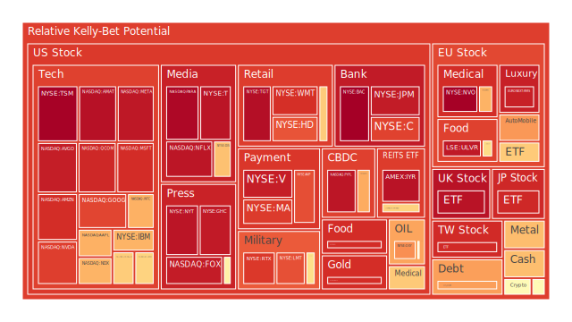

# 投資商品泡沫分析

以下以「三位一體正反合」作為思維框架，從空間(Spatial)的全球市場布局、時間(Temporal)的趨勢演進、概念(Conceptional)的理論與心理面闡釋，逐一探討各資產板塊之現況與潛在風險，並且引入新聞事件的觀察視角。所有資產評估均假設泡沫分數（當日D1分數到月平均D30分數）越高表示風險越大，當前價格則以PP100作為大致的參考值。

## 1. 美國國債

在Spatial層面，美國國債一向是全球避險資產的首選，但近期各新聞報導反映了美國與他國之間的經貿與地緣政治摩擦，包括對他國貨品加徵關稅，以及國內通膨與就業市場數據不一致等，令部分外國持債者開始調整美債配置。  
在Temporal層面，最近幾年美國國債收益率曲線變化頗為劇烈，尤其短端利率（如2Y、3M）與長端利率（如10Y、20Y、30Y）出現過倒掛。近期數據顯示10Y與3M的利差有所改變，從過去的嚴重倒掛漸漸轉向略微收斂，但未必代表未來不會再度走向衰退訊號。  
在Conceptional層面，經濟學上常以美國國債作為風險貼水的核心參考。社會學與心理學觀點認為，投資者對「美國信用」的依賴是一種長期根深蒂固的集體共識，突發事件（如地緣政治衝突、政府預算問題）會快速影響債券價格。博弈論則顯示，當多數機構投資者同時擔心預期利率或通膨不穩時，拋售國債可能一次到位，引發收益率飆升，反而引起新的買盤。

綜合來看，目前美國國債部分的泡沫分數雖未偏高，但長端已出現收益率重新升至4.5%以上的情況。新聞中反覆提及「市場對於關稅、地緣衝突以及政府財政壓力的擔憂加劇」。若美債長端收益率繼續上行，可能代表更多人對美國長期債務狀況感到憂慮。雖然國債相對於其他資產來說較為穩健，但也不得不留意負債規模不斷膨脹、債券流動性與市場信心之間微妙的博弈。

## 2. 美國零售股

美國零售股近期泡沫風險升溫。部分零售品牌（如與日常家庭消費相關者）近幾週股價波動劇烈，新聞裡頻頻看到「零售銷售預期不佳、企業財報指引下修」的負面標題。例如某些信用卡與購物通路相關企業（符號如COF等），D1到D30的泡沫分數並不算最高，但在消息面上多次受到「消費者信心下滑」「就業不穩」的衝擊。  
在Spatial層面，零售股會隨著不同地區的消費趨勢而異，國內零售銷售放緩，海外市場若無法成為新成長動能，就可能引發獲利壓力。  
在Temporal層面，前些年疫情後，零售業一度迎來報復性消費，但如今通膨壓力與購買力減弱交互影響，可能進入長期趨緩期。  
在Conceptional層面，心理學指出，消費者對宏觀經濟悲觀時，常減少非必需品支出。社會學面向顯示，當中低階層的實質所得因通膨與薪資不足而受損，零售業體感銷售自然無法亮眼。博弈論則顯示大型零售商會想辦法以降價或促銷互相競爭，導致利潤空間受壓縮。

## 3. 美國科技股

新聞所謂「科技七巨頭」（Magnificent 7）在前一段時間炒作AI概念時，股價飆升。但近期多家報導指出「市場對過度炒作AI題材產生疑慮」，且某些龍頭企業財報指引不如預期，使投資人重新評估高估值科技股的真實收益。  
Spatial層面來說，美國科技在全球市占率依舊驚人，但中歐等地的競爭對手也在加速發展相關技術。  
Temporal層面，科技股自2020年以來歷經大漲與大跌交錯，目前有再次大漲後的震盪期風險。當泡沫分數接近0.8甚至0.9以上時，可能面臨獲利了結賣壓。  
Conceptional層面，經濟學理論認為科技創新能驅動長期成長，然而短期股價漲勢通常摻雜「過度樂觀」的情緒預期。社會心理學指出，當社會輿論一面倒地相信「AI革命」將帶來翻天覆地的改變時，投資者容易群體催化並推升股價至不合理的高點。博弈論則提示，一旦有多數機構同時轉向保守估值，這些籌碼將雪崩式撤離。  
部分新聞顯示，近期特斯拉（TSLA）因市場對電動車需求下滑憂慮，股價震盪明顯，泡沫分數雖不及最高檔，但仍顯示中高區間風險。另有晶片大廠在AI浪潮中大漲，但近來也隨NASDAQ指數重挫而呈現顯著回調，說明籌碼流動性高度集中在短線投機手中。一旦宏觀數據不符預期，可能帶來明顯殺盤。

## 4. 美國房地產指數

新聞提到固定30年期房貸利率已比去年略降，但整體仍處於6.5%以上的高檔水準，對購房需求形成壓力。  
Spatial層面，美國各區房地產狀況分化，矽谷、紐約等地房價雖松動，但基期依舊高。中部地區則相對平緩。  
Temporal層面，疫情後的低利率時代一去不復返，現今利率上升使房地產市場成交量萎縮。雖然尚未全面崩盤，但許多貸款違約與商業不動產壓力漸增，尤其在都會商辦空置率問題加重的情況下，市場對未來資產估值相對保留。  
Conceptional層面，社會學觀點認為，民眾對房地產的「安定感」心理一旦有所動搖，市場交易量急凍，恐讓價格下跌急劇。博弈論則暗示，一旦銀行收緊房貸或提高貸款利率，潛在買家與建商都可能陷入彼此觀望。  
目前某些指數的泡沫分數顯示中高風險，尤其是與不動產ETF或REITs相關的標的，其D30整體分數在0.8左右。新聞也警示部分地區的商業房地產正陷入價格修正期。若經濟衰退風險升高，不動產資產價格可能再度出現斷崖。

## 5. 加密貨幣

加密貨幣在本次新聞裡不乏負面消息，例如「美元疲弱」同時又出現「穩定幣立法前景推動」，然仍有不少投資人寄望加密貨幣作為避險或投機標的。  
Spatial層面，加密貨幣是全球跨國交易，社會接受度不斷上升，但同時面臨監管不明朗的挑戰。  
Temporal層面，比特幣一度衝高至八萬多美元，但之後又經歷大幅回落。以太幣等其他主流代幣大體走勢震盪，某些波動更劇烈。  
Conceptional層面，經濟學有一派認為加密貨幣可能會融入主流金融體系，但也有人認為它們是典型泡沫。社會心理學提示，對新世代的投資者而言，加密貨幣帶有「去中心化理想」的情懷，容易形成群體共鳴。博弈論層面，若主流金融機構同時入場或撤離，行情瞬間轉折可能劇烈。  
目前觀察部分加密貨幣的泡沫分數約在0.4-0.5之間，雖非極端高檔，但投資風險仍屬相對高位。一旦市場消息出現重大變動，例如監管政策、資金流動限制或大型交易所破產等，都可能引發急速回調。

## 6. 金/銀/銅

從Spatial角度來看，金屬資產作為全球重要原物料與避險工具，受到供需與貨幣政策雙重影響。  
Temporal層面，金價曾在通膨最嚴重時飆高，但近來有回調跡象，金銅比與金油比也在最近幾個月出現不同程度的波動。最新觀察到金油比約在40上下，對照去年同時期的20多，代表黃金相對於石油在價格上仍處於較高位置。  
Conceptional層面，經濟學中的「避險需求」與心理學中的「人類對黃金的傳統信任」相結合，讓黃金往往在經濟不確定時展現支撐。但社會學的角度提醒，當全球景氣真正惡化，實體消費需求（如銅、銀在工業領域的使用）也會同步走弱，導致金屬類商品出現供需再平衡。  
短期內金與銀、銅的泡沫分數整體介於0.45-0.75，顯示並非最危險的高點，但若通膨壓力及地緣動盪再起，也可能再度帶動金屬價格衝高。

## 7. 黃豆 / 小麥 / 玉米

農產品價格易受到天災、地緣政治以及生物燃料需求等因素影響。近期新聞提到生質柴油需求攀升，導致棕櫚油等油脂類價格上漲，小麥相關報導則提及「輸出國天候欠佳」，故小麥期貨震盪。  
Spatial角度：全球各主要產地的氣候與貿易政策會直接左右農產品價格。若哪個地區施行出口限制，或某地因洪水、乾旱而欠收，皆能在幾週內推動國際期貨價格急漲。  
Temporal角度：隨著世界各國轉向生質能源需求，小麥、玉米、黃豆的用途不再僅限食物，而有替代能源價值。這種趨勢在未來數年可能持續。  
Conceptional角度：博弈論指示，每一個主要出口國都想穩定內部糧食，必要時會限縮出口，導致國際市場更易炒作農產品價格。社會心理層面則暗示，糧價的波動通常會引發社會對通膨的直接感受，從而影響民生與政治穩定。  
目前部分黃豆、小麥、玉米的泡沫分數仍屬中位。市場擔憂若極端氣候加劇或地緣摩擦擴大，這類必需農產品的價格可能面臨又一波漲勢。

## 8. 石油 / 鈾期貨UX!

石油價格近期受多重消息影響，有關地緣政治衝突、OPEC產量策略與全球需求前景都在新聞裡反覆提及。最近某些能源企業高層對產量前景表示悲觀，暗示未來可能進入供需重新洗牌階段。鈾期貨（UX）則隨核能重新受到重視而波動。  
Spatial角度：中東與俄羅斯等主要產油國的政策立場、歐美國家對俄羅斯能源的制裁與替代策略會重塑石油供給版圖，而鈾礦資源同樣集中在少數區域。  
Temporal角度：當原油庫存意外下滑或地緣緊張，油價常瞬間飆升，但長期趨勢仍取決於經濟活動是否延續，以及未來幾年再生能源佔比提升的速度。鈾價則與核能政策有極大關係，一旦各國重新評估核電比例，鈾市可能進入新一輪投資與投機。  
Conceptional角度：經濟學常討論石油對整體經濟的影響層面最廣，一旦油價大幅波動，會透過運輸與製造成本牽連到通膨與就業。心理學面向來看，石油市場容易因突發大事件而出現恐慌性買賣。博弈論則展現在OPEC與主要石油消費國的價格角力。鈾期貨則多了一層「核能評價」的政治與心理爭議。  
目前石油的泡沫分數在0.05-0.2區間，顯示在過去幾天曾大跌後暫時緩和。鈾期貨UX亦未見極端高泡沫水準，但若核能應用的政策聲量再次攀升，仍有走高風險。

## 9. 各國外匯市場

美元指數近期走弱，新聞標題如「美元今年以來表現最差」顯示市場正重新評估美國通膨與Fed政策前景。日圓則時有避險情緒支撐，英鎊受到英國通膨、脫歐後經貿不穩定因素干擾，歐元也因歐洲內部能源與經濟衝擊而震盪。  
Spatial角度：全球貨幣相互影響，美國與日歐中等主要經濟體之利率政策不一致，造成熱錢短期快速流動。  
Temporal角度：在疫情後階段，貨幣市場波動相較以前更為劇烈，因各國央行的政策落差拉大。有些觀察報告認為未來一年國際外匯市場依舊震盪不安。  
Conceptional角度：匯率與國家權力、社會情緒、心理預期等深度交織。若未來出現意料之外的地緣政治衝突或國內財政風險，匯率可能瞬間爆動。博弈論意涵在於各國央行往往會透過調升或調降利率來影響本國貨幣的相對強弱。  
目前外匯泡沫分數尚不算特別高，但匯市風險不只是「泡沫」問題，而是大幅波動產生的衝擊。例如美元若再度急貶，可能使原本以美元計價的金融資產競爭力下降，造成國際資金重新配置。

## 10. 各國大盤指數

包括美國大型綜合指數、歐洲主要指數，以及日本、台灣等地區性指數，近期普遍面臨修正壓力。新聞裡多次出現「指數大跌，市場對經濟前景悲觀」的報導，也提及地區差異：例如歐洲奢侈品股帶動歐洲某些股市熱度，但地緣與能源風險仍讓市場不敢過度樂觀。  
Spatial角度：當美國股市遭遇系統性風險時，往往迅速波及全球，因投資機構會同步調整資產配置。  
Temporal角度：全球股市從2020年大幅下跌到2021年、2022年波動，2023-2024出現一波反彈，如今在2025年初期又面臨新的壓力測試。  
Conceptional角度：大盤指數反映的是整體經濟健康度與市場投資者情緒。同時亦顯示在社會心理學上「若多方無力維持信心，空方力量就可能急速擴大」。博弈論在於，若指數期貨出現大額空單，同時伴隨現貨賣壓，短期內的跌幅會被放大。  
整體來說，大盤指數的泡沫分數大多在0.7-0.9不等，一些反映高價權值股的指數接近0.95以上，已是相當高的區域，一旦獲利了結與空頭情緒增強，便可能引發數百或上千點的波段修正。

## 11. 美國半導體股

半導體是科技產業的關鍵命脈之一。先前在AI晶片熱潮加持下，某些大廠股價飆升，但最新新聞顯示「市场对AI爆發的需求是否有過度推高」的質疑聲浪增加。  
Spatial角度：半導體供應鏈涉及美、台、韓與歐洲等國。美國廠商在上游設計環節佔主導地位，但生產代工分散在亞洲，地緣風險仍存在。  
Temporal角度：從2022年中旬的晶片短缺逐漸過渡到2023-2024年的產能過剩疑慮，現今2025年市場又在談AI與高效能運算，但需求曲線是否足以支撐如此高的本益比，仍須時間驗證。  
Conceptional角度：經濟學上，半導體景氣循環通常3-4年一個周期。心理學層面來看，AI題材容易吸引大量投機資金。博弈論層面，若各國都想扶持本土晶片業，可能造成補貼與貿易限制，使市場競爭更激烈。  
目前許多半導體龍頭的泡沫分數約在0.70-0.95之間，表示潛在風險頗高。一旦市場對AI前景降溫或宏觀經濟不佳，股價回檔力度可能相當可觀。

## 12. 美國銀行股

新聞近來提到「美國銀行股因經濟衰退疑慮、貸款違約率上升而承壓」，部分銀行評級遭下調。從某些符號（如BAC）可見其泡沫分數接近1，顯示市場對其前景相當擔憂。  
Spatial角度：全球銀行業都在面對經濟週期壓力，但美國銀行特別受到Fed升息政策與商業地產不良貸款的雙重影響。  
Temporal角度：在2020年發生金融緊張後，2021-2022年銀行獲利一度回溫，但2023-2024年開始，經濟走緩與債務風險增加，如今2025年狀況更趨複雜。  
Conceptional角度：社會心理方面，銀行若被認為資本充足度不足或涉入高風險貸款，民眾和投資人很快就會失去信心。博弈論層面，一旦有風險事件爆發，擠兌或機構大規模提款將擴散到整個金融體系。  
對此類股需嚴防任何突發消息，如大型客戶流失、商業房貸大面積違約等，都可能造成股價一次性劇跌。

## 13. 美國軍工股

近期美國軍工相關消息較為複雜：一方面地緣衝突不斷，市場認為軍工需求不減；另一方面，若國會預算緊縮，將影響軍工訂單規模。此外，新聞中見到某些軍工企業被指開發成本過高或進度落後，也使投資者擔心。  
Spatial層面：美國軍工出口遍及全球，但也可能因國際政治風向改變而受限。  
Temporal層面：軍工股在大多數地緣緊張階段往往走強，但若衝突急速降溫或政府財政壓力增加，預算有機會縮水。  
Conceptional層面：心理學顯示，投資人對軍工股常有「防禦性」的刻板印象，認為其不易受景氣波動影響；但事實上若公共支出被用於其他急迫經濟紓困，軍工經費仍可能遭削減。博弈論角度來看，各國之間軍事競賽越激烈，美國軍工企業就越有訂單。  
目前軍工股泡沫分數多半在0.60-0.80左右，算是中高水準，但尚未達到極端。投資者宜持續觀察國防預算動向與主要衝突地區的戰事走向。

## 14. 美國電子支付股

電子支付與FinTech相關企業常被認為成長性高，但當經濟前景不明朗、消費力下降，交易量也可能不及預期。新聞顯示部分支付服務商指引不佳，另有新創競爭擾動市場。  
Spatial層面：電子支付全球化明顯，但區域性監管與行動支付習慣差異巨大。  
Temporal層面：疫情期間推動電子支付普及，之後需求有放緩跡象；未來隨著國際旅遊恢復，也會刺激跨境支付增長，但競爭激烈。  
Conceptional層面：心理學表明，消費者對新支付工具若缺乏信任或使用便利性不足，就難以大規模採納。博弈論顯示支付平台之間的補貼、手續費調降或戰略合作，也會快速改變市場格局。  
目前部分電子支付股的泡沫分數高居0.90以上，暗示估值積累了相當多對「數位化」的樂觀憧憬。一旦財務表現證實無法對等支撐，股價可能出現高位回檔。

## 15. 美國藥商股

製藥產業在經濟下行時通常更具防禦性，但並非絕對。若研發重磅新藥成功，股價常急速飆漲；若臨床試驗失敗或專利到期，衝擊也會很大。新聞顯示近期有些藥廠面臨專利懸崖或競品威脅。  
Spatial層面：藥廠與全球醫療保險制度、政府藥價管制等相關，影響複雜且地域差異大。  
Temporal層面：藥品研發週期長，可能經歷多次臨床試驗與審批過程。成功或失敗往往在市場上引發大幅震盪。  
Conceptional層面：社會學上，民眾對藥價的可負擔性、政府對健保制度的補助都會影響藥商利潤。心理學層面，若某新藥關乎嚴重疾病，市場預期常被情緒放大。  
目前美國藥商股的泡沫分數分化，有些在0.5-0.6，有些靠近0.85以上，不可一概而論。投資人需評估各家管線進度與法規風險。

## 16. 美國影視股

疫情後串流平台崛起，傳統影視公司在觀眾需求轉移下面臨挑戰，近年合併與重組頻繁。新聞報導某些影視股因訂閱成長放緩而股價大跌，或者因新作發行成績不佳，引發獲利預警。  
Spatial層面：美國影視輸出全球，但各地區對串流與傳統電視媒體的接受度有所差異。  
Temporal層面：影視產業常有季節性特徵（檔期效應），加上疫情期間平台訂閱用戶數激增，現今進入後疫情時代，成長曲線往往減速甚至倒退。  
Conceptional層面：社會心理學顯示，大眾對影視娛樂的需求雖不會消失，但多元平台競爭下，用戶黏著度不再穩定。博弈論凸顯大型平台間爭奪優質內容或獨家版權，成本高昂。  
整體而言，部分影視股泡沫分數可達0.85-0.90，在資金面緊俏或廣告收入疲弱的時期特別危險。

## 17. 美國媒體股

和影視股類似，但更著重在新聞、廣告、出版等傳統媒體與網路媒體的整合。新聞顯示許多媒體公司經歷改組、裁員與數位轉型。廣告市場景氣下滑，更讓媒體營收承壓。  
Spatial層面：美國媒體在全球擁有龐大影響力，但也受到各地不同審查、競爭與文化需求的衝擊。  
Temporal層面：過去十年媒體業從紙本走向數位化，疫情加速線上服務的普及，如今2025年在經濟壓力下，廣告主預算縮減。  
Conceptional層面：社會學上，媒體的公信力與讀者習慣正處於深層變革。心理學上，閱聽眾對內容付費的意願仍有限。博弈論顯示，各媒體可能爭奪話題或流量，互相競合。  
此領域泡沫分數多半中高，若市場進一步下行，媒體廣告收入會更快萎縮，建議留意營運現金流狀況。

## 18. 石油防禦股

這類標的通常聚焦在石油開發後段、管線維護、煉油、石化加工等相對穩定的環節，被視作能源類的「防禦性」資產。因其利潤對原油價格的波動較為敏感，但也能受益於煉油價差。  
Spatial層面：這些公司多半區域分工明確，全球都有業務布局。  
Temporal層面：原油價格大漲時，煉油和下游加工未必同步獲利，因為毛利空間也可能被上游成本或政府管制所壓縮。但在油價相對穩定且維持中高水準時，防禦股通常獲利不錯。  
Conceptional層面：經濟學上，因石油需求仍占全球能源主流。社會心理學提示，民眾對化石燃料的環保疑慮也在升高，一旦政策對於碳排放更嚴厲，這些企業的營運模式需轉型。  
眼下石油防禦股泡沫分數介於0.68-0.80。若經濟衰退導致總需求疲軟，可能對該類股不利；但若地緣風險或原油減產政策升溫，又可能短期內推高煉油利潤。

## 19. 金礦防禦股

金礦與金屬開採類股被視為避險資產的延伸，一旦金價看漲，金礦股通常有放大效果。  
Spatial層面：金礦主要分布在北美、非洲、澳洲等地，政治穩定度與當地稅制、基礎建設都會影響生產成本。  
Temporal層面：金價若維持高檔，礦業公司會擴大投資產能，但通常需要時間才能轉化成產出，並且伴隨探勘與開發風險。  
Conceptional層面：心理學上，投資者面對通膨和市場混亂時，往往湧入黃金市場，進而推升金礦股。博弈論透露，若美元進一步走弱且地緣情勢持續緊張，金礦商受益。  
當前金礦股泡沫風險大致在0.82-0.86之間，屬中高水準，表示市場對未來金價看漲意願頗強，但也意味著若金價回落，股價修正恐相當劇烈。

## 20. 歐洲奢侈品股

歐洲奢侈品長期以來受益於全球富裕階層與觀光旅遊帶動，但也極度依賴中國、美國等市場消費，尤其在經濟低迷時，此類產品銷售敏感度高。  
Spatial層面：奢侈品牌遍佈全球，但歐洲仍為核心設計與行銷根據地。  
Temporal層面：疫情後很多人重啟旅行與高端消費，但一旦全球經濟轉弱，奢侈品往往首當其衝。  
Conceptional層面：社會心理學指，奢侈品消費有象徵地位與自我認同意涵，經濟低迷未必會馬上停止高端消費，但增長動力會減弱。博弈論上，各大品牌彼此競爭同時，也聯手維持價格與形象。  
短期觀察，歐洲奢侈品股泡沫分數約0.70-0.80之間，有些龍頭甚至逼近0.90，代表預期很高但潛在風險也偏大。

## 21. 歐洲汽車股

歐洲汽車業面臨電動化與環保法規挑戰，也要同時因應電池原料成本、國際關稅與地緣政治衝擊。若中國市場需求放緩或與美國陷入關稅爭端，對歐系車廠殺傷力大。  
Spatial層面：歐系車品牌於全球通路深耕，但供應鏈多半在歐洲本土，也和亞洲電池廠合作，受國際局勢影響大。  
Temporal層面：電動車在近五年間迅速發展，傳統車廠都在加碼布局，但研發與生產成本高，獲利未必短期能顯現。  
Conceptional層面：社會學與心理學顯示，歐洲人對環保節能的意識高，但價格敏感度也不低。博弈論提示，車廠之間的價格戰或技術合作都會瞬間改寫市場格局。  
最近歐洲汽車股的泡沫分數約在0.40-0.60之間，相較於其他板塊不算特別高，但若全球經濟惡化或關稅爭端再起，亦可能下探。

## 22. 歐美食品股

食品產業通常偏向防禦性，但也要看原料成本、物流及通膨對消費者的實質衝擊。若黃豆、小麥等成本暴漲，食品公司利潤將被侵蝕；但若能成功轉嫁給消費者，仍可維持獲利。  
Spatial層面：歐美食品巨頭多為跨國經營，在通膨與供應鏈中斷時，有能力四處調度原料，但相對也要承擔匯率與政治風險。  
Temporal層面：食品行業短期需求相對穩定，但若長期面對糧食危機或環保壓力（如水資源問題），供應鏈需重新規劃。  
Conceptional層面：社會學觀察，民眾對必須食品會繼續消費，但對高級零食或休閒食品可能壓縮預算。心理學面，品牌忠誠度的高低會影響銷售。博弈論顯示，大型食品公司之間或會以價格戰、策略合作來維持市占。  
目前歐美食品股泡沫分數大多在0.70上下，仍有潛在壓力，但因屬民生剛性需求，跌幅通常不似高成長股那麼劇烈。

---

# 宏觀經濟傳導路徑分析

在宏觀層面，整體經濟有幾條主要傳導路徑可能導致各資產連動變化：

1. **利率與貨幣政策路徑**  
   Fed持續關注通膨與就業，新聞提到「Fed鷹派發言減少，但仍有升息或緊縮傾向」。利率上調將推升企業融資成本，抑制消費與投資，進一步導致股市疲軟、不動產回落，而銀行股面臨壞帳風險。

2. **地緣政治與國際貿易路徑**  
   美國對他國課徵關稅衝擊全球貿易鏈，歐洲及亞洲多國亦採取對抗性關稅反制，導致外匯市場與大宗商品波動。能源價格也會因地緣衝突而起伏，進一步影響各行業成本結構。

3. **金融槓桿與市場流動性路徑**  
   當市場擔憂衰退、銀行放貸謹慎，資金成本上漲，投資者會傾向減少高風險部位。若發生信用事件，可能演變成大規模去槓桿，使高估值資產率先崩跌。

4. **消費與企業獲利路徑**  
   若就業市場放緩、工資成長減速，民眾實質購買力下降，零售銷售萎縮，企業利潤亦隨之收斂，反映到股價與企業債。若再遇上原物料成本增加，獲利更壓縮。

---

# 微觀經濟傳導路徑分析

在企業與行業層次，傳導路徑集中於以下面向：

1. **供應鏈上下游傳遞**  
   若上游原材料價格（例如農產品、石油、金屬）上漲，則中下游產品成本提高，企業毛利下滑。同時若消費端無法承擔提價，企業必須自行吸收。

2. **金融成本與流動性**  
   利率上升會增加企業債務的利息負擔，特別是財務槓桿較高的成長型公司，如電子支付、半導體或科技新創。當融資受阻，研發與擴張計畫就可能延宕。

3. **產業替代效應**  
   當石油價格過高，部分產業會轉用替代能源；農產品價格升高，或許帶動其他飼料或代用原料需求上升，也會形成不同板塊之間的消長。

4. **心理預期對企業決策的影響**  
   若管理階層對未來景氣看淡，可能提早裁員、縮減庫存，進而造成整體經濟的負向循環。反之，若市場忽然見到大規模財政刺激或國際協議利好，企業計畫也會迅速反轉。

---

# 資產類別間傳導路徑分析

1. **國債與股票的資金再平衡**  
   風險升溫時，投資人從股票撤出資金轉向國債，造成股市下跌、債券價格上漲，利率下行。但若Fed大舉升息或財政壓力過大，國債收益率也可能一同被推升。

2. **大宗商品與新興市場貨幣**  
   大宗商品價格漲跌會影響新興市場的貿易收支，進而影響匯率。若某些新興市場依賴出口石油或農產品，可能因價格上漲獲利，但一旦全球需求減弱或面臨關稅障礙，匯率也會出現波動。

3. **科技股與半導體、銀行股之互動**  
   科技業需要龐大融資與資本開支，銀行的貸款成本與信用評級會影響其研發與併購計畫。若銀行體系出現不穩，科技股融資成本提升，反向壓抑科技創新速度。

4. **金屬與軍工、建築、汽車產業的互鎖**  
   銅等基礎金屬對建築與汽車業至關重要，若金屬價格高企會壓縮車廠與營建公司毛利；軍工需求則可能搶走一部分金屬資源，導致供給緊張。

---

# 投資建議

以下就穩健、成長與高風險三大類，分別提出可在當前環境下相對合宜的配置與比例範例（總和為100%），並警示可能的泡沫與風險。此處僅為示意性組合，實際投資仍須考量個人風險承受度。

1. **穩健型（約40%配比）**  
   - **美國國債（約15%）**：雖然長端利率仍有波動風險，但對比股票波動，國債仍是相對安全。可考慮梯次配置於2Y與10Y，平衡利率風險。  
   - **金屬防禦（約15%）**：選擇金礦防禦或金本位ETF之類，作為抵禦通膨與地緣衝突的配置。  
   - **歐美食品股（約10%）**：此類民生需求較穩定，雖然泡沫分數不低，但相較於高成長科技或半導體，波動會小一些。

2. **成長型（約40%配比）**  
   - **美國科技股（約15%）**：關注估值合理、仍有AI或雲端護城河的龍頭。在泡沫風險升高時採取分批進場。  
   - **歐洲汽車股（約10%）**：挑選電動化轉型積極且市占率穩定的車廠，受關稅衝擊相對較小。  
   - **美國電子支付股（約15%）**：長期看好數位支付成長，短期估值雖高，但若能分散佈局在多家平台並且採用逢低加碼，仍有潛力。

3. **高風險型（約20%配比）**  
   - **加密貨幣（約5%）**：價格波動大，適合少量嘗試。應嚴控總部位比例，關注監管新措施動向。  
   - **美國半導體股（約10%）**：泡沫分數偏高，但AI需求若真正爆發，這部分可能帶來可觀報酬。宜設定停利停損。  
   - **石油/鈾期貨（約5%）**：側重於地緣與政策博弈的投機。若核能或石油需求因突發衝突激增，可能有亮眼表現，風險同樣不容小覷。

以上三類合計100%。當然實際執行可微調比例、選擇個別標的。重點在於分散於不同相關係數的資產，並考慮它們彼此負相關或低相關的特性，以降低整體組合波動。理想情況下，希望各資產間的相位接近120度，相關係數目標接近-0.5，達到風險對沖的效果，但要實現如此精細的對沖組合，需要不斷觀察動態數據並調整。

---

# 風險提示

1. **泡沫與估值風險**  
   本文提及許多資產的泡沫分數均在高位，意味著市場預期可能已過度樂觀。若宏觀數據或企業財報不及預期，股債匯市都可能面臨急遽修正。

2. **地緣政治與關稅風險**  
   新聞顯示美國持續對他國實施關稅威脅，歐洲、日本等國亦可能跟進反制。地緣衝突若再度升溫，能源與糧食價格將顯著波動，對全球經濟前景造成衝擊。

3. **銀行與金融體系潛藏風險**  
   美國銀行業壞帳率或商業不動產貸款違約率抬升，可能引發區域性金融危機。若大型銀行流動性出現問題，蔓延效應將衝擊整體市況。

4. **監管與政策突然轉向**  
   包括加密貨幣監管、大國數位貨幣推行、核能政策鬆綁或緊縮等，都可能在短期內讓相關資產價格大幅變動。

5. **極端天候與疫情再起**  
   極端氣候或局部疫情復燃將衝擊供應鏈與農產品產出，使市場預期產生劇烈震盪。

6. **市場情緒反轉**  
   心理層面上，若投資者信心被新聞或政治事件大幅動搖，短時間內資金大舉出逃可能引發資產價格暴跌。

---

# 總結

從Spatial、Temporal、Conceptional三位一體的視角，近期市場確實展現高度不確定性。新聞裡各種（負面佔比較高）事件突顯了當前全球政治經濟的緊張氛圍，也讓投資者更難精準預估各資產未來走向。若再運用「正反合」的邏輯，即便一些資產看似高估或充滿風險，在特定宏觀或地緣背景下仍可能短期飆漲；反之，一向被視為安全的防禦型標的，也可能在某些條件下出現非預期的下跌。

因此，無論是穩健、成長或高風險的組合，都應謹慎配置，並持續追蹤市場發展。利用不同資產間的120度相位與-0.5左右的相關係數，嘗試分散風險是可行之道，但操作細節與實際資料校驗必須隨時更新。市場中沒有百分之百安全的地方，也沒有絕對的多空結論，一切仍需回歸理性判斷與風險控管。

最後提醒，投資有風險，市場總是充滿不確定性。本報告中的任何建議或猜測都僅供參考，投資者應根據自身的財務狀況、風險承受度和投資目標，做出審慎而獨立的決策。

 
Daily Buy Map:

 
Daily Sell Map:

 
Daily Radar Chart:

 
