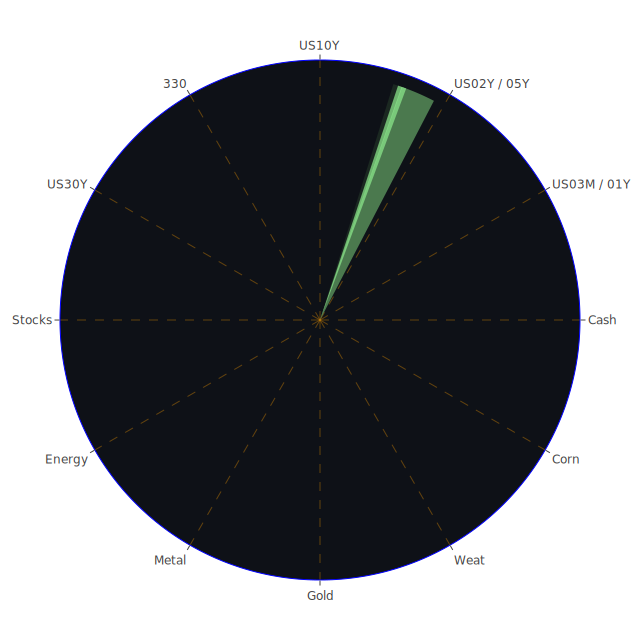

# 一、資訊航母表格之三位一體：空間（Spatial）、時間（Temporal）、概念（Conceptional）的正反合思考

在投資分析中，常見將宏觀經濟、社會學、心理學、博弈論等領域納入考量，從空間、時間、概念三個面向建立「資訊航母表格」的整合架構。本報告雖不以真正「表格」展現，但嘗試以段落文字描述：

1. **Spatial（空間面向）**  
   - **正面（命題）**：在空間層次上，全球各地市場的資金流動，以及新聞事件的區域性政治、社會與經濟影響，會使得不同地區之股票、債券、商品、外匯與加密貨幣等資產產生差異化的波動。此時，市場行為可用經濟學供需理論、社會學群眾行為理論、心理學投資人情緒，以及博弈論國際資本博弈來解釋。例如歐洲奢侈品與汽車可能同時受到歐洲內需與中國、北美旅遊消費回溫的推動；美國科技股的資金動能則受美國內部消費力與國際資本進出同時影響。  
   - **反面（反命題）**：空間上的分散並不保證分散風險；若全球化程度過於高，相互依賴度上升，系統性風險在地緣政治或國際衝突時容易一次性傳遍全球。同時，新聞事件的區域負面衝擊也可能延伸至全球市場。如近期各地因政治或經濟制裁所引發的資金撤出、供應鏈移轉，都將在空間上擴散。  
   - **綜合（合）**：鑒於此，空間維度下應綜合考慮區域性衝擊與全球資產聯動性，認為不同地區之資產雖然具有分散作用，但在重大結構性衝擊時亦會存在高度相關。要注意“空間分散”需同時輔以對經濟結構、新聞脈絡、資金走向之深入觀察，才能真正發揮風險對沖之作用。

2. **Temporal（時間面向）**  
   - **正面（命題）**：從時間切面看，市場往往存在短期、中期、長期不同週期效應。短期內，新聞事件的「負面或正面情緒衝擊」可能帶動暴漲或暴跌；中期則受企業獲利與政策變動影響；長期則觀察到經濟週期、央行貨幣政策走向和全球資金配置趨勢等。現階段，美國聯準會（FED）多次釋放鷹派或鴿派訊號對市場利率影響明顯，導致利率敏感性高的成長型資產波動劇烈。  
   - **反面（反命題）**：不同時間點的新聞解讀容易失真，尤其在高頻交易與社群媒體盛行下，短期資訊雜訊很多，投資者若只盯著短期新聞流，可能錯失長期基本面。另在時間的長河中，曾經顯得「危急」的新聞，若過一段時日又變得不足為懼。如某些地緣政治衝突、貿易制裁等議題，久了之後市場或自動找到對策或緩衝機制。  
   - **綜合（合）**：時間維度下應同時留意短期事件驅動、兼顧中長期趨勢判斷，並結合過往歷史場景類比，培養動態調整的風險應變能力。而新聞事件的時間性影響不應被過度放大，但也不可過度忽視。除了保持對現行新聞的警覺，也需回顧歷史周期與既有理論做深度交叉檢驗。

3. **Conceptional（概念面向）**  
   - **正面（命題）**：許多理論，如經濟學的理性市場假說、行為財務學對投資人心理偏誤的修正、博弈論對策略互動的預測，能讓我們在面臨新聞事件時做較為科學與量化的推論。例如泡沫風險指標D1、D7、D14、D30，可以在概念層次衡量資產的短中長期熱度和潛在風險。而社會學與心理學觀點則提醒我們關注投資者情緒面，像是過度樂觀或恐慌的傳染。  
   - **反面（反命題）**：概念和理論可能過度簡化真實世界，市場因人性、政治、自然災害、傳播效應等多維因素常走出超乎理論的軌跡。即使有博弈論思考，也可能出現完全非理性的行為。如加密貨幣市場內許多炒作風潮，或地緣新聞導致油價等商品大漲的「非線性反應」，常違背傳統均衡理論假設。  
   - **綜合（合）**：面對瞬息萬變的市場，必須兼具理論工具與實際觀察，同時維持開放心態去檢驗既有假說與指標。若能整合經濟學、心理學、博弈論與歷史經驗，就能在概念層次作更完善的策略布局，不陷於單一假說的盲區。

根據上述空間、時間、概念三層面之正反合，綜合得出：我們需同時留意各資產在空間上的地緣與全球連動、時間上的短中長多重週期變化、概念上的理論與實際人性差距，才能建立完善、兼具彈性與深度的風險控管與投資假設。

---

# 二、在三位一體基礎上，辨別市場與新聞的三位一體並做大膽假設

1. **市場三位一體：經濟學、社會學、心理學、博弈論**  
   - 假設A：當經濟學層面顯示資金面與企業盈餘面臨壓力，且社會學層面新聞反映勞資衝突升溫、心理層面投資者恐慌情緒上揚時，容易出現指數加速下跌。如近期多則新聞提到「需求不振」、「航空、零售等財報預警」，再加上通膨尚未完全退去，投資者對利率後市預期轉鷹，市場一旦出現利空，就會出現猛烈的多殺多。  
   - 假設B：博弈論角度，一旦各大國之資本或金融政策陷入對抗甚至脫鉤，市場或將呈現區域性分裂。這不僅在股市，也表現在外匯與大宗商品。如油價、金屬可能因地緣博弈發生供給面與需求面的意外震盪。  

2. **新聞三位一體：經濟學、社會學、心理學、博弈論**  
   - 假設C：新聞若顯示龐大的負面情緒（例如：大量裁員、企業警告、政府衝突訊息）持續累積，社會層面上人民消費信心不足，心理層面出現「避險」需求，經濟層面熱錢流向美國國債或黃金，博弈論角度「恐慌性撤資」也可能使加密貨幣短期劇烈波動。  
   - 假設D：若新聞雖多負面標題，但整體幅度尚未擴大到系統性危機，或有正面消息（如特定企業研發突破、政府財政刺激），就可能形成資本在部分產業暫時集結的現象。例如人工智慧、半導體等領域常出現這種情況，利空之中仍有企業憑藉技術或護城河獲得資金青睞。

3. **結合三位一體整合（正反合）：空間X時間X概念**  
   - 假設E：在長期週期中（Temporal），地緣分布（Spatial）之間的新聞彼此相互影響，可能在概念面（Conceptional）積累成群體投資思維。短期大量負面新聞會壓低市場，但若在更大尺度週期上，一旦貨幣政策出現轉折或經濟出現回溫徵兆，資金隨時可能報復性流入被嚴重超跌的資產。在經濟學、心理學、博弈論的綜合運作下，市場價格常出現「劇烈震盪後的報復性修正」。  
   - 假設F：於空間層次，美國科技權值股如果大幅修正，而歐洲、亞洲市場同時受到衝擊，心理層面易產生全球恐慌。倘若新聞只是一時的政治性口水或貿易保護措施，未至於動搖產業核心需求，博弈論的角度會產生「誘發資本逆向佈局」的契機，一些長線投資者反而趁恐慌買進具備未來價值的標的。

---

# 三、運用三位一體正反合，簡練呈現多資產風險對沖的機會

在現今市場，若尋求低相關或負相關程度（盡可能接近-0.5）以期達到120度相位分散，我們可考慮以下幾種「組合對沖」的思考方向（以下以文字描述，替代表格）：

1. **美國國債 vs. 加密貨幣**  
   - 根據當前數據顯示，美國國債長短天期利率分化。外界對加密貨幣（特別是主流幣）之態度常偏向「風險資產」。二者常在市場出現極端避險或極端風險趨之下呈現逆向或低度相關。若有操作空間，可在利率走勢風險較明確時配置部分長天期國債和少量加密貨幣，取得一定風險分散。  
   - 不過要留意加密貨幣與傳統資金流動也不時呈現同向波動，且近年來機構資金進場後，幣市與美股之聯動一度走強。此處因短期數據顯示加密貨幣泡沫風險指標中等偏高（BTC、ETH等D1、D7值並不特別低），仍須審慎控管部位。

2. **石油/鈾期貨 vs. 美國科技股**  
   - 能源商品與科技成長股往往具有週期性與政策面的強烈差異，兩者有時相關度相對較弱。在2025-03-11與後續數日多則新聞顯示，油價（USOIL）持續受到需求疑慮而承壓，短期內若出現地緣或供給端影響，油價也可能急漲；科技股則更受利率面與成長預期波動。  
   - 分散投資人可考慮將部分部位配置在油或鈾期貨，以對沖科技板塊可能的估值修正；但亦要注意國際政治博弈對能源價格之波動。

3. **黃金/白銀/銅 vs. 美國零售股**  
   - 黃金、白銀一向被視為避險資產；銅則代表工業需求。美國零售板塊受內需、消費力決定，短期新聞若一直報導消費者信心不振（如幾家大型零售商報告中提到需求轉弱），零售股往往表現疲弱。  
   - 然而金屬價格亦可能因全球供需變動而影響。在理想狀況下，零售股下跌時，可能正好避險資金往金銀流動；若整體經濟衰退，銅價也可能下降。但長期若零售再度景氣復甦，金屬需求也可能反轉，產生一定對沖效果。

4. **美國房地產指數 vs. 歐洲汽車股**  
   - 美國房地產市場在通膨與升息壓力下，存在潛在泡沫或租金需求改變之隱憂。歐洲汽車股則兼具外銷與內銷特性，常與歐元匯率及中國需求有高度連動。二者之驅動因子頗有差異，成為一定程度上負相關的潛在對沖標的。  
   - 不過要注意如果全球宏觀系統性風險爆發，美國房地產與歐洲汽車恐同樣遭受波及；此時就不能依賴該組合來完全對沖系統性風險。

在上述思維基礎下，可以進一步蒐羅其他具相位分散效果的資產，如部分大宗農產品（黃豆、小麥、玉米）結合特定外匯對、以及歐洲奢侈品、醫藥股等，力求在事件衝擊時，彼此不會同方向一起暴跌。

---

# 四、針對各大資產類別之泡沫分析與相關新聞、歷史類比

以下列舉常見的主要資產類別，綜合近期泡沫風險數據與市場新聞焦點，進行「簡述」方式的論說：

1. **美國國債**  
   - 近期美國各期限公債收益率發生曲線倒掛的修正跡象。從新聞來看，市場仍擔憂經濟衰退或政策不確定性。歷史上，當經濟進入可能衰退前夕，長天期國債受到追捧，但若FED突然再度鷹派，也可能導致債券價格下跌。當前泡沫分數中等，需觀望政策走向。

2. **美國零售股**  
   - 多家零售商下修業績預期，新聞強調「macro uncertainty」與「需求放緩」。過去在2008金融海嘯、2020疫情初期，也曾見到零售股遭受沉重賣壓。現時泡沫分數並不算低，加上負面新聞密集，顯示投資人須謹慎評估其未來盈利前景。

3. **美國科技股**  
   - 部分科技龍頭，如特斯拉、Nvidia等，在近幾個交易日仍然震盪。新聞面上關於AI的正面題材也不少，但同時對高估值與利率的擔憂存在。回溯2000年網路泡沫、2021年後疫情高峰期的市值飆漲都顯示科技股容易聚集泡沫。現有數據顯示，部分龍頭資產泡沫分數偏高，需要控制持有比例。

4. **美國房地產指數**  
   - 資金面因為利率上升而抑制房市需求，新聞也暗示某些地區的成交量與價格逐漸疲弱。歷史上房地產泡沫最著名莫過於2008年金融海嘯前的美國次級房貸危機。當前需警惕就業與利率交互影響，若失業率走高或消費力下滑，房價恐續受壓力。

5. **加密貨幣**  
   - 比特幣、以太幣近期價格尚維持在較高水準，但新聞常報導負面情緒，包括監管壓力、對其消耗能源的疑慮。歷史類比2018年加密幣崩盤，2021年加密高峰後的大幅回調等，都顯示其波動巨大。D1與D7泡沫分數不低，投資時宜保守配置。

6. **金/銀/銅**  
   - 黃金作為傳統避險標的，在全球政經動盪之際通常受到青睞；白銀波動較大但也可具備工業屬性；銅往往代表經濟活力指標。觀察歷史，當國際緊張加劇時黃金常會上漲，但若需求面轉弱銅價同時下跌，便呈現負相關機制。當前金銀的泡沫分數在中等偏高水平。

7. **黃豆 / 小麥 / 玉米**  
   - 受到天氣、地緣政治與全球供應鏈的衝擊甚深。新聞提及的地區洪災、戰亂等都可能影響農產品供需。歷史上，糧食危機或農產品缺口常在短期內造成期貨價格猛漲。但若國際緊張趨勢緩和或豐收數據出爐，也可能導致價格急跌。風險特徵常呈現高波動。

8. **石油 / 鈾期貨 (UX!)**  
   - 石油近期報價受到需求擔憂及地緣動盪雙重牽引。鈾期貨則相對小眾，但在能源轉型與地緣政治背景下，需求前景被部分投資人看好。歷史上，中東或俄羅斯相關衝突、OPEC產量決策等，都能在短期劇烈扭轉油價。泡沫分數中等，需要關注地緣風險。

9. **各國外匯市場**  
   - 像是美元、歐元、日圓、英鎊、澳幣等，近期受FED與ECB等央行政策、通膨預期與貿易衝突影響較大。參考歷史，也曾出現外匯市場因央行意外升降息而劇震。當前部分貨幣對呈現高波動，宜謹慎操作。

10. **各國大盤指數**  
    - 如美國NASDAQ、道瓊工業指數、歐洲主要大盤、日經、滬深等。新聞顯示多地股市飽受衰退預期及通膨壓力干擾；回溯歷史，金融風暴與疫情衝擊亦曾導致大盤劇烈下挫。當前大盤整體泡沫指標不一，多數有中高風險。

11. **美國半導體股**  
    - 半導體股尤其依賴全球供應鏈、中美等大國博弈格局，以及AI或自動駕駛等新興技術需求。新聞面指出AI概念依舊吸金，但若企業資本支出放緩，也恐導致半導體高點回落。2001年網路泡沫、2008年金融危機都曾衝擊過此領域。

12. **美國銀行股**  
    - 銀行股往往隨利差波動而改變盈餘表現；若衰退風險上升，信貸違約率上升則壓低銀行獲利。新聞提到「經濟不確定性」升溫，多位分析師擔憂信用卡呆帳、商業地產貸款等。2008年次貸危機曾使銀行股重挫，投資者需特別關注資產負債健全度。

13. **美國軍工股**  
    - 地緣政治動盪或軍事衝突升溫時往往受到資金關注，但若政府預算面臨壓力、跨國合作受阻，也可能衝擊訂單。歷史上軍工股有時在大盤回調時相對抗跌，但若地緣新聞趨於平靜，也可能喪失催化題材。

14. **美國電子支付股**  
    - 近年受電商、金融科技趨勢影響，此類公司成長快，但估值偏高。若消費力減弱或利率攀升，常壓抑其股價表現。過去疫情期間，電子支付大幅普及，但2022後股價隨著市場轉向保守而修正。

15. **美國藥商股**  
    - 具防禦性，但亦受專利期、藥價政策等左右。歷史上，經濟下行時此類股相對抗跌，但若政治環境對藥價加強監管，也會削弱其獲利。

16. **美國影視股**  
    - 受消費習慣（串流、院線）與廣告市場景氣影響；新聞上常見串流平台併購或訂戶數字變化。歷史上，娛樂市場會因景氣循環與技術革新而有大起大落。當前負面新聞若顯示廣告市場疲弱或發生勞資糾紛，投資人需特別留意。

17. **美國媒體股**  
    - 與廣告、觀眾收視行為、政治廣告等密切相關。過去總統選舉、重大國際賽事等會刺激媒體股，但若新聞裡出現政府對大型媒體的反壟斷行動，也會造成壓力。

18. **石油防禦股**  
    - 這類公司通常同時涉足傳統石油開採、化工與部分替代能源。歷史顯示油價大漲或地緣動盪時，石油防禦股有相對防禦能力。但若全球加速轉向綠能或油價出現長期低迷，也會面臨艱困。

19. **金礦防禦股**  
    - 與金價波動高度正相關。金價雖常作為避險指標，但金礦公司本身的生產成本、開發進度、地緣風險也會影響利潤。歷史上的金價飆漲若能搭配低成本運營，金礦股回報可觀；但金價長期承壓時，此類公司也會不振。

20. **歐洲奢侈品股**  
    - 取決於全球富裕階層消費力，尤其是中國與美國旅客之購買。歐債危機和全球經濟放緩曾壓抑其消費動能，但中國旅遊開放或中產階級崛起時又帶動成長。  
    - 近期新聞顯示歐洲景氣仍不明朗，但若富裕市場繼續高消費，奢侈品有一定抗波動力。

21. **歐洲汽車股**  
    - 汽車業在電動化趨勢中面臨轉型壓力，亦受出口市場需求影響。歷史上歐洲車廠在金融危機期間也經歷銷量暴跌，但之後若遇到需求回暖，便可出現反彈。新聞若顯示對電動化投資不足或中國競爭加劇，投資者須謹慎。

22. **歐美食品股**  
    - 防禦性佳，但在通膨高漲、成本上升時，利潤空間恐受擠壓。歷史上大型食品商常能透過價格傳導因子將部分成本轉嫁，但若消費者信心不佳也會壓抑銷售量。新聞對食品原料價格與供應鏈的報導十分關鍵。

---

# 五、宏觀經濟傳導路徑分析

1. **利率與貨幣政策**  
   - 美國聯準會近期雖釋放部分鷹派言論，但也有人認為經濟數據疲弱可能迫使其放緩緊縮腳步。宏觀層面，利率上升推高貸款成本與折現率，抑制消費與企業投資。亦使估值偏高的成長股或高風險資產承壓。  
   - 較高的利率將資金吸回美國國債，減少對其他市場之需求，導致國際資本流動的改變，並最終影響外匯市場。

2. **就業與消費**  
   - 若企業接連裁員、消費者可支配所得下滑，將使零售、餐飲、旅遊等行業景氣下降，進而再度衝擊就業。某些新聞提到航空公司削減利潤預期即是一例；這種惡性循環在歷史上的經濟衰退階段常被觀察到。

3. **國際貿易與地緣政治**  
   - 關稅戰或制裁措施導致供應鏈轉移、商品與匯率波動。當新聞大篇幅報導國際衝突、制裁或各國競相打壓彼此產業時，最終反映在全球股匯市的波動擴大。

---

# 六、微觀經濟傳導路徑分析

1. **企業獲利結構**  
   - 當企業面對原材料或能源成本上升，或消費疲弱導致營收縮減，利潤承壓將導致股票估值下滑。過去歷史上多次出現經濟放緩令企業獲利大幅縮水，股價急跌的情況。  
   - 此時企業若能透過創新或成本管控維持獲利，便可在市場壓力中相對突出。

2. **產業供應鏈風險**  
   - 若上游關鍵零組件受地緣政治或天災影響斷供，中游廠商無法生產，最終影響下游客戶，形成連鎖效應。2020年疫情初期即有此類供應斷鏈之震盪。

3. **市場信心與庫存管理**  
   - 企業庫存水位普遍偏高或偏低，都可能是經濟轉折訊號。若庫存過高，表示需求不足，企業或急於降價去化，引起價格競爭；反之若庫存不足，也可能使原料價格再次推高或導致延遲交貨。

---

# 七、資產類別間傳導路徑分析

1. **股債聯動**  
   - 當信心不足時，資金由股市轉往債市，推升公債價格；若聯準會態度轉向放寬，則股市與債市可能同漲。  
2. **商品與匯率**  
   - 主要資源出口國與貨幣有正相關，如石油輸出國貨幣與油價聯動。若油價下跌，該國貨幣承壓，反向帶動美元或其他貨幣升值。  
3. **地區間市場溢出**  
   - 若美國市場重挫，歐洲、亞洲往往次日承受風險偏好衰退影響；反之亦然。過去多次全球性危機證實系統性聯動日益強化。

---

# 八、投資建議

在現行環境下，建議投資人可依「穩健、成長、高風險」三種風格配置，總比例合計100%。以下列舉示範性組合，僅為參考，投資前需衡量自身風險承受度：

1. **穩健型（合計約40%）**  
   - (1) **短中期美國國債**：約15%，主要避險。由於近期利率仍有相對可觀的收益，且在衰退風險下仍具防禦特性。  
   - (2) **金礦防禦股或黃金ETF**：約10%，金價泡沫分數中等偏高，但逢國際政治緊張及經濟不確定時，黃金常獲資金青睞。  
   - (3) **歐美食品股**：約15%，雖然在通膨高漲時成本上行，但大型食品企業仍擁有定價能力，長期穩定。

2. **成長型（合計約40%）**  
   - (1) **美國半導體股**：約15%，半導體仍為AI、電動車等核心，但泡沫分數偏高需分批進場。  
   - (2) **歐洲奢侈品股**：約10%，若全球旅行復甦，高端消費力仍能支撐奢侈品。  
   - (3) **美國電子支付股**：約15%，數位金融浪潮下有成長潛力，但要注意利率環境壓力。

3. **高風險型（合計約20%）**  
   - (1) **加密貨幣（主流幣）**：約5%，波動巨大，泡沫風險指數不低，但亦可帶來高報酬機會。  
   - (2) **油/鈾期貨**：約5%，受地緣政治驅動，若未來能源轉型或局勢緊張，可能發揮極端行情。  
   - (3) **美國新興科技（AI應用）**：約10%，AI概念盛行且有長期潛力，但估值昂貴、波動亦大。

上述比例只是一種參考示範，並無絕對佳解。投資人應隨市場變動調整。

---

# 九、兩兩相互驗證的篩選假設與可能的漣漪效應傳導路徑

綜合前文三位一體正反合之觀點，對多項資產進行兩兩互相驗證，若出現以下傾向，則需提高警覺或調整佈局：

1. **假設1：若美國房地產與美國銀行同時出現嚴重負面新聞**  
   - 可能顯示房地產信貸風險加劇，銀行曝險度升高。若銀行股同時大跌，則意味金融系統性風險升溫，進而波及美國債市、股市和全球市場。

2. **假設2：若石油價格持續回落但加密貨幣持續上漲**  
   - 代表國際資金或許在尋找「替代性資產」而非傳統商品。要留意這是否源於消費疲弱（令油價跌）同時投機資金湧入幣市。這種情況不一定穩定，如行情反轉往往劇烈。

3. **假設3：若美國科技股與黃金同漲**  
   - 往往顯示市場雖對科技前景樂觀，但同時又需要避險；這可能暗示著投資人對市場流動性依舊青睞，也對地緣與政治風險存有戒心。未來一旦利率再度抬升，可能擠壓同漲局面。

4. **假設4：若歐洲奢侈品與歐洲汽車同步走弱，而美元與日圓攀升**  
   - 這或顯示歐洲經濟問題加深，資金往美日尋求庇護。奢侈品與汽車皆屬歐洲優勢出口產業，若兩者同時下挫，歐洲整體經濟恐面臨壓力，進一步衝擊歐洲股市。

5. **假設5：若美國零售股與電子支付股同時大跌**  
   - 可能顯示消費信心急劇惡化，對信用消費與支付服務的需求同時放緩，連帶對整個內需市場產生衝擊，進而影響整體企業盈利。

漣漪效應往往從單一產業或區域新聞開始，透過金融市場傳導至更廣範圍之市場。一旦觀察到「美國→歐洲→亞洲→商品→匯率」或任何順序的連鎖反應，投資人需據此迅速評估投資組合敞口。

---

# 十、投資建議總結

綜合上述分析，當前市場存在諸多負面新聞，包括全球政治緊張、經濟衰退疑慮、利率去向不明、企業財報壓力等，也有部分正面消息如AI技術進展、新興市場需求回升等可能支撐部分板塊。歷史經驗顯示，我們不可忽視高泡沫風險領域，如估值在歷史高位或D1/D7/D14/D30指標明顯偏高的標的。應以嚴謹的分散化、多角度觀察空間佈局（地區、產業）、時間週期配置（短中長期）的方式來降低系統性衝擊。

建議投資者採取靈活策略：  
1. 留意宏觀數據變動，如就業報告、通膨、公債殖利率等；  
2. 追蹤重大國際新聞，如地緣衝突、關稅戰、制裁；  
3. 密切注意企業財報與管理層言論，查看社會消費心理；  
4. 持續評估資產之相對泡沫與風險指數，不要忽視極端情境下的潛在風險。

---

# 十一、風險提示

投資必定伴隨風險，市場情況不斷演變，且資產之間長期可能呈現高關聯。本報告建議僅供參考，投資者應結合個人風險承受度與投資目標獨立判斷。近期泡沫風險較高的資產若無足夠風險意識與避險策略，可能遭受重大損失。同時，市場有各種黑天鵝事件或地緣因素可能在短期內改變局勢，需持續追蹤。

面對潛在的泡沫與波動，最關鍵在於：  
- 分散投資以避免單一市場或單一資產的巨大回撤；  
- 強化對新聞與數據的整合判斷，避免過度倉促的追高殺低；  
- 保留必要的流動性，以防市場連續震盪時能及時反應；  
- 關注央行與政府政策，因為貨幣與財政端的任何劇烈轉變，都可能是市場方向的分水嶺。

總而言之，當前環境充滿不確定性，但在經濟學、社會學、心理學、博弈論以及歷史經驗的多重脈絡參考下，若能謹慎利用三位一體整合思維，並維持客觀冷靜的投資態度，依舊有機會透過明智的資產配置，發揮對沖風險、捕捉收益的效果。投資人需做好自身的風險管控，切勿忽視任何可能的泡沫跡象。**投資有風險，入市需謹慎，請根據自身財務狀況與目標謹慎決策。**

 
Daily Buy Map:

 
Daily Sell Map:

 
Daily Radar Chart:

 
