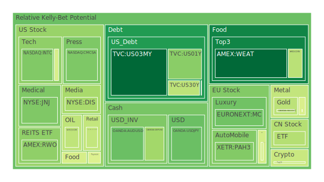
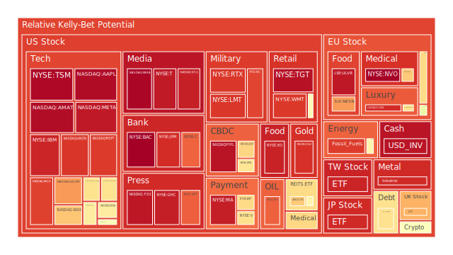
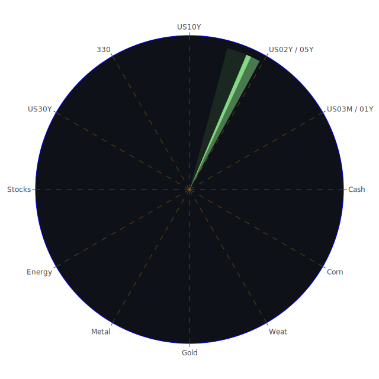

# 投資商品泡沫分析（依照資產類別逐項說明）

## 1. 美國國債
美國國債長期以來都被視為全球市場的低風險資產。根據近期數據，10年期殖利率（US Treasury 10Y Yield）約在4.27%附近，相比前一月或前一年小幅下滑。短天期（例如3個月、2年期）也同步呈現一定程度的下修，顯示市場對未來可能的經濟下行或利率走勢開始改變預期。此外，OIS FED Fund Rate自前一週的5.33轉為4.33，也加深了市場對聯準會政策急轉的疑慮。

從空間性（Spatial）來看，美國國債作為全球重要避險標的，任何風險事件（如地緣政治衝突、國際金融市場大幅波動）都會讓資金回流到美國國債，但近期新聞例如「美國債務上限問題尚未解決」、「龐大的美國政府債務占GDP比重正在持續走高」等，也為美債的長遠穩健度埋下隱憂。從時間性（Temporal）看，美國國債在2023下半年與2024年初的變動相對溫和，然而自2025年伊始，因為通膨數據略有降溫、FED資產負債表持續緊縮以及隔夜逆回購（RRP）下降等因素，使殖利率仍是高檔盤旋但未見更大上衝。概念性（Conceptional）上，若未來美國財政赤字未有效改善，加上市場對景氣循環的預期轉弱，美國國債就會受避險需求支撐，但同時政府債務攀升也可能推高長天期風險。現階段美債泡沫分數約在0.3-0.6之間，不算特別高，但長期仍須警戒財政可持續性。

## 2. 美國零售股
此部分可大致代表如WMT、TGT、HD、COF（信用卡業務衍生零售貸款風險）等零售或相關金融型公司。從近期新聞來看，WMT由於消費者趨於節約，股票並未高歌猛進，儘管報告中的「PP100」接近當日前價約87-84美元左右，其D1與D7泡沫分數已經逼近0.90上下。這代表投資者對未來企業獲利與估值泡沫的存疑度正逐漸加深。TGT則因財報不佳、銷售展望疲弱，泡沫指數更是高達0.95以上，有潛在高風險修正壓力。HD方面，受到美國房市稍微降溫、消費者支出減緩影響，短期股價波動增大。

在空間性層面，美國零售股受惠於美國國內市場的強大規模，但仍無法脫離國際局勢，如關稅、原物料價格、全球供應鏈等因素衝擊。近期新聞也提到「特朗普的新關稅威脅」，使零售商進貨成本增加，或面臨供應鏈轉移壓力。時間性上，如果美國經濟正式轉入緩慢增長或接近衰退區域，零售消費會首當其衝。概念性方面，不少零售股具備強大的品牌力或忠誠客戶群，但在通膨降溫尚未完全穩定之際，營運指標的下滑容易被市場放大。建議若投資此類標的應謹慎評估，因為泡沫風險（D1或D7大多在0.8-0.9之間）已在高檔。

## 3. 美國科技股
美國科技股涵蓋AAPL、MSFT、GOOG、NVDA、AMZN等多檔明星股。這些股票在本次報告數據中，有幾檔呈現泡沫分數相當高。例如NVDA曾一度泡沫分數逼近0.88-0.90之間，現在雖稍微回落至0.60-0.70，但仍處於相對高檔。同樣地，AAPL的風險分數超過0.97、MSFT也超過0.90，顯示市場對科技龍頭成長性的擔憂及估值膨脹疑慮並存。新聞面則顯示，AI題材仍在支撐高科技公司的想像空間，但過於依賴單一題材容易引發獲利不及預期時的激烈回調。

空間性來看，美國大型科技企業在全球擁有產品與服務布局，如雲端業務、廣告、軟體服務，地緣政治衝突或關稅戰可能影響硬體供應鏈（尤其晶片、伺服器等），也會影響其全球市場佈局。時間性方面，科技龍頭多年來屢經泡沫爭議，如2000年網路泡沫、2008年金融危機時的跌幅慘痛，但長期以來仍不斷創造新高。在概念層面，由於投資者普遍認為科技股具備「未來價值」、「創新性」，心理學與博弈論均指出當市場憧憬技術重大突破時，會出現集體樂觀情緒，進而推動資產估值。但當這些預期難以兌現，股價可能迅速壓回。從本次報告相關D1、D7等平均泡沫值可觀察，科技股整體維持高風險態勢，特別是AAPL、GOOG、AMZN等龍頭依然在0.90以上。

## 4. 美國房地產指數
如VNQ、RWO等ETF或其他房地產相關股票，根據近期數據，泡沫分數大多也在0.70-0.90之間。這與美國房地產市場在升息週期下的疲弱狀況有關，也與過往一年左右的房價高漲後逐漸修正有關。新聞方面，雖無大量突發性的負面消息，但整體趨勢顯示「美國抵押貸款利率」仍維持在6.65%以上，顯著高於前兩年水準，抑制買盤意願。

空間性來說，美國房地產常和全球資金流動有密切互動，一旦外資或國內投資者大幅撤出，房市交易量與價格都面臨快速下滑。時間性檢視過去幾次房市循環，如2008年次貸風暴期間，房市修正時間多達數年，但在2012年後進入長牛。概念性則顯示，房地產對大多數人而言是剛需，但過高的貸款成本或嚴格的信貸標準都可能抑制需求。而疫情後的「居家辦公」文化，也讓商用不動產遭受衝擊，市場開始擔憂空置率上升、租金回報下降等問題，從而導致資本挹注更審慎。故從正-反-合角度而言，美國房地產指數本身在長期仍有一定支撐力，但短期泡沫壓力偏高（約0.7-0.8），特別是商用不動產風險更高。

## 5. 加密貨幣
在本次數據中，BTC、ETH、DOGE等雖現價走高，但泡沫分數大多在0.4-0.6之間上下浮動。值得注意的是BTC的D1雖不算非常高，但其7天、14天平均值都曾呈現高於0.38的水準，代表短線漲幅有一定風險；DOGE則曾因政策、交易所監管等消息多次震盪，目前也維持在0.42-0.52上下。

空間性觀察，加密貨幣市場全球化程度高，任何區域監管或大型交易所的新規都會產生廣泛衝擊。時間性層面，自2017年的ICO狂潮到2021年的DeFi與NFT熱潮，再到2022年的某些大型交易所破產風波，都顯示加密貨幣波動性極大，無法以傳統企業盈餘模式做評估。概念性而言，部分投資人認為加密貨幣是「數位黃金」或「去中心化未來」的象徵，也有人認為這只是一場泡沫投機。心理學層面，「FOMO」（錯過恐懼）常驅動散戶湧入，博弈論則顯示若大戶聯手操作市場，易導致價格短時間劇烈拉抬或崩跌。因此需保持謹慎，尤其在資金管理與風險控管上更加重要。

## 6. 金 / 銀 / 銅
本次數據顯示黃金XAUUSD的當日現貨大致在2914-2986美元/盎司區間，高點出現0.45-0.46左右的泡沫分數，但也有部分維度顯示比前期（D14）更高或更低。總體來看，市場對黃金仍存在避險需求，加上新聞指出「金價可能衝到3500美元」的樂觀預測，也讓該資產受到矚目。銀（XAGUSD）的泡沫分數則在0.62-0.73之間，反映出同屬貴金屬但更受工業需求影響，因此波動相對黃金更大。銅（COPPER）則受全球經濟景氣與工業金屬需求牽動，短期內新聞報導因擔憂經濟走疲而出現回落，泡沫值一度上升又回跌至0.56-0.64間。

空間性上，金銀銅都與國際貿易、產業需求和各國央行買賣行為高度連動。時間性來看，金價在多次全球恐慌時（例如2008年、2011年、2020年疫情初期）往往創出新高，但在市場重回穩定後曾一度修正。銅價則可看作景氣先行指標，當需求增加意味全球製造業回溫，反之則顯示疲弱。概念性分析，金銀在投資者心理層面具有貨幣替代品的地位，尤其高通膨或不確定性上升時需求驟增；銅則更接近工業製程的現實應用，其價格受宏觀經濟週期影響。從這次資料可見，貴金屬短期雖有一定避險買盤，但并非沒有風險，尤其銀的波動與銅的需求緊縮風險都必須納入評估。

## 7. 黃豆 / 小麥 / 玉米
大宗農產品方面，小麥（WEAT）、玉米（CORN）、黃豆（SOYB）等ETF或期貨，在數據顯示的泡沫分數通常落在0.42-0.50上下。部分新聞提及地緣政治可能影響穀物供應，然而近期價格並未激烈飆漲。美國通膨若進一步降溫，反而可能壓抑農產品的投機買盤。

空間性檢視，各國農業受氣候條件、貿易政策、運輸成本等因素影響。若出現重大天災或戰爭，糧食安全問題就會立刻浮現。時間性上，黃豆、小麥和玉米經歷過多次因氣候變遷或國際貿易衝突而價格劇烈震盪，如2010-2011年阿拉伯之春期間的糧食危機。概念性而言，農產品有其剛性需求與生長周期限制，短期看來供需失衡就會造成顯著波動，也易形成投機行情。然而若供給端維持穩定，價格波動幅度就小。報告數據顯示這些農產品目前泡沫風險不算太高，但一旦局勢改變（例如政治衝突擴大），可能瞬間翻轉。

## 8. 石油 / 鈾期貨UX!
石油價格（USOIL）近期數據顯示PP100約在66-67美元之間，泡沫分數從0.05-0.89皆有不同區間，需要注意的是，這是由於短期價格波動劇烈所致。最近新聞提及「油價反彈受限，因IEA展望不佳，但美方可能實施新的制裁」。從空間性看，中東、俄羅斯、美國頁岩油生產等因素都將影響原油供應。時間性的層面，歷史上石油價格屢次經歷大漲大跌，包括1970年代石油禁運、2008年金融危機期間的暴漲與暴跌、2020年疫情初期一度出現負油價的極端狀況。概念性上，油價受地緣衝突、OPEC+產量協議、經濟增長預期交互影響。若全球經濟衰退風險上升，需求面萎縮會抑制油價，反之若地緣衝突升溫或供給端大幅減產，油價就會飆漲。

至於鈾期貨（UX1!），數據顯示其泡沫指數介於0.36-0.58之間，漲幅與地緣政治以及清潔能源趨勢掛鉤。若核能發電需求持續被重視，加上對碳排放的限制提昇，鈾價可能維持一定的上行空間。然而市場深度較淺，波動性也會較大，不少投機資金可能在政策或環保爭議的消息下一窩蜂進場或退場。

## 9. 各國外匯市場
在報告中，USDJPY（美元/日圓）、EURUSD（歐元/美元）、GBPUSD（英鎊/美元）、AUDUSD（澳幣/美元）等多種貨幣組合皆有不同的泡沫分數變化。例如USDJPY近期雖在147-148，泡沫指數呈現0.25-0.53上下，不同時間範圍內波動顯示日圓相對疲弱；EURUSD、GBPUSD等則因歐洲經濟數據或英國通膨影響。空間性表現各地央行利率政策分歧，時間性顯示歷史經驗中，英鎊與歐元曾在脫歐或歐債危機等事件中劇烈波動。概念性則指出，外匯市場常受市場情緒與套利交易驅動，再者，銀行體系與央行干預政策（如口頭干預或實際拋售外匯）也可能製造短期巨大波動。

## 10. 各國大盤指數
包含GDAXI（德國DAX指數）、FTSE（英國富時指數）、FCHI（法國CAC40）等歐洲指數，以及中國大陸SSE 000300、臺灣0050追蹤的臺灣大盤、日經JPN225等在本報告中也占有一席之地。整體泡沫分數普遍都在0.65-0.95不等，尤其臺灣0050、日經JPN225顯示接近或超過0.90，反映東亞市場在2025年以來受到全球半導體需求增減、區域地緣政治等影響而波動加劇。歐洲大盤方面，有數據顯示部分指數開始走向修正或高位震盪，某些新聞也提及「歐洲經濟仍面臨能源成本、通膨與地緣壓力的挑戰」。

## 11. 美國半導體股
美國半導體代表如AMD、INTC、NVDA、KLAC、AMAT等，本次數據顯示多檔泡沫分數偏高（0.60-0.96區間皆有），特別是AMAT與KLAC對應晶片設備景氣、NVDA對應AI伺服器需求，都曾被投資人炒作。新聞中透露部分晶片大廠的資本支出計畫雖維持較高水準，但若未來AI需求一旦放緩或宏觀景氣走弱，半導體股可能遭遇回檔。歷史上2000年科網泡沫、2008年金融危機、2018年中美貿易戰以來，半導體股都曾出現劇烈循環波動。需提防高估值與景氣反轉的雙重衝擊。

## 12. 美國銀行股
常見如JPM、BAC、C等，報告泡沫分數甚至出現JPM約0.91-0.94、BAC高達0.99、C也在0.86-0.87間，代表銀行股短期風險相對顯著。市場擔憂因素包括商業地產貸款壞帳問題、美國債務上限衝擊銀行流動性、消費貸款若經濟轉弱而導致違約率升高等。國際新聞也顯示FDIC對銀行業的資金安全有擔憂。回顧2008年金融危機，銀行股曾大跌，加之市場對金融槓桿的敏感度較高，一旦有風聲銀行流動性不穩，股價波動會極度劇烈。

## 13. 美國軍工股
LMT、NOC、RTX等為代表，近年因國防預算增長、地緣衝突頻仍，股價有長期支撐。然而在本次報告中，軍工股泡沫分數也不低（約0.75-0.90），顯示評價水平已偏高。新聞層面提到「全球衝突頻率上升」，市場常認為軍工類股受惠，但若衝突緩解或政治風向轉變，也可能反向重挫。歷史上如海灣戰爭、911事件、敘利亞衝突等都曾對軍工股帶來階段性利多，但也曾在衝突趨緩後拉回。投資時應留意政策走向與國會預算周期。

## 14. 美國電子支付股
V、MA、PYPL、GPN等，在近幾年電子商務與數位支付普及之際，股價長期趨勢大多持續走升。但現今多檔泡沫分數已在0.88-0.96上下。如PYPL的資料指出D1約0.95以上，顯示市場對其未來成長性抱持懷疑。加上近期某些監管機構關切支付安全、數位資金流動，社會與心理學都提示一旦消費者信心改變或金融科技監管加強，市場樂觀預期很可能快速瓦解。

## 15. 美國藥商股
JNJ、MRK、LLY等大型藥廠，一方面受衛生健康議題、人口老化等長期利多支撐，另一方面在研發支出壓力、專利到期風險之間面臨博弈。數據顯示，LLY泡沫分數一度達到0.86-0.93之間，高風險修正的可能性不可忽視。回顧歷史，藥廠股價在研發成功或重大藥品批准時會飆漲，但如若專利懸崖來臨，會出現大跌。

## 16. 美國影視股
DIS、NFLX、PARA、FOX等。本次報告中，DIS約0.39-0.67泡沫指數，NFLX則曾高達0.85-0.97，顯示市場對串流影音平台的評估存在分歧。一方面疫情後人們宅在家看串流習慣或延續，另一方面競爭激烈導致訂戶成長放緩，也使得股價較為震盪。新聞消息顯示美國勞資糾紛與娛樂產業工會談判可能反覆，從社會學視角看，大型影視公司面臨成本與創意的拉鋸。

## 17. 美國媒體股
NYT、CMCSA等同樣面臨傳統媒體廣告衰退與新媒體多元競爭的空間性困境。時間性對比以往，紙本媒體廣告收入持續下滑，多數公司透過數位化轉型謀出路。概念性來看，媒體的核心價值在內容與受眾信任，如果主題與新聞趨勢契合，業績仍有翻身可能。但在經濟下行期間，廣告預算往往成為被刪減對象，導致股價易受衝擊。本次報告顯示NYT泡沫分數接近0.95，風險值得留意。

## 18. 石油防禦股
典型是像OXY、XOM等，其與石油市場波動連動性高，也受地緣政治與美國能源政策影響。報告中的OXY、XOM泡沫分數都有0.74-0.66起跳，有時高於0.70，意味石油防禦股雖然具高股息或穩定現金流優勢，但當油價後市不明朗或公司負債結構較高時，仍需警戒。

## 19. 金礦防禦股
RGLD等採礦公司，通常跟金價走勢正相關。當金價看漲，金礦股的獲利與估值大增，但亦可能因開發成本、環境法規等不可控因素而受限。本次RGLD泡沫分數介於0.82-0.91，並不低，投資需要考量金價一旦回跌的風險。

## 20. 歐洲奢侈品股
主要像KER、MC、RMS等。報告數據顯示它們的泡沫分數約0.57-0.93之間不等，奢侈品消費與全球景氣、富人消費信心相關。新聞提到「歐洲旅遊與奢侈品因中國旅客回流而獲得動能」，但若地緣政治衝突或關稅戰升級，也可能打擊銷售。長期看來，奢侈品往往具「品牌壁壘」，但遇到全球經濟衰退時銷售會下滑。

## 21. 歐洲汽車股
如BMW等，其泡沫分數在0.40-0.52之間，整體壓力中度。歐洲汽車面臨的空間性困難包括電動化轉型、材料成本上升、地緣衝突對金屬供應的干擾等。時間性回顧2008金融危機後歐洲汽車品牌普遍經歷相當大的銷售下滑，之後於中國市場大賣才補足虧損。概念性上，隨電動車普及，傳統車廠需在科技層面迎頭趕上，同時面對新創車廠競爭。近期新聞顯示某些車廠轉嫁關稅到最終消費者，也可能造成需求減少。

## 22. 歐美食品股
如NESN（雀巢）等，多為民生必需產品，波動相對小，但過去一年原物料成本上漲也影響獲利。本報告中NESN的泡沫指數一度約0.58-0.62，尚屬溫和區域。時間性對比歷史，食品股雖具防禦性，但不能忽視通膨與消費者信心的變化帶來的衝擊。

---

# 宏觀經濟傳導路徑分析
綜合上述各類資產的表現，我們可以看出以下幾條可能的宏觀經濟傳導路徑：

1. **貨幣政策傳導**：聯準會若為抑制經濟過熱而持續保持相對較高利率，將使信貸環境趨緊，企業融資成本上升，連帶影響消費支出與投資意願。對高估值的科技股或半導體股衝擊尤甚，而防禦型資產（黃金、美國國債）則可能因避險需求上升而受惠。
2. **地緣政治與關稅傳導**：新聞頻頻提及美國前總統特朗普繼續威脅加徵關稅，或多個區域衝突升溫，如中東與歐洲地區。這些不確定性可能造成全球供應鏈改變、運輸成本上升、企業獲利縮水。如果衝突擴大，石油、金屬等大宗商品價格波動將更加劇烈。
3. **信貸與消費傳導**：銀行股的高泡沫風險顯示市場對金融體系穩定性抱持疑慮，而消費者信用卡違約率上升，也代表實體經濟可能有下行壓力。零售、餐飲、娛樂等產業將首當其衝。

---

# 微觀經濟傳導路徑分析
在企業或行業層級上，傳導可以是：

1. **成本傳導**：當原物料、能源或人力成本上升，零售企業可能轉嫁成本給消費者，導致銷量下滑，或自行吸收後獲利縮水。
2. **技術與創新傳導**：科技公司若能在AI、大數據、雲端等領域取得突破，有可能帶動整個供應鏈，包括晶片、半導體設備廠。若技術或需求不及預期，估值泡沫破裂風險大。
3. **地區市場傳導**：歐洲市場需求不足時，歐美跨國企業會回頭拓展亞洲或新興市場；若亞洲地區也因貿易戰或地緣政治衝擊而消費受限，企業整體營收下行風險升高。

---

# 資產類別間傳導路徑分析
1. **股債轉換與避險**：股市若下跌，可能推高債券需求，進一步壓低殖利率。但若對政府財政狀況不信任，則會放大黃金、現金或其他外匯需求。
2. **大宗商品與匯率**：石油、金屬等價格上揚時，能源輸入國通膨升溫，貨幣或有貶值壓力；出口型經濟體若大宗商品價格有利，貨幣或易走強。
3. **大公司帶動整體指數**：如AAPL、MSFT等權值股若大漲，往往推升整體NASDAQ或S&P 500，散戶情緒隨之高漲，但若隨後反轉，指數跌幅也會放大。

---

# 投資建議

以下將針對「穩健」、「成長」、「高風險」三種配置思路，各給出三個子投資項目並以比例方式呈現，合計100%。由於每位投資者的風險承受能力與資金規模不同，此僅為一般性建議：

1. **穩健型（合計約50%）**  
   - （1）美國國債（20%）：可考慮中長天期國債配置，但需關注政府財政風險。  
   - （2）黃金現貨或金礦防禦股（15%）：對沖地緣政治與通膨風險，但留意金價若大幅修正帶來的風險。  
   - （3）大型高信用評等公司債或優先股（15%）：在經濟趨緩時可能提供相對穩定收益。

2. **成長型（合計約30%）**  
   - （1）美國科技龍頭股（10%）：如MSFT、GOOG等，雖然泡沫指數高，但長期產業領導地位可期。建議分批進場，嚴控部位。  
   - （2）歐洲奢侈品股或汽車股（10%）：若全球經濟不至於硬著陸，奢侈品與歐洲汽車轉型題材仍具潛力，但應密切關注地緣衝擊。  
   - （3）半導體設備股（10%）：長期供需仍被AI、高速運算支持，但短期震盪大，適合有中長期耐心的投資者。

3. **高風險型（合計約20%）**  
   - （1）加密貨幣（5%）：BTC或ETH具代表性，但波動極大，僅能佔少數部位。  
   - （2）高收益債券或新興市場債（5%）：在高利率環境下能有吸引人的利率差，但需考慮違約風險與流動性問題。  
   - （3）單一成長股（10%）：例如NVDA或AMZN這類高估值公司，可能因AI或雲端需求持續高增長，但也存在估值泡沫風險。

上述比例僅是一種依照「風險承受度」大略規劃的參考模型，也可視個人狀況進行微調，例如穩健型與成長型可以稍微互換比例。同時需牢記，任何高泡沫指數資產隨時可能發生價格劇烈波動，必須運用停損和避險工具（如期貨、選擇權或適度的現金部位）來控制風險。

---

# 風險提示

投資有風險，市場總是充滿不確定性。本報告中有多處警告不少投資標的目前已處相對高風險區域，例如銀行股（BAC、JPM、C）和某些高估值科技股（AAPL、MSFT、AMZN、NVDA、GOOG）及半導體設備股（AMAT、KLAC）等，泡沫分數在0.9上下乃至更高，顯示未來只要有任何營收不及預期或利率政策突變的情況，都會引發股價大幅度修正。

歷史經驗亦告訴我們，當市場對「某些高成長題材」過度熱情，同時缺乏足夠利基或強勁財報支撐，就容易陷入泡沫。如果同時全球流動性開始緊縮，資金撤離也會產生戲劇化崩跌。像2000年科網泡沫、2008年金融海嘯等案例都顯示泡沫破裂往往在市場最樂觀時突然降臨。儘管此報告基於近期新聞、歷史相似場景、各種理論（經濟、心理、社會、博弈）的交互驗證，並無法百分之百保證未來情境，也無法排除意外黑天鵝事件的發生。

最後，再次強調本報告內容僅供參考，所有投資決定仍需投資人依據自身財務情況、風險承受度與投資目標謹慎評估。市場多變，任何資訊都可能隨時變動。如果出現重大負面新聞或不可控的系統性風險衝擊，高泡沫標的的價格反轉可能相當驚人。在此建議投資者應訂定停利停損策略、保持彈性，同時留意全球金融政策與地緣政治之最新發展。

 
Daily Buy Map:

 
Daily Sell Map:

 
Daily Radar Chart:

 
