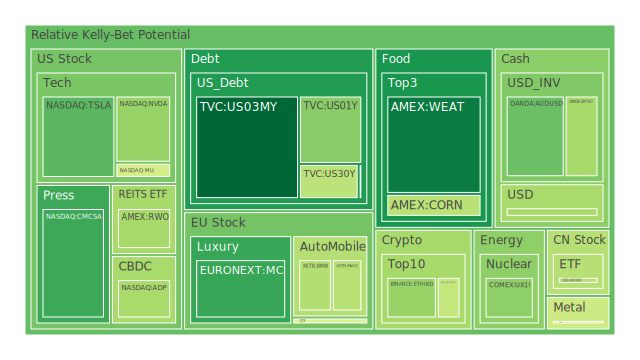
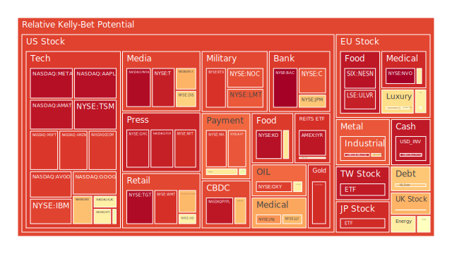
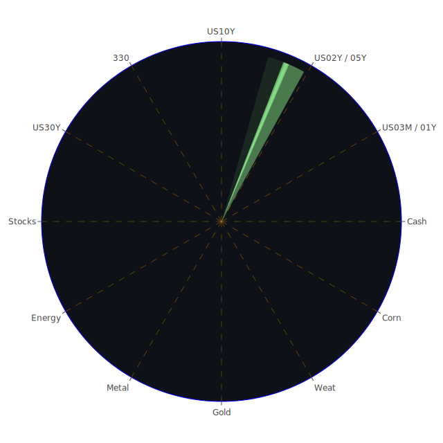

# 一、空間（Spatial）層面的市場與新聞三位一體解析

在空間層面，我們聚焦於不同區域市場之間的互動，以及新聞事件於全球範圍內所產生的外溢效果。近年來，由於跨境資本流動更趨便利，股市、債市、商品及地緣政治新聞已產生高度連動。此時空間維度的「正—反—合」可以如下思考：

- **正面觀點（ Thesis ）**：區域間彼此的合作與經貿往來、公司跨國併購、供應鏈共享等，皆有助於全球經濟整體成長。例如，2025-03-14新聞中提到的某些科技領域合作（如AI領域的一些公司宣布與國防新創合作，或傳統製造商加速去中國化供應鏈等），對特定國家或企業具有正面推動力量，也可能支撐部分股票的高估值。

- **反面觀點（ Antithesis ）**：同樣在空間層面，也存在諸如國與國之間的關稅衝突、地緣政治對峙所帶來的市場衝擊。近期不斷出現的新聞顯示，美國國內仍有政治人物倡議擴大關稅，或者來自各地的新一波地緣危機（俄羅斯與烏克蘭局勢延宕、印太地區多國緊張等），皆易損及全球供應鏈穩定，牽動石油、農產品定價。此外，多國頻繁發生的氣候與戰爭新聞，也對金、銀、銅等金屬或部分農產品（黃豆、玉米、小麥等）價格形成避險推力或現貨擔憂。

- **綜合觀點（ Synthesis ）**：空間層面的正反兩股力量同時存在，並於新聞面交織成一個區域帶動另一區域、或某地緣衝突造成他處市場動盪的複雜圖景。最終，空間維度下的「正反合」提醒投資者，國際分散布局的重要性不可忽視。尤其在風險偏高、泡沫疑慮高漲的領域，更需要謹慎檢視其空間互通性。一旦某一地區出現嚴重系統性風險時，會很快地透過跨境資本流動影響世界其他市場。

---

# 二、時間（Temporal）層面的市場與新聞三位一體解析

在時間維度上，我們檢視的是短期、中期與長期等不同階段的市場變動，並將新聞的時效性與持續影響做連結。透過觀察新聞在短期炒作的影響、中期趨勢的延續以及長期結構性變革，可以從經濟學、社會學、心理學、博弈論多角度來推論。

- **短期正面（ Thesis ）**：若新聞本身帶來即刻利多，比如某些科技公司公佈好於預期的財報或大手筆投資案，往往在短線上激起市場看多情緒。2025-03-14期間，部分半導體股或AI伺服器需求傳來佳音，令市場在短線出現回補買盤。類似的，黃金、加密貨幣也可能隨著一則避險訊息而迅速上漲，甚至一週之內就有明顯漲幅。

- **中期反面（ Antithesis ）**：然而，新聞效應常隨著時間衰減或發酵。例如，關於特斯拉(TSLA)的負面消息不斷，如「美國登記量下降、政治爭議傷害公司形象」等。這些事件可能在中期導致消費端對電動車需求的遲疑、或社會學層面對品牌形象的質疑，也增添投資人對其估值過高的警惕。

- **長期綜合（ Synthesis ）**：歷史上也有許多先例：例如科技股在網路泡沫時期（1990年代末）、房地產在2007年前後都出現過短中長期交織的泡沫高峰與快速崩跌。時序面提醒我們，短期熱點不代表長期安全，同時一旦長期結構變遷（如產業式微、政策轉向、人口紅利消失），市場將進入深層迴盪。因此，對新聞的解讀須兼顧短期刺激與長期結構，不可只看一時的激情或恐慌。

---

# 三、概念（Conceptional）層面的市場與新聞三位一體解析

概念層面著重的是觀念、信心、預期管理，以及博弈論思考下的「行為堆疊」。相同的新聞，往往依市場參與者的認知框架而有不同解讀，繼而在投資操作上出現截然不同的反應。以下探討正面、反面與最終綜合：

- **正面假設（ Thesis ）**：市場若維持對經濟增長、產業創新的信心，那麼即使泡沫指數數值較高，也不見得立即破裂。例如，對人工智慧或高階製程的需求只要能以極高速增長支撐，半導體、雲端運算等企業就算D1或D7的泡沫分數偏高，也可能依然受到資金青睞。

- **反面假設（ Antithesis ）**：若投資人心理突然逆轉，出現所謂「皇帝新衣」般的揭露時刻（許多公司實際獲利或需求不如預期），那麼曾被推崇的概念將轉變為引爆性利空。新聞面中常見「特斯拉政治活動影響公司形象」或「Porsche 可能因關稅政策讓利而衝擊毛利」等，若市場對電動車或特定品牌信仰動搖，資金撤離就會非常迅速。

- **最終綜合（ Synthesis ）**：投資人應同時對概念與基本面保持警覺。歷史上有很多相似案例，如2000年網路泡沫、2017-2018年間加密貨幣炒作，都充分示範了概念與實際盈利能力之間的落差，如何決定後續走勢的生死。在概念層面強調高增長的同時，也要在經濟學、社會學、心理學、博弈論角度上思考：市場預期一旦出現一致的看空或看多，往往就是另一波反向行情的起點。

---

# 四、依三位一體正反合之縮寫整合，審視各資產類別的泡沫分析

下文將應用「空間、時間、概念」三位一體，檢視不同資產於當前市場情境下的泡沫風險以及新聞之影響。由於報告規範要求「不要出現任何表格」，故以下僅以文字形式，並搭配最少文字的正反合敘述來歸納：

## 1. 美國國債

- **泡沫風險與新聞觀察**  
  根據資料，短年期與長年期（2Y、10Y、30Y）的殖利率都有略微變動。近期美國長債（US30Y）殖利率約在4.63上下，而3個月短債略在4.30左右，兩者息差一度出現正負翻轉。從新聞面看，美國政府仍面臨關於預算與舉債上限的政治角力。若「政府關門」疑慮或更激烈的政治新聞再次升溫，美債的安全性將成為避風港，也可能帶來短線價格走揚。但若利率路徑不定，同時出現泡沫化（價格過高、殖利率過低）的風險也需留意。  
- **歷史相似場景**  
  2011與2013年美國政府曾幾度接近債務上限危機，市場曾一度大量轉向短天期債券避險，或乾脆減碼美股部位；當時因信用評等爭議，美國國債也並非絕對安全的投資標的，投資人只要遇到「政治風險惡化」就會陷入劇烈波動。  
- **專業論述**  
  經濟學角度，美國國債依舊是全球流動性支柱，但若長期國債遭遇通膨或政治化問題，殖利率可能更高且價格下跌。博弈論角度則顯示政黨輪替、利率政策等更迭都會讓投資人保持觀望。  
- **現狀導引結論**  
  短線來說，美國國債在泡沫指標雖不算極端，但還是不能忽視政治不確定性所引起的資金進出潮。有意穩健布局者可配置部分短年期債券，但須留意長期利率上揚之風險。

## 2. 美國零售股

- **泡沫風險與新聞觀察**  
  多家零售商近期財報與新聞顯示需求走軟，或面臨消費者轉往折扣店的競爭壓力。新聞提到Kohl’s、Dollar General、Dollar Tree等在市場上走勢分歧。部分零售股（尤其是傳統百貨與服飾零售）已陷入疲勢，政治或關稅消息對進口成本亦帶來隱憂。  
- **歷史相似場景**  
  2008年金融風暴中，百貨與服飾零售曾率先遭受衝擊，但折扣店或超市類股有時在經濟下行中反而業績增長，形成對比。  
- **專業論述**  
  美國零售股與消費信心關聯度高，若新聞對經濟預期轉差，零售股表現恐持續承壓；然而折扣零售股有可能呈現逆勢表現。  
- **現狀導引結論**  
  市場對零售板塊的看法趨分歧，泡沫並非主要風險，但業績下降可能導致股價走跌。有興趣者可留意防禦型或折扣零售股。

## 3. 美國科技股

- **泡沫風險與新聞觀察**  
  科技股中有些處於AI、雲端、高速運算等領域（如NVDA、GOOG、MSFT等），新聞面有正面資訊（AI伺服器需求不斷），也有負面消息（特斯拉因政治言論與需求下滑受困擾、蘋果可能因關稅再起而面臨供應鏈調整）。多檔成長型科技股的泡沫分數已偏高，如AMZN、AAPL一度在D1或D7風險指標靠近0.90-0.95之區間，須高度警惕。  
- **歷史相似場景**  
  2000年網路泡沫破裂時，許多高估值科技股跌幅慘重。但也有在營收獲利基礎穩定的企業（例如當年的微軟）最終走出衰退，成為後期強者。  
- **專業論述**  
  若企業有穩健現金流、高研發領先優勢，較不易被短期新聞情緒擊潰。社會學層面表明，科技創新為市場焦點，心理學層面亦存在「FOMO（錯過恐懼）」推升股價；但博弈論告訴我們，當多數人都持有相同看多預期，短期回檔風險就大。  
- **現狀導引結論**  
  預期在美國升息接近尾聲或轉趨緩和後，成長型科技股仍具吸引力；但高泡沫警訊下，請切忌忽視估值風險，特別留意短期新聞對需求或品牌影響的放大效應。

## 4. 美國房地產指數

- **泡沫風險與新聞觀察**  
  根據資料，房地產ETF或相關指數（如VNQ、IYR）之D7或D14風險分數逐漸攀高，有些甚至接近0.90以上，且新聞報導房貸利率雖未再度大幅飆高，但已維持在較高水位（6.65上下），影響購房需求。  
- **歷史相似場景**  
  2008年金融海嘯前，美國房地產市場一度陷入繁榮假象，最後因貸款品質惡化與利率抬升而崩盤。  
- **專業論述**  
  在博弈論中，房地產往往是槓桿化資產，投資人心理以「不斷上漲」作為預期時，極易推升泡沫；社會學和心理學研究指出，一旦買方信心不再或無力接盤，市場價格就會轉向下跌。  
- **現狀導引結論**  
  長期仍看好美國房市的需求，但短期在高利率、高通膨、房地產相關REITs泡沫指數頗高的情況下，必須小心謹慎，避免在行情最熱時盲目接盤。

## 5. 加密貨幣

- **泡沫風險與新聞觀察**  
  比特幣（BTC）與以太幣（ETH）價格近來雖反彈，但新聞顯示監管環境與投機情緒交織；有些ETF申請爭議，如Avalanche或其他山寨幣ETF也浮現。  
- **歷史相似場景**  
  2017年與2021年都曾出現加密幣的瘋狂上漲後再重挫。  
- **專業論述**  
  加密貨幣之泡沫往往與市場風險偏好度高度連動，一旦全球貨幣政策收緊或市場避險，資金將快速撤出。  
- **現狀導引結論**  
  具備高波動、高風險特性，若想長期佈局，建議僅使用小部分資金且留意監管、系統性風險等議題。

## 6. 金/銀/銅

- **泡沫風險與新聞觀察**  
  金價近期有新聞利多，如地緣政治風險攀升等，使金價一度觸及歷史新高附近。銀、銅則常跟隨工業需求和總體需求波動。  
- **歷史相似場景**  
  2008年金融危機時，金價長期上行，銀/銅則波動較大。戰爭或極端事件若頻繁發生，金往往吸引避險資金。  
- **專業論述**  
  金銀在心理學層面有避險光環，銅則是工業金屬指標；經濟學理論指出若經濟衰退預期加重，銅價或下跌，金價反而上漲。  
- **現狀導引結論**  
  即使短期金價偏高，但仍具備對沖地緣風險的功能。銀與銅則須留意下游需求走勢。

## 7. 黃豆 / 小麥 / 玉米

- **泡沫風險與新聞觀察**  
  全球農產品供應鏈常受天災戰事影響。如近期烏克蘭與俄羅斯衝突持續，部分小麥出口受阻。新聞中也曾提及澳洲或其他地區天災。  
- **歷史相似場景**  
  過去10年，極端天氣造成農產品期貨價格大幅波動。  
- **專業論述**  
  這些商品的泡沫風險往往來自短期供給中斷或投機炒作，博弈論認為交易者會快速尋找替代國家供應，但氣候風險依舊難測。  
- **現狀導引結論**  
  農產品價格適合短線對沖地緣衝突或天氣風險，但須警惕投機過度推升的泡沫。

## 8. 石油 / 鈾期貨UX!

- **泡沫風險與新聞觀察**  
  石油價格近來於每桶67美元上下震盪，部分新聞顯示美國針對石油進口施加制裁，同時又有國內頁岩油增產的消息。鈾期貨則由於多國能源政策或核能計畫而存在供需不確定性。  
- **歷史相似場景**  
  1970年代、2000年代中期，石油供需失衡曾造成原油價格劇烈震盪；鈾的歷史波動則以日本福島核災後為分水嶺。  
- **專業論述**  
  石油常與整體經濟景氣連動，鈾則涉及政策與安全考量。泡沫風險比較出現在短線（若地緣動盪和投機炒作同時發生），但市場對替代能源的認知也可能中長期壓抑石油需求。  
- **現狀導引結論**  
  石油和鈾都具備「政治新聞+需求循環」的雙重敏感性，雖然目前石油價格不在歷史高位，但需提防任何意外新聞帶動劇烈波動。

## 9. 各國外匯市場

- **泡沫風險與新聞觀察**  
  英鎊、澳幣、歐元、日圓等近期對美元匯率皆有波動。一些新聞指出區域經濟有複蘇跡象，也有報導暗示地緣政治與央行政策可能引發資本外流。  
- **歷史相似場景**  
  1997年亞洲金融風暴，貨幣危機在區域之間快速傳導；亦或2022年時日圓大幅貶值至歷史低點附近的情況。  
- **專業論述**  
  外匯市場受利率政策、貿易差額、地緣政治等因素牽動。當市場風險偏好下降，美元可能轉為強勢，反之亦然。  
- **現狀導引結論**  
  外匯市場泡沫化不常用此字眼，但若某一貨幣被過度炒作，也會高風險。建議分散持有或利用遠期避險工具。

## 10. 各國大盤指數

- **泡沫風險與新聞觀察**  
  歐洲主要股市、亞洲（如台股、陸股）等大盤指數，大體上受美國市場帶動。新聞顯示歐洲對能源問題和奢侈品需求仍有不確定性，亞洲市場則在政策面和地緣角力中飽受多方影響。  
- **歷史相似場景**  
  2008年，美股崩跌迅速波及全球。2015年的陸股急漲急跌也顯示資金快速聚散風險。  
- **專業論述**  
  大盤指數的泡沫風險主要在指數權值股是否估值過高，一旦權值龍頭受利空衝擊就會帶動整個大盤下修。  
- **現狀導引結論**  
  各國大盤指數現階段在評價面不算極度昂貴，但隨著Fed政策、政治新聞變動，仍須提防系統性風險。

## 11. 美國半導體股

- **泡沫風險與新聞觀察**  
  NVDA、AMD、AMAT、KLAC、INTC等公司新聞顯示AI需求、晶片短缺、先進製程投資等有正面支撐，但同時泡沫指數普遍高，易成為資金回收時最先被拋售的標的。  
- **歷史相似場景**  
  2000年網路泡沫時期，半導體是資金狂熱目標，但之後隨著IT產業景氣下滑而嚴重重挫。  
- **專業論述**  
  產業本身技術門檻高，仍具長期成長性。然而博弈論下投資人習慣炒作龍頭，易出現過度定價。  
- **現狀導引結論**  
  半導體是長期成長的關鍵產業，但需嚴控買點，不宜盲從追高。

## 12. 美國銀行股

- **泡沫風險與新聞觀察**  
  BAC、JPM、C等銀行股數據一度顯示泡沫風險較高，且新聞面提及信用卡呆帳率及某些地區商業不動產違約率上升。此現象對銀行獲利或資產品質造成壓力。  
- **歷史相似場景**  
  2008年金融危機就是由銀行體系的次級房貸產品問題所引爆。  
- **專業論述**  
  銀行股估值通常跟經濟週期走，一旦經濟下行或貨幣政策收緊，銀行放貸業務縮減、壞帳攀升，獲利自然受衝擊。  
- **現狀導引結論**  
  注意商業不動產與消費者信貸狀況，一旦局勢惡化，銀行股恐出現更深度修正。

## 13. 美國軍工股

- **泡沫風險與新聞觀察**  
  NOC、LMT、RTX等涉足軍工與航太。新聞面顯示地緣衝突頻仍，西方政府加大國防預算，故該板塊具一定防禦性。然而若政治變動改變對軍費的支持，也可能抑制成長。  
- **歷史相似場景**  
  冷戰結束後，全球軍工開支壓縮；9/11後美國重新擴大國防預算，軍工股迎來一波長期行情。  
- **專業論述**  
  軍工股受政治與軍事戰略驅動，泡沫風險通常跟業務穩定度與政府訂單有關。  
- **現狀導引結論**  
  目前地緣動盪未解，若要配置，需評估預算可持續性及國會對軍費支持度。

## 14. 美國電子支付股

- **泡沫風險與新聞觀察**  
  例：V、MA、PYPL等，隨著線上消費成長，新聞顯示交易量仍在增加，但若經濟衰退造成消費壓縮，恐衝擊支付交易量。  
- **歷史相似場景**  
  在前幾次全球經濟放緩（如2008年），信用卡交易量一開始受衝擊，但長期依舊上揚。  
- **專業論述**  
  電子支付股具有網路效應，獲利模式穩定，泡沫風險主要是估值過高與經濟衰退風險的拉鋸。  
- **現狀導引結論**  
  線上支付的趨勢不可逆，但股價若處高檔可能面臨獲利了結壓力。

## 15. 美國藥商股

- **泡沫風險與新聞觀察**  
  MRK、JNJ、LLY等傳統藥廠在新聞面上不斷面臨專利挑戰、藥價政策變數。然而疫情後對醫療保健關注度仍在，長期支撐需求。  
- **歷史相似場景**  
  2020年疫情早期，藥商股曾一度大漲，但之後市場逐漸回歸理性。  
- **專業論述**  
  藥商的泡沫風險通常不如成長型科技強烈，但需留意研發管線能否帶來長期業績成長。  
- **現狀導引結論**  
  做為防禦性標的仍有吸引力，但也須注意政治因素對藥價控制的潛在衝擊。

## 16. 美國影視股

- **泡沫風險與新聞觀察**  
  DIS、PARA、NFLX等公司受串流競爭與娛樂需求改變影響。不少新聞提到迪士尼樂園、串流平台訂閱成長放緩等負面訊息，也有少數正面傳出拓展海外市場。  
- **歷史相似場景**  
  傳統影視在DVD時代興起、之後被串流平台顛覆。業者若跟不上技術與商業模式轉型就大幅衰退。  
- **專業論述**  
  影視股泡沫風險在於市場對會員增長或票房過度期待，一旦成長趨勢趨緩，股價波動甚大。  
- **現狀導引結論**  
  除非在新媒體布局或海外市場拓展有實質成效，否則影視股仍易受人們消費習慣改變的衝擊。

## 17. 美國媒體股

- **泡沫風險與新聞觀察**  
  紐約時報(NYT)等傳統媒體，新聞指出其數位訂閱漲勢放緩，同時政治新聞熱度反覆。  
- **歷史相似場景**  
  紙本媒體走向數位化是長期趨勢，但能否穩定收費是關鍵。  
- **專業論述**  
  心理學層面，媒體掌握資訊流量能吸引廣告收入，博弈論顯示競爭激烈，泡沫風險不如高科技，但仍需留意轉型成果。  
- **現狀導引結論**  
  媒體股多半是穩定型，但成長潛力有限，投資人多用於分散風險。

## 18. 石油防禦股

- **泡沫風險與新聞觀察**  
  OXY、XOM等上游石油公司某些時候有防禦屬性，但近期價格多受國際油價波動牽動。新聞面顯示俄烏局勢、OPEC政策、頁岩油供給都會影響。  
- **歷史相似場景**  
  過往石油價格高漲時，上游企業獲利激增，但油價一旦大跌，盈利即急降。  
- **專業論述**  
  此類股在市場對油價上漲的預期中受青睞，但一旦經濟衰退導致需求減少，將面臨股價回落。  
- **現狀導引結論**  
  石油防禦股可視為景氣循環股的對沖，但當前泡沫指數雖不算極高，仍應留意整體大宗商品週期。

## 19. 金礦防禦股

- **泡沫風險與新聞觀察**  
  RGLD等金礦相關企業受金價驅動，新聞面上若地緣衝突升高或美元信用度受質疑，金礦股會受到追捧。  
- **歷史相似場景**  
  2008年、2011年金價衝高期，金礦股普遍大漲，但金價一旦回落，其股價回跌更快。  
- **專業論述**  
  防禦性與高波動同時存在，博弈論角度是金價高時吸引大量資金，但真正利潤仍取決於礦山產能與成本。  
- **現狀導引結論**  
  在地緣政治不確定時具備對沖意義，但要警惕短期金價急漲急跌風險。

## 20. 歐洲奢侈品股

- **泡沫風險與新聞觀察**  
  像LVMH(MC)、KER、RMS等，先前受益於中國消費復甦與全球富裕人群的消費，但近期若中國消費者需求減速或關稅政策變動，可能衝擊營收。  
- **歷史相似場景**  
  2015年中國反腐、2020年疫情封鎖均使奢侈品營收大幅波動。  
- **專業論述**  
  奢侈品需求有階層特性，社會學指有些消費者在經濟不景氣時反而追求高階產品以彰顯地位。但若政治情勢改變或當地經濟衰退，該板塊估值易跌。  
- **現狀導引結論**  
  屬消費升級板塊，但也具高度週期性，建議謹慎留意主要市場的需求狀況。

## 21. 歐洲汽車股

- **泡沫風險與新聞觀察**  
  BMW、MBG等德系車廠受到電動化轉型、原材料成本、關稅問題影響。新聞曾提到部分車企若把關稅成本轉嫁消費者，恐影響銷售。  
- **歷史相似場景**  
  2018年中美貿易戰時，歐系車廠輸美銷售一度萎縮。  
- **專業論述**  
  歐洲汽車具工程與品牌優勢，但在能源轉型、政治新聞衝擊下也會遇挫。  
- **現狀導引結論**  
  短期若需求不振，股價易下修；長期成功電動化轉型者才有助穩定增長。

## 22. 歐美食品股

- **泡沫風險與新聞觀察**  
  例如雀巢(NESN)、KHC等，新聞顯示其銷售在高通膨環境下受壓，但部分必需品需求相對穩定。  
- **歷史相似場景**  
  2008年金融危機期間，基本民生類型的食品公司往往較具防禦性。  
- **專業論述**  
  食品股在大多數景氣循環中維持相對穩定。若估值被炒得過高，也會有修正風險，但相對泡沫程度通常不如高成長股。  
- **現狀導引結論**  
  做為防禦性資產仍具吸引力，評價合理時可納入穩健型配置。

---

# 五、根據表面與深度資訊，找出風險對沖之投資組合機會（相位盡量120度、相關係數約-0.5）

從以上對各類資產的空間、時間、概念層面剖析可見，若要追求風險對沖並盡可能使資產之間保持負相關，我們可將投資標的組合如下思考：

1. **美國短期國債 vs. 加密貨幣**：一般來說，美國短期國債受市場避險情緒青睞，而加密貨幣偏向高風險；兩者的波動驅動因子差異大，相關度偏低甚至負相關。但須注意聯準會動向可能影響二者之間的風險資金流向。

2. **黃金 / 金礦股 vs. 歐洲汽車股**：黃金與金礦類資產常在地緣政治或通膨擔憂下受買盤支撐；汽車股則在景氣週期中表現起落，於經濟景氣時較佳、衰退時易下挫。若資金需同時佈局避險與成長，這兩者的互補性相對較高。

3. **農產品期貨 vs. 半導體股票**：農產品常因天候與地緣戰爭牽動，半導體受科技週期與終端需求影響，兩者驅動因子不同，在特定時期呈現負相關，有助於分散風險。

4. **防禦型必需消費股 vs. 高成長科技股**：如食品業（NESN、KHC）對照AI或雲端龍頭（MSFT、GOOG、NVDA）。經濟好時，高成長科技股飆漲，經濟不佳時必需消費較穩定，符合對沖原理。但要注意彼此的估值水位，都存在泡沫化風險時難達到真正對沖效果。

5. **美元現金部位 vs. 新興市場貨幣或股票**：在全球不確定性高時，資金往往回流美元；但若經濟週期回溫，新興市場的股市與貨幣有機會上行，如此可形成一定程度負相關，但需小心新興市場政治風險。

---

# 六、三位一體下的兩兩相互驗證篩選假設，與潛在漣漪效應傳導路徑

經過空間、時間、概念層面之三位一體整合，我們可以預測以下漣漪效應：

1. **地緣衝突升級 → 國際油價與金價同步上漲 → 傳導至通膨預期提高 → FED維持較高利率 → 科技股估值修正 → 進一步影響外匯市場（新興市場資金外流）**。  
   - 此路徑同時帶動黃金、能源股的短期走勢，卻壓抑其他風險資產。

2. **政府關門風險提升 → 市場短線避險資金轉向美國短期國債、金銀 → 造成長期國債殖利率飆升（拋售長債） → 美元走強壓制新興市場貨幣 → 原物料需求預期下修**。  
   - 此時美國國債短期品種可能價格走揚，但股市、商品市場動盪擴大。

3. **AI伺服器需求大增 → 半導體相關類股持續高估值 → 若終端需求下修（例如PC消費或電動車不如預期） → 半導體庫存積壓 → 高估值瞬間塌陷**。  
   - 科技新聞若出現負面衝擊，漣漪迅速擴散到NASDAQ成長股，連帶影響歐亞供應鏈公司股價。

4. **房貸利率維持高檔 → 美國房地產REITs壓力上升 → 消費者支出轉弱 → 連鎖影響零售股、銀行貸款業務，產生壞帳上升**。  
   - 此路徑傳遞到金融體系後，可能進一步動搖市場對銀行股的信心。

上述多條路徑顯示，市場風險具有多層疊加效應，一環接著一環。投資人若只聚焦在單一新聞或單一資產，容易忽略全局之連動，錯失更完整的風險評估。

---

# 七、投資建議

根據上述三位一體分析、對各資產類別泡沫風險的整理，以及可能的傳導路徑，我們提出以下穩健、成長與高風險三類組合，並配合合計100%的資金配置比例，每類再選三個子投資項目供參考。此建議僅為一般性參考，投資人應依自身風險承受能力與投資目標做最終決策。

## （一）穩健型投資組合（約40%）

1. **短期美國國債（例如3個月至1年期）**  
   - 理由：收益率相對穩定，受市場衝擊波動較小，也具有流動性。  
   - 配置比例：15%

2. **防禦型必需消費股（例如KHC或NESN）**  
   - 理由：食品、日用品需求具剛性，景氣下行也能一定程度維持業績。  
   - 配置比例：15%

3. **黃金現貨或金礦股**  
   - 理由：避險屬性強，可對沖地緣政治與通膨風險。  
   - 配置比例：10%

## （二）成長型投資組合（約40%）

1. **高成長科技股（例如MSFT、GOOG、NVDA）**  
   - 理由：AI、雲端、大數據等成長趨勢強勁，但請謹慎選擇入場點。  
   - 配置比例：20%

2. **半導體設備公司（例如AMAT、KLAC）**  
   - 理由：先進製程投資需求持續，但同樣留意波動風險。  
   - 配置比例：10%

3. **電子支付股（例如V或MA）**  
   - 理由：全球線上消費及電子支付趨勢向上，長期看好。  
   - 配置比例：10%

## （三）高風險投資組合（約20%）

1. **加密貨幣（BTC或ETH）**  
   - 理由：高波動、高潛力，但監管風險與市場情緒影響大。  
   - 配置比例：5%

2. **美國中小型成長股（具題材性，如部分電動車新創或生技研發）**  
   - 理由：若新聞面轉正向，可帶來高報酬；但失敗風險高。  
   - 配置比例：10%

3. **特定商品期貨（例如農產品期貨或原油/鈾期貨）**  
   - 理由：用於交易地緣政治、氣候衝擊等短期題材；波動也極大。  
   - 配置比例：5%

---

# 八、宏觀經濟傳導路徑分析

綜觀當前聯準會(FED)之關鍵數據：  
- EFFR成交量上升、RRP下降、FED總資產水位低、BTFP低、Discount Window低、FED儲備高、FHLB籌資低等，皆顯示銀行同業流動性尚可，但若經濟惡化，可能再度放大市場避險。  
- 高收益債利率雖屬相對低檔，但仍處於震盪走升趨勢。  
- 美債長短天期利率差微幅扭轉，10Y-3M在0.02上下，20Y-3M在0.36，可能暗示收益率曲線逐漸回正，但仍需觀察經濟基本面是否支持。  
- CPI年增率2.83%雖不算高，但市場對未來通膨走向未定，FED此前有2次較鷹派態度，0次偏鴿，加深了對利率維持高檔的預期。

在這些宏觀數據下，若政治新聞及關稅消息進一步干擾，美國可能面臨「就業市場下滑 + 消費放緩」的雙壓力。銀與金的黃金比率（GOLD OIL RATIO、GOLD COPPER RATIO）也在變動，暗示商品與貴金屬走勢不一。整體而言，宏觀傳導路徑強調貨幣政策、地緣政治與通膨之相互糾纏。

---

# 九、微觀經濟傳導路徑分析

從企業層面觀之，可見各大公司受供需、政治、新聞、心理等因素的聯動。  
- Tesla等電動車廠牌因品牌形象與政治爭議而影響需求；  
- 芯片公司因AI需求旺盛而享受盈餘成長，但也面臨製程與競爭對手威脅；  
- 傳統零售與百貨業在微觀層面要面對線上電商的競爭；  
- 房地產開發商與REITs面對貸款成本上升與租金需求不確定性。

這些微觀層面的選擇行為，最終又回饋到市場整體的供需平衡，造成股債匯或商品的行情變動，形成自上而下與自下而上的雙向互動。

---

# 十、資產類別間的傳導路徑分析

依先前列出的漣漪效應案例，我們可以總結資產間常見的傳導路徑：

- **股債傳導**：若風險資產下跌，資金往往流向債券避險；若利率持續上揚則會使債券價格承壓，資金可能回流股市。  
- **商品—外匯傳導**：大宗商品價格上升常帶動商品出口國貨幣走強；反之，若美國利率走升、美元升值，商品價格常受壓抑。  
- **黃金—通膨預期**：若市場通膨預期升溫或地緣衝突放大，黃金需求增加；若經濟平穩、利率大幅提升則打壓金價。  
- **房地產—銀行股**：房市景氣影響銀行的不良貸款率，進而牽動銀行股走勢。

---

# 十一、風險提示

1. **泡沫風險警告**：任何資產，包括表面安全的國債或房地產，都可能在特定條件下出現泡沫與崩跌。請不要忽視這樣的可能性，特別是對於D1/D7/D14/D30等風險指標偏高的標的。  
2. **地緣政治與政治風險**：俄烏衝突、亞洲緊張、國內關門等因素，皆可能在短期內大幅改變市場心理與資金流向。  
3. **政策與關稅不確定性**：若再度出現大規模關稅、跨境限制或反壟斷調查，科技、製造、零售等板塊恐遭衝擊。  
4. **流動性與槓桿風險**：加密貨幣、高收益債與部分衍生性商品，因槓桿比率與交易深度問題而風險加劇。  
5. **市場情緒反轉**：如心理學顯示的「從極度亢奮到極度恐慌」可能在短時間內完成，對高估值標的特別不利。

---

# 投資有風險，請謹慎為之

市場中充滿各種不確定性，本報告之分析與建議僅供參考，投資者須先評估自身風險承受能力與投資目標，再做出最終決策。面對泡沫可能性的警示絕不可掉以輕心，也需重視多元新聞對行情所產生的潛移默化影響。分散投資及長期佈局，才能更從容地面對市場波動。

 
Daily Buy Map:

 
Daily Sell Map:

 
Daily Radar Chart:

 
