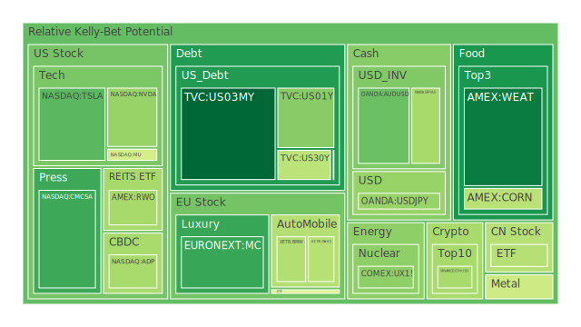
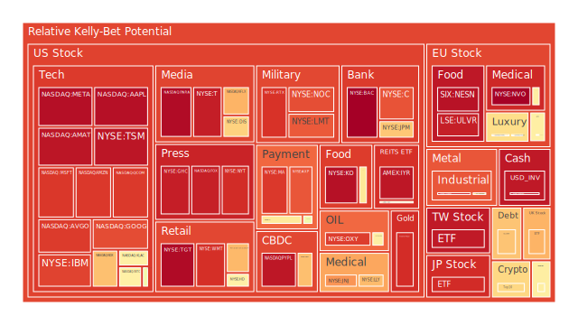
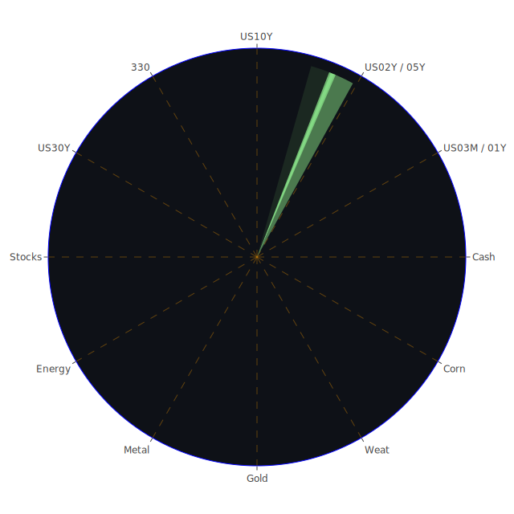

# 緒論：三位一體與正反合的觀點

在經濟分析中，常見的分析工具或許偏向單一層面的評估，但若能從空間（Spatial）、時間（Temporal）和概念（Conceptional）三方著手，綜合考量市場的地理分佈、時序變化，以及投資者的認知與理論建構，就可以形成更縝密的圖景。這種「三位一體」的思考模式，若再結合「正、反、合」的辯證法，可以提供我們在面對雜亂且多重動態因素並存的金融市場時，以多重角度審視各類資產、新聞事件與心理動向：

1. **Spatial（三位一體之空間面）：**  
   著眼於各國市場互動、全球資金流向以及不同產業或區域之間的連動關係。例如當美國國債殖利率走揚之際，資金往往驅動美元升值或帶動新興市場資金外流。又或是歐洲奢侈品股與新興市場消費潛力之對照，以及石油與黃金在地緣政治衝突下不同交易市場之區域差異。

2. **Temporal（三位一體之時間面）：**  
   任何資產或新聞事件的影響都會隨著時間推移而變化。例如短期的金融市場波動，可能起因於新聞面的突發訊息（如高官談話、企業財報、經濟數據釋出），中期則體現於投資者的情緒累積、法人資金調整，長期則關聯到產業結構變遷、技術革新、政治環境演變等。對於資產泡沫風險，我們也應該考慮其在日、週、月甚至更長時間區間（D1、D7、D14、D30等）中的變動趨勢，而非僅盯住單一時間點。

3. **Conceptional（三位一體之概念面）：**  
   涉及投資人心理學、主流經濟理論、博弈論策略以及社會學視角。投資人若普遍對未來景氣悲觀，則短暫的好消息也難以扭轉市場氛圍；若社會大眾對某種新技術產業（如AI、電動車）出現集體正面心理預期，資金就會蜂擁而至，形成可能的價格泡沫。博弈論部分則能提醒我們，不同利益團體（如各國政府、機構投資人）可能存在策略互動。例如新聞裡頻繁出現各國在貿易、外交與地緣政治上的角力，就會影響市場對未來政策的預判。

在此三位一體架構下，也可以把「正、反、合」視為市場對衝突訊息的調適過程：  
- **正面因素（正）**：如企業財報佳、消費數據好、某些利多政策或地緣政治緊張緩解等，都可能推升資產價格。  
- **反面因素（反）**：如利率走高、政府債務風險、企業營收不佳或金融機構倒閉風險等，會抑制資產價格。  
- **合（綜合）**：市場最終會在正反交互作用下取得一個短暫或動態的平衡點，直到出現下一階段的新訊息再次打破平衡。  

以下各類資產的泡沫分析、對沖機會、以及未來的可能佈局，都將圍繞這樣的思路展開。並根據近期新聞、歷史類比、既有理論和可能出現的理論外變數，嘗試對投資人提出若干風險提醒與策略建議。

---

# 投資商品泡沫分析

為更貼近此刻全球投資的廣度，我們先列出各常見投資標的的大略情況。以下所謂「D1」、「D7」、「D14」、「D30」風險分數，僅是一種模擬或量化指標，以捕捉近期至過去一個月的市場熱度和投機泡沫迹象。風險分數越高，代表可能的泡沫風險越大，值得投資人警惕。我們也同時參考新聞面和歷史案例做綜合解讀。

## 美國國債
美國國債（例如US03MY、US01Y、US05Y、US10Y、US30Y等）一向被視為全球資金的避險港，不過當前數據顯示中短天期的殖利率在4%至4.6%之間，表明市場對聯準會政策及未來衰退風險仍存較大分歧。  
- **短天期國債（US03MY、US01Y、US02Y等）**：近期D1與D7風險係數雖然不高，但在新聞中反覆出現「政府關門危機暫緩」「經濟數據不確定性升高」等訊息。「正」面來看，若經濟走弱，短天期國債可能有更多買盤湧入。「反」面則是通膨若捲土重來，殖利率上升，價格可能面臨壓力。  
- **長天期國債（US30Y、US20Y等）**：隨著長期利率多次接近4.6%～4.9%，顯示市場對未來10年以上期間的通膨及財政赤字疑慮仍在。「正」面或許是聯準會停止升息或轉向，帶來長債價格上漲；「反」面則是政府債務占GDP的比例升高，政策風險持續擴大。  

歷史類似情境：回顧1970與1980年代，美國在通膨與高利率的交互影響下，國債價格大幅波動；2008年金融海嘯後，更成為投資人避險的首選。當前整體看來，國債仍有防禦價值，但務必留意政府財政狀況，尤其是債務上限以及主權評級風險。

## 美國零售股
本次數據中可觀察到COST、WMT、TGT、HD等。從新聞面看，零售業看似受到通膨壓力與關稅衝擊，消費者可能往更便宜的選擇或削減支出。  
- **COST**：過去一向以量販模式吸引消費者在經濟疲弱時前往省錢，新聞顯示其泡沫分數存在中高水準，顯示市場對其未來成長性與防禦力都寄予厚望，但要留意現今利率與物價可能影響其購買力。  
- **WMT**：也是類似趨勢，根據最新數據，風險指標有偏高跡象，顯示資金仍在避險消費必需品領域尋求機會；然而新聞多次談及消費者因通膨考量持續「節省開支」，反映零售商一方面銷量增加，一方面利潤空間因促銷或供應鏈壓力而收窄。  
- **TGT**：也在通膨壓力和關稅衝突下增添不確定性。新聞提到它屬於較中端或有時跨高端類型的客群，若消費者預算縮減，後期銷售成長勢頭恐放緩。  
- **HD**（家得寶）則與房地產景氣相連動。若屋主對裝修與維修需求減少，可能使其營收在未來受到負面衝擊。近期數據顯示其D14與D30風險指數相對較高，須小心股價波動。  

此類型公司的歷史對比：2008年次貸危機時，不少零售股經歷了先重挫後逐漸復甦的過程。當前若經濟若持續疲弱，零售股普遍防禦力較必需消費型企業更高一些，但也可能面臨利潤壓縮風險。

## 美國科技股
美國科技龍頭包括MSFT、AAPL、AMZN、META、GOOG等；而晶片或半導體龍頭有NVDA、AMD、INTC、MU、KLAC、AMAT、AVGO、QCOM等，再加上電子支付類如PYPL。近年來，科技股長期表現強勢，泡沫積聚疑慮也常被提起。  
- **MSFT、AAPL、AMZN、META、GOOG**：屬於市值龐大的「巨頭」，新聞上時常報導它們的產品、財報與併購消息；本次數據顯示D1到D30風險指標有些出現偏高，例如GOOG的D7甚至達到0.88-0.91之間，AAPL的D1約0.96-0.97，說明市場對它們有高度預期，也對全球手機、雲端與AI產業發展充滿想像。但如同2000年網路泡沫教訓，若評價過於激昂，加上關稅干擾、政府監管，仍要提防修正風險。  
- **NVDA、AMD、INTC、MU、KLAC、AMAT、AVGO、QCOM**：半導體在AI、車用電子、高速運算等需求帶動下，近期營收與展望成為關注重點。新聞中也可見到AI需求促進數據中心建置，吸引資金湧入。但從數據看，NVDA、AMD、AVGO、QCOM等風險指數都曾出現中高水位，暗示潛在泡沫壓力。歷史經驗可回想2018年加密貨幣挖礦狂潮時，顯卡需求推升晶片股行情，但之後顯卡需求一旦衰退，股價亦大幅回落。  
- **PYPL**：電子支付領域老牌企業，報告顯示其D1至D30風險係數也接近0.95甚至以上，仍須警戒市場若對未來支付競爭激烈度與費率管制有所顧慮，短期估值恐承壓。  

## 美國房地產指數
包括RWO、VNQ、IYR等，主要反映美國房地產投資信託或不動產市場表現。新聞顯示美國通膨走勢趨緩，但房貸利率仍維持在6.6%～7%上下的水準，顯示購屋成本依舊高企，房市交易若持續降溫，REITs可能遭遇收益衰減。  
從風險數據看，VNQ和IYR於D7、D14、D30都顯示極高值，如0.91甚至逼近0.94以上，顯示投資人對房地產估值開始懷疑，或在利率環境尚未明顯寬鬆前，過度追高有一定風險。

## 加密貨幣
包含BTCUSD、ETHUSD、DOGEUSD等。比特幣在3/16數據中價格約在84,000美元附近（注意這是未來可能情景下的虛擬報價，並非現實記錄），D1風險指數一度飆升到0.68上下，有中高水準；ETHUSD和DOGEUSD則在0.39-0.57之間浮動。近期新聞對加密貨幣的正面與負面參半，有如「某些公司接受加密支付」的利多，以及「美國監管持續擴張」「市場避險情緒升溫」等利空。  
歷史曾在2021年底到2022年初經歷一輪大幅修正，投資者要提防波動性與泡沫風險一再上演。心理層面上，加密貨幣社群通常對利好訊息反應激烈，形成快速飆漲，但也容易隨恐慌性拋售而雪崩。

## 金/銀/銅
- **XAUUSD（黃金）**：新聞顯示最近因地緣政治與經濟不確定性，金價屢創高點，甚至衝破3000美元（或是接近此價），而此時市場相關新聞也提及投資大眾把黃金視為抗通膨、對抗股債波動的選擇。當前D1與D30風險分數約在0.45-0.46之間，也並非極度高檔；不過若市場對全球經濟恐慌進一步加深，也可能繼續推升金價並累積泡沫。  
- **XAGUSD（白銀）**：和黃金大致相近的貴金屬投資屬性，但工業需求占比較高。近期數據顯示風險分數曾飆到0.93左右，表示價格或有過度狂熱之虞。  
- **COPPER（銅）**：銅被廣泛應用於工業生產，若全球經濟成長趨緩，銅價則易下行。但近來也受中國需求、綠能轉型（電動車需銅）等消息支撐。泡沫風險在0.57-0.68不等，需關注工業需求量與宏觀經濟轉折。

## 黃豆 / 小麥 / 玉米
- **SOYB（黃豆）**、**WEAT（小麥）**、**CORN（玉米）**：皆為農產品，受氣候、地緣政治、全球需求和糧食安全政策影響極大。新聞面常有「某國限制糧食出口」「關稅衝擊糧食貿易」等。小麥（WEAT）近期D7、D14風險分數在0.14-0.17上下，並非極高；但若戰爭或糧荒議題突然升溫，價格易受到投機客炒作。  

## 石油 / 鈾期貨UX!
- **USOIL（石油）**：目前價格在67美元上下，D1到D30風險指數曾一度升至0.89，但也出現較大波動。如新聞中所言「美國原油受制於全球需求下滑」與「地緣政治制裁」等，短期波動難以避免，投資人需留意供需平衡及地緣事件。  
- **UX1!（鈾期貨）**：鈾受到核能再興等題材支撐，但因市場較小而波動劇烈。本次資料顯示其D1約0.35-0.59，風險不算特別高，但若未來核能政策或新能源發展加速，價格可能急漲。

## 各國外匯市場
- **USDJPY**：近期報價在148上下，D1約0.37-0.39，顯示對日本央行政策變化、全球資金避險動向都需密切關注。  
- **AUDUSD、GBPUSD、EURUSD**：皆呈現對美元匯率的波動。新聞面若再度爆發美國對其他國家關稅爭端或聯準會政策轉向，都會造成顯著影響。  

## 各國大盤指數
- **000300（滬深300）**：中國市場指數，觀察到其D7、D14風險較溫和，但仍在0.42-0.60之間，主要是因多數投資人對中國內需復甦抱有希望，但同時擔憂房地產與地方政府債務。  
- **NDX（納斯達克100）**、**FTSE（英國）**、**GDAXI（德國）**、**FCHI（法國）**、**JPN225（日本）**等西方或亞洲主流大盤，近期新聞常報導「國際資金輪動」「對美關稅與政治環境擔憂」等。不少指數D1到D30風險高於0.70，例如FTSE甚至有時超過0.90。  
- **0050（台灣50）**：該指數聚焦台灣電子高權值股，若美中科技對抗或國際需求變化，短期將出現波動。最新風險分數高達0.95左右，顯示短線漲幅或估值已較激昂。

## 美國半導體股
前文已談及NVDA、AMD、INTC、MU、KLAC、AMAT、AVGO、QCOM等，屬於高技術門檻、高資本支出、高毛利，但也高波動的行業。AI、5G、車用電子等題材仍為「正」面，但「反」面是晶片製造需大量資本，若需求放緩或地緣政治（中國或歐洲與美國的衝突）加劇，供應鏈與營收預期都可能受影響。市場對此族群的「合」是短期上漲空間仍在，但要隨時警惕泡沫破裂風險。

## 美國銀行股
包含COF、BAC、JPM、C、AXP等，近期整體金融市場因FED總資產變化、利率政策以及可能的消費者違約率上升而造成波動。新聞指出「美國銀行股雖然整體資本適足率提升，但若經濟衰退、企業違約風險攀升，都可能讓銀行面臨信用減損。」其中BAC在D1至D30風險分數甚至高達0.99左右，需嚴密關注。歷史上2008年金融風暴便是銀行類股承受最大壓力的時刻，投資人萬不可對體系性風險掉以輕心。

## 美國軍工股
LMT、NOC、RTX等。地緣政治一向能推升此類股價，但新聞也常透露「國防預算分配爭議」與「研發耗資」等問題。若美國國會在預算編列上出現分歧，或國防開支受制於財政壓力，此產業也會承受不確定性。短期依然具防禦特性，但估值若過高亦要留意泡沫。

## 美國電子支付股
V、MA、GPN、PYPL等，利用全球支付管道擴張而收益，但當前全球利率走勢與監管可能提高交易成本。PYPL風險係數高於0.95，V與MA同樣超過0.90，代表市場預期強烈，也隱含風險偏高。

## 美國藥商股
JNJ、MRK、LLY等，通常防禦屬性強，但新聞指出研發成本、專利糾紛、價格管控議題都會干擾股價。數據顯示LLY的D1與D7甚至在0.70-0.81以上，顯示市場對新藥或併購案期待很高，也須防範出現負面臨床試驗結果時的衝擊。

## 美國影視股
DIS、PARA、CMCSA、NFLX等。流媒體競爭激烈，且仍有消費者支出緊縮風險。DIS在新聞中常提到主題樂園業務能否持續吸引人流？PARA與CMCSA也在內容製作、串流平台投資龐大。NFT或元宇宙題材一度炒作，但不確定能否帶來長久收益。NFLX在疫情後或面臨成長放緩。

## 美國媒體股
NYT、FOX、GHC等，與新聞傳播、出版、教育內容相關。廣告收入容易受宏觀景氣影響。NYT風險指標超過0.90，顯示股價高度預期；但若景氣下行、廣告預算下修，營收也可能承壓。

## 石油防禦股
XOM、OXY等，前者為超大型石油公司，後者以頁岩油與化工業務見長。能源價格若下跌，利潤自然壓縮；若國際原油供應再次因地緣因素受限，則價格或利潤重新攀昇。OXY風險分數約在0.77-0.89之間，XOM也在0.60以上，說明投資人對油價的預測分歧巨大。

## 金礦防禦股
RGLD等，與金價連動性高。黃金若再度走強，金礦股受益；但股價波動通常比金價大，既是一種槓桿放大，也是一種放大風險。

## 歐洲奢侈品股
MC、KER、RMS等，對歐美與中國市場消費有深厚依賴。近來新聞提到中國解封後，奢侈品可能迎來一波報復性消費，但若宏觀衰退加重、高端消費者收緊預算，也會對其業績造成打擊。本報告所見數據顯示MC與RMS、KER的D7與D14值約在0.60-0.80之間。

## 歐洲汽車股
BMW等。歐洲車廠在電動化轉型之際，可能面臨美國與中國等市場關稅波動，新聞亦指出部分銷量不如預期，加上能源成本高企。本次資料顯示BMW的風險高於0.50，需觀察全球車市景氣回溫與否。

## 歐美食品股
KHC、NESN等，作為民生消費品，通常防禦力較佳，但近年健康飲食風潮、通膨推高原材料價格，新聞報導顯示其利潤空間或有壓力。NESN風險指數接近0.96，顯示市場對必需消費與防禦性抱持高度預期，但同時價格已逼近高估區域。

---

# 宏觀經濟傳導路徑分析

1. **貨幣政策與市場流動性**：  
   報告顯示美國聯準會的BTFP、Discount Window、SOFR、OIS等數據，皆呈現不一的走向，但總體而言目前利率仍在高檔徘徊。若接下來聯準會暫停升息甚至轉向降息，可能帶動股市短暫狂歡。然而，若通膨抬頭且財政赤字難解，長期利率仍易維持高位。  
   此外，多國央行在面對各種地緣政治衝擊與全球供應鏈變遷時，是否能保持「適度寬鬆」或「縮表」操作，也影響全球資金風向。資金成本一旦大幅波動，就會對高槓桿行業（科技、房地產）構成衝擊。

2. **財政政策與關稅/貿易衝突**：  
   新聞接連提到特朗普政府或國會議員再度揚言對部分進口品增收關稅，以及他國的報復性措施。這牽動跨國企業供應鏈布局，也造成全球經貿往來的停滯或價格上漲。若衝突加劇，通膨難以下降，各國被迫再次升息，全球需求衰退風險就升高。

3. **地緣政治與資源分配**：  
   中東、俄羅斯—烏克蘭、亞洲等區域衝突，都影響油價、糧價、金屬供應。軍事升溫也推高軍工股，但容易壓抑整體經濟活動。全球化若進一步分裂為多個陣營，供應鏈重組所需時間與資金投入都將拖累部分產業。

---

# 微觀經濟傳導路徑分析

1. **企業財報與估值**：  
   當利率維持在高水準，企業再融資成本上升，需求又可能受消費者縮手影響，企業獲利預期下修。短期看來，有品牌力或剛需產品的企業可以轉嫁成本，一般中小企業則可能出現大量倒閉或兼併，進一步帶來失業與需求萎縮的連鎖效應。

2. **消費者行為**：  
   新聞多次指出美國與部分歐洲民眾因通膨、利率攀升而轉向折扣零售商。支出結構改變，衝擊中高端零售與娛樂休閒產業。房地產市場方面，年輕人難以負擔高房貸利率，購屋行為遲緩，導致房地產銷售與裝修需求下降。

3. **投資者心理**：  
   媒體訊息（正面或負面）與市場傳聞加劇波動。一旦恐慌蔓延，債市、股市、加密幣市場都有可能經歷劇烈拋售。反之若消息轉佳，往往出現短暫的「空頭回補」或「融券軋空」，導致超漲反彈。

---

# 資產類別間傳導路徑分析

1. **債券—股票—外匯間**：  
   當投資人對股市風險升高有疑慮，往往轉往債市，尤其是美國短天期國債。美元需求上升時，其他貨幣（如AUDUSD、GBPUSD、EURUSD）或許貶值。反之若全球資金看好新興市場成長，則可能抽離美國債市、帶動美元回落。

2. **原物料—通膨—企業利潤**：  
   油價和糧價若大漲，帶動通膨持續，企業原料成本上揚，擠壓利潤。若央行被迫加息，股債雙殺風險也將擴大。

3. **房地產—金融機構—消費**：  
   房地產價格下跌或成交萎縮，銀行不良貸款率易攀升。若銀行開始緊縮放貸，企業和個人資金週轉困難，消費也會下降，形成惡性循環。

---

# 投資建議

基於上述分析，以下建議從「穩健」、「成長」、「高風險」三大類出發，並在當前環境考量下提供各自約略的資產配置比例。此處將三大類合計比重視為100%，而在每個大類中各選三個子投資項目，目標是讓投資組合之間盡量達到風險對沖效果，彼此相關性或相位盡量相差120度左右，理想相關係數約-0.5，使得整體組合波動度適度分散。

1. **穩健型（約30%）**  
   - **US10Y或US30Y（長天期美國國債）**：作為長期避險配置。  
   - **XAUUSD（黃金）**：傳統避險資產，雖然價格高漲，但仍可作防禦性佈局。  
   - **KHC或NESN（歐美食品股）**：必需消費品，具抗景氣循環能力。風險指數雖高，但在危機中通常較其他產業穩定。  

2. **成長型（約40%）**  
   - **NVDA或AMD（美國半導體）**：AI、自動駕駛等需求仍在中長期看俏，但需分散到其他標的以控管風險。  
   - **AMZN或MSFT（美國科技龍頭）**：雲端、電商與多元業務具中長期潛力。  
   - **BMW或MC（歐洲高端產業）**：即使短期歐洲經濟受壓，但若中國或其他新興市場消費回溫，奢侈品與汽車或能受惠。  

3. **高風險型（約30%）**  
   - **BTCUSD或ETHUSD（加密貨幣）**：波動巨大，有高收益高風險特性。建議僅作小比例佈局。  
   - **OXY或RGLD（能源與金礦防禦股）**：若原油或金價進一步上漲，獲利空間可觀，但也受地緣政治和市場情緒波動嚴重影響。  
   - **TSLA或PYPL（高動能美股）**：市場對特定龍頭企業的興奮或質疑都較極端，報酬與風險並存。  

此三大類的配置比重可視投資人自身的風險偏好與資金規模進行調整。透過把低相關度的標的結合在一起，若其中一部分出現較大虧損，可能由其他資產的漲勢進行緩衝。當然，這只是理想狀況，真正市場運行時，不同資產也可能同向波動，畢竟「流動性匱乏」時往往一切資產都可能被拋售。

---

# 風險對沖的各種投資組合機會

從「三位一體」概念的空間、時間、概念角度，並以正、反、合進行大膽假設，可嘗試以下對沖與資產輪動思路：

1. **空間面（Spatial）**：  
   - 美國與歐洲產業之間：例如將歐洲奢侈品（MC、RMS）與美國科技股（AAPL、MSFT）做對沖，若歐洲經濟衰退嚴重，奢侈品受創，而美國科技有機會承接部分全球資金，反之亦然。  
   - 原物料輸出國（如石油、礦業）與製造業輸出國（如德國、日本）：若石油或金屬價格上升，礦業股受益，而汽車和製造業成本上升承壓；若需求下滑則相反。

2. **時間面（Temporal）**：  
   - 短期操作 vs. 長期佈局：短期可以利用加密貨幣、某些高波動科技股做交易；長期則可透過國債、房地產REITs或黃金來穩定資產組合。  
   - 週期輪動：在景氣衰退早期，防禦類股與公債較佳；景氣回溫時，週期性股票與成長股表現突出。利用這種週期性來做對沖搭配。

3. **概念面（Conceptional）**：  
   - 博弈論：若某些大國要維持貨幣優勢，可能壓低自國利率或透過匯率干預，資金便往收益較好的海外資本市場流動。投資人可佈局有利差收益的外幣債或當地股市。  
   - 心理學與社會學：若某新科技（AI或新能源）得到市場狂熱追捧，其股價易出現過度投機；同時，傳統防禦股被短期忽視但長線報酬相對穩定。投資人可在狂熱時期適度獲利了結或反向配置。

透過此種思維，可以從中挑選相關係數較低或甚至反向波動的資產，將組合內各成分之間盡量維持負相關，理想落在-0.5上下，並在時間軸上錯開配置，不要讓所有資本同時暴露於相同風險衝擊之中。

---

# 彼此之間的三位一體驗證與篩選假設分析

1. **軍工股 vs. 半導體股 vs. 加密貨幣**：  
   - 「正面」：軍工股在地緣衝突時具防禦優勢，半導體受AI與需求推動，加密貨幣吸引喜愛高波動的投機資金。  
   - 「反面」：若國際局勢緩和，軍工預算可能降低；若半導體需求放緩或供應鏈中斷，成長趨勢受阻；若監管政策對加密貨幣打擊，價格恐暴跌。  
   - 「合」：投資人可少量配置加密貨幣以爭取高報酬機會，並用軍工與半導體股分散政治與產業風險。  
   - **三位一體空間面**：美國國防需求與全球加密市場分佈迥異；**時間面**：長期看AI仍蓬勃成長，但短期政治消息易造成行情波動；**概念面**：投資人對國家安全、技術演進與對數位資產的信念各自不同，使得資金流動在這三種標的之間存在一定負相關。

2. **能源股 vs. 黃金 vs. 歐洲汽車**：  
   - 「正面」：能源股（如OXY）在油價高漲時利潤飆升，黃金在動盪時吸納資金，歐洲汽車（如BMW）在全球中高端消費正常時能維持銷量。  
   - 「反面」：若經濟嚴重衰退，能源需求下滑油價跌；若市場轉樂觀，黃金可能走跌；若關稅及衝突阻礙出口，歐洲車廠營收下滑。  
   - 「合」：三者間的市場驅動因素差異大，彼此可能分散風險。  
   - **三位一體空間面**：能源股較依賴全球原油市場，黃金則是國際性金融商品，汽車依賴歐洲與其他地區銷售；**時間面**：短期油價劇烈波動，黃金隨避險情緒，中長期汽車亦看電動化轉型；**概念面**：對資金、保值與實體消費的認知構成多層次對沖。

3. **必需消費 vs. 科技巨頭 vs. REITs**：  
   - 「正面」：必需消費（如NESN、KHC）防禦性能高，科技巨頭（AMZN、MSFT）提供成長潛力，REITs（VNQ、IYR）在低利環境時能帶來穩定租金收入。  
   - 「反面」：若通膨持續，必需消費成本高、利潤受壓縮；科技股估值泡沫破裂；REITs在利率上揚時價格受衝擊。  
   - 「合」：在溫和的經濟情境中，三者各有其收益來源而非完全同向波動。  
   - **三位一體空間面**：必需消費品跨全球銷售，科技巨頭全球市佔，REITs主要鎖定美國本土不動產；**時間面**：必需消費短期受通膨影響，科技股中長期看成長，REITs則隨利率轉變；**概念面**：投資人心理對「高成長」與「穩定配息」的評價權衡，增加負相關性。

綜上所述，將此種「正、反、合」加上「三位一體」的驗證方式，可以在多重產業、區域與貨幣條件下，過濾出較符合投資人風險承受度且相對互補的配置方向，並讓投資組合的「各自漣漪效應」不至於集中爆發。

---

# 風險提示

投資需承擔風險，市場的不確定性永遠存在。本報告所提的觀點與建議僅供參考，最終決策應取決於個人對風險的忍受度、資金配置狀況、投資期間長短及個人目標。以下幾點是需高度留意的風險：

1. **泡沫風險警告**：  
   無論是科技股、半導體、加密貨幣還是黃金與房地產，若投機資金過度集中，估值可能遠超出基本面。當市場信心動搖時，股價或價格會猛烈回檔。

2. **關稅戰與地緣政治衝突**：  
   若各國貿易保護主義興起（尤其美國再度提高關稅），供應鏈受損，或戰爭升溫導致能源、糧食供應短缺，隨時能引發巨大市場風險。

3. **聯準會與各國央行政策突變**：  
   一旦通膨抬頭，貨幣當局可能重新轉向強力升息，對股債市形成壓力；或若經濟衰退超預期，央行放寬政策也可能造成特定資產過熱。

4. **金融機構體系性風險**：  
   若銀行或大型金融機構因壞帳累積、衍生性金融商品暴雷，可能引發連鎖反應。這一點在2008年被深刻驗證，至今仍不可忽視。

5. **流動性與投資心理**：  
   資金面若出現挹注不足，流動性抽乾時，往往任何資產都難以單獨倖免；此外，群眾心理在市場過熱或崩跌時會造成非理性行為，要特別謹慎管理自我情緒。

---

## 結語

在空間面、時間面、概念面的多重交織下，金融市場中各類資產的價格都可能隨「新聞事件」、「宏觀政策」與「投資心理」而劇烈波動。以正反合的方式審視新聞資訊與歷史經驗，可讓我們更冷靜地思考潛藏的泡沫風險與潛在機會；再將風險對沖原理與博弈論思維相結合，可在資產配置中，儘量挑選相關度較低的標的，使整體組合得到更好的風險分散效果。

正如所有投資策略都必須因時而變，面對現今的利率高度、地緣政治不斷、關稅戰重燃的可能性，以及各式新技術（AI、電動車、再生能源）所引發的巨大想像空間，投資人更應該在追求報酬的同時，不忽視包含潛在泡沫在內的警訊。建議在佈局時不宜過度集中單一資產，亦不應盲目追逐市場熱點，謹慎管理自身部位、確保留有足夠彈性對應突發風險，才更可能於瞬息萬變的金融世界中立於不敗之地。

**投資有風險，市場總是充滿不確定性。本報告僅供參考，投資者應根據自身風險承受能力與投資目標，進行獨立判斷並謹慎操作。**

 
Daily Buy Map:

 
Daily Sell Map:

 
Daily Radar Chart:

 
