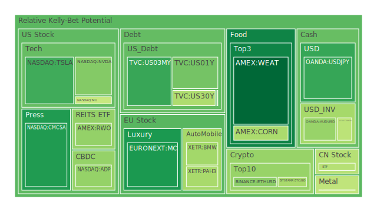
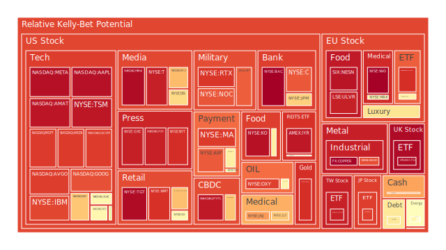
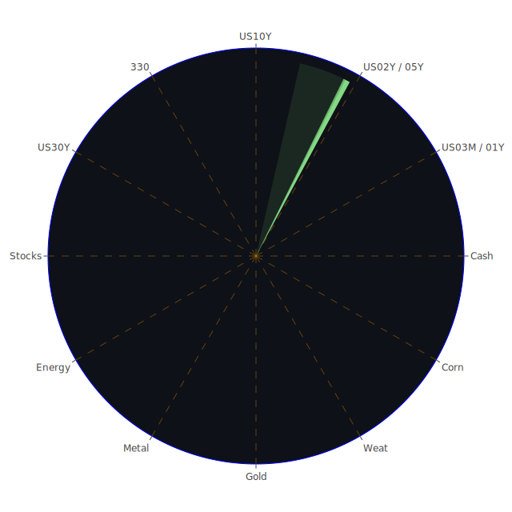

# 投資商品泡沫分析

## 1. 美國國債（US Treasury）
從近期的FED關鍵數據來看，美國短期公債（1Y、2Y）收益率大致仍維持在4%上下，長天期（30Y）的收益率則約為4.63%，反映投資人對未來通膨與經濟成長的期待稍有分歧。歷史上，當收益率曲線平坦甚至倒掛時，市場往往會警惕經濟衰退的可能。若觀察D1、D7、D14、D30等泡沫指數，有些指標雖然顯示美國國債並未出現高漲的泡沫分數，但也不能忽視全球債券市場因政策動盪或地緣政治而可能產生的劇烈波動。新聞面中，過去數日並無特別針對美國國債的激烈負面報導，但若關注「Wall Street Rips Up Credit Forecasts as Policy Woes Snowball」等新聞標題，可見對未來信貸壓力的擔憂仍在。若經濟學上出現「貨幣緊縮—衰退—再寬鬆」的循環，心理學面向則體現市場情緒的持續波動，社會學與博弈論層面則顯示投資者會評估他人行為，集體湧入或拋售。若未來FED突然轉向鷹派甚至放鷹講話次數增加，都可能使收益率隨之變動，使美國國債的價格與泡沫風險呈現跳躍。

## 2. 美國零售股
美國零售相關的指標股，如WMT、TGT、HD等，近期新聞顯示消費者支出出現分化，有新聞稱「Americans sour on economy as inflation expectations hit highest level since 1991」等，負面情緒似乎使零售股承壓。但另有「S&P 500 Stages Rebound After \$5 Trillion Plunge」等消息顯示短暫回升。整體來看，零售股泡沫分數雖普遍不算極高，然而若經濟繼續放緩，通脹揮之不去，消費者情緒也會持續受到打擊。從社會學面向而言，若居民可支配所得放緩，購買力下降，必然使零售股未來獲利預期走低，心理學上會形成「預期消費緊縮」的自我實現。歷史上類似的狀況可見於2008年金融海嘯前後的零售滑坡，也可見於2020年初疫情爆發時的恐慌性消費與隨後數月的消費趨緩。當前雖無立即崩盤跡象，但需警惕空間與時間維度交錯帶來的結構性衝擊。

## 3. 美國科技股
美國科技板塊，如AAPL、MSFT、GOOG、META、TSLA、AMD、NVDA等，近年來享受AI與數位轉型趨勢，但近期面臨多重挑戰，包括全球經濟緊張、關稅紛爭，以及新聞面「Tesla raises concerns over retaliatory tariffs in unsigned letter」或「Apple’s Siri Chief Calls AI Delays Ugly」等。若從泡沫分數來看，例如TSLA、NVDA等，其D7、D14數值時有上升，但是否構成嚴重泡沫，仍需視資金流向而定。歷史上，2000年網路泡沫給市場警惕：當心理學層面過度誇大「未來高成長」而忽略基本面時，很容易引爆大幅回調。博弈論視角下，各大科企在AI、電動車與雲端等領域互相競爭與競合，使得估值有時脫離傳統本益比範疇。近期美國科技股的波動，除了地緣政治外，也受「中美科技競賽」等影響，社會學面向則顯示一般投資人對「科技創新」高度期待，因此產生短期追捧與急跌交替。

## 4. 美國房地產指數
以RWO、VNQ等追蹤美國房地產或不動產投資信託（REITs）的標的為例，泡沫指數在D7、D14、D30區間都有不小幅度的波動。近期固定房貸30Y利率位於6.65%（相較一年前3.17%的超低水準仍高），說明房地產融資成本依然居高不下。2020年之後，美國房地產因低利率狂飆，但目前市場供給面不足及建築成本上升，令房價仍在相對高檔。不過社會學層面顯示，年輕世代購房意願因高通膨與工資成長不及房價而持續受壓；心理學層面上，投資者對「房地產永遠只漲不跌」的信念近期有鬆動跡象；博弈論中，銀行及房地產業者若面臨交易量萎縮，可能進入等待對手先調降價格的僵局。歷史鏡鑑可追溯2008年房地產泡沫破裂。雖然當前金融體系防火牆更強，但若就業市場一旦惡化，也可能再觸發大範圍調整。

## 5. 加密貨幣
BTC（比特幣）與ETH（以太幣）等在幾日內波動劇烈，如BTC一度接近84000上下，也有DOGE等小幣種。新聞面「Asset manager VanEck files for Avalanche ETF as altcoin rush heats up」同時透露投機情緒猶存。D1、D7等泡沫指標對加密貨幣有偏高預警，歷史上多次「加密牛熊循環」已說明投資者常在短期內出現集體恐慌或狂熱。社會學面向會強調「群體趨勢效應」：即一旦新聞吹捧，散戶爭相湧入；若媒體負面報導增多，投資人恐慌性出逃。心理學上，FOMO（害怕錯失）與恐慌拋售交織。博弈論來看，主力大戶與機構投資者在長期布局與短期割韭菜之間策略多端，導致短週期內泡沫化風險極高。參考2021-2022年加密市場的高速漲跌，此類資產需非常謹慎。

## 6. 金 / 銀 / 銅
金銀等貴金屬短期似乎承受股市與債市動盪的避險需求推升，金價持續逼近3000美元，亦有新聞指出「Gold reaches \$3,000 as trade war escalates」。金/油比（GOLD OIL RATIO）一度達44以上，顯示黃金昂貴或原油相對疲弱。銀（XAGUSD）則因產業需求和投機性買盤交織，波動明顯。銅（COPPER）作為經濟晴雨表，新聞指「Spring tulips bloom at higher prices as poor harvest drives up cost」並非直接談銅，但隱含通膨壓力可能侵蝕企業利潤。博弈論上，若全球產業活動放緩，銅價或承壓；反之，一旦各國基礎建設加碼，銅需求又飆升。心理學層面，金屬價格常反映對未來經濟預期的信心或不安。歷史上，金價常在危機時急漲，但也在恐慌過後回跌，投資者宜留意泡沫化風險。

## 7. 黃豆 / 小麥 / 玉米
這些農產品常受天候、地緣政治、貿易政策影響。近來CORN、WEAT、SOYB等雖泡沫指數未見極端值，但若氣候異常或貿易戰重新升級，價格可能迅速上漲。心理學角度，糧食安全與價格敏感度都很高，新聞曾報導「Why is the global rubber market likely to see shortages in 2025?」雖非直接針對黃豆或小麥，但足見全球農產品供需在疫情與戰爭陰影下很脆弱。歷史上，2012年美國大旱曾推升農產品價格飆漲。博弈論中，各國糧食戰略儲備與出口管制都可能影響市場。

## 8. 石油 / 鈾期貨
石油（USOIL）價格近期在60-70美元區間震盪，新聞面「OPEC 產油國與美國之間博弈」屬常見議題。高泡沫風險有時突因地緣政治，譬如「中東衝突」或「俄烏戰局」加劇時油價瞬間拉升。鈾期貨（UX1!）雖在能源轉型下存在結構性需求，但亦有報導透露核能在部分地區備受質疑。回顧1970年代石油危機，油價飆升重創全球經濟。若市場預期衰退，石油需求將減少，價格可能走弱。然而心理學方面，投資人一旦認定油價「被低估」，或將吸引大量投機資金湧入。博弈論上，主要產油國協調減產或增產，都可能左右短期價格走勢。

## 9. 各國外匯市場
如EURUSD、USDJPY、GBPUSD、AUDUSD等近期波動較明顯。外匯市場同時受到利率政策、通膨預期、國際貿易平衡等影響，新聞中談到「U.S. calls for better access to Korean market」等顯示貿易談判仍在持續。歷史上常見外匯劇烈波動引發金融風暴，如1997年亞洲金融危機。當前若各國央行貨幣政策分歧，資金會瞬間流向利率較高或對衝較安全的貨幣。心理學層面上，投資人對政治與經濟消息格外敏感，博弈論則顯示大型金融機構可透過利率差與匯率變動進行套利，若操作失誤也會放大市場泡沫風險。

## 10. 各國大盤指數
如SSE（中國大陸）、FTSE（英國）、GDAXI（德國）等，近來受地緣風險與供應鏈問題影響。新聞顯示歐洲工業重鎮如德國正在努力提高國防與基礎建設投資，並有「Thousands demonstrate for more investment in German industry」。然而製造業經營成本上升，市場對未來企業獲利存疑。中國則面臨「China to crack down on stock market fake news」等監管風險。回顧歷史，2015年中國A股泡沫破裂對全球市場都產生外溢效應。各國大盤指數雖然可看作經濟長期趨勢指標，但短期仍可能因貿易衝突、疫情再起或地緣動盪而震盪加劇。

## 11. 美國半導體股
包括NVDA、AMD、INTC、KLAC、AMAT等，近期因AI、雲端、大數據需求帶動整體板塊熱度不減。然而新聞指出「Big Tech Stocks at Cheapest in Months Fail to Entice Wary Buyers」，預示投資人對於高估值仍有顧慮。在博弈論框架中，各大晶片廠爭奪客戶與技術領先地位，也面臨美中科技限制帶來的市場切割風險。回望2001年網路泡沫後，大量半導體公司減產或被迫重組。半導體產業週期性向來顯著，若需求階段性見頂，加之庫存調整，股價跌幅往往頗為劇烈。D7或D14泡沫指數若居高不下，也得注意獲利了結的壓力。

## 12. 美國銀行股
如JPM、BAC、C、COF等，近期在利率上升與放貸風險之間權衡。新聞中提及「Credit card debt is getting in the way of saving for many workers nearing retirement」，顯示信用卡負債風險累積；另有「Banks Boom And Shoppers Scrimp a Year After Japan’s Rate Pivot」等報導，說明銀行體系因利差擴大而短期獲利增長，但長期來看，若企業及個人無法承擔高利率而違約率上升，銀行股可能面臨資本充足率或逾放比升高的風險。回顧2008年金融危機，銀行體系的次貸及衍生品風險失控造成全球衰退。心理學層面，投資者對銀行體系信心一旦動搖，股價會出現踩踏式的下跌。

## 13. 美國軍工股
如LMT、NOC、RTX等，軍工產業多倚賴國防預算與地緣衝突的推動。新聞有報導「Germany parties agree on historic defense spending deal」，顯示歐洲可能加大防務投入。歷史上，冷戰時期美國軍工產業獲得長期增長，但一旦緊張局勢解除，軍費亦有縮減風險。從心理學來看，投資軍工股常伴隨道德爭議，但在地緣動蕩下，市場可能視其為「逆勢成長」或「防禦類股」。社會學層面，政治與民意壓力會左右軍費是否持續成長。博弈論認為，軍工企業之間對技術、合約爭奪激烈，資本市場對於更先進的軍事產品也給予較高評價。

## 14. 美國電子支付股
如PYPL、MA、V、GPN等。疫情期間電子支付蓬勃發展，但後疫情時代消費習慣未必完全保持線上模式。新聞顯示「Rubrik CEO: 'We see continued strong demand'」雖非直接談支付，但反映美國科技及企業服務整體仍有一定需求。然「US Attacks on Houthis Will Be ‘Unrelenting,’ Hegseth Says」等政治衝突新聞，可能間接影響國際支付通道安全與跨境業務拓展。歷史上，有些電子支付公司在拓展失敗市場或陷入激烈價格戰時，股價大跌。D1或D7之泡沫指標一旦走高，需留意資本市場對該產業是否過度預期。

## 15. 美國藥商股
如MRK、LLY等，藥商往往在景氣循環中屬相對防禦性標的，尤其面臨通膨及衰退時，醫療需求相對剛性。然而也有新聞如「Drugmakers agree to participate in second round of price negotiations」使市場擔憂政府管制與降價壓力。歷史上，藥價談判常發生於美國兩黨競選期間，最終會落實不同程度政策。社會學角度分析，民眾對醫療保健之重視逐年攀升，而心理學層面，恐懼重大疾病與對健康的需求使市場持續資金流入此類股。博弈論觀之，藥廠往往聚焦研發競爭，但政策干預也難避免，若研發成果不及預期，股價亦會高位回落。

## 16. 美國影視股
如NFLX、DIS、PARA等，近年來OTT（串流媒體）競爭激烈，市場普遍聚焦付費用戶數與新節目投入。新聞面「Stock of the Day: Semtech surges 13% with huge data center demand a bright spot in slumping AI trade」雖非直接涉影視，但顯示線上數據需求仍很旺。然而「Americans sour on economy as inflation expectations hit highest level since 1991」暗示消費者娛樂支出可能縮水。歷史上，經濟衰退或高失業率期間，家庭文娛預算會被大幅刪減。心理學來看，若短期失去話題大作或被競品吸走用戶，影視股估值容易大幅震盪。博弈論上，各家平台競爭者聚焦內容獨家性與跨領域整合，有時也會合縱連橫以對抗更大型對手。

## 17. 美國媒體股
如CMCSA、NYT、FOX等，廣告收入與訂閱收入是主要來源，受景氣循環與政治廣告時程干擾。新聞中屢見「Major air carriers challenge ruling on Biden airline fee rules」或「China to crack down on stock market fake news」等資訊，其實都可能透過媒體轉播或報導產生市場影響。2016年美國大選、2020年疫情期間，媒體股同樣呈現大幅波動。當前泡沫分數對媒體股雖未達極端，但D14或D30若攀升，也需關注廣告主縮減預算的風險。博弈論上，傳統媒體與新媒體爭奪收視和點擊，社會學層面也考量讀者群對內容的信任度與取態，若負面新聞大量爆發，也會衝擊媒體股收入。

## 18. 石油防禦股
如XOM、OXY等，與石油價格緊密關聯。若政治局勢或經濟邁向衰退，石油需求下滑，相關股價往往先行受影響。然而在地緣衝突時，或油價大漲時，石油類股也可能充當「通膨避險」。心理學層面，投資者容易將其與石油價格高度綁定；社會學上，化石能源公司面臨ESG與環保訴求的挑戰。歷史上，1970年代石油股曾迎來驚人的上漲行情，然在後期也面臨價格崩塌風險。若泡沫分數攀升，投資人應留意高油價若帶動終端通脹，也會引發政策干預。

## 19. 金礦防禦股
如RGLD等，隨金價起伏，屬傳統避險選擇。若金價逼近3000美元，金礦股往往受市場追捧。心理學角度，投資人視其為「武裝避險」：不僅擁有金價支撐，也有資源開採本身的實質價值。然而一旦經濟轉好、利率上升，或者避險需求減弱，金礦防禦股亦可能迅速回吐漲幅。社會學面向，近年ESG觀點對採礦業監管漸嚴，潛藏成本攀升風險；博弈論則指出主要金礦企業之間亦競爭有限礦區資源。

## 20. 歐洲奢侈品股
如MC（LVMH母集團）、RMS、KER等，近年依賴中國消費者與全球富裕階層支撐。新聞中「China to crack down on stock market fake news」雖與奢侈品並無直接對應，但中國消費力下降或疫情反覆，都足以使奢侈品銷售放慢。過去在2015-2016年中國股災時，歐洲奢侈品牌曾大受影響。心理學上，奢侈消費具有「炫耀性」，社會學角度強調富裕階層的消費彈性仍大，但若全球經濟走弱，富豪也不會無限制揮霍。博弈論觀點認為，奢侈品業者常透過營銷稀缺性刺激消費，泡沫分數若升高，提醒投資人留意高估值風險。

## 21. 歐洲汽車股
如BMW、MBG等，數據顯示一度傳出獲利下滑。新聞「BMW profits take big hit, down 37% in 2024」在多日新聞中重複出現，顯示該產業面臨電動化轉型、供應鏈短缺與市場競爭白熱化。歷史上，汽車業具有典型的週期性，高峰時產能大幅擴張，景氣下行時則現產能過剩。心理學層面，消費者在衰退預期下延後購車；社會學層面，城市化或共享經濟興起亦影響汽車需求。博弈論認為，各國對新能源與傳統車政策傾斜不同，也會造成市場結構快速改變。

## 22. 歐美食品股
如KHC、KO、SIX:NESN、WMT、TGT（部分零售同時含食品業務），食品消費具剛性，但原物料成本上升亦壓縮利潤。新聞如「Drugmakers agree to participate in second round of price negotiations」雖是另一產業，但同樣反映政府對必需品價格管控的可能性。歷史上，食品股具防禦特性，除非爆發嚴重食品安全問題或消費習慣巨變，否則泡沫不易迅速破裂。然而在通膨居高不下的情況下，若終端消費者轉向更便宜的品牌，龍頭業者也會面臨成長壓力。博弈論觀之，各家食品巨頭多壟斷市場，互相競爭卻也有定價默契，泡沫風險稍低，但回報率也可能隨市場飽和而趨平。

---

# 宏觀經濟傳導路徑分析
1. **利率傳導**：OIS FED Fund Rate、SOFR、美國國債收益率等在高位震盪，影響企業融資成本及家庭貸款利息；若經濟下行或FED放鷹增加，利率變動可能顯著，牽動股市及商品價格。
2. **通膨與就業**：CPIYOY雖僅2.83%，但長期通膨預期持續升溫會壓縮消費力，使企業獲利承壓。就業市場若走弱，將進一步削減消費支出。
3. **國際貿易與貨幣戰**：貿易關稅、地緣政治爭端加劇，導致國際資本流動變化，影響外匯市場及國家間債券收益差。
4. **能源與原物料供應**：石油、天然氣及基礎金屬若供應不穩或價格飆漲，可能帶動全產業鏈成本提升、抑制經濟活動。
5. **金融機構資本充足度**：銀行、保險、基金在信用風險上升時，可能壓抑放貸及投資規模，引發廣義貨幣收縮。

---

# 微觀經濟傳導路徑分析
1. **企業獲利結構**：利率升高導致企業融資成本變高，創新產業的研發投入可能放緩，電商及製造業也面臨毛利率壓縮。
2. **消費者行為**：社會學視角下，通膨升溫削弱購買力，加上勞工階層實質薪資成長有限，微觀層面消費可能向生活必需品集中，非必需品銷售萎縮。
3. **企業間博弈**：部分產業，龍頭以價格策略或市場壟斷維持利潤，小型企業承受更大生存壓力。若大型企業合縱連橫，可能加深行業集中度。
4. **投資者心理**：心理學層面反映在股市波動率升高，散戶常受到新聞情緒影響而集中追漲殺跌，機構投資者則藉程式化交易或量化策略進行套利。

---

# 資產類別間傳導路徑分析
1. **股債跷跷板效應**：當風險偏好下降，資金流入債市，股市承受拋壓；若利率走高，債券價格下跌，也會波及高估值成長股。
2. **商品與股票的防禦屬性**：金礦股與石油防禦股常被視為避險標的，但若地緣衝突或貨幣政策趨緊，也會影響整體需求，造成股價同漲或同跌。
3. **外匯與跨國企業盈餘**：美元強勢或弱勢，將影響跨國企業匯損收益，導致大盤指數波動。新興市場貨幣貶值時，當地原物料或農產品價格相對便宜，影響全球供應鏈配置。
4. **加密貨幣與科技股聯動**：部分投資人將加密貨幣視為類「高Beta」資產，當科技股大漲，虛擬貨幣也往往受到追捧；反之下跌亦同步放大。

---

# 投資建議

## 一、風險對沖的各種投資組合機會
基於三位一體「正、反、合」之原則，並考量投資標的之間的相關性盡量朝-0.5左右、相位差120度的組合，可嘗試以下思路：

1. **組合A：美國科技股 + 石油防禦股 + 金礦防禦股**  
   - 美國科技股（如MSFT、GOOG、AAPL）與石油防禦股（如XOM、OXY）在歷史上相關度偏低，金礦股（如RGLD）在避險時能平衡風險。此組合可在科技榮景與通膨防禦兩端取得一定對沖效果。

2. **組合B：美國銀行股 + 加密貨幣 + 農產品ETF**  
   - 銀行股（如JPM、BAC）受利率變動影響較大；加密貨幣（BTC、ETH）雖高波動，但與傳統金融的相關度偶爾出現逆勢；搭配農產品（CORN、WEAT、SOYB）或可緩解經濟衝擊，形成三角互補。

3. **組合C：美國房地產REITs + 歐洲奢侈品股 + 黃金**  
   - 房地產類（RWO、VNQ）雖與利率成反向，但若地區需求強韌仍具防禦；歐洲奢侈品（MC、RMS）在消費恢復或中國旅遊回暖時可有不錯表現；黃金（XAUUSD）則在市場風險加劇時提供避險。

上述三種組合模式僅提供參考，每個組合內的標的之相關性不是完全固定，也會隨時間和政策變化而波動。但若能精心測算並持續追蹤泡沫分數（例如D1、D7、D14、D30）來動態調整，可在不同市況下降低總體波動。

## 二、穩健、成長、高風險三種配置（總和100%）
1. **穩健型（約40%）**  
   - （1）美國國債（部分比重可分散至2Y、5Y、10Y）  
   - （2）黃金實物或金礦股（防禦搭配通膨對沖）  
   - （3）歐洲食品股（或其他穩定配息的食品股，如KO等）  

   說明：強調相對低波動、防禦性。美國國債收益率固然不高，但波動小。黃金防範地緣動盪；食品股則具剛性需求。此類組合波動度較低。

2. **成長型（約40%）**  
   - （1）美國科技股（如AAPL、MSFT、GOOG）  
   - （2）美國半導體股（如AMD、NVDA）  
   - （3）歐洲奢侈品股（MC、RMS或KER）  

   說明：瞄準AI、消費升級與全球化等長期成長趨勢，但需警惕估值偏高帶來的回調風險。若心理學因素帶動過度追捧，需謹慎分批布局。

3. **高風險型（約20%）**  
   - （1）加密貨幣（BTC、ETH）  
   - （2）新興市場高收益債（流動性與違約風險高）  
   - （3）能源衍生品或鈾期貨（因政策及地緣政治波動巨大）  

   說明：高風險同時可能帶來高報酬，但必須備有充足資金應對大幅回調。建議只在風險承受能力高者或短期投機為主者考慮。

---

# 風險提示

投資有風險，市場永遠充滿不確定性。本報告所提之觀點與建議，僅供參考，投資者應根據自身之風險承受能力與投資目標，做出獨立判斷與決策。尤其在泡沫風險可能較高的市場，如加密貨幣、部分高估值科技股等，更需隨時警惕潛在的劇烈波動。

1. **泡沫風險**：若D1、D7、D14、D30等指數顯示資產泡沫累積，短期回調可能相當劇烈，並伴隨資金流向的快速逆轉。
2. **政策與地緣干擾**：貿易關稅、地緣衝突、央行政策轉向等都可能使市場出現超預期波動；任何突發重大新聞都需及時應變。
3. **流動性與違約風險**：高收益債券、新興市場資產、加密貨幣等流動性風險高，市場恐慌時可能流動性枯竭、無法脫手。
4. **心理與群體效應**：過度樂觀或恐慌等情緒蔓延時，資產價格常偏離合理區間。謹慎評估自身投資心態，避免盲目追漲殺跌。

---

綜觀而言，當前市場同時受到通膨、利率政策、地緣政治與全球化逆轉等多重因素影響，投資者需在空間（各地市場）、時間（短中長期週期）與概念（經濟、社會、心理、博弈）四維度下平衡分析。不同資產間存在潛在的聯動與對沖機制，也隱含著高度不確定性。一旦任一環節轉向或爆發衝擊，漣漪效應將傳導至金融市場之各個角落。唯有不斷監測泡沫指數及關鍵新聞動態，並保持靈活調整與風險管控，才有機會在「正、反、合」的動態變化中抓住穩健防禦與成長收益並存的契機。

最後再次強調：本報告分享了結合歷史經驗、新聞觀察與多領域理論分析的結論，但具體投資決策仍需投資人因應自身條件及目標評估。投資永遠存在不確定，請謹慎判斷並做好風險管理。祝投資順利。  

 
Daily Buy Map:

 
Daily Sell Map:

 
Daily Radar Chart:

 
