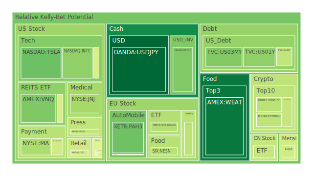

# 觀點統整

1. **空間（Spatial）觀點**：  
   - 從地理與市場互動分佈來看，全球各主要經濟體都面臨不同階段的貨幣緊縮或寬鬆策略。例如美國仍在觀望短端利率走勢，歐洲面臨奢侈品與汽車產業出口的動能挑戰，亞洲部分地區努力透過財政或產業政策來促進需求。這些不同區域策略的互相碰撞在新聞中反映為「國家間關稅互相打壓」、「市場對部分高科技股或民生消費品抱持不確定」，以及「各地對於軍工、能源及糧食等安全議題的重視度提升」。從空間面的博弈角度來看，各國傾向維護自身金融主權，因此在國債利率與外匯市場波動中，都能看到此種競合。對投資人而言，區域分散化可降低單一市場風險，但若各地同步面臨泡沫風險或流動性壓力，空間分散可能也難以提供足夠緩衝。
   - 新聞事件在各國地理範圍內的交互影響：如美國與加拿大的石油與天然氣合作、日本對新興市場投資擴張、歐洲因內部政治動盪對金融和產業造成壓力等等，皆體現在全球產業鏈再分配與關稅壁壘的升降。社會層面出現對「移民政策」、「貿易保護主義」的輿情爭論，也因國際新聞傳遞導致多處社會對外交與投資議題產生焦慮。

2. **時間（Temporal）觀點**：  
   - 以經濟學來看，長期利率走勢（例如美國10年、20年、30年國債殖利率）漸有回落，但仍維持在相對高檔水準。部分新聞顯示，高收益債利率雖曾上揚，但近期有穩定跡象，而不少資料也顯示聯準會資產負債表的縮減尚未結束，對資產價格可能產生持續波動。若從歷史參照，如1994、2008金融危機以來，市場對「流動性壓縮」的恐慌總會在聯準會與其他央行的動向裡隱現。當前新聞指出美國抵押貸款利率在6.6%上下波動，日本等國則在觀望全球景氣轉向，形成不確定的通膨緩和走勢，這種在時間軸上的連鎖反應值得投資人警惕。
   - 社會與心理層面的時間觀點：投資者短期情緒往往受到新聞中對企業獲利與地緣政治緊張的負面陳述影響，尤其近期新聞對「汽車關稅」、「鋼鋁關稅」與「房地產供需不平衡」議題的渲染，使市場焦慮更快地放大；然而也有部份正面新聞，如「德國大力投資國防工業」、「部分新興市場獲得強力需求刺激」等，使投資者的風險偏好週期快速轉變。從心理學角度，市場參與者的從眾效應與恐懼/貪婪交替循環，常在新聞刺激下走出短期急漲或急跌，繼而在數月後才出現較冷靜的修正。
   - 博弈論層面，許多國家與企業為了確保自身在中長期發展中的位置，採取「先下手為強」策略，如美國維持對某些中國科技企業的制裁或限制，歐洲對能源及奢侈品市場的保護，日本著眼於自動化、機器人及半導體領域補貼等，都在時間上形成漸次累積的影響。這些舉措在未來數年可能持續發酵，並非一朝一夕就能緩和。

3. **概念（Conceptional）觀點**：  
   - 從經濟學的理論可提出「比較利益」與「供需均衡」的假設，若需求方對某些資產或商品的預期大幅提升，短期價格會迅速上漲，卻也同時埋下泡沫風險。例如近期對電動車技術、AI晶片、以及軍工產業的需求熱度高漲，新聞頻繁提及「Tesla」、「AMD」、「軍工大單」、「晶片股走高」等。若預期無法兌現，或供應鏈出現超額供給，價格就有急修正的風險。
   - 社會學與心理學層面，投資者很容易受到「代表性偏誤」與「可得性偏誤」的影響——個別重大新聞，例如「網紅爭議影片」、「某財團大幅投資某區域」、「某科技公司研發突破」，都可能激發非理性的短期追捧或恐慌，而忽視基礎數據。這在概念層面可被視為一種投資者心態的「集體狂熱」，從過往歷史包括網路泡沫（2000年）、次貸危機（2008年）都能找到對應案例。
   - 博弈論框架下，不同國家、產業、甚至企業之間互相制衡，常常選擇「囚徒困境」中偏向保護自己市場的策略。對金融市場而言，就會陸續出現各種限制出口、高關稅、技術封鎖或並購阻礙的消息，使不少跨國企業在投資布局上更趨謹慎。也因此，一些發展中市場或區域會在短期享有國際資本湧入的甜頭，但若時局突變，也可能在新聞訊息發酵中引來資金大舉外撤。

綜合以上三大維度，我們接下來將一一探討各投資品種在近期可能出現的泡沫風險特徵，以及新聞事件如何觸發或緩和這些風險。

---

# 投資商品泡沫分析

以下針對多種常被關注的投資標的進行敘述，並結合歷史、新聞動態以及心理層面的考量，分析其可能的泡沫風險與相對估值狀況。需留意的是，從提供的各種數據來看，不少資產的當日與週期平均風險指標已相當高，如部分美國科技股、美國軍工股、美國電子支付股等，泡沫分數在部分時間點甚至逼近或超過0.9。這些訊號意謂高估值與高市場情緒並存，投資人務必嚴防泡沫風險。

## 美國國債
美國國債殖利率近期仍維持高位，10年、20年與30年之間的利差小幅波動，表面上看似市場對長期通脹與風險的預估仍高。然而，新聞資訊顯示政府或將面臨財政再度擴張的壓力，且部分投資者對債務上限或財政協商顯示的政治僵局持保留態度。歷史上，若國債殖利率持續走高但未超越某臨界值，對股市資金成本的擠壓並不會驟然發生，但若利率快速攀升，則可能引發其他資產價格的跳水。就泡沫風險而言，國債較不易形成典型的「急漲式」泡沫，但若利率過快上調，對整體市場的連帶衝擊不可小覷。

## 美國零售股
新聞顯示部分美國零售商仍面臨消費者支出保守，信用卡負債上升的壓力。一些財報或預估營收指引下修，投資人對零售股的風險意識增強，尤其在網購與通路新模式的衝擊之下，一些傳統零售股經營壓力頗大。歷史經驗顯示，零售股具週期性特徵，消費信心與就業市場走勢息息相關。如果經濟前景不確定性攀升，零售股利潤空間易壓縮。新聞裡對「政府關門擔憂」、「關稅升溫」、「通脹壓力」的報導，均會進一步動搖投資者對零售股的信心。相對而言，這類標的泡沫風險多半集中於消費熱度突然被高估時，目前看似沒有過度熱潮，但仍須留意財報不及預期的衝擊。

## 美國科技股
從泡沫指標與新聞報導可見，科技股尤其半導體、雲端運算、人工智慧相關公司經歷了數次漲跌。過去一年，部分龍頭科技股估值曾大幅修正，但近期因AI、量子計算、車用晶片等利好題材再度帶動股價回彈。新聞例如「AMD在日本遊戲GPU市佔率攀升」、「Ba​idu釋出新一代AI模型」、「Tesla計畫在中國推出更便宜的Model Y」等，都反映市場對科技創新仍具高度期待。然而，若企業獲利無法跟上高估值，或地緣政治（如關稅與技術封鎖）升溫，可能讓這些股票短期內波動劇烈。歷史上（如2000年的網路泡沫）顯示，當大量資金將未來成長預期提前反映在股價中，市場若遇到利率緊縮或大規模資金撤離，容易產生迅速破裂的風險。

## 美國房地產指數
美國房地產市場長期以來受惠於寬鬆利率，但現在抵押貸款利率已達6.6%上下，使得房貸月供負擔增加。新聞也顯示一些民眾信用卡負債高企，可能影響購屋意願。不過，如同歷史多次循環，房地產市場若出現階段性壓力，也會出現投資者逢低進場的心理，特別是對某些高人口成長區或租金回報較優的區域。就泡沫而言，若房地產價格再度被低利或特殊需求炒作至超高水平，而實際支付能力與租金收益無法跟上，便會出現潛在泡沫裂縫。2008年次貸危機即是前車之鑑，故儘管目前尚未出現大規模違約潮，但需格外注意信用狀況與貸款結構的變化。

## 加密貨幣
近期部分加密貨幣（如比特幣、以太幣與狗狗幣）的價格波動依舊劇烈。有新聞指出世界各地對於監管與稅制策略不同，造成市場預期反覆。從社會學與心理學角度，加密市場上投資人的集體情緒仍扮演重要角色，一旦有政策收緊的消息或資金流動性收斂，幣價容易快速下跌；反之，若有巨頭公司入場或應用落地傳言，價格又可瞬間飆漲。過去「2021年牛市」與「2022年的大跌」皆顯示，幣市在經濟景氣變化下波動幅度極大。就泡沫風險而言，當部分主流幣的短期投資需求超越實際使用功能許多時，便是泡沫警訊。

## 金/銀/銅
黃金因其避險屬性，通常在地緣政治緊張及市場對通脹疑慮升溫時受到追捧，新聞中如「中東地區衝突再起」、「股市震盪」等，常會帶動金價急漲。另一方面，銅作為工業與新興科技（電動車、綠能基礎建設）的重要原料，需求面在中國或新興市場復甦時容易被市場看好。若新聞提到「中國擴大基建」、「推動產業升級」的利好，銅價往往應聲上揚。然而，若世界經濟放緩，銅需求不及預期，銅價也會修正劇烈。就泡沫風險言，貴金屬相對較受地緣與貨幣因素驅動，不易出現長期極端泡沫，但也可能在短期市場追捧之下出現價格飆漲後重挫。

## 黃豆 / 小麥 / 玉米
農產品受天氣、地緣政治（例如出口禁令）、貿易關稅等因素波動甚鉅。當前新聞並未突出農業重大危機，但提及「全球橡膠短缺預期」、「某些地區糧食供給需強化」等，也提醒投資者注意未來各地氣候異常的可能。歷史上，糧價易受極端氣候、地緣紛爭、運輸成本、主要生產國政策影響而發生劇烈震盪。對投資人而言，農產品一般被視為通脹對沖與實物需求的標的，但也不是完全沒有泡沫風險。若投機資金大量湧入期貨市場，也可能出現短期爆炒，再面臨供需平衡後急速回跌。

## 石油 / 鈾期貨UX!
石油價格近期因各國減產與需求端的中國復甦議題而上下波動，新聞顯示「油價有時隨中國經濟刺激而上揚，但整體仍低於先前高點」。若地緣政治風險升高，石油常瞬間跳漲，但若全球景氣衰退又讓需求下滑，油價便會急跌。就泡沫風險而言，油市較常見的是因供應突然緊縮或戰爭事件而炒高，但同時受利率與美元流動性影響也大。至於鈾期貨屬相對小眾且高度依賴核能發展政策與地緣風險意識，但若核能需求預期升溫，資金可能一窩蜂湧入，仍具備泡沫與劇烈波動的可能。

## 各國外匯市場
新聞多次強調「各國對自家貨幣主權與貿易競爭力的注重」，加上資金在美國與其他市場之間的利差套利反覆，使得日元、英鎊、歐元等匯價出現反覆。英鎊近期有通膨與政治不確定性，歐元則受會員國內部政策差異影響。外匯市場常見的是因貨幣政策預期與地緣事件急速走強或走弱。如英國脫歐期間的劇烈震盪、歐洲債務危機期間的歐元暴跌等，都是外匯市場泡沫化與去泡沫化的劇烈案例。投資人若單純追逐短線波動，要留意槓桿風險與突發新聞的影響。

## 各國大盤指數
對投資風險承擔度較低的投資者而言，大盤指數相對分散，但並非絕對安全。新聞如果涉及重大系統風險，如宏觀經濟衰退、主權債務危機、銀行流動性事件等，會導致整體指數大幅度震盪。回顧歷史，如1997年亞洲金融風暴、2008年全球金融海嘯期間，許多國家大盤指數都出現腰斬，而在利好環境下（例如超低利率、量化寬鬆）則指數屢創新高。泡沫風險多半隨宏觀流動性而起伏，目前因各國仍在控制通脹，未來大盤走勢可能持續高波動。

## 美國半導體股
半導體是新興科技應用（AI、電動車、5G）核心，新聞中多次提到「NVIDIA、AMD、INTEL」股價波動，且有關稅與專利限制的政治角力。歷史上半導體週期性很強，當需求爆發或廠商競爭格局有利時，股價可能出現倍數增長；反之，若供應過剩或技術替代發生，股價就會大幅下跌。近期AI需求帶來新的期望，但尚需時間檢驗獲利能力是否能與市值相匹配。由於某些龍頭公司的泡沫指數一度達到相對高檔，投資者須謹慎留意市盈率與長期成長前景的落差。

## 美國銀行股
銀行股受新聞中「信用卡負債上揚」、「商業地產違約風險」、「利差收窄」、「消費者儲蓄率降低」等因素壓力所影響。2008年金融危機前曾有金融股的高估現象；目前雖然監管更加嚴格，但一旦出現全局性流動性壓力（如市場對銀行信心不穩），銀行股也可能大跌。信用卡壞帳率與商業不動產貸款逾期若持續增加，則會衝擊銀行資產品質。需要留心近期是否出現一些地方銀行破產或收購整合的新聞，可能引發市場對系統性風險的連鎖擔憂。

## 美國軍工股
地緣政治衝突的升溫，及各國國防預算的加大投入，使軍工類股一度受到市場熱捧。像是歐洲各國開始提升軍備，德國達成「歷史性國防支出協定」，美國國會也更願意擴充軍費，這些新聞都有助於軍工股表現。但軍工產業的壁壘與需求相對穩定，也容易在暴利與經營道德的爭議中受到政治風向的左右。歷史顯示軍工股因政策預算變動而大漲大跌者不在少數，但當國防支出進入長期趨勢時，龍頭公司往往能保持穩定獲利。需提防該產業在「預算瓶頸」或「政治黨派突然轉向」時的系統性回調。

## 美國電子支付股
數位支付、金融科技相關企業在疫情期間經歷了迅猛成長，跨境支付量與線上交易量大幅提升。但隨著宏觀環境趨緊，消費者支出降溫，交易手續費等收入也可能減少。新聞也提到一些金融機構受到監管壓力，而電子支付公司需面臨更多洗錢防制與數據隱私政策。歷史上，新興金融服務在爆發成長後若遭遇利率提升或監管趨嚴，常出現估值快速下修的階段。對投資人而言，該產業儘管前景具潛力，但短期泡沫風險仍需謹慎看待。

## 美國藥商股
藥品研發與醫療需求有其剛性，但也受到專利、法規、定價權及公共衛生政策影響。新聞中若出現「政府削減醫療保險或藥價談判」等，往往衝擊藥廠股價。另一方面，新藥或疫苗研發成功則能拉抬公司估值。歷史經驗看來，藥商股若集中於數家巨擘壟斷，盈利相對穩定，但一旦面臨專利到期或法規風向改變，跌幅也能很驚人。泡沫風險通常來自炒作「潛力新藥」與資金追捧的預期過度，而成為價值與估值脫節的典型案例之一。

## 美國影視股
影視產業受串流平台崛起與消費型態改變的衝擊，部份傳統電影製片與電視頻道面臨成長瓶頸。新聞同時顯示，一些串流媒體也因用戶成長飽和，與創新內容投入成本高企，而陷入營收壓力。歷史上，媒體產業常以收購整併與內容競賽的方式來維持增長。若廣告市場景氣下行，或消費者收看行為再次轉向，該產業恐面臨衝擊。泡沫風險若從心理層面看，就在於市場常對「熱門IP」或「媒體版權」給出誇張估值，一旦需求或口碑轉冷，回調幅度不小。

## 美國媒體股
有時與影視領域重疊，但更廣涵蓋新聞台、出版商、娛樂集團等。當前部分媒體股業務模式轉型至數位平台；若廣告客戶預算縮減，新媒體與傳統媒體都面臨收入短缺。新聞中一些勞資衝突、政治干預或社群媒體的分流競爭，都可能在短期內大幅改變媒體股價預期。長期來看，媒體業若無成功的付費訂閱或多元營收模式，也易陷入高估值泡沫被戳破的困境。

## 石油防禦股
主要指從事石油採掘、煉製或運輸的公司，其防禦性來自世界對能源仍有持續需求。新聞指出「油價雖在高檔震盪，但仍與地緣政治高度聯動」，一旦國際局勢緩和或需求不及預期，股價也會下修。歷史上此類股票曾多次隨油價週期而大漲大跌，投資人若進場追高，需承擔能源供需失衡時的下行風險。泡沫風險來自在油價上漲期的大舉炒作，尤其是若上漲主因是地緣矛盾而非真正需求，則未來回調空間可觀。

## 金礦防禦股
金礦股行情走勢與金價緊密相連，新聞若揭示地緣政治動盪或通脹仍高等情況，多會激發投資人加碼黃金需求，進而提高金礦股收益。但金礦公司也面臨勘探風險、開採成本、環境與社會政策壓力等。歷史顯示，金礦股的股價常在金價轉折時出現加倍波動，因為其財務槓桿與開採成本可能放大多空影響。若金市泡沫散去，金礦股通常跌幅亦很深。

## 歐洲奢侈品股
奢侈品依賴高端消費者的購買力，包括中國、歐美等地富裕人群。在新聞看來，若中國消費復甦，或歐美富人繼續進口高端品，奢侈品股的業績可保持。歷史上，奢侈品牌的股價受到經濟週期性影響相對較小，但在全球景氣若轉差或地緣政治導致觀光、奢侈品消費受挫，股價修正也不容小覷。過度炒作的泡沫風險在於投資者對品牌溢價的極度認同，若宏觀或政治事件打擊富裕階層可支配收入，需求萎縮時估值反轉。

## 歐洲汽車股
歐洲汽車產業正面臨「電動化轉型」、「全球關稅爭端」、「中國市場競爭」等挑戰。新聞指出「BMW利潤下滑」、「Audi計畫裁員」，都代表德國豪華車市場面臨壓力。回顧歷史，歐洲汽車業在經濟繁榮時盈利豐碩，面對危機或轉型期時又呈現大規模裁員與整併。新世代電動車玩家的崛起與零組件供應鏈重構，都可能對傳統歐洲車廠估值造成壓力。泡沫風險在於若市場持續以舊模式與成長預估去評價這些企業，而忽視電動化、智能化等大趨勢所造成的結構性衝擊，那麼一旦真實銷售表現不及預期，將面臨猛烈修正。

## 歐美食品股
食品股相對防禦，但也受通脹、原料成本、供應鏈與人力等要素影響。新聞顯示如果油價、農產品價格或包裝、物流等成本攀升，將壓縮食品企業利潤。歷史上，食品業的日常需求支撐可避免崩盤，但一旦估值過高，或者競爭對手有技術與規模優勢，仍可能造成個別公司股價重挫。投資人如要佈局食品股，須留意區域市場差異、匯率風險及原料價格走勢。

---

# 宏觀經濟傳導路徑分析
新聞及數據顯示，美國聯準會在資產負債表縮減、政策利率調整，以及各類資金市場（RRP、EFFR、Discount Window等工具）動態都有所變化。整體看來，目前市場融資成本雖比疫情初期顯著提升，但對企業貸款需求與投資行為仍有逐步收斂的影響。  
從博弈論角度，各國央行之間亦存在默契或摩擦：如歐洲央行觀察美國通膨與就業數據進行因應；日本央行在面臨資金熱錢湧入和本國高負債壓力時，選擇維持較低利率。宏觀層面若發生較大變動，如美國再度升息或歐洲主要國家政治動盪，將透過匯率與資本流動迅速傳染給新興市場，造成外匯波動、進出口貿易與商品價格全面連鎖反應。  
歷史上，任何央行的激進政策都可能被其他央行牴觸或互補，如1998年東亞金融風暴時，在國際貸款收緊造成區域連鎖銀行危機。當前由於全球化程度更深，傳導路徑更為複雜，若任一主要央行或國家忽然採取強硬保護主義，彼此施加關稅或貿易壁壘，價格失衡與需求斷層會通過貨幣與資本市場蔓延。

---

# 微觀經濟傳導路徑分析
企業端的投資與融資成本、庫存水位、研發支出與人力成本管理，都直接影響財報表現。若銀行信貸收縮或利息上升，企業現金流容易緊張。新聞中提到的「商業不動產違約」、「中小企業破產」、「企業之間因關稅議題調整供應鏈」等，都在微觀層面改變著營運結構。  
從社會學與心理學層面，若消費者預期經濟前景黯淡，更可能減少耐久財消費與投資型消費，零售、房地產、汽車、奢侈品等行業最先感受壓力。反之，若某些資產（例如加密貨幣或軍工概念股）被投資人視為「避險」或「快速成長」的載具，資金會瞬間蜂擁而至，形成局部泡沫。如此一來，企業的營運決策也會跟著短期投資者的情緒波動而波動。

---

# 資產類別間傳導路徑分析
1. **外匯與大宗商品**：當美元走強，通常壓抑原物料與新興市場資金流；若油價高漲，將轉嫁到生產及運輸成本，侵蝕企業利潤；若農產品價格上升，影響民生支出結構並壓迫其他消費品行業的利潤空間。  
2. **債券與股票市場**：若國債殖利率升高吸引大量資金流入避險，股市易面臨拋售壓力。倘若利率突然下行，風險性資產（如科技股、半導體股）又會受到市場青睞，引發輪動。  
3. **房市與金融業**：房貸利率變化與銀行股的資產品質密切相關，商業不動產市場若發生重大違約，銀行資本充足率與市場信心也會受到連帶衝擊。  
4. **高風險資產與避險資產**：如加密貨幣和黃金常在市場恐慌或資金寬鬆時出現相反或相似的波動模式，視資金屬性而定。若劇烈通脹危機來襲，黃金或部分實體資產或許能維持價值，而加密貨幣表現則不一定。  
5. **新聞消息的心理傳導**：當一則負面新聞集中在某產業，如「汽車關稅」恐衝擊歐洲汽車股，然而金融機構擔憂其違約風險時，也可能拉低銀行與保險股。若新聞正面，例如「中國加大基建拉抬銅與能源需求」，則帶動相關區域與企業的預期。

---

# 投資建議
基於前述分析，各種資產之間的風險對沖可以透過不同投資組合的相位（在博弈論或金融數理中常提及不同資產能有負相關或中度相關），大約選擇相關度在-0.5左右、或在週期上呈120度相移的方式配置，以降低系統性風險。這裡提供穩健、成長與高風險三種配置方向，供投資人參考：

1. **穩健配置（合計100%）**  
   - 可以考量美國國債（約30%），兼顧流動性與相對安全性，借以對沖市場下行風險。  
   - 貴金屬如黃金（約40%），因地緣政治不確定仍高，黃金有助於在大幅波動時提供避險。  
   - 農產品期貨例如小麥或黃豆（約30%），作為通膨下具備剛性需求的實體商品，若通脹再度攀升，它們的走勢與金融資產存在中低度相關，有助平衡。

2. **成長配置（合計100%）**  
   - 美國科技股（約30%），把握AI、雲端或車用晶片等長期成長潛力，但要警惕高估值的泡沫；挑選財務面穩健、研發投入領先的龍頭較佳。  
   - 軍工股（約40%），全球防禦支出趨勢增溫，長期訂單可能支撐利潤，但也需評估政治風險與政策風向改變的可能。  
   - 半導體設備或材料供應商（約30%），此類公司往往在產業擴充中獲得穩定收益，雖然週期性強，但若成長周期無意外斷裂，回報也可觀。

3. **高風險配置（合計100%）**  
   - 加密貨幣（約20%），短線波動極大，必須充分認知監管與流動性風險。  
   - 新興市場高收益債（約40%），若全球資金流向追逐利差，這些債券報酬可觀，但一旦流動性反轉會面臨顯著違約風險。  
   - 高波動科技或汽車股（約40%），例如積極投入電動車與自駕技術的企業，若成功突破則能享受高成長，也要承擔評價過高被市場修正的可能。

上述比重僅為示意，投資人須按照個人偏好與實際情況靈活調整。選擇資產時需考慮波動率、流動性、產業邏輯與現實政策環境，不要單純因新聞一時的正負面情緒而盲目進出。

---

# 風險提示
投資有風險，市場永遠充滿不確定性。特別要注意那些泡沫風險高的市場警告：  
- **科技類股與軍工股** 估值若與實際獲利嚴重脫節，高泡沫指標隨時可能引發回調。  
- **加密貨幣** 受監管趨勢、宏觀資金面與市場情緒多重衝擊，劇烈波動難以預測。  
- **商業地產** 與 **銀行業** 信用連動，若出現違約潮，將對整體金融體系造成衝擊。  
- **地緣政治風險** 一旦惡化，石油、貴金屬等關鍵商品和軍工、半導體等產業將同步放大波動，傳導速度加快。  
- **通脹與貨幣政策** 走向若再度反轉、利率快速上升，可能導致大盤股價與債市遭遇同向下跌的罕見情況。  
- **新聞加速市場情緒**，「恐慌-追捧」的週期會被自媒體與各種訊息管道放大，極端樂觀或悲觀都需保持警惕。

總結而言，各種資產之間並非完全獨立，其關聯程度可能隨著新聞、政策與心理因素而隨時變動。投資人若能在空間、時間與概念三大維度之下，同時綜合經濟學、社會學、心理學與博弈論等多種觀點去評估，就能較全面地掌握風險、把握機會。但本報告所提供的資訊與假設僅供參考，無法保證市場實際走勢。請投資者根據自身的財務狀況和風險承受能力，審慎判斷並做出獨立決策。

最後再次提醒，任何投資都存在泡沫或錯估之可能，尤其當新聞事件與市場情緒交織時，更需警惕短期暴漲暴跌的風險。建議保持多元配置、嚴謹避險機制及長期追蹤研究，以應對瞬息萬變的市場環境。

 
Daily Buy Map:

 
Daily Sell Map:

 
Daily Radar Chart:

 
