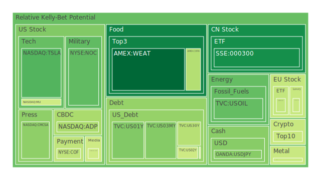
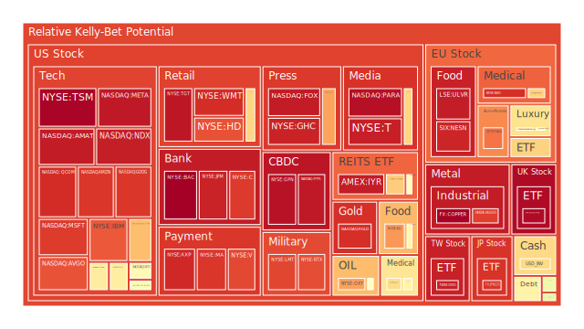
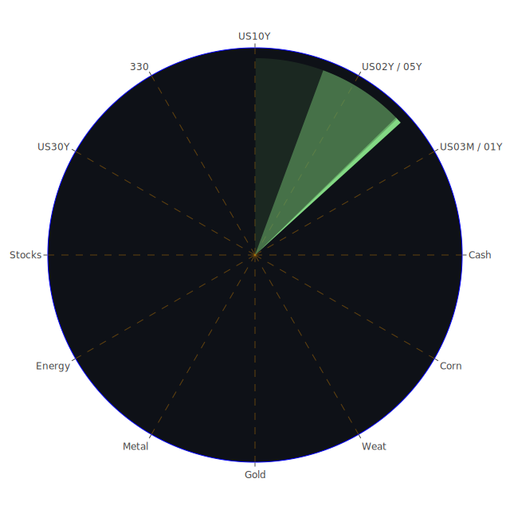

# 投資商品泡沫分析

在此部分，我們將針對多種關鍵資產進行描述，包含近期新聞所帶來的心理或情緒面衝擊，並從經濟與社會角度推敲其潛在風險。需特別注意的是，此報告雖著重於對泡沫跡象的觀察，但並不代表每一資產均處於不可挽回之泡沫狀態，而是提醒市場對各種指標的敏感性，以及日後可能出現的動態變化。

## **美國國債**
在空間面（Spatial）上，美國國債的市場結構與聯準會（FED）政策走向、全球資金流動、外國政府持有量之比例息息相關。根據最近提供的美國公債殖利率訊號，2Y美債收益率曾在去年高點逼近5%以上，目前約落在4.0-4.3上下區間；30Y殖利率約在4.59，整體收益率曲線出現部分倒掛的持續情形。過去若出現較明顯倒掛，往往暗示市場對經濟衰退的預期。而新聞面上，「投資人拋售美國股票資金大舉轉進現金或短期債券」的負面情緒也可能推升短天期國債價格。  
在時間面（Temporal）上，當前FED利率走勢依然具不確定性。報告中提及「2025-01-29之後有2次鷹派談話」，雖絕對數量不多，但市場對可能的貨幣緊縮態度仍存關注。此外，長期國債殖利率歷史高點出現後，市場也在觀察降息預期。這個時間維度的反覆扭動，對長短天期的資金配置都會產生影響。  
在概念面（Conceptional）上，美國國債被視為全球資金的避險港，同時亦可能成為流動性收緊或寬鬆的槓桿。博弈論角度看，若FED維持相對緊縮，其他國家亦不得不承受貨幣相對壓力；心理學層面，投資人對「美國國債究竟還是不是無風險資產」的質疑聲，不斷在市場循環出現。然而歷史上（例如2008年金融危機以及2020年疫情初期），美國國債依然強化了其避險功能，顯示市場在極度恐慌時，最終多半還是回流美國國債。  
綜合來看，美國國債的泡沫風險指標雖不如部分高估值股市嚴峻，但長短天期之倒掛仍然值得警惕，一旦市場對利率方向有大幅修正，公債價格也不排除劇烈波動。

## **美國零售股**
美國零售股近年屢屢受到消費趨勢與通膨壓力的干擾。空間面上，零售業分散度頗高，龍頭企業市占固然可觀，但新聞裡反映了「大型零售商可能面臨消費信心衰退」的負面消息，且「房貸利率升高與信用卡壓力增大」也都影響美國消費者的可支配所得。  
在時間面上，歷史經驗顯示：零售股在假日消費季前後波動劇烈，亦會受到整體經濟週期影響。近期「美國零售銷售成長放緩」的報導增多，使市場對零售業營收預期走低。  
在概念面，美國零售股價格往往反映消費者心理。若失業率攀升、消費者預期不明，零售業可能面臨庫存積壓、折扣促銷擴大的風險，股價隨之承受壓力。博弈論視角下，零售龍頭能以價格戰壓制中小型競爭者，但也拉低整體利潤空間。心理層面，投資者對於「再通膨與消費恢復」的期待若失落，零售股評價恐加速下修。從近期新聞（如有些美國大型零售商裁員、營運指引下調）看來，該領域泡沫風險可能呈現中高位，須謹慎關注。

## **美國科技股**
空間面：美國科技股在全球股市中占比高，前期出現所謂「7檔科技巨頭」推動美股上漲。但報告中有提到「這些龍頭科技股於最近一季下滑最劇烈」，顯示市場風險偏好下修的跡象。  
時間面：科技股在2020～2021年受到超寬鬆環境催化出相當高的估值水準，然後在2022～2023年因升息而面臨壓力，現今2025年市場對AI、晶片、自動駕駛等議題繼續看好，但也出現「估值過高」等討論。歷史上類似的「科網熱潮」（例如2000年網際網路泡沫）也反映出當大多數投資人看好某些新技術或熱潮，但獲利模式尚未完全穩定時，隨著全球資金流緊縮，可能爆發劇烈調整。  
概念面：科技股往往涉及高成長、高競爭、研發投入巨大的結構。心理層面則受「FOMO（害怕錯過）」影響，導致資金爭相追捧。博弈論上，巨頭之間可以藉由合併與專利交叉授權擴張護城河，但新創公司也可能憑著創新而顛覆格局。根據新聞數據，「美國科技股近兩年資金流出量創紀錄」與「投資人對AI過度樂觀後開始獲利了結」等線索，都暗示此領域的泡沫風險不容忽視。

## **美國房地產指數**
空間面：美國房地產市場具區域性差異，但整體仍受抵押貸款利率與就業市場影響。近期利率維持高檔，部分地區房價仍頗高，導致購屋意願疲弱。  
時間面：歷史上，美國房地產在2007～2008年因次貸危機發生過猛烈泡沫破裂，後經多輪寬鬆重建信心。2020年疫情初期亦出現一波降息推升的房市榮景，但高通膨與升息循環讓市場開始出現「泡沫化」的警訊。  
概念面：房地產泡沫易被視為「金融與實體經濟雙重風險源」。一旦消費者出現無力負擔貸款的現象，銀行體系與債券市場也將連帶受衝擊。心理層面，投資人常誤認「房價只漲不跌」，如今卻面臨現金流收縮與貸款額度受限的情況。新近新聞亦顯示「美國大型銀行對房地產部門貸款審慎度提升」及「公共與商業房產空置率攀升」，暗示該指數後續泡沫風險仍高。

## **加密貨幣**
空間面：加密貨幣交易遍及全球，多數主要交易所、礦工活動分布廣泛。市場的波動性一向較其他資產高，任何監管風聲或技術問題皆可能觸發劇烈震盪。  
時間面：比特幣及部分山寨幣曾在2021年衝上高點，接著在2022～2023年陷入長期熊市。到2025年，市場雖有「擴大應用場景與合規化」的正面期待，但新聞面不時出現監管壓力，也可能瞬間逆轉行情。歷史上加密貨幣泡沫的典型例子是2017年底至2018年初的崩盤，此後屢次反彈和修正顯示該市場周期短、波動大。  
概念面：博弈論角度看，加密貨幣市場常呈現投機心理，散戶在亢奮或恐慌時會大舉買入或拋售。心理學上，FOMO與鯨魚（大戶）操作易放大漲跌幅。從報告中的風險值看，比特幣與乙太幣雖有不同的日均風險分數，但整體仍保持高波動。部分新聞如「加密貨幣交易所破產或爭議」都會削弱短期市場信心，預計仍有中高泡沫風險。

## **金／銀／銅**
空間面：貴金屬（金銀）與工業金屬（銅）的供需結構大不相同。金銀常被視為避險資產，銅與全球製造、基礎建設及新興市場需求密切相關。  
時間面：金價在近些年面對多輪通膨及地緣政治風險時皆有上揚；銀價的工業需求成分相對較高，也常跟隨金價。但銅價在中國與全球經濟回暖時能出現強勢行情。歷史上2008年金融危機後曾出現銅價大漲，但隨著景氣週期變化也會轉為下修。  
概念面：從博弈論看，金銀的投資者多半將其作為對沖通膨與金融市場動盪的工具；銅則更像是全球工業活動的晴雨表。近期新聞提到「中國需求回升」或「地緣衝突可能帶動軍工及基礎建設支出」，對銅價存有利多。然而報告中顯示銅的泡沫風險指數在短期內衝至相當高水平後，又略有回落，但仍不可忽視波動。金銀因避險資金流入，雖帶來高漲，但也蘊含回調壓力。

## **黃豆 / 小麥 / 玉米**
空間面：這些農產品期貨在全球範圍內受到氣候與地緣政治影響，部分地區若爆發戰事或自然災害，價格易呈現劇烈波動。  
時間面：歷史上農產品期貨曾受制於糧食禁令、天災或疫情等，出現短期價格飆升例子（例如2010年前後俄羅斯的小麥出口禁令）。  
概念面：對沖基金或大型貿易商經常運用博弈策略在期貨市場上操作。心理層面，若市場預期供給短缺（如「俄烏衝突影響穀物出口」），交易熱度會飆高，使得期貨價格易被情緒放大。報告中提及的風險指數顯示玉米、小麥、黃豆都有中度到偏高的泡沫跡象。尤其「AMEX:WEAT」與「AMEX:SOYB」短天期平均的風險值仍有抬頭，顯示投資人情緒易隨新聞面波動。

## **石油 / 鈾期貨（UX）**
空間面：石油為全球最重要的大宗商品，OPEC+產量決策、美國頁岩油產量等都對國際油價產生影響。至於鈾期貨主要與核能相關，其市場交易量遠較石油小，但也與地緣政治、核能政策緊密相關。  
時間面：歷史上石油價格大起大落的週期皆明顯，例如1970年代石油危機、2008年逼近每桶140美元、2020年疫情初期期貨甚至一度出現負值等。鈾的價格波段則常受安全事故或核能擴增計畫刺激。  
概念面：石油和鈾同為能源資產，但石油的投機性更強；鈾則較倚賴長期合約。近期新聞提到「地緣政治風險依然高企」、原油庫存增減數據、以及核能逐漸獲得部分國家重視的同時，也有輿論憂慮核能安全。報告中石油的風險指數處於中等偏高；鈾期貨則在局部投資人中成為「另類對沖」標的，但量能有限，泡沫跡象易被放大。

## **各國外匯市場**
空間面：外匯市場是全球資金流量最大的市場，美國、歐洲、亞太、新興市場貨幣皆互相影響。  
時間面：近期美聯儲緊縮預期改變、美國與他國利率差縮小，皆使美元相對優勢減弱。2025年初仍有貿易戰陰影、地緣衝突等因素，導致外匯行情劇烈。歷史上，如2014～2016年美元走強階段對全球新興市場造成巨大衝擊，之後美國政策一旦轉向，也常引發貨幣大幅波動。  
概念面：博弈論方面，主要國家貨幣政策存在「此消彼長」格局；心理層面，「避險需求」通常會推升美元與瑞郎，但若市場開始轉向風險偏好，則商品貨幣（如澳幣、加幣）或歐元可能受益。報告裡可見OANDA:GBPUSD、AUDUSD、EURUSD等短線指標的風險值呈中度浮動，暗示投資人對主要貨幣對後續走勢尚無定論。

## **各國大盤指數**
空間面：各國大盤指數（如美國S&P 500、道瓊、納斯達克綜合，歐洲德國DAX、法國CAC，中國大陸滬深300等）皆為綜合性標的，反映當地市場的總體狀況。  
時間面：近幾年世界主要股指都經歷過疫情衝擊後的大幅反彈，2022～2023年的升息壓力讓股市震盪明顯。2025年期間，雖然部分指數漲幅仍亮眼，但近期新聞顯示「投資人大規模撤出美股基金」，歐洲則面臨地緣與能源問題；中國市場合併刺激政策頗多，但效果仍在觀察。歷史上全球股市常在金融環境緊縮與企業獲利下滑時遭遇全面回調。  
概念面：大盤指數不易出現嚴重「個股式泡沫」，但若整體估值偏高，亦可能迎來系統性風險。心理學中散戶對指數普遍存在「越漲越買」的群體行為，博弈論上則呈現資金集中於龍頭成分股的現象。根據報告中的大盤風險指數，許多指數都顯示出中度至偏高的泡沫訊號。

## **美國半導體股**
空間面：此領域多數市佔率集中於少數公司，供應鍊分布全球；但地緣衝突、貿易限制或關稅稅率變動等，都可能中斷或扭曲供給鏈。  
時間面：自2023年之後，半導體需求因終端消費電子銷售疲軟而趨於放緩，然而AI、大數據、自動駕駛、高速運算等主題又成為新的成長引擎。歷史上半導體產業週期波動劇烈，如2018～2019年的庫存修正、2021年的大缺貨與大漲價，都顯示此產業對景氣變動相當敏感。  
概念面：博弈論顯示龍頭廠商透過合併、供應鏈整合或先進製程卡位建立競爭優勢；心理層面則常受到「技術領先」或「產能擴充」的樂觀預期帶動股價迅速拉升。報告指出部分大型半導體股泡沫風險指數偏高，如近幾日新聞也傳出某些晶片股預期下修，顯示籌碼面或出現鬆動迹象。

## **美國銀行股**
空間面：銀行體系與全球金融市場、貸款需求、監管政策相關度極高。  
時間面：歷史上銀行股屢遭金融危機衝擊，如2008年金融海嘯時出現大幅跌價。近年隨著FED升息，銀行淨利差一度受益，但貸款需求若顯疲弱、或資本適足率風險提高，銀行股也可能重挫。  
概念面：銀行股的風險可視為一種「信用與流動性風險」的集合。報告內提到「美國銀行股仍處高位泡沫風險」，加上新聞顯示部分美國銀行裁員、提撥壞帳準備增加，可見投資者需要審慎。心理層面，投資者對銀行穩健性的信心若動搖，容易出現提款擠兌式恐慌，放大股價波動。

## **美國軍工股**
空間面：美國軍工股受軍事預算、海外軍售、地緣衝突加劇等推動，在防禦支出擴張時往往持續走強。  
時間面：多次國際事件（例如歷次中東衝突、俄烏衝突）都會帶來短期軍火採購需求提升，使相關公司獲利增長。歷史上軍工股具備相對防禦性。  
概念面：一旦國際局勢轉趨和緩，軍工股可能面臨預算削減風險。博弈論上，美國軍工集團在全球武器市場擁有巨大話語權；心理層面，當發生重大國際衝突時，資金往往涌向軍工股避險。新聞指出「某些軍工企業獲得需求爆發」同時也承擔政治風險，故泡沫風險雖存在，但短期可能依舊有支撐。

## **美國電子支付股**
空間面：電子支付巨頭主要集中於美國，但全球範圍的交易量也逐漸擴張。  
時間面：過去五年因網購盛行而快速成長，疫情後勢頭更加顯著，但升息、交易費用或監管介入都可能抑制營收。歷史上則看2000年後整體電子商務興起讓支付股普遍走牛，但同時競爭對手大量湧現。  
概念面：電子支付股泡沫風險一方面源自高度估值，另一方面是市場對支付科技研發和併購的期待。若新聞披露某些創新功能或全球佈局延伸，股價可能持續推升，但若財報不及預期，短線拋售亦會加劇。心理上投資者常將此類公司視為「未來主流」，故在估值已高企時仍追買，造成潛在泡沫風險。

## **美國藥商股**
空間面：美國大型製藥公司在研發、專利、銷售渠道具有相當壟斷力。  
時間面：疫情後，疫苗與特效藥等產品銷售下滑在預期之內，但研發新藥又有較長時間週期。歷史上大型藥商股具防禦屬性，但在專利到期與新藥研發風險下亦易遇估值天花板。  
概念面：藥商股泡沫風險與市場對「新產品」、「重大併購」、「產業環境」預期緊密相連。投資者心理多半將製藥公司視為長期投資，但任何負面臨床結果或監管不通過都能讓股價重挫。新聞中提及部分藥廠在新藥審批滯後、股價回調，也說明該領域的漣漪效應不容小覷。

## **美國影視股**
空間面：美國影視產業包含電影製作、電視串流、院線發行等多層面，全球化深度很高。  
時間面：流媒體競爭在近年來白熱化，訂閱人數增長放緩使市場評價開始降溫。歷史上影視行業在經濟不景氣時廣告營收與票房都受衝擊。  
概念面：投資人對於「大製作」、「熱門IP」往往具有高度期待，但若票房與訂閱成長不及預期，股價也易大幅回調。博弈論方面，大型串流平台之間價格戰和內容競賽會壓縮利潤空間。近期新聞提到部分影視公司因營運利潤下滑、製作成本上揚，引發市場擔憂，泡沫風險不可小視。

## **美國媒體股**
空間面：媒體股包括傳統電視、廣電網路與新型數位媒體，市場版圖持續變動。  
時間面：歷史上，廣告收入是媒體公司主要盈利來源之一，但在經濟下行與數位分眾興起時，廣告市場經常先行縮水。疫情期間，某些媒體轉型有成；但2024～2025年全球成長趨緩後，廣告預算收緊。  
概念面：市場心理受「媒體平台整合」或「輿論戰」等變數影響，此外也受政府審查與政策限制。博弈論看，龍頭若掌控多數內容與管道，能壓制競爭對手。新聞提及「部分大型媒體宣告裁員或策略轉型」，市場不確定性攀升。

## **石油防禦股**
此類公司著重於石油開採及相關防禦服務，常被視為高股息、抗通膨的選擇。  
空間面：它與油價波動高度正相關。  
時間面：歷史上當油價攀升，防禦型石油企業營收穩定增長；但若全球需求下滑或再生能源興起，對其長期競爭力不利。  
概念面：心理層面上，投資人常將此類公司視為「穩定現金流」，但一旦地緣政治緩和或油價暴跌，仍免不了資本支出縮減的風險。報告顯示部分石油相關企業泡沫風險不斷升溫，要提防接下來市場回調。

## **金礦防禦股**
空間面：金礦公司與黃金價格呈正向關聯，一旦金價大漲，金礦股往往具有槓桿效應。  
時間面：金價的走勢在歷次危機均出現避險買盤，但也會在「美元強勢」或「利率急升」時下跌。  
概念面：金礦類股有其特別的挖礦成本、地理風險與政策風險。心理層面上，投資者可能把金礦股當成對沖動盪的工具，但實際營運表現與金價的關聯度不一定絕對同步，這可能衍生额外的泡沫風險。

## **歐洲奢侈品股**
空間面：奢侈品主要聚焦品牌價值與高淨值客群。歐洲龍頭公司營收極度仰賴亞洲與北美市場。  
時間面：歷史上奢侈品行業在經濟增長放緩時依然可能維持營收，因其客戶群對經濟循環敏感度較低。但若遇到區域政治衝突、關稅或高端消費稅改，也會重創銷售。  
概念面：心理層面「炫耀性消費」與「身份象徵」的概念支撐奢侈品價格。博弈論視角則顯示，業內大廠往往透過併購精品品牌穩固市場。新聞提到「中國消費者需求減弱」、少數歐洲奢侈品股受地緣衝擊業績下修，顯示該領域泡沫風險依舊存在。

## **歐洲汽車股**
空間面：歐洲汽車大廠遍佈德國、法國與其他國家；產量與銷量與全球市場緊密連結。  
時間面：2024～2025年期間在電動化轉型、晶片短缺逐漸緩解的同時，又遭遇能源成本上漲與地緣衝突造成的零件供應不穩定。歷史上歐洲車廠因排放醜聞或經濟衰退等事件被打擊，也出現過大幅修正。  
概念面：博弈論上，車廠之間針對電動車市場競爭激烈，研發成本高企；心理上消費者可能在油車與電車之間猶豫不決。新聞指出「德國車廠獲利銳減」、「中美電車競爭加劇」，故泡沫風險值得留意。

## **歐美食品股**
空間面：歐美大型食品公司多有國際化經營版圖，原物料價格與物流成本對其利潤影響重大。  
時間面：歷史經驗顯示，食品消費具「必需品」性質，景氣差時防禦力通常較高。不過高通膨環境下，若成本遠超過轉嫁能力，利潤易被壓縮。  
概念面：博弈論上，食品業龍頭經常壓低上游原料供應商的價格以維持利潤，心理層面，「民生必需品」投資通常較穩健，但也可能因為股價長期被視為防禦性標的而估值偏高。隨著國際貿易糾紛、供應鏈斷裂等新聞，食品企業或須面臨更多挑戰，泡沫風險在整體市場追捧下仍需謹慎。

---

# 宏觀經濟傳導路徑分析

從上述資產分類可見，宏觀層面影響因素包含：

1. **利率與貨幣政策**：FED、歐洲央行等主要央行的政策動向顯著影響股債匯市。近期資料顯示美國1Y、2Y公債殖利率在4%左右波動，10Y也落在4.3上下，呈現局部倒掛。一旦政策調整，全球資金配置可能劇烈轉移。
2. **地緣政治衝突**：各種戰爭與地區緊張使軍工股、能源股、農產品行情波動加大，同時衝擊貿易與物流網絡，造成通膨與需求變化。
3. **通膨與就業數據**：若通膨上升、就業不振，消費型產業（零售、房地產、旅遊）將面臨壓力；而金融、科技股也將在估值面臨利率走高的折現疑慮。
4. **貨幣流動性與避險情緒**：資金若大幅流向美元或美國國債，則新興市場、商品市場可能遭遇資金外逃風險。

---

# 微觀經濟傳導路徑分析

1. **企業財報與預期管理**：包含零售、科技、影視等公司，每次財報是否優於市場預測，都會觸發股價大幅波動，進而影響同類型公司之估值。
2. **供應鏈分散與重組**：半導體、汽車、食品產業之上下游供應關係緊密，任何一環卡關或成本上揚，都可能導致整條產業鏈的淨利下修。
3. **投資心理與槓桿**：加密貨幣與高波動成長股之投資人，往往採取高槓桿操作，易造成資金斷裂與連鎖效應。在市場最先開始下跌的區域，也常進一步波及其他版塊。

---

# 資產類別間傳導路徑分析

1. **利率走向與資金流**：一旦美國國債殖利率上行，對科技股與新興市場股市吸引力下降，可能資金回流國債；反之亦然。
2. **大宗商品與通膨**：原油、農產品價格升高，會提高通膨壓力，影響央行政策；同時也支撐能源股與農業股，對零售、運輸等板塊構成不利。
3. **避險需求與貨幣/黃金/加密**：股市或經濟不穩時，避險資金流入美元、黃金或部分加密貨幣，進一步加深股市下行壓力。
4. **地緣政治與軍工/房地產/匯率**：軍事衝突拉抬軍工股，同時可能造成資金撤離衝突地區，房地產與匯率受衝擊，產生系統性風險。

---

# 投資建議

以下建議之核心為多元配置與風險對沖，並盡量找出低相關性（約-0.5）或相位相差120度左右的資產組合：

1. **穩健型組合（約40%）**  
   - **美國國債**（15%）：避險功能與流動性佳，可在市場震盪時提供緩衝。  
   - **黃金**（15%）：面對通膨與地緣衝突的長期風險，黃金常具備抗壓表現。  
   - **歐美大型食品股**（10%）：民生必需品防禦性高，不易因景氣波動有大幅營收衝擊。

2. **成長型組合（約40%）**  
   - **美國科技股**（15%）：聚焦AI、大數據、雲端等領域，但需謹慎評估估值。  
   - **美國半導體股**（15%）：倚賴長期技術升級與產業需求，短期若大幅回調反而提供進場機會。  
   - **石油防禦股**（10%）：能源需求與軍工需求可能因地緣衝突而繼續受到支撐，某些公司派息率穩定，可兼具防禦與成長。

3. **高風險型組合（約20%）**  
   - **加密貨幣**（5%）：若對高波動能承受，可少量配置龍頭幣種以博取潛在報酬，但需時刻留意監管變數。  
   - **軍工股**（10%）：地緣政治衝突風險仍在，預算投入或持續強化；但政治變數劇烈，須及時評估。  
   - **歐洲汽車股**（5%）：電動車轉型或帶來結構性機會，但同時面臨競爭與經濟週期風險較高。

若投資人期望對沖相關度，在穩健型與高風險型之間的搭配能降低互相干擾。例如，美國國債與加密貨幣在特定階段可能呈現負相關；食品股與石油防禦股亦有一定程度上的分散效應。如此，便能透過分散來抑制特定產業或單一指標的泡沫衝擊。

---

# 風險提示

投資有風險，市場總是充滿不確定性。綜觀近期新聞可見許多負面因素：地緣動盪尚未平息，企業獲利增速轉弱，消費者信心下滑等等，都暗示各資產的價格波動或將升溫。尤其有幾點應特別留意：

1. **泡沫風險不可忽視**  
   - 部分科技股、高估值成長股可能重演2000年科網泡沫的前例，一旦投資者心理反轉，跌幅往往巨大。  
   - 加密貨幣市場雖有長期趨勢看好聲音，但監管風險高，槓桿資金出清時可能引發快速滑落。  
   - 美國房地產與商業地產中，升息對貸款成本的影響還在發酵，若經濟轉弱，違約及降價壓力將放大。

2. **利率走勢與信用收緊**  
   - 若FED或其他央行進一步升息，儘管市場對降息存有期待，但實際落地時機不明。信用收緊將令銀行股、房地產、零售消費等承壓。  
   - 資金成本上行也影響風險性資產之估值。

3. **地緣政治衝突再度升溫**  
   - 多地區戰火、衝突或制裁可能衝擊油價、農產品；軍工股雖相對受益，但全球金融市場緊張度提高，可能連帶打壓整體風險性資產。

4. **企業財務與經營不穩定**  
   - 新聞顯示部分大型企業有裁員、關店或財報不如預期的訊號，一旦慣性擴散將拖累市場信心。  
   - 部分產業（如汽車、電子支付、影視等）在競爭加劇與需求疲弱下，財報殺傷力加重。

總結而言，面對瞬息萬變的市場，投資者務必保持警覺，不應忽略任何可能的泡沫風險。本報告僅供參考，投資人需根據自身風險承受能力與投資目標，自行斟酌判斷。縱使本文已從經濟學、社會學、心理學、博弈論乃至新聞事件與歷史相似場景進行了全面的分析，但市場永遠存在不可預知的黑天鵝與灰犀牛。建議投資人在佈局時多角度衡量，必要時保持足夠的現金與風險對沖工具，以應對各種潛在波動與衝擊。以三位一體的視角看待這些資產，能幫助我們同時從空間、時間、概念三個層面審視市場邏輯，並在正反合之交互過程中，不斷調整自己的投資策略，以追求更為穩健與合理的長期回報。

 
Daily Buy Map:

 
Daily Sell Map:

 
Daily Radar Chart:

 
