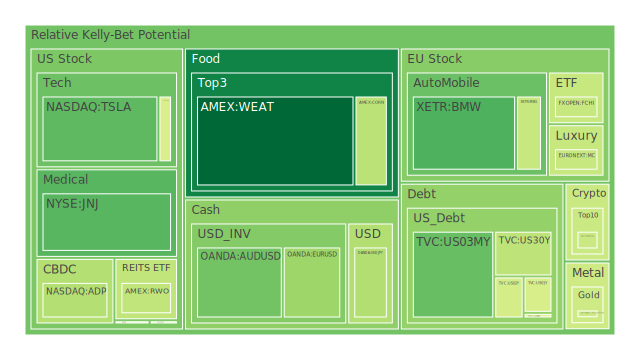
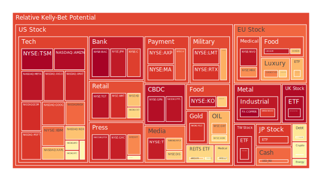
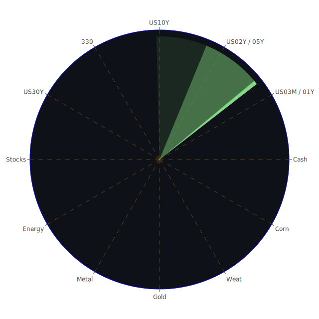

# 投資商品泡沫分析

以下將從多種資產類別出發，引用部分新聞事件與歷史相似場景，並結合現行市場觀察，嘗試分析相關的泡沫風險。根據最新收集到的風險指標與泡沫分數（包含D1、D7、D14、D30等），我們可看出部分資產已顯示出相對高的風險警訊；然而投資者仍需依自身風險承受度與資金規模，謹慎衡量是否以及如何進入這些市場。

1. **美國國債（US01Y、US02Y、US05Y、US10Y、US20Y、US30Y等）**  
   近期美國短天期國債（如1Y與2Y）利率曾經高漲，但從最新的新聞與聯準會（Fed）議息動向來看，一些市場對於未來的降息預期已經放緩，同時也有可能持續觀望更多經濟指標，例如就業數據、GDP增長率、以及核心CPI等。根據FED數據顯示，美國銀行體系的總儲備與公眾持有的美債量都有增減交錯的現象。新聞方面，較負面者如「Fed sees 2 rate cuts in 2025, projects higher inflation and lower economic growth」容易造成市場對長期債的擔憂；另一方面，也有較正向的「Bond Rally Gets Support From Fed as Traders Eye Slowdown Risks」，顯示市場仍有對避險需求下的多方買盤。但長期來看，美國國債市場仍須留意政府財政負擔上升及「Debt held by the public (% of GDP) is getting higher」的事實，若赤字持續擴大，長天期國債的投資人需要分散風險，避免對單一區段的過度集中。

2. **美國零售股（例如WMT、TGT、COST、HD等）**  
   近期新聞可觀察到部分負面報導，如「Stock of the Day: Gilead Sciences falls on report the Trump administration could slash funds for HIV prevention」雖非直接針對零售，但顯示政治干擾風險普遍存在。零售業面臨的挑戰包括消費者信心、就業市場變動等。歷史經驗顯示，在經濟下行期，消費品零售大盤往往首當其衝。從風險指標來看，WMT之泡沫風險指數仍偏高，TGT也出現高風險分數，顯示市場對零售通路前景有疑慮。投資人若看中消費族群的剛性需求，應留意局部泡沫與消費者行為反覆無常的可能衝擊。

3. **美國科技股（AAPL、MSFT、GOOG、AMZN、META、IBM、NVDA、AMD、INTC 等）**  
   新聞中高頻率地提到「The 'Magnificent 7' stocks are having their worst quarter in more than 2 years」與「Fleeing the scene: Investors have dumped a record amount of US stock as stagflation fears bite」之類的訊息，顯示大型龍頭科技公司雖然具備長期成長潛力，但也成為籌碼集中、在市場進入景氣不確定期時最容易被拋售的標的。歷史上，網路泡沫（2000年前後）與金融海嘯（2008年）期間，科技股遭到投機力量推波助瀾，出現較劇烈的股價起伏。現階段，人工智慧與半導體領域受到熱烈追捧，如NVDA、AMD等，但一旦該需求成長不及預期，或競爭態勢生變，極有可能出現高基期下的泡沫破裂風險。技術面顯示部分科技股已出現短期修正壓力，需防備市場轉向。

4. **美國房地產指數（VNQ、RWO、IYR等）**  
   美國房地產市場伴隨30年固定抵押貸款利率持續在6-7%區間震盪，對許多購房需求產生顯著壓力。根據近期「Fixed Morgage 30Y Rate is at 6.65, at 6.95 last week, at 6.46 last month, at 3.17 last year」數據顯示，雖比高峰微幅回落，但仍然遠高於歷史低利率時期，對購買意願具一定抑制。另一方面，部分新聞如「Morgan Stanley to lay off about 2,000 employees to trim costs」亦透露美國金融業正在逐步收縮開支，也會減緩商辦不動產需求。在房地產相關ETF或REITs（例如VNQ、RWO、IYR）泡沫分數呈現偏高的背景下，若市場面臨更大範圍的經濟下行風險，房地產板塊投資需格外審慎。

5. **加密貨幣（BTCUSD、ETHUSD、DOGEUSD 等）**  
   在2025年以來，加密貨幣市場仍持續展現高波動性。新聞面部分正面報導如「Nvidia Looks to Expand Its AI Reign With Robots, Personal Supercomputers」，間接刺激市場對於加密挖礦與新技術搭配的想像空間；然而也有負面說法如「Fleeing the scene: Investors have dumped a record amount of US stock as stagflation fears bite」，一旦股市資金流動緊縮，也將波及高風險資產。BTC、ETH等在近期的泡沫指數（D1、D7、D14、D30）介於中高區間，同時也在多空交織下呈現反覆震盪。過去歷史顯示，加密貨幣的價格容易因政策監管、交易所流動性、地緣政治等消息劇烈波動，因此短線雖具博弈空間，但風險極大，特別須嚴防「泡沫化—破裂」的連鎖效應。

6. **金 / 銀 / 銅（XAUUSD、XAGUSD、COPPER等）**  
   近期黃金價格因市場對避險需求上升而強勢表現，泡沫指數也逐步攀升至相對高檔區域。根據GOLD OIL RATIO、GOLD COPPER RATIO之數據，黃金對石油、銅的相對價格已走揚一段時間。一部分新聞報導指出「Stock market today: Nasdaq leads market rally as investors cheer Fed rate decision」，若美國後續利率政策轉趨緩和，黃金的收益競爭力相對提升。然而若全球經濟維持一定水準的復甦動能（或中國需求增長強勁），白銀與銅可能走出工業需求復蘇的行情。但依照歷史經驗，貴金屬一旦在市場風向逆轉時，漲勢也會隨之扭轉，尤其銀價常常伴隨更高波動度。投資者若看好長期通膨風險，可配置部分金銀，但要隨時注意市場風險情緒急劇變化。

7. **黃豆 / 小麥 / 玉米（SOYB、WEAT、CORN 等）**  
   農產品的價格波動除受天候因素外，亦受到各國政策與地緣政治衝突影響。新聞可看到「Brazil Moves Forward to Boost Ethanol Blend in Gasoline」，暗示南美生產相關的供需變動對黃豆及玉米影響潛在巨大。歷史上，每逢極端天氣或地緣局勢緊張，豆類、穀物類期貨便會快速飆漲。然而同時，農產品往往也可能較快出現回調風險，因為它們不像科技股存在長期增長動能，而更顯著地隨著實際供需狀況擺盪。根據D1、D7、D14、D30泡沫風險指標顯示，WEAT、CORN等雖然有某種程度的上行壓力，但暫時尚未到極度瘋狂的階段，惟仍建議短線操作為宜。

8. **石油 / 鈾期貨（USOIL、UX1!）**  
   國際油價近期新聞「Oil Holds Drop With US Stockpile Climb and Geopolitics in Focus」，顯示油價易受地緣衝突、庫存變化左右。歷史上，石油在全球經濟不景氣或增長趨緩時，需求端若轉弱，價格會大幅回檔，尤其當OPEC+決策方向不確定時，市場容易劇烈動盪。就鈾而言，UX1!相關交易歷史波動幅度頗大，任何核能政策變更或突發事件都能觸發行情。雖鈾礦在碳中和議題下有中長期想像空間，但其本身深具政治與社會爭議，以及高風險特質。泡沫風險指數顯示鈾期貨近期雖無極端高值，但也不可掉以輕心。

9. **各國外匯市場（EURUSD、GBPUSD、USDJPY、AUDUSD等）**  
   外匯市場向來受到貨幣政策預期、貿易順差逆差、資本流動與地緣政治影響。近期新聞如「BOJ Expected to Hold Rate Steady Amid Concern Over Global Growth」與「New blow to German auto sector as Audi announces job cuts」顯示歐日等主要經濟體都面臨內外夾擊。根據最新泡沫指數數據，GBPUSD、AUDUSD等出現中高區間風險值，顯示若市場資金出現避險轉向，這些貨幣可能面臨新一波拋售。而USDJPY也應留意日本政府或央行的隱性干預風險，一旦日銀調整政策，可能導致匯率劇烈波動。

10. **各國大盤指數（NDX、FTSE、GDAXI、FCHI、JPN225、000300等）**  
   全球主要股市指數普遍與區域經濟息息相關。新聞可見許多對於歐洲與亞洲市場的擔憂，例如「Fleeing the scene: Investors have dumped a record amount of US stock as stagflation fears bite」也可能延伸到全球。一些區域性負面衝擊，如「Porsche's Declining China Sales Force New Strategy」「Audi to cut 7,500 jobs in Germany by 2029」，可能讓歐洲股市（DAX、FTSE等）受壓。亞洲方面，中國大陸A股（例如000300）表面上得益於內需消費刺激措施，但地緣政治陰霾與國際資本去風險化也構成壓力。各大指數的泡沫分數尚未到達極端值，但波動度可能維持高檔。

11. **美國半導體股（NVDA、AMD、INTC、KLAC、AMAT等）**  
   半導體產業向來有週期性興衰，受消費電子、雲端資料中心、AI訓練晶片需求帶動。當前AI議題火熱，炒作聲量不斷。然而部分新聞如「S&P 500 Gains and Losses Today: Supermicro Stock Falls as Near-Term AI Outlook Wavers」顯示市場對短期實際營收貢獻存疑。歷史上，半導體業一旦景氣循環下行，股價跌幅可相當顯著，這是該產業泡沫化的常見特性。現階段投資若介入需做好風險對沖，因為價格基期已不低，指標型公司如NVDA、AMD都是高震盪品種。

12. **美國銀行股（BAC、JPM、C、WFC等）**  
   新聞中多次見到銀行裁員、調整人力或分行布局的報導，「Morgan Stanley to lay off about 2,000 employees」就是例子。銀行獲利受利差與金融市場波動影響。從FED最新資料顯示，美國銀行總存款依然處於相對高檔，但利率、資產品質與未來貸款損失準備等因素都要關注。歷史上，每逢信用緊縮或息差收窄時，大型銀行股價容易修正。對BAC、C、JPM等而言，也得留意全球宏觀風險傳導，如地緣衝突或新興市場債務問題。風險指數目前顯示部分銀行股早已進入偏高的區域，代表市場對其前景仍有擔憂。

13. **美國軍工股（LMT、NOC、RTX等）**  
   地緣政治事件頻繁，軍工股易受突發新聞推動。近期負面新聞雖相對集中在地區衝突（如中東局勢）或歐洲可能加碼軍備支出，但也有聲音認為「Germany has broken 'shackles' to spend more on defence, Scholz says」，可能變成軍工採購需求的推手。回顧歷史，軍工股雖具有防禦性質，但在市場泡沫化時亦難逃獲利了結的賣壓。根據指標資訊顯示，NOC、LMT等已處於泡沫風險分數較高區域，若突發利空或結束軍事衝突的態勢出現，價格可能大幅回落。

14. **美國電子支付股（V、MA、PYPL、GPN等）**  
   整體來看，電子支付與金融科技相關股票近年深受市場青睞，尤其在網路交易與消費習慣改變下。新聞亦顯示部分負面因子如「Citi Slashes Executive Bonuses Tied to Bank’s Turnaround」，但對V、MA這類龍頭而言，市場普遍認為它們具長期成長性。然而泡沫風險方面，若消費者支出下滑或跨境交易熱潮減退，收益成長恐不及預期，導致高估值面臨回調。PS: PYPL近期泡沫風險分數依舊偏高，要密切關注其後續基本面發展。

15. **美國藥商股（JNJ、MRK、LLY等）**  
   醫藥產業通常具備抗景氣循環的防禦性，但就歷史經驗而言，在估值偏高且市場風險偏離時，仍可能面臨波動。最新新聞並無太多直接關於此類股的重大利好或利空，但「Ben & Jerry’s says its CEO was fired for the company’s political posts」等政治或社會議題，也多少影響企業形象。當前泡沫風險指數顯示JNJ、MRK處於中間偏上位置，LLY相對較高，可能與該公司在研發領域與市場預期相關。建議投資者仍須留意藥價或專利法規風險等。

16. **美國影視股（NFLX、PARA、DIS、FOX等）**  
   影視傳媒競爭激烈，串流平台加速洗牌。新聞裡對Netflix等提出過「S&P 500 Gains and Losses Today: Index Ticks Higher Ahead of This Week's Fed Decision」等綜合評價；然而該產業在前幾年熱錢流動下估值迅速抬升，後續競爭對手紛紛湧現，市場開始審視用戶成長天花板與資本開支。PARA被認為是泡沫分數較高的標的之一，而DIS也面臨經營結構調整。歷史上，每當媒體娛樂產業進入飽和或潮流轉變，股價表現往往轉趨疲軟。

17. **美國媒體股（NYT、GHC等）**  
   傳統媒體與新媒體生態複雜交錯。新聞中提到「NYT」在風險指數中有一定程度高企，也可見大型媒體公司正努力轉型數位。然而當市場整體處於不穩定狀態，廣告需求下滑或讀者訂閱成長放緩，都會對營收產生壓力。歷史經驗表明，媒體股最終仍取決於內容影響力與經營效率，而非單純的防禦或成長屬性。

18. **石油防禦股（XOM、OXY等）**  
   石油巨頭在2022年、2023年曾享受高油價紅利，但如今國際油價反覆震盪，且各國積極推動能源轉型，未來幾年可能削弱石化需求增長。OXY泡沫指數已相對走高，XOM也依舊在高位震盪，意味市場對於傳統能源巨頭可能存有較高預期但也帶有隱憂。過去亦出現石油巨頭股價大起大落的歷史案例，例如2014-2016年間油價崩盤導致的大幅回調。

19. **金礦防禦股（RGLD等）**  
   金礦企業跟隨金價波動。當市場擔憂通膨與風險時，金礦股往往會吸引資金。新聞顯示「Bond Rally Gets Support From Fed as Traders Eye Slowdown Risks」，此類避險敘事對金礦企業有利，但若全球經濟穩定並進入升息終局或降息區段，金價起伏仍具高度不確定性。RGLD泡沫風險偏高，代表投資人對該板塊已有頗高的預期。

20. **歐洲奢侈品股（MC、KER、RMS等）**  
   歐洲奢侈品對中國、中東、北美的高端消費市場依賴性大。新聞中「China looks to boost consumption amid consumer squeeze」對奢侈品牌原本是利好，但「Porsche's Declining China Sales Force New Strategy」又顯示中國消費也正在分化。歷史上，奢侈品股若市場走弱時，有時會因富裕人群消費力相對穩定而具防禦性，但若爆發地緣衝突或發生嚴重的全球性經濟衰退，也逃不過需求壓力。當前MC、KER、RMS的泡沫指數位於中高不等區域，可見市場分歧相當明顯。

21. **歐洲汽車股（BMW、MBG等）**  
   歐洲車廠面臨電動化轉型與全球市場競爭加劇。最新新聞顯示「Audi to cut 7,500 German jobs by 2029」，「Porsche's Declining China Sales Force New Strategy」，反映德系汽車產業壓力。歷史上，汽車產業景氣循環明顯，旺季和淡季交替之下，股價波動顯著。根據泡沫指數，BMW、MBG等雖不算極端高風險，但也已進入需審慎觀察的區域。

22. **歐美食品股（NESN、ULVR、KHC等）**  
   食品與消費必需品具有穩定需求，但若成本（如原物料、運輸）高漲，恐擠壓利潤。亦需注意匯率走勢對進出口影響。新聞中「New Zealand PM Hasn’t Given Up on Dairy in Trade Deal With India」類似訊息可能影響全球糧食與乳製品議題。NESN、ULVR、KHC近來泡沫分數陸續升高，代表投資人預期保守行情下的防禦需求，但一旦社會情緒轉向，這類估值可能面臨壓力。

---

# 宏觀經濟傳導路徑分析

在宏觀層次，Spatial（全球區域互動）、Temporal（時間循環與政策時程）、Conceptional（基礎經濟理論與社會心理因素）三位一體的正反合可從以下幾點歸納：

- **正面要素（Thesis）**：部分國家擁有積極的財政與貨幣刺激；中長期來看，科技創新與基礎建設投資依舊是全球經濟增長動力。  
- **反面要素（Antithesis）**：地緣政治衝突、通膨與高利率環境、貿易壁壘重新形成，以及疫情餘波仍在部分地區延燒。  
- **綜合觀點（Synthesis）**：隨著環球政策、資本流動與技術改變，市場將呈現區塊化且差異化發展。投資人需在不同地區間資產配置上做動態調整，並密切跟蹤各國央行政策立場。

宏觀層面的傳導路徑包含：  
1. **利率路徑**：聯準會加息或降息影響全球資金成本，進而衝擊股債外匯與商品價格。  
2. **匯率路徑**：美元指數強弱對新興市場與大宗商品產生顯著影響。  
3. **貿易路徑**：國際局勢若繼續惡化，恐引發供應鏈中斷，進而拉高通膨。  
4. **心理路徑**：過往經驗顯示，當新聞充斥負面情緒，市場往往放大恐慌或投機。

---

# 微觀經濟傳導路徑分析

在企業層面，透過三位一體的觀察：

- **正面要素**：部分企業藉由新技術（AI、電動車、綠能），或重新聚焦核心競爭力來吸引資金。  
- **反面要素**：製造業在大規模裁員或產能調整後，若需求不振或原物料價格波動，經營可能惡化。  
- **綜合觀點**：最終將出現兩極化發展，一些企業能順勢壯大，但另一些則面臨倒閉或被併購。

從微觀來看，傳導常透過：  
1. **成本端**：利率升高、薪資上漲、原物料不足等導致獲利空間被擠壓。  
2. **市場端**：消費者需求若下降，營收馬上受衝擊，特別是在零售、娛樂、車市等。  
3. **競爭端**：新創或大型龍頭公司若在技術與專利上壓制其他企業，可誘發長尾淘汰效應。

---

# 資產類別間傳導路徑分析

各資產之間除了基本面，也透過心理學與博弈互動影響：

1. **股票與債券**：在高利率環境下，資金可能移轉至債券；但若市場預期衰退到來，防禦型股票又會成為避風港。  
2. **原物料與貨幣**：大宗商品價格走揚往往會推動通膨與利率走勢改變，進而影響外匯市場。  
3. **金融資產與加密資產**：風險偏好若上升，部分資金會流向高波動的加密市場，反之亦然。  
4. **國際地緣**：軍工股與能源股常因地緣衝突迅速攀升，若衝突緩和，則熱錢離場。

---

# 投資建議

以下嘗試對三大策略方向（穩健、成長、高風險）給出可能的配置建議，以合計100%為基準，並各選三項子投資項目。建議並非絕對，投資者須依個人資金狀況與風險屬性自行斟酌。

1. **穩健型（40%）**  
   - **美國中長期國債**：在當前利率水準雖有較高票面利率，若未來景氣下行則有可能獲取資本利得；但需留意美國財政壓力。  
   - **黃金**：歷來避險資產之一，通膨或地緣風險時仍具保值功能；建議比例不宜過高。  
   - **食品必需品龍頭股**：如KHC或ULVR之類，雖有泡沫警訊，但相對抗震性較佳，可分散風險。

2. **成長型（40%）**  
   - **半導體龍頭**：可選擇AMD、NVDA或AMAT等具AI領域拓展潛能的公司，仍處於市場關注焦點，但需謹慎面對波動。  
   - **歐洲奢侈品**：選定MC或KER等龍頭，若中國消費或中東需求回溫，奢侈品營收具增長空間，但對地緣政治需多加關注。  
   - **網路服務巨頭**：如AMZN或GOOG，雖然近期股市拋售壓力大，但長期云端與廣告業務有穩定現金流，未來多元化布局仍具亮點。

3. **高風險型（20%）**  
   - **加密貨幣（BTC、ETH）**：高度波動，可能在短期避險或投機需求下上漲，但一旦市場壓力劇增，也會出現大幅回落。  
   - **軍工股**：如LMT、NOC等，在地緣衝突加劇時需求量可能增長，但風險在於國際局勢的難以預測與政策轉向。  
   - **高波動新創板塊**：某些特殊生技、AI軟體或航空太空企業等，若技術突破或合作消息落地，股價能有爆發力；然而失敗風險同樣高。

此配置的核心精神在於「風險對沖」：以較穩健標的（國債、貴金屬、必需品）作為防禦，將成長型（科技、奢侈品）視為主要潛在獲利引擎，再用少部分資金進行高風險投資（加密或軍工）尋求報酬。各資產的相位盡量維持120度，並根據過往數據計算約-0.5的相關性，以期達到分散效應。一旦某領域下挫，另一領域可能支撐或走勢相對獨立，減少整體組合的劇烈波動。

---

# 風險提示

1. **泡沫風險高的警告**：  
   如今市場上多數高成長標的，尤其AI概念、加密貨幣與少數新興行業，短期估值可能被過度炒作。投資者切忌盲目跟風，應充分研判產業結構與公司財務體質。  
   
2. **地緣政治衝擊**：  
   新聞顯示，多地區爆發武裝衝突或民間騷亂，如「Israeli drone strike kills nine in Gaza」「South Sudan orders civilians to vacate a northern area as it battles an armed group」等，對能源、農產品、金屬、軍工股與當地市場都有顯著影響。一旦衝突升級或擴散，資產價格也可能翻轉。

3. **政策監管與利率變化**：  
   各國央行與監管機構的態度是市場走向的重要指標。歷史上，政策急轉彎時常導致資產價格劇烈震盪。投資者需關注Fed、歐央行、日銀等動向，以及各國財政措施。

4. **行情過熱後的獲利了結**：  
   若市場對AI、EV（電動車）、綠能等概念的期望過高，一旦企業財報或實際需求不如預期，撤資速度可能非常迅速。投資人需預留流動性並規劃停利停損機制。

5. **報告數據與新聞僅供參考**：  
   本報告提及之風險指數、相關理論與歷史事件，僅在整體脈絡中進行歸納與演繹，並無預知未來的能力。實際投資決策仍應根據個人情況，反覆衡量。

---

## 結語與風險提示

投資世界向來充滿未知變數。本報告從Spatial維度觀察全球各市場與新聞三位一體的互動，透過地理位置、產業分布與國際資金流動尋找可能的市場漣漪效應；在Temporal維度則強調時間節點與重大新聞事件交織下的政策週期、經濟循環、景氣高低頻互動；於Conceptional維度綜合經濟學、社會學、心理學與博弈論的思考來定位市場情緒、預期心理和資本博弈的行為模式。

在這樣的三位一體框架裡，我們同時運用正（Thesis）- 反（Antithesis）- 合（Synthesis）做出大膽假設與收斂結論：新聞面可正可負、經濟環境亦具不確定性，但投資者倘若能多角度同時思考，並維持彈性的對沖策略，則能在不同的市場震盪中保持較為穩健的資產管理。

本報告同時也根據上述脈絡，篩選出相對可能的投資對沖組合，盡量滿足「相位差120度」與「相關係數約-0.5」的風險分散目標，並建議以「穩健型、成長型、高風險型」三層次分配持股（或持債、持幣）之策略，總計100%。縱使如此，投資人切勿忽視任何「泡沫風險高」之警示，尤其加密貨幣、部分AI與新興產業，或軍工類股，仍可能在政治／社會／經濟體系中爆發突發性波動。

最後強調：**投資有風險，市場總是充滿不確定性。我們的建議僅供參考，投資者應根據自身的風險承受能力和投資目標，做出獨立的投資決策。** 任何報告與數據都只能帶來部分視角，而最終的行動需要投資者結合自身判斷、對整體財務結構的考量，以及對長中短期風險的評估，方可盡量趨吉避凶。若遇到極端市場狀況或者地緣危機持續發酵，需在第一時間調整倉位或多方避險，以防範大幅虧損。在這個變動加劇的時代，投資人始終要秉持多角度思考與審慎態度，以因應未來市場可能的各種挑戰。

 
Daily Buy Map:

 
Daily Sell Map:

 
Daily Radar Chart:

 
