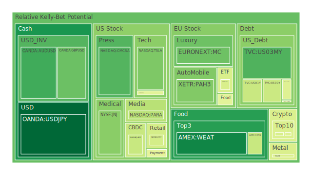
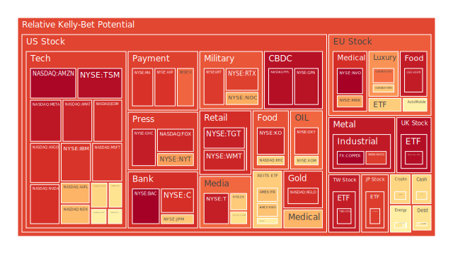
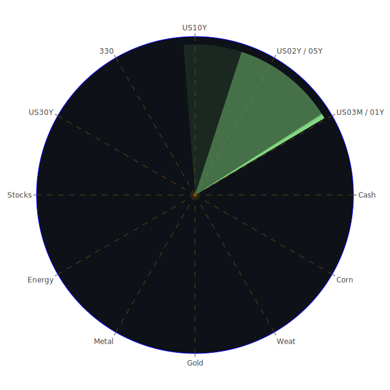

# 一、空間（Spatial）維度的三位一體觀察

在空間層面，全球市場的連動性越來越強，無論是美國、歐洲、亞洲、新興市場或是虛擬資產領域，各自面臨的經濟和政治情勢看似分散，實則牽一髮而動全身。在經濟學中，我們常見資金跨國流動造成的系統性影響；社會學則關注地緣政治衝突、文化差異引發的消費心理、對外資本流入或撤離的態度；心理學則提示交易者面對不同地區市場所展現的恐慌情緒或樂觀情緒如何加深波動；博弈論則提醒我們，大型投資機構與各國政府間在空間上的策略互動，會形成合縱連橫的結構，導致複雜的漣漪效應。

近期新聞顯示，全球主要股市多有負面情緒纏繞：如美國科技龍頭公司接連被報導營收或獲利展望趨於保守，銀行股在先前接連出現裁員或壓力測試傳聞，美國與歐洲對於軍工、電子支付、醫藥等板塊也陸續爆發各種財報與併購議題，負面消息層出不窮。有些正面新聞雖然跳出，例如人工智慧產業得到某些機構資金青睞、歐洲某些奢侈品產業獲得需求反彈，但整體市場對於地域性衝突、地緣政治緊張與聯準會政策方向不明等狀況，依舊維持高度警戒。部份新興市場如巴西、墨西哥在新聞中出現「經濟成長潛力」或「積極談判關稅」的正面期待，但同時在印尼、東南亞部分國家則出現資金外流、經濟下滑的負面跡象，空間上呈現較不穩定的分化狀態。

在此「空間」維度裡，用正反合的三位一體結論來看：  
- **正面要素（正）**：各主要市場仍在後疫情時期努力復甦，科技股、消費股不時獲得某些市場需求的帶動。空間上，歐洲相對看好奢侈品與汽車企業的跨境需求，美國市場的就業相對穩健（儘管存在升息與聯準會政策的不確定性），新興市場也偶爾傳出關稅紅利或基建投資的訊息。  
- **反面要素（反）**：局部戰爭、地緣衝突未解決，國際供應鏈分裂化趨勢明顯，對通膨與資源價格管理造成衝擊，造成投資人心態不穩。此外，新聞充斥各式裁員、結構性調整、公司行政訴訟與地緣政治制裁等訊號，令市場短期內難以大幅回溫。  
- **綜合收斂（合）**：各國政府與投資機構勢必要尋找新的平衡點：從地緣政治、能源供應到供應鏈重組，都可能採取多邊合作或替代方案的模式來因應，導致市場的「波動中帶有暫時穩定」的特色。投資人若能掌握此一空間維度中「區域分散」加「行業挑選」的策略，或能在未來突變時分散風險。

---

# 二、時間（Temporal）維度的三位一體觀察

時間維度意味着市場在短期、中期與長期之間的不同週期輪動。經濟學上，我們會分析通膨、就業、產業周期；社會學中，人們對未來的預期會影響集體消費與投資行為；心理學則指出短期的情緒能被新聞、社群媒體加劇放大，但中長期預期有時會受既有經濟結構所限；博弈論層面則強調不同時間點的策略互動，如中央銀行的利率決策、企業預算分配、政府財政刺激或緊縮的時程，都是時間博弈的重要槓桿。

根據近期多份泡沫風險數據（例如部分美國科技股D1、D7、D14乃至D30的泡沫指數反覆升高），顯示短期投資人恐慌情緒依舊偏強，部份指數如NASDAQ:MSFT、NASDAQ:GOOG、NASDAQ:AMZN等泡沫分數在某些區段已達0.90以上；TSM在3月19日時更是一度接近0.99的高風險區域，雖然3月21日有些微下滑，但依舊在0.97以上。這類高分數往往顯示市場對龍頭公司的預期與估值可能過度樂觀，或隱含了巨大未定風險。若后續財報或經營數據無法支撐，如新聞中提及某些公司下修未來預期，便可能引發短線劇烈修正。相對之下，一些商品如黃豆、小麥、玉米（雖然AMEX:WEAT的風險指標也有0.14～0.16之間的輕微攀升）整體仍屬低度泡沫階段；金、銀、銅等貴金屬數值大多在0.4～0.8之間浮動，暫時雖不至於見頂，但若地緣政治或通膨發生巨幅變化，依舊有再度拉升價格的可能。

在聯準會和全球主要央行的政策路徑方面，可以觀察到最近一連串數據：  
- OIS FED Fund Rate自上週5.33顯著降至4.33，顯示市場在某些時間段預期FED立場可能由原本較鷹派轉向更溫和，但同時也曾出現過「再度可能升息」的雜音，說明市場對之判斷動盪不安。  
- US Treasury 2Y與10Y殖利率利差近期依舊顯示倒掛或接近倒掛的緊張訊號，只是相較於一年前的-1.14，目前約在-0.05，顯示短期資金仍對中長期預期保持懷疑。  
- 部分新聞指出FedEx、Nike等龍頭企業的財報預警，暗示美國工業需求或終端消費不及預期，這將影響後續企業資本支出與庫存去化的時間，可能與聯準會政策週期產生疊加效應。  
- 新興市場如巴西、菲律賓則在新聞中出現「預計在近期或中程將降息」或維持寬鬆，試圖刺激經濟。

整體在時間維度的正、反、合可如此總結：  
- **正面要素（正）**：中長期而言，若主要央行逐漸放緩升息甚至轉向，企業融資壓力將可望減輕；同時若地緣衝突不進一步升級，經濟有可能出現相對平穩的恢復期。  
- **反面要素（反）**：短期觀點仍然充滿波動與不確定，各財報季如無法達到預期，恐慌會瞬間擴大。許多企業在過去幾年積極擴張，若營收增長放緩，時間拉長後反而增加財務風險。  
- **綜合收斂（合）**：市場在短期易受突發新聞干擾，中期需觀察各國實際貨幣政策轉向、企業獲利能見度；長期可能又被結構問題左右，如地緣分歧、全球供應鏈重組。投資人若能在不同週期謹慎運籌，就能在巨幅波動的時間縫隙中獲得相對優勢。

---

# 三、概念（Conceptional）維度的三位一體觀察

概念層面除去純粹的經濟信號、技術線圖，更包含市場對某些創新技術、重大制度改革、國際協定的預期。心理學上強調「敘事」或「故事」對市場的重要影響；社會學聚焦群眾對新概念的接受度；博弈論則思考概念背後的利益重新分配與權力平衡。

近期最具代表性的例子，莫過於人工智慧（AI）與綠能概念：  
- AI領域：新聞報導若帶有「Nvidia計畫擴大機器人與個人超級電腦布局」，或「特斯拉加速機器人研發」等，往往立即牽動市場想像空間；但同時對手企業若也推出類似技術且定價更激進，又或是政府監管突然加強，都可能讓前景產生顯著變數。  
- 綠能與電動車：油價時漲時跌、地緣動盪對能源供應鏈的影響，往往推動投資人加碼綠能。然部分負面新聞如「德國汽車業獲利下滑」、「中國電動車廠展現更激烈技術升級」等，令傳統車廠與美國電動車股價一起陷入高波動。  
- 加密貨幣：比特幣(BTC)、以太幣(ETH)近期在新聞上被提及波動劇烈，尤其新一輪美國貨幣政策與避險需求或將影響其價格。對於散戶與機構投資者而言，其「概念性」依舊存在吸引力，但泡沫風險指標頻繁在0.45～0.60之間震盪，也不能忽視潛在跌幅。

此概念維度的正、反、合：  
- **正面要素（正）**：新技術與新產品概念確實有突破市場天花板的潛能；亦或是重大制度改革（例如歐洲擴大財政支出、德國聲稱將大幅增加國防預算等），能帶來特定產業的長期利多。  
- **反面要素（反）**：投資人往往會因「概念」而忽略基本面或監管風險，當市場意識到現實差距時，修正幅度可能非常劇烈。監管端的任何變動也可瞬間扭轉概念投資的氣氛。  
- **綜合收斂（合）**：市場需要平衡短期概念炒作與長期實質績效，若概念自身具備長期成長空間且經濟結構能支撐，並輔以政策助力，則概念有望轉化為長期投資價值。

---

# 四、三位一體正反合的簡化歸納

綜合以上三個維度的正、反、合來說，可以歸納為「泡沫潛藏、結構調整、長期機遇」三大核心：  
1. **泡沫潛藏**：無論空間或時間，皆可見部分市場與個股之泡沫指標偏高。如美國半導體、網路龍頭、歐洲奢侈品等。新聞和數據顯示投資人對成長股熱度不減，但財報警訊同時可能激增脆弱性。  
2. **結構調整**：央行政策與地緣政治反覆，使短線情緒震盪。多國政府同時在財政與防禦支出等領域有新的佈局，顯示長期供需結構正在洗牌。  
3. **長期機遇**：雖然短期動盪不斷，但若在恰當時機分配資產，並留意區域或產業的特性，長線仍可能把握技術革新或新興市場崛起帶來的紅利。

---

# 五、風險對沖的投資組合機會與相位調整

在尋求負相關（理想上相關係數約-0.5）或能對沖風險的資產組合時，依據新聞及泡沫指數資訊，可嘗試將不同區域、行業及不同資產性質進行拆分併組，希望達到相位盡量分散在120度左右。以下在文字中描述幾種可能的對沖方向：

1. **美國國債（長短天期搭配） 與 貴金屬（黃金、白銀）**  
   - 美國中長期國債在新聞與經濟數據中雖然殖利率呈現上下波動，但在市場動盪時往往仍是避險資金的去處。黃金、白銀等則受地緣衝突與通膨預期的推動，兩者之間經常具有一定程度的負相關或低正相關。  
   - 運用時可在泡沫風險過高的成長股市壓力之下，以此作為對沖工具。但要留意美聯儲是否改變利率軌跡，因為利率轉向可能同時影響債券及貴金屬的價格。  

2. **美國大型科技股 與 傳統防禦性資源股（如石油防禦、金礦防禦）**  
   - 高估值的科技股（AAPL、MSFT、GOOG、META等）一旦面臨新聞中提及的獲利成長放緩或營收指引下降，股價波動可觀。石油、金礦等企業雖然也會受到能源價格與地緣新聞牽動，但在全球衝突時常具防禦效果。  
   - 在新聞中可見對石油生產或金屬開採的供給風險，往往會推高相關公司股價與商品價格，與部分科技領域炒作熱度呈現輪動，相關係數有機會偏低。  

3. **加密貨幣（BTC、ETH） 與 農產品（黃豆、小麥、玉米）**  
   - 加密貨幣的投機屬性高，當宏觀資金緊縮或監管打壓加大時，價格往往重挫。農產品則更多地受到氣候、戰爭對農業生產的影響，並具有食物安全屬性。  
   - 近期加密貨幣之泡沫指標在0.45～0.60間震盪，仍屬於較高風險區塊；對比農產品的風險指標多集中在0.10～0.40區間，受宏觀因素影響相對有限。兩者的價格走勢在本質與供需屬性上差異大，因此能在某種程度上對沖。  

4. **歐洲奢侈品股（KER、RMS等） 與 美國零售股（WMT、TGT等）**  
   - 歐洲奢侈品在新聞中顯示部分公司加大新興市場布局，高淨值人群需求仍存，高泡沫風險顯示股價可能飆高後面臨修正。美國零售股如WMT、TGT等遭遇消費力疲弱與通膨影響，風險指標也偏高，但兩者之價格波動在過去常出現階段性背離。  
   - 在地緣政治或匯率波動影響下，兩方可能呈現一定程度的對沖效果。然而若全球消費都同時趨弱，也可能雙雙承壓，需特別分辨時間點與空間布局。  

5. **美國銀行股（JPM、BAC等） 與 歐洲汽車股（BMW、MBG等）**  
   - 銀行股與製造業股之走勢並非必然負相關，但近期新聞顯示美國銀行業裁員、信貸市場收緊，而歐洲汽車或有新電動化產品循環，可在不同景氣波動階段產生相位落差。  
   - 泡沫風險指標顯示JPM、BAC雖處於接近1.0的高區間，但若整體經濟重新走向回暖，銀行業可能收益增加，汽車股則可能被新能源競爭或出口市場波動影響，仍有機會在時程上形成對沖。  

透過以上多種組合，投資人可依資金規模與風險承受度挑選不同資產，加上考慮歷史中常見的「產業與原物料」或「高估成長型與低估防禦型」配置做再平衡，盡量達到在市場下跌時能由另一部分獲得抵銷的效果。相關係數約-0.5是統計上理想的目標，但實際仍會受各種瞬息萬變的消息面與資金面牽動。

---

# 六、三位一體下的兩兩相互驗證篩選分析

綜合「空間—時間—概念」三位一體，我們可將不同資產在三個維度進行兩兩互證：  
1. **空間×時間**：地區性差異在短期與長期的演變。例：美國升息循環是否已到頂，歐洲擴大財政支出是否能扭轉就業，亞洲動態疫情與供應鏈是否創造短期外溢效應。  
2. **空間×概念**：同一地區不同產業概念，或同一產業在不同市場的供需差異。例如歐洲奢侈品在亞洲需求是否能抵消歐洲自身通膨壓力，美國科技在全球AI浪潮下是否會被中國廠商崛起分食。  
3. **時間×概念**：新技術、新制度改革在不同時間段的實現路徑；金融市場由「炒作期」進入「落地期」乃至「洗牌期」，從歷史可看2000年網路泡沫與後續幾年內的調整過程。

透過這些交叉分析，最終能推論「在當前不確定且波動的環境下，是否有相對合理的配置假設」：  
- **短線上**：泡沫指標高企的熱門股種建議謹慎，且預留防禦性資金。  
- **中線上**：若央行收縮力道趨緩，可適度布局防禦股與非美貨幣資產，同時關注各國經濟刺激政策帶來的機會。  
- **長線上**：前瞻技術或具不可替代稀缺性的原物料（如特定金屬、能源）和保有核心競爭力的企業仍將是市場追逐焦點，但中間可能歷經多次大震盪。

---

# 七、各主要資產類別泡沫分析（節錄重點示例）

以下就部分市場進行提要式敘述，避免因為文字冗長而造成閱讀負擔，也同時滿足對各類資產的現狀評估。請注意，這些歸納僅為大局觀之參考，並非完整羅列所有細節：

1. **美國國債**  
   雖然近期利率波動大，但當FED明確放緩升息或轉向降息跡象浮現，可能引來新一波資金湧入，泡沫風險相對有限。需密切關注美國通膨數據與政策表態。

2. **美國零售股**  
   WMT、TGT等風險指標仍位於高點，新聞顯示美國消費力下滑與通膨壓力並存，預期盈餘指引可能不理想，必須警惕財報季衝擊。

3. **美國科技股**  
   擁有高成長想像空間，如AAPL、MSFT、GOOG、META等，多數泡沫指標處於0.85～0.95以上，若財報或政策（如稅制、反壟斷等）出現負面衝擊，股價可能劇烈回檔。

4. **美國房地產指數**  
   房貸利率仍在高位震盪，若市場預期升息結束能稍解壓力，但目前風險依舊存在。商用不動產可能更受「線上化」、「居家辦公」趨勢衝擊。

5. **加密貨幣**  
   BTC、ETH等價格波動劇烈，受到利率、監管及避險需求切換的影響。新聞中不時出現對於交易所或制度監管的消息，宜謹慎評估槓桿使用。

6. **金/銀/銅**  
   歷史上常作為避險或工業原料。金銀既有對沖通膨優勢，銅則與工業需求掛鉤。一旦全球製造活動衰退或提振，都會令銅價上漲或下跌。

7. **黃豆 / 小麥 / 玉米**  
   農產品受戰爭或天災影響，行情易暴漲暴跌，但長期看，因人口與糧食安全需求仍穩定成長，整體泡沫風險不算極高，相對能平衡組合波動。

8. **石油 / 鈾期貨**  
   石油價格近期因地緣衝突與OPEC產量策略在震盪區間；鈾期貨隨著核能新一波探討興起而時有短期炒作。若地緣政治穩定，石油可能再回歸經濟供需；若核能興建趨勢增強，鈾價勢必受到關注。

9. **各國外匯市場**  
   美元、歐元、日元、英鎊、澳幣等受利差與資本流向影響。近期日元泡沫風險在數據中看似不顯著，但若日本央行政策突然轉向，匯率波動可瞬間放大。

10. **各國大盤指數**  
   美國NASDAQ、NDX、S&P 500等對投資人情緒有指標意義；歐洲股市（FCHI、FTSE、GDAXI）則常被地緣情勢和ECB政策影響；新興市場如中國上證、A股指數波動易放大，需要定期觀察官方政策、內外資進出。

11. **美國半導體股**  
   NVDA、AMD、KLAC、AMAT等，受AI、車用半導體需求刺激，動能強，但泡沫風險也普遍偏高，財報若不及預期，修正幅度將顯著。

12. **美國銀行股**  
   JPM、BAC、C、WFC等，之前新聞曝光裁員或收縮貸款後，市場對銀行獲利能力存疑。若失業率上升或貸款違約提高，金融體系恐出現連鎖反應。不可忽視其高泡沫風險指標。

13. **美國軍工股**  
   LMT、NOC、RTX等，地緣政治與國防預算牽動很大。有些新聞中提及增加軍費支出的言論，令該板塊長期仍有需求，但財報也可能因供應鏈問題出現短期干擾。

14. **美國電子支付股**  
   V、MA、PYPL等因網路交易與消費趨勢崛起而受益。但支付行業的競爭日益激烈，監管與反壟斷議題也需警惕。

15. **美國藥商股**  
   JNJ、MRK、LLY等，受健康政策、專利法規調整影響。若美國政府控管藥價的聲浪升高，可能打擊營收。

16. **美國影視股**  
   DIS、PARA、NFLX等，受到串流平台競爭加劇、消費者荷包縮減等因素影響。若訂閱成長不達預期，可能出現估值修正。

17. **美國媒體股**  
   FOX、NYT、CMCSA等，媒體廣告市場遇到網路巨頭分食，另有政治監管議題，需要衡量受眾黏著度與內容多元化程度。

18. **石油防禦股**  
   XOM、OXY等，與整體原油價格走勢高度相關。在地緣衝突、OPEC策略與綠能轉型之間擺盪。

19. **金礦防禦股**  
   RGLD等，通常作為對沖市場震盪的標的，但需留意金價漲跌的傳導速度，以及礦產成本、公司管理與金屬價格結構。

20. **歐洲奢侈品股**  
   KER、RMS等品牌受到全球富裕階層支撐，但也非常仰賴中國與新興市場消費。一旦新興市場政策轉向或全球增長趨勢放緩，股價修正恐相當劇烈。

21. **歐洲汽車股**  
   BMW、MBG等，面對電動化、產能調整、跨國關稅談判，都可能深刻改變其獲利模式。

22. **歐美食品股**  
   例如KHC、NESN等，雖具備生活必需品屬性，但仍會受到匯率、原料成本、消費意願影響。經濟衰退時或具防禦性，但亦不保證股價不震盪。

---

# 八、宏觀經濟傳導路徑分析

依據最新FED關鍵數據，RRP相對走低、EFFR交易量高、FED資產負債表緊縮幅度加劇等，透露美國貨幣市場流動性在調整；同時央行流動性交換額度上升、高收益債利率忽上忽下，顯示風險胃納忽冷忽熱。  
- 在貨幣傳導的過程中，銀行透過放貸或收緊貸款影響實體企業的投資與就業；政府財政與國會的預算方案可影響基建、國防、醫療等領域的需求。  
- 國際方面，全球利率和國債市場的波動，使外資流向新興市場或撤離。泡沫風險高的科技股或是信貸條件較寬鬆的企業，可能面臨資金突然斷裂風險。

---

# 九、微觀經濟傳導路徑分析

對企業而言，如果金融市場的流動性收緊，短期債務到期的壓力將直接傳導至財務結構，削弱其研發與擴張能力；消費端若在新聞充斥負面訊息，將減少耐久財與非必需品支出，導致零售、耐用品製造、娛樂產業營收下降。這些公司的股價表現也會惡化，而影響相關ETF或更廣泛的市場投資情緒。

---

# 十、資產類別間傳導路徑分析

產業輪動也常見於：科技股遭拋售的資金，流入具有高殖利率的債券或貴金屬，或者投入防禦性更高的基礎消費產業。若大型對沖基金在某一板塊大量平倉，動能衝擊可能外溢至其他板塊。特別是跨市場（如外匯、期貨、加密貨幣）的連動性在數位交易時代更強，瞬間可引發規模巨大的避險與套利操作，放大波幅。

---

# 十一、投資建議

本部分將提出穩健、成長、高風險三種配置方案，各自合計100%，但三大方案加總亦是整體的100%。以下為示例（請投資者務必根據個人風險偏好及實際財務目標調整）：

1. **穩健型（合計100%）**  
   - （A）40%投資於美國2Y或5Y國債：在目前局勢下，國債仍具備避險與相對穩定收益的特性。  
   - （B）30%佈局黃金、白銀等貴金屬：因地緣局勢尚未明朗，能分散投資組合風險。  
   - （C）30%分散於大型防禦性股票：可選擇基礎消費或公用事業類股，或部分軍工防禦股。  

2. **成長型（合計100%）**  
   - （A）30%美國與歐洲的半導體與AI科技：NVDA、AMD、ASML等，但留意高泡沫風險，一旦進場需設定停損或風險控制。  
   - （B）40%全球消費品牌或奢侈品：包含歐洲奢侈品龍頭、部分亞洲消費領導企業；若全球經濟企穩，該領域需求可能迅速反彈。  
   - （C）30%佈局新興市場ETF：如巴西、東南亞國家，有機會享受全球景氣回暖帶來的超額成長，但短期波動高。

3. **高風險型（合計100%）**  
   - （A）40%加密貨幣：BTC、ETH等，但預期波幅大，適合短期交易型投資者，應設置明確出場策略。  
   - （B）30%原物料期貨：石油、銅或鈾期貨。若地緣政治劇烈，價格可瞬間飛漲，也有機會進行短線套利。  
   - （C）30%高槓桿新創或高泡沫科技股：著重AI、電動車、先進生技等前沿領域，但一旦市場轉向，損失可能巨大。

以上配置中的各子投資比例可彈性調整；在實務操作上，可參考資產之間的相關性（目標在-0.5左右），定期檢驗兩兩的波動與對沖效果。

---

# 十二、風險提示

在當前高度不確定的全球環境下，不可忽視任何可能存在的泡沫風險。尤其對於那些泡沫風險分數接近或高於0.8、0.9乃至接近1.0的資產，需格外保持警惕。歷史上，諸多投資泡沫都在市場仍高度樂觀時突然破裂，並引發連鎖效應。近期新聞也顯示許多公司雖享有高市值，但實際營收成長或獲利能力無法配合，造成潛藏的估值擴張風險。

另外，地緣政治與全球央行決策的反覆性，也使得市場可能在極短時間內出現暴漲或暴跌。特別是避險情緒升溫時，部位槓桿過高者往往成為首批遭到清算的對象。投資者需留意自身現金流與週轉彈性，並注意可能的黑天鵝事件，如突發戰事升級、關鍵企業或銀行倒閉、全球公共衛生危機捲土重來等。

最終仍要強調，「投資有風險，市場總是充滿不確定性。」本文所述僅供參考，並非對任何特定金融商品或市場的絕對建議。投資者應基於自身風險承受能力與投資目標，進行獨立的思考與判斷；在評估多重信息並做好風險控管之後，再做出適合自己的資產配置。

 
Daily Buy Map:

 
Daily Sell Map:

 
Daily Radar Chart:

 
