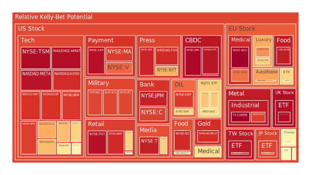

# 投資商品泡沫分析

## 美國國債
美國國債近來在殖利率曲線上表現出相對平坦甚至部分倒掛的現象。根據最新觀察，1年期與2年期之間的差距有限，與5年期、10年期乃至30年期的傳統利差則持續呈現壓力。新聞面上，美國聯準會（FED）近期雖未正式宣告寬鬆，但從市場推測的利率路徑顯示，未來幾季可能偏向觀望，或僅在就業與通膨數據波動時做出有限調整。  
有關美國國債的泡沫風險，若從市場對未來降息的預期角度切入，部分資金仍將美國國債視為避險標的。然而，本報告根據多重新聞訊息顯示，全球宏觀經濟不確定性與地緣政治衝擊交織，一旦風險事件持續發酵，可能帶動投資人追捧國債、亦可能因通膨擔憂而造成殖利率擾動。曾在歷史上（如2008年金融危機與2020年疫情爆發）出現過類似資金對國債的極端擁擠情形，當時殖利率大幅下滑後又迅速反轉。根據空間層面：區域衝突與資金流動範圍擴散可能牽動國債需求；時間層面：先前升息週期略顯尾聲，但市場又擔憂通膨復燃；概念層面：投資人往往認為國債安全，但若真正通膨難以壓制，其「安全性」也會被質疑。  
整體看來，美國國債的泡沫風險暫時偏中，若市場轉向大幅降息預期，短期國債可能更受青睞，但長期國債泡沫亦有隱憂。歷史上，當景氣反轉且通膨受控時，長天期國債常出現超額報酬；但若聯準會在高通膨壓力下被迫轉向更高利率，則長天期國債容易面臨淨值損失。

## 美國零售股
美國零售股如WMT、TGT、COST等，在近期新聞中可見該領域受到通膨壓力、供應鏈雜音與消費者信心波動的影響。部份新聞顯示某些企業財報出現下降或預期下修；另外也存在零售旺季或季節性促銷帶來的營收起伏。回顧2008年金融風暴後以及2020年疫情期間，美國零售類股的表現通常呈現兩極：一方面，必需品零售（如超市、量販）更具防禦性；另一方面，成長型零售則容易遭遇消費緊縮衝擊。  
就泡沫風險而言，當市場情緒反轉且投資人預期消費力減弱時，有些零售股市值瞬間下修的紀錄不在少數。再加上部分零售股估值偏高，若後續利率維持高檔，融資成本增加與消費者支出疲弱的風險將浮現。空間方面，美國零售市場在全球供應鏈與地緣風險升高時，貨物流動延誤或價格波動都可能打擊信心；時間方面，目前的降息預期尚不明朗，短期利率波動將影響消費信心；概念方面，零售常被視為經濟活力指標，但也容易在市場過熱時吸引過度投機，因此需要謹慎觀察。

## 美國科技股
美國科技股如AAPL、GOOG、MSFT、AMZN、TSLA、NVDA、AMD等，從疫情後到2023年末、2024年，曾有過一段極高估值的時期。新聞面顯示，儘管有AI、雲端運算等需求，但市場情緒對於「科技泡沫」的討論一直持續。現階段部分新聞報導提到，有些科技公司營收成長放緩，或面臨研發成本增加；亦有報導指出部分公司遭逢法規與產業競爭壓力。回溯2000年科網泡沫時期，市場過度樂觀、投機盛行，終導致股價大幅回檔。  
目前在空間層面，美國科技影響全球產業結構與供應鏈，地緣政治中若封鎖或關稅政策變動，對大型科技公司仍有衝擊；時間層面，利率高點若持續，成長股的未來現金流折現遭受影響，估值下修風險存在；概念層面，投資人普遍對「科技創新」富有信仰，但也常有在景氣下行時產生獲利不及預期的例子。是故科技股雖前景看好，亦常為市場波動最劇烈者之一，需要密切注意通膨、利率、經濟增速與企業財報指引。

## 美國房地產指數
房地產相關ETF或指數（如VNQ、RWO、IYR）在升息週期下通常承受壓力，因為投資人憂心按揭貸款成本高企，租金回收周期拉長或租戶流動率升高。就近兩年房市表現而言，由於美國房貸利率維持高位，一些原本高估的地區房價開始鬆動。新聞面指出有些地區房地產融資壓力明顯。回顧2008年金融危機，以次級房貸為核心爆點曾帶來大型金融風險，但當前情況有所不同：不良貸款比率尚未如2008年時般顯著攀升。然而，FED釋放的資金面縮表訊號，或銀行業收緊放貸，都可能讓商業不動產、住宅不動產承受壓力。  
空間方面，城市和郊區住宅情況或明顯分化；時間方面，目前市場觀望未來一年到兩年的利率走向；概念方面，房地產常被視為長期投資標的，也可能成為信用緊縮下首波受衝擊的產業。部分地區房地產存在供給不足，或許支撐某些區域性價格，但總體泡沫風險仍在高利率環境下逐步累積。

## 加密貨幣
加密貨幣如BTCUSD、ETHUSD、DOGEUSD等，在前幾年歷經瘋狂牛市後，經歷多次大幅回調。新聞面亦指出部分區塊鏈應用開始遇到投資者興趣衰退，同時監管力度提升。回顧歷史，加密貨幣多次大漲大跌，每一次都發生於市場資金寬鬆（或對傳統資產失去信心）之際。  
空間層面，加密貨幣分布全球，地緣政治緊張或區域性貨幣管制都有機會提高其需求；時間層面，每當總體市場不確定時，部分投資人會將加密貨幣當成對衝手段，但在監管聲浪下，價格也易受到恐慌性賣壓；概念層面，對於加密貨幣是否具備「數位黃金」屬性，市場所見仍存在分歧。現階段泡沫風險依然偏高，因為波動性依舊顯著，部分投機買盤若撤離，價格可能急速修正；但若全局資金環境再度寬鬆，亦可能重現上漲行情。

## 金/銀/銅
黃金（XAUUSD）、白銀（XAGUSD）與銅（COPPER）在過去一段時間各有不同的市場定位。黃金因被視為避險資產，隨著全球地緣局勢、利率變化與通脹預期走勢，時有強勢表現。銀多在產業與首飾等雙重需求間震盪。銅則更多反映全球製造業與基礎建設對金屬原料的需求。新聞指出，近期多國經濟指標有所分歧，中國需求與全球景氣周期可能影響銅價。歷史上，每次大規模基建計畫或新一波科技產業需求，都可推升銅的需求面，但同時若景氣下行，銅價也會大幅跌落。  
目前金價與利率呈現較複雜的負相關，若實質利率走低，黃金仍具支撐；銀價易受短期資金追捧而大漲，也常大跌。空間層面，不同國家需求與貨幣政策均對三者走勢有干擾；時間層面，在利率週期末端或地緣衝突升溫的局勢中，金銀往往有突發上漲；概念層面，部分投資人將金屬視為通膨對衝，但也須留意若現金流回報更有吸引力時，金銀等貴金屬有機會遭冷落。就泡沫指標言，目前金銀尚未出現極端狂熱跡象，但仍需留意全球政治不確定性。

## 黃豆 / 小麥 / 玉米
這三種農產品（如SOYB、WEAT、CORN）價格波動受全球天候、地緣政治、糧食出口禁令等因素干擾頗深。新聞面顯示，有些國家實施出口管制或關稅；同時氣候變遷也對農作物產量構成挑戰。回顧2007-2008年全球糧食危機時，農產品價格曾飆漲，造成多國通膨壓力。  
空間層面，這些穀物的出口主要集中於美國、南美、黑海地區，若地緣衝突或物流中斷，價格易大幅波動；時間層面，季節性種植與氣候條件決定產量；概念層面，有人將農產品視為防禦性資產以對衝通膨，但若市場對全球供需預期轉向悲觀，價格也可能面臨壓力。農產品行情的泡沫風險較難持續累積到極端，但突發性的天災或政策干預會放大短期波動。

## 石油 / 鈾期貨
石油（USOIL）近期受供給面與地緣政治緊張因素影響而波動。新聞提及中東地區或其他產油國之不穩定局勢，以及各大能源企業的投資計畫縮減或擴張，都可能干擾油價。歷史上油價多次由政治衝突主導，也可能受市場對經濟衰退的預期而大幅回跌。  
鈾期貨（UX1!）的需求主要來自核能發電。一方面，全球在綠能轉型中對核能的接受度有分歧；另一方面，地緣與政策也影響核原料供給。回顧1970-80年代，核能興衰形成鈾價的巨大波動，目前部分國家再度加大核能投入。就泡沫風險而言，石油可能出現快速拉高或回跌；鈾則因市場規模相對狹小，一旦需求或供給出現集中性變化，也容易產生劇烈波幅。整體來說，短期內石油價格若因大國博弈持續上漲，警惕需求端衰退時對價格的拉回；而鈾也得視各國核電計畫而定。

## 各國外匯市場
包含AUDUSD、EURUSD、GBPUSD、USDJPY等貨幣對。近期市場資訊顯示，美國利率與其他主要經濟體央行政策差異，導致美元指數出現時強時弱的分歧波動。新聞中亦可見日本維持較寬鬆貨幣政策，導致日圓一度貶值；英鎊則受英國通膨與脫歐後續影響；歐元區在能源、地緣政治和經濟數據之間拉扯。  
歷史上外匯市場泡沫時常伴隨貿易、財政或政治危機。空間層面，全球金融資本流動速度加快，消息面亦可能讓某些貨幣瞬間大漲或大跌；時間層面，短期央行會議或通膨數據公布時，波動性加劇；概念層面，對外匯的「合理」匯率認知常因國際收支與避險需求而改變。若市場產生大規模風險趨避，美元仍可能回到避險地位；反之若外界預期美國經濟放緩，則非美貨幣也可能走強。

## 各國大盤指數
此部分涵蓋NDX（美國科技股指數）、GDAXI（德國DAX）、FTSE（英國FTSE100）、FCHI（法國CAC40）、000300（中國滬深300）、JPN225（日經225）、RMS、KER、MC（歐陸不同指數或奢侈品相關市值衡量），以及TWSE:0050（台灣主要上市權值ETF）。新聞面顯示，地區間經濟復甦步調不一，通膨與就業、市場對央行態度等差異大。歷史經驗顯示，當市場資金氾濫時，全球股市大都跟隨走揚，反之緊縮或衰退共振也會拖累大部分指數下行。  
就泡沫風險看，若全球經濟放緩未被充分定價，這些指數可能有一定程度的高估現象。在空間層面，地緣衝突或區域經濟聯動會同時衝擊多國市場；在時間層面，各大盤指數常在財報季、重要央行決議周表現波動；在概念層面，投資人往往將大盤指數視為經濟或企業收益的綜合反映，若有過度樂觀、熱錢追捧，易形成指數泡沫。

## 美國半導體股
半導體是近年聚焦度極高的領域，包括AMD、NVDA、QCOM、KLAC、INTC、AMAT、AVGO、MU等。新聞指出，AI與自動駕駛、5G等需求推升半導體股，但同時也有供應鏈在疫情後期產生的庫存調整壓力。回溯1990年代終期與2000年代初期時，半導體常在景氣循環頂峰有巨額投資，之後供過於求造成大跌。當前市場若再度炒作AI、資料中心等題材，容易擴大預期差。  
空間層面，地緣政治中關於高階晶片的出口管制，使得半導體產業集中在少數地區；時間層面，每隔數年就有一次晶片供過於求的週期性風險；概念層面，半導體具技術壁壘且更新快，投資人若誤判成長速度或競爭地位，亦可能蒙受巨大損失。報告分析顯示，半導體股的波動與大盤一致性高，但在利率敏感度與市場情緒衝擊下，泡沫風險常被放大。

## 美國銀行股
包括JPM、C、BAC、COF、AXP等。銀行股在利差擴大時，往往收益改善，但若有地緣政治或金融市場動盪，以及信用風險上升，則會帶來資本配置壓力。新聞面提到部分金融機構仍然擔憂不動產資產品質與消費者債務違約率升高，此外也有大型銀行面臨監管要求提高資本適足率。歷史上的1980年代儲貸危機、2008年金融海嘯都顯示銀行股容易在景氣反轉時受到首波衝擊。  
空間層面，跨國銀行業務使之更易受到全球金融緊縮的波及；時間層面，若FED持續保持利率於相對高位，亦可能使經濟放緩後壞帳增加；概念層面，銀行股常被認為是穩定的股利來源，但實際上在經濟向下週期，股價易出現顯著回落。銀行股泡沫風險並非特別常見，但若過於樂觀預期息差與放貸成長，仍不容忽視信用衝擊。

## 美國軍工股
包括LMT、NOC、RTX等，軍工產業在地緣衝突頻繁、國防預算增加時通常受惠。新聞指出，包括美國與其盟友對於先進武器、防空系統及其他軍備投入明顯增加。歷史經驗上，軍工股雖具備一定防禦屬性，但若地緣局勢出現和緩，或國防預算被削減，其市值也會逆轉。  
空間層面，各國國防支出擴張常在國際局勢惡化時同時發生；時間層面，政府採購計畫通常是長期的，但一旦財政或政治風向改變，也會衝擊公司獲利；概念層面，軍工股常被解讀為地緣衝突的“收益者”，某些投資人也因此對道德或永續議題產生疑慮。若因投機買盤過度湧入，也有泡沫化的可能。

## 美國電子支付股
如MA、V、PYPL、GPN等。電子支付具備高度成長性，在疫情期間更因線上消費擴大而受注目。但新聞中也看到該行業面臨金融監管、信用卡違約率等不確定因素。歷史經驗指出，電子支付服務在市場熱絡時估值可快速攀升，一旦消費者習慣或技術競爭產生重大變化，又會迅速冷卻。  
空間層面，全球支付市場競爭者眾多，區域性法規與傳統金融體系整合問題突出；時間層面，消費旺季帶動交易量，有助於短期營收，但利率與景氣轉折會影響長期投入；概念層面，不少投資者相信「無現金社會」大勢所趨，但也要留意市場競爭格局與該產業的實質獲利能力。若市場資金過度膨脹，電子支付股泡沫可能隨時壓縮。

## 美國藥商股
包括JNJ、MRK、LLY等，大型醫藥公司通常具備相對穩健的財務與較固定的醫療需求支撐。但新聞面顯示，醫藥研發成本高昂，法規審批進度、專利爭議、以及醫保政策變化，均會造成短期劇烈波動。歷史上醫藥產業曾多次遭遇專利懸崖或重大法規改革，如2010年美國醫改對部分藥廠營收結構產生巨變。  
空間層面，不同地區對藥物定價及政府補助政策差異大；時間層面，新藥研發與疫苗上市常需多年；概念層面，藥商股兼具防禦性與成長性，但若被市場過度追捧，也可能有估值泡沫。投資者應同時留意藥價談判與專利到期風險。

## 美國影視股
如DIS、PARA、NFLX、FOX、CMCSA等。串流戰爭帶來大量內容製作需求，也形成高企的成本結構。新聞面顯示，近年串流訂戶成長趨於飽和，廣告收入也會受景氣影響。歷史上，科技轉變曾多次顛覆娛樂產業生態。例如實體DVD時代被線上串流顛覆，一旦行業加速整合或新競爭者出現，原本市場領導者也可能衰退。  
空間層面，全球版權與語言市場的差異造成地域性營收分布極不平均；時間層面，串流平臺每一季用戶增長都引發股票大幅波動；概念層面，市場通常認定娛樂內容具有高競爭力的品牌更易吸引投資人，但若投資成本與實際收益不匹配，泡沫恐積累。這些公司相互之間併購與合作也時有發生，可能帶來股價短期大漲或大跌。

## 美國媒體股
除上述影視公司外，尚有NYT、CMCSA等綜合媒體集團或新聞機構。新聞面強調，社群媒體與新型態數位內容平台興起，不斷侵蝕傳統媒體廣告收入。歷史經驗：早在紙媒與廣播轉型中，多家公司市值曾經歷大起大落。  
空間層面，新興市場的媒體消費模式不同於歐美；時間層面，媒體環境隨技術更替加速演變；概念層面，若市場對媒體股未來數位化轉型成功率抱持過高期待，則易有估值過度。一旦數位廣告市場趨緊，收入與現金流就可能出現危機。

## 石油防禦股
如XOM、OXY等，這些公司通常在能源價格上漲時穩健獲利。新聞上常提及全球對化石燃料的爭議與碳排放政策管制，但短期內石油仍是主要能源之一。歷史上油價攀升時，石油企業利潤激增，但若國際社會加強對綠能替代或課徵碳稅，有可能打擊該產業的長期前景。  
空間層面，中東或其他產油大國若發生衝突，油價與相關股價易顯著上揚；時間層面，能源投資週期長，新開採項目往往要花費數年評估；概念層面，傳統能源公司同時也努力發展替代能源業務，但仍以油氣為核心利潤。若投資人相信「石油將被綠能取代」的敘事蔓延，石油股估值將面臨壓力；反之地緣事件也會短期支撐行情。

## 金礦防禦股
如RGLD等金礦或貴金屬開採、權利金公司。金價上漲時，金礦企業通常獲利改善，但需注意實際開採成本與資源儲量狀況。新聞面看來，近年綠色環保法規對礦業產生挑戰，且地緣政治動盪可能影響礦區安全或稅收政策。歷史上金礦股在通膨、貨幣寬鬆或避險需求高漲時獲得市場追捧，也常在金價回落時出現估值泡沫破滅。  
空間層面，礦山分布與產量集中度高；時間層面，金礦開發周期長且需巨額資本；概念層面，投資人有時視金礦股為槓桿黃金，但若金價不及預期攀升，礦業股易遭市場拋售。需謹慎看待公司基礎面與地緣風險。

## 歐洲奢侈品股
如RMS、KER、MC等，主要依賴全球高端消費者，尤其亞洲旅遊與消費市場。新聞有提到某些精品龍頭在中國需求復甦後營收改善，但歐美市場放緩；同時地緣政治或關稅談判也可能影響奢侈品的跨境銷售。歷史觀之，奢侈品股在經濟上行時往往表現搶眼，但經濟下滑或旅遊限制則會對營收造成立竿見影的衝擊。  
空間層面，奢侈品牌布局全球，品牌效應在不同地區強度差異；時間層面，消費週期與旅遊旺季高度相關；概念層面，奢侈品被視為身份象徵，故估值多偏高，但亦易受到大環境波動影響。若市場流動性緊縮，該領域亦可能出現急跌行情。

## 歐洲汽車股
如BMW、MBG、PAH3等，歐洲車廠在豪華車、高檔車市場具領導地位，但也面臨電動化與排放法規的轉型壓力。新聞提到關稅、芯片供應短缺，以及俄烏衝突對零組件生產造成干擾。歷史上歐系車廠曾在柴油門事件、全球金融危機時期遭受重創，而在景氣回暖或中國市場需求高漲時又迅速反彈。  
空間層面，歐洲車企的供應鏈全球化，一旦產生地緣制裁或原材料缺貨衝擊大；時間層面，新款車型與法規趨勢推動產銷變化；概念層面，市場對歐洲汽車龍頭技術與品牌仍有高度信任，但估值有時也被情緒或產業週期極度拉高。若市場對電動化前景態度大轉變，相關車股或浮現泡沫風險。

## 歐美食品股
如KHC、NESN、ULVR、KO等，這些公司多為跨國企業，產品銷售全球。新聞面提及通膨影響原料成本，亦有某些公司嘗試提高售價，但消費者對價格敏感度也升高。歷史上食品企業在景氣不佳時仍具相對防禦性，但也曾因匯率波動或併購失利而面臨股價下挫。  
空間層面，跨國食品企業受到多國法規、檢驗制度、關稅等影響；時間層面，每季或年度財報能顯示銷量趨勢；概念層面，食品股常被當成穩定投資，唯若市場估值已超越其成長潛力，仍存在泡沫化風險。

---

# 宏觀經濟傳導路徑分析
在宏觀層面，通膨、利率與就業市場是主要焦點。多筆新聞報導提到聯準會於短期內仍保持相對強硬，市場對未來數季的利率走勢看法分歧。美國國內負債比例高、債務上限問題迭起，國際資金持續評估美國國債之信用狀態。  
同時，歐洲面臨地緣政經挑戰，能源價格與國防預算調整牽動市場信心。中國、東南亞地區則在經濟復甦速度與貿易不確定性間來回波動。整體而言，若各國央行緊縮速度加快，將壓抑經濟增長，且可能導致股票、房地產及企業融資面臨壓力；但若通膨無法降溫，又逼迫央行進一步緊縮，也會造成新一輪波動。

1. **經濟學觀點**：需求面若因高利率走弱，企業獲利下滑，投資及消費都受限。  
2. **社會學觀點**：失業或所得分配不均影響了消費心理，大眾對通膨的焦慮也導致預防性儲蓄提高。  
3. **心理學觀點**：若市場對未來悲觀，投資者可能集中拋售風險資產，並加重避險持債（或黃金）；若信心恢復，又易出現報復性買進。  
4. **博弈論觀點**：各國央行與政府在外匯、關稅、利率上反覆博弈。假如一國率先降息，有機會帶動本幣貶值與出口增長，但也面臨輸入性通膨或資本外流的風險。

---

# 微觀經濟傳導路徑分析
在微觀層面，企業利潤與融資成本之間的平衡是核心。原物料成本上升，利率走高，終端消費不振，都可能壓縮企業利潤。若再遇到地緣風險或政策突變（如關稅調漲或出口禁令），企業必須快速調整供應鏈。  
同時，勞動市場動態亦影響企業；一方面若工資上漲速度快過營收成長，企業利潤空間受壓。另一方面，若裁員以控制成本，可能損及未來成長動能。過往經驗告訴我們，供應鏈管理常是工業與科技企業微觀層面最大的挑戰。AI與自動化趨勢則在某些公司帶來效率提升，卻也要求高額投資。

---

# 資產類別間傳導路徑分析
1. **債券與股票**：若利率上揚，債券殖利率上升，部分資金可能從股票流向債市；反之則科技與成長股可能重新受到青睞。  
2. **股市與房地產**：房地產受貸款利率與家庭可支配所得影響；股市下跌時，家戶財富縮水可能壓制房地產需求。  
3. **外匯與大宗商品**：美元強時，大宗商品價格常呈現逆相關關係；反之亦然。但地緣風險升溫時，油價與金價可能同步走強。  
4. **加密貨幣與其他資產**：市場避險或投機情緒轉變時，加密貨幣可能與黃金同漲，也可能與高風險資產同跌，端看市場主流認知與資金流向。  
5. **產業上下游關聯**：如半導體與汽車製造的相互影響，或油價上漲對運輸、航空、化工產業形成連鎖效應。

---

# 投資建議
以下投資建議是基於所整理之風險對沖組合及資產間的三位一體分析結果，以期在風險分散及對沖層面，滿足盡量「相位」約120度，相關性約-0.5的假設。建議包含穩健、成長、高風險三種類型，每種類型給予合計比例，並各自包含三個子投資項目。此配置以100%為總和，投資人應根據自身風險承受度靈活調整。

## 穩健型（約40%）
1. **美國短天期國債**（建議配比約15%）：利率穩定且流動性高，一旦市場動盪，仍具備防禦價值。  
2. **大型醫藥股**（建議配比約15%）：具穩定盈餘與防禦屬性，抵禦經濟下行風險。  
3. **食品飲料龍頭股**（建議配比約10%）：全球必需消費，雖可能受原物料與匯率影響，但相對波動較小。

## 成長型（約40%）
1. **美國大型科技股**（建議配比約15%）：如雲端與AI應用發展領先者，需留意估值過高風險，但長期潛力仍在。  
2. **半導體龍頭**（建議配比約15%）：供應鏈掌控技術壁壘較高，短中期若市場對AI及車用晶片需求旺盛，將有不錯潛力。  
3. **歐洲奢侈品股**（建議配比約10%）：受惠旅遊與高端消費回溫，但需關注全球經濟放緩風險。

## 高風險型（約20%）
1. **加密貨幣主流標的**（建議配比約8%）：適度佈局於BTC、ETH等龍頭，波動較大，但有對沖傳統貨幣體系或資金狂潮的潛能。  
2. **新興市場高收益債**（建議配比約7%）：收益率高，但受地緣政治、貨幣風險影響較大，需保持警惕。  
3. **核能或清潔能源概念股**（建議配比約5%）：市場認知度仍在爬升期，若核能或綠能政策進一步擴大投資，可能帶來高收益；但政策風向一旦急轉，易受挫。

此份配置設計背後，以「相位」概念維持各資產間的負相關或低相關性，期許在國債、醫藥、食品等防禦標的與科技、奢侈品、高風險投資間做對沖。投資者需持續追蹤經濟指標，如利率決定、就業數據、地緣政治等，以即時動態調整比重。

---

# 風險提示
投資有風險，市場總是充滿不確定性。根據近幾日市場資訊的泡沫風險評估，若出現以下情形皆須嚴加留意：  
1. **流動性快速收緊**：若各國央行同時升高利率、銀行緊縮放貸，股市與房市易遭重創。  
2. **地緣政治衝突惡化**：避險情緒激發黃金或國債需求，但也可能造成油價飆漲，進一步拖累全球經濟。  
3. **公司財報大幅不如預期**：若企業普遍出現獲利下滑，市場心理學層面下的恐慌拋售會加劇風險。  
4. **監管或政策突變**：包含金融監管或產業補貼、關稅壁壘，對特定產業與新興市場衝擊特別明顯。  
5. **投資人過度槓桿**：無論是加密貨幣、科技股或房地產，一旦槓桿無法持續，強制平倉或斷頭風險將擴大震盪。

此外，在現今環境下，各種泡沫高漲的警告依舊不容忽視，特別是部分電子支付與科技成長股、或是在過往牛市期間估值已達極端水位的標的。建議投資者保持必要謹慎，定期回顧投資組合結構與自身風險承受能力，儘量避免追逐過度炒作的資產。

---

## 彼此之間的三位一體篩選假設與漣漪效應
基於空間（地理與資金流）、時間（政策週期與經濟週期）以及概念（市場信心與價值定位）的三位一體，再疊加各種新聞與歷史相似案例，我們可提出以下漣漪效應路徑假設：
1. **中東地區若陷入嚴重衝突** → 油價上漲 → 全球通膨擔憂升溫 → 聯準會或其他央行可能延後降息或再度升息 → 科技股與房市回調 → 投資人轉向短天期國債與黃金 → 金銀礦股或防禦型消費股因此受惠。  
2. **美國公布就業或通膨數據過熱** → 利率預期翻揚 → 半導體股、高增長科技股估值下降 → 若拋售範圍擴大，則連帶拖累新興市場資產 → 農產品與原物料價格也因需求預估調整而走軟 → 後續若經濟衰退明顯，則房地產與零售股進一步承壓。  
3. **歐洲國防預算大幅擴張** → 軍工股短期受捧 → 歐元區可能加劇通膨 → 歐洲央行若加速升息 → 歐洲奢侈品銷售成長趨勢遭質疑 → 部分國際資金轉往美國市場 → 美元匯率走強 → 進一步影響大宗商品價格與新興市場。  
4. **美國金融監管強化或加息措施** → 信用卡與消費貸款違約率提高 → 銀行股承壓 → 電子支付股或難躲不良債務風險 → 加深投資人對整體消費板塊疑慮 → 國債需求上揚 → 借貸成本提升導致企業裁員 → 景氣下行循環深化。

如此兩兩之間相互驗證，若未來數據印證某一環節失控，就會在市場上引發一連串連鎖反應，形同多米諾骨牌，各資產之間的漣漪效應可能同時加速與擴大。

---

# 結語
綜上所述，本報告彙整Spatial（區域與資金流分布）、Temporal（金融與經濟週期變化）以及Conceptional（市場預期與情緒）三位一體的正反合觀點，輔以經濟學、社會學、心理學與博弈論做大膽假設，試圖探究當前市況下多種資產的關鍵風險與機會。在泡沫風險仍然不可小覷的情形下，建議投資人保持警惕、不盲目追高，並適度採用多元化分散及對沖策略。短期內，地緣政治事件可能成為推動或打壓大宗商品與避險資產的主要因素；中期則視通膨與利率走勢而定；長期仍須評估各產業結構性變化與科技進步帶來的潛在成長空間。

---

# 風險提示
投資有風險，市場總是充滿不確定性。我們的建議僅供參考，投資者應根據自身的風險承受能力和投資目標，做出獨立的投資決策。本報告雖盡量展現客觀多元的資訊與論述，但任何投資行為都需要審慎評估。本報告再度強調：留意泡沫風險高的警訊，不可忽略過往歷史的教訓，隨時檢視所處之宏微觀環境以及資產彼此間的聯動效應，理性應對市場挑戰，方能在變幻莫測的金融市場裡盡力維護並成長資產。

 
Daily Buy Map:

 
Daily Sell Map:

 
Daily Radar Chart:

 
