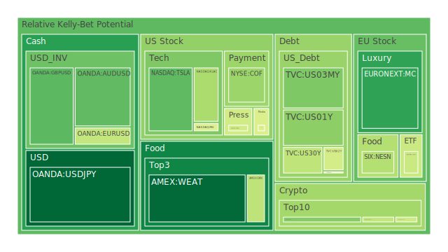
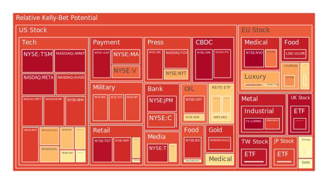
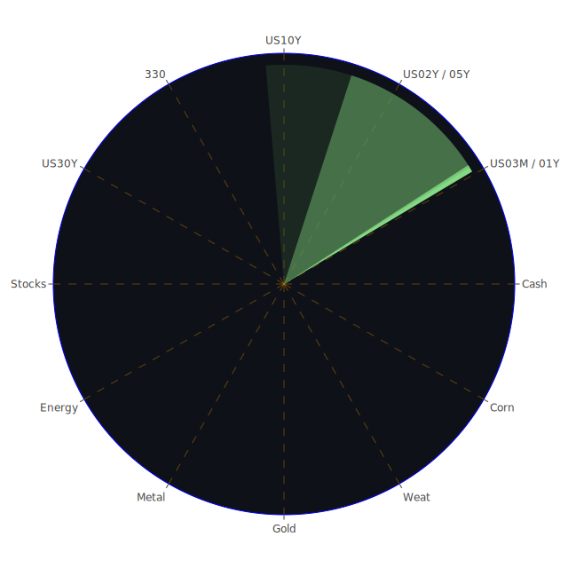

# 一、前言：三位一體的思考背景

在進入「Spatial（空間）」、「Temporal（時間）」與「Conceptional（概念）」三位一體分析之前，我們先概略說明此種思維模式。所謂三位一體，意圖從多面向切入市場與新聞事件的交織影響——

1. **Spatial角度**強調市場與新聞議題在全球各地如何互動、散播與影響投資人心理。例如區域性的衝突、新興市場或已開發國家之間的互動，以及各地政策對資產類型帶來的變化。
2. **Temporal角度**側重於時間維度，從短期到中期、再到長期，觀察新聞事件對投資市場所帶來的變動與延後衝擊。尤其在貨幣政策、通膨、企業獲利預期等方面，往往需要一段時間才能顯現。
3. **Conceptional角度**則是從概念與理論層面出發，結合經濟學、社會學、心理學與博弈論等，嘗試拆解市場行為背後的群體情緒、制度設計與策略互動。此處也可融入對泡沫風險的理論判斷、政策博弈以及市場參與者的預期管理。

這三種角度之間的「正、反、合」，在實際分析時會交織成一個龐大的網絡。為了闡述得更簡潔，我們將在以下幾個章節裡穿插地呈現，並盡量引用現有新聞事件資料及歷史相似場景，解釋各資產可能面臨的風險與機會。最終，再以風險對沖為核心，嘗試尋找投資組合的優化配置。

---

# 二、投資商品泡沫分析

在此章節，我們將依照不同資產類別，參考所提供的「泡沫分數」（即D1、D7、D14、D30）以及部分新聞脈絡，討論可能的過熱與風險徵兆。特別注意的是，有些數字呈現短期或月平均增減，但都只是參考指標，我們需要同時結合新聞背景、市場情緒與歷史比照來判斷。

## 1. 美國國債
美國國債的泡沫風險指數整體相對其他高貝他(β)資產通常較低，但根據最新美債殖利率數據顯示，2Y、5Y、10Y、30Y皆在過去一段時間曾高於4%，現今亦維持在高於3.9%～4.5%左右的區間。在新聞面，有多則負面報導提及「美國政府債務可能爆炸式成長至GDP的200%以上，若稅制優惠再度延長」。再從FED公布的「US Treasury 1Y Yield 4.04」、「US Treasury 2Y Yield 3.95」等數據可看出，雖然略有回檔，但與前期（例如去年高峰）相比尚算高檔。這意味著市場對聯準會之貨幣緊縮雖略有趨緩預期，但高利率環境或因通膨黏著度而維持更久。  
從泡沫風險角度而言，美債的「泡沫指數」通常不及高風險股票或加密資產，但在過去一年因殖利率劇烈波動，一些投資人對長天期債券的部位也出現不安。若未來美國政府真的面臨大幅度舉債、且市場信心轉弱，短端與長端收益率曲線有機會再度翻轉，亦可能推升違約風險的討論。歷史上，因美國國債信用度高，通常最後若有系統性風險，資金仍可能回流美債保值。然而泡沫風險若硬要對比股市或加密貨幣，整體還是相對可控。

## 2. 美國零售股
典型零售股如WMT、TGT以及一些百貨零售相關企業，近期不少新聞揭示「消費者信心疲弱」和「企業對未來展望不確定」。特別是TGT根據資料所顯示，其泡沫風險指數在D1約0.938～0.968之間，非常高，短期內市場對此個股過熱與估值頗具爭議。同時新聞面提及「與勞動市場疲軟、消費力道疲乏」相互呼應。因此，零售股短期若遭遇通膨與利率高檔，消費力受壓抑，營收亦可能下滑。歷史上常見當利率維持高檔超過半年以上，零售業績會遭到更明顯的打擊，而股價也可能後續補跌。  
此外，一些新聞標題顯示「S&P 500指數走勢震盪，零售股尤其受到打擊」，形成市場的情緒壓力，這也在心理層面造成投資人避險情緒上升。若從博弈論來看，零售股可能陷入比價壓力，競爭對手的削價促銷或關店潮都可能進一步強化這種悲觀預期，使得部分零售類股雖然泡沫分數偏高，但實際上估值並未真正過度膨脹，而是由於「避險意識不足」反映在股價波動。要小心這類高泡沫分數可能醞釀之結構性風險。

## 3. 美國科技股
美國科技股如AAPL、TSLA、NVDA、MSFT、AMZN、GOOG等，在資料裡的泡沫風險普遍較高，比如AAPL短期內泡沫分數接近0.71～0.81以上、NVDA更是一度超過0.90。新聞指出「AI相關題材」、「雲端業務成長」、「晶片高需求」在去年與今年一度帶來極大熱潮，不少投資人擁擠在同樣標的裡。然而也有新聞顯示「Apple串流服務恐因使用者流失導致一年損失10億美元」，「Elon Musk引發的市場爭議讓TSLA在二手車市場價格下滑」，這些負面報導或多或少顯示科技股雖利多消息時常出現，但負面因素也一直積累。  
回顧網路泡沫時代，過度高估值最終因利率走高或企業獲利不及預期而急劇回調。有別於2000年網路泡沫時，多數龍頭科技股現今有更雄厚的獲利基礎，但估值是否依舊過高，必須密切觀察利率變動及實際財報。心理學與博弈論的角度或許指出：許多投資人基於Fear of Missing Out（FOMO）持續追高，加深了泡沫風險的醞釀。

## 4. 美國房地產指數
追蹤房地產的ETF如VNQ、RWO，以及房屋類股HD等，在資料裡的泡沫指數普遍有升溫跡象，如VNQ、RWO在D14或D30都呈現相當高的泡沫數值。新聞指出「30年房貸利率持續在6.6%～6.8%之間震盪」，造成房市景氣轉弱；同時部分報導顯示「全美房屋建造商信心指數下降」。CEO訪談亦強調「住房市場會‘weaker-for-longer’，消費者信心還在下滑」。  
歷史類比2008年金融危機時，美國房地產過度槓桿最終導致崩盤。但目前貸款標準有所收緊，不見得會重現當年的大規模違約。然而房地產面臨利率高、通膨居高不下，以及房屋可負擔能力低下，其價格的上行空間被壓制。此時若有某些區域市場依然高飛，需警惕可能形成局部泡沫。一旦就業或資金市場出現較大動盪，該類房地產估值恐出現劇烈回調。

## 5. 加密貨幣
加密貨幣（如BTC、ETH、DOGE等）數據當中顯示，一些幣種的D1與D7泡沫分數居中到偏高，例如BTC先前一度D1約0.45～0.46附近，而ETH也在0.34～0.65區間震盪，DOGE則在0.43～0.53之間。新聞面出現「比特幣波動度創下半年新高，市場對美國經濟不確定性感到擔憂」。回顧歷史，加密市場往往對宏觀流動性相當敏感，若聯準會維持緊縮，市場資金很難持續大舉湧入。  
但也有報導指出「機構投資者對加密貨幣期貨ETF的興趣逐漸升溫」，類似情況可能在未來發酵。如果該領域金融創新成功且監管框架逐步完備，也許對市場有正向刺激。不過泡沫風險仍不容忽視，加密資產屢次在牛市沖高後忽然大幅回調的情況並不少見，投資人務必留意槓桿和交易平台的流動性風險。

## 6. 金 / 銀 / 銅
貴金屬與工業金屬，尤其金與銀在避險情緒下時常受到青睞。資料顯示XAUUSD與XAGUSD泡沫分數在0.50～0.90之間浮動，銀甚至一度達到0.88以上。這代表市場對金銀避險需求不斷累積，然而長期以來，「金價高漲伴隨實際利率低落」才是經典模式。當前美國公債殖利率並非超低水準，所以黃金本身的持有成本也增加。  
歷史上，金價在避險模式驅動下仍可能持續推高，尤其若地緣政治動盪升溫。新聞面可見到國際衝突（如中東地區、歐洲地區）的不確定性時有升高，地緣局勢的擔憂助長金價短期維持在高檔。此外，銅價則更依賴經濟週期，若全球經濟出現明顯放緩跡象，銅的需求可能衰退，其價格容易震盪甚至下行。就報告數據顯示，銅的泡沫分數近乎0.99～1.00相當驚人，暗示在供需結構或市場炒作層面，可能已達到「風險非常高」的水平，需謹慎注意。

## 7. 黃豆 / 小麥 / 玉米
糧食相關商品如WEAT、SOYB、CORN等，其泡沫指數整體略在中度區域(例如CORN D1約0.42～0.43、WEAT約0.12～0.14在最新報告中都相對低些許)，一方面代表農產品市場可能尚未被過度炒作，但也顯示天氣、地緣戰爭、貿易關稅政策可能都對價格波動產生重大衝擊。新聞提及「全球貿易保護主義升溫」，可能造成糧食出口限制，再加上氣候變遷帶來的耕作不穩定，長期而言糧食價格易受驚嚇。但當前未出現驚人的全球供需斷層，泡沫分數相對未見明顯爆量。

## 8. 石油 / 鈾期貨UX!
原油價格近幾週震盪在每桶68～70美元之間，泡沫分數顯示在0.60附近，雖非極度危險，但也說明國際原油市場在供應及地緣政治風險下仍有波動。新聞曾報導「美國對伊朗的制裁影響中國煉油廠」，亦有「中東地緣衝突」等負面訊息，都可能推動油價短期上攻。歷史上，若衝突加劇，油價常瞬間跳漲。  
至於鈾期貨（UX）在D1、D7等指標達到0.53～0.54以上，並不算極度高風險，但若核能話題再度得到各國重視，以替代化石能源，鈾的需求有潛在成長空間。此市場具有相對獨特的供需結構，也容易因地緣或政治原因出現驟漲，投資者需適度關注。

## 9. 各國外匯市場
針對USDJPY、GBPUSD、AUDUSD、EURUSD等主要貨幣對，有的泡沫分數偏低至中等，如USDJPY D1在0.08～0.12，這類傳統上波動也比較穩定。另一方面，GBPUSD與EURUSD在部分數據中則顯示泡沫分數可達0.64～0.69不等。新聞面可見「英國經濟因預算失誤將面臨支出削減」，「歐洲奢侈品股仍有韌性」等，這些事件都可能影響歐元與英鎊的匯率走勢。  
歷史上，匯率市場受貨幣政策差異與地緣政治衝擊顯著。若FED一再延後降息，且英國或歐元區通膨持續高檔，利差走勢就決定了貨幣強弱。投資人須謹防避險貨幣（如日元）偶爾也會因投機資金而異常波動。

## 10. 各國大盤指數
例如日經指數（JPN225）、德國DAX（GDAXI）、英國FTSE等，多數泡沫指數都在高檔(有些高達0.88～0.97)。新聞面顯示「日本通膨重回3%，加深對日銀可能調整利率的猜測」，「德法等歐洲經濟成長趨緩但軍費投入大增」，「英國政府面臨預算危機，英國股市震盪」。  
回顧歷史，有些歐日股市在特定時間點易受國內政策刺激或壓力。若當前市場將其視作「對沖美股風險」，而大幅擁擠投資，也有泡沫化風險。尤其日經在歷史上1980年代末、1990年代初曾有大規模泡沫，後續長期調整，需提防翻版。

## 11. 美國半導體股
半導體股如AMD、INTC、AMAT、KLAC、NVDA等，資料中泡沫分數普遍較高，NVDA甚至曾衝破0.90。新聞提及AI發展帶動GPU需求飆高，導致Nvidia等公司市值水漲船高。然而也有負面新聞警示「晶片關稅與美中貿易緊張升溫」，「日本過去曾衝擊美國晶片市場的歷史」，等等皆可能對此領域造成打擊。  
回顧2000年網路泡沫及2018年半導體週期大調整，半導體股常在週期高峰時估值膨脹，如若未來市場需求趨緩、或供過於求，價格極易回調。故高泡沫分數意味急漲也可能急跌。

## 12. 美國銀行股
銀行股如JPM、BAC、C等，根據資料在近期泡沫分數相當高（BAC一度達到0.999），但又有新聞顯示部分銀行受到信用卡違約率走高及商業地產貸款風險攀升的衝擊。「Charge-off Rate on Credit Card維持相對高位」、「Commercial Real Estate Delinquent也處於較高水準」。這些負面訊號顯示銀行面臨的放貸風險在攀升。  
歷史看來，銀行股的風險在於金融體系順周期時獲利豐厚，一旦進入衰退或爆雷，股價跌勢也相當驚人。2008年金融風暴後，銀行雖具備更嚴格的資本要求，但仍不能忽視商業地產與消費信貸違約之累積風險所帶來的後座力。

## 13. 美國軍工股
軍工產業如LMT、NOC、RTX等，近來世界衝突增溫，如中東局勢、歐洲地緣危機、俄烏衝突等，使軍工股普遍具備資金流入跡象。資料顯示其泡沫分數常達0.87～0.89左右。一方面需求增加帶來營收，另一方面估值若飆過高，也潛藏風險。歷史上，軍工股在地緣政治升溫時期往往走強，但若大國衝突緩和或預算削減，又可能出現利空。投資該類股須留意新一輪「政府支出」變化。

## 14. 美國電子支付股
電子支付股如PYPL、V、MA等。數據顯示其D1有的高達0.94～0.97、甚至接近0.98以上。新聞面有「線上消費稍有疲態」但「大型支付平台不斷擴張金融科技應用」。歷史經驗告訴我們，越來越多的消費轉向電子化，長期基本面仍偏正面。但當前高利率環境對科技與成長股評價帶來壓力，若支付類股短期股價飆高，或存在獲利了結的可能。  
同時，也要注意網路安全或監管壓力。若哪家支付公司發生資安問題，股價恐遭到重擊。博弈論的角度顯示，市場競爭激烈，各家支付服務商會相互搶佔客戶與技術優勢，利潤空間可能被瓜分。

## 15. 美國藥商股
如JNJ、MRK等，資料顯示其泡沫分數在0.52～0.74左右，非極端高位，但市場對保健與醫療需求的穩定性一直有較好評價。新聞面同樣提及「大型藥廠因製藥創新投入巨大，但也面臨政府定價與專利到期風險」。長期來看，醫藥股常被視為防禦型標的之一，但若市場修正壓力太大，藥廠也難獨善其身。

## 16. 美國影視股
如DIS、PARA、NFLX等，近來串流戰爭持續造成營運成本高漲，PARA的泡沫分數D14甚至超過0.84，持續高位運行。新聞指出「蘋果串流虧損嚴重」、「Netflix雖然成長但面臨競爭」。歷史經驗可參考傳統好萊塢電影公司曾在技術變革浪潮中受衝擊，後來靠整合或併購尋找新出路。現在業者大多投入串流平台並陷入價格競賽，對該產業投資要慎防利潤被分食的風險。

## 17. 美國媒體股
如FOX、NYT、CMCSA等，泡沫風險在0.45～0.92不等，差距不小。新聞面上，「廣告營收、付費訂閱量」常與整體經濟好壞密切相關。社群媒體興起也分流了傳統媒體的廣告財源。若經濟衰退邊緣漸顯，企業廣告預算縮減，媒體股常首當其衝。

## 18. 石油防禦股
如XOM、OXY等公司，泡沫分數約0.64～0.89。因油價近期雖未飆破百，但供應面不確定因素依舊存在，一旦未來中東或俄羅斯石油供應再出變數，能源股仍可能大幅波動。歷史上，能源股往往走出獨立行情。正反合之下，若全球需求放緩，油價下滑，該類股也會面臨壓力。

## 19. 金礦防禦股
如RGLD等，泡沫分數在0.91～0.92左右，也屬高位。金礦股常與金價連動，但同時面臨自身開採成本和企業槓桿風險。若金價高漲期間礦企產能擴張，之後金價回落，可能形成經營壓力。不過在通膨或地緣衝突疑慮下，金礦股往往吸引防禦性買盤。

## 20. 歐洲奢侈品股
如MC、KER等，泡沫分數中度至高(0.28～0.77)。新聞顯示「歐洲經濟雖放緩，但奢侈品對高淨值客群需求仍不乏力」，加上中國市場重新開放帶來的消費復甦。歷史上，奢侈品股時常展現抗跌性，但一旦發生全球性的金融震盪或重大地緣衝擊，高端消費也可能驟減。

## 21. 歐洲汽車股
如BMW、MBG等，泡沫分數約0.50～0.60之間不等。歐洲車廠正在面臨電動化轉型挑戰，同時也害怕關稅措施以及供應鏈中斷。此產業若遇市場需求放緩，庫存與生產成本將顯著影響股價。

## 22. 歐美食品股
如NESN、KHC等，大多是傳統必需消費業者，泡沫分數分布在中間(0.40～0.60左右)，部分個股稍高一些。此類股具有防禦特性，但原物料成本與運輸費用上升也會壓縮獲利。通膨率若居高不下，其定價能力有時不足以完全轉嫁成本，也會面臨利潤壓力。

---

# 三、宏觀經濟傳導路徑分析

宏觀面，從FED的關鍵數據可觀察出：  
- **利率走勢**：SOFR、OIS FED Fund Rate、各期限美債殖利率等雖從高峰稍微回降，但並未回到疫情之前的低位，代表整體金融環境仍顯緊縮。  
- **銀行體系及消費者負債**：高信用卡違約率、商業房地產逾期等訊號，暗示消費和企業融資可能漸趨疲軟，對經濟成長形成壓力。  
- **國際收支與債務**：美國政府債務占GDP比重不斷攀升，若長期結合高利率，可能導致更高的財政壓力。這在歷史上可能造成美元資產的動盪與資金重新配置。  
- **地緣衝突與國防支出**：部分新聞顯示歐洲、亞洲地區軍費支出變動，可能刺激軍工、能源等領域，也會讓通膨結構更複雜。

整體來說，宏觀經濟與市場連動在「利率—消費—企業獲利—就業—通膨」的鏈結上，暫時未見馬上轉向寬鬆的跡象。貨幣政策與政府財政赤字則可能成為下一階段市場焦點。回顧多次經濟週期，在高利率的環境下，企業普遍面臨高融資成本，投資意願下降，最終轉嫁為就業市場放緩。當利率最終回落，市場情緒又可能大幅反彈。因此短期到中期的波動仍需要高度留意。

---

# 四、微觀經濟傳導路徑分析

在企業層面，許多行業都面臨下列共通微觀衝擊路徑：

1. **融資成本上升**：中小型企業難以承擔高利率，或轉嫁成本給消費者，導致商品或服務價格上漲，最終拉高通膨黏著度。
2. **庫存與供應鏈**：若國際衝突或關稅限制再現，企業必須尋找替代供應商，增加生產或運輸成本，壓縮利潤。  
3. **市場需求轉弱**：新聞提及消費者信心下滑，企業銷售將減少，可能引發裁員或減少資本支出。  
4. **技術與創新**：電子支付、AI、半導體、串流媒體等行業，處於高競爭、高成長又高風險的環境。部分企業如果失去技術優勢或客戶群，股價回落速度也很快。

---

# 五、資產類別間傳導路徑分析

1. **股債互動**：若經濟衰退風險升高，資金由風險資產轉向美債；反之，若市場預期寬鬆或經濟復甦，資金重返股市。  
2. **外匯與大宗商品**：美元強弱牽動油價、金價、農產品價格。若FED維持相對鷹派，美元資金回流，美國出口壓力增大，然而國際資金亦流向美元計價資產。  
3. **避險資金流向金銀**：地緣政治或系統風險上升時，黃金、白銀需求通常上揚，也影響金礦股走勢。  
4. **加密貨幣對股市的替代或補充**：在某些時候，加密資產會與美股同步風險趨勢，但也有極端情況下出現獨立行情。部分人視比特幣為「數位黃金」，但尚未達到真正避險功能的共識。  
5. **房地產對金融系統衝擊**：若房地產泡沫破裂，銀行股將面臨壞帳壓力，進一步影響整體經濟與股市。

---

# 六、風險對沖的投資組合機會

根據三位一體的分析（Spatial: 觀察區域；Temporal: 觀察時間；Conceptional: 理論觀點），以及我們對新聞事件、歷史經驗的比對，可以嘗試找出若干相位接近「120度」、相關係數約-0.5的資產配置。此處只概略舉例某些能在不同情境下互補的標的，讓投資組合具有分散風險的效果：

- **可能相對負相關或低相關的配置範例**：  
  - 長天期美國國債（在景氣下滑時可能受避險資金青睞）  
  - 黃金或黃金防禦股（在地緣政治、通膨壓力下具避險特性）  
  - 部分工業或高科技股（在經濟復甦或通膨趨緩時更具爆發力）  
  - 加密貨幣（特殊時期可能展現與傳統資產不同的走勢，但風險高）  
  - 部分農產品或能源期貨（在地緣或天氣衝擊時獲得溢價）

實務上，要達到相位120度與-0.5相關的精準組合不易，但可朝不同資產大類搭配，避免單一風險集中。例如同時配置一定比例的避險資產與成長型資產，以期在特定階段能對沖部分波動。

---

# 七、三種投資組合配置建議

下列建議僅為示範性說明，每種組合類型都包含三個子投資項目，並給出大約比例，使合計佔整體投資組合100%。同時請勿忽視可能的泡沫風險與市場不確定性，一切配置仍需依照個人風險承受度進行調整。

## 1. 穩健型 (約佔總資金的40%)
- **子項目A：10%長天期美國國債**  
  理由：景氣若衰退或風險意識上升，長天期債券相對保值；但要注意利率若繼續升高，債券價格也會承壓。  
- **子項目B：15%高評級投資級公司債**  
  理由：分散銀行或地產風險，若經濟尚未嚴重衰退，優質公司債違約風險不高。  
- **子項目C：15%必需消費與醫藥股**  
  理由：在經濟下行時較能抗跌，泡沫風險相對有限，如KHC、JNJ、MRK等。

## 2. 成長型 (約佔總資金的30%)
- **子項目A：10%半導體或科技龍頭**  
  理由：若AI或數位化趨勢持續，NVDA、AMD或AMAT等仍有上行空間，但泡沫風險不可不察。  
- **子項目B：10%網路或電子支付股**  
  理由：如V、MA或PYPL等，長期成長潛力大，短期波動也相對顯著。  
- **子項目C：10%歐洲奢侈品股**  
  理由：如MC或KER，若全球高端消費持續擴張，獲利空間可期，但需留意歐洲經濟與地緣衝擊。

## 3. 高風險型 (約佔總資金的30%)
- **子項目A：10%加密貨幣**  
  理由：BTC、ETH等可能在資金面鬆動時上漲，但波動極大，泡沫風險不容小覷。  
- **子項目B：10%軍工股或能源股**  
  理由：地緣緊張時支撐股價，如LMT、XOM等。但若地緣衝突降溫或政策轉變，可能回跌。  
- **子項目C：10%黃金或金礦股**  
  理由：具避險功能，亦可視為策略性高風險高報酬部位，因金礦股波動往往比金價更大。

以上分配中，不同子項目之間本身就存在一定程度的對沖或分散效果。例如長天期美國國債與加密貨幣的走勢相關度相對較低；必需消費股與軍工或能源股也能在不同的地緣與經濟情況下提供平衡。當然，這種配置只是範例，真實操作中應動態調整比例，根據市場消息與風險承受度做及時調整。

---

# 八、兩兩相互驗證與漣漪效應傳導路徑

基於前述三位一體觀點，我們需要進行「兩兩相互驗證的篩選假設分析」，以找出最合理的風險與機會：

1. **軍工股 vs. 國際原油**：地緣衝突升溫時，軍工股與油價常同時走強。此時若佈局軍工股就要考慮油價對全球經濟的負面衝擊，反過來可能衝擊整體股市。  
2. **加密貨幣 vs. 金銀**：某些投資人視加密貨幣為「抗通膨」替代品，故當通膨、地緣或金融系統出問題時，資金可能同時湧入金銀與比特幣。若加密貨幣行情暴漲，就要同時評估金價是否被分流，或反而一同拉升。  
3. **半導體 vs. 房地產**：若經濟走強、利率後續回落，可能同時利多房市與科技產業。可是若利率長期居高不下，房市可能持續疲弱，而企業投資意願也下降，進而壓抑半導體需求。  
4. **零售股 vs. 信用卡債務**：如零售銷售走弱，信用卡違約率升高，又會衝擊銀行股。此傳導路徑可形成漣漪，從零售消費到金融體系再影響整個市場。

透過這種多角度比對，可大致評估在未來幾個月到幾季之間，不同風險事件如何疊加。若市場陷入同步下跌危機，也可能形成流動性枯竭。投資人須注意流動性風險往往在高泡沫時期被忽視，一旦發生恐連鎖影響多種資產。

---

# 九、結語與投資建議

綜合來看，當前市場存在多項干擾因素：國際地緣衝突、通膨黏著度、全球債務負擔、科技熱潮與可能的政策性關稅衝擊等。一方面，利率尚未明確轉向，另一方面，企業獲利預期已漸趨保守，顯示市場正處於多空交織階段，各類資產的泡沫風險指數呈現分化態勢。

過去的歷史教訓說明，當資金成本持續偏高、地緣或政治局勢動盪時，容易出現結構性調整或逆轉。現階段投資者應謹慎留意可能的泡沫與過度槓桿，同時也要把握長期產業趨勢或具有相對價值的標的。在進行風險對沖時，建議採行多元化資產配置，並留意各資產間是否出現顯著高度正相關，避免名目上的多元實質上仍過度集中。

---

# 十、風險提示

投資有風險，市場總是充滿不確定性。儘管本報告以客觀分析與歷史經驗做參考，但未來的市場演變難以完全預測。若市場因地緣衝突惡化、政策衝擊擴大、或全球經濟陷入超預期衰退，任何資產都可能面臨大幅波動甚至流動性短缺的狀況。再者，高泡沫分數的資產若同時遭遇系統性風險與資金大規模撤出，價格回調可能相當劇烈。投資者應根據自身的風險承受能力與資金需求，審慎評估後才做出決策，切勿忽視高槓桿或情緒性操作所帶來的額外風險。

 
Daily Buy Map:

 
Daily Sell Map:

 
Daily Radar Chart:

 
