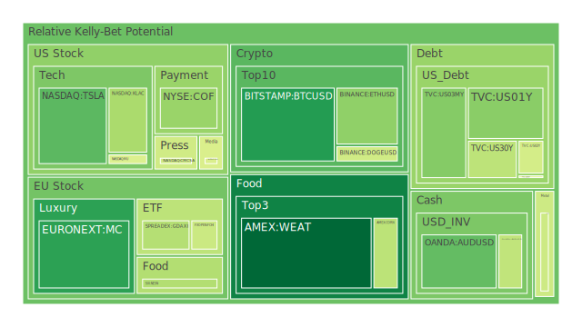
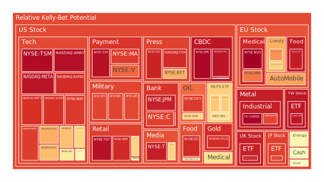
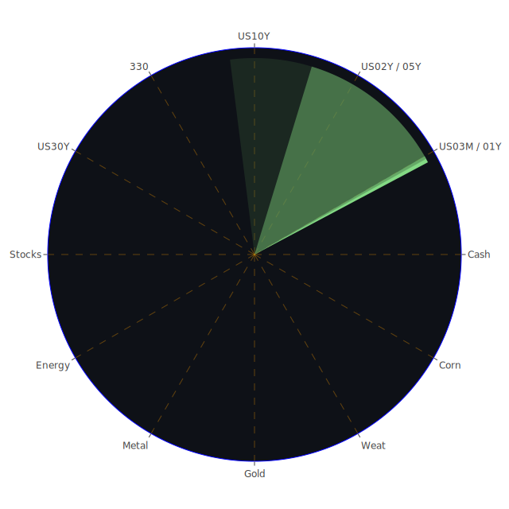

# 一、三位一體的空間（Spatial）、時間（Temporal）、概念（Conceptional）大膽假設：概述

在空間維度（Spatial）上，各區域市場間的互動變化，常常牽動投資氣氛。例如近期歐洲地區的奢侈品消費動能，會因歐洲與亞洲遊客往來的觀光復甦而帶動，也會因國際貿易政策（如潛在關稅壁壘或貨幣政策）的變動而出現短期震盪；同時，美國市場在房地產、科技股、軍工股、銀行股等板塊上，正受到通膨、就業報告與國際局勢、地緣政治等多重因子的共同推動與壓抑。這些差異化的市場走向，在空間維度下顯得尤為顯著，需要投資人同步關注全球化程度以及區域各自特色，以在佈局時取得分散風險的效益。

在時間維度（Temporal）上，當前各種周期疊加：一方面美國聯準會持續以相對「觀望」的態度面對通膨與景氣數據波動，市場對於未來利率與貨幣政策的預測不斷調整，FED官員近期偏鷹或偏鴿的談話，每次都可能帶來市場預期的大幅擺盪。另一方面，全球仍然受到貿易壁壘（例如關稅或制裁）與國際衝突的交互影響，長短期利率結構在美國（甚至其他已開發經濟體）發生反轉與再正常化的變化，形成了難以簡單用單一時點評論的複雜局勢。投資人若只憑一時指標或單一時間範圍來做判斷，常會忽略長期結構與短期波動交織而成的風險。長期與短期的節奏彼此交錯，形成極具挑戰的投資環境。

在概念維度（Conceptional）上，心理學、社會情緒與投資行為的互動常常在市場上扮演推波助瀾的角色。媒體對「科技股泡沫」、「地緣政治不確定性」、「某公司獲利爆發式增長」等議題的報導，往往引導或改變投資人的刻板印象與群體心理。博弈論的角度則會提醒我們，市場上不只有單純的理性或感性，還有各方利益團體之間策略互動，例如大型投資機構借助新聞或輿論操作預期、企業管理層在財報或投資者大會上的口徑釋放訊息等，都可能影響市場。要看清事實背後的策略意圖並不容易，但若能理解概念維度中「投資者心理、企業策略、市場情緒」之間的正反合交融，也許能在眾聲喧嘩中做出更適切的判斷。

將這三大維度交匯而形成的「正（看似合理的主流觀點）」「反（各種與主流背離或對立的聲音）」「合（綜合觀察後的新可能）」，可以幫助我們大膽假設、全面驗證，進而看出未來市場輪動與風險偏好可能的轉折。以下將綜合目前各資產類別的泡沫風險資料、新聞事件及歷史經驗，進行更細緻的闡述。

---

# 二、投資商品泡沫分析

以下將依照主題列示的各項資產進行敘述。所謂「泡沫風險」可從所提供的 PP100（當日現價）、以及短期（D1）、一週（D7）、兩週（D14）、月平均（D30）風險分數來判定，一般而言，分數越高代表當前市場對該資產的「過熱程度」或「潛在風險」可能越高，必須保持警覺。

## 1. 美國國債
美國國債向來被視為全球資金避風港，但近期從新聞中可看到，市場對未來聯準會貨幣政策走向疑慮加劇，且美國國債總體供應量也面臨「債務佔GDP比率持續上升」的負面新聞。加上過去一年多來的升息風潮造成殖利率曲線一度倒掛，如今10年期與1年期、2年期的收益率差異正逐漸趨近，但同時仍偶有反覆。對保守投資者而言，美國國債依舊有其配置需求，但需注意長短期利率結構的修正風險，以及美國財政缺口越拉越大的結構性壓力。在泡沫指數方面，目前並未顯示出極高的過熱度，但長期殖利率若持續停留高檔，也會吸引其他資金進入，短線投機泡沫不明顯，但不排除中長線可能有劇烈價格震盪的風險。

## 2. 美國零售股
近期新聞提及零售、消費板塊承受通膨和關稅帶來的壓力，而且許多大企業宣布裁員或對未來景氣持續保守，對整體消費市場情緒有所打擊。例如Nike、星巴克等面臨成本或利潤壓力，以及FedEx下修財測也暗示消費力道可能疲弱。過去也有類似案例，如2008金融海嘯前，零售股一度隨消費景氣與槓桿資金而高估，後因信貸緊縮與就業下滑而急速回落。目前看來，零售板塊短期信心不佳，泡沫風險雖不算極端，但若經濟衰退預期再度升溫，股價下行壓力可能持續。

## 3. 美國科技股
美國科技股常常是市場焦點，尤其近期關於AI、半導體、雲服務等議題夯炙人口。新聞指出「Nvidia執行長談關稅影響有限」「特斯拉員工持股」等，都再度凸顯投資人對未來科技領頭羊的高度期待。然而，也要留意資本市場對科技股抱有時常膨脹的「樂觀預期」，一旦營收成長與實際獲利落差甚大，就會觸發急速修正。歷史上，2000年的網路泡沫及2022年初對高成長科技股的調整，都是前車之鑑。近期數據中，如TSLA、NVDA、AAPL、META等公司的D1或D7風險分數偏高，顯示投機情緒並不低，需警惕高波動。

## 4. 美國房地產指數
房地產相關的ETF或REITs(如VNQ、IYR等)都在一定程度上反映了美國商業不動產與住宅不動產市場的趨勢。近來受到利率持續在高檔（30年房貸利率仍達6.67上下）以及整體經濟不確定性的影響，美國房價在部分區域已出現松動。有新聞顯示大型建商對未來1-2年的需求面評估趨於保守。歷史上2007-2008年的房地產泡沫清晰可見，目前雖無當時那種嚴重的次級房貸結構性風險，但若資金環境持續緊縮，商業地產與居住地產仍可能面臨壓力。泡沫風險指數中，某些房地產ETF呈現出中高位區間，如VNQ的分數累積到D30後也不低，暗示對未來要保持警戒。

## 5. 加密貨幣
比特幣、以太幣、狗狗幣等具代表性的加密資產波動一向劇烈。新聞提及「比特幣今年或已觸頂」的市場聲音同時也有看多派，反映出投資者分歧。比特幣近期從PP80至PP100的價差相對可觀，也有一定交易量；D1或D7指標若呈現適中但並未過分亢奮，或許顯示投機情緒稍有降溫。然而，加密貨幣常常受大環境（金融市場流動性、央行政策等）與突發新聞（監管、交易所等議題）雙重影響。歷史上，幣價暴漲暴跌的案例不勝枚舉，仍須謹慎看待，尤其泡沫化風險常在投資者心理盲目追漲時急速擴散。

## 6. 金/銀/銅
黃金（XAUUSD）、白銀（XAGUSD）以及銅等原物料在通膨環境下通常扮演避險或反映經濟景氣的角色。比如銀或銅需求常和工業景氣連動，黃金則較受地緣政治與金融市場動盪的影響。目前新聞顯示全球仍有不少衝突，且部分國家利率雖然高檔，但實質利率若無快速上升，黃金需求短期內還是可能受到保值需求支撐。銅價格部分受到中國需求前景、全球基礎建設與新能源轉型驅動，也會隨市場風險偏好而大幅波動。近期「黃金對銅比」上升至較高水準，暗示市場可能更傾向防禦心態。泡沫風險並非全面爆表，但若金價持續高漲，仍宜警惕過熱追高風險。

## 7. 黃豆 / 小麥 / 玉米
這些農產品期貨（如SOYB、WEAT、CORN等）往往和天候、地緣政治、運輸成本、糧食政策等密切相關。新聞顯示部分地區對糧食採取管制或關稅策略，也有天災或戰事造成部分運輸路線中斷，從而推動商品價格。歷史上，每當大宗農產品因天氣異常或地緣衝突上漲，都可能進一步催化市場投機。然而從資料看，黃豆、小麥、玉米在近期泡沫指數並未達極端水平，但在全球政治局勢尚未穩定的情況下，任何一個新衝突或供給變數，都可能帶來農產品短期大漲的擾動。

## 8. 石油 / 鈾期貨UX!
原油（USOIL）價格長久以來都受OPEC+政策、區域衝突、運輸瓶頸、美元匯率等推力拉鋸。新聞披露「原油小幅走高，供應疑慮大於經濟衰退前景」，顯示市場投資人對未來仍有爭議。此外，對通膨保持關注也使得油價頗具不確定性。至於鈾期貨（UX）屬於較窄的能源市場品項，需求在核能發電投資擴張時有潛力，但流動性相對偏低，價格波動大且容易形成題材式炒作。過去鈾價也曾在福島核災後大幅下滑，數年後再度回升，顯示核能議題常在政策與民意之間不斷搖擺，投資人應保持警惕。

## 9. 各國外匯市場
如歐元（EURUSD）、英鎊（GBPUSD）、澳幣（AUDUSD）、日圓（USDJPY）等，近期都受貨幣政策與關稅消息所影響。新聞提示「英鎊曾在90年代挑戰美元霸權，後因政策與經濟結構調整宣告失利」，目前看英國通膨與脫歐後續談判會繼續給英鎊帶來壓力。日圓在報導中顯示一度有挑戰美元地位的歷史，如今仍然疲弱。歐元則可能因歐盟內部財政、軍費投入、通膨壓力而動盪。澳幣則和大宗商品出口、中國需求關係密切。外匯市場容易受到「央行干預或避險資金流動」等短期擾動，因此泡沫化風險常因槓桿交易或避險操作而加劇，需要嚴加注意。

## 10. 各國大盤指數
包含美國的NDX、道瓊，歐洲的FCHI、GDAXI、FTSE，以及亞洲如台灣50(TWSE:0050)或大陸股市(000300)。這些大盤指數通常具「情緒風向」的地位。根據新聞可知，歐洲部分指數受到奢侈品股(例如MC、KER、RMS)或汽車股(BMW、MBG)權值影響；而美國的NASDAQ指數對科技股比較敏感，中國/台灣則對半導體需求敏感，若地緣政治升溫，可能引發高波動。值得注意的是，許多大盤指數的風險指數持續累積到高位，背後顯示市場雖有樂觀預期，但波動風險也正在醞釀。

## 11. 美國半導體股
如KLAC、AMAT、NVDA、AMD、INTC等，向來是全球供應鏈中舉足輕重的角色。新聞不斷報導晶片領域受關稅、地緣衝突、供應鏈重組影響。2019-2021年之間，由於挖礦需求與居家辦公，帶動了晶片大缺貨；2022年初起又因景氣轉弱和利率攀升讓股價大幅修正。目前2025年有AI和高速運算等新應用，但若整體經濟不振或地緣政治干擾擴大，半導體股可能再次出現評價修正。歷史案例顯示，科技循環高低點常大幅波動，此板塊易被擴張的投資心理炒作，需要慎防泡沫。

## 12. 美國銀行股
銀行板塊（如BAC、C、JPM等）和利率走勢、經濟景氣高度正相關，也須面對不良貸款或信用風險。近來新聞顯示部分類貸卡債務違約率略有上升，不少報導提及貸款利率偏高後，消費者對金融機構的信用卡使用與還款壓力上升。2008年全球金融危機的慘痛教訓顯示，若金融體系槓桿失控且風險計算有瑕疵，銀行股可能急劇下滑。近期美國銀行股D7、D14指標在部分個股上都偏高，需要持續關注。

## 13. 美國軍工股
如LMT、RTX、NOC等，近期較多與地緣政治、衝突升溫的新聞掛鉤。軍事採購、國防預算都會提振軍工企業的營收，但也存在政治和預算協商風險。歷史上在軍事衝突激化時，軍工股往往表現亮眼，但若衝突降溫或預算重新配置，其股價也可能修正。短期看來，新聞指出「歐盟國家準備大幅擴軍備」等，或使軍工股繼續受到關注，但要留意過度追價可能會面臨風險。

## 14. 美國電子支付股
如PYPL、V、MA等，都反映全球電子商務、跨境支付成長空間。然而若全球貿易爭端、關稅及地緣政治衝突升溫，跨境交易規模也可能受影響。同時電子支付公司面臨法規監管與競爭對手的威脅。最近新聞顯示「Amex或Discover儲蓄帳戶利率高低被討論」等，反映市場競爭激烈。歷史上，電子支付類股也多次大起大落。現有泡沫風險指數顯示V和MA短期熱度高，要小心追高風險。

## 15. 美國藥商股
如JNJ、MRK、LLY等大藥廠，通常視為相對防禦性板塊，但也會受到專利到期、法規與市場競爭影響。新聞中提到「藥價談判」或「公共政策改變」等都會在市場引發波動。2025年前後，部分大型藥廠管線是否能推出突破性產品，也是一大焦點。回顧如2010年代初期，藥廠板塊曾因新專利藥獲批而大漲，但也曾因法規緊縮而出現估值壓力。眼下風險分數中等，並未呈現特大泡沫，仍要留意防守與短線炒作之間的平衡。

## 16. 美國影視股
如PARA、DIS等，既要面對串流平台競爭，也要因應廣告收入或票房收入的波動。疫情後的娛樂產業雖緩步復甦，但若消費者預算緊縮，這些企業的業績也可能受到影響。歷史上媒體產業常因技術變革（例如從電視到網路串流）產生翻天覆地的洗牌，投資者須關注技術演進與內容競爭。近期新聞顯示DIS等公司在並購與內容製作方面不斷調整策略，也多次陷入關於利潤率的討論。短期泡沫風險中等，但若未來消費不振，跌幅也不可小覷。

## 17. 美國媒體股
如CMCSA、FOX、NYT等，與新聞產業、娛樂節目、體育轉播權、廣告市場緊密連動。市場對傳統媒體與新媒體整合抱持各種觀點，之前也有企業大動作的併購案失敗案例。回顧2000年網路泡沫及2010年代串流興起的激烈洗牌，許多媒體股股價一度大漲或大跌。眼下新聞顯示媒體公司仍在整合與內容投資，有些併購案卻停頓或受阻，呈現較高的不確定性。

## 18. 石油防禦股
一些專注於石油業務且相對穩健的防禦型標的，像XOM或OXY等。這些公司在油價較高時能享有利潤，但也需要投入高資本支出，以及承受環保法規及能源轉型趨勢。若長期油價下行，防禦性也不足以抵禦結構性衰退。新聞指出「OPEC+未來可能調整供給」，一旦合作破裂或需求大幅下降，這類石油股也恐面臨波動。

## 19. 金礦防禦股
如RGLD等，金礦公司通常跟黃金現貨行情走向相關度高。當資本市場波動大時，往往金礦股會因避險資金流入而漲。但是金礦的開採成本、政治風險、環保與社會責任等也會帶來不確定性。歷史上在金融動盪時，金礦股有時表現出色，但一旦市場風險偏好回升或金價回落，也會受到強烈衝擊。泡沫風險指數顯示該領域也有不低水準，需密切關注。

## 20. 歐洲奢侈品股
如MC、KER、RMS等隸屬著名歐洲精品集團，具備強大品牌力，但也受限於富裕消費者的信心與全球旅遊景氣。新聞中看到「歐洲觀光復甦與亞洲遊客」常是他們業績關鍵，若後續地緣衝突或經濟衰退，恐打擊奢侈品需求。歷史上幾次經濟衰退都顯示，雖然精品在高端市場有一定抗跌性，但也無法完全脫離整體需求週期。近期泡沫風險中上段，投資人要注意該板塊在市場狂熱追捧時可能積累的高估值。

## 21. 歐洲汽車股
如BMW、MBG等，歐洲汽車產業一方面受全球景氣循環影響，另一方面面臨電動車轉型壓力。歷史上德系車廠在柴油門危機後，也曾大幅調整策略。當前雖有觀光與經濟活動回溫帶來的消費，但若整體利率與通膨維持高檔，買車意願恐受影響。近期新聞提及供應鏈與晶片短缺雖有緩解，但電動車市場競爭激烈仍增添不確定。泡沫風險指數顯示不算最高，但也不容忽視潛在回調。

## 22. 歐美食品股
可包含KHC、NESN等大型食品與消費品企業，屬相對防禦板塊。一般在經濟不確定時，必需消費品類股表現相對穩健，但也會遇到成本上漲、原物料漲價與供應鏈風險。歷史顯示此類企業的股價雖然極端波動較少，但並非絕對避險，尤其若大盤大幅修正也常受牽連。新聞顯示這些企業在新興市場的佈局與產品轉型，需要時間來觀察成效。

---

# 三、宏觀經濟傳導路徑分析

1. **利率與貨幣供給**：FED利率決策、SOFR交易量、EFFR交易量都對市場流動性有直接影響。如果市場預期FED還要更長期維持高利率，就會壓抑風險性資產的估值，可能導致股市和高收益債下跌；同時，也可能使得美元匯價走強，進一步影響新興市場與大宗商品行情。  
2. **財政政策與公債供應**：美國政府債務佔GDP比例持續攀升，若沒有效的支出與稅收平衡，市場對公債的需求與殖利率走勢都會充滿不確定性，也會影響全球債市和貨幣市場的資金流動。  
3. **國際貿易與關稅**：近期許多新聞談到針對歐洲、亞洲甚至南美國家進行的高額關稅威脅。若貿易摩擦升級，全球供應鏈再次震盪，對科技、汽車、農產品、半導體等領域的價格和供需結構造成牽連。  
4. **地緣政治衝突與軍工預算**：當多個地區爆發政治緊張或局部戰事，軍工、能源、農產品等價格及交易量往往被推升，這也可能使通膨難以下降，讓央行收緊貨幣政策的壓力更大，形成連鎖效應。  
5. **信用風險傳導**：銀行體系若不良債權與信用卡違約率持續上升，會引起市場對金融穩定性的疑慮。再加上商業地產或高收益債券若違約增長，彼此之間可能透過資產證券化或互相擔保而擴大風險敞口。

---

# 四、微觀經濟傳導路徑分析

1. **企業生產與報價**：若關稅成本提高，企業可能將成本轉嫁給消費者，最終影響消費力道，也會衝擊企業的訂單與利潤。  
2. **就業與薪資**：在利率高漲、經濟增速放緩下，不少企業開始裁員或凍結招聘。就業市場冷卻後，會縮減消費，負面循環讓零售、地產、非必需消費品企業的營收壓力加劇。  
3. **財務槓桿與債務週轉**：高利率環境中，企業要借新還舊的成本攀升；若盈利疲弱，可能增加違約風險。銀行在放貸態度謹慎時，中小企業融資難度上升，產業結構受衝擊。  
4. **資本開支與投資意願**：企業面對不確定的經濟和地緣局勢，會放緩擴張腳步，降低研發投資或延後設備升級，進一步壓抑經濟活動。

---

# 五、資產類別間傳導路徑分析

1. **股債互動**：當市場對未來經濟衰退的恐慌擴大，資金可能轉進公債避險，推升債券價格、壓低殖利率；反之，若對通膨與升息預期仍在，市場也會擔憂債市下跌，資金在股債之間反覆擺盪。  
2. **商品與貨幣的互動**：原油或金屬價格變化往往與美元匯率呈現負相關，若美元走強，則油價與金屬價格易承壓；但若因地緣衝突推高油價，有時也會帶動美元作為避險貨幣上漲，產生同向波動的特殊情形。  
3. **地產與銀行**：商業與住宅地產景氣與銀行貸款、利率緊密連動，地產若轉弱，銀行股受不良貸款或資產減值影響；銀行若因資本壓力緊縮放貸，也會進一步打擊地產公司。  
4. **科技股與半導體供應鏈**：若電子產品消費衰退，半導體產能過剩或價格下滑，就會拖累整體科技板塊的獲利預期。而產業短期超額庫存或供應斷鏈，也會加大波動。  
5. **軍工、能源與貨幣政策**：軍工股走勢易跟地緣衝突直接連動；能源價格大幅波動可能讓通膨維持高檔，進而影響央行決策，最後再反饋到股市與債市的走勢。

---

# 六、依三位一體綜合評估後的風險對沖投資組合

以下嘗試從空間、時間與概念面，找出在不同景氣、不同政策與不同投資者心理狀態下可能表現相對互補的資產，並讓其相關性盡量呈現負或中性，達到分散風險目的。根據資料顯示，一些板塊之間確實存在負相關或相位錯開的特徵（如部分黃金防禦類與能源或科技類之間），但是要真正達到統計上約-0.5的相關可能仍需在投資組合中做更細緻的比例調整。以下以簡要文字概述，不製作表格：

1. **潛在對沖組合A**：黃金（或金礦股）＋原油（或石油股）＋科技（或半導體）  
   - 一般在地緣動盪或市場避險需求上升時，黃金及金礦股有機會走強；油價若受供應面干擾也可能逆勢上漲；科技股則可能在某些時期受資本流動衝擊較大。如果搭配合適比例，當科技股回檔時，黃金和油價可能因避險或供需變化而頂住部分下跌壓力。

2. **潛在對沖組合B**：穩定消費品（或食品股）＋銀行股＋加密貨幣  
   - 食品或消費品在防禦性上有一定效果；銀行股短期和利率正相關，但若經濟反轉向好，銀行股可能表現出色；加密貨幣往往有獨立週期，雖然波動極大，但某些時候和傳統金融市場呈現一定程度負相關，當銀行或消費品板塊過熱時，加密可能在另一个週期發酵（或反之）。不過此組合風險差異大，需謹慎控管倉位。

3. **潛在對沖組合C**：美國國債（或高評級債）＋歐洲奢侈品＋農產品期貨  
   - 國債在避險與保守資金流向時具優勢；奢侈品股短期走勢和亞洲旅遊、歐洲經濟復甦連動明顯，農產品則常和天候、地緣衝突、氣候災難等因素正相關，可能在經濟體循環不同位相上展現不一樣的漲跌，能與奢侈品或國債呈現互補。

在實際運用時，投資人要再用更精細的量化方法計算相關係數或相位差。上面只是對部分品項做大膽假設與參考性提供。

---

# 七、綜合三位一體、兩兩相互驗證的假設分析

將上述各項資產、風險指數、新聞與歷史檢驗結合，做「正（市場主流觀點）」「反（衝擊或意外）」與「合（調和並產生新架構）」的歸納：

1. **美國經濟若軟著陸（正）**，則銀行股壞帳風險下降、零售股消費回暖、科技股獲利預期升溫，但若同時通膨頑固（反），則FED再度加息壓抑估值，股債雙殺風險升高，最終結果可能是投資人同時在成長股與防禦股之間做動態調整（合）。  
2. **地緣衝突持續（正）**，軍工、能源價格維持高檔，但若爆發某些政治和談或減少衝突（反），該板塊急跌風險就大增，最後可能出現資金輪動至其他較安全或有新題材的區塊（合）。  
3. **關稅政策升級（正）**，壓抑全球貿易成長並抬升物價，若之後國際間妥協（反），市場又會重新評價過去被壓抑的經貿機會，最終在某些行業（如半導體、車廠）可能得到意外生機（合）。

在這種反覆試驗與多種情境套疊的框架下，投資佈局必須先行預想「若正向 scenario 發生，哪些資產會飆？若反向 scenario，哪些資產會補位？」最終取個綜合平衡。

---

# 八、投資建議：穩健、成長、高風險三大類配置

以下僅為概念性示範，總部位為100%，投資人可依自身風險承受能力調整。

## （一）穩健組合（約40%）
1. **美國國債**：15%  
   - 維持基礎避險，抓住長期殖利率若下降則國債價格可攀升；若殖利率上行，短期價格雖受壓，但債息收入填補部分損失。  
2. **黃金現貨或金礦股**：15%  
   - 面對地緣衝突、通膨風險時的保值功能，兼具市場動盪時的對沖。  
3. **歐美食品股或必需消費品**：10%  
   - 防禦性較強，即使景氣下滑，此類需求不易大幅萎縮。

## （二）成長組合（約40%）
1. **美國科技股（半導體領域）**：15%  
   - 中長期仍有AI、資料中心、高速運算等需求，若經濟回穩，該板塊反彈空間大。  
2. **歐洲奢侈品股**：10%  
   - 若觀光旅行回溫，亞歐消費者需求復甦，奢侈品高毛利與品牌優勢可提供高成長空間。  
3. **軍工股**：15%  
   - 地緣局勢尚未明朗，軍工訂單與國防預算具支撐，雖然要警惕停火或預算轉向的風險，但中期仍相對有題材。

## （三）高風險組合（約20%）
1. **加密貨幣（BTC、ETH為代表）**：8%  
   - 具極大波動性，但能提供與傳統資產相位不同的可能對沖；需嚴控比例。  
2. **新興市場高收益公司債**：7%  
   - 收益率吸引人，但信用風險與利率風險高，需警戒流動性。  
3. **鈾期貨或相關能源標的**：5%  
   - 受核能政策、供需關係及地緣政治等牽動，上漲潛力與回跌風險都大。

---

# 九、風險提示

1. **泡沫風險高的警告**：  
   - 有些資產（特別是科技股、電子支付、奢侈品股、加密貨幣等）在D1、D7、D14、D30指標上均顯示出不小的泡沫風險徵兆，且新聞面也有不少對經濟前景與企業獲利下修的報導。投資人需避免盲目追漲。

2. **宏觀政策轉向**：  
   - 若FED立場或其他主要央行態度出現大幅轉變（例如通膨意外加劇或衰退快速惡化），都可能讓市場資金流向急遽轉換，引發劇烈的價格修正。

3. **地緣衝突擴大**：  
   - 各地局勢尚未穩定，尤其新聞持續指出歐洲地區在擴充軍備，中東地區、非洲與亞洲地緣對立並未消弭，任何衝擊事件都會牽動全球金融市場的避險或撤資。

4. **金融系統性風險**：  
   - 若銀行或非銀金融機構因高利率環境或不良債權攀升而出現流動性問題，將成為導火線，在股票、債券、房地產和衍生品市場之間可能形成多重連鎖反應。

5. **流動性與槓桿**：  
   - 高槓桿操作在波動市況中非常危險，若市場流動性突然收斂，平倉或斬倉行為加劇價格急變，產生擴大損失的惡性循環。

---

# 總結與結語

當前全球處於多重壓力並行的階段，從經濟到政治、從金融體系到社會心理，都有潛在的風險與動能暗流湧動。從空間維度看，歐美、亞洲、新興市場之間的需求差異與地緣糾紛，此起彼落；從時間維度看，歷史週期的演進與當前利率、通膨、政策調整的交錯，使得市場常出現「短期逆風與長期機遇並存」的矛盾現象；從概念維度看，投資心理、新聞情緒與博弈行為則為市場波動插上更大的想像翅膀。

正反合的過程告訴我們：不能只看到利多或利空的一面，也要考慮到可能出現的轉折或折衷結果。各項資產之間在不同情境下會發生複雜的互動與傳導。一旦配合關稅政策與央行政策的轉向、某些地區衝突的緩解或升級、或重大企業並購失敗或成功，都可能帶來市場輪動或泡沫破裂。面對這些大膽假設與結果，投資者需要持續更新觀點、關注新聞及數據，並根據自身風險承受能力調整組合。

最後提醒，投資永遠有風險，市場總是充滿不確定性。本報告所提供的觀點與建議僅供參考，投資者應結合自身財務目標與風險屬性，審慎評估後再行佈局。保持對高泡沫資產所帶來的風險警覺，不盲目追高，以免在市場轉向時造成過度損失。同時也謹記，適度分散與動態調整是面對多變環境下的必要策略，希望這些分析能為您提供更立體、更全方位的思考依據。祝投資順利。

 
Daily Buy Map:

 
Daily Sell Map:

 
Daily Radar Chart:

 
