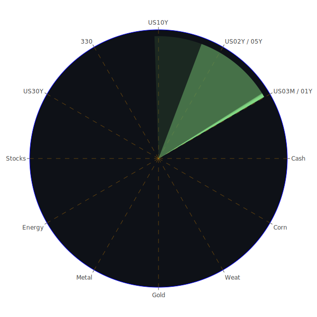

# 投資商品泡沫分析

在當前複雜多變的全球經濟環境下，我們觀察到各種資產均存在不同程度的市場風險與泡沫跡象。以下針對多項投資標的進行較為詳盡的分析，並結合經濟學、社會學、心理學以及博弈論等多元角度，進行一系列可能的風險與機會探討。本報告所有內容均以公正客觀的態度書寫，強調在面對市場與新聞時，應持審慎而冷靜的觀察立場。任何資產的波動都僅是自然現象之一部，投資者宜理性評估風險。

---

## 美國國債
近期市場對通膨、利率與全球經濟成長放緩的憂慮，使美國國債出現了短線上的波動。從泡沫指數角度而言，美國國債在長短天期之間的利率結構（10Y、20Y、30Y等）的確存在一定幅度的異常擴大。根據最新數據顯示，10Y與3M之間的利差在不斷變動，曾一度出現倒掛或接近零的現象；然而近日似乎回到稍微正值的區域，顯示市場預期也正隨著聯準會政策變化而不斷調整。就社會心理學面向而言，投資者對「避險資產」的渴望在地緣政治或突發事件中會迅速升高；博弈論視角則強調在各方高度關注利率與通膨預期時，所有市場參與者都在持續試圖「跑在別人前面」去鎖定更好的殖利率。若美國國債泡沫分數進一步抬升，可能暗示市場對未來景氣過度悲觀，或聯準會利率走向出現預期外變動。

---

## 美國零售股
美國零售股受制於消費信心不足、就業市場不穩定以及房地產市場修正的預期，近來整體表現相對壓力較大。在心理層面，一旦消費者對未來就業與收入預期下滑，或受負面新聞密集轟炸，便容易影響零售支出，進而使零售股的表現遭遇逆風。歷史類比可回顧2008年金融危機時期的消費收縮，然而本次市場的結構並不完全相同：現代電商的崛起與物流供應鏈的進步，也意味著某些零售股可能通過轉型取得新的機遇。就經濟學理論而言，零售業與消費支出的關聯度極高，一旦市場資金緊縮或利率居高不下，消費者傾向延後可有可無的購買，導致零售品類泡沫指數的明顯走升，因為估值偏高與真實獲利無法匹配時，就會呈現較高的風險。

---

## 美國科技股
美國科技股長期以來都是投資市場的焦點，其創新能力與高增長特質常吸引不少資金青睞。近期新聞顯示，科技巨頭在AI突破、關稅懸念緩和、以及部分企業裁員重組後，更有可能在市場情緒回溫中取得領先地位。一些資料顯示，企業如AMD、NVDA、META等公司正因人工智慧與雲端領域受關注而獲得市場追捧。從泡沫指數角度看，科技股的高估值向來受到爭議，尤其在利率高企之際，若市場進一步對盈利與估值產生分歧，科技股就會出現相當劇烈的漲跌。社會學層面可看作「群體狂熱」效應：當市場全力追捧新技術時，容易忽視中短期獲利能否支撐高估值。歷史上類似網路泡沫（2000年）或部分科技狂潮都曾帶來極大風險，投資者需要依照各家公司實際基本面作評估，而非僅憑媒體渲染。

---

## 美國房地產指數
美國房市在前幾年經歷大幅上漲後，近年陸續出現疲態。根據資料顯示，多家大型建商對未來市場採「謹慎觀望」，部分企業財報顯示建案銷售速率減緩，也有買家受高利率所迫而觀望。這種現象在社會心理層面可解釋為消費者在面對不確定就業前景與房價高點時的猶豫。若從經濟學角度探討，高利率意味著房貸成本攀升，購屋需求曲線便會往下移。博弈論層面則凸顯建商與投資者之間的拉鋸：建商為了回籠資金可能願意在價格上做出讓步，但投資性買家也可能預期更大跌幅而延後進場。若房地產指數在近期顯示泡沫分數上揚，通常意味著市場對未來房市修正的風險定價越來越高。

---

## 加密貨幣
以BTCUSD、ETHUSD等為代表的加密貨幣市場波動依舊顯著。曾在某些時期，由於避險情緒與對央行通膨政策的不信任，使投資人湧入加密幣市場；然而任何政經風險事件，也能導致加密貨幣劇烈震盪。心理學層面，每當媒體高調報導某些加密幣暴漲或暴跌事件，市場的「從眾效應」與FOMO心理便加速幣價波動。博弈論則凸顯市場參與者之間的囤積與拋售策略，容易在短期內形成不理性的炒作氛圍。回顧歷史上多次加密貨幣崩盤及其後的回升，都顯示該領域波動高且對新聞敏感。就泡沫指數來看，若D1與D7等短期平均數據大幅躍升，投資者須提高警覺：一旦市場流動性急凍，價格的跌幅也可能極為驚人。

---

## 金／銀／銅
黃金、白銀與銅金屬類的價格走勢，向來對地緣政治與通膨預期頗為敏感。黃金在常態情形被視為避險資產，若市場對通膨或經濟衰退預期升高，往往會推升其價格與泡沫分數；白銀雖也兼具工業及貴金屬屬性，通常跟隨黃金趨勢，但波動更大。銅則與全球工業活動密切相關，此次從新聞可見中國鋼鐵與房地產市場表現不如預期，連帶影響對銅材的需求預期，若需求減弱，則銅價或面臨壓力。但若地緣政治或關稅政策的變化令人預期刺激基建支出，也可能在短線出現行情反彈。歷史案例如2009年金融危機後的基礎建設投資潮，帶動銅價迅速反彈，顯示該類商品的漲跌常受全球宏觀政策左右。

---

## 黃豆／小麥／玉米
這三大農產品的市場行情，既受到天氣、戰爭、物流、政治因素影響，也涉及到各國政策干預。近期國際新聞中，某些主要糧食生產國或輸出國若因地緣衝突導致出口量受損，會直接推升價格泡沫風險。心理學層面，糧食類期貨往往被視為防禦性資產，但當市場憂慮通膨且需求不減，容易助長投機操作。博弈論觀點下的農產品市場，則更像是一種多方牽制：不僅包括農民、貿易商、消費者，還涉及糧食安全、關稅與進出口配額政策。歷史上每當出現重大天災或地緣戰爭，農產品價格都曾出現劇烈波動，需要隨時留意各種新聞變化。

---

## 石油／鈾期貨UX!
石油市場近年受OPEC+產量協議以及地緣政治持續干擾，價格波動不斷。若再考慮通膨、關稅與全球經濟成長走勢，石油在泡沫指數上的變化並非僅僅由供需決定。近期新聞顯示，若美國政府再度考慮對特定能源國家進一步收緊進出口政策，或者某些地區爆發衝突，油價便可能快速拉升。鈾期貨方面，由於全球再生能源轉型與核能發電議題備受爭議，鈾市場長期以來交易量小且容易受到政治聲明左右。歷史上，當核能在某些國家被視為未來能源支柱時，鈾價可能一度飆升，但若安全問題或地緣風險升溫，政策轉向也會讓市場出現大幅反轉。

---

## 各國外匯市場
外匯市場上，USDJPY、EURUSD、GBPUSD、AUDUSD等主要貨幣對最近數月均有不小波動。一些經濟體可能在利率決策與財政政策上產生與美國不同的周期表現，導致外匯市場出現顯著套息交易與資金流向。例如澳洲因中國需求放緩而受衝擊，英鎊因英國內部財政安排與公眾預期調整而動盪。根據博弈論，外匯交易常是各國央行政策協同與對抗的舞台，投資者則會捕捉利差機會並密切關注地緣衝突新聞。若某些貨幣在短期泡沫分數快速升高，往往意味着市場對該貨幣未來匯率存在過度槓桿或投機頭寸，一旦走勢逆轉便能帶來高風險。

---

## 各國大盤指數
在歐美與亞洲多國，大盤指數近期動能存在分歧。美國方面因科技股回溫，帶動NASDAQ與NDX等成長類指數表現相對穩健；但歐洲方面則因地緣政治、能源問題與奢侈品市場前景的不明朗，使得歐陸主要指數如FCHI、GDAXI在空間與時間層面都呈現波動。亞洲市場方面，日本225指數一度因日圓走勢與政府刺激計畫獲得支撐，中國大陸市場則受房地產與民間消費復甦狀況影響，表現時強時弱。歷史上當各國央行政策分歧時，全球資本可能傾向流向預期利率較低且成長動能較高的市場，引發指數之間的表現落差。此外，投資人也會同時關注新聞中關於關稅走向的負面與正面報導；若美國縮減部分關稅，亞洲與新興市場往往相對受惠，帶動該地區股市泡沫分數短線提升。

---

## 美國半導體股
半導體產業攸關電子產品、車用芯片、AI計算等多方面需求。近期從新聞看來，部分企業業績獲得AI與資料中心需求支援，也有芯片廠商積極布局先進製程。回顧歷史，以往景氣循環下，半導體股波動極大：需求旺盛時估值往往飆漲，而在庫存調整階段時則急速回跌。心理學層面來說，半導體股常與科技狂熱相伴，市場普遍對該產業賦予更高成長預期，也容易導致泡沫指數攀升。若該產業短期內產能供應失衡或地緣政治造成供應鏈瓶頸，可能使市場高估值泡沫面臨考驗。

---

## 美國銀行股
近年銀行業面臨的挑戰包括利率上升壓力、企業放款的違約風險、消費者信用等級惡化風險等。新聞提及多起因為利率持續走高而讓銀行放貸利差狹窄或呆帳風險升高的情況，尤其是中小型銀行在資產配置結構方面如果不夠穩健，便可能產生流動性壓力。歷史上銀行危機時，往往先從市場信心衰退開始，只要一有較大層面的擠兌或恐慌，便足以引爆金融海嘯般的效應。若短期內銀行股的泡沫分數顯著飆升，往往表示市場對該行業估值產生失衡，不論過度樂觀或過度悲觀都需謹慎評估。

---

## 美國軍工股
軍工股的需求層面常與地緣政治衝突與各國軍費預算緊密相連。隨著近期新聞不斷報導全球多地的軍事活動升溫，以及某些地區出現衝突擴大跡象，對軍工產業似有一定的拉抬效果。博弈論認為軍事衝突潛在升級時，各國往往尋求預先補強軍備，這也對相關企業的訂單產生正向影響。但若泡沫分數升至過高，代表市場對此產業的預期過度樂觀，一旦情勢和緩或預算遭刪減，軍工股的市值也可能迅速回落。歷史經驗如冷戰後期軍火需求大減，使曾經火熱的國防承包商遇到合併或裁員潮，顯示軍工並非保證長牛。

---

## 美國電子支付股
電子支付領域經歷疫情帶來的數位交易爆發後，近來成長稍作放緩。但是整體趨勢依舊向上：廣大用戶對無現金支付、行動支付的需求不斷提高，使得這些企業維持某種先發優勢。新聞中若出現地緣政治或稅務新規的干擾，會衝擊跨境支付與手續費收入，但同時也可能刺激部分替代方案崛起。在博弈論的框架下，各支付業者間的激烈競爭，往往透過大手筆行銷、手續費折讓等方式爭奪市場。短線出現估值飆漲時，往往意味着市場一致預期該行業繼續高速擴張，容易帶來泡沫危機；若真正的交易量或利潤成長速度趕不上，股價就會出現劇烈修正。

---

## 美國藥商股
醫藥產業涉及新藥研發周期、政府醫療政策、專利保護等諸多因素。市場新聞若報導新藥研發成功或大規模醫療補助政策，常刺激藥商股大漲；但若FDA審核受阻或法規政策改變，也可能使股價大跌。在心理學與社會學層面，疫病恐慌常推高藥品需求，但隨恐慌淡去，相關藥商估值也會回歸。歷史經驗如H1N1、COVID-19疫情，都曾在短期內改變全球醫藥供需格局。若藥商股泡沫分數過高，建議審慎評估公司研發管線真實前景，以及專利期與競爭對手佈局。

---

## 美國影視股
影視娛樂產業在串流平台崛起後，面臨傳統電影院、傳統有線電視頻道的營收下滑，以及同業之間對內容與訂閱用戶的激烈爭奪。新聞顯示部分大型影視公司因內容投資金額龐大、且觀眾口味快速變化，尚未實現穩定獲利。博弈論層面可看到，各串流業者試圖以獨家內容來綁定用戶，但成本支出極高，若泡沫分數急升，代表市場對「娛樂內容」的需求或訂閱模式極度看好，可是一旦競爭者減價或觀眾轉向新興平台，該估值便面臨重挫。歷史上許多媒體公司也曾受技術更迭或消費者行為轉變衝擊，須謹慎觀察。

---

## 美國媒體股
媒體股與影視股雖有交集，但媒體企業常同時涉足廣告、新聞、網路等渠道。當總體經濟不佳、廣告客戶削減預算，媒體公司的收入就會明顯下滑；反之，若有重大新聞或體育賽事壟斷轉播權，短期營收或股價也可能瞬間躍升。由於數位廣告市場競爭激烈，許多傳統媒體轉向數位訂閱，市場泡沫指數易受用戶留存率、廣告單價等影響。投資人須留意媒體合併與政策監管，如過度集中或涉及壟斷亦可能造成監管風險，使其估值動盪。

---

## 石油防禦股
石油產業的一些下游或周邊個股，因長期穩定分紅、擁有成熟供應鏈而具備防禦屬性。然而一旦出現大型地緣衝突或全球經濟快速衰退，其營運也難以獨善其身。歷史經驗告訴我們，油價若長期維持高檔，這些企業的利潤可維持在相對不錯水準，但若油價反轉下跌，其股價也會隨之動搖。投資者須警惕，泡沫分數雖可能顯示該類標的估值過高，但有時也必須留意資金避險需求帶來的短暫「追買」行情。

---

## 金礦防禦股
金礦開採商與金礦ETF等標的，時常隨黃金價格而上上下下。由於黃金有避險屬性，每當市場風險偏好降低時，金礦股便可能出現一波行情。但此類公司具備高營運成本、開採風險以及政治與環保風險等特殊因素，一旦金價下跌或開採條件惡化，也可能出現盈餘大幅縮水。歷史上多次因金價波動產生的股價劇烈起伏，提醒投資者不要僅依靠金價短線漲勢來判斷該類標的的可投資性，也要評估企業自身基本面以及所處礦區的政策風險。

---

## 歐洲奢侈品股
歐洲奢侈品廠商通常在中國、美國及中東市場擁有大量高端客群。近年新聞強調，一旦全球經濟趨緩、高淨值人士資產縮水，奢侈品消費就會減少。相反地，如果某些地區富裕階層仍有充沛財力或當地政府實施減稅政策，奢侈品消費便能支撐股價。歷史上奢侈品股在金融風暴或全球性衝擊時常經歷深度回調，但也以韌性著稱，一旦經濟恢復，奢侈品需求便可再次攀升。若從心理層面看，奢侈品消費具備象徵意義與身份標誌，使該領域的市場偏好常超出理性經濟人假設，投資者要留意泡沫指數過高時的修正風險。

---

## 歐洲汽車股
歐洲汽車品牌向來在豪華與品質方面具備一定競爭力，但近年也面對電動車轉型、環保法規、以及地緣政治不確定性的影響。若新聞顯示主要市場（例如中國）需求減弱，或因關稅問題而影響出口，則對歐洲汽車股造成利空。從博弈論出發，車企之間為取得新能車市場先機，投入大量研發，但也背負相當資本風險；一旦市場整體需求未跟上，便可能衍生過剩產能。歷史上許多大車廠透過合併或策略聯盟因應危機，也可能在政策補貼的推動下重新洗牌。當投資者看到泡沫分數過高時，往往意味著市場對未來電動化或豪華車需求預期過度樂觀。

---

## 歐美食品股
食品產業具備一定防禦性，但也會受通膨與原物料成本波動影響。若原料價格（例如玉米、小麥、糖）飆升，將增加企業生產成本，若其定價能力不足則壓縮利潤。反之，若市場預期經濟成長遲緩使需求放緩，則食品股估值也可能受到壓力。歷史經驗如多次大宗商品價格飆升，企業常透過提高售價、改變配方等方式轉嫁成本；然而在心理層面，消費者若短期內感受到通膨壓力，也會改變購買習慣，導致食品股銷量波動。泡沫分數升高時可能表示市場追捧該防禦性，但也要評估實際獲利能否支撐股價。

---

# 宏觀經濟傳導路徑分析

從空間（Spatial）、時間（Temporal）以及概念（Conceptional）「三位一體」角度來進行宏觀分析，可使我們對市場走向有更深層理解：

- **空間(Spatial)層面**：全球化下，產業供應鏈與國家間貿易依存度甚高，任何關稅政策與地緣衝突都可能影響全球物流與需求。觀察各大洲經濟體對中美歐聯動的依賴程度，能辨別資本流向和風險轉移模式。  
- **時間(Temporal)層面**：透過短期（D1、D7）與中長期（D14、D30）的泡沫指數走勢，可以觀察市場預期是否有加速改變；若短期風險分數激增但長期分數維持平穩，意味市場目前或許只是暫時炒作；反之若長短期泡沫指數同向飆升，恐怕預示著更嚴重的失衡。  
- **概念(Conceptional)層面**：從經濟學、社會學、心理學、博弈論出發，闡明市場參與者行為背後的驅動因素。透過正、反、合的方式，不僅看多空雙方論點，亦思考可能的折衷或新平衡形成之路徑。

通膨與利率仍是影響整體市場最核心的驅動因子之一，而政治因素與新聞報導的情緒面也時時影響投資者預期。全球央行的政策分歧、政府在財政刺激與收縮間的擺盪，都可能造成跨國資本的大規模流動。

---

# 微觀經濟傳導路徑分析

在企業層面，一旦宏觀政策收緊，融資成本上升，會使資金密集型企業（如房地產、基礎建設、部分科技硬體製造業）承壓。同時，若景氣轉弱，企業獲利前景也受影響，進而影響就業市場。就業市場若疲軟，消費力下降，又會反過來壓抑零售、娛樂與非必需消費業。於是形成「企業獲利—就業—消費—企業獲利」的循環機制。  
對于金融業與投資市場而言，若貸款違約率上升或擔保品價值下跌，銀行業將面臨資產壓力；保險業若遇到天然災害或市場暴跌也容易出現理賠大幅攀升。微觀層面上每一家公司都在面對同樣的貨幣與財政環境，只是所處行業與競爭力不同，導致反應速度與市場定價不同。

---

# 資產類別間傳導路徑分析

各種資產之間具有多種潛在的關聯，不僅存在理論內的傳統對沖邏輯，也可能因突發新聞而出現「非常規」聯動模式。若地緣風險升溫導致股市下跌，部分資金會流向黃金、避險貨幣或政府公債；然而若該地緣風險同時傷及關鍵供應鏈，也可能推升大宗商品與能源價格，使通膨預期再度上行，並壓制其他資產表現。  
此外，新興市場與成熟市場之間也互有資金流動的跷跷板效應：當美國升息或政策利多，其股市與債市常搶走新興市場資金，反之若美國政治前景不明朗，新興市場或歐洲市場在相對低估值時會受到青睞。這種資本跳躍往往與當下新聞事件一同發酵，進一步影響泡沫指數的漲跌。

---

# 投資建議

在風險對沖配置方面，我們透過「三位一體正反合」的簡化邏輯，先從空間、時間、概念三個面向做大膽假設，並根據相位盡量接近120度、相關係數約-0.5等原則，嘗試在穩健、成長與高風險三大類中各自選出三個子投資項目，力求配置之間不過度集中在同質風險上。

1. **穩健型 (約佔總資金的40%)**  
   - **美國國債**：在目前利率水準下，美國國債可能仍是避險與保本需求的重要標的。  
   - **黃金**：雖然黃金短期內有泡沫風險，但長期仍能在地緣政治或系統性危機中提供抗跌性。  
   - **成熟市場食品股**：食品屬必需消費領域，受到宏觀衝擊時相對韌性較高，雖然通膨會壓縮獲利，但風險波動相對較小。

2. **成長型 (約佔總資金的35%)**  
   - **美國科技股**：AI與雲端需求為帶動成長的重要動能，需篩選具真正研發優勢或擁有競爭壁壘的公司。  
   - **電子支付與FinTech**：數位化時代下仍具潛在增長空間，但需注意整體宏觀環境對消費與跨境交易的影響。  
   - **歐洲奢侈品或汽車**：在全球上層消費力尚存的情況下，優質品牌仍能穩定帶來利潤。需留意地緣與關稅政策對出口的衝擊。

3. **高風險型 (約佔總資金的25%)**  
   - **加密貨幣 (BTCUSD、ETHUSD等)**：波動極大，若市場情緒轉好或避險情緒升溫，都可能帶動一波上漲，但下跌時也猛烈。  
   - **美國半導體股**：需求旺盛和創新技術帶來的潛在成長機會大，但估值高企，若景氣或政策不利，股價修正也相當顯著。  
   - **石油/能源相關標的**：受地緣局勢與政治協定影響極深，易有劇烈上漲空間，同時也面臨跌幅風險。

透過如上分配，各類資產之間的相關度不至於過於集中在單一風險因子。穩健與成長、高風險三大類的總和恰為100%，在比例與標的數量上皆力求整體配置的平衡。然而需要再次強調，這只是一種示範性、思考性的配置建議，實際投資仍須配合個人財務目標、風險承受能力與最新市場變數做動態調整。

---

# 風險提示

投資必然伴隨風險，市場隨時充滿不確定性。本報告對行情與資產的解讀僅為參考建議，並非任何保證獲利的承諾。以下為幾項重點風險提醒：

1. **泡沫風險**  
   多項資產在經歷高漲後，短期內的估值易與基本面脫節。一旦情勢逆轉，殺傷力往往巨大，因此務必關注泡沫分數飆升的警訊，包含D1、D7、D14等風險平均值若同步拉高。

2. **地緣衝突和政治風險**  
   新聞顯示多處地區戰爭或衝突尚未平息，政策與外交表態瞬息萬變。地緣風險可能造成大宗商品或貨幣匯率大幅波動，也可能影響跨國供應鏈的穩定性。

3. **利率與貨幣政策波動**  
   各國央行若出現超出預期的加息或降息幅度，將快速衝擊債券、外匯與股票市場。有時利率走向也可能被政治議題扭曲，投資者需仔細評估央行與政府間的互動。

4. **企業獲利下滑與違約風險**  
   若經濟下滑或消費信心不足，企業盈餘無法達到市場高估值期待，股價極易下挫。銀行或企業的違約風險升高時，市場恐慌情緒會雪上加霜。

5. **疫情或不可抗力事件**  
   雖然全球主要疫情可能已趨緩，但傳染病依舊存在變異風險；此外自然災害、極端氣候也會打亂經濟供需平衡。這些因素或不在短期預測範圍內，但一旦發生影響深遠。

6. **流動性風險與槓桿交易**  
   當市場對某些標的過度使用槓桿或集中度過高，倘若價格波動超出預期，便易出現連鎖斷頭或流動性枯竭的風險。加密貨幣市場尤為明顯，需嚴格控制頭寸。

綜合而言，在投資前應審視自身的財務結構與風險偏好，切勿過度依賴單一判斷或預測。謹慎的資產配置與對市場訊息的持續追蹤，是降低投資損失、獲取長期收益的重要前提。我們所提供的所有觀點與假設，僅在理性分析基礎下指出可能方向，並不代表對未來走勢的絕對保證。投資人務必保留自主判斷力，密切注意新聞、宏觀政策與企業基本面資訊的持續變化，做好風險控管並依照自己能承受的最大損失範圍進行決策。投資有風險，入市需謹慎。

 
Daily Buy Map:

 
Daily Sell Map:

 
Daily Radar Chart:

 
