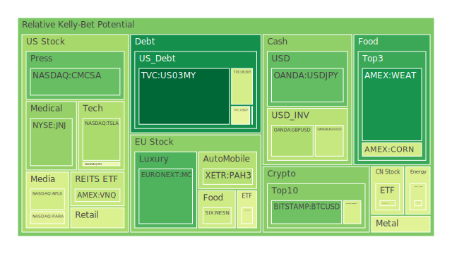
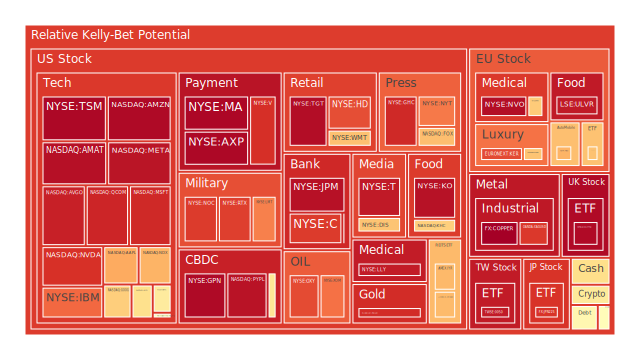
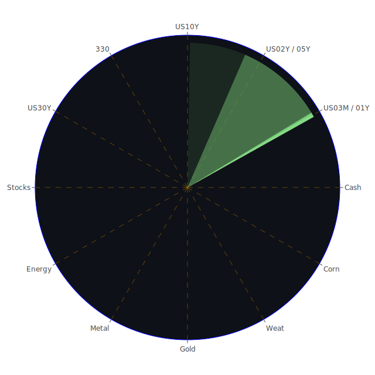

# 前言與「資訊航母表格」三位一體之概念

我們若從投資與市場行為的角度著手，往往著眼的面向並非單純只有價格漲跌或短期宏觀數據，而是同時融合地理位置、政治情勢、產業分布（空間性的Spatial視角）；歷史循環、新聞熱點、事件時間線（時間性的Temporal視角）；以及觀念與理論、群眾心理、博弈策略（概念性的Conceptional視角）。這三種視角互相輝映，可形塑出「市場—新聞—人性」的三位一體結構。接著，我們從正反合的思維來審視這三位一體：先看「正」，亦即在客觀的經濟學、社會學、心理學、博弈論架構下，一般認知或主流假設為何；再觀「反」，即從大膽假設與各種潛在的風險、對立面出發；最後得「合」，整合出彼此均衡下的結論。

在Spatial層面，我們可能看到各國之間政策與區域性衝突或協同，例如何處出口限制、關稅、地緣衝突以及對不同產業造成的供給鏈衝擊。Temporal層面，我們透過市場過去的歷史經驗與近期新聞的大量湧現進行比對，藉由回顧2000年網路泡沫、2008年金融海嘯、2020年疫情所帶來的市場震盪，捕捉可能重演的結構性危機或機遇。Conceptional層面，則結合經濟學對貨幣緊縮與擴張周期的理論，社會學對群眾心理的趨同與偏誤研究，心理學對過度投機與恐慌性拋售行為的剖析，博弈論對市場參與者多方角力的策略拆解，進而推出對市場未來之大膽假設。

接著，我們以「三位一體」的正反合形式匯總：  
- 正：全球化市場強調資金流動自由度、資訊透明度與制度化之成熟；  
- 反：貿易衝突、地緣政治事件與金融杠桿擴張可能在短期引發系統性風險；  
- 合：在高度連動的國際市場中，任何單一消息都可能透過心理與資金連鎖效應，在空間與時間上迅速擴散，投資人需考量對沖策略以分散風險。

在此背景之下，我們先逐一梳理各投資標的目前所顯示出的泡沫跡象，再探討宏觀、微觀、以及跨資產的傳導路徑，最後提出一個對應風險等級的投資建議方案。

---

# 投資商品泡沫分析

1. **美國國債**  
   當前聯準會的公開市場操作、RRP（逆回購機制）以及FED資產負債表規模，一直是影響美國國債殖利率的重要參考。據最新資料，長天期如30年期公債（30Y Yield約4.66%），10年期公債（10Y Yield約4.32%），1年期公債（1Y Yield約4.10%）等利率呈現相對平緩甚至出現稍微倒掛的跡象，亦顯示市場對短期政策走向的認知仍不明朗。  
   就泡沫分數（D1、D7、D14、D30）而言，若將其視為一種市場對風險的溫度計，最新數據顯示部分美國國債品項的風險分數介於0.35至0.56之間，暫無明顯極端泡沫，但也並不算太低，暗示利率波動性後續仍有可能擴大。新聞面上，近期談到「FED路徑仍高度不確定」，暗示未來利率決策仍存變數，也對國債市場供需產生牽引。

2. **美國零售股**  
   美國零售企業往往在利率上升循環中承壓，尤其與消費者可支配所得相關的景氣消長直接牽動零售股的多空。最新新聞顯示有大型零售商因關稅、勞動力成本上升而進行裁員或調整年度展望。根據本次顯示的數據，零售股的即時泡沫分數偏高的不多，但也有個別公司遭受負面新聞衝擊；再加上消費者信心指數若持續下滑，零售股或將面臨獲利壓力。

3. **美國科技股**  
   科技股在2020年疫情期間獲得顯著資金青睞，但近年來通膨與利率問題都讓市場對成長型企業的未來折現價值產生動搖。儘管最近有若干關於關稅和AI突破的利多消息，使部分美國科技巨頭股價連漲好幾日，但Bubble風險指標顯示，個別龍頭公司（例如AAPL、MSFT、NVDA、META）泡沫分數在0.70-0.95不等，顯示出高估值狀態依舊可能引發回調危機。一旦未來貨幣政策轉向更趨鷹派或全球供應鏈再度緊張，科技股存在明顯的修正風險。

4. **美國房地產指數**  
   美國房地產投資信託（REITs）或大盤房地產指數，在利率從低檔快速拉升後，估值面臨重估。目前房貸30年固定利率維持在6.67%左右，雖然較前一週或前一月些微回落，但整體還是相對高檔。房地產市場流動性減少，若後續就業或消費不振，房市下行壓力不容小覷。據泡沫指數觀察，有些房地產ETF已經呈現高於0.70的泡沫分數，敲響警鈴，建議投資者留意現金流與資金斷裂風險。

5. **加密貨幣**  
   比特幣與以太幣等加密資產，自從前年底的劇烈回調後又再度攀升，近來市場上不時傳出與關稅、金融機構裁員或全球宏觀衝擊的話題。短期內，BTCUSD、ETHUSD等價格已相當高，且泡沫指數在0.40-0.60之間徘徊，偶爾逼近0.46或更高，顯示投資者應警惕衝高回落的震盪。歷史上，加密市場常常在一波外部資金湧入或利好新聞下急漲，但若監管或其他利空再次出現，也可能重演如2021年末以後的巨大跌幅。

6. **金／銀／銅**  
   貴金屬與工業金屬在地緣政治衝突或通膨預期中往往扮演避險或景氣敏感資產的角色。黃金近期在3,000美元以上的高檔波動，泡沫指數維持在約0.45-0.48區間，尚未見到極端過熱，但若是市場劇烈動盪，黃金仍可能再度衝高。銀與銅則對工業需求更為敏感。銅價近期被市場稱作「有史以來最會反映全球景氣預期的金屬」，有分析指出一旦中國需求回溫，銅價可能再創新高。但也見到近期新聞顯示「中國鋼鐵與地產疲弱」，或會影響部分金屬需求。

7. **黃豆／小麥／玉米**  
   農產品期貨受天候、地緣政治、全球糧食政策等多重影響，也常在不同季節有明顯波動。根據數據顯示，小麥、玉米相關基金（例如WEAT, CORN）的泡沫分數從0.12-0.44之間不等，整體壓力並未到達極端。當然，一旦全球主要糧食出口國爆發衝突或大規模天災，這些價格可能走出獨立行情。新聞亦提及部分地緣緊張事件，如土耳其與俄羅斯在黑海糧食供應談判有雜音，都可能影響農產品後市。

8. **石油／鈾期貨**  
   石油價格因OPEC策略調整與經濟景氣起伏而波動。近期在68-70美元上下震盪，新聞面上也不斷提到各國對能源需求放緩或美國將加徵某些國家的石油關稅之可能。就泡沫指數而言，石油當前大約在0.44-0.68之間，屬於中等風險，尚無嚴重泡沫徵兆。至於鈾期貨在全球對核能使用的討論中慢慢受到關注，但市場規模較小、波動較大，投資人需特別留意流動性與政策轉折風險。

9. **各國外匯市場**  
   外匯市場是最直接反映各國經濟景氣與貨幣政策差異的領域。近期美元指數在維持相對強勢，但歐元、英鎊、澳幣等都有各自的波動因素。例如GBPUSD現在約1.29上下波動，AUDUSD則在0.63上下，若全球貿易進入新一輪衰退或者利差拉大，匯價亦將反映。新聞提到澳洲央行對中國的需求維持審慎樂觀，但澳幣風險指標仍達到0.40上下，值得留意。

10. **各國大盤指數**  
   以美股NASDAQ、標普500為代表的指數，以及歐洲的FCHI、GDAXI、FTSE等都呈現近期高檔震盪的狀況。根據數據，NASDAQ指數的泡沫分數不乏接近0.70-0.75以上者，顯示市場對成長股與科技股的高期待存有一定隱憂。歐洲部分則會受到能源成本、政治局勢、央行政策節奏而呈現較大幅度波動。若重大負面新聞（如地緣衝突升溫或歐洲銀行體系再次出現風險）爆發，歐洲大盤指數恐再度震盪。

11. **美國半導體股**  
   半導體龍頭在AI、雲端、車用電子需求驅動下，股價此兩年漲幅驚人，但其泡沫風險也較高。例如NVDA、AMD、KLAC、AMAT等，數據顯示其D1或D7泡沫分數普遍超過0.60甚至更高。若市場對AI的短期熱度放緩或供應鏈哪個環節出現瓶頸，半導體股可能面臨獲利了結。此外，也要注意美中科技競爭與管制所帶來的突發衝擊。

12. **美國銀行股**  
   2023～2024年間市場對銀行體系資本水準、壞帳準備、逆回購機制的平衡相當在意。新聞多次提及大行裁員或傳統零售銀行面臨成本上升。不少銀行股在疫情後股價表現反覆，特別是區域性銀行對利率與房地產貸款逾期問題的敏感度高。最新數據顯示個別美國銀行股泡沫指數在0.52～0.97不等，差異度大，投資者需區分大型系統重要性銀行與中小型區域銀行的結構風險。

13. **美國軍工股**  
   軍工產業往往與地緣政治情勢密切相關。近期新聞顯示多國對俄烏、美中衝突之態度還在動態演變，美國軍工股或許維持一定防禦性，不過若後續全球衝突降溫或國防預算縮水，也可能引發資金輪動。該類個股之泡沫分數頗高，有些公司接近0.88～0.89，意味著市場對軍工企業的預期仍偏樂觀，一旦政策轉向或和平談判看似有轉機，軍工股可能面臨賣壓。

14. **美國電子支付股**  
   隨著數位經濟規模擴大，電子支付公司龍頭的市占率也大幅攀升。然而，利率上升與區塊鏈支付技術的興起或許在長期對此領域有潛在衝擊。數據顯示部分大型電子支付股之泡沫指數接近0.83～0.90，足見投資者對該行業的前景存在「高度定價」的現象。新聞面提及消費者消費力走弱，或信用卡利率攀升下壞帳增加，長期對支付行業的營收衝擊仍需密切追蹤。

15. **美國藥商股**  
   防禦屬性的醫藥股通常在經濟衰退時期較能穩住，但若藥物專利到期、研發失利或遭逢巨額訴訟，也可能瞬間重挫。目前醫藥龍頭企業泡沫指數分布在0.63～0.82左右，尚算高位，但不同藥廠所處研發周期與產品組合差異甚大，需個別評估新聞風險。從歷史看，2008年金融危機時，不少大型藥廠股價相對抗跌，但也有因醜聞拖累股價的前車之鑑。

16. **美國影視股**  
   影視娛樂產業的股價波動常和經濟景氣、消費信心及串流平台競爭相關。部分影視龍頭泡沫指數攀升到0.45～0.90之間不等，顯示有些公司仍處於需求與資金追捧階段，也有公司受到裁員、合併或內容疲乏的衝擊。新聞面提到某些影視巨頭市值大縮水，或與整體消費市場不振有關。歷史上該領域常因「媒體環境」變動而出現結構性洗牌，投資需審慎。

17. **美國媒體股**  
   傳統媒體與新媒體的邊界越發模糊，各家公司在廣告收益、訂閱模式上互相競爭。近期新聞提到廣告市場疲弱，導致部分媒體公司獲利下滑；也有公司攀升至高估值，泡沫分數可達到0.79～0.93之間。一旦廣告市場劇烈波動或訂閱數字不及預期，媒體股行情容易翻轉。心理學層面，投資者容易對媒體品牌產生「熟悉度偏誤」，實際上仍需看財報支撐。

18. **石油防禦股**  
   石油防禦股即在能源領域中以穩定合約與全球化業務為主的公司，具有防禦性質。然而，在綠能轉型的浪潮下，市場對其未來資本支出與環境壓力頗為關注。部分油氣企業與軍工企業一樣，泡沫指數處於相對高檔0.65以上，暗示雖然業績暫時受惠油價或軍事供應，但中長期有可能因政策或輿論轉向承壓。

19. **金礦防禦股**  
   金礦相關企業往往受金價影響。若金價能持續在高位震盪，金礦股利潤則相對穩固。最新數據指出某些黃金礦業公司泡沫分數0.87～0.92，意味著市場對黃金前景仍給予頗高評價，也暗示潛在的溢價風險。若全球風險偏好突變、資金改流向他處或地緣衝突結束，金價下修時，金礦類股也容易面臨獲利回吐。

20. **歐洲奢侈品股**  
   歐洲奢侈品在中國消費回溫時經常大漲，但若地緣政治或者疫情壓力再起，其銷售及通路亦大受影響。近期新聞顯示中國與歐美互有關稅壓力，供需前景搖擺。某些歐洲奢侈品龍頭泡沫分數甚至來到0.75-0.80之間，預料若景氣確實轉弱，奢侈品消費或被壓縮，亦會造成估值修正。

21. **歐洲汽車股**  
   歐洲汽車產業深受能源轉型、電動車競爭與全球需求的波動衝擊。新聞提到德國和法國都在進行產業轉型，亦有負面消息顯示銷量成長停滯，導致部分汽車股爬升無力。就泡沫風險而言，指數多在0.45-0.53之間，並無特別高企，但需留意產業結構性改變的長期影響。

22. **歐美食品股**  
   生活必需品雖具防禦屬性，仍可能因原料價格震盪與消費支出模式轉變而影響獲利。新聞指出部分大型食品企業面臨成本與通路策略挑戰，泡沫分數多半在0.50-0.65之間，尚算適中。若發生全球糧食供應混亂，食品企業也存在漲價與銷售抵觸的風險。

---

# 宏觀經濟傳導路徑分析

從宏觀層面觀察，以Spatial角度，美國與中國之間的關稅與科技戰一旦升溫，供應鏈與物流成本就會上漲，波及全球主要消費市場。此外，地緣政治緊張（例如歐洲東部）更直接影響到能源、糧食等關鍵大宗商品的價格。Temporal角度，歷史上如1970年代的石油危機、2000年科網泡沫與2008年金融危機，都顯示當資金在某一領域過度集中並泡沫化時，一旦流動性趨緊，就有連環爆破的風險。Conceptional角度則說明了寬鬆貨幣政策與過度槓桿會促進風險資產的膨脹，但在社會心理學層面，投資人也往往因為「恐懼錯失」(FOMO) 而進場，強化了波動性。

通膨與利率的傳導是核心：聯準會若緊縮貨幣，資金面將收斂，科技、房地產、股票等資產易遭拋售；若形勢逆轉重啟寬鬆，市場流動性再度擴張，風險資產又可能報復性反彈。過往數十年見證了這種循環的多次重演，加上地緣政治與國際貿易環境不斷出現新變數，使得宏觀走勢更趨複雜。

---

# 微觀經濟傳導路徑分析

在企業與產業層級，利率與通膨上升推高成本、壓縮利潤，也改變企業融資策略。例如零售業、餐飲業更容易遭受消費萎縮之衝擊；科技業需較高研發預算，若融資成本升高，獲利空間將變動；金融業則要兼顧收益與壞帳比率。在心態面與心理學理論下，每個企業管理階層在投資或並購決策上，都會考慮市場氛圍（例如是否預測到全球景氣衰退）而提早縮減開支或避免擴張。當眾多企業同步採取保守態度，又會形成更大的總需求萎縮，反饋至失業率與消費端，構成經濟下行的自我強化循環，這在社會學觀點中視為「群體趨避風險」現象。若爆發利好消息則反向運作，人性中的樂觀和從眾心理也會很快帶動股市上揚。

---

# 資產類別間傳導路徑分析

1. **債市與股市**  
   債券收益率上升會對股市估值產生壓力，尤其高槓桿公司在短期內更容易面臨再融資難度，可能引發股市拋售。但若股市大幅回調，部分資金又會逆向流入債市，成為避險選擇。

2. **股市與商品市場**  
   能源、金屬、農產品等大宗商品價格上漲，一方面壓縮企業利潤，另一方面也可能驅使資金轉往大宗商品市場以期抗通膨。同時，若經濟衰退預期升高，大宗商品需求減少，也會反向打擊商品價格。

3. **加密貨幣與黃金**  
   在部分投資人心目中，比特幣等加密貨幣被視為「數位黃金」；然而，歷史證明加密市場的波動和金融槓桿普及度讓其更易受到流動性抽離的影響。若黃金攀高，代表避險需求轉強；加密貨幣則要看投資人是否願意承擔額外監管與波動風險，兩者之間有時會出現跷跷板效應，也可能同步走升，取決於投資心態與資金流向。

4. **房地產與消費金融**  
   房地產與消費金融領域因為房貸、信用卡循環利息與就業市場的緊密度，常在景氣循環中互相強化。一旦房地產走弱，銀行系統需要提高壞帳準備，進而收緊消費貸款標準，又讓消費支出進一步萎縮。

5. **軍工股與地緣政治**  
   軍工類股常因局部衝突或國際關係緊張而受惠，但若衝突降溫或國防預算重新分配，軍工產業也可能快速下滑。這些資金流轉常波及其他領域：當軍工股大漲時，風險資金流出傳統避險資產；反之亦然。

---

# 基於「資訊航母表格」之對沖機會與相關分析

先回到Spatial、Temporal、Conceptional三位一體：  
- **Spatial**：各市場都有獨立但也相互連動的新聞、政策與供需；  
- **Temporal**：從歷史與最近新聞比對可知，金融市場常反覆演繹類似劇情，如2000年科網熱潮、2008年雷曼風暴、2020年疫情後寬鬆等；  
- **Conceptional**：結合經濟、社會、心理與博弈，投資人多數時候會重複「趨利避害，然而往往反應過度」的模式。

我們若要尋找風險對沖的投資組合，理想情況是相關係數約-0.5、能在資金流動中盡量達到120度的相位差。以下列舉數種可能的對沖思維作為案例，並以正反合形式審視：  
- **美國科技股**（成長偏好） 與 **黃金或金礦股**（避險偏好）之搭配：在科技股漲時，金礦股可能走弱；反之，若市場避險情緒增長，金礦股有機會彌補科技股下跌造成的損失。  
- **加密貨幣** 與 **短期美國國債或貨幣市場工具**：加密資產一旦遇到監管或流動性萎縮，往往劇跌；短期美債或資金市場工具則在金融緊縮時反而受青睞。  
- **石油防禦股** 與 **歐美零售或食品股**：地緣衝突推高油價會侵蝕消費者可支配所得，壓低零售或食品股走勢，但若衝突解決、油價下行，零售與食品領域可能因成本下降、購買力回升而逆勢上揚，兩者成負向對沖。  
- **歐洲奢侈品股** 與 **農產品期貨**：奢侈品需求與高端消費成長趨勢呈正向，但若全球經濟衰退時，奢侈品容易大幅回調；農產品期貨則受基本民生需求支撐，與高端奢侈消費周期可能呈現相對低相關或負相關。  

此種組合方式，不一定完美對沖，但在回顧歷史案例與博弈論分析後，能使投資組合在市場高波動的時刻有較好的穩定度。

---

# 兩兩相互驗證的篩選假設分析與漣漪效應

將上述各種資產的對沖組合進行兩兩驗證，觀察其在不利情況下是否真能吸收波動，或是否本身同樣在極端時一同下跌。歷史上，2008年全球性金融危機爆發前，很多資產看似相關性不高，但在流動性不足時卻一同下挫，顯示關鍵是資金鏈緊縮。而從博弈論看，當大多數投資人擁有相同資訊並作出類似對沖組合時，市場會因對手方減少而造成對沖失效。這種「漣漪效應」可經由以下路徑擴散：  
- **流動性傳染**：一個資產若爆發急跌，投資人被迫拋售其他資產套現，導致其他資產價格跟著下跌。  
- **槓桿疊加**：高杠桿投資組合在短期內資金壓力突然放大，造成連鎖違約。  
- **心理層面群聚**：市場若一致轉向避險，原本被視為低相關或負相關的標的，也可能在短期內同漲同跌。

因此，我們必須在制定對沖與風險管理策略時，留意宏觀流動性與市場心理的同步跳水風險。最好能分析流動性來源、避險工具的保證金機制，以及非傳統資產在極端情況下的表現。例如黃金雖通常被當作避險資產，但在2008年初始階段也同樣下跌，因投資人急需現金而賣出黃金以彌補其他槓桿損失。

---

# 引用新聞與歷史相似場景的觀察

綜觀近期新聞：  
- 多起負面報導顯示大規模裁員、關稅衝突升溫、地緣政治（俄烏、以巴、蘇丹等），市場情緒消極居多。  
- 少數利多訊息（如AI突破、某些國家減稅或中國豪華消費回升）則推動特定板塊上漲。  
- 歷史上，與當前場景類似的有2000年科網熱潮時先正向狂飆，後因一連串企業財務問題及聯準會升息而顛覆市場熱度；也有2018～2019年美中貿易戰時關稅衝擊全球供應鏈，若再次加碼關稅，相關出口商與國家貨幣恐出現大幅波動。

在評估資產泡沫風險時，除了指標量化，更需要看動態發展。譬如，若FED真的重新強力升息，或多國通脹再度失控，投資風向就會在極短時間內轉變。歷史教訓讓我們知道，往往在市場情緒最樂觀時，也是泡沫最脆弱之際。

---

# 專業論述與投資建議

正因如此，面對當前市場，需要下列層次的投資建議：

1. **穩健型配置**（占比約40%）  
   - **短期美國國債** 或 **優質企業債**：在利率稍高的環境下，短期公債收益具吸引力，也有較低利率風險。  
   - **黃金**：當前金價略處高檔，但在全球性不確定情勢中，金市仍有一定防禦功能。可視資金規模做適度配置，避免過度集中。  
   - **高股息防禦股**（如部分食品、消費必需品類）：雖泡沫分數並不算低，但在深度衰退情況下跌幅相對有限，且有股息收益作為支撐。

2. **成長型配置**（占比約40%）  
   - **美國科技龍頭**：在AI、雲端與5G等趨勢下仍有成長潛力，但其泡沫指數已較高，要分散於多家龍頭；若出現獲利了結跡象則需嚴控風險。  
   - **歐洲奢侈品或新興市場消費股**：若中國與其他新興市場消費力回溫，奢侈品增長仍可期。然而，一旦地緣衝突或全球性衰退加深，需準備停利機制。  
   - **半導體設備或關鍵零組件**：長期看，車用、自動化、AI計算需求不減，但同時注意該領域估值高企。依照現金流與研發管線做區分。

3. **高風險型配置**（占比約20%）  
   - **加密貨幣**：在風險偏好環境中或許有翻倍機會，但監管及波動風險亦大，可將其視為高風險投資中的一部分。  
   - **軍工股或石油防禦股**：地緣政治若升溫或衝突加劇，該類公司短期受惠；但一旦和談或外交解決機制加速，也可能使漲勢熄火。  
   - **新興市場高收益債**：利率高、波動高，如阿根廷、土耳其等國家債券，利潤空間大，但需承受匯率與政治不穩等風險。

---

# 風險提示

1. **泡沫風險**：  
   報告中反覆強調，無論是科技龍頭、加密貨幣或軍工、房地產等類別，都存在不同層次的高泡沫指數警訊。一旦市場對該領域的前景過度樂觀，稍有風吹草動可能引發劇烈拋售。

2. **政策與地緣衝突風險**：  
   新聞多次揭示關稅戰、局部地區的軍事衝突升溫。一旦重大政治事件惡化，也會造成市場流動性驟降與資產聯動拋售。

3. **流動性壓力與槓桿**：  
   許多機構或散戶可能透過信用交易與槓桿放大報酬，但市場逆轉時也放大損失。歷史教訓證明在流動性急凍時，多重資產會同時下跌，對沖失效。

4. **經濟衰退機率**：  
   雖然短期內部分經濟數據看似穩定，然而消費信心與企業投資意願若遭遇重大打擊，衰退風險仍然存在。

5. **市場不確定性**：  
   隨著AI議題發燒、ESG潮流、央行政策變化，市場可能在短期內經常顛倒翻轉，投資者需隨時保持警惕並做好紀律性的風控。

---

# 結論與總結

綜觀上述分析，投資環境正處於極度複雜的階段：地緣政治持續動盪、各國央行對通脹反覆摸索、金融機構在縮減規模或裁員的消息不斷湧現，消費者信心也呈現反覆上升與下降。透過Spatial、Temporal、Conceptional三位一體的整合，以及正反合的精煉，可以歸納出以下重點：  
- **全球資金流動仍充斥不確定性**，但各地區或產業不乏結構性機會；  
- **新聞事件的傳導速度加快**，一則重大消息往往同時衝擊多個市場，或透過心理與博弈機制在市場間產生漣漪效應；  
- **對沖與分散投資**應該在市場情勢良好時就佈局，而非市場動盪時臨時抱佛腳；  
- **歷史經驗與理論**顯示泡沫終將破裂，但時間難以捉摸，投資者應謹防樂觀與悲觀的極端擴大化；  
- **穩健、成長、高風險**三類配置的比例需因人而異，但整體宜控制在理性範圍內，並設定止損與停利機制。

最終，無論是對美國國債、科技股或加密貨幣等標的，都應以冷靜、客觀、不帶偏見的方式評估其風險與報酬特性。投資市場上的各種曲折與漣漪，只是自然現象的一部分：人性的貪婪與恐懼交織其中，使得資本流動如同浪潮般反覆。在日益趨於全球化且資訊爆炸的時代，唯有持續跟蹤宏觀、微觀、心理與博弈層面的資訊，同時透過多元對沖組合與紀律化的風控，方能在市場起伏中穩健前行。

---

# 風險提示

投資有風險，市場總是充滿不確定性。以上內容僅供參考，投資者應根據自身的風險承受能力與投資目標，做出獨立決策。同時不可忽視任何潛在泡沫風險或金融危機預兆，寧可提早做好分散與對沖策略，而非寄望市場永遠只漲不跌。在當前全球政治與經濟變局之下，只有充分理解市場、保持審慎與靈活應變，才能在繁複多變的環境中立於不敗之地。

 
Daily Buy Map:

 
Daily Sell Map:

 
Daily Radar Chart:

 
