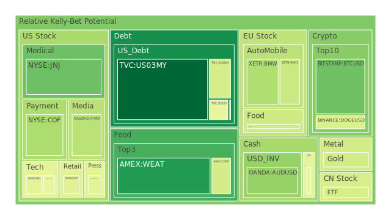
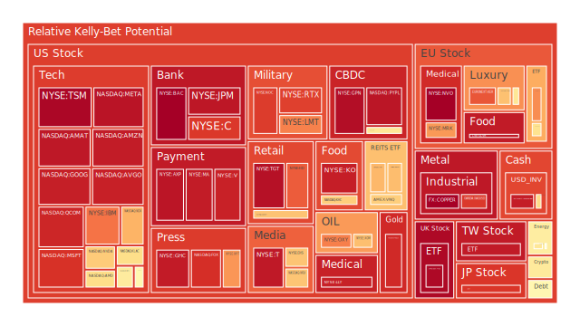
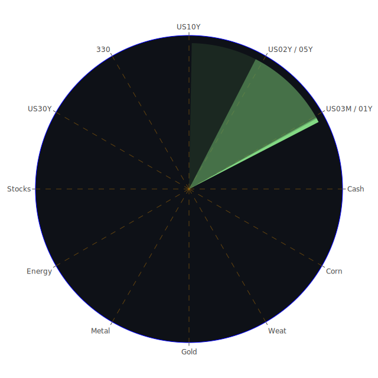

# 一、三位一體的框架與市場觀察

在面對當前大量資金流動、全球地緣政治波動與迅速迭代的科技創新時，從「空間（Spatial）」、「時間（Temporal）」、「概念（Conceptional）」三個層次出發，能夠幫助我們理解市場與新聞之間的互動如何形塑資產價格。亦即「Spatial」包含全球各地市場的佈局與彼此之間的資金流向、「Temporal」聚焦於短期到長期的時間維度如何對資產造成漣漪式的衝擊、「Conceptional」則著眼於投資者的心理預期、集體社會情緒與政策制定背後的深層動機。這三者之間可視為正、反、合的不斷交互循環，形塑了資產泡沫風險的生成、累積與釋放。

## （一）Spatial：市場與新聞三位一體的觀點

1. **市場空間多元化與資金流分散：**  
   現今資金的跨國流動性極高。當新聞所傳遞之訊息顯示某地區的政策或經濟利好時，往往會吸引短期熱錢湧入。例如近期在中國大陸與美國之間的互動訊息裡，傳出「關稅或有鬆動」的正面言論時，科技類股及部分國際零售股就可能同時受到正面推動；但一旦出現「再度加徵關稅」等負面新聞，則會立刻引發市場空間上的流動再平衡。這一點與新聞標的互相關聯，如「特朗普（Trump）考慮對汽車進口課徵25%關稅」就會在全球範圍內牽動汽車股、工業金屬及能源市場。  
2. **區域政治風險所帶來的恐慌或機會：**  
   新聞中若提及中東、歐洲或是朝鮮半島局勢緊張，都可能驅使部分資金轉而流向黃金、國債等傳統避險工具。也有些新聞，如「歐洲對奢侈品進行新的稅務審查」或「德國移民政策爭議」，往往會影響歐洲奢侈品股或歐洲汽車股的市場評價。  
3. **多國政策共振下的空間博弈：**  
   中國的基礎建設與歐美的關稅政策、美國聯準會（FED）操作利率、各國央行量化寬鬆或緊縮政策，都在空間層次同時發生，互相角力。這些新聞事件能透過市場流動與訊息擴散的機制，讓投資者在全球不同市場空間裡同時調度資金。

根據「空間」維度的正、反、合簡要歸納：  
- **正：** 政策利多與地緣衝突降溫，短期資金流入具體區域；  
- **反：** 關稅、地緣政治升溫、新興市場資金外流；  
- **合：** 資金在全球不同地區尋求分散投資，以避險或捕捉成長。

## （二）Temporal：市場與新聞三位一體的觀點

1. **短期（D1至數週）的新聞衝擊：**  
   從近期新聞來看，隨著「新一輪對中國進口產品徵收關稅」的消息，以及「汽車關稅25%」的調升，多數市場情緒急轉直下。短期內波動加劇，尤其科技股（如Nvidia、Palantir等）在一天之內可能急跌5%到10%不等。新聞中對「特斯拉中國市場前景」既有正面也有負面信號，一旦出現「進一步減稅」或「再度加稅」，都能瞬間改變投資氣氛。  
2. **中期（數個月至一年）的政策與利率走向：**  
   聯準會在過去一年裡曾屢次釋放鷹派訊息，但近來又出現少數鴿派聲音，雖然整體基調依舊偏向限制性操作。同時，房地產利率在一年內波動相當劇烈，例如30年期房貸利率一度從3.18%飆升至6.89%，又略微回落到6.67%，顯示中期政策對房地產市場的壓力並未解除。  
3. **長期（數年）的結構變遷：**  
   新能源、電動車、半導體等領域長期看好，卻也因為地緣政治或關稅爭議而產生結構性分歧。有些新聞提到「亞洲新科技崛起」或「未來資本將更多來自新興市場」，這些因素在三到五年的長期架構裡可能產生明顯的產業遷移效應。歷史上也曾見過類似情形，如2000年網路泡沫與2008年金融海嘯之後，投資資金重新配置到更具潛力的新產業。  

根據「時間」維度的正、反、合簡要歸納：  
- **正：** 短期可能有政策或業績利好使股市或商品價格走揚；  
- **反：** 中長期利率持續高位，資產估值面臨收縮風險；  
- **合：** 短線漲跌最終要回歸經濟基本面與結構改革趨勢。

## （三）Conceptional：市場與新聞三位一體的觀點

1. **經濟學：**  
   從供給需求面的觀點，汽車、高科技產品或奢侈品受關稅沖擊；而原物料（石油、鈾、金屬）則因地緣政治或減產協議擁有價格彈性。若新聞顯示「主要生產國持續減產或遭遇政治危機」，市場會反映在報價上。  
2. **社會學：**  
   大眾情緒與社群網路輿論會放大新聞效應。假使新聞中不斷報導「對某產業祭出關稅」或「某地發生戰爭」，群眾容易出現恐慌拋售行為，或反向追逐短期題材而進入過度炒作局面。  
3. **心理學與博弈論：**  
   投資者往往受「錨定效應」影響，對某些龍頭股曾經到達的高價位產生心理依戀；一旦新聞出現負面衝擊，雖然數據已顯示風險激增，人們依舊抱著「應該會反彈」的僥倖心理。一旦真正出現向下雪崩，市場大多因「理性預期互動失靈」而釀成踩踏。  

根據「概念」維度的正、反、合簡要歸納：  
- **正：** 新聞帶來的題材與樂觀情緒，促成買盤湧入；  
- **反：** 過度沉迷於歷史高點或言語承諾，無視基本風險；  
- **合：** 投資者思維最終在理性與群體心理博弈之間，得尋找穩定配置。

---

# 二、投資商品泡沫分析

以下將就不同資產類別進行客觀分析，並引用最近新聞事件與歷史類比，觀察其可能的泡沫風險。由於近期泡沫分數普遍出現上揚跡象，且部分資產接近高風險區域，務必要警惕。

## （1）美國國債
美國國債向來是全球資金避險與定價的基準。近期聯準會操作及市場對未來經濟衰退風險的預期，使得1年期至30年期殖利率走勢出現顯著波動。新聞顯示「新關稅政策」以及「美國政壇對舉債上限的爭議」持續干擾市場，短線收益率曲線可能時而倒掛、時而修正。歷史上，2008年金融海嘯與2000年科網泡沫破裂時期，都曾出現利率劇烈震盪與國債價格逆勢大漲的狀況。若再現大規模避險行情，國債價格依舊具上漲空間。但需留意當前美國國債總體發行規模非常龐大，若市場擔憂違約風險或對利率還有更高的調整期待，長端殖利率就有進一步上行的可能，對國債價格形成壓力。

## （2）美國零售股
美國零售股近來因「關稅」及「消費者需求疲弱」的擔憂而波動劇烈。新聞中可見到「通路、物流系統遭遇成本上升」，或「大型連鎖零售業者考慮調整進貨策略」。同時，部分正面訊號如「大型零售商加強電商布局」也存在，例如某些報導指出，一些零售商投入APP開發與物流自動化，以拉抬獲利空間。然而，高通膨、利率偏高的環境下，歷史上 1970年代的高通膨曾重創零售消費支出，使許多實體零售商關店潮；雖再經轉型，也須一段時間才能復甦。短期內高泡沫風險不顯著，但需警惕業績能否持續支撐估值。

## （3）美國科技股
在近期新聞裡，科技股成了漲跌幅度最大的指標。像Nvidia、AMD、Meta等公司因人工智慧、雲端運算、新款晶片需求被熱炒；不過也有報導顯示「中國的環保要求或新關稅將打擊部分半導體供應鏈」。此外，「特斯拉與其他電動車」也受地緣政治與補貼政策影響而波動頗大。歷史上2000年網路泡沫破裂即是科技股狂飆後的崩盤先例，明示若估值太高而基本面無法支撐，可能引爆泡沫風險。新聞同時指出部分公司考慮發行新股籌資或進行大額併購，這也容易在市場亢奮時刻引發過度槓桿的隱憂。

## （4）美國房地產指數
2022到2025年之間，美國房地產跟隨利率波動產生多次起伏。30年固定房貸利率一度飆升至近7%，根據歷史經驗，利率飆高往往壓抑房價漲勢，但疫情期間又有超額資金投入住房市場。新聞亦顯示部分地區的屋主在趁利率稍降之際加快拋售。聯想到2008年次貸危機時，大量房屋被銀行止贖後擠壓市場供給，使房地產價格大跌。當前雖無全面性的「高風險次級貸款泡沫」，但若失業率回升或經濟衰退，可能重擊房地產需求，引發跌勢。

## （5）加密貨幣
比特幣（BTCUSD）曾衝破八萬七千美元的整數大關，顯示資本仍對加密市場保有熱情。然而市場也開始關注嚴格監管、美國證券交易委員會對加密交易所的追查。新聞裡提到「支付平台或科技巨頭嘗試整合區塊鏈」，帶來正面效益；但亦有「交易所或礦商破產」的負面新聞。歷史上，幣圈的高風險波動如2017年底狂飆與2018年初腰斬，都是前車之鑑。目前泡沫風險指標顯示加密貨幣仍處於高波動區域，建議投資者謹慎面對。

## （6）金 / 銀 / 銅
新聞資料顯示近期貴金屬與工業金屬也受到地緣與經濟周期動盪的影響。黃金常扮演避險標的，而銀與銅除部分避險需求外，也扮演工業用途角色。若新聞顯示「地緣衝突加深」或「經濟衰退疑慮上升」，黃金需求往往上揚；銀與銅則取決於工業生產狀況。歷史上，例如2003年伊拉克戰爭前後與2011年歐債危機，高恐慌時期金價常攀升。但若整體全球經濟恢復動能強，銅需求也會隨之增加。近期新聞提到「部份中資鋼鐵、金屬供應鏈或受地產低迷打擊」，暗示銅需求不振，價格可能持續震盪。

## （7）黃豆 / 小麥 / 玉米
根據新聞，全球農產品價格易受氣候、地緣政治與關稅政策影響。假使某國為了保護本土農業而增收關稅，或極端天氣導致欠收，小麥、黃豆、玉米等期貨價格會急漲。回溯歷史可見，2010年俄羅斯大旱曾引發小麥期貨飆漲。近期新聞中關於「氣候變遷引起極端天候事件更頻繁」的討論，搭配「新興市場擴大農地開發」和「生質燃料原料需求上升」，都可能讓此類谷物進入擾動期。需要留心短線價格飆升可能引發泡沫，而後因產量釋放或需求衰退而回落。

## （8）石油 / 鈾期貨(UX!)
油價近來受「地緣紛爭」與「主要產油國減產或制裁」影響而大幅波動。新聞提及「頁岩油業者對新關稅及特朗普政策不滿」、「中東地區不確定性」，都對油市產生衝擊。另一方面，核能重新受到部分國家青睞，鈾期貨交易熱度升溫。歷史上，一旦國際政治動盪加劇，石油價格飆漲；同時若對核能需求上揚，鈾期貨也可能出現短線炒作情況。需注意的是，鈾市場流動性相對較低，易出現劇烈波幅，投資時切勿忽視潛在風險。

## （9）各國外匯市場
新聞數據顯示，歐元、英鎊、日圓及澳元等在近期對美元波動皆不小。特別是在「美聯儲是否會暫停升息」與「關稅戰帶來的跨境貿易衝擊」持續交雜下，外匯市場容易出現短期集中買賣美元的情況。歷史經驗顯示，若一國基本面轉差，資金會快速逃離而推跌該貨幣。對避險需求而言，美元、黃金與部分瑞士法郎等也會出現交替性上漲。由於報告中顯示目前美國利率仍在較高水準，短期或吸引資金回流美元，但需留意未來若美國經濟轉弱，美元也可能轉而下跌。

## （10）各國大盤指數
全球主要大盤指數，如美國的S&P 500、NASDAQ綜合、歐洲的FCHI、德國指數等，在新聞反覆報導「關稅加劇、地緣衝突」時容易出現短期跳水。但另一方面，若市場又聽到「政府出手救市、關稅放寬、AI概念進一步突破」等正面訊號，指數便可能迅速反彈。這種急漲急跌在歷史上並不罕見，如2018年底對中美貿易戰的恐慌，2020年疫情初期的暴跌，之後又出現前所未見的快速拉升。高震盪顯示投資人更容易陷入追高殺低的陷阱。

## （11）美國半導體股
半導體板塊近期因「AI需求」及「自動駕駛晶片競爭」而炙手可熱。歷史上的半導體景氣循環約3至5年，當需求旺盛又產能尚未完全擴張時，價格和股價皆有強力表現。然而當產能提升、需求增速放緩，容易進入大幅修正。新聞也顯示「美國對某些半導體出口限制」的動向，若和關稅疊加，恐打擊整個供應鏈，進而引爆供應鏈去全球化的壓力。

## （12）美國銀行股
近期數據顯示美國銀行股泡沫風險中等偏高：利率雖高，但若經濟下行或商業地產風險上升，銀行資產品質下滑時就會引發股價重挫。新聞中「一旦企業信用違約率攀升」、「對衍生性金融商品的爆雷疑慮提升」，都能引發市場擔憂。歷史如2008年金融海嘯，就是因銀行槓桿與不良資產爆發導致股價潰堤的教訓。投資銀行股時務必看資本充足率與放貸品質。

## （13）美國軍工股
軍工產業在地緣政治緊張或國防預算上揚時往往受益，這在歷史屢見不鮮。新聞提到「國防預算逐步提升」或「某地區衝突升溫」，對軍工企業常有刺激效果，股價也隨之拉升。不過若世界局勢驟然趨緩，或政府調整預算方向，該板塊也可能快速降溫。整體看來，目前軍工股仍處在中高估值區，若有重大軍購削減，勢必顯現風險。

## （14）美國電子支付股
近年來電子支付與金融科技板塊備受矚目，包括信用卡公司、行動支付平台等。新聞中有「電子支付對跨境交易的營收擴張」與「加密支付整合」等利好，同時也有「監管機構擴大監管範圍、資安疑慮升高」的負面因素。歷史證明，電子支付崛起確實改變了消費習慣，但若估值過高或市場競爭激烈，部分業者獲利成長放緩之際，股價也會被修正。

## （15）美國藥商股
醫藥產業在人口老化、醫療需求擴增等背景下有長期發展空間。新聞若提到「新藥研發成功、FDA核准新品」則股價可飆升；反之，如「藥價管制、FDA否決關鍵藥物」或爆出「臨床試驗失敗」，都會造成股價重創。2000年之後，生技與藥品企業曾在資金浪潮下被捧得過高，最後也因研發失利面臨泡沫破裂風險。當前市場對藥商股仍相對友善，但須留意估值位置。

## （16）美國影視股
隨著串流平台盛行，傳統影視產業面臨轉型。新聞裡若報導「大型影視公司推出新串流服務」或「明星IP帶動娛樂市場」，短期內常吸引投資人關注；但同時也有「訂閱戶增長放緩」與「廣告收入下滑」的負面新聞。疫情期間串流曾一度爆發式成長，但經過幾年後消費者對平台的選擇逐漸分散，競爭加劇。若估值與成長潛力脫節，亦存在泡沫風險。

## （17）美國媒體股
媒體產業近年經歷廣告市場波動、新聞付費模式轉變等挑戰。有新聞指出「社群媒體與短影音平台搶走傳統廣告份額」，也有報導提到「某些舊媒體積極轉型數位版面並獲訂閱成長」。歷史上，紙本媒體與傳統電視台在網路崛起後受到衝擊，而經過多輪併購與整合，仍有機會生存，但市場不再給予早期那種高估值的想像空間。投資此類股需留意盈餘來源與營收是否穩定。

## （18）石油防禦股
有些能源與石油企業被視為「防禦型」標的，原因在於其產品需求難以在短期內被完全替代，而且地緣政治衝突時常推升油價。新聞若報導「OPEC進行進一步減產」，這些企業也可能受益。但長期轉型壓力仍在，因為綠能浪潮與碳排放限制愈趨嚴格，若該公司未能有效轉型，未來可能面臨市佔與資本市場評價下滑的風險。高油價也會鼓勵其他替代能源的發展，因此該類股雖具防禦性，泡沫風險相對中等，但不可忽視可能的評價修正。

## （19）金礦防禦股
與石油防禦股類似，金礦股在避險情緒高漲時，股價往往受到資金追捧。歷史上，只要地緣政治或金融危機發生，金價和金礦公司的收益同步攀升。然而若金價回落，金礦股的獲利與股價也會同步下修。對於金礦企業，生產成本、礦區品位等因素也非常關鍵，一旦被市場認為礦藏有限或新礦區開發乏力，估值就難以維持在高位。

## （20）歐洲奢侈品股
歐洲奢侈品集團常被視為頂尖品牌掌握者，且與新興市場消費需求高度連動。新聞若報導「中國或中東高端消費強勁」常帶動這些公司股價；反之，若出現重大地緣衝突或全球經濟轉弱，奢侈品需求可能迅速萎縮。歷史可參照2008年金融海嘯後，歐洲奢侈品出現一波大回調，之後又在新興市場崛起的帶動下反彈。近期關稅與全球旅行限制會是變數之一。

## （21）歐洲汽車股
歐洲汽車產業擁有豐富歷史，但面對電動車轉型時，壓力與機會並存。新聞見「對電動車零組件設限」或「德國、法國對產業補貼鬆動」，都會影響此板塊。歷史上，汽車產業屬於典型景氣循環股，當需求高峰過後，往往面臨庫存和價格的調整。近期「對汽車徵收25%關稅」的消息，將對歐洲車廠在北美市場的銷售產生負面影響。泡沫風險不算極高，但仍須注意市場情緒急轉時的評價大幅壓縮。

## （22）歐美食品股
食品產業穩定性頗高，被認為具防禦性質。然而新聞中若提到「歐盟新規定限制某些食品添加物」或「食品原料成本大幅上升」，亦會壓縮利潤。歷史可以參考1970年代的糧食危機時期，大型食品企業雖然需求依然，但原料價格飆漲侵蝕利潤空間。當前高通膨背景下，歐美食品公司雖能部分轉嫁給消費者，但仍須關注進一步的成本波動或關稅風險。

---

# 三、宏觀經濟傳導路徑分析

在宏觀層面，利率、就業、政府預算與地緣政治等因素交織成了資金的「大洋流」。近期新聞中，有關「美國再度對汽車進口課徵關稅」、「聯準會鷹派發言卻又帶有鴿派可能的模糊訊號」等，讓企業與投資人都出現不確定性，傾向囤積現金或尋找短期避險標的。銀行若收緊貸款標準，對地產、製造業與中小企業形成壓力，進一步減少整體經濟活動。在全球化背景下，美國對外資本或商品需求的變動，也會同時衝擊亞洲與歐洲的出口企業。再考量歷史，如1997年亞洲金融風暴由泰國開始波及週邊國家、2008年美國次貸引爆全球流動性危機，皆是宏觀層次的傳導過程。如今「債務規模」與「地緣政治」的風險均比往昔更複雜，務必警惕。

---

# 四、微觀經濟傳導路徑分析

在企業與消費者層面，新聞報導的衝擊往往更具直接性。若美國政府真的大幅調高汽車進口關稅，歐洲與日本車廠在美的銷售量會立即受到壓力。進而影響零組件工廠、鋼鐵需求等，這種漣漪效應會傳導至各供應鏈環節。此外，一旦消費者對經濟前景的信心下降，儲蓄率提升、信貸需求減少，銀行獲利減少而放貸更謹慎，最終繞回金融市場，壓抑整體投資意願。從歷史來看，1970年代與1980年代的多次石油危機，都造成企業成本快速推升、消費意願下滑，促使失業率攀升，最後在經濟縮減的路徑上惡性循環。

---

# 五、資產類別間傳導路徑分析

不同資產之間往往存在正、負相關性。以美國科技股與黃金為例，常在股市樂觀時資金轉向成長型標的，當市場陷入恐慌時又湧入黃金避險；此外，美元指數走強往往壓抑金價，但若市場對美元及美國國債本身失去信心，金價與比特幣就可能同步走強。觀察新聞可知：「鷹派升息→美元升值→新興市場資金外流→大宗商品價格波動→全球風險資產評價調整」這樣的鏈條經常上演。若再摻入地緣政治，如「中東衝突」或「美中貿易摩擦」，石油與工業金屬的報價與全球股市震盪更甚。投資人不妨思考：在資產之間如何建立組合使相關性壓低？尤其當前對沖需求强烈，不同資產的相位盡量要達到120度左右、相關係數約-0.5，以避免單一風險擴散。

---

# 六、投資建議

以下依穩健、成長與高風險三大類，嘗試為投資人提供一個合理的配置範例（僅作概念參考，比例總和為100%），並各自選取三個子投資項目。此處強調：市場充滿不確定性，務必考量個人財務狀況與風險偏好。

1. **穩健型（50%）**  
   - **美國國債（20%）**：長期評價仍具備避險功能。儘管殖利率可能再度波動，但在金融市場動盪時，可成為安全港。  
   - **金礦防禦股或黃金現貨（15%）**：歷史上多次危機皆證明，金與相關開採業在避險情緒升溫時能提供一定支撐。  
   - **歐美食品股（15%）**：日常消費需求相對穩定，遇到利率環境衝擊時，該類股依舊擁有抗波動性。

2. **成長型（30%）**  
   - **美國科技股（10%）**：關注有實質成長面與AI、雲端、半導體相關的龍頭，但需警惕泡沫風險提高。  
   - **美國醫藥或生技（10%）**：醫療需求長期存在，新藥突破可帶來亮眼報酬，不過研發失敗也會重創股價。  
   - **美國零售或電商（10%）**：雖然有通膨與關稅的壓力，但若布局到積極轉型、擁有電商優勢的企業，仍具潛在回報。

3. **高風險（20%）**  
   - **加密貨幣（7%）**：對高波動容忍度夠的投資人，可視市場情緒入場，但須嚴控倉位，留意監管與流動性風險。  
   - **石油/鈾期貨（7%）**：在地緣政治或能源政策轉折時可能大漲，但上下震盪極大，需要高度風控。  
   - **美國小型銀行或金融創新股（6%）**：一旦金融業在升息尾聲或新監管浪潮裡突出重圍，股價可能反彈猛烈，但若經濟惡化也首當其衝。

此種配置的核心理念在於分散不同風險屬性並嘗試壓低彼此之間的正相關，以對沖特定市場大幅波動。同時應時刻觀察新聞與基本面數據，適度調整持倉。

---

# 七、對沖組合與相位關係的潛在機會

為了追求在變動市場中的相對穩定，有些投資人希望各資產間的相關係數約為-0.5，代表當某些標的上漲時，另一些標的自然產生對沖效果。下列為幾個假設性傳導路徑：

1. **黃金 vs. 美國科技股**：在市場熱絡時，科技股漲幅往往優於黃金；市場若遇黑天鵝或衰退風險上揚，黃金可適度彌補股票組合虧損。  
2. **美國國債 vs. 石油期貨**：地緣紛爭推升油價，但若經濟見衰退跡象，資金又湧入國債。當兩者同時走強或走弱的機會不大，故可能達到分散效果。  
3. **加密貨幣 vs. 美元現金或其他貨幣部位**：在貨幣寬鬆時，加密資產較易飆漲；若市場流動性收緊，資金回流美元，兩者呈現一定反向。  
4. **美國半導體股 vs. 歐洲汽車股**：若關稅政策針對汽車而非科技，半導體股可能逆勢獲利；反之，若AI需求趨緩而汽車電動化持續，汽車股可能表現出色。  

上述僅屬假設性路徑，投資人仍需檢驗彼此的估值、流動性與風險因子，並對「相關性並非恆定」保持警覺。

---

# 八、兩兩相互驗證的篩選假設與漣漪效應

針對前述空間、時間、概念三位一體所形成的各種投資假設，我們需進一步篩選。舉例：

- 若「美國對汽車加徵高額關稅」的新聞屬實，歐洲汽車股短期肯定承壓，而美國本土車廠若沒得到預期補貼，也可能難以擴大市佔率，最終傷及整個汽車供應鏈。此時，我們可驗證「石油需求是否因此減少」→「油價是否短跌而後在其他地緣衝突下回漲」。  
- 若「聯準會未來繼續鷹派操作，利率高企」同時「房貸利率再度升至7%以上」，可想見房地產需求再度萎縮，相關ETF或房地產指數走跌。但銀行收取更高利息是否等同於淨息差擴大？不一定，因貸款違約率可能同步上揚，導致銀行股與商業地產開發商皆受衝擊。  
- 加密貨幣若出現重大監管訊號或大型交易所爆雷，則資金可能快步撤離該市場，湧向黃金或美國國債；假使隨後又有大企業宣佈採用區塊鏈支付，再次引發新一輪炒作，形成反覆的漣漪模式。

在此「正（預期利多）」、「反（潛在利空）」、「合（折衷或衝擊後穩定）」的路徑推演裡，能確保最終形成的投資組合兼具一定彈性與對沖效果。

---

# 九、總結與投資建議

歸納而言，目前市場處於高不確定性的交錯點：  
1. 利率前景尚未明朗，FED雖有鷹派言論，但經濟數據若持續疲弱，未來也可能轉向緩和。  
2. 關稅與地緣政治在新聞裡此起彼落，對汽車、科技、農產品、能源等關鍵產業產生即刻衝擊。  
3. 投資人心理往往在「追逐熱門題材」與「擔憂泡沫風險」之間擺盪。歷史與理論顯示，過度槓桿及忽視風險的行為容易導致泡沫爆破。

建議投資人：  
- **分散佈局**：利用美國國債、貴金屬、部分防禦型產業作為核心，搭配一定比重的成長或高風險標的。  
- **定期檢視**：泡沫風險評估非一成不變，尤其在現今新聞導向強烈、政策瞬息萬變的時代。  
- **控制槓桿**：在高波動市場中，槓桿資金易釀踩踏風險。回顧歷史多次危機，往往皆是高槓桿部位急速被迫平倉導致流動性中斷。

---

# 十、風險提示

投資有風險，市場總是充滿不確定性。本報告根據多方資料與新聞觀察進行分析，僅提供參考。任何投資決策皆應基於自身財務狀況、風險承受能力及投資目標而作獨立判斷。眼下泡沫分數偏高的資產尤其要謹慎面對，如加密貨幣、部分高估值科技股以及受地緣政治衝擊的板塊，都隨時可能因新聞或政策變動出現劇烈波動。在歷史上，任何一次資產熱潮都可能演變成泡沫破滅，因此切勿懷抱僥倖心理，務必要做好風控與資金管理。此外，地緣紛爭可能帶來能源與糧食價格劇烈震盪，全球供應鏈也未必穩定。唯有審慎關注各種訊號，做好多元配置，才能在瞬息萬變的市場中維持相對穩健與靈活的投資策略。

 
Daily Buy Map:

 
Daily Sell Map:

 
Daily Radar Chart:

 
