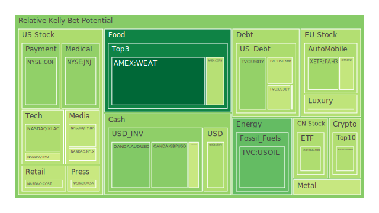
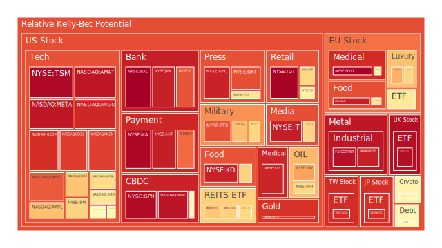
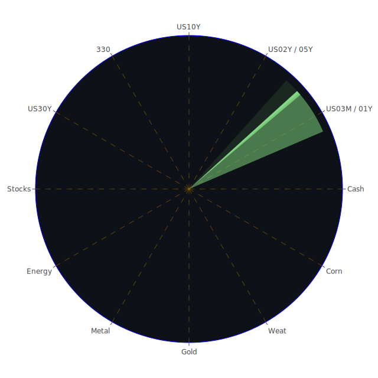

# 一、總論：三位一體的整合思維

在分析投資市場的同時，我們可以從「空間（Spatial）」、「時間（Temporal）」、「觀念（Conceptional）」這三個角度來思考。這三位一體的架構，對應到投資市場與新聞事件也能找到類似的「正－反－合」流程，透過正面與反面假設、觀察、推敲，最後取得較符合實際世界運作的折衷平衡點。

1. **空間（Spatial）**：著眼於全球多重市場（美國、歐洲、亞洲、新興市場等）之間的相互競合；在新聞事件上，也關注到地緣政治、區域經濟整合或對立等等。此面向強調市場之間在同一時間的互動，如美國公債收益率變化會透過資金流影響到歐洲市場，再輻射到亞洲市場，然後反饋至國內投資人對各類資產的配置思考。

2. **時間（Temporal）**：著眼於歷史週期、短期波動與長期走勢；同時也包含對未來預期的博弈操作。例如，各大央行貨幣政策和利率走向在不同階段會影響投資心態與市場定價，而新聞事件的爆發與延續（從導火線到結局）往往也有一個時間脈絡。這就像同一個事件，短線上常造成市場震盪，長線則可能帶來結構性的轉變。

3. **觀念（Conceptional）**：著眼於經濟理論、社會心理、投資者認知偏誤、博弈策略思維等。投資人對某些資產的價值評估常帶有「集體預期」的成分，比如科技創新概念股在「故事題材」上往往能獲得市場的追捧；又或者在加密貨幣領域，人們對去中心化前景的期待常使其出現極端的泡沫與震盪。當新聞報導與社群輿論同時朝某個方向高漲，資金也很可能瞬間蜂擁而入或抽離，產生劇烈波動。

在此三位一體的思維下，我們將嘗試對全球市場與新聞事件的種種跡象進行正反合的思考，並歸納出不同類型資產的泡沫風險、對沖方式、相位近似120度且相關係數約-0.5的投資組合機會，以及其背後可能存在的傳導機制。

---

# 二、投資商品泡沫分析

以下依據已知的市場資訊、新聞情緒、歷史經驗、既有理論與市場心理，說明若干重要資產的「泡沫」可能性、所牽涉的新聞事件，以及簡要的論述或預測。特別注意，本報告中引用的「D1、D7、D14、D30」等風險分數與泡沫指數，皆是用以提示短期至中期資產泡沫程度的指標；若出現0.9以上甚至接近1.0的數值，往往意味著市場對該資產的疑慮相當高，投資者需特別留意潛在風險。

## （1）美國國債
美國國債的收益率近期高檔震盪，尤其2Y、5Y、10Y與30Y之間的利差修正顯示了市場對未來貨幣政策的不確定性。依據最新的資料，US10Y產生波動，D1與D7風險分數約在0.53～0.56附近，較月初微幅下降但仍在高位，顯示長端美債利率對通膨預期有保持戒心。新聞方面，多則關於「美國自建商業與金融壓力」的負面訊號，以及FED資產負債表縮表趨勢等，都使市場對美債的需求在某些時段有所上升，但也加劇了「美國債務與財政」層面的擔憂。在歷史上，美國國債面臨過「債務上限」與「聯準會積極升息」的夾擊時，往往容易在短期出現價格大幅振盪。當前狀況下，雖然違約機率仍極低，但長線風險成本也不容忽視。

## （2）美國零售股
美國零售股常受到消費信心、就業數據、通膨壓力等因素影響，近期出現消費者支出增速趨緩的跡象。新聞中提到「Macy's、Kohl's關閉部分店面」，「美國一些大型零售商苦苦支撐，努力維持市場地位」等消息，加上網路零售的強勢競爭，都為實體零售股帶來隱憂。例如WMT、TGT等零售龍頭出現泡沫風險分數在0.80～0.96之間，意味著市場對這些公司評價分歧，短期股價雖有撐，但若發生景氣急凍，風險將迅速顯現。回顧2008年金融危機期間，零售板塊曾在消費收縮時期大幅下挫，因此投資人需謹慎觀察。

## （3）美國科技股
在新聞中，關於Auto Tariffs、AI數據中心「可能出現泡沫」的警告、某些大公司裁員或轉型的動態，皆對科技股造成干擾。譬如NVDA、AMD、MU這些半導體類股在2023～2024年間歷經需求暴增與庫存調整之間的過山車，現在又面臨對中國出口限制政策、關於環境治理等多重壓力。最新風險指數顯示NVDA、AMD、MU等部分D1約落在0.46～0.66，然後在D7、D14、D30可能持續走高或持平。大型科技權值股如AAPL、MSFT、META也出現D1約0.71～0.95的風險，代表市場普遍擔心估值過高。不過，也有正面新聞指出AI與雲端服務長期趨勢仍將是科技成長的動能，這種正反交錯，使科技股的短期波動幅度相當劇烈。歷史上類似狀況可見於2000年網路泡沫與2018～2019年美中貿易戰階段的半導體股震盪。

## （4）美國房地產指數
美國房地產指數例如VNQ、IYR等，風險分數D7、D14持續在0.70～0.90附近高檔，顯示市場對房地產估值能否在利率上升環境下繼續支撐感到疑慮。歷史上當30年房貸利率超過6%時，房地產成交量通常會顯著下滑，而新聞中也提到「Renters Losing Hope of Homeownership」、「Fed Study Shows...」，顯示許多潛在購屋者對高利率和高房價的組合抱持悲觀態度。倘若就業市場或經濟前景轉弱，房地產可能短時間面臨再度下探風險。

## （5）加密貨幣
BTC、ETH、DOGE等加密貨幣依然保有較高波動性。近幾日BTC短線價格雖然維持在高位，但D1、D7等風險分數仍顯示潛在泡沫程度不低，約莫0.35～0.56到0.40～0.59之間浮動，並且長期的D30約在0.40～0.48。雖然不及2021年歷史最高點的狂熱，但各種新聞仍反映出市場對加密貨幣的分歧評價：有正面如「GameStop開始配置比特幣」之類的宣傳性消息，也有負面如「法規壓力與大企業對挖礦、交易、監管的顧慮」等。回溯歷史，加密貨幣常在資金寬鬆時期迅速上漲，在利率升高或信心受挫時猛跌，因此可預期此領域仍將持續帶來高風險高報酬的投機機會。

## （6）金／銀／銅
黃金（XAUUSD）短線雖出現增長，但依Gold/Copper與Gold/Oil Ratio可見，金價近期與石油、銅等原物料之間的比率有所波動。新聞方面有提到「德國法院禁止航空公司所謂的誤導性碳抵消」，「全球對環保與綠色金屬需求的關注度提升」等，都間接推動銅等金屬需求，不過世界經濟的放緩與中國需求的不確定性又使銅價面臨壓力。金銀通常被視為避險資產，但若未來地緣政治風險擴大，金價可能再次狂飆；反之，若市場資金轉投向更具收益性的管道，也可能壓抑金銀需求。歷史上，金價在經濟衰退或動盪期間往往上升，但也會受到央行貨幣政策、地緣事件影響而大幅震盪。依現有的風險分數來看，金銀並未到最極端泡沫值，但還是要密切留意全球資金流動方向。

## （7）黃豆 / 小麥 / 玉米
農產品如WEAT、CORN、SOYB，泡沫分數通常在中低區間，但容易受地緣政治、供應鏈、氣候變遷等影響。在新聞層面，巴西大豆產量與美國關係對黃豆價格影響顯著；烏克蘭地區若出現衝突或貿易制裁，也會影響小麥與玉米出口供給。短期可能因季節性需求與天氣異常而價格波動。歷史上，若爆發全球糧食危機，農產品價格會短時間快速飆升，但當前儲量與全球農業供應仍較穩定，所以風險指數維持在0.40～0.50附近。不過，如果新一輪地緣衝突加劇或是拉丁美洲某些供應出現大幅減少，依舊可能帶來結構性漲勢。

## （8）石油 / 鈾期貨UX!
石油（USOIL）近期受美國頁岩油公司削減投資、OPEC 政策、各國能源轉型策略等干擾，短線上價格略有回升跡象，但整體仍在60～70美元區域區間整理。新聞提到一些油企正謹慎面對全球經濟不確定性以及關稅衝擊。D1、D7風險分數或在0.30～0.54之間震盪，並未達到極端。然而若地緣政治衝突升級或主要產油國發生突發減產，油價仍有急漲風險。至於鈾期貨（UX1!）歷來容易受核能政策面響動，若各國再次推動核能發電，鈾需求上升，可能形成小規模漲勢。歷史上，鈾價曾在日本核事故後大幅下挫，之後長期低迷，若各國重新評估核能布局，鈾價才可能緩步回溫。

## （9）各國外匯市場
美元指數近年在升息週期中保持強勢，但也出現一定程度的走弱跡象。部分非美貨幣如英鎊（GBPUSD）或澳幣（AUDUSD）因其國內經濟與大宗商品需求變化而波動不定。新聞中提到「澳洲擬出選前預算案，稅收減免與支出增長」等政策消息，可能帶動澳幣短線反彈。歷史上，利差與資金流動是外匯走勢的關鍵。如果FED升息趨勢減緩或歐洲、日本實施新的貨幣寬鬆或收緊，都會改變外匯市場的供需平衡。就目前風險分數而言，GBPUSD、AUDUSD在0.35～0.60左右，並未到極端。然而若地緣政治再升級或金融市場劇烈波動時，部分外匯對將再度走出大幅行情。

## （10）各國大盤指數
包括FTSE、GDAXI、FCHI、000300等全球指數皆顯示出漲跌互見的狀態。歐洲奢侈品相關的MC、RMS、KER，和汽車股BMW、MBG等，近來受需求端不確定影響，出現泡沫風險指數攀升的狀況，一些D1或D7達到0.60～0.70以上。新聞提到「歐洲奢侈品銷售成長放緩，但個別企業仍有財報亮點」、「德國對俄羅斯在烏克蘭問題上展開新的制裁計畫」，都加重市場對歐洲經濟與企業收益的擔憂。回顧歐債危機或2015年歐洲經濟放緩階段，歐洲大盤常在恐慌與樂觀之間大幅晃動。目前尚未到達深度恐慌，但風險正逐步醞釀。

## （11）美國半導體股
半導體股如INTC、TSLA（延伸自自動駕駛與晶片布局部分業務）、NVDA、AMAT、KLAC等在近幾年反覆受市場消息面衝擊。從2024年底到2025年初，一些大廠裁員、製程瓶頸、對AI需求的擴張，形成正反交錯。新聞層面，也提及「Qualcomm在全球反壟斷機構遇到法務問題」、「Nvidia受中國環境指引衝擊」等，都可能在短線拉低股價。歷史經驗顯示，半導體周期往往經歷多輪盛衰，市場情緒從過度樂觀到過度悲觀之間週期性迴盪，因此投資者需確保配比穩定，謹防追高。

## （12）美國銀行股
近期銀行股如BAC、C、JPM、COF等，泡沫風險數值有升高跡象，部分甚至一度達到0.95以上。新聞層面則有「大型銀行財報期的獲利表現不如預期」與「FED資產負債表持續縮減」等等。也有不少市場傳聞擔心「違約風險增加」，尤其學生貸款、消費貸款的壞帳率可能攀升，儘管官方數據尚未大幅惡化，但市場預期一旦經濟下行，銀行就會面臨較大信用風險。回看2008年或更早之前的金融風暴，銀行股往往在壞消息爆發時急跌。因此，建議投資人保持一定謹慎度。

## （13）美國軍工股
軍工股如LMT、RTX、NOC等的泡沫指數長期維持較高位，D1在0.70～0.88之間。新聞顯示全球多處地緣衝突不斷、軍費需求不降反升，一方面支撐這些公司的訂單，另一方面投資人也擔心若國際關係緩和或政府預算短缺，軍工企業的後續成長恐不及預期。歷史經驗顯示軍工股通常有一定防禦屬性，但股價評價也易隨政治風向轉變而出現泡沫化風險。

## （14）美國電子支付股
電子支付股如V、MA、PYPL、GPN等，過去受益於線上交易的蓬勃發展。隨著通膨加劇與全球經濟放緩，交易量成長可能趨緩。新聞層面也提到某些支付平臺在歐洲或亞洲地區受到監管與當地競爭對手衝擊。部分公司的風險分數在0.90以上，顯示估值水準高企且前景不確定性增大。歷史上類似現象可見於網路泡沫破裂後，線上支付概念雖仍有長期趨勢，但短期股價可能大幅回調。

## （15）美國藥商股
藥商如JNJ、MRK、LLY等，大多時候具有防禦性質，但因近年研發成本與監管壓力攀升，投資人擔憂新藥上市與潛在訴訟風險。例如，一則正面新聞指出「Merck在Keytruda注射劑型三期數據獲得潛在利好」，可帶給股價推動力，但負面新聞同時顯示「會計爭議、工作裁減」等問題，使藥商股價依然存在不小不確定性。歷史上醫藥產業即使具防禦力，也可能因單一黑天鵝事件（如疫苗安全事件或專利糾紛）引起股價雪崩，因此須分散風險。

## （16）美國影視股
包括NFLX、DIS等，今年以來面臨串流與院線電影的交互影響。新聞中提到「某些工作室高層人事變動」，「受政治因素或市場口味轉變而影響訂閱成長」等，風險指數在0.55～0.80之間浮動。若經濟衰退，廣告與娛樂需求將被壓縮，導致影視股大幅震盪。歷史上2001年與2008年的衰退期，娛樂行業相對受到較大衝擊，廣告收入下滑就是主因之一。

## （17）美國媒體股
媒體股如CMCSA、NYT、FOX等，新聞面顯示廣告市場景氣可能反覆。CMCSA近日D1大約在0.45～0.46，高頻波動；NYT、FOX則因政治局勢、收視率、大型體育賽事版權等有不同的起伏。回顧過去，傳統媒體與新媒體的競爭下，市佔率與變現模式或受衝擊；儘管內容本身仍有價值，但市場預期不一時也能形成泡沫。

## （18）石油防禦股
包括XOM、OXY等。當前整體石油板塊雖受油價漲跌影響，但大型石油企業的防禦能力較好。然而風險指數並不低，XOM一度到0.80以上，顯示估值在高檔、投資者擔心國際政治調整導致需求或供給劇變。歷史經驗，當油價快速下跌，石油公司利潤空間驟縮，股價波動劇烈；若油價大漲，雖有利可圖，但市場也擔心成本與經營風險。總之，還是保守看待。

## （19）金礦防禦股
和黃金同步，金礦股在金融市場動盪時通常受青睞，但若產能不足或探勘有限，也容易遭遇高估陷阱。新聞無明顯針對金礦股的負面，但D1在0.90上下的標的仍可能過熱。例如RGLD的風險指數趨近0.91～0.92一帶，後續若金價回跌，金礦股也會相應受到重創。

## （20）歐洲奢侈品股
如MC、RMS、KER等，受到中國旅遊與海外消費恢復的利好，但也面臨歐洲經濟前景不明朗。新聞指出中國高端消費彈性依然存在，但歐洲本土或美國市場的需求可能趨緩。歷史上奢侈品股每當消費景氣反轉時常有較高幅度修正，投資者宜留意。相較於疫情放緩之後的爆炸性需求，現在更可能是結構性放緩階段，因此風險不容小覷。

## （21）歐洲汽車股
包括BMW、MBG（賓士母公司）等，近期在電動化轉型與關稅政策壓力下，股價波動劇烈。美國針對外國汽車25%關稅的新聞令投資者緊張，若最終落實，歐洲車企對美國輸出的車輛利潤恐受到影響，對全球市場布局也會帶來變數。回首2018年美中貿易戰亦有類似案例，汽車股在關稅的消息發布後往往震盪幅度加大。

## （22）歐美食品股
如NESN、KHC等成熟型食品龍頭，雖有一定防禦性質，但通膨推高原物料成本、消費者預算緊縮等都造成業績增長壓力。新聞面提到「加工食品領域結合健康訴求」，但也有「銷售乏力」的負面影響。歷史案例顯示，通膨高漲期，若公司無法有效轉嫁成本，利潤空間將被壓縮，導致股價遭受評價折價。

---

# 三、宏觀經濟傳導路徑分析

1. **貨幣政策與市場預期**：根據FED關鍵數據，總資產縮表趨勢與利率走向引發市場對流動性收緊的憂慮。OIS FED Fund Rate從一年前的0.07上升至4.33，市場對未來可能進一步加息或暫停升息反覆討論。若流動性持續收斂，各類風險資產如科技股、房地產、加密貨幣等皆易下修。

2. **全球資金流動**：美國國債收益率的上揚吸引部分避險資金回流，同時歐洲、日本投資人也關注本國貨幣相對走勢。若美債繼續維持較高收益，可能吸引更多跨境資本，進一步推高美元匯率或抑制其他貨幣。此外，若石油輸出國份額在地緣政治因素下改變，油價或新興市場資金流向亦會牽動全球投資配置。

3. **通膨與就業**：CPI雖顯示通膨有所緩解，但尚未回到央行設想的目標範圍；就業市場雖熱絡，但長期若企業利潤下滑，裁員可能增加。這些將透過消費者信心、企業擴張意願影響整體經濟。

---

# 四、微觀經濟傳導路徑分析

1. **企業財務結構**：利率上升、融資成本提高，使高槓桿企業承壓；若新一輪衰退來臨，低利率時期擴張過度的公司將易發生債務違約。銀行與非銀金融機構（如金融科技平台）可能面臨壞帳攀升風險。

2. **消費者行為與心理**：新聞報導「消費者信心指數下降」，「零售商營收不及預期」，呈現出需求端逐漸趨於保守，這對耐久財、奢侈品與非必需品消費領域影響較大；若此心理蔓延開來，會擴散到整體投資情緒。

3. **供應鏈與國際貿易**：關稅、地緣爭端使跨國企業重新思考生產布局，並可能帶來供應鏈斷裂或轉移。這在半導體、汽車、農產品等領域尤為明顯，最終壓力轉嫁到終端消費市場或企業利潤。

---

# 五、資產類別間傳導路徑分析

1. **股票與債券**：若利率與債券收益率同時上升，股市吸引力相對下降，資金可能從股票流向債券或貨幣市場工具。這也會壓低高估值成長股的價格。

2. **原物料與通膨**：油價、銅價上漲往往推升通膨；若央行被迫再度緊縮，股債兩市可能遭遇雙重打擊。黃金與部分大宗商品或因避險需求上升而有短暫行情。

3. **外匯與跨國資本流動**：若美元走強，新興市場可能資金外流，匯率承壓，商品與股票市場波動加劇；歐元、日圓若受本國政策影響，也會使當地股市承受動盪。

4. **房地產與金融體系**：高利率壓抑房地產需求，房市下行會影響金融機構資產質量與信貸供應，形成經濟逆風。

---

# 六、投資建議

以下投資建議分為「穩健、成長、高風險」三大類，三者合計100%。每類選擇三個子投資項目，並建議大致配置比例。需強調，市場總是充滿不確定性，本建議僅供參考，投資人應依照自身狀況決策。

1. **穩健型（合計約40%）**  
   - **美國中短期國債（US02Y / US05Y / US01Y）**：建議約15%。在利率仍相對較高、無違約疑慮的情形下，適合防禦配置。  
   - **黃金（XAUUSD）**：建議約10%。作為風險對沖與避險資產，應維持一定比例。但需留意金價已在相對高位，勿過度加碼。  
   - **美元現金或貨幣市場基金**：建議約15%。在全球不確定性尚存，持有部分美元資產能保有流動性優勢。

2. **成長型（合計約35%）**  
   - **能源龍頭股（XOM、OXY）**：建議約10%。油價中期受地緣政治影響，能源需求仍具韌性，大型公司較具防禦能力。  
   - **歐洲或美國防禦型藥商（JNJ、MRK、LLY）**：建議約10%。醫藥板塊雖面臨某些監管風險，但在長期人口老化和醫療需求擴增下仍有發展潛力。  
   - **大型科技平台（AAPL、MSFT）**：建議約15%。雖近期估值高企，但長期成長邏輯不變，建議分批佈局並控制風險部位。

3. **高風險型（合計約25%）**  
   - **半導體股（NVDA、AMD、AMAT）**：建議約10%。在AI、雲端需求的長期前景下仍有爆發力，但波動極大。  
   - **加密貨幣（BTC或ETH）**：建議約5%。可少量配置於核心主流幣種，利用其高波動性做為風險資產互補，但須嚴控部位。  
   - **新興市場股票或ETF**：建議約10%。例如部分亞洲國家（不含地緣風險過高區域），若地緣政治穩定、消費人口基礎龐大，長期可獲得成長紅利。  

此種配置盡量維持不同資產之間的相位在120度左右，使其在市場波動時能有相互對沖效果；選擇在歷史上相關度約-0.5的標的，降低單一市場劇烈下跌時對整體組合的殺傷力。

---

# 七、風險對沖的資產組合機會與漣漪效應傳導

1. **分散化對沖**：將資金分散於不同地區、不同類型資產，使得當某一板塊或區域受利空襲擊時，其他板塊或區域可能維持或上漲來抵消部份損失。例如，若未來歐洲奢侈品股（MC、RMS）因中國旅遊減退而下跌，投資人在美國或其他地區的科技股或防禦性資產能平衡整體組合。

2. **負相關策略**：若希望在短期調整中維持組合穩健，可考慮在利率商品（如美國短期國債或貨幣市場工具）與高波動標的（如加密貨幣、半導體股）之間同時配置，使二者在市場恐慌與樂觀之間對沖，以求相關度接近-0.5。此類策略能減少單一波動引起的大幅回撤。

3. **衍生性商品或保險策略**：針對已持有的高風險部位（如科技股），可搭配適度看跌期權或期貨避險。在地緣政治緊張時，也可配置部分商品期貨（如黃金或能源）對沖突發衝擊。

4. **漣漪效應的可能路徑**：  
   - **利率上行 → 房地產壓力 → 金融機構（銀行股）資產品質惡化 → 信貸緊縮 → 消費支出下滑 → 消費股與廣告收入大幅衰退 → 企業獲利下滑 → 股市修正**。  
   - **地緣衝突 → 油價攀升 → 成本上漲 → 消費與製造業萎縮 → 就業市場降溫 → 房地產與科技成長股再度面臨估值壓力**。  
   - **政治事件與關稅 → 汽車或科技供應鏈調整 → 製造業重新布局帶動成本上揚 → 最終消費者承擔價格提升 → 通膨維持高檔 → 央行被迫繼續緊縮**。  

透過上述兩兩相互驗證，能發現在現今全球市場高度互聯的結構下，一個領域的變動可能將衝擊傳導到另一領域，有時甚至超出經典理論所能完整解釋的範疇。

---

# 八、結語：多元觀點與風險提示

綜觀前述分析，當前全球市場正處於通膨尚未完全受控、地緣局勢多處動盪、貿易政策存在不確定性、消費者信心下滑等複合情境。歷史經驗與新聞資料都顯示，各資產部位的泡沫指數已在部分領域攀上高檔，特別是銀行股、科技權值股與部分防禦型類股，存在估值偏貴風險，一旦市場情緒翻轉，可能帶來股價或債券價格急跌的「泡沫破裂」效應。

然而，也存在正面機會：若各國政府能在基礎建設、綠色能源轉型、AI技術應用等領域有實質投入，一些成長型標的仍有動能。對於成熟防禦型企業，只要穩定的現金流與合理的估值能吸引資金避險，也可能在震盪市況中相對抗跌。更重要的是，投資人應洞悉經濟學、社會學、心理學、博弈論在市場行為中的影響，留意新聞事件對投資情緒的引導作用，透過分散化與風險控管來保持投資組合的韌性。

**最終風險提示**：本報告所提供之觀點，僅基於當前能蒐集到的數據、新聞、歷史案例和理論推演。投資市場隨時可能出現難以預料的黑天鵝或灰犀牛事件，如重大金融機構倒閉、全球軍事衝突急遽升級、極端天氣導致糧食減產等，都會顛覆原先的分析與預測。投資者不應忽視任何潛在的泡沫風險，而要設置停利停損機制，定期檢視投資組合與市場狀況，根據自身風險承受能力及投資目標做出獨立判斷。

在充滿變數的市場中，一方面保持靈活彈性的投資心態，另一方面也要切實評估自身資金流動性需求，切忌盲目加槓桿或全部重壓於單一標的。唯有透過多維度的思考（空間、時間、觀念），以正反合的方式大膽假設、嚴謹求證，並綜合歷史與新聞資料中蘊含的教訓與啟示，方能在未知的市場風險與機遇中取得相對穩健的立足點。**投資有風險，市場也永遠充滿未知，請投資人務必保持慎思、冷靜與學習，方能在多變的市場大潮中駕馭風浪。**

 
Daily Buy Map:

 
Daily Sell Map:

 
Daily Radar Chart:

 
