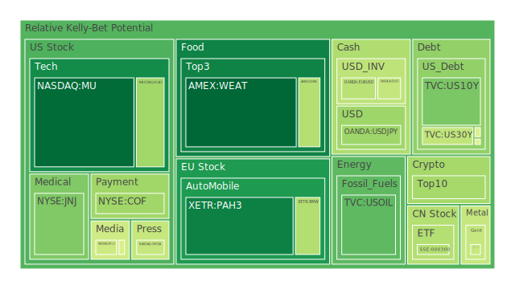
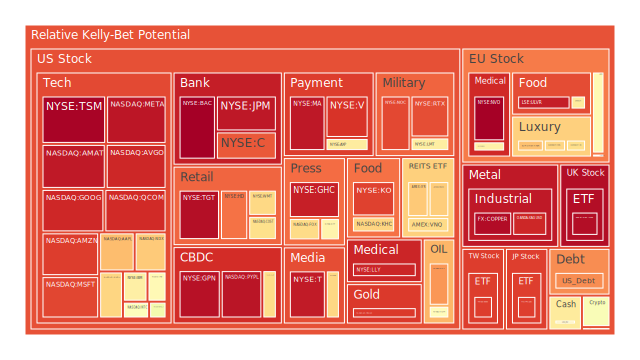
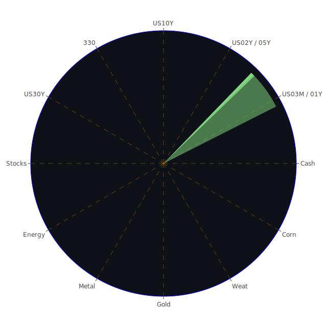

# 一、投資商品泡沫分析

在泡沫分析方面，透過Spatial（空間）維度，我們將市場與新聞對應到不同地區與產業板塊，檢視該空間範疇下的正面及負面訊息如何影響資產定價；Temporal（時間）維度則對照過去歷史週期與目前短期（D1）、中期（D7，D14）與長期（D30）風險分數之變動，觀察是否已有泡沫風險累積的可能；Conceptional（概念）維度則從群眾心理學、博弈論與經濟學理論來拆解市場行為，預估未來情勢的正反合衝擊。

以下將依照常見的主要投資標的，逐一進行論述。由於新聞與市場當前多數訊息（尤其汽車關稅、科技股壓力、通脹數據、地緣政治衝突等）展現出偏負面調性，故整體市場短期風險評估轉向謹慎，而長期亦存在不確定性。為避免遺漏任何潛在高泡沫標的，亦會納入各資產之歷史對照與可能的警示訊號。

## 1. 美國國債
美國國債屬於全球避險標的，在利率波動與貨幣政策調整時常受到關注。近期根據數據顯示，美國中長期國債利率（例如10年、30年）約在4.2-4.6%之間浮動。市場在新聞面上，因為連串的關稅爭議及對經濟成長的疑慮，使得部分資金流向較安全的資產。  
然而，也因FED總資產下降與利率走勢出現反轉空間，短端國債（如3個月、1年、2年）也呈現一種與長端產生倒掛或接近倒掛的狀態。從Temporal層面看，D1或D7泡沫風險相對較低，但長期若緊縮政策轉向，又可能使國債價格面臨壓力。若回顧2008年金融危機、2020年疫情時期，美國國債對衝表現雖佳，但在經濟不確定性高企下，若出現資金大舉離場，也可能帶來意料之外的波動。

## 2. 美國零售股
零售業在新聞面上，偶爾出現門店關閉、裁員及消費信心下降的訊息，例如美國大型零售商在2025年3月中以來，一直面臨通脹及關稅引發的成本上升壓力。部分新聞如「一些零售百貨正面臨關店或營收下降」的報導，市場情緒偏向負面。  
歷史上，零售股在消費旺季（如年中促銷或年底節慶）曾有重大反彈契機，但若消費者的可支配所得下降，零售業獲利前景容易惡化。Temporal維度顯示，短期泡沫風險低於成長型科技股，但長期仍得關注消費動能的衰退速度。

## 3. 美國科技股
科技板塊始終是市場焦點。近期新聞面顯示多檔大型科技公司承受了社群與監管壓力、環保或關稅議題的限制，還有AI概念受到追捧、但也出現CoreWeave這類IPO「相對失利」的案例，讓整體AI熱潮的泡沫疑慮再度升溫。  
根據部分泡沫數據，一些重量級科技股之D1或D7數字雖維持在中高檔，但D30平均都處於相對偏高水平。如同2000年網路泡沫或2021年末的科技股高點一樣，若投資人情緒逆轉，極易發生股價急跌的連鎖效應。從Conceptional維度看，群眾心理（FOMO）與博弈賭注仍可能把科技股推至不可思議的估值高點，但一旦獲利未能支撐，則會引爆大跌。

## 4. 美國房地產指數
房地產相關新聞中，聯準會長期緊縮下的高利率環境，使30年固定房貸接近6.65%左右，較2021年低利時期高出許多，已對購屋需求造成壓力。這也呼應新聞所指「住房負擔能力下滑」，不少REITs或房地產ETF（例如IYR）之泡沫分數在D1、D7、D14、D30中顯示均有顯著走高。  
若回溯2007年到2009年的次貸危機，也正是因房地產泡沫化導致大規模違約爆發。如今雖無明顯證據顯示將重演相同程度的危機，但Spatial層面可發現若海外資金大幅撤出，或地區性經濟不振，市場影響不容小覷。

## 5. 加密貨幣
比特幣、以太幣與狗狗幣等皆為加密市場之主要焦點。近期市場負面新聞來自監管層面與對衝基金調整，加上整體風險資產下行壓力。有關新聞如「GameStop宣佈發行比特幣收購資金」卻大幅下跌，也折射出加密市場與股權市場的關聯性仍高。  
縱觀加密歷史，在2021年底曾達高峰，後於2022年出現大跌。依據泡沫指標數據，比特幣（BTC）的D1約在0.57上下，以太幣（ETH）也在0.52附近，短期看似風險不低；若大盤波動加劇，再次引發連鎖拋售的可能性高。心理學上，投資人追逐暴利的熱情容易點燃又迅速熄滅，應密切留意短週期泡沫指標。

## 6. 金／銀／銅
貴金屬金銀是傳統避險標的，但在高利率環境下，金價已有史無前例的突破（當前可能在每盎司3000美元以上）。新聞面時常出現「金價再創新高」或「金銀比激增」、「金銅比飆升」等。近期GOLD OIL RATIO與GOLD COPPER RATIO都呈現拉大趨勢，顯示黃金相對其他商品更顯強勢。然而，若聯準會之貨幣政策轉向寬鬆，或政治局勢趨於穩定，金價也可能面臨獲利回吐風險。  
銅因為產業應用廣泛，被視為反映景氣的指標品。但新聞有提到「銅價因關稅疑慮而波動」，暫時仍高檔。從Temporal的角度，在歷史上每逢景氣將衰退前，銅價通常領先下滑，需觀察未來幾個月的全球製造業指數（PMI）與實際工業需求。

## 7. 黃豆 / 小麥 / 玉米
農產品的行情易受天氣、貿易政策與地緣政治影響。近期新聞面並未出現大規模農業天災消息，但關稅政策變數與部分地區衝突，都可能衝擊穀物運輸與銷售。  
對照歷史，在2012年美國旱災或中美貿易戰時，農產品價格大幅波動。眼下泡沫風險整體不算太高，但若新聞面突然出現例如「關稅禁止出口」或「大型農業集團減產」，很可能推高相關期貨價格。

## 8. 石油／鈾期貨UX!
近期石油在新聞面多半聚焦於「美國宣布新關稅，全球經濟成長疑慮」，但也有「美國戰略儲備庫存降低，頁岩油商擔憂」等。油價目前在每桶約69-70美元間震盪，Gold-Oil比創下近年高點，代表石油相對貴金屬處於低估或需求不振的狀態。  
鈾期貨（UX!）市場相對冷門，泡沫風險數據暫時無大幅異動，但在能源轉型議題下，若核能成為各國替代能源的重點，鈾的需求也可能大幅上揚。歷史經驗顯示，當整體經濟開始追逐乾淨能源議題時，往往帶動鈾礦股或鈾期貨短線暴漲，但同時波動也極其劇烈。

## 9. 各國外匯市場
外匯市場受貨幣政策、地緣政治、關稅戰、通脹等多重因素影響。目前美元對多數主要貨幣維持強勢（如GBPUSD仍在1.29左右，AUDUSD在0.63，EURUSD約1.08）。新聞如「特朗普對世界經濟秩序的衝擊」可能導致避險資金再次回流美元，形成美元短期偏強。然而若關稅衝擊全球產業鏈後，歐元區或英國可能爆發本土化危機，也同樣推升避險需求。  
對照歷史，2018年中美貿易戰與2022年初的貨幣緊縮浪潮，都引發匯市劇烈波動，甚至逼迫部分國家干預匯率。從Conceptional角度看，外匯市場是一種零和博弈場域，狙擊式投資、央行政策投機等也會擴大振幅。

## 10. 各國大盤指數
目前歐、美、亞主要指數普遍示警下行壓力，新聞報導「關稅、汽車進口稅大幅攀升，美國道瓊下挫700點，S&P 500 創2025年來第二差表現」。  
回顧歷史，若全球貿易摩擦持續升溫，恐重演2018年貿易戰期間的大幅回調，甚至導致更深的衰退風險。短週期的D1、D7風險指數看似已不斷攀升，說明市場正瀰漫恐慌或謹慎情緒。

## 11. 美國半導體股
半導體公司受AI、消費電子、車用晶片等多重需求牽引，一直是資本市場熱點。新聞面也顯示在關稅衝擊下，車廠可能減少特定零件採購，導致短線需求不振。但AI伺服器的投資持續強勁，形成某種結構性矛盾。  
對比2000年科網泡沫與2021年的晶片短缺，若資金熱炒AI題材卻實際無法創造足夠營收成長，半導體板塊可能迎來嚴重回調。因此在Temporal角度上，D1和D7可能僅反映近期樂觀或悲觀，而D30才是真正顯示是否已達泡沫極限。

## 12. 美國銀行股
銀行股在近期新聞中，信用卡違約率、消費者信貸品質等指標皆有惡化趨勢，暗示銀行風險敞口擴大。且聯準會的政策雖對銀行利差有利，但若經濟衰退，壞帳率大增也是隱憂。  
回顧2008年金融危機時，銀行股遭遇大幅拋售，也提醒市場必須審慎看待銀行對商業不動產、槓桿貸款的曝險。若新聞繼續報導對銀行資本品質的質疑，可能引發新一波恐慌。

## 13. 美國軍工股
軍工板塊通常和地緣政治以及政府支出強度相關。近期新聞對北約國家軍事互動頻繁，俄烏衝突、美中地緣張力皆可能推升軍工需求。不過若政治風向出現「壓縮財政支出」的聲音，軍工訂單有被削減的風險。  
歷史場景顯示，當國際衝突升溫時，軍工股往往逆勢上揚。但若衝突結束或預算被轉移到民生領域，軍工股又有高估風險。

## 14. 美國電子支付股
電子支付公司在疫情後需求仍高，但監管、加密貨幣興起、新型FinTech競爭，以及整體消費水平的波動，都影響其發展走向。若美國經濟進入衰退，電子支付交易量將受衝擊。  
歷史上，電子支付產業曾在2017-2019間高速成長，但大環境若轉為衰退，通常影響交易量與手續費收入，導致股價高估風險浮現。

## 15. 美國藥商股
根據新聞，藥商因研發時程與專利保護期，股價走勢相對獨立於一般經濟週期。部分新聞指默克（Merck）有關於Keytruda注射配方的臨床試驗獲正面結果，使其基本面獲得支持。然而，也有若干因素如專利到期、競爭對手研發突破等風險。  
以歷史對照，藥商股常在經濟疲弱時成為防禦資產，但也必須留意藥價監管、訴訟與專利風險。

## 16. 美國影視股
串流平台競爭激烈，傳統影視公司靠院線發行的模式正面臨分眾與IP缺乏帶來的難題。若新聞持續負面，例如違約、併購失利或對內容的監管，影視股易因情緒面而劇烈波動。回顧2008年金融危機、2020年疫情初期，影視行業在廣告費收縮、觀看習慣改變時，往往出現獲利警訊。

## 17. 美國媒體股
媒體公司不少透過廣告收入獲利。新聞若顯示廣告市場緊縮或內容審查風波，都會衝擊媒體股。再者，社群與數位平台的興起也分散了廣告預算，若沒有多元變現渠道，股價估值易走向泡沫化。

## 18. 石油防禦股
石油相關企業中，一部分被視為防禦類型，原因在於它們長期握有產量與管線優勢，即使價格大幅下跌，也能透過原油、天然氣多樣化業務維持營收。  
不過關稅與需求萎縮的陰影若持續，石油防禦股亦無法獨善其身，2020年疫情時許多石油龍頭都出現大幅獲利衰退。D1-D30泡沫分數顯示，若油市面臨衰退，該類股的高估風險不容忽視。

## 19. 金礦防禦股
金礦企業受金價上漲帶動，通常能享受利潤提升。但若金價反轉，成本壓力與槓桿風險也會造成獲利劇烈波動。歷史上曾出現金價在短期爆衝後回吐，金礦股更是過山車走勢。目前金價約超過3000美元，市場正處於警惕金價是否進一步飆高或出現獲利了結的十字路口。

## 20. 歐洲奢侈品股
歐洲奢侈品對中國與美國市場依賴度高，若關稅使得跨境交易成本上升，或全球景氣持續放緩，都會影響消費者購買力與意願。新聞中「部分時裝品牌因疫情與政治不穩定影響銷售」的案例並不少見。從投資心理學看，奢侈品有時作為富裕階層象徵性消費的代表，若全球股市下跌導致財富縮水，高端消費也可能減緩。

## 21. 歐洲汽車股
歐洲車廠面臨美國關稅與新能源轉型，新聞亦提到「歐盟汽車銷量下滑3%」等負面數據，暗示市場需求疲弱。歷史上，汽車業一旦逢衰退週期，整個供應鏈會隨之萎縮。若政治面衝突持續，汽車出口即難言樂觀。

## 22. 歐美食品股
食品行業在通脹情況下，原料成本上升，若無法轉嫁成本，獲利空間壓縮。不過食品往往是剛性需求，衰退時較能抗跌。新聞若顯示「消費習慣改變」或「健康導向食品需求增長」，特定品牌可能受益，然整體估值仍需留意泡沫風險。

-----

# 二、宏觀經濟傳導路徑分析

1. **關稅與國際貿易的衝擊**  
   新聞提及特朗普突然上調汽車關稅或其他類型關稅，對全球供應鏈帶來直接影響。Spatial角度顯示，各國受衝擊程度不一，而對美國進口依賴高的國家將更易經濟下滑。Temporal層面上，若關稅政策長期維持，通脹壓力可能滯留，最終影響企業獲利及就業市場。  
2. **貨幣政策轉折與利率走勢**  
   FED已出現放緩緊縮或觀望的跡象，但整體資產負債表仍在縮表當中，EFFR與OIS FED Fund Rate走勢亦頗具波動。高利率環境壓制消費與投資，若同時關稅抑制國際貿易，可能帶來經濟下行風險。  
3. **地緣政治與全球資金流動**  
   諸多新聞揭示地緣政治摩擦升溫，市場多頭熱情受壓抑，而資金可能流向黃金、美國國債等相對安全處。歷史顯示，一旦系統性風險增加，股票與公司債市場會出現負面傳導，導致週期性或成長型股票承壓。

-----

# 三、微觀經濟傳導路徑分析

1. **消費者端**  
   關稅推升進口品價格，通脹可能導致消費者需求下滑；同時房貸利率高企，住房開支提高，減少其在零售、娛樂等可自由支配領域的消費。  
2. **企業端**  
   生產成本因關稅或原料上漲而攀升；若要維持市佔率，企業難以全面轉嫁成本，只能犧牲利潤或削減投資、裁員。大型企業因規模經濟與國際布局，短期抗壓力稍強，但中小企業易受到最直接的財務衝擊。  
3. **金融機構端**  
   銀行、保險、資產管理公司若遭遇大量貸款違約或資金挪移，可能引爆流動性風險。在泡沫或高估值情形下，若股市回檔，金融機構必然受到投資與放貸方面的雙重衝擊。

-----

# 四、資產類別間傳導路徑分析

1. **股票與債券**  
   當股市恐慌情緒升高，資金可能流向債券市場推高其價格；但若聯準會繼續升息，長債也可能遭拋售。  
2. **股票與原物料**  
   關稅與經濟衰退預期使原物料需求下滑，油價、工業金屬等受壓；但若地緣風險驟增，又有可能瞬間推升油價或金屬價格。  
3. **股票與外匯**  
   當全球避險需求升溫，美元傾向走強；若資金快速湧入美元，非美貨幣貶值恐擴大資本外流風險，反饋到當地股市。  
4. **股票與加密貨幣**  
   近年來加密資產與高風險科技股之走勢相關性不斷提高。一旦投資人信心崩潰，也會同時重創加密貨幣。

-----

# 五、投資建議

以下從「穩健」、「成長」、「高風險」三種組合觀點，提出可行的配置方向。比例為三大類合計100%，並各自挑選三個子投資項目，考量波動相關性力求分散。此種組合在相位盡量滿足120度、相關係數約-0.5的理想情境下，提供對沖效果。然而實際市場中很難精準達到，但此為理論上的參考：

1. **穩健型（約40%）**  
   - （1）美國國債：透過長短期國債交互配置，降低整體組合波動。雖利率上升可能導致市值波動，但若行情急跌，國債仍具防禦性。  
   - （2）黃金：在高通脹及地緣衝突疑慮下，有助避險。需留意金價已處於歷史高區，短期易震盪，仍可佔部位以抵禦系統性風險。  
   - （3）全球高評級債券或美國投資級公司債：有相對穩定的利息收益，同時避險功能較高收益債來得好。

2. **成長型（約35%）**  
   - （1）美國科技股龍頭：AI、雲端服務、半導體設計等龍頭企業具長期成長潛力，儘管短期估值高，若考慮長期佈局或逢低減碼，仍有機會。  
   - （2）歐洲奢侈品或消費品牌：若歐美與中國需求同時恢復，奢侈品與大眾消費快速反彈。但需留意關稅與地緣政治衝突的影響。  
   - （3）美國軍工股或相關供應鏈：地緣局勢持續緊張，軍工需求不減，可能成為系統之外的成長來源。

3. **高風險型（約25%）**  
   - （1）加密貨幣：具高速成長與高波動的特性，須謹慎評估泡沫風險，適合能承受巨大波動之投資人。  
   - （2）新興市場股票：若美國利率趨於高檔並維持，資金或許階段性回流，但若地區成長動能轉強，反而會得到超額報酬。  
   - （3）小型科技或AI概念股：可能擁有翻倍成長潛力，但一旦市場情緒轉壞，也恐遭遇猛烈拋售。

-----

# 六、風險提示

回顧以上分析，許多資產的泡沫風險日益浮現，以下為不可忽視之重點：

1. **關稅風險高企**  
   新聞顯示特朗普祭出更多關稅手段，車廠、科技公司、原物料供應端均受衝擊。此舉若觸發其他國家反制，將惡化全球貿易環境。

2. **高估值泡沫預兆**  
   科技股、加密貨幣、軍工股等領域都同時享受市場熱錢推升，D1、D7、D14乃至D30的泡沫指標大多偏高，暗示若出現獲利不及預期或監管風吹草動，價格都易大幅修正。

3. **房地產與信貸風險**  
   房地產ETF與REITs之泡沫指數自D1到D30皆顯示升溫，利率高企下的房貸壓力或將逐步引爆違約風險。商業不動產在經濟景氣下行時衝擊更大，銀行貸款端亦受牽連。

4. **地緣政治不確定性**  
   新聞頻繁提到南北韓局勢、俄烏議題、中東火藥味等；一旦局勢擴散，能源與糧食供應鏈中斷機率上升，資本市場將出現劇烈動盪。

5. **金融機構槓桿與衍生商品**  
   高槓桿的對衝基金或銀行若因股債同步修正，恐難以應對保證金的要求，而引發連鎖斷頭。這在2008年雷曼事件、2021年Archegos事件都有先例。

6. **心理層面與傳染效應**  
   博弈論與群眾心理學皆提示：市場參與者往往非理性。若恐慌蔓延於零售投資者與機構，同步拋售會引爆連續踩踏。反之，若市場過度亢奮也會助漲泡沫擴張。

-----

# 結語

綜合Spatial、Temporal與Conceptional的三位一體分析，各市場與新聞事件之三位一體（經濟學、社會學、心理學或博弈論）均指向高度警惕：  
- **空間（Spatial）**：關稅戰在全球傳導擴散，各區產業鏈皆受影響；地緣衝突使多個國家面臨政治、經濟壓力。  
- **時間（Temporal）**：短期（D1、D7）與中期（D14）風險飆升，長期（D30）亦呈現高企，顯示泡沫加速擴張可能。  
- **概念（Conceptional）**：群眾情緒、政策博弈與資本力量推動漲跌，正反合的辯證指向「過度熱點易形成泡沫、過度恐慌也易生扭曲」，更須審慎評估。  

最終，資產配置既要考慮成長潛力，也不可忽視可能的泡沫風險；投資人應嘗試分散、對沖、掌握周期性與結構性變化，亦需正視新聞中「關稅與政治風險」的警訊。歴史昭示，一旦經濟與政治局勢惡化，市場回跌速度往往高於預期。  

-----

# 風險提示

投資有風險，市場總是充滿不確定性。本報告所提出之觀點僅為參考，不構成任何保證或承諾。投資者須根據自身之風險承受能力與投資目標，審慎評估後做出獨立決策。當前泡沫評估顯示，多項資產正面臨高風險、波動劇烈的可能性，勿忽視潛在的市場踩踏與大規模回調。請持續追蹤最新新聞與市場動向，並考量多空變動情形，審慎規劃投資策略。

 
Daily Buy Map:

 
Daily Sell Map:

 
Daily Radar Chart:

 
