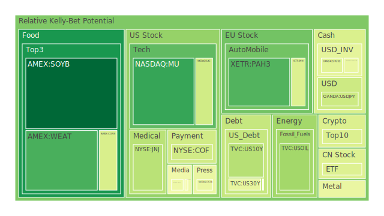
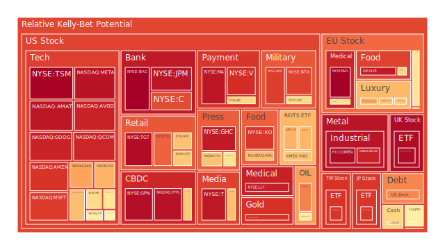
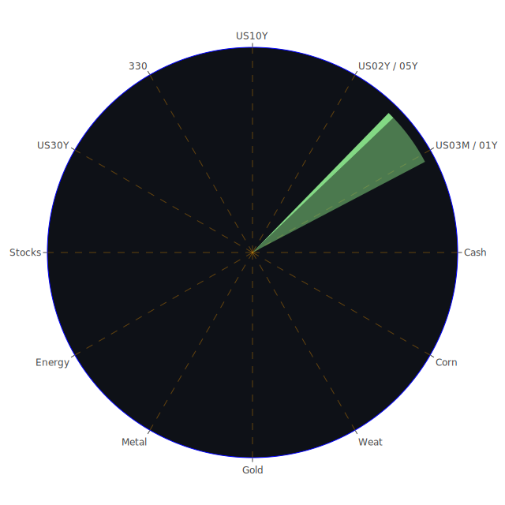

# 一、投資商品泡沫分析

以下將依序論述各投資商品之現況與可能的泡沫跡象。所引用之風險評估，主要來自於近期所提供的 D1、D7、D14、D30 風險指標（泡沫指數）以及 PP100（當日現價）的相對資訊。我們同時會考量相關新聞（正面與負面情緒）與歷史事件，用經濟學、社會學、心理學、博弈論四種觀點勾勒資產的風險輪廓。

## 1. 美國國債
近期美國 30 年期、10 年期、2 年期與 3 個月期的殖利率與市場關注度皆高。根據資料顯示，30Y 風險指數在 D1 約 0.44-0.45 左右，10Y 在 D1 約 0.34-0.53 之間變動，2Y 與 3M 亦顯示一定程度的波動。從歷史面來看，美國國債經歷了長期低利率後的緩步升息，受通膨與貨幣政策調整影響，殖利率曲線出現倒掛或陡峭化的動態。  
社會層面，市場對未來政府債務上限以及赤字規模存有隱憂，使得部分投資人擔憂長債泡沫。心理層面來看，投資人仍普遍將美國國債視為所謂「避險」標的，但若政府財政前景欠佳，情緒轉向時可能出現拋售潮。博弈論觀點下，美國國債與各國央行外匯儲備博弈密不可分，若部分經濟體陸續調整美元資產配置，則長債價格或有震盪。整體而言，美國國債現在雖不至於出現極端泡沫化，但未來仍需關注財政可持續性與全球資金配置動向。

## 2. 美國零售股
美國零售股如 WMT、Costco（COST）等，依據提供的風險數據，D1 指標普遍在 0.66-0.67 之間，有些（例如 WMT 的 D14、D30）甚至接近 0.85-0.88，顯示一定程​​度的風險膨脹。新聞面顯示，有關美國通膨與貿易衝突、關稅摩擦的報導不斷，同時也有關於消費市場轉弱的負面消息，特別提及春季銷售季「表現可能趨於遲滯」，這些都增添了市場疑慮。歷史上，零售股在經濟遭遇壓力或消費信心下滑時往往表現疲弱。例如 2008 年金融危機之後，消費者信心一旦緊縮，零售業易出現獲利衰退。  
社會學觀點認為，大量消費行為正由實體走向電商，如果主要零售股無法及時轉型，投資者預期也可能轉向悲觀。心理層面，通膨與關稅造成的物價高漲，容易打壓終端需求，營收指引下修往往使股價遭受衝擊。博弈論方面，零售商面臨上游供應商與下游消費者的利潤再分配博弈，若關稅或供應鏈問題無法解決，零售企業利潤空間或持續受壓。整體來說，美國零售股並非完全泡沫，但風險指數偏高，未來需注意高庫存、消費者信心指數等變量。

## 3. 美國科技股
包含 AAPL、MSFT、GOOG、META、NVDA、AMD、AMZN、QCOM、TSLA 等知名龍頭，根據風險指數，許多科技巨頭的 D1 值超過 0.80 或更高（如 META、AMZN 的 D1 均超過 0.90），暗示市場對這些科技股的估值已然偏高。從新聞來看，一方面有 AI、雲端運算等新領域的正面驅動，但也有關稅戰、經濟放緩等負面報導牽動市場情緒。歷史上一旦科技股存在過度熱炒，最著名就是 2000 年網路泡沫與 2021-2022 年間科技巨頭大漲後的修正過程。  
從心理學觀點，投資者對未來技術突破往往懷抱極高期望，若實際營收或創新周期無法趕上，股價就有高估之虞。社會學層面則看到科技巨頭在政府監管、用戶隱私、壟斷調查以及勞力市場等領域皆面臨挑戰。博弈論觀點則指出，世界各國在高端晶片與關鍵技術上的博弈仍持續升溫，貿易關稅與出口管制若再加碼，都可能讓科技企業供應鏈承壓，影響獲利。綜合來看，美國科技股風險不容忽視，尤其是 D14、D30 看起來也處於偏高水平，例如 AMZN、GOOG 或 NVDA 有接近 0.90-0.95 以上的水位，提醒投資人需謹慎評估資產高估風險。

## 4. 美國房地產指數
美國房地產指數（如 VNQ、RWO、IYR 等）根據資料顯示，D1 均值約 0.66-0.70 左右，而 D7、D14、D30 亦有部分接近 0.80 或更高。新聞面提到「美國房地產春季銷售淡季」，且高房貸利率環境下，購屋需求相對遲滯。歷史上，2007-2008 年次貸危機就是由房地產泡沫破裂而引爆。因此，儘管市場不像先前那般瀰漫槓桿投資，但若長期利率維持高檔或重新走揚，房市仍不排除承受壓力。  
社會角度而言，房地產攸關民生，各種就業、收入水平都會影響購屋行為。一旦大量民眾擔心失業或經濟衰退，房地產交易量就會下滑。心理因素上，投資人常把不動產視為「保值」或「資本利得」工具，在景氣向下時，拋售行為若發酵，價格就可能急轉直下。博弈論思維下，政府在房地產稅制、利率政策與社會福利的權衡，以及銀行在貸款與風險管控之間的博弈，都對房地產價值產生巨大影響。綜合看來，房地產指數已有一定泡沫疑慮，需持續追蹤按揭貸款利率走勢，以及整體就業市場變動。

## 5. 加密貨幣
比特幣（BTCUSD）、以太幣（ETHUSD）與狗狗幣（DOGEUSD）等仍是市場矚目焦點，數據顯示其 D1 多在 0.42-0.57（DOGEUSD 稍低些），而 BTCUSD、ETHUSD 在 D7 或 D14 水位也經常高於 0.45，顯示市場情緒波動顯著。新聞方面，看不到太多正面報導，反而多關於地緣政治或金融風暴的消息，間接影響加密貨幣投資者的心態。歷史上，加密貨幣從 2017 年狂潮到 2022-2023 年下跌，都展示了投機資金如何迅速進出市場，價格波動劇烈。  
從經濟學來看，若貨幣政策趨緊、資金成本提高，加密貨幣吸引力可能減弱。社會角度則注意到更廣泛的大眾仍對加密產業缺乏信任，且監管政策尚未明朗，隨時可能打擊市場。心理層面，投資人對避險屬性的認知尚未達共識，一旦恐慌情緒蔓延，價格往往劇烈下跌。博弈論角度看，若主要國家共同出手管制交易所或挖礦行為，市場將面臨定價動盪。整體而言，加密貨幣的泡沫風險會周期性浮現，目前尚未至於狂熱巔峰，但也不得掉以輕心。

## 6. 金／銀／銅
根據前述資料，金（XAUUSD）與銀（XAGUSD）目前 D1 一般在 0.45-0.94 的區間，差距頗大；銅（COPPER）的泡沫指數則偏高（約 0.97 至 0.98），顯示銅近來頗受投機資金青睞。新聞面有提到國際關稅衝突下，金屬價格飆升，特別是金價衝破 3100 美元（報導中提及「金價突破 3100 美元」），銅價也達接近歷史高位區間。歷史上，當全球經濟復甦或基礎建設需求提高，銅價往往上漲；黃金與銀則兼具避險與工業用途屬性，受地緣政治或金融市場風險驅動。  
心理層面，黃金長期被視為「終極避險」，但若投資者追高過度，就會形成泡沫並在情緒轉折時下滑。社會觀點來看，通脹與經濟不確定性往往推動市場對貴金屬的需求；銅更受電動車、高速鐵路等基礎建設驅動。博弈論則在礦場國家、加工企業及金融投資人之間展開，地緣風險也影響金屬供給。總體看來，銅的泡沫分數特別高，需要關注供給鏈消息及建設需求是否能長期支撐；金與銀若地緣政治風險緩解，也可能被拋售。

## 7. 黃豆／小麥／玉米
在期貨市場上，SOYB、WEAT、CORN 等代表黃豆、小麥、玉米的交易商品。根據資料，小麥（WEAT）與玉米（CORN）的 D1 大約在 0.14-0.42，整體看來並非特別高；黃豆（SOYB）先前 D1 在 0.49 左右，但 3 月 30 日忽然出現 0.02-0.03 的數值，顯示短期內大幅波動。新聞面，農產品受天氣、全球供需等影響，加上近期貿易衝突引發關稅問題，可能壓抑或推高價格。歷史上，若出現極端氣候或糧食出口限制，穀物價格會快速上漲；在國際博弈下，糧食更成為政治槓桿。  
社會層面，糧食價格高漲往往引發民眾生活成本問題，政府也會采取進口補貼或出口管制。心理層面，期貨市場炒作若帶來供應恐慌，往往推波助瀾價格飆漲，但一旦需求面與產量前景改善，價格又會回落。博弈論則體現在各國的農業保護政策與糧食安全籌碼上。當下豆類產品 D1 出現非常低的數值顯示短線資金或許正在撤出或觀望。整體而言，此類農產品似乎未到達極端泡沫，但因關稅與供需結構均在快速轉變，需持續追蹤。

## 8. 石油／鈾期貨UX!
石油（USOIL）根據資料，D1 在 0.31 左右，D7 約 0.49，D14 約 0.41，D30 約 0.35，代表其短線波動相對顯著。全球供需消息、地緣政治與產油國政策都會影響油價。歷史上，石油價格因為歐佩克減產或地緣衝突而大幅波動乃常態，2008 年、2014 年和 2020 年都見證了油市的劇烈起落。鈾期貨（UX1!）的風險指數約在 0.51 左右，變動不大，近年市場對核能關注度升溫，供應端相對集中，有投機資金流入，潛在泡沫風險不容忽視。  
社會角度看，石油與鈾牽動了能源安全與國家政策；心理因素部分，能源商品常被視為對衝通脹的工具，一旦避險需求高漲，價格就易上揚。博弈論方面，產油國之間協調、核能推廣國之間的利益角力都會造成供需結構變化。綜合評估，目前油價雖未見極端高點，但仍可能因地緣風險或貿易關稅政策變動而震盪；鈾期貨則保持在溫和上漲格局，若市場加大炒作或政治力介入，易在短時間內形成價格泡沫。

## 9. 各國外匯市場
主要外匯如 EURUSD、GBPUSD、AUDUSD、USDJPY 等。新聞面指出，關稅戰、美國經濟與他國政策皆對匯率構成影響。例如 GBPUSD 有時 D1 約 0.35-0.62，EURUSD 約 0.43-0.58，AUDUSD 也有近 0.45 的狀況，USDJPY 介於 0.36-0.41 間。歷史上，匯市易受央行利率決策、地緣動盪與國際資金流動支配。  
從社會與心理層面看，市場對英國脫歐後續、歐盟財政政策、美國就業及通膨預期都會轉化為匯率波動。博弈論層面，各國央行若協同干預或進行貨幣競爭性貶值／升值，往往引發外匯市場快速震盪。目前看來，外匯泡沫化相對不如股市或商品，但仍因貨幣政策差異而擁有不小的投機空間，投資人應留意槓桿交易的潛在風險。

## 10. 各國大盤指數
包括歐洲、亞洲與美國等，如 FCHI（法國）、GDAXI（德國）、FTSE（英國）、JPN225（日本）、000300（大陸）等。根據最近數據，GDAXI、FTSE、JPN225 等指數風險指數最高可達 0.97 左右，顯示在全球流動性、地緣政治與通膨因素交織下，歐洲與日本大盤指數都有相當的高估風險。歷史上，歐洲大盤曾在歐債危機時劇烈震盪，日本股市則長期對日圓匯率與全球需求很敏感。  
社會層面，歐洲與日本在內需市場與輸出市場之間的失衡可能加劇市場疑慮；心理層面，當資金大量湧入避險或尋找較低估值的地區時，也可能推升某些市場「非理性繁榮」。博弈論下，各國央行操作寬鬆與否都將牽動指數走勢。若美國持續升息或維持緊縮，歐亞市場的資金流可能逆轉。大盤指數雖不等同於單一產業，但一旦系統性風險升溫，指數回調幅度可能不小，需格外警惕。

## 11. 美國半導體股
KLAC、NVDA、AMD、INTC、QCOM 等。資料顯示半導體股 D1 普遍在 0.40-0.92 之間，差距相當大，但大多存在中高風險。新聞面上，半導體受 AI、5G、電動車等帶動需求，但也面臨地緣貿易戰和出口管制衝擊。歷史上，半導體週期向來顯著，一旦庫存積壓或技術升級慢於預期，股價下修就會很快。  
社會與心理層面，市場對「高科技供應鏈」的依賴既深且廣，投資人更擔心任何禁令或競爭政策帶來「斷鏈」恐慌。博弈論觀點下，美國與其他半導體大國在技術專利、製程與市場占有率的競爭，使該板塊波動劇烈。整體來說，半導體股相當炙手可熱，也充斥泡沫訊號，特別是 NVDA、AMD 在 D7、D14 甚至達到 0.70-0.90 以上，代表漲勢背後暗含資金集中度與投機成分。

## 12. 美國銀行股
包含 BAC、JPM、C、AXP 等。截至 3 月 30 日，BAC 的 D1 高達 0.997、C 亦高達 0.857，顯示市場對銀行股潛在泡沫／風險高度敏感。新聞顯示銀行受加息週期與貸款組合不良率提升影響，雖然先前獲利尚可，但市場對未來信貸風險仍有疑慮。歷史上，銀行危機往往在經濟轉折、資產質量惡化時集中爆發，例如 2008 年美國金融危機。  
社會層面，消費者信用卡、房貸、商業地產違約都牽動銀行體系穩定。心理層面，一旦出現恐慌，容易在資本市場形成拋售連鎖反應。博弈論觀點，銀行、政府、企業與民眾之間有高度的相互依存，任何環節損壞都可能引爆更大危機。當前銀行股的泡沫指數顯示投資人對潛藏風險的重視程度相當高，宜格外謹慎。

## 13. 美國軍工股
如 LMT、NOC、RTX 等。根據資料，D1 多在 0.67-0.87 的區間，D7、D14 乃至於 D30 也較高。近期地緣政治衝突頻繁，但新聞亦指出各國對某些武器採購和預算仍然保留觀望態度。歷史上，軍工股常在動盪時期受到資金青睞，但也容易隨著衝突階段的消長而劇烈波動。  
社會與心理層面，軍工股在道德爭議及政府預算間平衡，投資人情緒也時常受到媒體渲染與國際局勢帶動。博弈論更明顯，國與國之間的軍備競賽直接影響軍工企業訂單。如果局勢緩和，軍工需求或暫緩，一旦衝突再次升級，股價又會爆發。雖目前有一定支持因素，但高風險指數暗示投機資金已湧入，請投資人留意短期漲跌波動。

## 14. 美國電子支付股
如 PYPL、V、MA、GPN 等，近來受到關稅衝擊的間接影響較小，但整體支付領域也會因跨境交易增減而受波及。從數據看，PYPL 在 D1 大約 0.96-0.97，V、MA、GPN 也高達 0.94-0.98，顯示市場估值非常昂貴。歷史上，電子支付和 FinTech 常被視為成長性產業，但也曾在 2021-2022 年經歷高估後的挫跌。  
社會學觀點，電子支付對消費習慣與商業模式衝擊深遠，預計仍有高成長潛力。心理層面，對「無現金社會」的樂觀期待，令投資人一度忽視該產業盈利模式可能因手續費管制或競爭而下修。博弈論層面，大型業者在市場占有率的卡位戰中，若有新參與者攪局，資金、技術、用戶之間的爭奪將甚為激烈。泡沫信號高企，不代表一定會崩盤，但投資人必須關注獲利能力是否能跟上估值。

## 15. 美國藥商股
如 JNJ、MRK、LLY 等，風險指數大多在 0.35-0.93 間，差距較大。新聞提到 Keytruda 注射劑形態獲得正面 III 期臨床試驗結果，對 MRK 有潛在利多，但也有 FDA 审查與價格管制等不確定性。歷史上，藥廠研發新藥或面臨專利到期時，都會帶來股價的大幅波動。  
社會角度，醫藥關乎大眾健康與民意，政府往往出手監管藥價。心理層面，投資人高度期待新藥上市利多，但若臨床結果不如預期，股價恐重挫。博弈論觀點，藥商與保險機構、醫院、政府之間的談判價格是關鍵籌碼。總體來說，藥商股在當前環境下或仍是防禦性標的，但不代表沒有風險。部份公司若估值過高，發生利空事件時也會下跌。

## 16. 美國影視股
如 DIS、PARA、NFLX 等，根據資料，PARA D14、D30 指數曾高達 0.64-0.76，NFLX 的 D14、D30 更達 0.63-0.78，顯示中長期存在一定風險。新聞提到消費者對串流媒體平台的黏著度、廣告費用緊縮等，都對該行業產生影響。歷史上，隨著串流產業進入紅海，競爭加劇，獲利空間可能縮水。  
社會層面，年輕世代的觀影習慣改變，帶動整個產業模式轉型。心理因素上，投資人曾對串流平台寄予無限成長期望，但近年已見證訂閱數放緩，市場熱度不若先前。博弈論面，影視公司在內容授權、製作預算、與國際平台競爭等方面都會消耗大量資金，風險積聚。評估下來，影視股或有階段性上漲空間，但高風險指數暗示現階段估值中已囊括不少樂觀成分。

## 17. 美國媒體股
如 FOX、CMCSA、NYT 等。根據資料顯示，FOX 的風險在 D1 高達 0.63-0.66，長期可至 0.85-0.90；CMCSA D1、D7 雖相對較低，但若營收下滑也可能形成結構性風險。新聞對媒體產業的報導常提及廣告市場縮減、傳統媒體轉型數位化不易等。歷史上，媒體公司常因廣告景氣而興衰，廣告投放一旦降溫，其獲利就會變得脆弱。  
從社會角度，媒體對輿論與社群文化有重大影響，但也會受到新技術（自媒體、串流平台）衝擊。心理層面，投資人對傳統媒體往往存在「夕陽產業」的既有印象，對數位轉型成功與否存疑。博弈論方面，媒體在政治與商業之間的平衡，廣告主與媒體之間的議價也構成複雜利益競合。綜觀之下，媒體股雖未必是絕對泡沫，但該產業的前景仍需密切關注廣告主的支出意願、競爭對手動態與大眾消費行為走向。

## 18. 石油防禦股
如 XOM、OXY 等，此類企業同時具備能源與防禦成分。根據資料，XOM 在 D1 約 0.58-0.67，OXY 在 D1 約 0.77，皆屬中高風險。新聞顯示這些公司因油價波動與關稅戰等可能在營收層面出現不確定性。歷史經驗指出，石油防禦股通常現金流穩定，但若國際供給過剩或經濟轉向衰退，股價還是會顯著回調。  
社會層面，化石能源的環保議題與可替代能源的興起，讓石油公司在長期發展上受壓；心理層面，投資人對「高股息」的期待可能推高估值，但也易因油價震盪而失望。博弈論方面，能源企業與政府政策、國際間能源戰略博奕緊密，任何制裁或減產協議都會影響股價。風險指數雖不在最高階，但仍建議保持警覺，避免盲目追高。

## 19. 金礦防禦股
RGLD、GOLD 等與黃金或貴金屬相關的礦業股，根據 RGLD 的 D1 高達 0.90 以上，表示市場對黃金相關資產給予極大興趣。新聞見到金價衝高至超過 3100 美元後，相關礦業公司預計會受惠，但也可能因成本上揚、礦山安全或環境問題而受限。歷史上，礦業股的槓桿效應可能放大金價波動；當金價上漲，礦業股往往漲得更凶，反之亦然。  
社會層面，金礦開採面臨環境與人權議題，可能引發當地或國際輿論壓力。心理層面，黃金股通常成為資金在恐慌時的避風港，但若恐慌散去或金價突然回落，礦業股也會跟跌。博弈論角度，礦業公司在成本控制、對沖操作與下游買家之間形成博弈，如若金價一味高漲，各方競逐利潤就會加快開採，最後導致供給過剩或熱度消退。投資人務必警惕高風險指數暗示投資熱度達高峰。

## 20. 歐洲奢侈品股
如 MC、KER、RMS 等。根據資料，MC、KER、RMS 的泡沫風險指數在 D14、D30 甚至高於 0.70，顯示高端消費市場雖然景氣頑強，但估值已經不便宜。新聞方面，歐洲各國面臨關稅衝突時，奢侈品出口也曾受衝擊。歷史上，奢侈品股常因中國與北美的消費力帶動而飆漲，但亦需留意若全球經濟進入衰退期，高端消費可能收斂。  
心理層面，奢侈品投資者常傾向「品牌價值永續」的樂觀看法，但疫情、地緣衝突、關稅戰等外部因素都可能壓縮需求。社會角度亦關注中產階級收入走緩與反奢華浪潮。博弈論下，各精品集團在全球奢侈品市場爭奪有限的高淨值消費者，若競爭過度，宣傳或通路成本也會飆升。結果是當前泡沫風險雖尚未到達崩潰邊緣，但買盤亢奮的情況不容忽視。

## 21. 歐洲汽車股
如 BMW、PAH3（保時捷控股）等。D1 風險指數在 0.19-0.44 區間，有些長期指標（D30）甚至達 0.63-0.65。新聞明確提到美國關稅對歐洲車廠的衝擊，特別是高端車、進口零件供應可能受到干擾。歷史上，汽車股易受到總體經濟週期與原料價格起伏影響，一旦消費者信心不振或關稅加重，需求就會走緩。  
社會層面，電動化與自動駕駛轉型需求也壓力重重。心理上，投資者或許仍相信「德系車」的品牌號召力，但若全球經濟下行，實質銷售量也無法自外。博弈論則在歐盟與美國、亞洲之間的貿易談判，歐洲車廠若遭到高額關稅，競爭力將下滑。當前風險指數適中，但不可小覷。

## 22. 歐美食品股
如 KHC、NESN、ULVR 等。D1 約在 0.67-0.94 不等，特別是 ULVR 在部分資料顯示長期亦居高不下，顯示防禦性消費雖受市場追捧，但也潛藏高估值疑慮。新聞在談全球糧食供應鏈受氣候、關稅影響，食品企業必須面對原物料成本上升與通路壓力。歷史經驗顯示，食品股雖相對穩健，但一旦原料成本飆漲或各國進口管制嚴格，獲利也會受壓。  
社會層面，此類企業往往與民生議題緊密相連，調價或縮減包裝都會引發消費者不滿。心理層面，大多數投資人傾向將食品股視為「防禦標的」，此刻被過度追捧就可能出現「估值水準高昂」的現象。博弈論層面，食品企業與農民、零售商之間的利潤分配，正隨著產業集中度上升而更緊張。整體而言，食品股雖有抗跌特質，但高風險指數顯示短線有過熱風險。

---

# 二、宏觀經濟傳導路徑分析

1. **貨幣政策與資產價格連動**：FED 資產負債表近期縮表趨勢，貼現窗口與 BTFP 呈現低量，代表市場流動性相對收緊，若利率持續偏高，成長型及高槓桿類資產價格易受打擊。  
2. **關稅衝擊與全球供應鏈**：新聞大量報導顯示，汽車、科技、零售、能源等產業均受美國關稅政策影響。當這些產業毛利率下降，將進一步影響就業、投資支出，進而擴及更多領域。  
3. **地緣政治與金融市場**：俄烏、亞洲地區緊張及其他地區衝突，使防禦股（軍工、能源）短線受追捧。但同時金融市場若持續承受負面新聞衝擊，可能發生拋售，資金轉而流向黃金、債券或防禦性標的。  
4. **通脹與實質消費力**：通脹雖然較前期稍有緩和，但仍令利率維持在高位。消費者購買力若下滑，房地產、汽車、零售等都會進一步疲弱，形成負向循環。  
5. **財政狀況與政府干預**：若政府預算赤字膨脹，美國國債供給量大增，長債殖利率會進一步攀升，壓抑企業估值；若歐洲各國在軍事與補貼上支出上升，也會擠壓其他部門預算。

---

# 三、微觀經濟傳導路徑分析

1. **企業獲利能力與成本結構**：關稅政策推高原物料或中間財成本，企業若難以轉嫁給消費者，就會壓縮利潤，帶動股價修正。零售、汽車、電子支付、科技業尤其敏感。  
2. **融資與信貸風險**：銀行股風險指數偏高顯示信貸質量令人擔憂，特別是商業不動產與信用卡違約率提高，會蔓延至更多產業。  
3. **產業供需失衡**：軍工、金礦、石油等在地緣動盪時短期需求上升，但供給端若因政治博弈與生產週期受到干擾，價格迅速拉高後易出現泡沫。  
4. **技術迭代與商業模式轉型**：科技與媒體產業正面臨新一輪洗牌，AI、串流、電商等衝擊使部分公司難跟上步伐，投資人對營運前景產生懷疑，一旦失望，易造成快速資金撤離。

---

# 四、資產類別間傳導路徑分析

1. **股債互動**：當美國國債殖利率上升，股市估值往往下修。若銀行體系出現風險，投資人又會短暫轉向國債避險，造成短期國債價格上揚、殖利率回落。  
2. **商品與匯率聯動**：大宗商品價格上漲往往推動通脹，進而影響貨幣政策與外匯走勢。若美國持續加息，非美貨幣貶值，進口通脹上升，進一步反饋到商品市場。  
3. **避險資金流動**：地緣衝突升溫，投資人或同時湧入黃金、軍工、美元資產，推升相關標的估值。但當事件降溫，資金又可迅速撤離，導致價格反向暴跌。  
4. **跨區域資金配置**：歐洲與日本大盤指數雖風險偏高，依然可能吸引國際資金尋找相對配置。此過程若因地緣政治、關稅或政策轉變，資金流動又會逆轉，形成漣漪效應。

---

# 五、投資建議

以下將結合「穩健」、「成長」、「高風險」三種投資組合，並各自挑選三個子投資項目，給出當前環境下的最佳化配置建議（總和為 100%）。同時盡量設法讓彼此相關係數在 -0.5 左右，並使三大類呈現盡量相互對沖、達到120度相位差的理想。以下為文字方式闡述，非表格呈現：

1. **穩健組合（40%）**  
   - 美國短天期國債 (15%)：在景氣與金融市場易受動盪的時刻，配置短天期國債可穩定資金流，殖利率小幅回升也可提供部分利息收入。  
   - 黃金 (15%)：雖然金價已在高檔，但在地緣風險未解和通脹仍存的條件下，黃金兼具避險與對沖功能，適合在穩健部位中分配。  
   - 防禦性消費股 (10%)：如部分大型食品股或醫藥股，雖然現階段估值不便宜，但能抵禦經濟下行衝擊。可選擇 MRK 或 JNJ 這類存在較穩定現金流的企業，但需注意個股泡沫程度，切勿過度集中。

2. **成長組合（40%）**  
   - 部分半導體龍頭 (15%)：例如 AMD 或 NVDA，雖然 D1、D7 指標顯示高估風險，但若看長期 AI、5G、資料中心、高速運算等需求仍具潛力。建議分批布局，控制倉位風險。  
   - 電子支付 (10%)：選擇如 V 或 MA 等強勢龍頭，雖然泡沫指數偏高，但中長期來看，全球支付數位化仍是大趨勢，可在回調時布局，避免盲目追高。  
   - 綠色能源或新興科技 (15%)：如風能、電動車供應鏈等，受政策支持，中長期成長空間大。但相關股票也容易波動，務必分散風險。

3. **高風險組合（20%）**  
   - 加密貨幣 (5%)：BTC、ETH 為代表，可作為高風險高波動的標的，佈局需謹慎，留意監管動向與市場情緒急劇反轉。  
   - 軍工股 (10%)：如 LMT、NOC 或 RTX，目前在地緣緊張階段可能持續受資金追捧，但亦要警覺若和談或衝突降溫，軍工題材迅速退燒。  
   - 黃金礦業股 (5%)：如 RGLD，槓桿效應大，能在金價續升時獲得超額回報，但若金價面臨強力回調，礦業股損失也會更加顯著。

透過以上三類配置，力圖在總體與地緣事件多變的環境下取得風險對沖效果：穩健類偏防禦與固定收益，成長類承擔科技與產業升級的中長期利潤，高風險類則是在較小比重下博取超額回報，同時，三者之間的資金流向可能在市場不同階段呈現負相關（或低度正相關），有助於分散總體投資風險。

---

# 六、對上述所有假設的三位一體檢驗與潛在漣漪效應

1. **Spatial（空間層面）的市場與新聞三位一體正反合**  
   - 空間分佈：美國、歐洲、日本、新興市場之間的資金流動互相牽制。關稅政策牽動全球供應鏈，其中對歐洲汽車、美國科技與亞洲零部件衝擊最為明顯。  
   - 正反合整合：正面來看，部份國家將因政策激勵吸引資金；反面則是其他地區可能資金外流。綜合而論，投資人可在地理分散中尋找對沖，以避免單一市場系統性風險。

2. **Temporal（時間層面）的市場與新聞三位一體正反合**  
   - 時間分佈：短期内（幾週到幾個月）關稅戰與地緣衝突的情緒仍然偏負面，中期（半年到一年）市場或對緊縮政策習以為常，長期（超過一年）需看全球經濟復甦或衰退趨勢的明朗化。  
   - 正反合整合：正面是政策與衝突也許會逐漸降溫；負面是累積的通脹與信用風險未必立即結束。投資策略宜彈性調整，使用分批進場、持有現金水位等方式。

3. **Conceptional（概念層面）的市場與新聞三位一體正反合**  
   - 概念層面：經濟學、社會學、心理學、博弈論四種觀點交疊。市場對「泡沫」的恐懼與逐利衝動永遠並存。  
   - 正反合整合：正面是技術創新與政策紅利可以推動新一波成長；反面是過度投機或系統性風險。綜合看來，建立多元化、風險可承受的投資組合，並不斷動態調整，是較明智的作法。

在兩兩相互驗證下，風險對沖機制必須考量：若科技股崩盤，是否能靠金、債、甚至農產品等避險？若地緣衝突暫停，軍工或黃金礦業股的資金是否會流向零售或房地產？資金移動將產生「漣漪效應」，如加密貨幣漲勢常引發交易所或挖礦股攀升，進而影響晶片需求，再牽動半導體股，最終回饋到設備供應商等等。因此，投資人需同時檢驗這些環節，確保整體投資佈局合情合理。

---

# 風險提示

投資有風險，市場總是充滿不確定性。近期新聞充斥貿易關稅衝突、地緣動盪、金融市場杠桿憂慮，以及對高風險資產（加密貨幣、軍工、金礦股等）的熱炒。在考量組合配置時，請務必留意以下幾點：

1. **避免忽視泡沫風險**：多項資產的 D1、D7、D14、D30 泡沫指數顯示潛在高估值的情況不少，尤其是科技、支付、銀行、半導體、黃金礦業等板塊。別因短期漲勢或市場樂觀情緒而忽略大幅回檔的可能。  
2. **流動性風險**：若 FED 進一步縮表或調整利率政策，市場流動性將降低，高估值資產易大幅震盪，請投資人預留現金或低風險部位因應保證金或贖回需求。  
3. **地緣政治與政策不確定**：關稅爭端或軍事衝突都可能劇烈翻轉，帶來資產估值快速重定價。高度關注全球各主要經濟體政府的財政與貿易政策變動。  
4. **自身風險承受度**：本報告僅提供大方向參考，投資者需根據個人財務目標、心理狀態與資金週期調整投資策略。切忌過度槓桿或孤注一擲在風險指數偏高的標的上。  
5. **警惕極端事件**：當前國際形勢與金融市場都有潛在黑天鵝，包含大規模金融機構違約、局部地緣衝突擴大、疫情新變種爆發等，請務必做好風險控管與資金調度預案。

---

綜合來看，當前國際市場籠罩在貿易關稅政策、地緣政治與貨幣緊縮下的不確定氛圍。多數資產估值在流動性充裕的早期獲得大幅推升，而今在風險指數持續走高的情況下，市場亟需重新平衡與修正。投資者應當思考如何分配於穩健、成長與高風險三大模組，以多元化配置與對沖方式應對潛在衝擊，並持續留意新聞事件引發的情緒快速轉折，切勿盲目追漲或恐慌殺跌。最終，無論任何階段，謹記投資有風險、資金安全為先，才是長期生存之道。

 
Daily Buy Map:

 
Daily Sell Map:

 
Daily Radar Chart:

 
